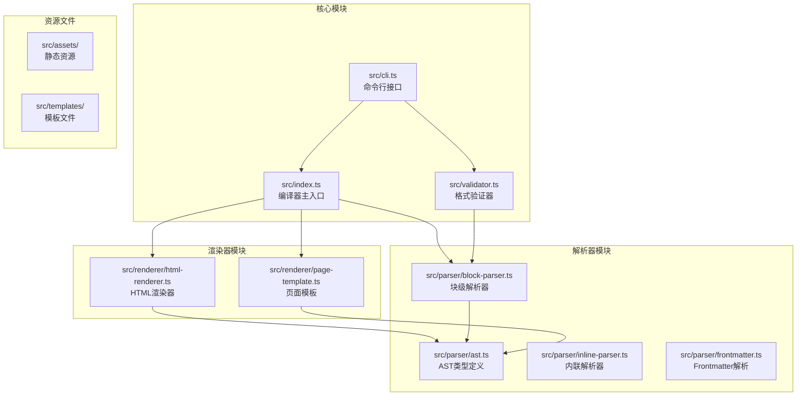
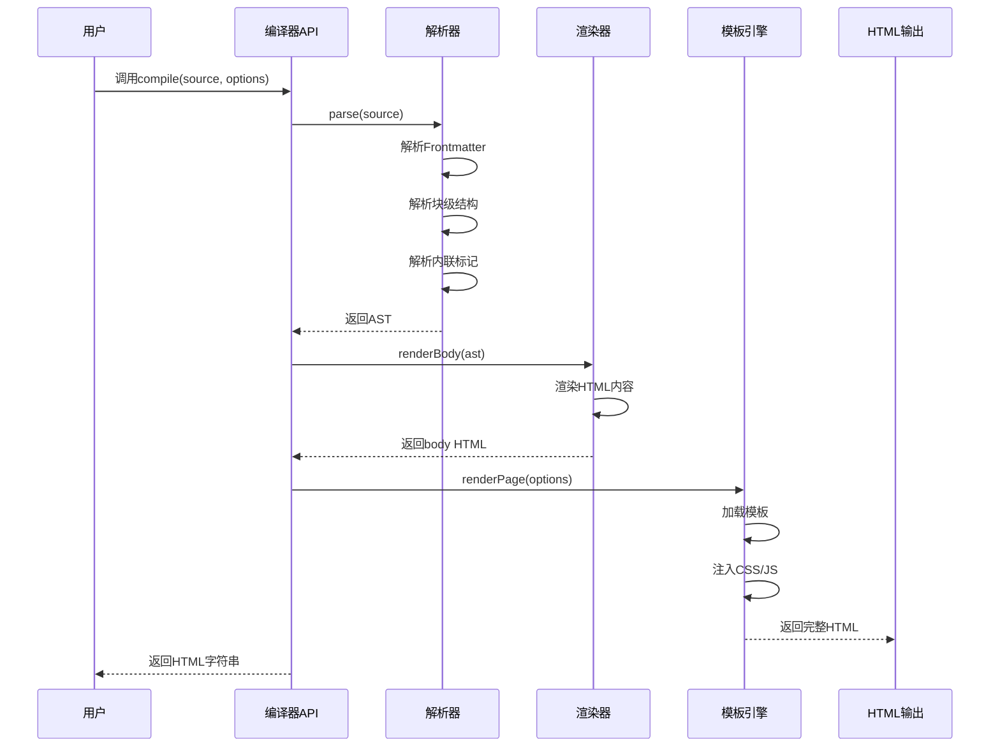
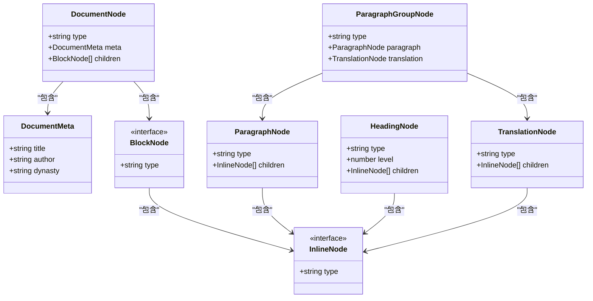
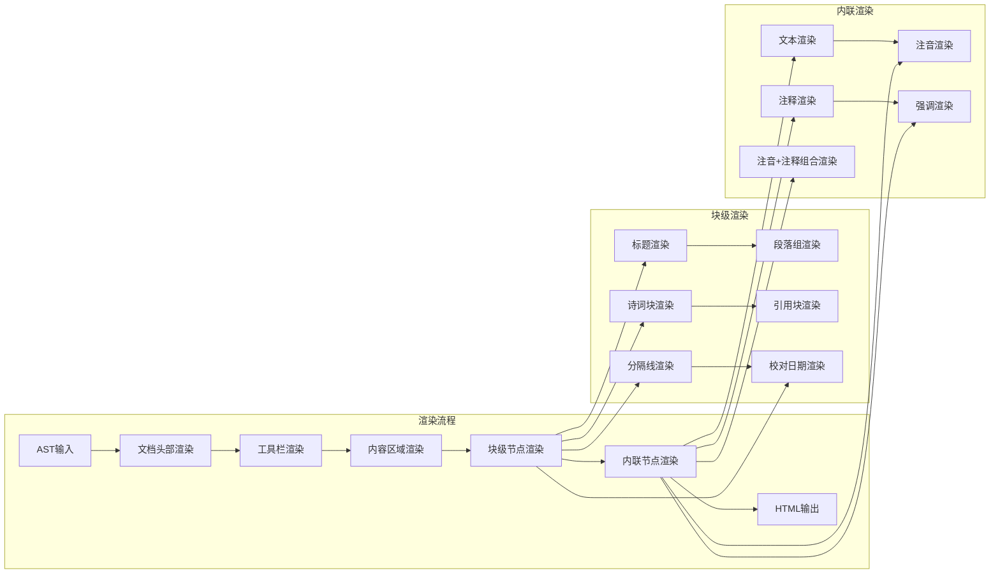
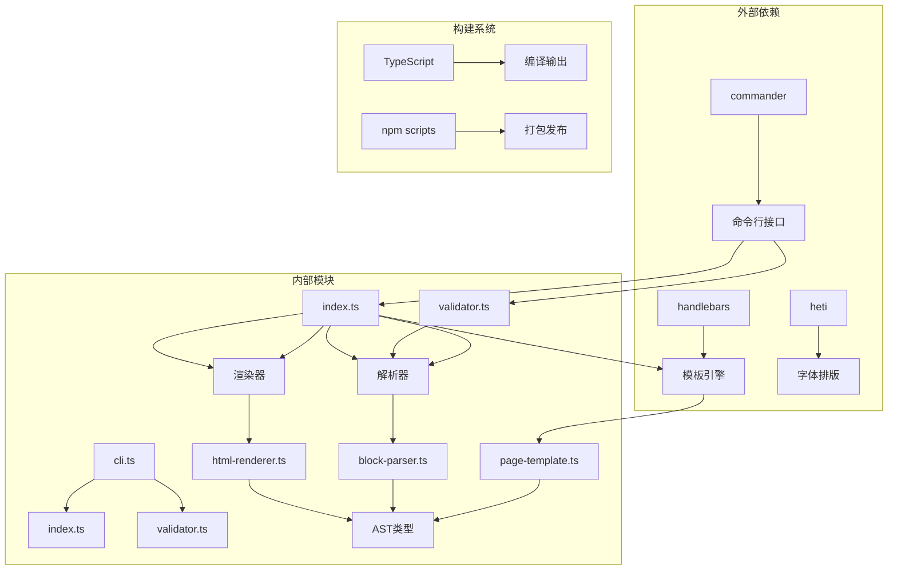

# API参考文档

<cite>
**本文档引用的文件**
- [src/index.ts](file://src/index.ts)
- [src/validator.ts](file://src/validator.ts)
- [src/parser/ast.ts](file://src/parser/ast.ts)
- [src/parser/block-parser.ts](file://src/parser/block-parser.ts)
- [src/renderer/html-renderer.ts](file://src/renderer/html-renderer.ts)
- [src/renderer/page-template.ts](file://src/renderer/page-template.ts)
- [src/cli.ts](file://src/cli.ts)
- [test/compile.test.ts](file://test/compile.test.ts)
- [test/validator.test.ts](file://test/validator.test.ts)
- [package.json](file://package.json)
- [README.md](file://README.md)
- [bin/wyw.js](file://bin/wyw.js)
</cite>

## 目录
1. [简介](#简介)
2. [项目结构](#项目结构)
3. [核心组件](#核心组件)
4. [架构概览](#架构概览)
5. [详细组件分析](#详细组件分析)
6. [依赖关系分析](#依赖关系分析)
7. [性能考虑](#性能考虑)
8. [故障排除指南](#故障排除指南)
9. [结论](#结论)
10. [附录](#附录)

## 简介

文言文标记语言编译器是一个专门用于将`.wyw`格式的文言文源文件编译为精美HTML页面的工具。该编译器支持注音标注、注释、现代文翻译、诗词围栏等多种文言文阅读辅助功能，旨在为用户提供沉浸式的古典文学阅读体验。

## 项目结构

该项目采用模块化设计，主要包含以下核心模块：



**图表来源**
- [src/index.ts:1-57](file://src/index.ts#L1-L57)
- [src/validator.ts:1-838](file://src/validator.ts#L1-L838)
- [src/cli.ts:1-182](file://src/cli.ts#L1-L182)

**章节来源**
- [src/index.ts:1-57](file://src/index.ts#L1-L57)
- [src/validator.ts:1-838](file://src/validator.ts#L1-L838)
- [src/cli.ts:1-182](file://src/cli.ts#L1-L182)

## 核心组件

### 编译器主API

编译器提供了简洁而强大的公共API，主要包括以下核心功能：

#### compile函数

`compile`函数是编译器的核心入口，负责将`.wyw`源文本转换为完整的HTML页面。

**函数签名**
```typescript
export function compile(source: string, options?: CompileOptions): string
```

**参数说明**

| 参数名 | 类型 | 必填 | 默认值 | 描述 |
|--------|------|------|--------|------|
| source | string | 是 | - | 要编译的`.wyw`源文本 |
| options | CompileOptions | 否 | {} | 编译选项对象 |

**CompileOptions接口**

| 属性名 | 类型 | 必填 | 默认值 | 描述 |
|--------|------|------|--------|------|
| inline | boolean | 否 | false | 是否将CSS/JS内联到HTML中 |
| assetsPath | string | 否 | "" | 静态资源路径前缀 |
| theme | string | 否 | "auto" | 默认主题模式 |
| showTranslation | boolean | 否 | true | 是否默认显示译文 |

**返回值**
- 类型：string
- 描述：完整的HTML页面字符串

**使用示例**
```typescript
// 基础编译
const html = compile(source);

// 内联资源编译
const inlineHtml = compile(source, { inline: true });

// 自定义主题编译
const themedHtml = compile(source, { theme: "dark" });
```

**章节来源**
- [src/index.ts:7-28](file://src/index.ts#L7-L28)

### 验证器API

验证器提供了全面的`.wyw`文件格式检查功能，包含多种校验规则和严格模式支持。

#### validate函数

**函数签名**
```typescript
export function validate(source: string, options?: { strict?: boolean; filePath?: string }): ValidationResult
```

**参数说明**

| 参数名 | 类型 | 必填 | 默认值 | 描述 |
|--------|------|------|--------|------|
| source | string | 是 | - | 要验证的`.wyw`源文本 |
| options | object | 否 | {} | 验证选项 |
| options.strict | boolean | 否 | false | 是否启用严格模式 |
| options.filePath | string | 否 | undefined | 文件路径信息 |

**返回值**
- 类型：ValidationResult
- 描述：包含错误、警告和统计信息的验证结果

**ValidationResult接口**

| 属性名 | 类型 | 描述 |
|--------|------|------|
| filePath | string | 文件路径（可选） |
| errors | ValidationIssue[] | 错误列表 |
| warnings | ValidationIssue[] | 警告列表 |
| stats | Stats | 统计信息（可选） |

**ValidationIssue接口**

| 属性名 | 类型 | 描述 |
|--------|------|------|
| line | number | 行号（从1开始，0表示全局错误） |
| msg | string | 错误描述信息 |

**Stats接口**

| 属性名 | 类型 | 描述 |
|--------|------|------|
| paragraphGroups | number | 段落组数量 |
| poetryBlocks | number | 诗词块数量 |
| headings | number | 标题数量 |
| annotations | number | 注释数量 |
| rubies | number | 注音数量 |

**章节来源**
- [src/validator.ts:22-52](file://src/validator.ts#L22-L52)
- [src/validator.ts:758-779](file://src/validator.ts#L758-L779)

#### Validator类

验证器类提供了面向对象的验证接口，支持严格模式切换。

**构造函数**
```typescript
constructor(strict?: boolean)
```

**方法**

| 方法名 | 参数 | 描述 |
|--------|------|------|
| error | (line: number, msg: string) | 记录错误（始终写入errors） |
| warn | (line: number, msg: string) | 记录警告（普通模式写入warnings，严格模式写入errors） |

**章节来源**
- [src/validator.ts:61-101](file://src/validator.ts#L61-L101)

## 架构概览

编译器采用分层架构设计，从源文件到最终HTML页面的完整处理流程如下：



**图表来源**
- [src/index.ts:17-28](file://src/index.ts#L17-L28)
- [src/parser/block-parser.ts:43-49](file://src/parser/block-parser.ts#L43-L49)
- [src/renderer/html-renderer.ts:20-44](file://src/renderer/html-renderer.ts#L20-L44)
- [src/renderer/page-template.ts:25-68](file://src/renderer/page-template.ts#L25-L68)

## 详细组件分析

### AST类型系统

编译器使用强类型的AST（抽象语法树）来表示`.wyw`文档结构，确保类型安全和良好的开发体验。



**图表来源**
- [src/parser/ast.ts:5-118](file://src/parser/ast.ts#L5-L118)

**章节来源**
- [src/parser/ast.ts:1-218](file://src/parser/ast.ts#L1-L218)

### 解析器工作流程

解析器采用状态机模式，能够准确识别和处理各种`.wyw`语法结构。

```mermaid
flowchart TD
Start([开始解析]) --> Init[初始化状态机]
Init --> ReadLine[读取下一行]
ReadLine --> CheckEmpty{是否为空行?}
CheckEmpty --> |是| ReadLine
CheckEmpty --> |否| CheckState{检查当前状态}
CheckState --> IDLE[IDLE状态]
CheckState --> PARAGRAPH[IN_PARAGRAPH状态]
CheckState --> TRANSLATION[IN_TRANSLATION状态]
CheckState --> FENCED[IN_FENCED状态]
CheckState --> BLOCKQUOTE[IN_BLOCKQUOTE状态]
IDLE --> CheckMarkers{检查行标记}
CheckMarkers --> |标题|#| Heading[创建标题节点]
CheckMarkers --> |译文|>>| Translation[切换到译文状态]
CheckMarkers --> |围栏|:::| Fenced[切换到围栏状态]
CheckMarkers --> |引用|>| Blockquote[切换到引用状态]
CheckMarkers --> |普通段落| Paragraph[开始段落解析]
Heading --> ReadLine
Translation --> CheckTranslation{继续译文?}
CheckTranslation --> |是| AddToBuffer[添加到译文缓冲区]
CheckTranslation --> |否| FlushTranslation[刷新译文节点]
AddToBuffer --> CheckTranslation
FlushTranslation --> ReadLine
Fenced --> CheckFenceEnd{围栏结束?}
CheckFenceEnd --> |否| ProcessFenced[处理围栏内容]
CheckFenceEnd --> |是| FlushFenced[刷新围栏节点]
ProcessFenced --> CheckFenceEnd
FlushFenced --> ReadLine
Blockquote --> CheckBlockquote{继续引用?}
CheckBlockquote --> |是| AddToQuote[添加到引用缓冲区]
CheckBlockquote --> |否| FlushQuote[刷新引用节点]
AddToQuote --> CheckBlockquote
FlushQuote --> ReadLine
Paragraph --> CheckParagraph{继续段落?}
CheckParagraph --> |是| AddToPara[添加到段落缓冲区]
CheckParagraph --> |否| FlushParagraph[刷新段落节点]
AddToPara --> CheckParagraph
FlushParagraph --> ReadLine
ReadLine --> End{文件结束?}
End --> |否| ReadLine
End --> |是| FlushRemaining[刷新剩余内容]
FlushRemaining --> GroupParagraphs[合并段落组]
GroupParagraphs --> EndParse([解析完成])
```

**图表来源**
- [src/parser/block-parser.ts:72-341](file://src/parser/block-parser.ts#L72-L341)

**章节来源**
- [src/parser/block-parser.ts:1-371](file://src/parser/block-parser.ts#L1-L371)

### 渲染器架构

渲染器负责将解析后的AST转换为最终的HTML输出，支持多种渲染模式和主题切换。



**图表来源**
- [src/renderer/html-renderer.ts:20-186](file://src/renderer/html-renderer.ts#L20-L186)
- [src/renderer/page-template.ts:25-68](file://src/renderer/page-template.ts#L25-L68)

**章节来源**
- [src/renderer/html-renderer.ts:1-251](file://src/renderer/html-renderer.ts#L1-L251)
- [src/renderer/page-template.ts:1-87](file://src/renderer/page-template.ts#L1-L87)

## 依赖关系分析

编译器的模块间依赖关系清晰明确，遵循单一职责原则：



**图表来源**
- [package.json:45-54](file://package.json#L45-L54)
- [src/index.ts:3-5](file://src/index.ts#L3-L5)
- [src/validator.ts:17](file://src/validator.ts#L17)

**章节来源**
- [package.json:1-56](file://package.json#L1-L56)

## 性能考虑

编译器在设计时充分考虑了性能优化：

### 时间复杂度
- **解析阶段**：O(n)，其中n为源文件行数
- **渲染阶段**：O(m)，其中m为AST节点总数
- **验证阶段**：O(n + m)，包含多轮扫描和统计

### 内存优化
- 使用流式处理避免一次性加载整个文件
- AST节点采用轻量级结构减少内存占用
- 缓冲区管理优化I/O操作

### 编译优化
- 支持内联模式减少HTTP请求
- 模板缓存避免重复编译
- 增量编译支持文件监控

## 故障排除指南

### 常见错误及解决方案

#### 编译错误
- **Frontmatter未闭合**：检查`---`标记是否正确配对
- **括号不匹配**：使用验证器检查语法结构
- **注音格式错误**：确保`{字|拼音}`格式正确

#### 验证器错误
- **严格模式错误**：启用`--strict`选项获取更严格的检查
- **译文配对问题**：确保每个译文都有对应的原文段落
- **诗词围栏错误**：检查`::: poetry`块的起止标记

#### 性能问题
- **大文件编译缓慢**：考虑使用内联模式减少资源加载
- **内存占用过高**：检查是否有异常大的文档结构

**章节来源**
- [src/validator.ts:104-779](file://src/validator.ts#L104-L779)
- [test/validator.test.ts:1-425](file://test/validator.test.ts#L1-425)

## 结论

文言文标记语言编译器提供了一个完整、类型安全、易于使用的API系统。其设计特点包括：

1. **模块化架构**：清晰的分层设计便于维护和扩展
2. **强类型系统**：完整的TypeScript类型定义确保开发体验
3. **全面验证**：多层次的格式检查保证文档质量
4. **灵活配置**：丰富的选项满足不同使用场景需求
5. **性能优化**：高效的算法和内存管理确保良好性能

该编译器为文言文数字化提供了坚实的技术基础，适合集成到各种教育和文化项目中。

## 附录

### TypeScript类型定义

完整的类型定义可以在以下文件中找到：
- [src/index.ts](file://src/index.ts) - 编译器API类型
- [src/validator.ts](file://src/validator.ts) - 验证器类型
- [src/parser/ast.ts](file://src/parser/ast.ts) - AST类型定义

### 集成示例

#### 基础集成
```typescript
import { compile } from 'wenyanwen';

const source = `---
title: 示例
author: 作者
dynasty: 朝代
---

正文内容，支持{注|zhù}音标注。
`;
const html = compile(source);
```

#### 高级配置
```typescript
import { compile } from 'wenyanwen';

const options = {
  inline: true,
  theme: 'dark',
  showTranslation: false
};
const html = compile(source, options);
```

#### 验证集成
```typescript
import { validate } from 'wenyanwen';

const result = validate(source, { strict: true });
if (result.errors.length > 0) {
  console.error('验证失败:', result.errors);
}
```

### 最佳实践

1. **使用验证器**：在编译前先进行格式验证
2. **合理配置**：根据部署环境选择合适的编译选项
3. **错误处理**：妥善处理编译过程中的异常情况
4. **性能监控**：关注大文件的编译性能
5. **版本兼容**：定期更新以获得最新的功能和修复