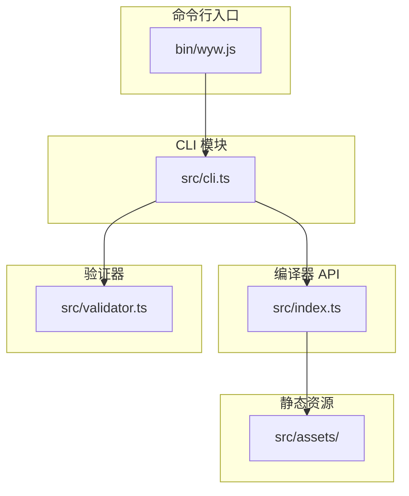
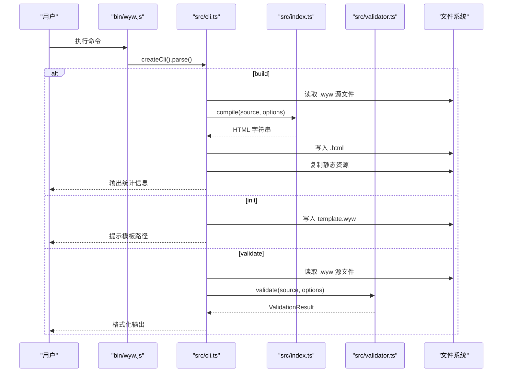
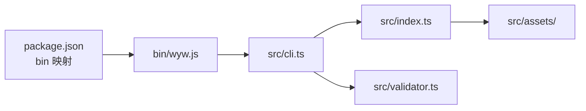

# 命令行工具参考

<cite>
**本文引用的文件**
- [bin/wyw.js](file://bin/wyw.js)
- [src/cli.ts](file://src/cli.ts)
- [src/index.ts](file://src/index.ts)
- [src/validator.ts](file://src/validator.ts)
- [src/assets/wyw.js](file://src/assets/wyw.js)
- [package.json](file://package.json)
- [README.md](file://README.md)
- [docs/syntax-guide.md](file://docs/syntax-guide.md)
- [examples/刘禹锡_陋室铭.wyw](file://examples/刘禹锡_陋室铭.wyw)
</cite>

## 目录
1. [简介](#简介)
2. [项目结构](#项目结构)
3. [核心组件](#核心组件)
4. [架构总览](#架构总览)
5. [详细组件分析](#详细组件分析)
6. [依赖关系分析](#依赖关系分析)
7. [性能考量](#性能考量)
8. [故障排查指南](#故障排查指南)
9. [结论](#结论)
10. [附录](#附录)

## 简介
本参考文档面向“文言文标记语言编译器”命令行工具（wyw/wenyanwen），系统说明所有可用的 CLI 命令、选项与参数，覆盖 build、init、validate 三大命令；详解 build 的编译选项、watch 模式、输出控制；解释 init 如何生成模板文件；提供批量处理、文件监听、主题设置等高级功能的使用方法；给出实际命令行示例与使用场景；说明错误处理机制与调试选项；并为不同用户需求提供最佳实践建议。

## 项目结构
该工具采用“入口脚本 + CLI 模块 + 编译器 API + 验证器”的分层设计，命令行入口通过打包后的 CLI 模块暴露命令，编译器 API 负责将 .wyw 源文本编译为 HTML，验证器负责格式校验与统计。

图表来源
- [bin/wyw.js:1-7](file://bin/wyw.js#L1-L7)
- [src/cli.ts:28-114](file://src/cli.ts#L28-L114)
- [src/index.ts:17-28](file://src/index.ts#L17-L28)
- [src/validator.ts:758-779](file://src/validator.ts#L758-L779)

章节来源
- [package.json:14-17](file://package.json#L14-L17)
- [README.md:110-125](file://README.md#L110-L125)

## 核心组件
- 命令行入口：bin/wyw.js 作为可执行入口，加载 dist/cli.js 并解析命令。
- CLI 模块：src/cli.ts 定义 build/init/validate 三个命令及其选项。
- 编译器 API：src/index.ts 暴露 compile(source, options) 与编译选项。
- 验证器：src/validator.ts 提供 validate(source, options) 与格式化输出。
- 静态资源：src/assets/ 下包含样式与脚本，构建时复制到输出目录。

章节来源
- [bin/wyw.js:1-7](file://bin/wyw.js#L1-L7)
- [src/cli.ts:28-114](file://src/cli.ts#L28-L114)
- [src/index.ts:7-28](file://src/index.ts#L7-L28)
- [src/validator.ts:758-838](file://src/validator.ts#L758-L838)

## 架构总览
命令行工具的执行流从入口脚本进入 CLI 模块，根据用户选择的命令调用相应逻辑：build 调用编译器 API 并复制静态资源；init 生成模板文件；validate 调用验证器并格式化输出。

图表来源
- [bin/wyw.js:3-6](file://bin/wyw.js#L3-L6)
- [src/cli.ts:43-56](file://src/cli.ts#L43-L56)
- [src/cli.ts:61-89](file://src/cli.ts#L61-L89)
- [src/cli.ts:96-111](file://src/cli.ts#L96-L111)
- [src/index.ts:17-28](file://src/index.ts#L17-L28)
- [src/validator.ts:758-838](file://src/validator.ts#L758-L838)

## 详细组件分析

### 命令：build（编译 .wyw 为 HTML）
- 描述：将一个或多个 .wyw 文件编译为 HTML，并可选择内联资源、监听文件变化、设置主题与译文默认显示。
- 参数与选项
  - 参数
    - files：一个或多个 .wyw 文件路径（支持通配符）
  - 选项
    - -o, --output <dir>：指定输出目录（默认输出到每个源文件所在目录）
    - --inline：将 CSS/JS 内联到 HTML 中（默认关闭）
    - -w, --watch：监听文件变化并自动重编译（默认关闭）
    - --theme <mode>：默认主题（auto/light/dark，默认 auto）
    - --show-translation：默认显示译文（默认开启）
    - --no-show-translation：默认隐藏译文
- 行为细节
  - 读取源文件，调用编译器 API 生成 HTML。
  - 若未选择内联，则复制静态资源（CSS/JS/图标）到输出目录。
  - 输出统计信息：段落数、注释数、注音数。
  - watch 模式下，使用文件系统监控，检测到变更后重新编译。
- 使用示例
  - 单文件编译：[README.md:40-48](file://README.md#L40-L48)
  - 指定输出目录：[README.md:43-44](file://README.md#L43-L44)
  - 批量编译：[README.md:46-47](file://README.md#L46-L47)
  - 监听模式：[src/cli.ts:39](file://src/cli.ts#L39)
  - 主题设置：[src/cli.ts:40](file://src/cli.ts#L40)
  - 译文默认显示/隐藏：[src/cli.ts:41-42](file://src/cli.ts#L41-L42)
- 编译选项与实现
  - 编译选项接口：CompileOptions（inline、assetsPath、theme、showTranslation）
  - 实现位置：[src/index.ts:7-12](file://src/index.ts#L7-L12)，[src/index.ts:17-28](file://src/index.ts#L17-L28)
- 输出控制
  - 输出目录：若指定 --output 则写入该目录，否则写入源文件所在目录。
  - 静态资源复制：非内联模式时复制 heti.css、wyw.css、wyw.js、favicon.png。
  - 统计输出：段落数、注释数、注音数。
- watch 模式
  - 使用文件系统监控，间隔 500ms 检测变更，触发重编译。
  - 控制台输出“检测到变化”提示。
- 错误处理
  - 文件读取失败、编译异常、写入失败均会输出错误信息并继续处理其他文件。

章节来源
- [src/cli.ts:33-56](file://src/cli.ts#L33-L56)
- [src/cli.ts:116-164](file://src/cli.ts#L116-L164)
- [src/index.ts:7-28](file://src/index.ts#L7-L28)
- [README.md:50-60](file://README.md#L50-L60)

### 命令：init（生成模板 .wyw 文件）
- 描述：创建一个名为 template.wyw 的模板文件，包含基本语法示例（Frontmatter、标题、正文、译文、注音、注释、诗词围栏等）。
- 行为细节
  - 写入模板内容到当前工作目录下的 template.wyw。
  - 输出提示信息，告知模板文件路径。
- 使用示例
  - [README.md:84-88](file://README.md#L84-L88)
- 适用场景
  - 新手快速上手，参考模板语法。
  - 作为项目初始骨架，减少手写成本。

章节来源
- [src/cli.ts:58-89](file://src/cli.ts#L58-L89)
- [README.md:80-88](file://README.md#L80-L88)

### 命令：validate（验证 .wyw 文件格式）
- 描述：对 .wyw 文件进行多维度格式校验，输出错误与提示，并提供解析统计。
- 参数与选项
  - 参数
    - file：待校验的 .wyw 文件路径
  - 选项
    - --strict：将所有提示升级为错误（严格模式）
- 校验规则（概览）
  - Frontmatter 完整性与字段检查
  - 括号与着重标记配对检查
  - 注音、注释、注音+注释组合的语义校验
  - 诗词围栏块结构检查
  - 译文与原文配对检查
  - 解析器深度校验（AST 统计）
- 输出
  - 格式化文本：包含文件路径、错误/提示数量、按行号排序的列表、统计信息。
  - 退出码：存在错误时返回 1，否则返回 0。
- 使用示例
  - [README.md:39-48](file://README.md#L39-L48)
- 严格模式
  - 启用 --strict 后，所有警告都会被视为错误，适合 CI/预提交等严格场景。

章节来源
- [src/cli.ts:91-111](file://src/cli.ts#L91-L111)
- [src/validator.ts:758-838](file://src/validator.ts#L758-L838)
- [README.md:35-77](file://README.md#L35-L77)

### 编译器 API（compile）
- 接口
  - compile(source, options): string
  - CompileOptions：inline、assetsPath、theme、showTranslation
- 行为
  - 解析源文本为 AST，渲染正文，再渲染完整页面（含 meta、主题、译文默认状态等）。
- 与 CLI 的关系
  - CLI 的 build 命令通过调用 compile 并写入 HTML 文件完成编译。

章节来源
- [src/index.ts:7-28](file://src/index.ts#L7-L28)

### 验证器 API（validate/formatValidationResult）
- 接口
  - validate(source, options): ValidationResult
  - formatValidationResult(result): string
- 行为
  - 执行多规则校验，收集 errors/warnings，并在解析成功时返回统计信息。
  - formatValidationResult 将结果格式化为终端可读文本。
- 与 CLI 的关系
  - CLI 的 validate 命令调用 validate 并打印格式化结果。

章节来源
- [src/validator.ts:758-838](file://src/validator.ts#L758-L838)

### 静态资源与交互脚本
- 静态资源
  - 非内联模式下，构建时复制 heti.css、wyw.css、wyw.js、favicon.png 到输出目录。
- 客户端交互脚本
  - src/assets/wyw.js 提供译文显示/隐藏、字号切换、主题切换、tooltip 边界检测、键盘快捷键、Heti 标点挤压等功能。
  - 与编译器主题、译文默认显示选项配合，实现运行时偏好持久化与交互体验。

章节来源
- [src/cli.ts:138-153](file://src/cli.ts#L138-L153)
- [src/assets/wyw.js:1-204](file://src/assets/wyw.js#L1-L204)

## 依赖关系分析
- 命令行框架：使用 commander 定义命令与选项。
- 编译器：依赖解析器与渲染器模块，最终生成 HTML。
- 验证器：依赖解析器进行 AST 级统计与校验。
- 构建脚本：通过 npm scripts 完成 TypeScript 编译、静态资源复制、示例编译等。

图表来源
- [package.json:14-17](file://package.json#L14-L17)
- [bin/wyw.js:3-6](file://bin/wyw.js#L3-L6)
- [src/cli.ts:12-15](file://src/cli.ts#L12-L15)

章节来源
- [package.json:18-27](file://package.json#L18-L27)

## 性能考量
- 批量编译
  - build 支持一次传入多个文件或通配符，提高效率。
  - 建议在大型项目中按目录分批编译，避免一次性处理过多文件导致内存压力。
- 内联与静态资源
  - --inline 会增大 HTML 体积，但减少请求次数；非内联模式会复制静态资源，增加磁盘 IO。
  - 生产环境建议评估网络与缓存策略后再决定是否内联。
- 监听模式
  - watch 模式以 500ms 间隔轮询，对频繁改动的项目可能造成 CPU 占用。
  - 建议在开发阶段使用，生产构建禁用 watch。
- 验证器
  - validate 会进行多轮校验与解析器深度校验，复杂文件校验耗时较长。
  - CI 场景建议启用 --strict 以尽早发现问题。

[本节为通用指导，无需特定文件来源]

## 故障排查指南
- 常见错误与处理
  - 文件读取失败：检查文件路径是否存在、权限是否足够。
  - 编译异常：查看控制台输出的具体错误信息，确认 .wyw 语法是否符合规范。
  - 输出目录写入失败：检查目标目录权限与磁盘空间。
  - 静态资源复制失败：确认构建脚本已执行，或手动复制 src/assets 下的资源。
- 调试建议
  - 使用 validate 命令进行格式校验，结合 --strict 在本地提前发现潜在问题。
  - 在 watch 模式下观察控制台输出，定位变更引发的问题。
  - 参考示例文件与语法指南，核对语法与结构。
- 相关文件
  - 示例文件：[examples/刘禹锡_陋室铭.wyw](file://examples/刘禹锡_陋室铭.wyw)
  - 语法指南：[docs/syntax-guide.md](file://docs/syntax-guide.md)
  - 验证器输出格式：[src/validator.ts:794-838](file://src/validator.ts#L794-L838)

章节来源
- [src/cli.ts:160-163](file://src/cli.ts#L160-L163)
- [src/validator.ts:794-838](file://src/validator.ts#L794-L838)
- [README.md:91-108](file://README.md#L91-L108)

## 结论
本命令行工具提供了从模板生成、格式校验到批量编译与监听的完整工作流，结合主题与译文控制、内联与静态资源策略，能够满足从个人学习到团队协作的多种场景。建议在开发阶段充分利用 validate 与 watch，在生产阶段关注输出体积与缓存策略，并依据项目规模合理组织 .wyw 文件与输出目录。

[本节为总结性内容，无需特定文件来源]

## 附录

### 命令与选项一览
- build
  - 参数：files（.wyw 路径，支持通配符）
  - 选项：-o/--output、--inline、-w/--watch、--theme、--show-translation/--no-show-translation
- init
  - 功能：生成 template.wyw 模板文件
- validate
  - 参数：file（.wyw 路径）
  - 选项：--strict

章节来源
- [src/cli.ts:33-56](file://src/cli.ts#L33-L56)
- [src/cli.ts:58-89](file://src/cli.ts#L58-L89)
- [src/cli.ts:91-111](file://src/cli.ts#L91-L111)

### 实际使用场景与示例
- 快速入门
  - 使用 init 生成模板文件，参考语法指南完善内容。
  - 使用 validate 校验格式，确保无严重错误。
- 日常开发
  - 使用 build -w 监听文件变化，边改边看。
  - 使用 --theme 设置默认主题，--show-translation 控制译文可见性。
- 批量处理
  - 使用通配符一次性编译多个文件，指定 -o 输出到统一目录。
- 生产发布
  - 关闭 watch，按需选择 --inline 以优化加载性能。
  - 使用 --strict 在 CI 中强制通过严格校验。

章节来源
- [README.md:35-108](file://README.md#L35-L108)
- [docs/syntax-guide.md:1-250](file://docs/syntax-guide.md#L1-L250)