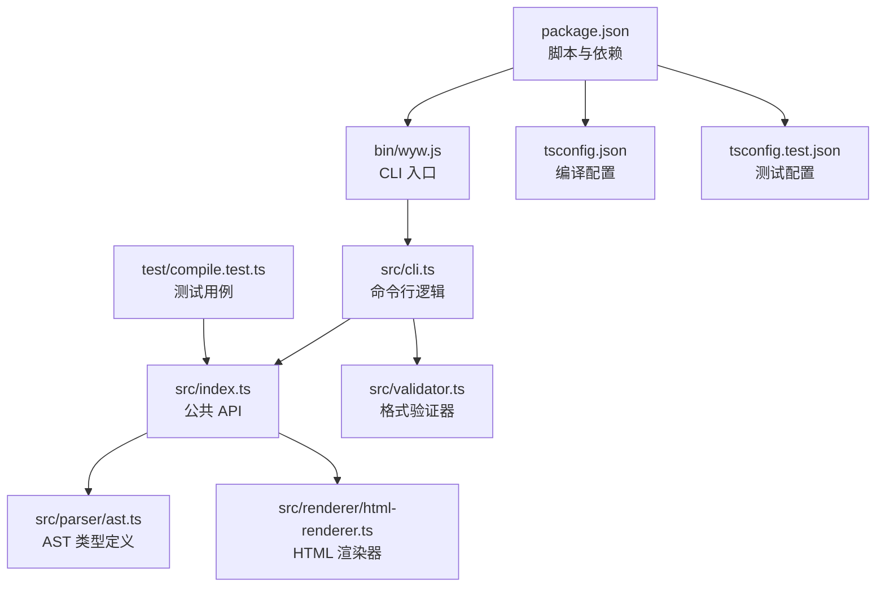
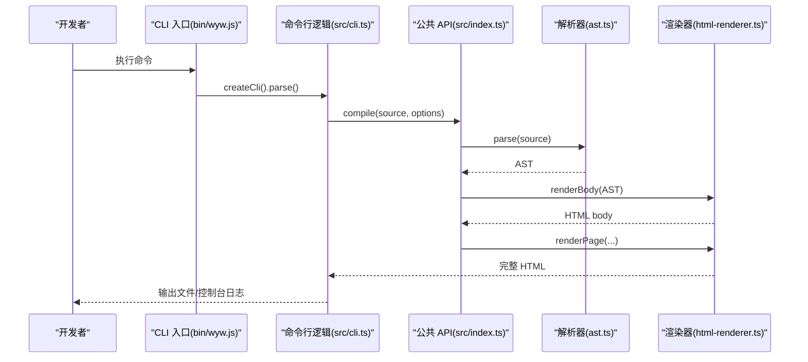
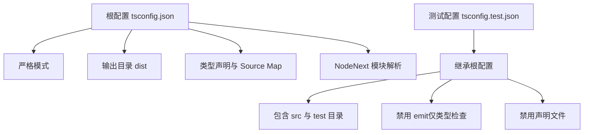
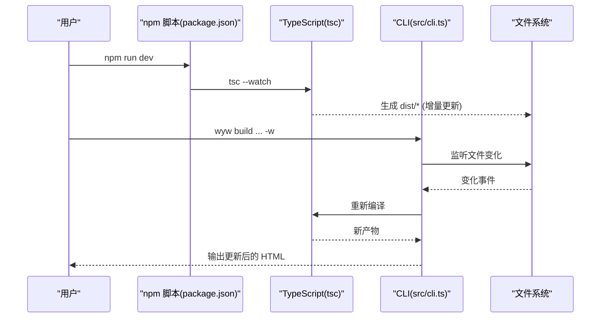
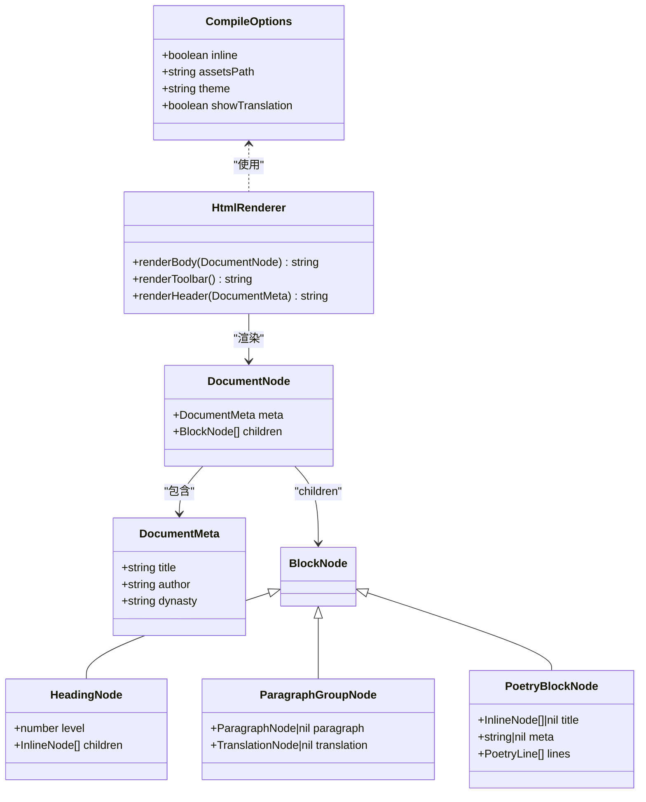
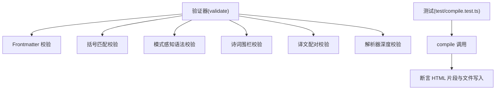
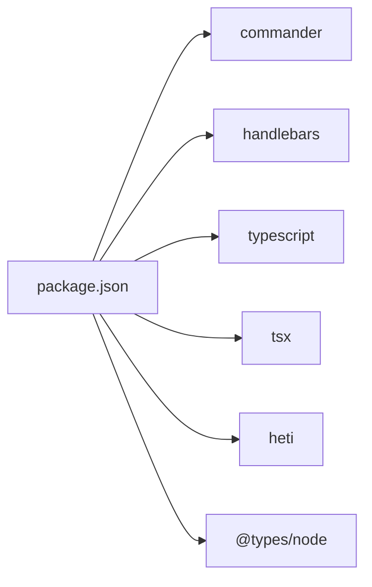

# 开发环境搭建

<cite>
**本文引用的文件**
- [package.json](file://package.json)
- [tsconfig.json](file://tsconfig.json)
- [tsconfig.test.json](file://tsconfig.test.json)
- [README.md](file://README.md)
- [.gitignore](file://.gitignore)
- [bin/wyw.js](file://bin/wyw.js)
- [src/index.ts](file://src/index.ts)
- [src/cli.ts](file://src/cli.ts)
- [src/parser/ast.ts](file://src/parser/ast.ts)
- [src/renderer/html-renderer.ts](file://src/renderer/html-renderer.ts)
- [src/validator.ts](file://src/validator.ts)
- [test/compile.test.ts](file://test/compile.test.ts)
</cite>

## 目录
1. [引言](#引言)
2. [项目结构](#项目结构)
3. [核心组件](#核心组件)
4. [架构总览](#架构总览)
5. [详细组件分析](#详细组件分析)
6. [依赖关系分析](#依赖关系分析)
7. [性能注意事项](#性能注意事项)
8. [故障排查指南](#故障排查指南)
9. [结论](#结论)
10. [附录](#附录)

## 引言
本指南面向参与文言文编译器项目的开发者，提供从零搭建本地开发环境的完整流程，涵盖 Node.js 版本要求、依赖安装、TypeScript 编译与测试配置差异、本地开发工作流（代码格式化、类型检查、热重载）、IDE/编辑器配置建议以及常见问题排查。目标是帮助你在最短时间内完成环境准备并高效开展开发。

## 项目结构
该项目采用模块化的 TypeScript 源码组织，CLI 入口位于 bin 目录，核心编译器 API 位于 src 目录，测试位于 test 目录，构建脚本与类型配置位于根目录。

图表来源
- [bin/wyw.js:1-7](file://bin/wyw.js#L1-L7)
- [src/cli.ts:1-182](file://src/cli.ts#L1-L182)
- [src/index.ts:1-57](file://src/index.ts#L1-L57)
- [src/parser/ast.ts:1-218](file://src/parser/ast.ts#L1-L218)
- [src/renderer/html-renderer.ts:1-251](file://src/renderer/html-renderer.ts#L1-L251)
- [src/validator.ts:1-838](file://src/validator.ts#L1-L838)
- [package.json:1-56](file://package.json#L1-L56)
- [tsconfig.json:1-19](file://tsconfig.json#L1-L19)
- [tsconfig.test.json:1-13](file://tsconfig.test.json#L1-L13)
- [test/compile.test.ts:1-210](file://test/compile.test.ts#L1-L210)

章节来源
- [README.md:110-125](file://README.md#L110-L125)
- [package.json:18-27](file://package.json#L18-L27)

## 核心组件
- CLI 入口与命令行逻辑：负责解析用户输入、触发编译、文件监听与输出管理。
- 编译器公共 API：提供 compile 接口与导出的类型，作为库的核心能力。
- 解析器与渲染器：解析 AST 并渲染为 HTML，支持注音、注释、译文、诗词等特性。
- 验证器：对 .wyw 文件进行多维度格式校验，支持严格模式。
- 测试：基于 Node.js 测试框架的单元测试，覆盖编译输出与示例文件。

章节来源
- [src/cli.ts:28-114](file://src/cli.ts#L28-L114)
- [src/index.ts:7-33](file://src/index.ts#L7-L33)
- [src/renderer/html-renderer.ts:20-44](file://src/renderer/html-renderer.ts#L20-L44)
- [src/validator.ts:758-779](file://src/validator.ts#L758-L779)
- [test/compile.test.ts:14-94](file://test/compile.test.ts#L14-L94)

## 架构总览
下图展示了从 CLI 到编译器 API、解析器与渲染器的整体调用链路，以及测试驱动的验证流程。

图表来源
- [bin/wyw.js:1-7](file://bin/wyw.js#L1-L7)
- [src/cli.ts:116-164](file://src/cli.ts#L116-L164)
- [src/index.ts:17-28](file://src/index.ts#L17-L28)
- [src/parser/ast.ts:1-218](file://src/parser/ast.ts#L1-L218)
- [src/renderer/html-renderer.ts:20-44](file://src/renderer/html-renderer.ts#L20-L44)

## 详细组件分析

### TypeScript 编译与测试配置差异
- 根配置（tsconfig.json）：面向生产构建，启用严格模式、声明文件生成、Source Map、NodeNext 模块解析，输出至 dist 目录。
- 测试配置（tsconfig.test.json）：继承根配置，扩展包含测试目录，关闭 emit 并禁用声明文件，适配 Node.js 测试运行环境。

图表来源
- [tsconfig.json:1-19](file://tsconfig.json#L1-L19)
- [tsconfig.test.json:1-13](file://tsconfig.test.json#L1-L13)

章节来源
- [tsconfig.json:2-17](file://tsconfig.json#L2-L17)
- [tsconfig.test.json:2-12](file://tsconfig.test.json#L2-L12)

### CLI 与开发工具链
- CLI 入口：bin/wyw.js 作为可执行脚本，加载 dist/cli.js 并解析参数。
- 开发脚本：package.json 提供 build、dev、test、build:examples 等脚本，配合 tsx 运行测试。
- 监听与热重载：CLI 支持 -w/--watch 选项，监听文件变化并自动重编译。

图表来源
- [package.json:24](file://package.json#L24)
- [src/cli.ts:46-56](file://src/cli.ts#L46-L56)
- [bin/wyw.js:1-7](file://bin/wyw.js#L1-L7)

章节来源
- [bin/wyw.js:1-7](file://bin/wyw.js#L1-L7)
- [src/cli.ts:28-56](file://src/cli.ts#L28-L56)
- [package.json:18-27](file://package.json#L18-L27)

### 编译器 API 与渲染流程
- compile 接口：接收源文本与选项，调用解析器生成 AST，再由渲染器生成 HTML。
- 渲染器：根据 AST 类型分支渲染标题、段落、诗词、引用、分隔线与校对日期等。
- 类型安全：AST 类型集中定义于 ast.ts，供解析器与渲染器共享。

图表来源
- [src/index.ts:7-33](file://src/index.ts#L7-L33)
- [src/parser/ast.ts:55-118](file://src/parser/ast.ts#L55-L118)
- [src/renderer/html-renderer.ts:20-44](file://src/renderer/html-renderer.ts#L20-L44)

章节来源
- [src/index.ts:17-28](file://src/index.ts#L17-L28)
- [src/renderer/html-renderer.ts:80-97](file://src/renderer/html-renderer.ts#L80-L97)
- [src/parser/ast.ts:132-188](file://src/parser/ast.ts#L132-L188)

### 验证器与测试
- 验证器：提供 validate 与 formatValidationResult，支持严格模式，覆盖 Frontmatter、括号匹配、注音/注释/注音+注释、诗词围栏、译文配对与解析器深度校验。
- 测试：compile.test.ts 使用 Node.js 测试框架，断言编译输出、元数据、注音/注释、译文与内联资源等。

图表来源
- [src/validator.ts:758-779](file://src/validator.ts#L758-L779)
- [test/compile.test.ts:14-94](file://test/compile.test.ts#L14-L94)

章节来源
- [src/validator.ts:104-179](file://src/validator.ts#L104-L179)
- [src/validator.ts:182-259](file://src/validator.ts#L182-L259)
- [src/validator.ts:262-548](file://src/validator.ts#L262-L548)
- [src/validator.ts:551-610](file://src/validator.ts#L551-L610)
- [src/validator.ts:613-675](file://src/validator.ts#L613-L675)
- [src/validator.ts:678-739](file://src/validator.ts#L678-L739)
- [test/compile.test.ts:14-94](file://test/compile.test.ts#L14-L94)

## 依赖关系分析
- 运行时依赖：commander（命令行解析）、handlebars（模板渲染）。
- 开发依赖：@types/node（类型声明）、heti（排版增强）、tsx（测试导入）、typescript（编译器）。
- 构建与脚本：postinstall 复制静态资源；build 生成 dist；dev 监听；test 使用 tsx 导入运行；build:examples 一键编译示例。

图表来源
- [package.json:45-54](file://package.json#L45-L54)

章节来源
- [package.json:18-27](file://package.json#L18-L27)
- [package.json:45-54](file://package.json#L45-L54)

## 性能注意事项
- 编译监听：使用 tsc --watch 与 CLI -w 实现增量编译与文件变更监听，减少全量构建时间。
- 测试运行：tsconfig.test.json 关闭 emit，仅做类型检查，结合 tsx 导入，提升测试启动速度。
- 资源复制：非内联模式下复制静态资源，注意 dist 输出目录清理与缓存策略。

[本节为通用指导，无需列出章节来源]

## 故障排查指南
- Node.js 版本不兼容
  - 现象：安装或运行时报错，提示模块解析失败或语法不支持。
  - 排查：确认 Node.js 版本满足项目脚本与 TypeScript 目标配置。
  - 参考：[package.json:18-27](file://package.json#L18-L27)，[tsconfig.json:3](file://tsconfig.json#L3)

- 依赖安装失败
  - 现象：npm install 报错，存在锁文件冲突或网络问题。
  - 排查：清理 node_modules 与锁文件，更换镜像源重试；确认 .gitignore 中未误排除 node_modules。
  - 参考：[package.json:28-33](file://package.json#L28-L33)，[.gitignore:1-41](file://.gitignore#L1-L41)

- CLI 无法执行
  - 现象：wyw 命令不可用或报错。
  - 排查：确认 bin/wyw.js 可执行权限；dist/cli.js 是否存在；package.json 的 bin 映射是否正确。
  - 参考：[bin/wyw.js:1-7](file://bin/wyw.js#L1-L7)，[package.json:14-17](file://package.json#L14-L17)

- 测试无法运行
  - 现象：npm test 报错，找不到模块或导入失败。
  - 排查：确保 tsconfig.test.json 正确继承根配置；使用 tsx 导入运行测试；检查 test 目录包含关系。
  - 参考：[package.json:25](file://package.json#L25)，[tsconfig.test.json:2-12](file://tsconfig.test.json#L2-L12)，[test/compile.test.ts:1-13](file://test/compile.test.ts#L1-L13)

- 热重载无效
  - 现象：修改源码后未触发重新编译。
  - 排查：确认 npm run dev 与 CLI -w 同时启用；检查文件监听间隔与路径；清理 dist 后重试。
  - 参考：[package.json:24](file://package.json#L24)，[src/cli.ts:46-56](file://src/cli.ts#L46-L56)

- 静态资源缺失
  - 现象：非内联模式下 HTML 缺少 CSS/JS。
  - 排查：确认 postinstall 脚本复制 heti-addon.min.js 至 src/assets；构建时复制 assets 到 dist。
  - 参考：[package.json:19](file://package.json#L19)，[package.json:21](file://package.json#L21)，[src/cli.ts:139-153](file://src/cli.ts#L139-L153)

章节来源
- [package.json:18-27](file://package.json#L18-L27)
- [package.json:19](file://package.json#L19)
- [package.json:21](file://package.json#L21)
- [bin/wyw.js:1-7](file://bin/wyw.js#L1-L7)
- [package.json:14-17](file://package.json#L14-L17)
- [package.json:25](file://package.json#L25)
- [tsconfig.test.json:2-12](file://tsconfig.test.json#L2-L12)
- [src/cli.ts:46-56](file://src/cli.ts#L46-L56)
- [src/cli.ts:139-153](file://src/cli.ts#L139-L153)

## 结论
通过遵循本指南，你可以快速完成文言文编译器项目的开发环境搭建：安装 Node.js 与依赖、理解 TypeScript 编译与测试配置差异、掌握本地开发脚本与热重载机制，并在 IDE 中获得良好的类型与测试体验。遇到问题时，可依据“故障排查指南”逐项定位并解决。

[本节为总结性内容，无需列出章节来源]

## 附录

### 本地开发环境设置流程
- 安装 Node.js 与包管理器
  - 使用当前稳定 LTS 版本，确保与项目脚本兼容。
- 安装依赖
  - 执行安装命令，等待依赖下载与 postinstall 资源复制完成。
  - 参考：[package.json:18-27](file://package.json#L18-L27)
- 启动开发编译监听
  - 运行开发脚本以启用 TypeScript 监听与增量编译。
  - 参考：[package.json:24](file://package.json#L24)
- 运行测试
  - 使用测试脚本运行测试用例，观察断言结果。
  - 参考：[package.json:25](file://package.json#L25)，[test/compile.test.ts:14-94](file://test/compile.test.ts#L14-L94)
- 编译示例
  - 使用 build:examples 脚本一键编译示例文件，验证输出。
  - 参考：[package.json:22](file://package.json#L22)，[README.md:74-76](file://README.md#L74-L76)

### 代码格式化与类型检查
- 代码格式化
  - 使用编辑器的格式化插件（如 Prettier 或内置格式化），保持一致风格。
- 类型检查
  - 在 IDE 中启用 TypeScript 语言服务，确保类型错误即时可见。
  - 参考：[tsconfig.json:6](file://tsconfig.json#L6)，[tsconfig.test.json:8](file://tsconfig.test.json#L8)

### IDE/编辑器配置建议
- VS Code
  - 安装 TypeScript & JavaScript（ES6）语言特性扩展。
  - 设置默认 formatter 为 TypeScript 内置格式化器。
  - 在工作区设置中启用“TypeScript and JavaScript Language Features”以获得类型检查与智能提示。
- 其他编辑器
  - 确保启用 TypeScript 语言服务与 ESLint/Prettier 插件（如适用）。

### 常见环境问题与解决方案
- 安装依赖失败
  - 清理 node_modules、package-lock.json 与缓存后重试；检查网络与镜像源。
- CLI 命令不可用
  - 确认 bin 映射与 dist 输出；重新执行安装或构建。
- 测试导入失败
  - 确保 tsconfig.test.json 继承根配置且 noEmit 为 true；使用 tsx 导入运行。
- 热重载不生效
  - 检查监听脚本与文件路径；必要时重启监听进程。

[本节为通用指导，无需列出章节来源]