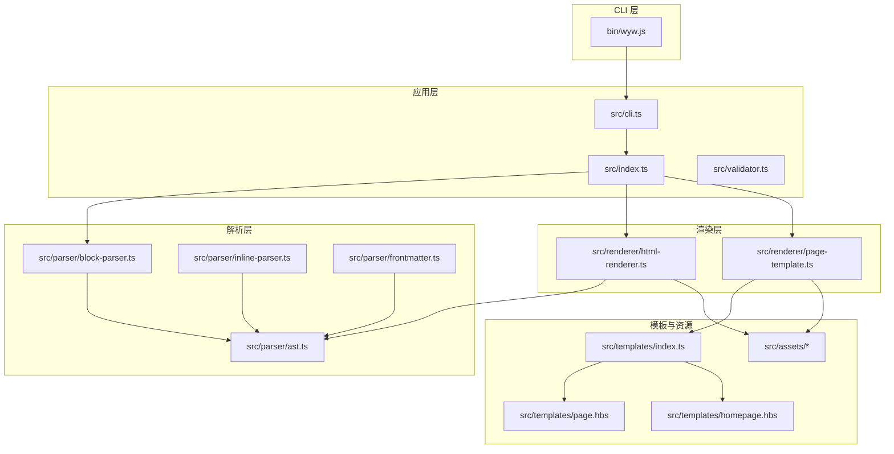
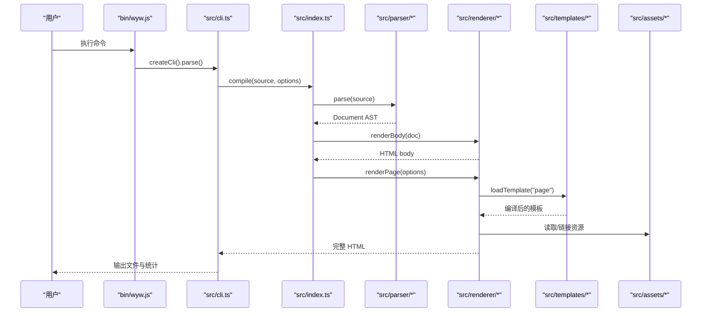
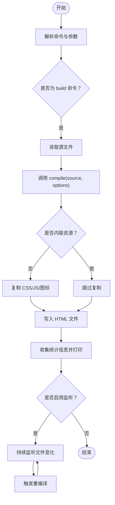
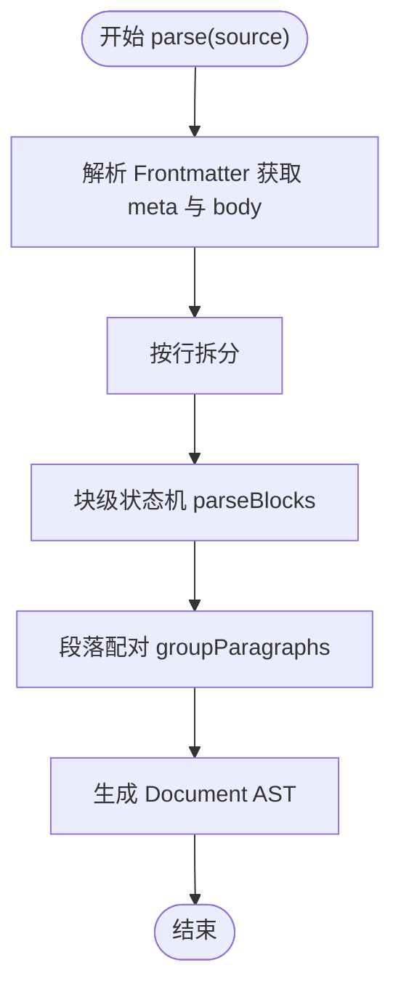
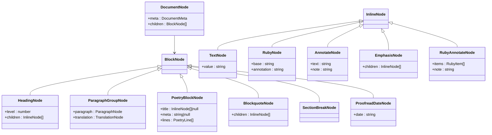
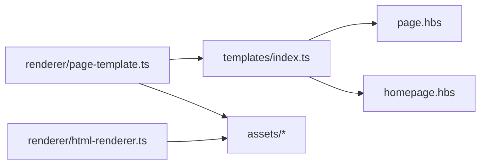
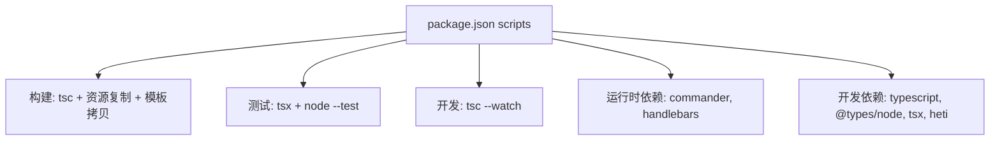

# 开发者指南

<cite>
**本文引用的文件**
- [README.md](file://README.md)
- [package.json](file://package.json)
- [tsconfig.json](file://tsconfig.json)
- [tsconfig.test.json](file://tsconfig.test.json)
- [bin/wyw.js](file://bin/wyw.js)
- [src/index.ts](file://src/index.ts)
- [src/cli.ts](file://src/cli.ts)
- [src/validator.ts](file://src/validator.ts)
- [src/parser/ast.ts](file://src/parser/ast.ts)
- [src/parser/block-parser.ts](file://src/parser/block-parser.ts)
- [src/parser/inline-parser.ts](file://src/parser/inline-parser.ts)
- [src/parser/frontmatter.ts](file://src/parser/frontmatter.ts)
- [src/renderer/html-renderer.ts](file://src/renderer/html-renderer.ts)
- [src/renderer/page-template.ts](file://src/renderer/page-template.ts)
- [src/templates/index.ts](file://src/templates/index.ts)
- [src/templates/page.hbs](file://src/templates/page.hbs)
- [src/templates/homepage.hbs](file://src/templates/homepage.hbs)
- [src/assets/wyw.css](file://src/assets/wyw.css)
- [src/assets/wyw.js](file://src/assets/wyw.js)
- [src/assets/heti.css](file://src/assets/heti.css)
- [test/compile.test.ts](file://test/compile.test.ts)
- [test/parser.test.ts](file://test/parser.test.ts)
- [test/validator.test.ts](file://test/validator.test.ts)
</cite>

## 目录
1. [简介](#简介)
2. [项目结构](#项目结构)
3. [核心组件](#核心组件)
4. [架构总览](#架构总览)
5. [详细组件分析](#详细组件分析)
6. [依赖关系分析](#依赖关系分析)
7. [性能考虑](#性能考虑)
8. [故障排查指南](#故障排查指南)
9. [结论](#结论)
10. [附录](#附录)

## 简介
本指南面向希望参与“文言文编译器”项目开发的工程师，涵盖开发环境搭建、构建流程、测试策略、项目结构与模块职责、模板系统使用与自定义、静态资源与样式定制、JavaScript 扩展、代码贡献流程与规范、测试要求，以及如何扩展现有功能与开发插件等内容。目标是帮助新成员快速上手并高质量地贡献代码。

## 项目结构
项目采用“源码分层 + 模块化”的组织方式：
- bin：CLI 入口脚本，打包后作为可执行命令分发
- src：核心源码
  - parser：解析器子系统（AST、块级解析、行内解析、Frontmatter）
  - renderer：渲染器子系统（HTML 渲染、页面模板）
  - templates：Handlebars 模板
  - assets：静态资源（CSS、JS、图标）
- test：单元测试与集成测试
- examples：示例 .wyw 文件
- docs：文档与图片
- skill/wyw-writer：写作指南与示例

**图表来源**
- [bin/wyw.js:1-7](file://bin/wyw.js#L1-L7)
- [src/index.ts:1-57](file://src/index.ts#L1-L57)
- [src/cli.ts:1-182](file://src/cli.ts#L1-L182)
- [src/parser/ast.ts:1-218](file://src/parser/ast.ts#L1-L218)
- [src/parser/block-parser.ts:1-371](file://src/parser/block-parser.ts#L1-L371)
- [src/parser/inline-parser.ts:1-99](file://src/parser/inline-parser.ts#L1-L99)
- [src/renderer/html-renderer.ts:1-251](file://src/renderer/html-renderer.ts#L1-L251)
- [src/renderer/page-template.ts:1-87](file://src/renderer/page-template.ts#L1-L87)
- [src/templates/index.ts:1-34](file://src/templates/index.ts#L1-L34)
- [src/templates/page.hbs:1-17](file://src/templates/page.hbs#L1-L17)
- [src/templates/homepage.hbs:1-202](file://src/templates/homepage.hbs#L1-L202)
- [src/assets/wyw.css:1-657](file://src/assets/wyw.css#L1-L657)
- [src/assets/wyw.js:1-204](file://src/assets/wyw.js#L1-L204)

**章节来源**
- [README.md:110-125](file://README.md#L110-L125)
- [package.json:18-33](file://package.json#L18-L33)

## 核心组件
- 公共 API（编译入口）
  - 提供 compile(source, options)、parse、renderBody、renderPage 等导出
  - 支持内联/外链资源、主题、译文可见性等选项
- CLI
  - build 命令：批量编译 .wyw 文件，支持输出目录、内联资源、监听重编译、主题与译文默认行为
  - init 命令：生成模板 .wyw 文件
  - validate 命令：格式校验与严格模式
- 解析器
  - AST 定义与工厂函数
  - 块级解析（标题、段落、译文、围栏块、引用、分隔线、校对日期）
  - 行内解析（注音、注释、着重、注音+注释组合）
  - Frontmatter 解析
- 渲染器
  - HTML 渲染器：将 AST 渲染为 HTML 片段（含工具栏、诗词块、引用、分隔线、校对日期）
  - 页面模板：生成完整 HTML 页面，支持内联/外链资源、主题、译文可见性
- 模板系统
  - Handlebars 模板加载器，缓存编译后的模板
  - 页面模板 page.hbs；站点主页模板 homepage.hbs
- 静态资源与交互
  - wyw.css：主题、字号、布局、注音、注释、工具栏、响应式、打印样式
  - wyw.js：译文开关、字号切换、主题切换、Tooltip 边界检测、键盘快捷键、Heti 插件初始化
  - heti.css：排版基础样式

**章节来源**
- [src/index.ts:7-33](file://src/index.ts#L7-L33)
- [src/cli.ts:28-114](file://src/cli.ts#L28-L114)
- [src/parser/ast.ts:3-218](file://src/parser/ast.ts#L3-L218)
- [src/parser/block-parser.ts:43-49](file://src/parser/block-parser.ts#L43-L49)
- [src/parser/inline-parser.ts:62-99](file://src/parser/inline-parser.ts#L62-L99)
- [src/renderer/html-renderer.ts:20-44](file://src/renderer/html-renderer.ts#L20-L44)
- [src/renderer/page-template.ts:25-68](file://src/renderer/page-template.ts#L25-L68)
- [src/templates/index.ts:18-30](file://src/templates/index.ts#L18-L30)
- [src/templates/page.hbs:1-17](file://src/templates/page.hbs#L1-L17)
- [src/assets/wyw.css:1-657](file://src/assets/wyw.css#L1-L657)
- [src/assets/wyw.js:1-204](file://src/assets/wyw.js#L1-L204)

## 架构总览
编译流程从 CLI 入手，调用公共 API，内部依次完成 Frontmatter 解析、块级解析、段落配对、行内解析，再由 HTML 渲染器生成 body，最后通过页面模板生成完整 HTML，并按需复制或内联静态资源。

**图表来源**
- [bin/wyw.js:1-7](file://bin/wyw.js#L1-L7)
- [src/cli.ts:116-164](file://src/cli.ts#L116-L164)
- [src/index.ts:17-28](file://src/index.ts#L17-L28)
- [src/parser/block-parser.ts:43-49](file://src/parser/block-parser.ts#L43-L49)
- [src/renderer/html-renderer.ts:20-44](file://src/renderer/html-renderer.ts#L20-L44)
- [src/renderer/page-template.ts:25-68](file://src/renderer/page-template.ts#L25-L68)
- [src/templates/index.ts:18-30](file://src/templates/index.ts#L18-L30)

## 详细组件分析

### CLI 组件分析
- 命令定义与参数
  - build：文件列表、输出目录、内联、监听、主题、译文默认行为
  - init：生成 template.wyw
  - validate：严格模式与结果输出
- 文件处理
  - 读取源文件，调用 compile，写入 HTML
  - 非内联模式复制 CSS/JS/图标至输出目录
  - 统计段落数、注释数、注音数并打印
- 监听模式
  - 使用 fs.watchFile 监控文件变化，触发增量重编译

**图表来源**
- [src/cli.ts:28-114](file://src/cli.ts#L28-L114)
- [src/cli.ts:116-164](file://src/cli.ts#L116-L164)

**章节来源**
- [src/cli.ts:28-182](file://src/cli.ts#L28-L182)

### 解析器组件分析
- AST 类型与工厂
  - 文档元数据、块级节点（标题、段落组、诗词块、引用、分隔线、校对日期）、行内节点（文本、注音、注释、着重、注音+注释组合）
- 块级解析（有限状态机）
  - 状态：IDLE、IN_PARAGRAPH、IN_TRANSLATION、IN_FENCED、IN_BLOCKQUOTE
  - 处理规则：标题、译文、引用、围栏块、分隔线、校对日期、段落合并
  - 结果：RawBlockNode → groupParagraphs → BlockNode
- 行内解析（优先级匹配）
  - 注音+注释组合、注音、注释、着重
  - 递归解析嵌套内联结构

**图表来源**
- [src/parser/block-parser.ts:43-49](file://src/parser/block-parser.ts#L43-L49)
- [src/parser/ast.ts:132-218](file://src/parser/ast.ts#L132-L218)

**章节来源**
- [src/parser/ast.ts:3-218](file://src/parser/ast.ts#L3-L218)
- [src/parser/block-parser.ts:72-371](file://src/parser/block-parser.ts#L72-L371)
- [src/parser/inline-parser.ts:62-99](file://src/parser/inline-parser.ts#L62-L99)

### 渲染器组件分析
- HTML 渲染器
  - 渲染 header（当不含带标题的诗词块时）、工具栏、正文内容
  - 块级渲染：标题、段落组（含译文）、诗词块、引用、分隔线、校对日期
  - 行内渲染：文本、注音（ruby）、注释（tooltip）、注音+注释组合、着重
  - HTML/属性转义
- 页面模板
  - 根据 inline 选项选择内联或外链资源
  - 生成完整 HTML，注入主题、文章类名、body、CSS/JS 标签

**图表来源**
- [src/parser/ast.ts:55-118](file://src/parser/ast.ts#L55-L118)
- [src/parser/ast.ts:13-51](file://src/parser/ast.ts#L13-L51)

**章节来源**
- [src/renderer/html-renderer.ts:20-251](file://src/renderer/html-renderer.ts#L20-L251)
- [src/renderer/page-template.ts:25-87](file://src/renderer/page-template.ts#L25-L87)

### 模板系统与静态资源
- 模板加载
  - 模板缓存，避免重复编译
  - 支持注册自定义 Handlebars Helper（通过导出的 Handlebars 实例）
- 页面模板
  - 支持主题、文章类名、body、CSS/JS 标签注入
- 静态资源
  - wyw.css：主题变量、字号档位、布局、注音/注释、工具栏、响应式、打印样式
  - wyw.js：译文开关、字号切换、主题切换、Tooltip 对齐、键盘快捷键、Heti 初始化
  - heti.css：排版基础样式

**图表来源**
- [src/templates/index.ts:18-30](file://src/templates/index.ts#L18-L30)
- [src/templates/page.hbs:1-17](file://src/templates/page.hbs#L1-17)
- [src/renderer/page-template.ts:41-57](file://src/renderer/page-template.ts#L41-L57)
- [src/assets/wyw.css:1-657](file://src/assets/wyw.css#L1-L657)
- [src/assets/wyw.js:1-204](file://src/assets/wyw.js#L1-L204)

**章节来源**
- [src/templates/index.ts:18-34](file://src/templates/index.ts#L18-L34)
- [src/renderer/page-template.ts:25-68](file://src/renderer/page-template.ts#L25-L68)
- [src/assets/wyw.css:1-657](file://src/assets/wyw.css#L1-L657)
- [src/assets/wyw.js:1-204](file://src/assets/wyw.js#L1-L204)

## 依赖关系分析
- 构建与运行
  - TypeScript 编译、测试运行、资源复制、模板拷贝
- 运行时依赖
  - commander：命令行参数解析
  - handlebars：模板引擎
- 开发依赖
  - typescript、@types/node、tsx、heti

**图表来源**
- [package.json:18-27](file://package.json#L18-L27)
- [package.json:45-54](file://package.json#L45-L54)

**章节来源**
- [package.json:18-54](file://package.json#L18-L54)

## 性能考虑
- 模板缓存
  - 模板加载器对已编译模板进行缓存，减少重复编译开销
- 内联资源
  - 适合单页场景，减少网络请求；外链资源利于复用与缓存
- 渲染优化
  - HTML/属性转义避免 XSS，同时保持渲染效率
  - 注音模式下增大行高，避免重排抖动
- 解析器优化
  - 块级解析采用有限状态机，线性扫描，时间复杂度 O(n)
  - 行内解析按优先级匹配，避免回溯

[本节为通用建议，无需特定文件引用]

## 故障排查指南
- CLI 常见问题
  - 文件读取失败：检查文件路径与权限
  - 输出目录创建失败：确认父目录权限
  - 监听模式无效：确认文件系统支持 fs.watchFile
- 编译问题
  - Frontmatter 格式错误：确保三横线分隔且键值正确
  - 围栏块未闭合：确认 :::
  - 译文与段落错配：检查 >> 与段落之间的空行
- 样式与交互
  - 主题不生效：确认 data-theme 设置与 CSS 变量
  - Tooltip 超出视口：依赖 JS 自动对齐，检查容器尺寸
  - 键盘快捷键无效：确认未在输入框中触发
- 测试问题
  - 测试失败：查看测试断言与期望输出，定位解析或渲染差异

**章节来源**
- [src/cli.ts:116-182](file://src/cli.ts#L116-L182)
- [src/renderer/page-template.ts:41-57](file://src/renderer/page-template.ts#L41-L57)
- [src/assets/wyw.js:130-178](file://src/assets/wyw.js#L130-L178)

## 结论
本指南提供了从环境搭建到功能扩展的完整开发路径。建议在贡献代码前先熟悉解析与渲染流程，掌握模板与静态资源的使用方式，并遵循测试与编码规范，确保改动的稳定性与一致性。

[本节为总结，无需特定文件引用]

## 附录

### 开发环境搭建与构建
- 安装依赖
  - 使用包管理器安装依赖
- 构建
  - 清理 dist、TypeScript 编译、复制静态资源、拷贝模板
- 开发模式
  - 监听编译，提升迭代效率
- 测试
  - 使用 tsx 与 Node 测试框架运行测试
- 示例构建
  - 构建示例文件集

**章节来源**
- [README.md:29-77](file://README.md#L29-L77)
- [package.json:18-27](file://package.json#L18-L27)

### 命令行使用与选项
- build：编译单/多文件，指定输出目录，内联资源，监听重编译，主题与译文默认行为
- init：生成模板 .wyw
- validate：格式校验，支持严格模式

**章节来源**
- [README.md:35-88](file://README.md#L35-L88)
- [src/cli.ts:28-114](file://src/cli.ts#L28-L114)

### 模板系统使用与自定义
- 使用方式
  - 通过模板加载器加载 .hbs 文件并缓存
  - 在页面模板中注入 CSS/JS 标签、主题、文章类名、body
- 自定义方法
  - 新增模板文件并在模板加载器中引用
  - 通过导出的 Handlebars 实例注册自定义 Helper
  - 在页面模板中扩展 head/body 结构

**章节来源**
- [src/templates/index.ts:18-34](file://src/templates/index.ts#L18-L34)
- [src/renderer/page-template.ts:25-68](file://src/renderer/page-template.ts#L25-L68)
- [src/templates/page.hbs:1-17](file://src/templates/page.hbs#L1-L17)

### 静态资源管理与样式定制
- 资源复制
  - 非内联模式时复制 heti.css、wyw.css、wyw.js、favicon.png
- 样式定制
  - 通过 CSS 变量控制主题、字号、行高、间距、颜色
  - 使用类名控制译文显示、字号档位、工具栏样式
- JavaScript 扩展
  - 在 wyw.js 中扩展交互行为，注意与现有事件绑定的兼容性

**章节来源**
- [src/cli.ts:138-153](file://src/cli.ts#L138-L153)
- [src/assets/wyw.css:6-68](file://src/assets/wyw.css#L6-L68)
- [src/assets/wyw.js:1-204](file://src/assets/wyw.js#L1-L204)

### 测试策略与要求
- 测试覆盖
  - 编译流程、解析器、校验器
- 运行方式
  - 使用 tsx 与 Node 测试框架
- 建议
  - 为新增功能补充单元测试，关注边界条件与错误处理

**章节来源**
- [test/compile.test.ts](file://test/compile.test.ts)
- [test/parser.test.ts](file://test/parser.test.ts)
- [test/validator.test.ts](file://test/validator.test.ts)
- [package.json:25](file://package.json#L25)

### 代码贡献流程与规范
- 流程
  - Fork 仓库 → 新建分支 → 编写代码与测试 → 提交 PR → 代码评审 → 合并
- 规范
  - TypeScript 编码风格与 ESLint 规则（如存在）
  - 提交信息清晰描述变更内容与动机
  - 保持最小改动范围，避免破坏既有行为
- 测试要求
  - 新增功能必须配套测试
  - 影响解析/渲染的变更需回归测试

[本节为通用流程与规范，无需特定文件引用]

### 扩展与插件开发指引
- 扩展解析器
  - 在 AST 中新增节点类型与工厂函数
  - 在块级/行内解析器中增加识别与处理逻辑
- 扩展渲染器
  - 在 HTML 渲染器中增加对应渲染分支
  - 在页面模板中注入必要的 CSS/JS
- 扩展模板
  - 新增 .hbs 模板并在模板加载器中引用
  - 通过 Handlebars Helper 扩展模板能力
- 扩展静态资源
  - 在 assets 中新增样式或脚本，按需内联或外链
- 注意事项
  - 保持向后兼容
  - 为新功能编写测试用例

**章节来源**
- [src/parser/ast.ts:132-218](file://src/parser/ast.ts#L132-L218)
- [src/parser/block-parser.ts:72-371](file://src/parser/block-parser.ts#L72-L371)
- [src/parser/inline-parser.ts:62-99](file://src/parser/inline-parser.ts#L62-L99)
- [src/renderer/html-renderer.ts:80-251](file://src/renderer/html-renderer.ts#L80-L251)
- [src/renderer/page-template.ts:25-68](file://src/renderer/page-template.ts#L25-L68)
- [src/templates/index.ts:18-30](file://src/templates/index.ts#L18-L30)