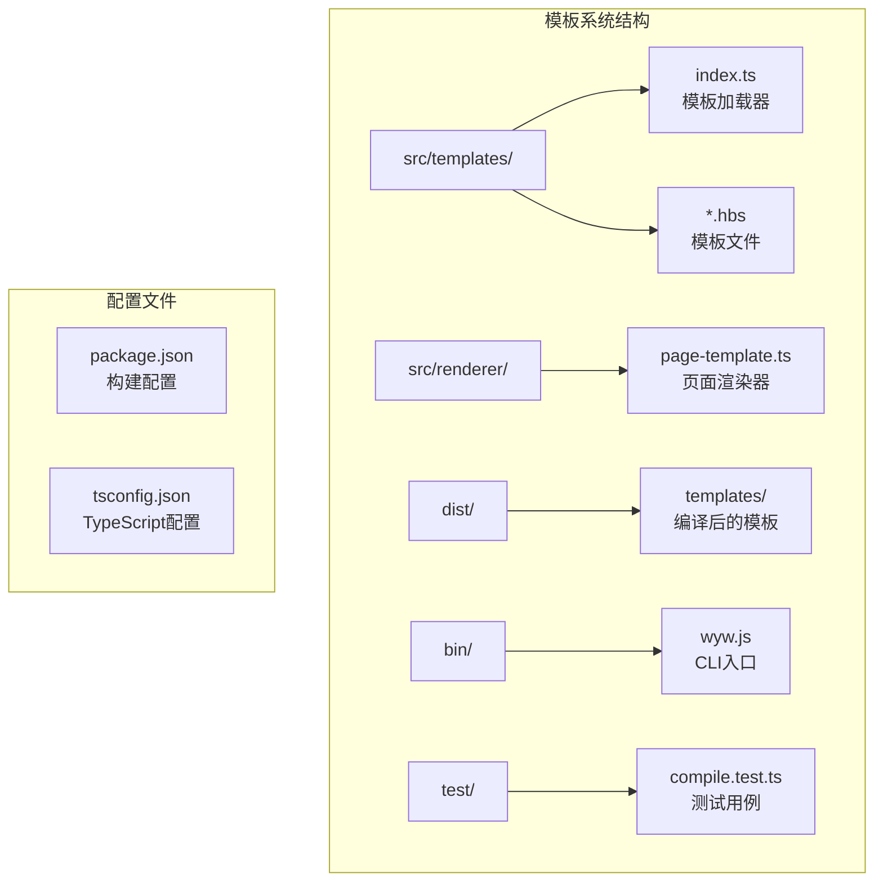
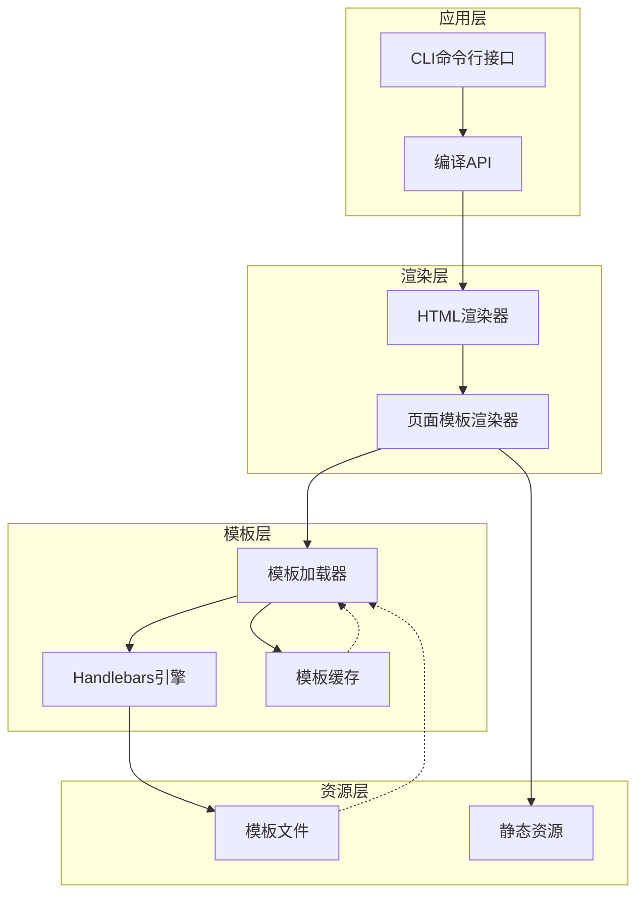
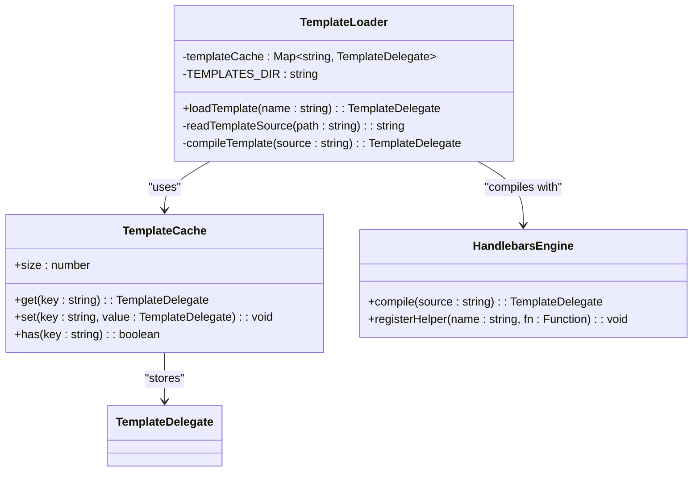
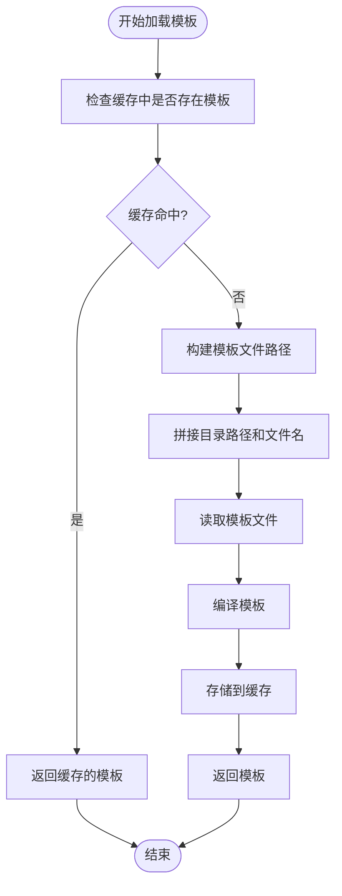
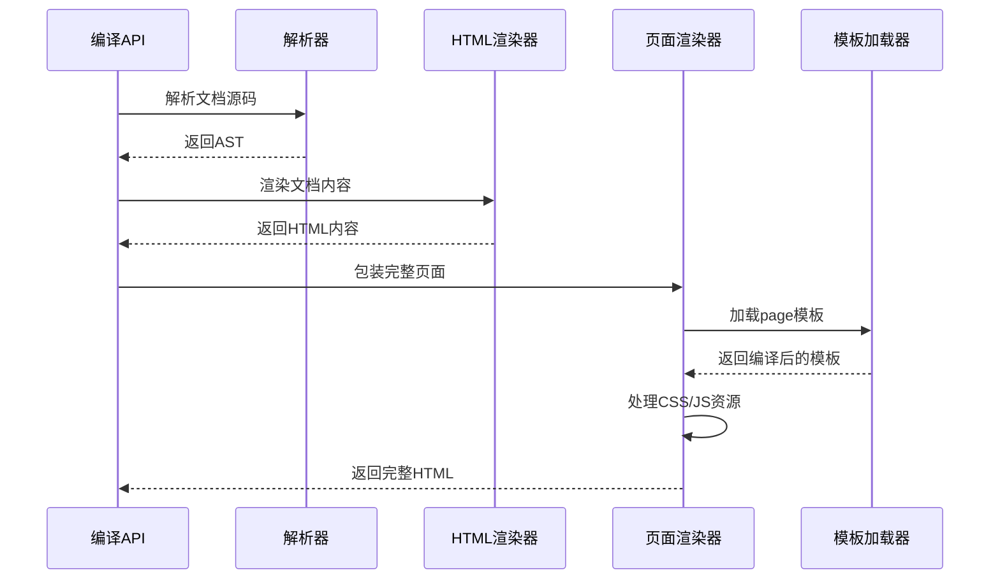
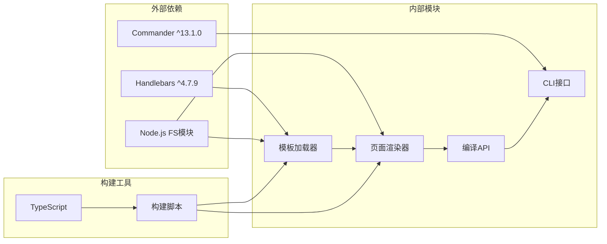

# 模板加载与缓存机制

<cite>
**本文档引用的文件**
- [src/templates/index.ts](file://src/templates/index.ts)
- [src/renderer/page-template.ts](file://src/renderer/page-template.ts)
- [src/templates/page.hbs](file://src/templates/page.hbs)
- [src/templates/homepage.hbs](file://src/templates/homepage.hbs)
- [src/index.ts](file://src/index.ts)
- [src/cli.ts](file://src/cli.ts)
- [package.json](file://package.json)
- [bin/wyw.js](file://bin/wyw.js)
- [test/compile.test.ts](file://test/compile.test.ts)
</cite>

## 目录
1. [简介](#简介)
2. [项目结构](#项目结构)
3. [核心组件](#核心组件)
4. [架构概览](#架构概览)
5. [详细组件分析](#详细组件分析)
6. [依赖关系分析](#依赖关系分析)
7. [性能考虑](#性能考虑)
8. [故障排除指南](#故障排除指南)
9. [结论](#结论)

## 简介

文言文编译器采用 Handlebars 模板引擎来生成最终的 HTML 输出。该系统实现了高效的模板加载与缓存机制，通过内存中的模板缓存避免重复的文件读取和编译操作，显著提升了编译性能。本文档深入解析了模板加载器的实现原理、缓存策略以及相关的错误处理和性能优化方案。

## 项目结构

文言文编译器的模板系统主要分布在以下关键目录中：



**图表来源**
- [src/templates/index.ts:1-34](file://src/templates/index.ts#L1-L34)
- [src/renderer/page-template.ts:1-87](file://src/renderer/page-template.ts#L1-L87)
- [package.json:18-22](file://package.json#L18-L22)

**章节来源**
- [src/templates/index.ts:1-34](file://src/templates/index.ts#L1-L34)
- [src/renderer/page-template.ts:1-87](file://src/renderer/page-template.ts#L1-L87)
- [package.json:18-22](file://package.json#L18-L22)

## 核心组件

### 模板加载器 (Template Loader)

模板加载器是整个模板系统的核心组件，负责处理模板文件的读取、编译和缓存管理。其主要职责包括：

- **文件路径解析**: 将模板名称转换为实际的文件路径
- **模板编译**: 使用 Handlebars 引擎编译模板源码
- **缓存管理**: 维护模板实例的内存缓存
- **错误处理**: 提供友好的错误信息和调试支持

### 页面渲染器 (Page Renderer)

页面渲染器负责将编译好的文档内容包装在完整的 HTML 结构中，包括：
- 元数据处理和标题生成
- CSS 和 JavaScript 资源的内联或外链处理
- 主题和显示选项的配置
- 安全字符串的处理

**章节来源**
- [src/templates/index.ts:15-30](file://src/templates/index.ts#L15-L30)
- [src/renderer/page-template.ts:22-68](file://src/renderer/page-template.ts#L22-L68)

## 架构概览

文言文编译器的模板系统采用分层架构设计，确保了模块间的清晰分离和高效协作：



**图表来源**
- [src/index.ts:14-28](file://src/index.ts#L14-L28)
- [src/renderer/page-template.ts:25-67](file://src/renderer/page-template.ts#L25-L67)
- [src/templates/index.ts:18-30](file://src/templates/index.ts#L18-L30)

## 详细组件分析

### 模板加载器实现

模板加载器采用了经典的缓存模式，通过内存中的 Map 结构实现高效的模板查找和存储：



**图表来源**
- [src/templates/index.ts:13-30](file://src/templates/index.ts#L13-L30)

#### 缓存策略分析

模板加载器使用了简单而高效的缓存策略：

1. **缓存键值策略**: 使用模板名称作为缓存键，键类型为字符串
2. **缓存结构**: 采用 ES6 Map 数据结构，提供 O(1) 的查找复杂度
3. **缓存生命周期**: 进程级缓存，随进程启动而初始化，随进程结束而销毁

#### 文件路径解析机制

模板文件的路径解析遵循以下规则：



**图表来源**
- [src/templates/index.ts:18-30](file://src/templates/index.ts#L18-L30)

**章节来源**
- [src/templates/index.ts:12-30](file://src/templates/index.ts#L12-L30)

### 页面渲染器工作流程

页面渲染器负责将编译好的文档内容包装在完整的 HTML 结构中：



**图表来源**
- [src/index.ts:17-28](file://src/index.ts#L17-L28)
- [src/renderer/page-template.ts:25-67](file://src/renderer/page-template.ts#L25-L67)
- [src/templates/index.ts:18-30](file://src/templates/index.ts#L18-L30)

**章节来源**
- [src/renderer/page-template.ts:22-68](file://src/renderer/page-template.ts#L22-L68)

### 模板文件结构

系统包含两个主要的模板文件：

#### 页面模板 (page.hbs)

页面模板定义了完整的 HTML 页面结构，包含：
- 文档类型声明和语言设置
- 元数据标签和样式表链接
- 主要内容区域
- JavaScript 脚本加载

#### 主页模板 (homepage.hbs)

主页模板提供了网站的首页展示功能，包含：
- 搜索功能和交互元素
- 作品列表的多种视图模式
- 动态内容渲染支持

**章节来源**
- [src/templates/page.hbs:1-17](file://src/templates/page.hbs#L1-L17)
- [src/templates/homepage.hbs:1-202](file://src/templates/homepage.hbs#L1-L202)

## 依赖关系分析

文言文编译器的模板系统具有清晰的依赖层次结构：



**图表来源**
- [package.json:45-47](file://package.json#L45-L47)
- [src/templates/index.ts:4-7](file://src/templates/index.ts#L4-L7)
- [src/renderer/page-template.ts:4-7](file://src/renderer/page-template.ts#L4-L7)

**章节来源**
- [package.json:45-54](file://package.json#L45-L54)
- [src/templates/index.ts:4-7](file://src/templates/index.ts#L4-L7)

## 性能考虑

### 缓存性能优化

模板加载器的缓存机制提供了显著的性能提升：

- **时间复杂度**: 缓存查找为 O(1)，避免了重复的文件 I/O 操作
- **内存使用**: 每个模板占用约 1-2KB 内存，对于典型项目影响微乎其微
- **编译成本**: 模板编译只在首次访问时进行，后续访问直接从缓存获取

### 内存管理策略

当前实现采用进程级缓存，具有以下特点：

- **生命周期**: 随进程启动而创建，随进程结束而释放
- **内存增长**: 每个模板文件会占用一定内存空间
- **清理机制**: 无主动清理，适合单次编译任务

### 构建时优化

构建脚本提供了额外的性能优化：

- **模板复制**: 在构建过程中将 `.hbs` 文件复制到 `dist/templates/` 目录
- **静态资源处理**: 自动处理 CSS 和 JavaScript 资源文件
- **类型定义生成**: 生成 TypeScript 类型定义文件

**章节来源**
- [package.json:18-22](file://package.json#L18-L22)
- [src/templates/index.ts:12-13](file://src/templates/index.ts#L12-L13)

## 故障排除指南

### 常见错误类型及解决方案

#### 模板文件不存在错误

当指定的模板名称对应的 `.hbs` 文件不存在时，会抛出文件读取异常：

**错误表现**: 文件系统错误，提示找不到模板文件
**解决方法**: 
1. 检查模板名称是否正确
2. 确认模板文件存在于 `src/templates/` 目录
3. 验证文件扩展名是否为 `.hbs`

#### 模板语法错误

Handlebars 编译阶段可能出现语法错误：

**错误表现**: 编译错误，显示具体的语法问题位置
**解决方法**:
1. 检查 Handlebars 语法是否正确
2. 验证所有 Mustache 标签都正确闭合
3. 确认自定义 Helper 函数正常注册

#### 缓存相关问题

由于使用进程级缓存，可能出现以下问题：

**问题表现**: 模板修改后未生效
**解决方法**:
1. 重启编译进程
2. 手动删除缓存（通过重新启动程序）
3. 在开发模式下禁用缓存

### 调试技巧

#### 启用详细日志

在开发环境中，可以通过以下方式增强调试能力：

1. **检查模板路径**: 验证模板文件的实际路径
2. **监控缓存状态**: 观察缓存命中率和内存使用情况
3. **验证编译结果**: 检查生成的 HTML 是否符合预期

#### 性能分析

使用 Node.js 的内置性能分析工具：

```bash
# 分析模板编译性能
node --prof bin/wyw.js build examples/*.wyw

# 查看性能报告
node --prof-process isolate-*.log
```

**章节来源**
- [src/templates/index.ts:18-30](file://src/templates/index.ts#L18-L30)
- [src/renderer/page-template.ts:25-67](file://src/renderer/page-template.ts#L25-L67)

## 结论

文言文编译器的模板加载与缓存机制展现了简洁而高效的工程实践。通过精心设计的缓存策略和清晰的模块分离，系统在保证性能的同时保持了代码的可维护性。

### 主要优势

1. **高性能**: 内存缓存避免了重复的文件 I/O 和编译操作
2. **简单可靠**: 基于标准库的实现，减少了第三方依赖
3. **易于理解**: 清晰的代码结构和明确的职责分工
4. **可扩展性**: 支持自定义 Handlebars Helper 和模板扩展

### 改进建议

1. **缓存清理机制**: 考虑添加 LRU 缓存策略以控制内存使用
2. **热重载支持**: 在开发模式下支持模板文件的热重载
3. **错误恢复**: 添加更完善的错误恢复和重试机制
4. **监控指标**: 增加缓存命中率和性能指标的监控

该模板系统为文言文编译器提供了稳定可靠的渲染基础，为后续的功能扩展和性能优化奠定了良好的技术基础。