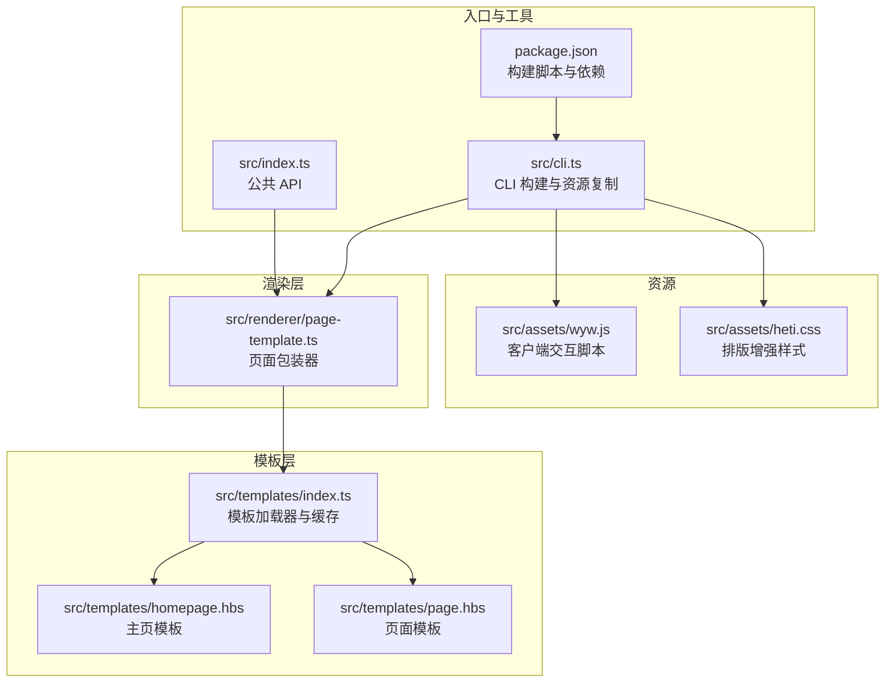
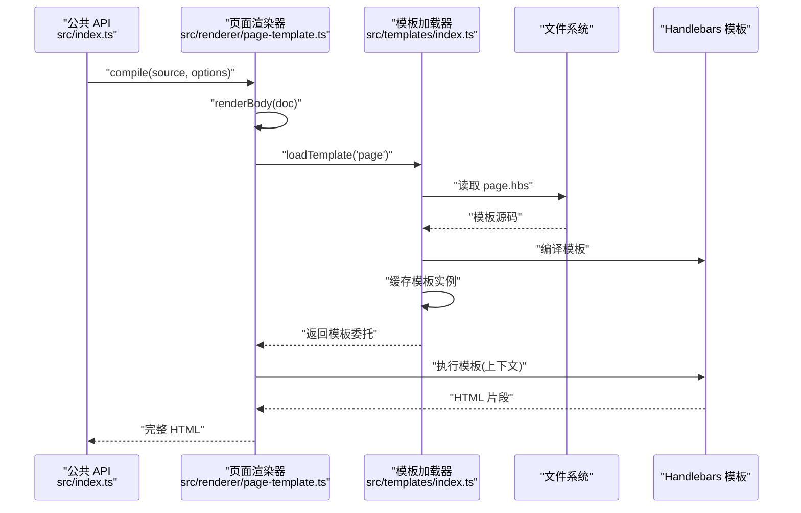
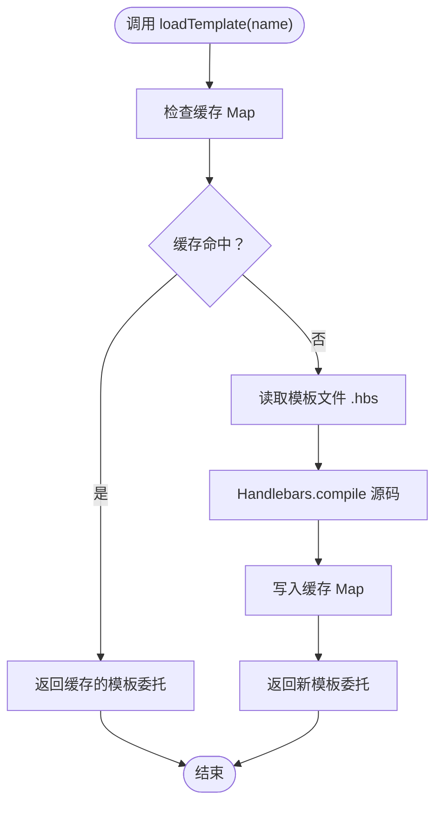
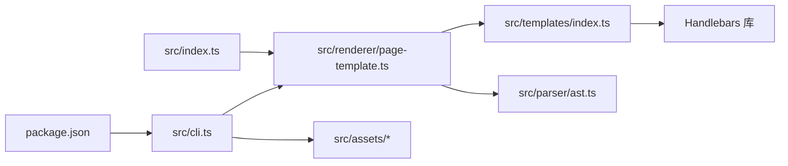

# 模板系统开发

<cite>
**本文引用的文件**
- [src/templates/index.ts](file://src/templates/index.ts)
- [src/templates/homepage.hbs](file://src/templates/homepage.hbs)
- [src/templates/page.hbs](file://src/templates/page.hbs)
- [src/renderer/page-template.ts](file://src/renderer/page-template.ts)
- [src/index.ts](file://src/index.ts)
- [src/cli.ts](file://src/cli.ts)
- [package.json](file://package.json)
- [src/assets/wyw.js](file://src/assets/wyw.js)
- [src/assets/heti.css](file://src/assets/heti.css)
- [test/compile.test.ts](file://test/compile.test.ts)
</cite>

## 目录
1. [简介](#简介)
2. [项目结构](#项目结构)
3. [核心组件](#核心组件)
4. [架构总览](#架构总览)
5. [详细组件分析](#详细组件分析)
6. [依赖关系分析](#依赖关系分析)
7. [性能考量](#性能考量)
8. [故障排查指南](#故障排查指南)
9. [结论](#结论)
10. [附录](#附录)

## 简介
本指南面向希望为文言文编译器开发和扩展模板系统的开发者，重点覆盖以下方面：
- Handlebars 模板的加载机制与缓存策略
- 模板编译过程与模板实例管理
- 自定义模板开发流程：模板语法、Helper 函数注册、数据绑定
- 页面模板与主页模板的设计差异
- 模板调试技巧与性能优化建议

## 项目结构
模板系统位于 src/templates 目录，配合渲染层 src/renderer 使用。构建脚本会将模板文件复制到 dist 输出目录，确保运行时可访问。

图表来源
- [src/templates/index.ts:1-34](file://src/templates/index.ts#L1-L34)
- [src/templates/homepage.hbs:1-202](file://src/templates/homepage.hbs#L1-L202)
- [src/templates/page.hbs:1-17](file://src/templates/page.hbs#L1-L17)
- [src/renderer/page-template.ts:1-87](file://src/renderer/page-template.ts#L1-L87)
- [src/index.ts:1-57](file://src/index.ts#L1-L57)
- [src/cli.ts:1-182](file://src/cli.ts#L1-L182)
- [package.json:1-56](file://package.json#L1-L56)
- [src/assets/wyw.js:1-204](file://src/assets/wyw.js#L1-L204)
- [src/assets/heti.css:1-180](file://src/assets/heti.css#L1-L180)

章节来源
- [src/templates/index.ts:1-34](file://src/templates/index.ts#L1-L34)
- [src/renderer/page-template.ts:1-87](file://src/renderer/page-template.ts#L1-L87)
- [src/cli.ts:116-164](file://src/cli.ts#L116-L164)
- [package.json:18-22](file://package.json#L18-L22)

## 核心组件
- 模板加载器与缓存：负责读取 .hbs 模板、编译并缓存模板实例，避免重复 IO 与编译开销。
- 页面模板：包装渲染后的文档主体内容，注入 CSS/JS、主题、标题等上下文。
- 主页模板：用于站点首页或集合页，包含搜索、标签页、词云等交互。
- 渲染器：将解析后的文档节点渲染为 HTML，并调用模板进行最终输出。
- CLI：构建流程中复制静态资源，支持内联与外链两种资源加载方式。

章节来源
- [src/templates/index.ts:15-30](file://src/templates/index.ts#L15-L30)
- [src/renderer/page-template.ts:25-68](file://src/renderer/page-template.ts#L25-L68)
- [src/templates/homepage.hbs:1-202](file://src/templates/homepage.hbs#L1-L202)
- [src/templates/page.hbs:1-17](file://src/templates/page.hbs#L1-L17)
- [src/cli.ts:116-164](file://src/cli.ts#L116-L164)

## 架构总览
模板系统采用“模板加载器 + 渲染器”的分层设计。渲染器通过模板加载器获取已编译的模板实例，再结合文档元数据与渲染后的主体内容，生成最终 HTML。

图表来源
- [src/index.ts:17-28](file://src/index.ts#L17-L28)
- [src/renderer/page-template.ts:25-68](file://src/renderer/page-template.ts#L25-L68)
- [src/templates/index.ts:18-30](file://src/templates/index.ts#L18-L30)

## 详细组件分析

### 模板加载器与缓存策略
- 加载机制
  - 通过模块路径定位模板目录，拼接模板名称与扩展名读取 .hbs 文件。
  - 使用 Handlebars.compile 对模板源码进行编译，得到模板委托。
- 缓存策略
  - 使用 Map 作为进程级缓存，键为模板名，值为编译后的模板委托。
  - 首次加载后缓存，后续直接返回缓存实例，避免重复 IO 与编译。
- 可扩展性
  - 暴露 Handlebars 实例，允许在应用启动阶段注册自定义 Helper 或 Helper 文件。

图表来源
- [src/templates/index.ts:18-30](file://src/templates/index.ts#L18-L30)

章节来源
- [src/templates/index.ts:15-34](file://src/templates/index.ts#L15-L34)

### 页面模板与主页模板的设计差异
- 页面模板 page.hbs
  - 用于单篇文档的完整页面包装，包含标题、主题、CSS/JS 注入位、文章主体等。
  - 支持内联与外链两种资源加载方式，由渲染器根据选项选择。
- 主页模板 homepage.hbs
  - 用于站点首页或集合页，包含搜索、标签页、词云等交互区域。
  - 模板中嵌入 JavaScript，用于视图切换、标签页切换与搜索功能。
  - 通过安全字符串传递预渲染的搜索数据，减少前端二次处理。

章节来源
- [src/templates/page.hbs:1-17](file://src/templates/page.hbs#L1-L17)
- [src/templates/homepage.hbs:1-202](file://src/templates/homepage.hbs#L1-L202)
- [src/renderer/page-template.ts:41-57](file://src/renderer/page-template.ts#L41-L57)

### 模板编译过程与模板实例管理
- 编译过程
  - 渲染器在生成页面时调用模板加载器获取模板委托。
  - 将标题、主题、文章类名、主体 HTML、CSS/JS 注入位等上下文对象传入模板委托执行。
  - 使用 Handlebars.SafeString 包装 HTML 片段，避免二次转义。
- 实例管理
  - 模板加载器维护进程级缓存，模板委托可被多次复用。
  - 渲染器每次渲染都会重新构造上下文，但模板委托来自缓存。

章节来源
- [src/renderer/page-template.ts:25-68](file://src/renderer/page-template.ts#L25-L68)
- [src/templates/index.ts:18-30](file://src/templates/index.ts#L18-L30)

### 自定义模板开发流程
- 模板语法
  - 使用 Handlebars 语法，支持条件、循环、表达式与安全字符串。
  - 在模板中预留注入位，如标题、CSS/JS、文章主体等。
- Helper 函数注册
  - 通过导出的 Handlebars 实例在应用启动时注册自定义 Helper。
  - 可在模板中使用 Helper 进行数据格式化、条件判断等。
- 数据绑定
  - 渲染器将上下文对象传入模板委托，模板中通过变量名访问。
  - 对于需要原样输出的 HTML 片段，使用 SafeString 包裹。

章节来源
- [src/templates/index.ts:32-33](file://src/templates/index.ts#L32-L33)
- [src/renderer/page-template.ts:60-67](file://src/renderer/page-template.ts#L60-L67)

### 模板调试技巧
- 检查模板是否被缓存
  - 首次加载后模板委托应来自缓存，可通过日志或断点确认。
- 验证上下文数据
  - 确认标题、主题、CSS/JS 注入位、文章主体等字段正确传入。
- 安全字符串使用
  - 对 HTML 片段使用 SafeString，避免 Handlebars 二次转义导致的显示异常。
- 单元测试辅助
  - 测试用例验证编译输出包含 DOCTYPE、标题、注音、注释、译文等关键片段。

章节来源
- [test/compile.test.ts:24-93](file://test/compile.test.ts#L24-L93)
- [test/compile.test.ts:106-154](file://test/compile.test.ts#L106-L154)
- [test/compile.test.ts:167-209](file://test/compile.test.ts#L167-L209)

## 依赖关系分析

图表来源
- [src/index.ts:3-6](file://src/index.ts#L3-L6)
- [src/renderer/page-template.ts:7-8](file://src/renderer/page-template.ts#L7-L8)
- [src/templates/index.ts:7](file://src/templates/index.ts#L7)
- [src/cli.ts:13-18](file://src/cli.ts#L13-L18)
- [package.json:47](file://package.json#L47)

章节来源
- [src/index.ts:3-6](file://src/index.ts#L3-L6)
- [src/renderer/page-template.ts:7-8](file://src/renderer/page-template.ts#L7-L8)
- [src/cli.ts:13-18](file://src/cli.ts#L13-L18)
- [package.json:47](file://package.json#L47)

## 性能考量
- 模板缓存
  - 使用 Map 缓存模板委托，避免重复读取与编译，显著降低 IO 与 CPU 开销。
- 资源加载策略
  - 内联模式将 CSS/JS 合并到 HTML，减少请求数量，适合单页或离线场景。
  - 外链模式分离资源，利于浏览器缓存与并行加载，适合多页面站点。
- 构建脚本
  - 构建时复制模板与静态资源到 dist，确保运行时无需额外打包步骤。
- 客户端脚本
  - 客户端脚本负责主题、字号、译文显示等交互，避免服务端重复计算。

章节来源
- [src/templates/index.ts:12-13](file://src/templates/index.ts#L12-L13)
- [src/renderer/page-template.ts:43-57](file://src/renderer/page-template.ts#L43-L57)
- [src/cli.ts:138-147](file://src/cli.ts#L138-L147)
- [package.json:20-21](file://package.json#L20-L21)

## 故障排查指南
- 模板未找到或编译失败
  - 确认模板文件存在于模板目录，且名称与调用一致。
  - 检查模板语法是否符合 Handlebars 规范。
- 上下文数据缺失
  - 检查渲染器传入的上下文字段是否完整，特别是标题、主题、CSS/JS 注入位。
- HTML 被二次转义
  - 对需要原样输出的 HTML 片段使用 SafeString 包裹。
- 构建产物缺失
  - 确认构建脚本已复制模板与静态资源到 dist 目录。
- 客户端交互异常
  - 检查客户端脚本是否正确初始化，以及 Heti 插件是否可用。

章节来源
- [src/renderer/page-template.ts:60-67](file://src/renderer/page-template.ts#L60-L67)
- [src/cli.ts:138-153](file://src/cli.ts#L138-L153)
- [package.json:20-21](file://package.json#L20-L21)

## 结论
文言文编译器的模板系统以简洁高效的模板加载器为核心，结合渲染器完成页面包装与资源注入。通过进程级缓存与灵活的资源加载策略，系统在保证可扩展性的同时兼顾性能。开发者可在此基础上扩展自定义模板与 Helper，满足更复杂的页面需求。

## 附录
- 模板文件清单
  - 页面模板：page.hbs
  - 主页模板：homepage.hbs
- 关键实现参考
  - 模板加载与缓存：[src/templates/index.ts:18-30](file://src/templates/index.ts#L18-L30)
  - 页面包装与资源注入：[src/renderer/page-template.ts:25-68](file://src/renderer/page-template.ts#L25-L68)
  - CLI 构建与资源复制：[src/cli.ts:116-164](file://src/cli.ts#L116-L164)
  - 构建脚本与依赖：[package.json:18-22](file://package.json#L18-L22)