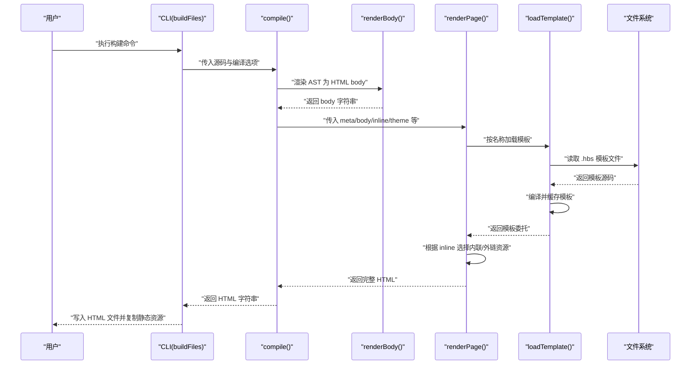
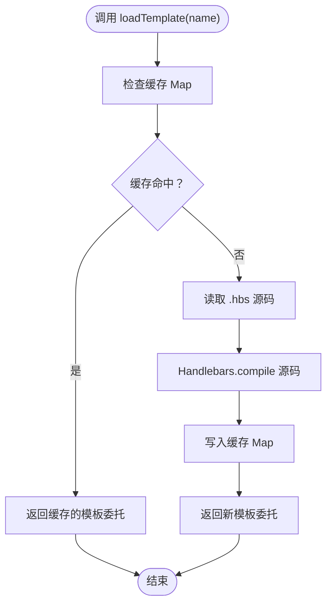
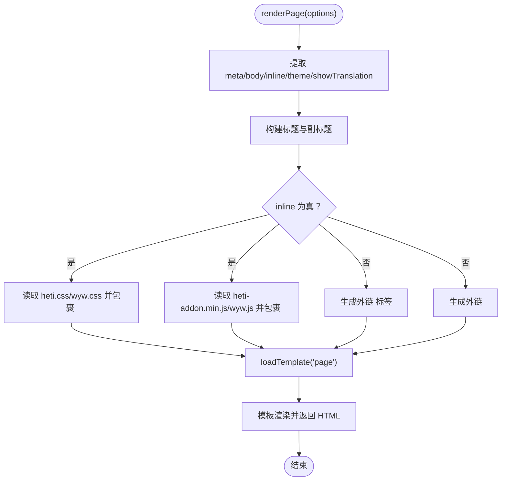
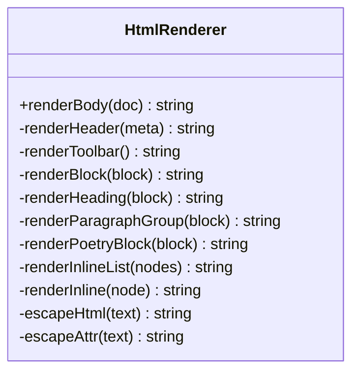
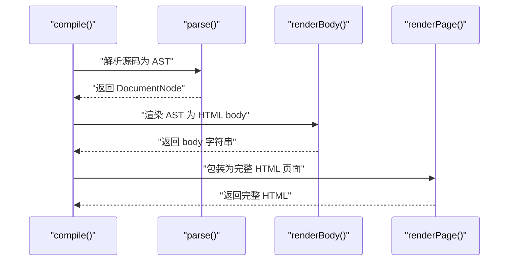
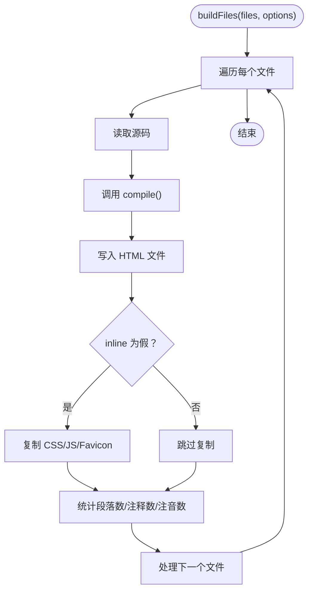
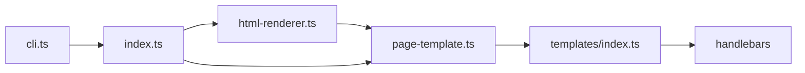

# 模板系统集成

<cite>
**本文引用的文件**
- [src/index.ts](file://src/index.ts)
- [src/renderer/page-template.ts](file://src/renderer/page-template.ts)
- [src/renderer/html-renderer.ts](file://src/renderer/html-renderer.ts)
- [src/templates/index.ts](file://src/templates/index.ts)
- [src/templates/page.hbs](file://src/templates/page.hbs)
- [src/templates/homepage.hbs](file://src/templates/homepage.hbs)
- [src/cli.ts](file://src/cli.ts)
- [test/compile.test.ts](file://test/compile.test.ts)
- [package.json](file://package.json)
- [README.md](file://README.md)
- [examples/刘禹锡_陋室铭.wyw](file://examples/刘禹锡_陋室铭.wyw)
</cite>

## 目录
1. [引言](#引言)
2. [项目结构](#项目结构)
3. [核心组件](#核心组件)
4. [架构总览](#架构总览)
5. [详细组件分析](#详细组件分析)
6. [依赖关系分析](#依赖关系分析)
7. [性能考量](#性能考量)
8. [故障排除指南](#故障排除指南)
9. [结论](#结论)
10. [附录](#附录)

## 引言
本文档聚焦于文言文编译器的模板系统集成，系统性阐述模板加载器与渲染器的协作机制，涵盖模板实例传递、数据上下文管理、渲染流程控制、模板缓存与渲染缓存的关系与协调、与其他组件的交互模式（错误传播、生命周期管理、资源清理），以及集成测试方法与故障排除指南。目标是帮助开发者在不深入源码细节的情况下，也能高效理解并维护模板系统。

## 项目结构
模板系统位于 src/renderer 与 src/templates 目录中，配合 src/index.ts 的编译入口与 src/cli.ts 的命令行入口协同工作。整体采用“解析 -> 渲染 -> 模板包装”的分层设计，模板加载器负责 Handlebars 模板的读取与编译缓存，页面模板渲染器负责将 HTML 内容与静态资源注入模板，最终生成完整 HTML 页面。

```mermaid
graph TB
subgraph "编译入口"
IDX["src/index.ts<br/>compile()"]
end
subgraph "渲染层"
HR["src/renderer/html-renderer.ts<br/>renderBody()"]
PT["src/renderer/page-template.ts<br/>renderPage()"]
end
subgraph "模板层"
TL["src/templates/index.ts<br/>loadTemplate()"]
PHBS["src/templates/page.hbs"]
HHBS["src/templates/homepage.hbs"]
end
subgraph "CLI"
CLI["src/cli.ts<br/>buildFiles()"]
end
IDX --> HR
IDX --> PT
PT --> TL
TL --> PHBS
CLI --> IDX
```

图表来源
- [src/index.ts:17-28](file://src/index.ts#L17-L28)
- [src/renderer/html-renderer.ts:20-44](file://src/renderer/html-renderer.ts#L20-L44)
- [src/renderer/page-template.ts:25-68](file://src/renderer/page-template.ts#L25-L68)
- [src/templates/index.ts:18-30](file://src/templates/index.ts#L18-L30)
- [src/templates/page.hbs:1-17](file://src/templates/page.hbs#L1-L17)
- [src/templates/homepage.hbs:1-202](file://src/templates/homepage.hbs#L1-L202)
- [src/cli.ts:116-164](file://src/cli.ts#L116-L164)

章节来源
- [src/index.ts:17-28](file://src/index.ts#L17-L28)
- [src/renderer/page-template.ts:25-68](file://src/renderer/page-template.ts#L25-L68)
- [src/templates/index.ts:18-30](file://src/templates/index.ts#L18-L30)
- [src/cli.ts:116-164](file://src/cli.ts#L116-L164)

## 核心组件
- 模板加载器：负责从磁盘读取 .hbs 模板、编译为 Handlebars 模板委托，并通过内存 Map 缓存模板实例，避免重复编译。
- 页面模板渲染器：接收 HTML body 内容与编译选项，根据 inline 模式选择内联或外链资源，调用模板加载器获取模板并进行上下文渲染。
- HTML 渲染器：将解析后的 AST 转换为 HTML 字符串，作为页面模板的 body 输入。
- 编译入口：统一对外暴露 compile() 接口，串联解析、HTML 渲染与页面模板渲染。
- CLI：面向命令行的构建流程，调用编译入口并处理文件输出与资源复制。

章节来源
- [src/templates/index.ts:18-30](file://src/templates/index.ts#L18-L30)
- [src/renderer/page-template.ts:25-68](file://src/renderer/page-template.ts#L25-L68)
- [src/renderer/html-renderer.ts:20-44](file://src/renderer/html-renderer.ts#L20-L44)
- [src/index.ts:17-28](file://src/index.ts#L17-L28)
- [src/cli.ts:116-164](file://src/cli.ts#L116-L164)

## 架构总览
模板系统集成遵循“数据自下而上、控制自上而下”的原则：
- 数据流：解析器产出 AST -> HTML 渲染器产出 HTML body -> 页面模板渲染器注入上下文 -> 模板加载器编译模板 -> 输出完整 HTML。
- 控制流：编译入口决定渲染参数（inline、theme、showTranslation 等）-> 页面模板渲染器按参数选择资源策略 -> 模板加载器按名称加载模板 -> 返回字符串结果。
- 缓存策略：模板加载器缓存已编译模板，避免重复 I/O 与编译开销；HTML 渲染器与页面模板渲染器本身不缓存渲染结果，保持纯函数特性。



图表来源
- [src/cli.ts:116-164](file://src/cli.ts#L116-L164)
- [src/index.ts:17-28](file://src/index.ts#L17-L28)
- [src/renderer/html-renderer.ts:20-44](file://src/renderer/html-renderer.ts#L20-L44)
- [src/renderer/page-template.ts:25-68](file://src/renderer/page-template.ts#L25-L68)
- [src/templates/index.ts:18-30](file://src/templates/index.ts#L18-L30)

## 详细组件分析

### 模板加载器（src/templates/index.ts）
- 职责与实现要点
  - 通过 Map 缓存模板委托，键为模板名称，值为 Handlebars.TemplateDelegate。
  - 未命中缓存时，读取对应 .hbs 文件，调用 Handlebars.compile 编译并写入缓存。
  - 导出 Handlebars 实例，便于注册自定义 Helper。
- 性能与复杂度
  - 缓存命中 O(1)，首次加载 O(n)（n 为模板源码长度）。
  - I/O 仅发生在首次加载，后续复用缓存。
- 错误处理
  - 文件读取失败或模板编译异常会向上抛出，由调用方捕获处理。



图表来源
- [src/templates/index.ts:18-30](file://src/templates/index.ts#L18-L30)

章节来源
- [src/templates/index.ts:18-30](file://src/templates/index.ts#L18-L30)

### 页面模板渲染器（src/renderer/page-template.ts）
- 职责与实现要点
  - 接收 RenderPageOptions，包括 meta、body、inline、assetsPath、theme、showTranslation。
  - 根据 inline 选项选择内联 CSS/JS 或外链资源，分别读取文件内容或生成 link/script 标签。
  - 使用模板加载器加载 page.hbs，传入上下文（title、theme、articleClasses、body、cssTag、jsTag）。
  - 对标题与 HTML 内容进行安全转义，防止 XSS。
- 数据上下文管理
  - 上下文字段明确、职责清晰，避免跨模块污染。
  - SafeString 包裹用于避免 Handlebars 对内联 CSS/JS 的二次转义。
- 渲染流程控制
  - inline 与非 inline 两条分支，确保资源注入策略一致。
  - 根据 showTranslation 控制文章类名，影响样式与交互行为。



图表来源
- [src/renderer/page-template.ts:25-68](file://src/renderer/page-template.ts#L25-L68)
- [src/renderer/page-template.ts:43-57](file://src/renderer/page-template.ts#L43-L57)
- [src/templates/index.ts:18-30](file://src/templates/index.ts#L18-L30)

章节来源
- [src/renderer/page-template.ts:25-68](file://src/renderer/page-template.ts#L25-L68)
- [src/renderer/page-template.ts:43-57](file://src/renderer/page-template.ts#L43-L57)

### HTML 渲染器（src/renderer/html-renderer.ts）
- 职责与实现要点
  - 将 Document AST 转换为 HTML 字符串，作为页面模板的 body 输入。
  - 支持标题、段落组、诗词块、引用、分隔线、校对日期等多种块级元素。
  - 内联节点渲染支持文本、注音（ruby）、注释（annotate）、注音+注释组合、强调等。
  - 提供 escapeHtml/escapeAttr 工具函数，保证输出安全。
- 数据上下文传递
  - renderBody 接收 DocumentNode，返回字符串，不依赖外部状态，便于测试与缓存策略扩展。
- 渲染流程控制
  - 通过 switch-case 精确控制不同节点类型的渲染方式，确保结构与语义正确。



图表来源
- [src/renderer/html-renderer.ts:20-44](file://src/renderer/html-renderer.ts#L20-L44)
- [src/renderer/html-renderer.ts:80-97](file://src/renderer/html-renderer.ts#L80-L97)
- [src/renderer/html-renderer.ts:195-233](file://src/renderer/html-renderer.ts#L195-L233)

章节来源
- [src/renderer/html-renderer.ts:20-44](file://src/renderer/html-renderer.ts#L20-L44)
- [src/renderer/html-renderer.ts:80-97](file://src/renderer/html-renderer.ts#L80-L97)
- [src/renderer/html-renderer.ts:195-233](file://src/renderer/html-renderer.ts#L195-L233)

### 编译入口（src/index.ts）
- 职责与实现要点
  - 统一对外接口 compile(source, options)，串联 parse -> renderBody -> renderPage。
  - options 支持 inline、assetsPath、theme、showTranslation 等，向下游传递。
- 生命周期与资源清理
  - 该层不持有持久资源，属于纯函数式封装，无需显式清理。



图表来源
- [src/index.ts:17-28](file://src/index.ts#L17-L28)

章节来源
- [src/index.ts:17-28](file://src/index.ts#L17-L28)

### CLI 集成（src/cli.ts）
- 职责与实现要点
  - buildFiles 负责批量构建：读取文件 -> 调用 compile -> 写入 HTML -> 非 inline 模式复制静态资源 -> 统计信息输出。
  - watch 模式监听文件变化并自动重编译。
- 错误传播
  - 文件读取、编译、写入过程中的异常会被捕获并打印，不影响其他文件的处理。
- 资源清理
  - 仅进行必要的文件复制与写入，无需要求的资源清理。



图表来源
- [src/cli.ts:116-164](file://src/cli.ts#L116-L164)

章节来源
- [src/cli.ts:116-164](file://src/cli.ts#L116-L164)

## 依赖关系分析
- 模块耦合
  - page-template 依赖 templates/index.ts 的模板加载能力，形成“渲染器 -> 模板加载器”的单向依赖。
  - html-renderer 与 page-template 之间通过字符串进行解耦，便于替换模板引擎。
  - index.ts 作为门面，聚合解析与渲染，降低外部依赖复杂度。
- 外部依赖
  - Handlebars 用于模板编译与渲染。
  - Node.js fs/path/url 用于文件读取与路径拼接。
- 潜在循环依赖
  - 当前结构无循环依赖，模板加载器不反向依赖渲染器。



图表来源
- [src/renderer/html-renderer.ts:1-16](file://src/renderer/html-renderer.ts#L1-L16)
- [src/renderer/page-template.ts:4-8](file://src/renderer/page-template.ts#L4-L8)
- [src/templates/index.ts:4-7](file://src/templates/index.ts#L4-L7)
- [src/index.ts:3-5](file://src/index.ts#L3-L5)
- [src/cli.ts:12-15](file://src/cli.ts#L12-L15)

章节来源
- [src/renderer/page-template.ts:4-8](file://src/renderer/page-template.ts#L4-L8)
- [src/templates/index.ts:4-7](file://src/templates/index.ts#L4-L7)
- [src/index.ts:3-5](file://src/index.ts#L3-L5)
- [src/cli.ts:12-15](file://src/cli.ts#L12-L15)

## 性能考量
- 模板缓存
  - 模板加载器使用 Map 缓存模板委托，避免重复 I/O 与编译，显著降低热路径开销。
- 渲染缓存
  - HTML 渲染器与页面模板渲染器未实现渲染缓存，保持纯函数特性，利于并发与测试。
- 资源注入策略
  - inline 模式减少网络请求但增加 HTML 体积；外链模式提升缓存复用与传输效率。
- 建议
  - 在高频构建场景下优先使用外链模式；仅在单页应用或离线场景考虑 inline。
  - 若未来引入多模板场景，可在模板加载器层面扩展命名空间隔离与更细粒度的缓存策略。

## 故障排除指南
- 模板加载失败
  - 症状：调用 renderPage 抛出异常。
  - 排查：确认模板文件存在且可读；检查模板名称与调用一致；查看模板语法是否合法。
  - 参考路径：[src/templates/index.ts:18-30](file://src/templates/index.ts#L18-L30)
- 资源路径问题
  - 症状：页面无法加载 CSS/JS。
  - 排查：确认 assetsPath 正确；非 inline 模式下需复制静态资源；检查输出目录权限。
  - 参考路径：[src/renderer/page-template.ts:43-57](file://src/renderer/page-template.ts#L43-L57)、[src/cli.ts:138-153](file://src/cli.ts#L138-L153)
- XSS 风险
  - 症状：特殊字符导致页面异常。
  - 排查：确认标题与内容均经过 escapeHtml/escapeAttr 处理。
  - 参考路径：[src/renderer/page-template.ts:81-86](file://src/renderer/page-template.ts#L81-L86)、[src/renderer/html-renderer.ts:237-250](file://src/renderer/html-renderer.ts#L237-L250)
- CLI 构建中断
  - 症状：部分文件构建失败。
  - 排查：查看错误输出定位具体文件；修复后重新执行；watch 模式下可自动重试。
  - 参考路径：[src/cli.ts:160-163](file://src/cli.ts#L160-L163)
- 集成测试失败
  - 症状：测试断言不通过。
  - 排查：核对示例文件内容与期望输出；确认 inline 模式下的内联资源存在；检查注音、注释、译文渲染。
  - 参考路径：[test/compile.test.ts:14-94](file://test/compile.test.ts#L14-L94)、[test/compile.test.ts:96-155](file://test/compile.test.ts#L96-L155)、[test/compile.test.ts:157-209](file://test/compile.test.ts#L157-L209)

章节来源
- [src/templates/index.ts:18-30](file://src/templates/index.ts#L18-L30)
- [src/renderer/page-template.ts:43-57](file://src/renderer/page-template.ts#L43-L57)
- [src/renderer/page-template.ts:81-86](file://src/renderer/page-template.ts#L81-L86)
- [src/renderer/html-renderer.ts:237-250](file://src/renderer/html-renderer.ts#L237-L250)
- [src/cli.ts:160-163](file://src/cli.ts#L160-L163)
- [test/compile.test.ts:14-94](file://test/compile.test.ts#L14-L94)
- [test/compile.test.ts:96-155](file://test/compile.test.ts#L96-L155)
- [test/compile.test.ts:157-209](file://test/compile.test.ts#L157-L209)

## 结论
模板系统通过“模板加载器 + 页面模板渲染器 + HTML 渲染器”的分层设计，实现了清晰的数据流与控制流。模板加载器的缓存机制有效降低了 I/O 与编译成本；页面模板渲染器在资源注入与上下文管理方面提供了灵活的配置；HTML 渲染器专注于结构化内容生成。CLI 与测试用例进一步完善了端到端的集成验证。建议在后续迭代中继续强化模板引擎的可插拔性与缓存策略的可观测性，以适配更复杂的站点需求。

## 附录
- 模板文件一览
  - page.hbs：页面主体模板，包含标题、主题、样式与脚本注入点。
  - homepage.hbs：主页模板（当前项目未直接使用，保留以备扩展）。
- 示例文件参考
  - 刘禹锡_陋室铭.wyw：用于测试注音、注释、译文与诗词块渲染。
- 构建与测试
  - 构建：npm run build；测试：npm test；示例构建：npm run build:examples。

章节来源
- [src/templates/page.hbs:1-17](file://src/templates/page.hbs#L1-L17)
- [src/templates/homepage.hbs:1-202](file://src/templates/homepage.hbs#L1-L202)
- [examples/刘禹锡_陋室铭.wyw:1-22](file://examples/刘禹锡_陋室铭.wyw#L1-L22)
- [package.json:18-27](file://package.json#L18-L27)
- [README.md:110-125](file://README.md#L110-L125)