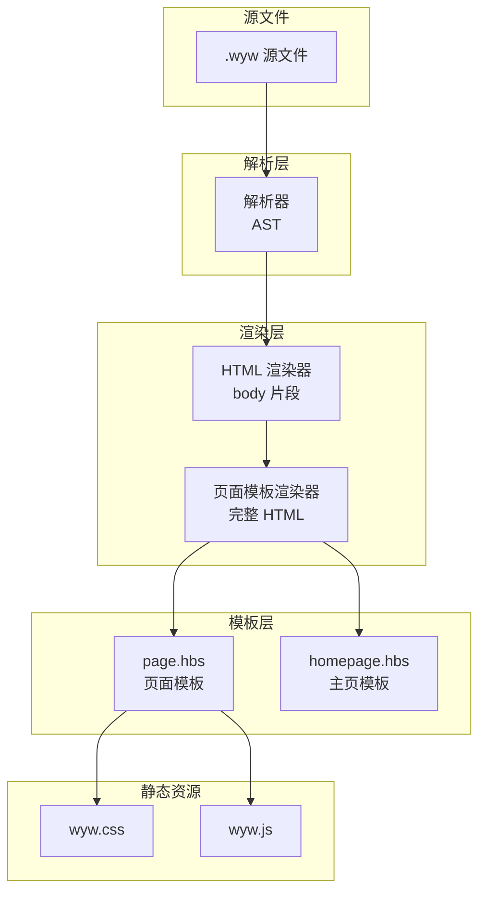
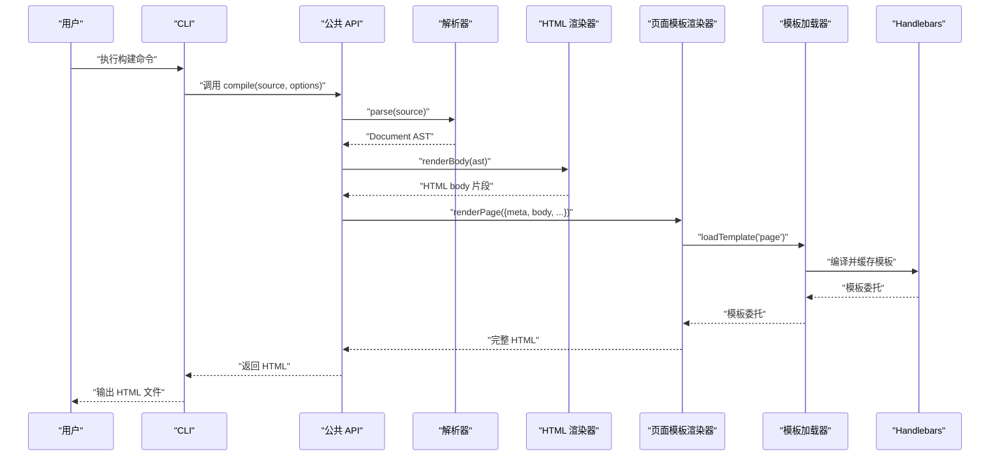
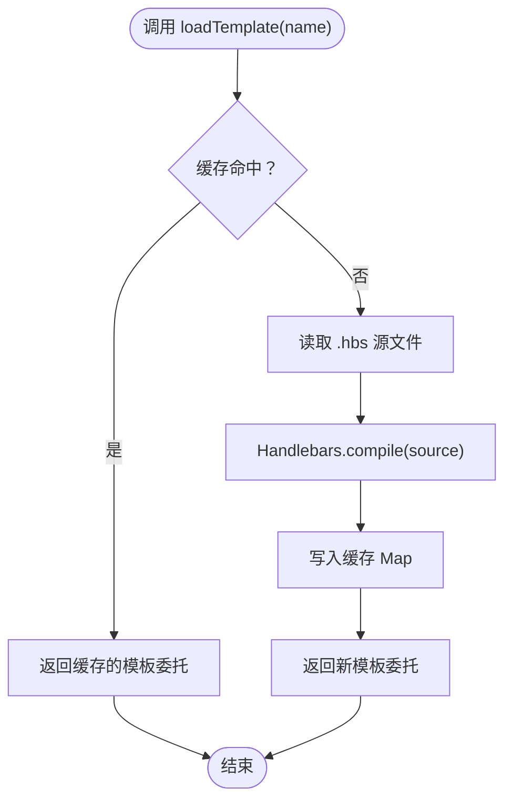
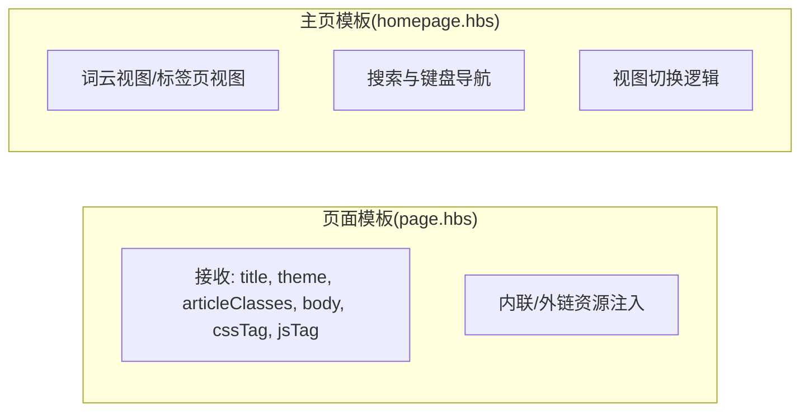
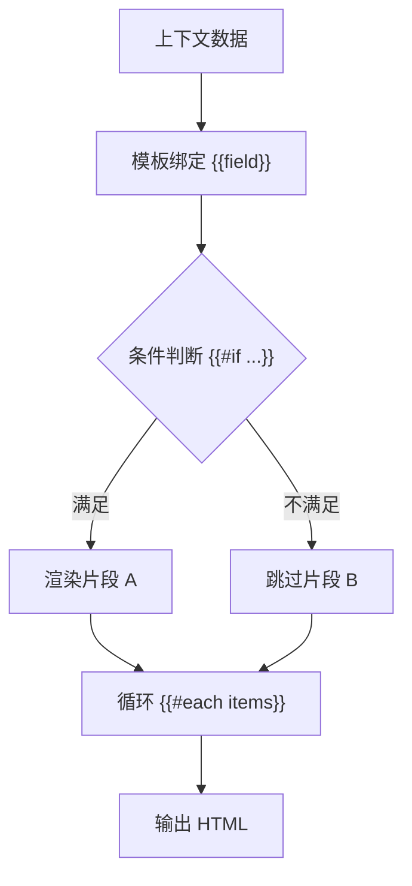
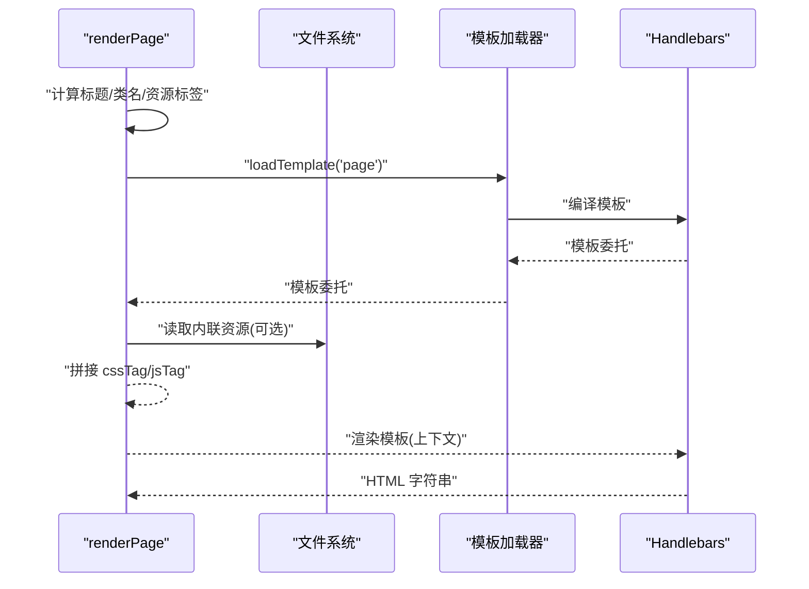
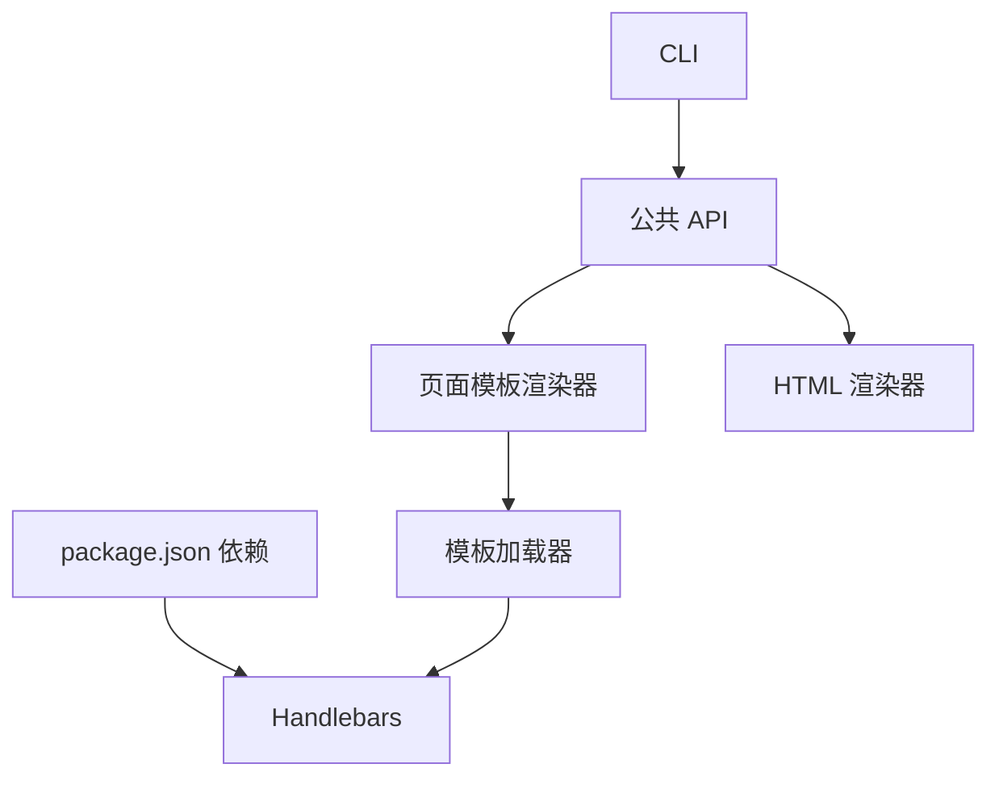

# 自定义模板开发

<cite>
**本文引用的文件**
- [src/templates/index.ts](file://src/templates/index.ts)
- [src/templates/page.hbs](file://src/templates/page.hbs)
- [src/templates/homepage.hbs](file://src/templates/homepage.hbs)
- [src/renderer/page-template.ts](file://src/renderer/page-template.ts)
- [src/renderer/html-renderer.ts](file://src/renderer/html-renderer.ts)
- [src/index.ts](file://src/index.ts)
- [src/cli.ts](file://src/cli.ts)
- [src/assets/wyw.css](file://src/assets/wyw.css)
- [src/assets/wyw.js](file://src/assets/wyw.js)
- [package.json](file://package.json)
- [README.md](file://README.md)
- [test/compile.test.ts](file://test/compile.test.ts)
- [examples/刘禹锡_陋室铭.wyw](file://examples/刘禹锡_陋室铭.wyw)
</cite>

## 目录
1. [引言](#引言)
2. [项目结构](#项目结构)
3. [核心组件](#核心组件)
4. [架构总览](#架构总览)
5. [详细组件分析](#详细组件分析)
6. [依赖关系分析](#依赖关系分析)
7. [性能考量](#性能考量)
8. [故障排查指南](#故障排查指南)
9. [结论](#结论)
10. [附录](#附录)

## 引言
本指南面向需要为文言文编译器定制或扩展模板的开发者，重点讲解如何基于 Handlebars 模板系统进行自定义开发。内容涵盖：
- Handlebars 模板语法在文言文编译中的应用：数据绑定、条件渲染、循环处理
- 页面模板与主页模板的设计差异与使用场景
- Helper 函数的注册与使用：文本处理、格式化、国际化支持建议
- 模板调试技巧、性能优化与最佳实践

## 项目结构
文言文编译器采用“解析 → 渲染 → 模板”三层结构：
- 解析层：将 .wyw 源文件解析为 AST
- 渲染层：将 AST 渲染为 HTML 片段（body）
- 模板层：将 HTML 片段包装为完整页面（page 模板），或生成站点主页（homepage 模板）

图表来源
- [src/index.ts:17-28](file://src/index.ts#L17-L28)
- [src/renderer/html-renderer.ts:20-44](file://src/renderer/html-renderer.ts#L20-L44)
- [src/renderer/page-template.ts:25-68](file://src/renderer/page-template.ts#L25-L68)
- [src/templates/page.hbs:1-17](file://src/templates/page.hbs#L1-L17)
- [src/templates/homepage.hbs:1-202](file://src/templates/homepage.hbs#L1-L202)
- [src/assets/wyw.css:1-657](file://src/assets/wyw.css#L1-L657)
- [src/assets/wyw.js:1-204](file://src/assets/wyw.js#L1-L204)

章节来源
- [README.md:110-126](file://README.md#L110-L126)

## 核心组件
- 模板加载器：负责读取 .hbs 文件、编译并缓存模板，导出 Handlebars 实例以便注册 Helper
- 页面模板渲染器：组装页面标题、主题、样式与脚本标签，并将 body 片段注入页面
- HTML 渲染器：遍历 AST，生成 HTML body 内容
- CLI：提供构建、监听、验证等功能，驱动编译流程

章节来源
- [src/templates/index.ts:18-33](file://src/templates/index.ts#L18-L33)
- [src/renderer/page-template.ts:25-68](file://src/renderer/page-template.ts#L25-L68)
- [src/renderer/html-renderer.ts:20-78](file://src/renderer/html-renderer.ts#L20-L78)
- [src/cli.ts:28-114](file://src/cli.ts#L28-L114)

## 架构总览
下面的序列图展示了从 .wyw 到最终 HTML 的端到端流程。

图表来源
- [src/index.ts:17-28](file://src/index.ts#L17-L28)
- [src/renderer/html-renderer.ts:20-44](file://src/renderer/html-renderer.ts#L20-L44)
- [src/renderer/page-template.ts:25-68](file://src/renderer/page-template.ts#L25-L68)
- [src/templates/index.ts:18-33](file://src/templates/index.ts#L18-L33)

## 详细组件分析

### 模板加载与 Helper 注册
- 模板加载器负责：
  - 从模板目录读取 .hbs 文件
  - 使用 Handlebars.compile 编译为模板委托
  - 通过 Map 缓存模板，避免重复编译
- 模板加载器导出 Handlebars 实例，便于在应用启动时注册自定义 Helper

图表来源
- [src/templates/index.ts:18-33](file://src/templates/index.ts#L18-L33)

章节来源
- [src/templates/index.ts:18-33](file://src/templates/index.ts#L18-L33)

### 页面模板与主页模板对比
- 页面模板（page.hbs）
  - 用于单篇文言文页面
  - 接收参数：title、theme、articleClasses、body、cssTag、jsTag
  - 支持内联或外链资源
- 主页模板（homepage.hbs）
  - 用于站点主页，包含词云视图与标签页视图
  - 提供搜索、视图切换、标签页切换等交互
  - 内嵌 JavaScript 初始化逻辑

图表来源
- [src/templates/page.hbs:1-17](file://src/templates/page.hbs#L1-L17)
- [src/templates/homepage.hbs:1-202](file://src/templates/homepage.hbs#L1-L202)

章节来源
- [src/templates/page.hbs:1-17](file://src/templates/page.hbs#L1-L17)
- [src/templates/homepage.hbs:1-202](file://src/templates/homepage.hbs#L1-L202)

### 数据绑定、条件渲染与循环处理
- 数据绑定
  - 模板通过双花括号语法绑定上下文字段（如 title、theme、body）
  - 使用 Handlebars.SafeString 注入 HTML 片段（如 cssTag、jsTag）
- 条件渲染
  - 使用条件块渲染不同状态（如 active 标签页、隐藏译文）
- 循环处理
  - 使用 each 遍历集合（如主页模板中的云词项、标签页导航与内容）

图表来源
- [src/templates/page.hbs:1-17](file://src/templates/page.hbs#L1-L17)
- [src/templates/homepage.hbs:26-54](file://src/templates/homepage.hbs#L26-L54)

章节来源
- [src/templates/page.hbs:1-17](file://src/templates/page.hbs#L1-L17)
- [src/templates/homepage.hbs:26-54](file://src/templates/homepage.hbs#L26-L54)

### Helper 函数注册与使用
- 注册位置
  - 在应用启动时，通过模板加载器导出的 Handlebars 实例注册自定义 Helper
- 建议用途
  - 文本处理：去除标记、转义、截断、高亮
  - 格式化：日期、数字、单位换算
  - 国际化：多语言字符串选择、占位符替换
- 使用方式
  - 在模板中通过 {{helperName params}} 调用
  - 注意返回值类型：字符串或 Handlebars.SafeString

章节来源
- [src/templates/index.ts:32-33](file://src/templates/index.ts#L32-L33)

### 页面模板渲染流程
- 输入：DocumentMeta、HTML body 片段、内联/外链选项、主题、译文可见性
- 输出：完整 HTML 页面
- 关键步骤：
  - 标题与类名处理
  - 资源注入（内联或外链）
  - 模板加载与上下文渲染

图表来源
- [src/renderer/page-template.ts:25-68](file://src/renderer/page-template.ts#L25-L68)
- [src/templates/index.ts:18-33](file://src/templates/index.ts#L18-L33)

章节来源
- [src/renderer/page-template.ts:25-68](file://src/renderer/page-template.ts#L25-L68)

### HTML 渲染器与 AST 遍历
- HTML 渲染器根据 AST 类型分派渲染逻辑
- 支持标题、段落组、诗词块、引用、分隔线等节点
- 通过工具栏与文档头部增强可访问性与交互性

章节来源
- [src/renderer/html-renderer.ts:20-78](file://src/renderer/html-renderer.ts#L20-L78)

### CLI 与构建流程
- CLI 提供 build、init、validate 子命令
- build 支持输出目录、内联资源、监听模式、主题与译文可见性选项
- 构建完成后复制静态资源至输出目录

章节来源
- [src/cli.ts:28-114](file://src/cli.ts#L28-L114)
- [src/cli.ts:116-181](file://src/cli.ts#L116-L181)

## 依赖关系分析
- 模板系统依赖 Handlebars
- 页面模板渲染器依赖模板加载器与静态资源
- CLI 依赖公共 API 与验证模块
- 测试覆盖编译流程与资源内联

图表来源
- [package.json:45-48](file://package.json#L45-L48)
- [src/cli.ts:13-15](file://src/cli.ts#L13-L15)
- [src/index.ts:3-5](file://src/index.ts#L3-L5)
- [src/renderer/page-template.ts:7](file://src/renderer/page-template.ts#L7)
- [src/templates/index.ts:7](file://src/templates/index.ts#L7)

章节来源
- [package.json:45-48](file://package.json#L45-L48)
- [src/index.ts:3-5](file://src/index.ts#L3-L5)
- [src/renderer/page-template.ts:7](file://src/renderer/page-template.ts#L7)
- [src/templates/index.ts:7](file://src/templates/index.ts#L7)

## 性能考量
- 模板缓存
  - 模板加载器使用 Map 缓存模板委托，避免重复编译
- 资源内联策略
  - 内联模式减少 HTTP 请求，但增加 HTML 体积；外链模式适合多页面复用
- DOM 与样式
  - CSS 变量与媒体查询提升主题切换与响应式表现
  - 客户端脚本仅在页面存在目标元素时初始化，避免无效开销

章节来源
- [src/templates/index.ts:18-33](file://src/templates/index.ts#L18-L33)
- [src/renderer/page-template.ts:43-57](file://src/renderer/page-template.ts#L43-L57)
- [src/assets/wyw.css:1-657](file://src/assets/wyw.css#L1-L657)
- [src/assets/wyw.js:1-204](file://src/assets/wyw.js#L1-L204)

## 故障排查指南
- 模板未生效
  - 确认模板名称与路径一致，检查缓存是否被意外清空
  - 参考：模板加载器的缓存与编译逻辑
- 资源未加载
  - 内联模式需确保模板渲染时注入了 cssTag/jsTag
  - 外链模式需确认输出目录包含静态资源
- 标题或元数据异常
  - 检查 HTML 渲染器对元数据的处理与转义
- 译文显示不符合预期
  - 检查 renderPage 的 showTranslation 选项与页面类名
- 测试验证
  - 使用测试用例验证注音、注释、译文与内联资源的渲染

章节来源
- [src/templates/index.ts:18-33](file://src/templates/index.ts#L18-L33)
- [src/renderer/page-template.ts:41-67](file://src/renderer/page-template.ts#L41-L67)
- [src/renderer/html-renderer.ts:70-86](file://src/renderer/html-renderer.ts#L70-L86)
- [src/cli.ts:138-153](file://src/cli.ts#L138-L153)
- [test/compile.test.ts:14-94](file://test/compile.test.ts#L14-L94)

## 结论
通过 Handlebars 模板系统与清晰的渲染管线，文言文编译器实现了从 .wyw 到精美 HTML 的自动化转换。开发者可在不改动核心解析与渲染逻辑的前提下，灵活扩展模板、注册 Helper 并优化性能与交互体验。

## 附录

### Handlebars 模板语法速览（与项目结合）
- 数据绑定：{{title}}、{{theme}}、{{body}}、{{articleClasses}}、{{{cssTag}}}、{{{jsTag}}}
- 条件渲染：{{#if active}}...{{/if}}、{{#unless ...}}...{{/unless}}
- 循环处理：{{#each items}}...{{/each}}
- 注入安全 HTML：使用 Handlebars.SafeString 包裹动态 HTML 片段

章节来源
- [src/templates/page.hbs:1-17](file://src/templates/page.hbs#L1-L17)
- [src/templates/homepage.hbs:26-54](file://src/templates/homepage.hbs#L26-L54)
- [src/renderer/page-template.ts:65-66](file://src/renderer/page-template.ts#L65-L66)

### 页面模板与主页模板的使用场景
- 页面模板：单篇文言文页面，强调内容呈现与交互
- 主页模板：站点主页，强调导航、搜索与视图切换

章节来源
- [src/templates/page.hbs:1-17](file://src/templates/page.hbs#L1-L17)
- [src/templates/homepage.hbs:1-202](file://src/templates/homepage.hbs#L1-L202)

### Helper 函数注册与使用建议
- 注册位置：应用启动阶段，通过模板加载器导出的 Handlebars 实例
- 文本处理：stripWywMarkup、escapeHtml 等
- 格式化：日期、数字、单位
- 国际化：多语言字符串选择、占位符替换

章节来源
- [src/templates/index.ts:32-33](file://src/templates/index.ts#L32-L33)
- [src/renderer/page-template.ts:70-86](file://src/renderer/page-template.ts#L70-L86)

### 模板调试技巧
- 使用最小上下文验证模板渲染
- 逐步添加数据字段，定位渲染问题
- 利用浏览器开发者工具检查注入的资源与类名
- 参考测试用例断言，确保关键元素存在

章节来源
- [test/compile.test.ts:14-94](file://test/compile.test.ts#L14-L94)
- [src/renderer/page-template.ts:41-67](file://src/renderer/page-template.ts#L41-L67)

### 性能优化与最佳实践
- 启用模板缓存，避免重复编译
- 根据场景选择内联或外链资源
- 使用 CSS 变量与媒体查询提升主题切换性能
- 控制循环渲染的数据规模，必要时进行分页或懒加载

章节来源
- [src/templates/index.ts:18-33](file://src/templates/index.ts#L18-L33)
- [src/renderer/page-template.ts:43-57](file://src/renderer/page-template.ts#L43-L57)
- [src/assets/wyw.css:1-657](file://src/assets/wyw.css#L1-L657)