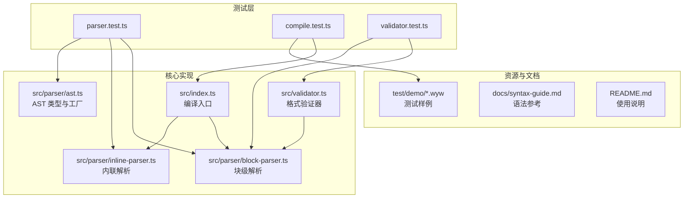
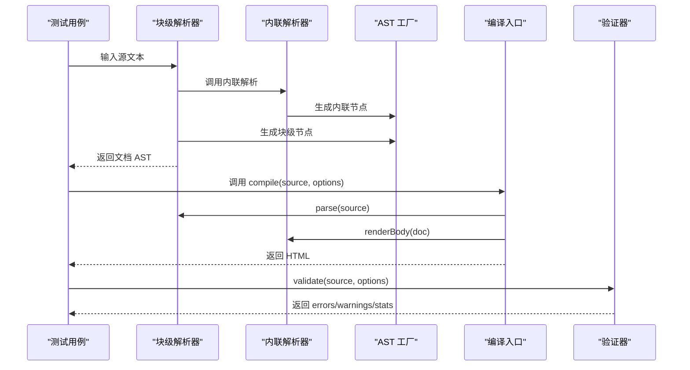
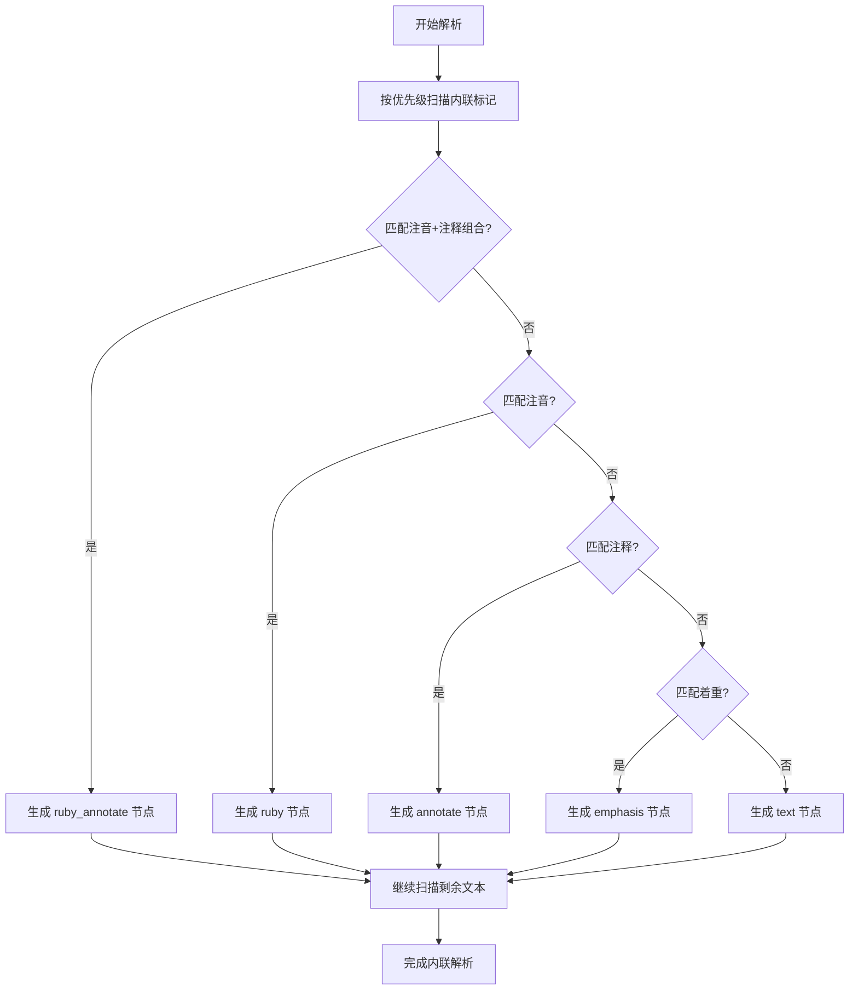
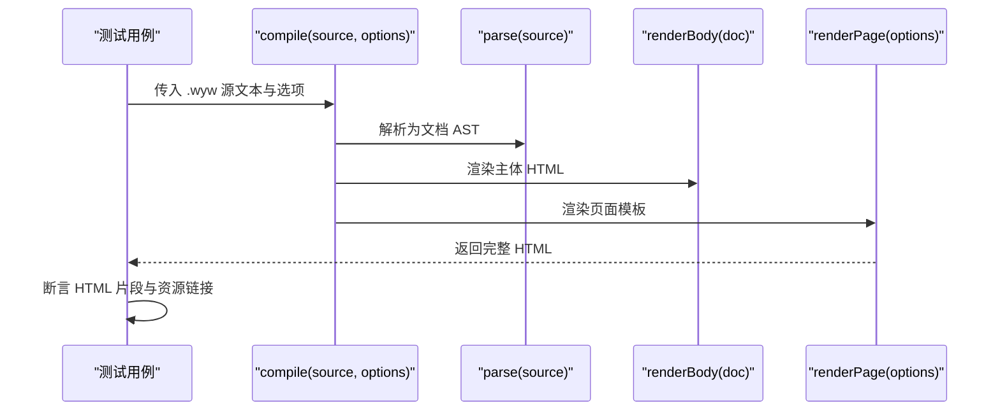
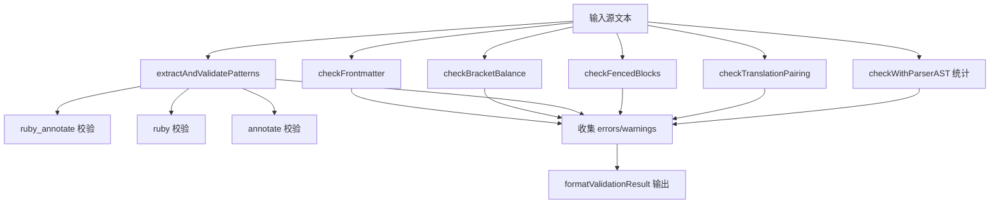
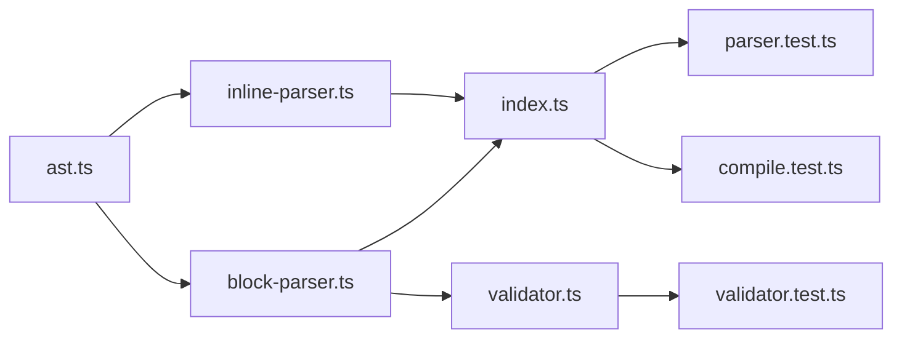

# 测试策略与实践

<cite>
**本文引用的文件**
- [parser.test.ts](file://test/parser.test.ts)
- [compile.test.ts](file://test/compile.test.ts)
- [validator.test.ts](file://test/validator.test.ts)
- [ast.ts](file://src/parser/ast.ts)
- [index.ts](file://src/index.ts)
- [validator.ts](file://src/validator.ts)
- [block-parser.ts](file://src/parser/block-parser.ts)
- [inline-parser.ts](file://src/parser/inline-parser.ts)
- [package.json](file://package.json)
- [README.md](file://README.md)
- [syntax-guide.md](file://docs/syntax-guide.md)
- [刘禹锡_陋室铭.wyw](file://test/demo/刘禹锡_陋室铭.wyw)
</cite>

## 目录
1. [引言](#引言)
2. [项目结构](#项目结构)
3. [核心组件](#核心组件)
4. [架构总览](#架构总览)
5. [详细组件分析](#详细组件分析)
6. [依赖关系分析](#依赖关系分析)
7. [性能考量](#性能考量)
8. [故障排查指南](#故障排查指南)
9. [结论](#结论)
10. [附录](#附录)

## 引言
本测试策略文档面向文言文编译器（.wyw 编译器）的测试设计与实施，覆盖单元测试与集成测试的设计原则、测试用例编写规范、覆盖率目标、语法解析测试、编译流程测试与验证器测试的具体实现方法，以及测试数据的组织与管理策略。同时提供测试自动化与持续集成配置指南、测试调试技巧与性能测试方法，帮助开发者高效构建高质量的测试体系。

## 项目结构
文言文编译器采用模块化结构，核心能力分为“解析”“渲染”“验证”三大模块，配合 CLI 与示例/测试资源。测试文件集中于 test 目录，分别覆盖解析器、编译流程与验证器。

图表来源
- [parser.test.ts:1-283](file://test/parser.test.ts#L1-L283)
- [compile.test.ts:1-210](file://test/compile.test.ts#L1-L210)
- [validator.test.ts:1-426](file://test/validator.test.ts#L1-L426)
- [index.ts:1-57](file://src/index.ts#L1-L57)
- [block-parser.ts:1-200](file://src/parser/block-parser.ts#L1-L200)
- [inline-parser.ts:1-99](file://src/parser/inline-parser.ts#L1-L99)
- [ast.ts:1-218](file://src/parser/ast.ts#L1-L218)
- [validator.ts:1-838](file://src/validator.ts#L1-L838)

章节来源
- [README.md:110-126](file://README.md#L110-L126)
- [package.json:18-27](file://package.json#L18-L27)

## 核心组件
- 解析器（块级/内联/前端元数据）
  - 块级解析：将文本行按状态机组织为段落、标题、译文、围栏块、引用等块级节点，再聚合成段落组。
  - 内联解析：按优先级匹配注音、注释、注音+注释组合与着重标记，生成内联节点序列。
  - AST 类型与工厂：统一定义节点类型与构造函数，保证解析与渲染的一致性。
- 编译器入口：负责解析源文本、渲染主体与页面模板，支持内联样式/脚本与主题控制。
- 验证器：对 Frontmatter、括号平衡、注音/注释/组合格式、围栏块、译文配对、解析器深度校验等进行多维校验，并可格式化输出结果。

章节来源
- [index.ts:17-28](file://src/index.ts#L17-L28)
- [block-parser.ts:43-49](file://src/parser/block-parser.ts#L43-L49)
- [inline-parser.ts:62-98](file://src/parser/inline-parser.ts#L62-L98)
- [ast.ts:132-188](file://src/parser/ast.ts#L132-L188)
- [validator.ts:758-779](file://src/validator.ts#L758-L779)

## 架构总览
测试策略围绕“自底向上”的层次化设计展开：
- 单元测试：聚焦解析器与验证器的原子能力，确保语法识别与规则校验的正确性。
- 集成测试：覆盖编译流程端到端，验证从源文件到 HTML 输出的完整性与一致性。
- 数据驱动：以真实示例与边界用例构成测试数据集，保障覆盖关键分支与异常路径。

图表来源
- [index.ts:17-28](file://src/index.ts#L17-L28)
- [block-parser.ts:43-49](file://src/parser/block-parser.ts#L43-L49)
- [inline-parser.ts:62-98](file://src/parser/inline-parser.ts#L62-L98)
- [ast.ts:132-188](file://src/parser/ast.ts#L132-L188)
- [validator.ts:758-779](file://src/validator.ts#L758-L779)

## 详细组件分析

### 单元测试设计原则
- 明确职责边界：解析器单元测试仅验证解析逻辑；验证器单元测试仅验证规则与统计；编译器单元测试仅验证编译流程。
- 针对性覆盖：依据 AST 类型与解析状态机，覆盖常见节点与边界条件（空输入、未闭合、交叉嵌套、多字注音等）。
- 可预期断言：以节点类型、属性值、HTML 片段存在性等作为断言依据，避免脆弱的字符串匹配。
- 独立与可重复：每个测试用例独立运行，避免共享状态；必要时使用 before 钩子准备数据。

章节来源
- [parser.test.ts:1-283](file://test/parser.test.ts#L1-L283)
- [validator.test.ts:1-426](file://test/validator.test.ts#L1-L426)

### 集成测试设计原则
- 端到端验证：从真实 .wyw 文件出发，验证编译输出的完整性（HTML 结构、元数据、注音/注释/译文渲染、内联资源）。
- 数据驱动：以 test/demo 下的真实示例作为输入，确保测试贴近实际使用场景。
- 文件 I/O 验证：在集成测试中写入并读取生成的 HTML 文件，确保输出稳定且可复现。

章节来源
- [compile.test.ts:1-210](file://test/compile.test.ts#L1-L210)

### 测试用例编写规范
- 命名约定：使用动宾短语描述期望行为，如“解析注音 {字|pīn}”“渲染注释 [词](释义)”“编译为完整 HTML 页面”。
- 断言策略：优先断言关键特征（HTML 标签、属性、类名、数据属性），其次断言资源链接（内联/外链）。
- 边界与异常：覆盖空文本、未闭合、交叉嵌套、多字注音、空释义、无有效注音块等异常场景。
- 可维护性：将相似断言归类到同一 describe 块，便于后续扩展与重构。

章节来源
- [parser.test.ts:18-283](file://test/parser.test.ts#L18-L283)
- [compile.test.ts:14-210](file://test/compile.test.ts#L14-L210)
- [validator.test.ts:9-426](file://test/validator.test.ts#L9-L426)

### 覆盖率要求
- 解析器覆盖率：内联/块级解析器关键分支与异常路径均应覆盖，目标为语句/分支/函数/行覆盖率均不低于 80%。
- 验证器覆盖率：规则 1~7 的每一条规则至少覆盖正常与异常两类场景，目标为规则分支覆盖。
- 编译器覆盖率：编译流程（parse → renderBody → renderPage）的关键路径覆盖，目标为端到端路径覆盖。
- 建议工具：结合 Node:test 与覆盖率工具（如 c8/tsx）在 CI 中执行覆盖率统计。

章节来源
- [package.json](file://package.json#L25)

### 语法解析测试（解析器）
- 目标：验证内联/块级解析器对各种语法标记的识别与节点生成。
- 关键点：
  - 内联解析优先级：注音+注释组合 > 注音 > 注释 > 着重。
  - 块级解析状态机：标题、段落、译文、围栏块、引用、分隔线、校对日期等。
  - AST 类型与工厂：确保节点类型与属性与 AST 定义一致。
- 断言要点：
  - 节点类型与数量（如 paragraph_group、heading、poetry_block）。
  - 内联节点属性（ruby/base、annotate/text/note、emphasis/children）。
  - 注音+注释组合的 items 与 note 字段。
- 示例参考：
  - [内联解析测试:54-166](file://test/parser.test.ts#L54-L166)
  - [块级解析测试:169-254](file://test/parser.test.ts#L169-L254)
  - [AST 类型与工厂:13-118](file://src/parser/ast.ts#L13-L118)

图表来源
- [inline-parser.ts:22-46](file://src/parser/inline-parser.ts#L22-L46)
- [inline-parser.ts:62-98](file://src/parser/inline-parser.ts#L62-L98)

章节来源
- [parser.test.ts:54-254](file://test/parser.test.ts#L54-L254)
- [inline-parser.ts:1-99](file://src/parser/inline-parser.ts#L1-L99)
- [ast.ts:13-118](file://src/parser/ast.ts#L13-L118)

### 编译流程测试（编译器）
- 目标：验证从源文本到完整 HTML 的端到端流程，包括元数据渲染、注音/注释/译文、内联资源与文件输出。
- 关键点：
  - 编译入口 compile(source, options) 的调用链：parse → renderBody → renderPage。
  - inline 模式与外链模式的差异（内联 CSS/JS vs 外部资源）。
  - 示例文件的元数据与内容渲染一致性。
- 断言要点：
  - 完整 HTML 结构（doctype、html、head/body）。
  - 元数据标签（title、h1、poetry-title、meta）。
  - 注音/注释/译文的 HTML 片段存在性与类名/属性。
  - 内联资源（style/script）与外链资源（href/src）。
  - 生成文件的写入与读取一致性。
- 示例参考：
  - [编译器入口:17-28](file://src/index.ts#L17-L28)
  - [编译集成测试:14-210](file://test/compile.test.ts#L14-L210)
  - [示例文件:1-32](file://test/demo/刘禹锡_陋室铭.wyw#L1-L32)

图表来源
- [index.ts:17-28](file://src/index.ts#L17-L28)
- [compile.test.ts:14-210](file://test/compile.test.ts#L14-L210)

章节来源
- [compile.test.ts:14-210](file://test/compile.test.ts#L14-L210)
- [index.ts:17-28](file://src/index.ts#L17-L28)

### 验证器测试（格式校验）
- 目标：验证验证器对 Frontmatter、括号平衡、注音/注释/组合格式、围栏块、译文配对与解析器深度校验的规则覆盖。
- 关键点：
  - Validator 类的 error/warn 行为与 strict 模式切换。
  - 规则 1~7 的逐条覆盖：Frontmatter、括号平衡、模式感知语法、围栏块、译文配对、解析器深度校验。
  - formatValidationResult 的输出格式与统计信息。
- 断言要点：
  - 错误/警告数量与消息内容。
  - 统计信息（段落组、诗词块、标题、注释、注音数量）。
  - strict 模式下警告升级为错误。
- 示例参考：
  - [验证器类与规则:61-101](file://src/validator.ts#L61-L101)
  - [验证器测试:9-426](file://test/validator.test.ts#L9-L426)

图表来源
- [validator.ts:758-779](file://src/validator.ts#L758-L779)
- [validator.test.ts:9-426](file://test/validator.test.ts#L9-L426)

章节来源
- [validator.test.ts:9-426](file://test/validator.test.ts#L9-L426)
- [validator.ts:758-779](file://src/validator.ts#L758-L779)

### 测试数据组织与管理
- 测试样例来源：
  - test/demo 下的 .wyw 示例文件，用于编译集成测试与端到端验证。
  - parser.test.ts 与 validator.test.ts 中的内联样例与规则样例。
- 数据管理策略：
  - 将真实示例与边界用例分离，分别置于 demo 与单元测试文件中。
  - 使用 describe 分组与 before 钩子减少重复读取与解析。
  - 通过断言 HTML 片段而非全文，降低脆弱性并提高可维护性。

章节来源
- [compile.test.ts:8-13](file://test/compile.test.ts#L8-L13)
- [parser.test.ts:1-283](file://test/parser.test.ts#L1-L283)
- [validator.test.ts:1-426](file://test/validator.test.ts#L1-L426)
- [syntax-guide.md:1-250](file://docs/syntax-guide.md#L1-L250)

### 测试自动化与持续集成配置指南
- 测试命令：
  - 使用 Node:test 与 tsx 运行测试，命令见 package.json scripts。
- CI 建议：
  - 安装依赖后执行 npm test。
  - 可选：在 CI 中增加覆盖率统计（c8/tsx），设置阈值（如语句/分支/函数/行 ≥ 80%）。
  - 建议：对示例文件进行端到端编译，验证生成 HTML 的基本结构与资源链接。

章节来源
- [package.json](file://package.json#L25)

## 依赖关系分析
- 解析器依赖 AST 类型与工厂，块级解析依赖内联解析。
- 编译器依赖解析器与渲染器，渲染器依赖模板与静态资源。
- 验证器依赖解析器进行 AST 级统计，同时独立执行规则校验。

图表来源
- [ast.ts:132-188](file://src/parser/ast.ts#L132-L188)
- [block-parser.ts:43-49](file://src/parser/block-parser.ts#L43-L49)
- [inline-parser.ts:62-98](file://src/parser/inline-parser.ts#L62-L98)
- [index.ts:17-28](file://src/index.ts#L17-L28)
- [validator.ts:758-779](file://src/validator.ts#L758-L779)
- [parser.test.ts:1-283](file://test/parser.test.ts#L1-L283)
- [compile.test.ts:1-210](file://test/compile.test.ts#L1-L210)
- [validator.test.ts:1-426](file://test/validator.test.ts#L1-L426)

章节来源
- [index.ts:17-28](file://src/index.ts#L17-L28)
- [block-parser.ts:43-49](file://src/parser/block-parser.ts#L43-L49)
- [inline-parser.ts:62-98](file://src/parser/inline-parser.ts#L62-L98)
- [validator.ts:758-779](file://src/validator.ts#L758-L779)

## 性能考量
- 解析器性能：
  - 内联解析按优先级扫描，注意避免重复匹配与过度回溯；可通过 consumed 区间标记优化。
  - 块级解析状态机应尽量减少字符串操作与对象创建次数。
- 编译器性能：
  - renderPage 与 renderBody 的字符串拼接应尽量批量化，减少中间对象。
  - inline 模式与外链模式的选择应在测试中覆盖，避免不必要的资源加载。
- 验证器性能：
  - checkWithParser 会触发完整 AST 解析，建议在 CI 中作为可选步骤或仅对关键文件执行。

章节来源
- [inline-parser.ts:462-548](file://src/parser/inline-parser.ts#L462-L548)
- [validator.ts:697-739](file://src/validator.ts#L697-L739)

## 故障排查指南
- 常见问题与定位：
  - 注音/注释未生效：检查内联解析优先级与 consumed 区间是否正确标记。
  - 译文未配对：检查 checkTranslationPairing 的状态跟踪与跳过规则。
  - 围栏块未闭合：检查 checkFencedBlocks 的开闭计数与类型判断。
  - 验证器输出不符合预期：核对 formatValidationResult 的输出格式与统计字段。
- 调试技巧：
  - 使用最小可复现样例（如单行注音/注释）逐步缩小范围。
  - 在测试中打印中间结果（如 AST 节点、统计信息）辅助定位。
  - 对比规则与解析器实现，确保正则与优先级一致。

章节来源
- [validator.test.ts:29-131](file://test/validator.test.ts#L29-L131)
- [validator.ts:462-548](file://src/validator.ts#L462-L548)
- [validator.ts:565-610](file://src/validator.ts#L565-L610)
- [validator.ts:634-675](file://src/validator.ts#L634-L675)

## 结论
通过分层的单元与集成测试策略，结合真实示例与边界用例，能够有效保障文言文编译器在语法解析、编译流程与格式验证方面的正确性与稳定性。建议在 CI 中引入覆盖率统计与端到端验证，持续提升测试质量与回归效率。

## 附录
- 语法参考与示例：详见 docs/syntax-guide.md 与 test/demo/*.wyw。
- 使用说明与命令：详见 README.md。