# 贡献指南

<cite>
**本文档引用的文件**
- [README.md](file://README.md)
- [package.json](file://package.json)
- [tsconfig.json](file://tsconfig.json)
- [src/index.ts](file://src/index.ts)
- [src/cli.ts](file://src/cli.ts)
- [src/validator.ts](file://src/validator.ts)
- [src/parser/ast.ts](file://src/parser/ast.ts)
- [src/parser/block-parser.ts](file://src/parser/block-parser.ts)
- [docs/syntax-guide.md](file://docs/syntax-guide.md)
- [skill/wyw-writer/SKILL.md](file://skill/wyw-writer/SKILL.md)
- [test/compile.test.ts](file://test/compile.test.ts)
- [test/parser.test.ts](file://test/parser.test.ts)
- [test/validator.test.ts](file://test/validator.test.ts)
</cite>

## 目录
1. [简介](#简介)
2. [项目结构](#项目结构)
3. [贡献流程](#贡献流程)
4. [编码规范](#编码规范)
5. [代码审查标准](#代码审查标准)
6. [Issue 报告模板](#issue-报告模板)
7. [功能请求模板](#功能请求模板)
8. [文档贡献指南](#文档贡献指南)
9. [社区行为准则](#社区行为准则)
10. [沟通渠道](#沟通渠道)
11. [新贡献者入门](#新贡献者入门)
12. [常见问题解答](#常见问题解答)
13. [架构概览](#架构概览)
14. [依赖关系分析](#依赖关系分析)
15. [性能考虑](#性能考虑)
16. [故障排除指南](#故障排除指南)
17. [结论](#结论)

## 简介

文言文标记语言编译器是一个将 `.wyw` 文件编译为排版精美 HTML 页面的工具，专为文言文阅读设计，支持注音、注释、译文等功能。该项目采用 TypeScript 构建，具有完善的测试覆盖和文档体系。

## 项目结构

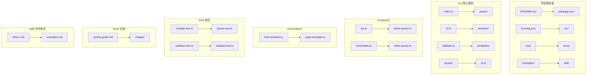

**图表来源**
- [README.md:110-125](file://README.md#L110-L125)
- [package.json:1-56](file://package.json#L1-L56)

**章节来源**
- [README.md:110-125](file://README.md#L110-L125)
- [package.json:1-56](file://package.json#L1-L56)

## 贡献流程

### Fork 和克隆

1. **Fork 仓库**：访问 GitHub 仓库页面，点击右上角的 Fork 按钮
2. **克隆到本地**：
   ```bash
   git clone https://github.com/你的用户名/wyw.git
   cd wyw
   ```
3. **安装依赖**：
   ```bash
   npm install
   ```

### 分支管理

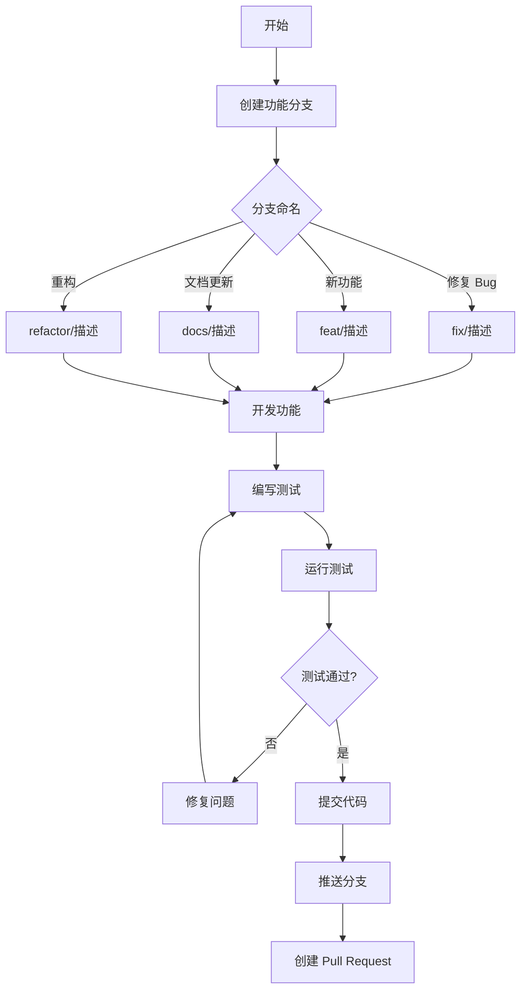

**图表来源**
- [src/cli.ts:28-114](file://src/cli.ts#L28-L114)

### Pull Request 提交规范

1. **代码变更**：确保代码符合编码规范
2. **测试覆盖**：新增功能必须包含相应测试
3. **文档更新**：更新相关文档和示例
4. **提交信息**：遵循约定式提交规范

**章节来源**
- [src/cli.ts:28-114](file://src/cli.ts#L28-L114)

## 编码规范

### TypeScript 配置

项目使用严格的 TypeScript 配置：

- **目标版本**：ES2022
- **模块系统**：NodeNext
- **严格模式**：启用
- **声明文件**：生成 .d.ts 文件
- **Source Map**：启用调试支持

### 代码风格指南

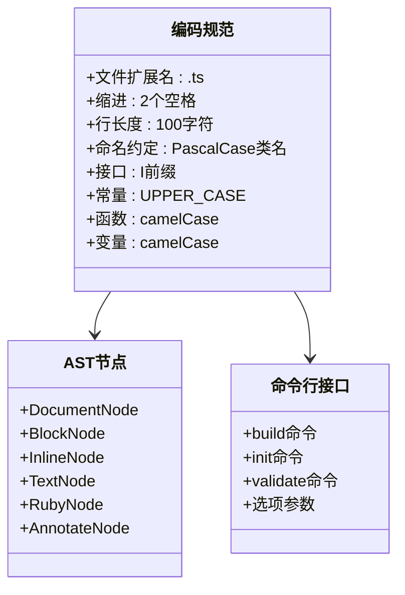

**图表来源**
- [tsconfig.json:1-19](file://tsconfig.json#L1-L19)
- [src/parser/ast.ts:1-218](file://src/parser/ast.ts#L1-L218)

### 接口设计原则

1. **单一职责**：每个接口只负责一个功能领域
2. **开放封闭**：对扩展开放，对修改封闭
3. **里氏替换**：子类可以替换父类
4. **接口隔离**：客户端不应该依赖不需要的接口

**章节来源**
- [tsconfig.json:1-19](file://tsconfig.json#L1-L19)
- [src/parser/ast.ts:1-218](file://src/parser/ast.ts#L1-L218)

## 代码审查标准

### 代码质量检查

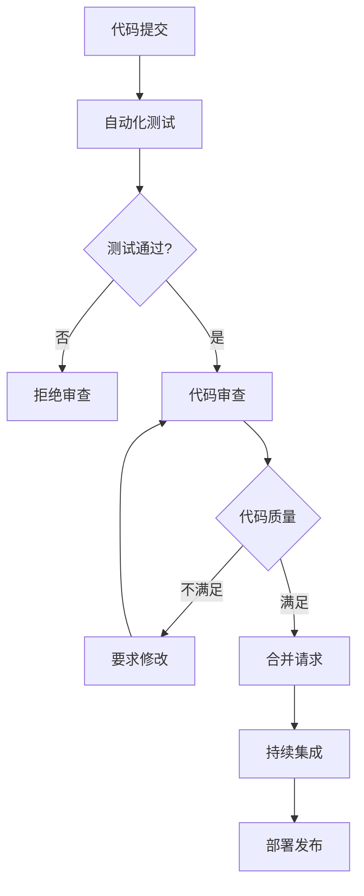

**图表来源**
- [test/compile.test.ts:1-210](file://test/compile.test.ts#L1-L210)
- [test/parser.test.ts:1-283](file://test/parser.test.ts#L1-L283)

### 审查清单

1. **功能完整性**：是否满足需求规格
2. **代码质量**：是否符合编码规范
3. **测试覆盖**：是否有足够的测试用例
4. **文档更新**：是否更新了相关文档
5. **性能影响**：是否引入性能问题
6. **兼容性**：是否破坏向后兼容性

**章节来源**
- [test/validator.test.ts:1-428](file://test/validator.test.ts#L1-L428)

## Issue 报告模板

### Bug 报告模板

```markdown
## Bug 描述

**重现步骤**
1. 打开 '.wyw' 文件
2. 运行编译命令
3. 查看输出结果

**期望行为**
[描述期望的结果]

**实际行为**
[描述实际发生的情况]

**环境信息**
- 操作系统: [例如: macOS, Windows, Linux]
- Node.js 版本: [例如: 18.x]
- wyw 版本: [例如: 0.1.x]

**日志信息**
[粘贴相关错误日志]

**附加信息**
[任何相关的截图或补充信息]
```

### 功能请求模板

```markdown
## 功能请求

**需求描述**
[清晰简洁地描述需要的功能]

**使用场景**
[描述具体的使用场景和需求背景]

**解决方案建议**
[如果有的话，提供可能的实现方案]

**相关文件**
[提及相关的 .wyw 文件或配置文件]

**附加信息**
[任何相关的截图、示例或其他补充信息]
```

## 文档贡献指南

### 文档类型

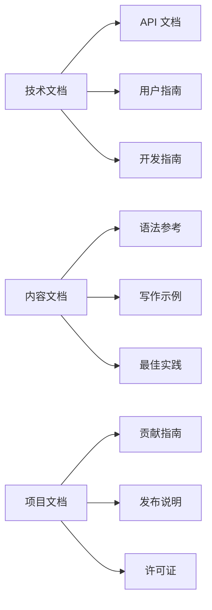

**图表来源**
- [docs/syntax-guide.md:1-250](file://docs/syntax-guide.md#L1-L250)
- [skill/wyw-writer/SKILL.md:1-153](file://skill/wyw-writer/SKILL.md#L1-L153)

### 文档更新流程

1. **选择文档**：确定需要更新的文档类型
2. **修改内容**：编辑相应的 Markdown 文件
3. **本地预览**：使用文档工具预览效果
4. **提交更改**：创建 Pull Request
5. **审查合并**：等待维护者审查和合并

**章节来源**
- [docs/syntax-guide.md:1-250](file://docs/syntax-guide.md#L1-L250)
- [skill/wyw-writer/SKILL.md:1-153](file://skill/wyw-writer/SKILL.md#L1-L153)

## 社区行为准则

### 基本原则

1. **尊重包容**：尊重不同观点和背景的贡献者
2. **积极沟通**：保持开放和建设性的对话
3. **寻求帮助**：遇到困难时主动寻求帮助
4. **分享知识**：乐于分享经验和知识
5. **持续改进**：不断学习和改进

### 行为标准

- 使用欢迎和包容的语言
- 尊重不同的观点和经验
- 提供建设性的反馈
- 关注社区整体利益
- 以身作则，成为榜样

## 沟通渠道

### 主要沟通平台

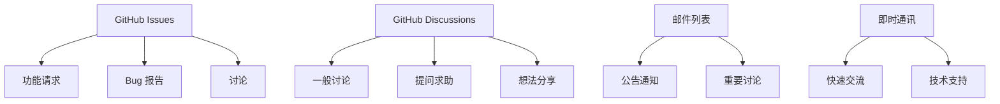

**图表来源**
- [README.md:1-130](file://README.md#L1-L130)

### 响应时间

- **Bug 修复**：工作日 24-48 小时内响应
- **功能请求**：工作日 48-72 小时内响应
- **一般讨论**：工作日 72 小时内响应

**章节来源**
- [README.md:1-130](file://README.md#L1-L130)

## 新贡献者入门

### 第一次贡献步骤

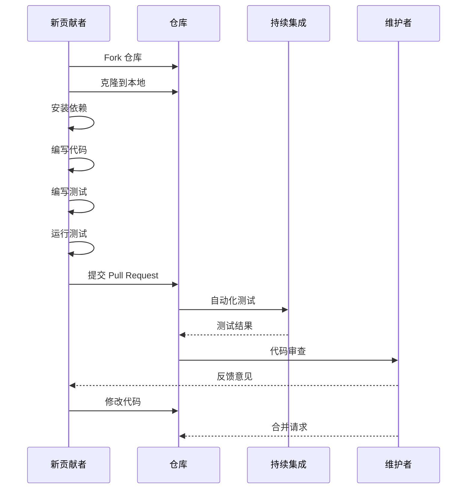

**图表来源**
- [test/compile.test.ts:1-210](file://test/compile.test.ts#L1-L210)

### 必备技能

1. **基础技能**
   - Git 版本控制
   - JavaScript/TypeScript 基础
   - Markdown 文档编写

2. **开发环境**
   - Node.js 环境
   - npm 包管理器
   - VS Code 或类似编辑器

3. **项目特定**
   - 文言文标记语言语法
   - HTML/CSS 基础
   - 测试框架使用

**章节来源**
- [test/parser.test.ts:1-283](file://test/parser.test.ts#L1-L283)

## 常见问题解答

### 开发环境设置

**问：如何设置开发环境？**
答：按照以下步骤操作：
1. 克隆仓库到本地
2. 运行 `npm install` 安装依赖
3. 使用 `npm run dev` 启动开发服务器
4. 使用 `npm test` 运行测试

**问：如何运行测试？**
答：项目提供了多种测试方式：
- `npm test` - 运行所有测试
- `npm run build` - 编译 TypeScript 源码
- `npm run build:examples` - 编译示例文件

**问：如何贡献代码？**
答：遵循以下流程：
1. Fork 仓库并创建功能分支
2. 编写代码和测试
3. 运行所有测试确保通过
4. 提交 Pull Request

### 代码规范问题

**问：如何处理 TypeScript 编译错误？**
答：检查以下方面：
- 确保所有变量都有正确的类型声明
- 检查接口实现是否完整
- 验证异步函数的 Promise 处理

**问：如何编写单元测试？**
答：遵循以下原则：
- 每个功能模块至少有一个测试文件
- 测试覆盖率不低于 80%
- 使用描述性的测试名称
- 包含边界条件测试

**章节来源**
- [test/validator.test.ts:1-428](file://test/validator.test.ts#L1-L428)

## 架构概览

### 系统架构

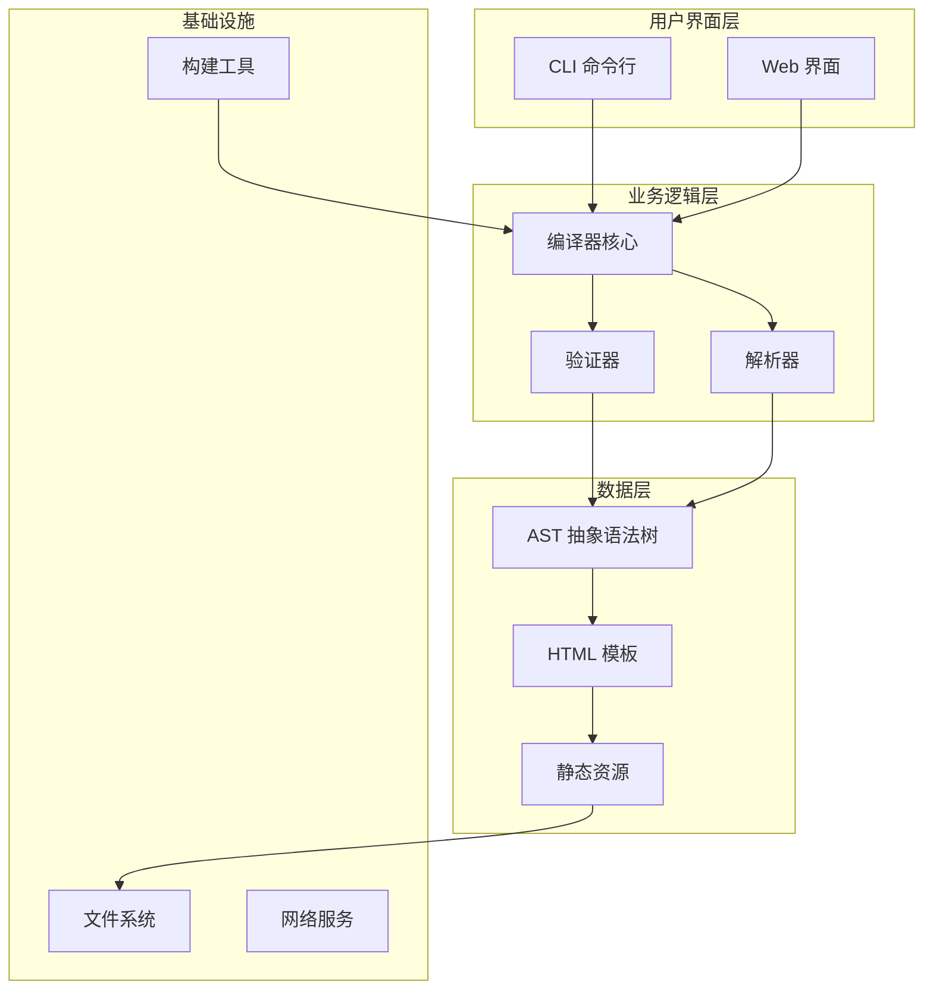

**图表来源**
- [src/index.ts:1-57](file://src/index.ts#L1-L57)
- [src/cli.ts:1-182](file://src/cli.ts#L1-L182)

### 核心组件关系

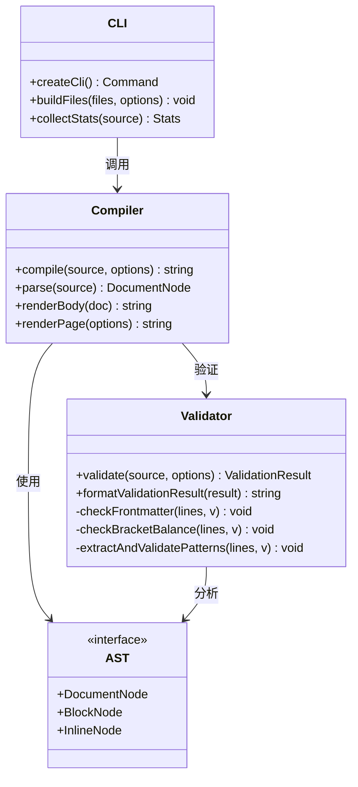

**图表来源**
- [src/index.ts:1-57](file://src/index.ts#L1-L57)
- [src/cli.ts:1-182](file://src/cli.ts#L1-L182)
- [src/validator.ts:1-838](file://src/validator.ts#L1-L838)

**章节来源**
- [src/index.ts:1-57](file://src/index.ts#L1-L57)
- [src/cli.ts:1-182](file://src/cli.ts#L1-L182)
- [src/validator.ts:1-838](file://src/validator.ts#L1-L838)

## 依赖关系分析

### 核心依赖

```mermaid
graph LR
A[wyw 项目] --> B[commander ^13.1.0]
A --> C[handlebars ^4.7.9]
A --> D[heti ^0.9.6]
A --> E[typescript ^6.0.3]
A --> F[tsx ^4.21.0]
A --> G[@types/node ^25.6.0]
B --> H[命令行解析]
C --> I[HTML 模板渲染]
D --> J[排版引擎]
E --> K[类型检查]
F --> L[测试执行]
G --> M[Node.js 类型定义]
```

**图表来源**
- [package.json:45-54](file://package.json#L45-L54)

### 开发依赖管理

项目使用现代化的依赖管理策略：

1. **生产依赖**：最小化核心功能所需依赖
2. **开发依赖**：开发和测试环境专用
3. **类型定义**：完整的 TypeScript 类型支持
4. **构建工具**：高效的 TypeScript 编译

**章节来源**
- [package.json:45-54](file://package.json#L45-L54)

## 性能考虑

### 编译性能优化

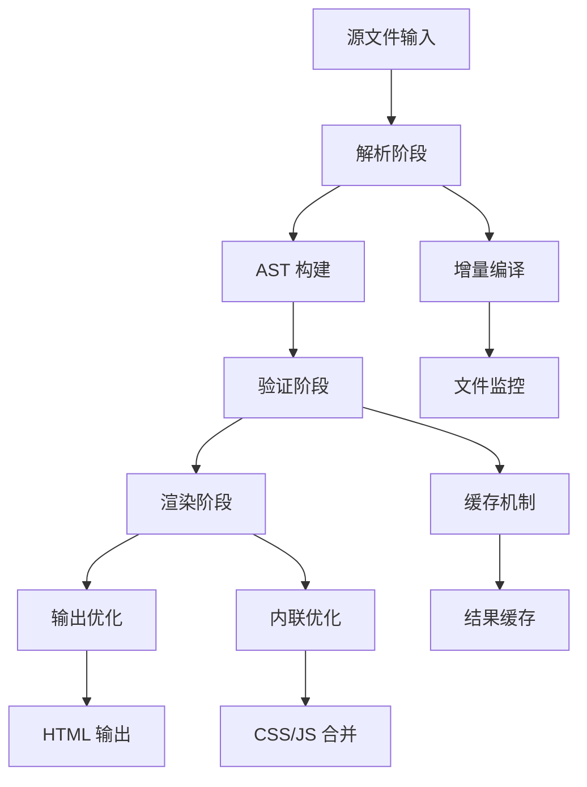

**图表来源**
- [src/cli.ts:116-164](file://src/cli.ts#L116-L164)

### 性能优化策略

1. **增量编译**：监听文件变化，只重新编译受影响的文件
2. **缓存机制**：缓存解析和验证结果
3. **内联优化**：可选的 CSS/JS 内联减少 HTTP 请求
4. **资源压缩**：自动压缩静态资源文件

## 故障排除指南

### 常见问题诊断

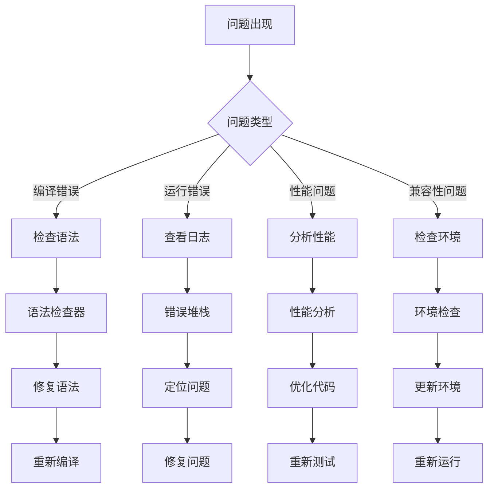

**图表来源**
- [src/validator.ts:758-779](file://src/validator.ts#L758-L779)

### 调试技巧

1. **启用详细日志**：使用 `--verbose` 参数查看更多信息
2. **逐步验证**：使用 `validate` 命令单独验证文件
3. **检查依赖**：确保所有依赖都正确安装
4. **清理缓存**：删除 `node_modules/.cache` 目录重新构建

**章节来源**
- [src/validator.ts:758-779](file://src/validator.ts#L758-L779)

## 结论

文言文标记语言编译器项目为文言文数字化提供了强大的工具支持。通过遵循本贡献指南，新贡献者可以快速融入项目，为文言文教育和文化传承做出贡献。

### 项目愿景

- **教育价值**：为文言文学习提供更好的工具
- **技术先进**：采用最新的前端技术和最佳实践
- **社区驱动**：建立活跃的开源社区生态
- **可持续发展**：保持项目的长期健康发展

### 下一步行动

1. **选择合适的任务**：从简单的文档改进开始
2. **参与社区讨论**：关注 GitHub Issues 和 Discussions
3. **贡献代码**：从小功能开始，逐步承担更大责任
4. **帮助他人**：积极回答新手问题，分享经验

感谢您对文言文编译器项目的关注和贡献！