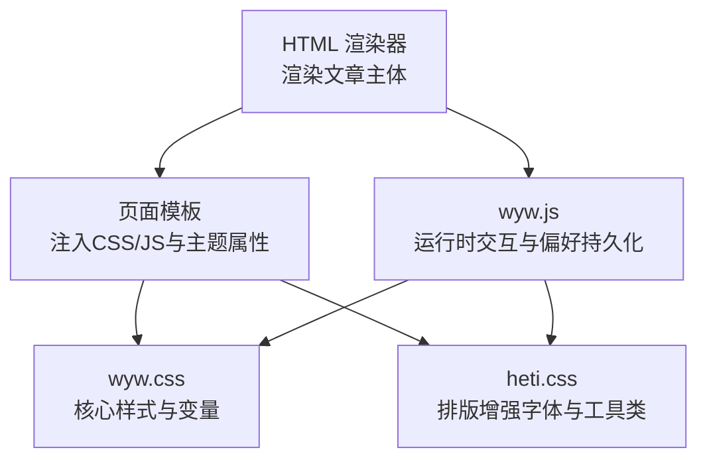
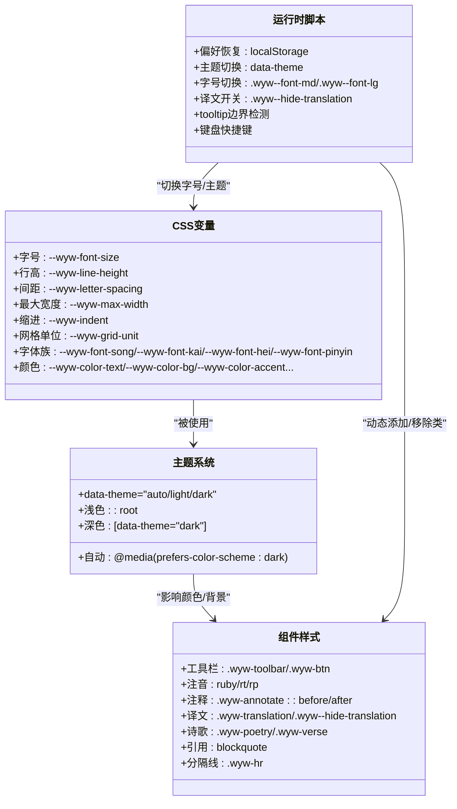
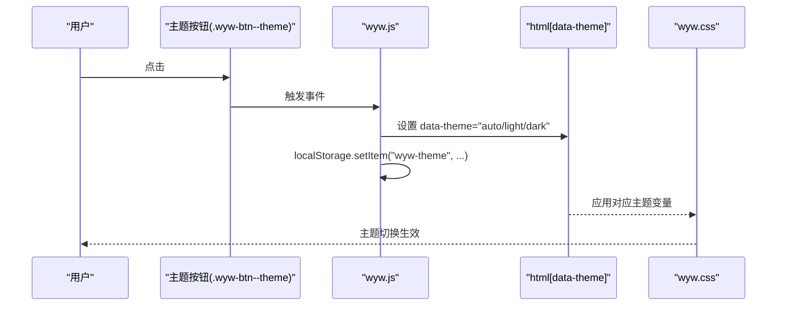
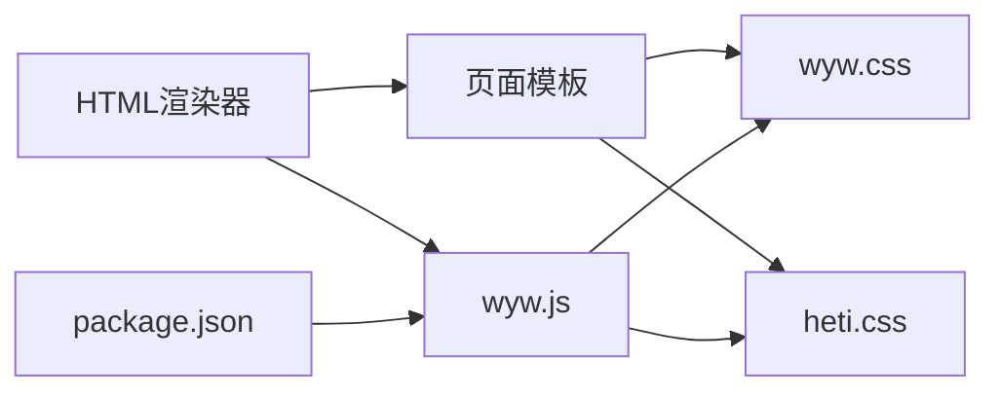

# CSS样式系统

<cite>
**本文引用的文件**
- [src/assets/wyw.css](file://src/assets/wyw.css)
- [src/assets/heti.css](file://src/assets/heti.css)
- [src/assets/wyw.js](file://src/assets/wyw.js)
- [src/renderer/html-renderer.ts](file://src/renderer/html-renderer.ts)
- [src/renderer/page-template.ts](file://src/renderer/page-template.ts)
- [src/templates/page.hbs](file://src/templates/page.hbs)
- [package.json](file://package.json)
- [examples/刘禹锡_陋室铭.wyw](file://examples/刘禹锡_陋室铭.wyw)
</cite>

## 目录
1. [简介](#简介)
2. [项目结构](#项目结构)
3. [核心组件](#核心组件)
4. [架构总览](#架构总览)
5. [详细组件分析](#详细组件分析)
6. [依赖关系分析](#依赖关系分析)
7. [性能考量](#性能考量)
8. [故障排查指南](#故障排查指南)
9. [结论](#结论)
10. [附录](#附录)

## 简介
本文件系统性阐述文言文编译器的CSS样式系统，重点覆盖：
- CSS变量体系的组织与使用（字号、行高、间距、字体、颜色）
- 深色/浅色主题与自动跟随系统
- 中文排版优化（字距、行高、对齐、标点挤压、中西文间距）
- 响应式设计断点与适配策略
- 特殊组件样式（工具栏、注音、注释、译文、诗歌块、引用、分隔线等）
- 打印样式与跨浏览器兼容
- 自定义样式最佳实践与扩展指南

## 项目结构
样式系统由三部分组成：
- 核心样式：wyw.css，定义变量、主题、排版、组件样式
- 排版增强：heti.css，提供中文字体族与标点挤压、间距工具类
- 运行时脚本：wyw.js，负责主题、字号、译文、工具提示定位、键盘快捷键等交互

图表来源
- [src/renderer/html-renderer.ts:20-44](file://src/renderer/html-renderer.ts#L20-L44)
- [src/renderer/page-template.ts:25-68](file://src/renderer/page-template.ts#L25-L68)
- [src/assets/wyw.css:1-657](file://src/assets/wyw.css#L1-L657)
- [src/assets/heti.css:1-180](file://src/assets/heti.css#L1-L180)
- [src/assets/wyw.js:1-204](file://src/assets/wyw.js#L1-L204)

章节来源
- [src/renderer/html-renderer.ts:20-44](file://src/renderer/html-renderer.ts#L20-L44)
- [src/renderer/page-template.ts:25-68](file://src/renderer/page-template.ts#L25-L68)
- [src/templates/page.hbs:1-17](file://src/templates/page.hbs#L1-L17)

## 核心组件
- CSS变量系统：集中管理字号、行高、间距、字体族、颜色等，支持主题切换与字号档位
- 主题系统：通过data-theme属性在浅色/深色/自动之间切换，自动跟随系统偏好
- 中文排版增强：基于heti的字体族与标点挤压、中西文间距工具类
- 组件样式：工具栏、注音(ruby)、注释(tooltip)、译文折叠、诗歌块、引用、分隔线等
- 响应式设计：移动端断点适配，窄屏tooltip边界检测
- 打印样式：隐藏工具栏、强制显示译文、禁用tooltip

章节来源
- [src/assets/wyw.css:6-68](file://src/assets/wyw.css#L6-L68)
- [src/assets/wyw.css:415-498](file://src/assets/wyw.css#L415-L498)
- [src/assets/wyw.css:535-554](file://src/assets/wyw.css#L535-L554)
- [src/assets/heti.css:10-129](file://src/assets/heti.css#L10-L129)
- [src/assets/wyw.js:20-45](file://src/assets/wyw.js#L20-L45)

## 架构总览
样式系统采用“变量驱动 + 主题切换 + 组件化样式”的架构，配合运行时脚本实现用户偏好的持久化与动态更新。

图表来源
- [src/assets/wyw.css:6-68](file://src/assets/wyw.css#L6-L68)
- [src/assets/wyw.css:43-68](file://src/assets/wyw.css#L43-L68)
- [src/assets/wyw.css:415-498](file://src/assets/wyw.css#L415-L498)
- [src/assets/wyw.css:223-313](file://src/assets/wyw.css#L223-L313)
- [src/assets/wyw.css:194-221](file://src/assets/wyw.css#L194-L221)
- [src/assets/wyw.css:338-392](file://src/assets/wyw.css#L338-L392)
- [src/assets/wyw.css:393-404](file://src/assets/wyw.css#L393-L404)
- [src/assets/wyw.css:407-413](file://src/assets/wyw.css#L407-L413)
- [src/assets/wyw.js:20-127](file://src/assets/wyw.js#L20-L127)

## 详细组件分析

### CSS变量系统
- 变量类别
  - 字号：标准、大号、小号、超小号
  - 行高：常规、紧凑、宽松
  - 间距：字距、最大宽度、首行缩进、网格单位
  - 字体：宋体、楷体、黑体、拼音字体族
  - 颜色：文本、浅文本、柔和文本、背景、强调色、边框、tooltip背景与文本
- 使用方式
  - 通过var()在各组件中引用
  - 通过字号档位类(.wyw--font-md/.wyw--font-lg)批量调整字号变量
  - 通过网格单位(--wyw-grid-unit)保持垂直节奏一致

章节来源
- [src/assets/wyw.css:6-30](file://src/assets/wyw.css#L6-L30)
- [src/assets/wyw.css:71-83](file://src/assets/wyw.css#L71-L83)
- [src/assets/wyw.css:105-117](file://src/assets/wyw.css#L105-L117)

### 主题系统与切换机制
- 主题类型
  - auto：跟随系统深色/浅色偏好
  - light：浅色主题
  - dark：深色主题
- 切换流程
  - 用户点击主题按钮，脚本循环切换当前主题值
  - 更新html的data-theme属性
  - 本地存储保存主题偏好
  - 样式根据[data-theme]选择对应颜色变量

图表来源
- [src/assets/wyw.js:99-127](file://src/assets/wyw.js#L99-L127)
- [src/assets/wyw.css:43-68](file://src/assets/wyw.css#L43-L68)
- [src/templates/page.hbs:2](file://src/templates/page.hbs#L2)

章节来源
- [src/assets/wyw.js:99-127](file://src/assets/wyw.js#L99-L127)
- [src/assets/wyw.css:43-68](file://src/assets/wyw.css#L43-L68)
- [src/renderer/page-template.ts:31-33](file://src/renderer/page-template.ts#L31-L33)

### 中文排版优化
- 字距与行高
  - 默认字距0.05em，正文行高1.8，注音模式下段落行高放宽至2.4
  - 网格单位calc(--wyw-font-size * --wyw-line-height)用于统一垂直间距
- 标点与中西文间距
  - 引入heti的spacing与adjacent工具类，配合heti-addon进行标点挤压与中西文间距微调
- 文本对齐
  - 正文两端对齐，标题使用居中或强调对齐风格

章节来源
- [src/assets/wyw.css:19-23](file://src/assets/wyw.css#L19-L23)
- [src/assets/wyw.css:119-122](file://src/assets/wyw.css#L119-L122)
- [src/assets/heti.css:135-166](file://src/assets/heti.css#L135-L166)
- [src/assets/wyw.js:169-178](file://src/assets/wyw.js#L169-L178)

### 响应式设计
- 断点与适配
  - 768px：调整字号、内边距、工具栏尺寸与位置
  - 480px：进一步缩小字号，优化窄屏tooltip最大宽度
- 视口与可访问性
  - 设置viewport，确保移动端体验
  - 工具栏固定定位，便于触达

章节来源
- [src/assets/wyw.css:462-533](file://src/assets/wyw.css#L462-L533)
- [src/templates/page.hbs:5](file://src/templates/page.hbs#L5)

### 特殊组件样式

#### 工具栏
- 固定在右下角，列向排列，按钮圆形，悬停/按下动效
- 译文按钮处于激活态时改变背景与文字色

章节来源
- [src/assets/wyw.css:415-461](file://src/assets/wyw.css#L415-L461)
- [src/assets/wyw.css:455-460](file://src/assets/wyw.css#L455-L460)

#### 注音(ruby)与注释(tooltip)
- 注音：ruby基字与rt注音，rt使用拼音字体与较小字号
- 注释：.wyw-annotate悬停显示tooltip，支持左右边界检测自动对齐
- 注音+注释组合：单字或多字注音包裹在wyw-annotate中

章节来源
- [src/assets/wyw.css:223-238](file://src/assets/wyw.css#L223-L238)
- [src/assets/wyw.css:240-313](file://src/assets/wyw.css#L240-L313)
- [src/assets/wyw.js:129-178](file://src/assets/wyw.js#L129-L178)
- [src/renderer/html-renderer.ts:200-225](file://src/renderer/html-renderer.ts#L200-L225)

#### 译文
- 默认折叠，通过类名控制展开/收起
- 支持动画过渡，隐藏时透明度与高度归零

章节来源
- [src/assets/wyw.css:194-221](file://src/assets/wyw.css#L194-L221)
- [src/assets/wyw.js:47-57](file://src/assets/wyw.js#L47-L57)

#### 诗歌块
- 标题、副标题、诗句段落分别使用不同层级标题与样式
- 诗句分行显示，首行无缩进，段落间分隔线

章节来源
- [src/assets/wyw.css:338-392](file://src/assets/wyw.css#L338-L392)
- [src/renderer/html-renderer.ts:125-186](file://src/renderer/html-renderer.ts#L125-L186)

#### 引用与分隔线
- 引用块左侧强调色竖线，文本柔和色
- 分隔线为细水平线，居中且限制最大宽度

章节来源
- [src/assets/wyw.css:393-404](file://src/assets/wyw.css#L393-L404)
- [src/assets/wyw.css:407-413](file://src/assets/wyw.css#L407-L413)

### 打印样式与跨浏览器兼容
- 打印样式
  - 隐藏工具栏
  - 取消最大宽度，正文无内边距
  - 强制显示译文，禁用tooltip
- 跨浏览器兼容
  - 启用字体抗锯齿
  - 使用CSS变量与现代选择器，配合heti字体族提升中文字体一致性

章节来源
- [src/assets/wyw.css:535-554](file://src/assets/wyw.css#L535-L554)
- [src/assets/wyw.css:92-95](file://src/assets/wyw.css#L92-L95)
- [src/assets/heti.css:10-129](file://src/assets/heti.css#L10-L129)

## 依赖关系分析
- 渲染器与模板
  - 渲染器生成文章主体与工具栏
  - 模板注入CSS/JS与主题属性，决定初始主题与类名
- 脚本与样式
  - 脚本读取/写入localStorage，动态切换类名与data-theme
  - 样式通过CSS变量与选择器响应变化
- 第三方库
  - 通过构建脚本复制heti-addon.min.js到资源目录，运行时初始化排版增强

图表来源
- [src/renderer/html-renderer.ts:20-44](file://src/renderer/html-renderer.ts#L20-L44)
- [src/renderer/page-template.ts:25-68](file://src/renderer/page-template.ts#L25-L68)
- [src/assets/wyw.css:1-657](file://src/assets/wyw.css#L1-L657)
- [src/assets/heti.css:1-180](file://src/assets/heti.css#L1-L180)
- [src/assets/wyw.js:1-204](file://src/assets/wyw.js#L1-L204)
- [package.json:18-21](file://package.json#L18-L21)

章节来源
- [src/renderer/page-template.ts:41-57](file://src/renderer/page-template.ts#L41-L57)
- [package.json:18-21](file://package.json#L18-L21)

## 性能考量
- CSS变量减少重复计算，提高主题切换与字号切换的流畅度
- 工具栏固定定位与最小化重绘，降低滚动时的布局抖动
- 响应式断点数量较少，减少媒体查询匹配开销
- 打印样式仅在打印时生效，不影响屏幕渲染性能

## 故障排查指南
- 主题未切换
  - 检查html的data-theme属性是否正确设置
  - 确认localStorage中"wyw-theme"值
- 译文无法显示/隐藏
  - 检查文章容器是否包含.wyw--hide-translation类
  - 确认工具栏按钮的aria-pressed状态
- 注音/注释显示异常
  - 确认heti-addon已加载并初始化成功
  - 检查tooltip定位逻辑是否触发边界检测
- 移动端显示问题
  - 检查viewport设置
  - 确认窄屏断点下的样式覆盖是否生效

章节来源
- [src/assets/wyw.js:20-45](file://src/assets/wyw.js#L20-L45)
- [src/assets/wyw.js:129-178](file://src/assets/wyw.js#L129-L178)
- [src/templates/page.hbs:5](file://src/templates/page.hbs#L5)

## 结论
该CSS样式系统以变量为核心，结合主题与组件化样式，实现了文言文内容的高质量呈现。通过与heti的排版增强集成，以及运行时脚本的偏好持久化与交互能力，整体在可读性、可访问性与可维护性方面达到良好平衡。建议在扩展新组件时遵循变量优先、主题一致、响应式适配的原则。

## 附录

### 使用示例与参考
- 示例文档展示了注音、注释、译文、诗歌块等语法如何映射到样式类
- 页面模板负责注入CSS/JS与初始主题属性

章节来源
- [examples/刘禹锡_陋室铭.wyw:7-21](file://examples/刘禹锡_陋室铭.wyw#L7-L21)
- [src/templates/page.hbs:1-17](file://src/templates/page.hbs#L1-L17)