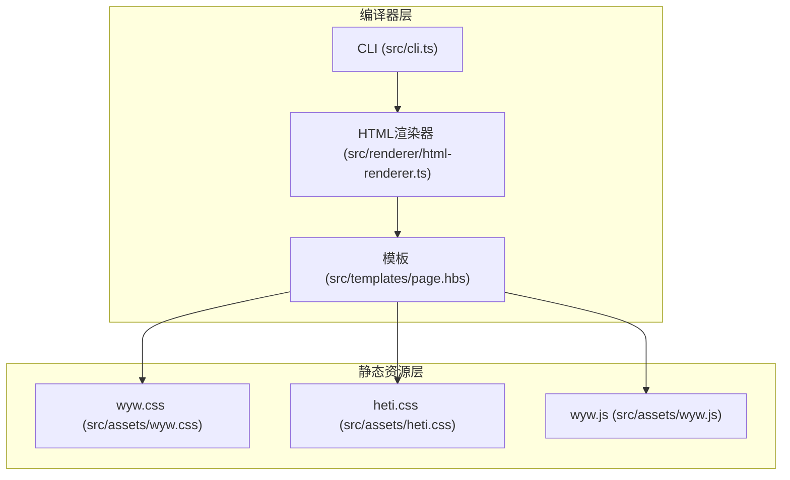
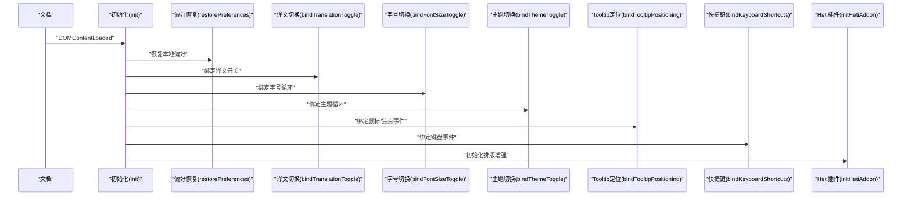
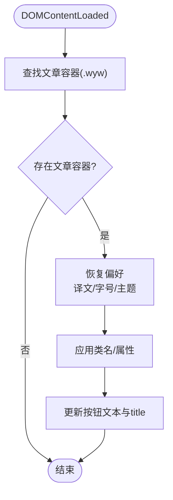
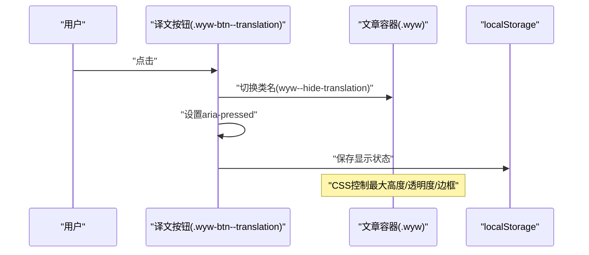
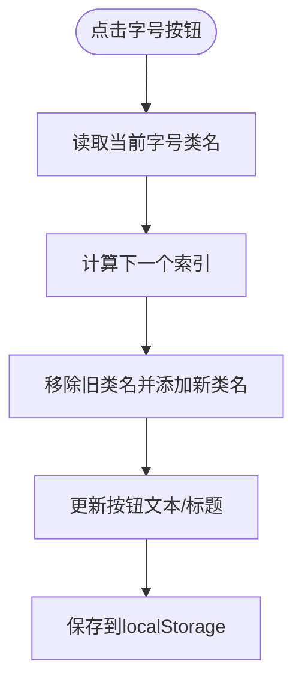
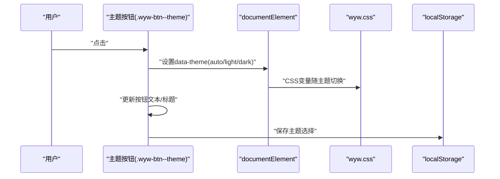
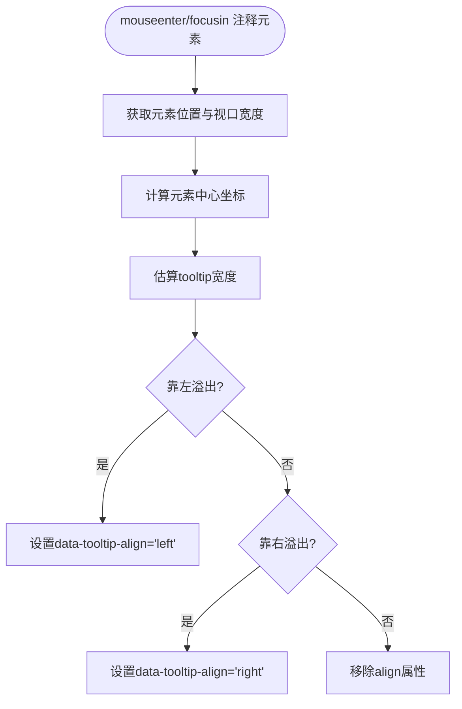
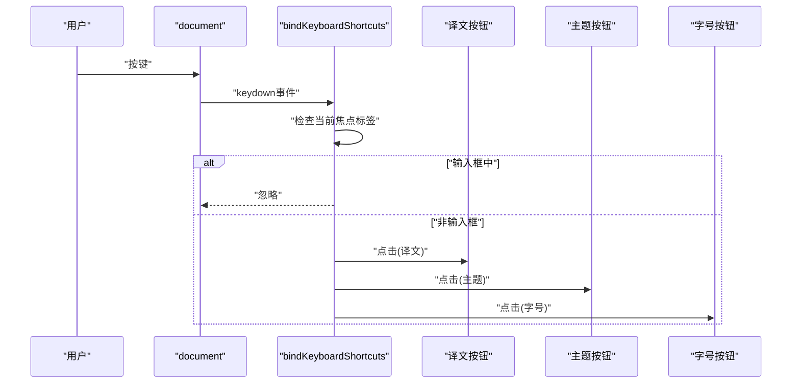
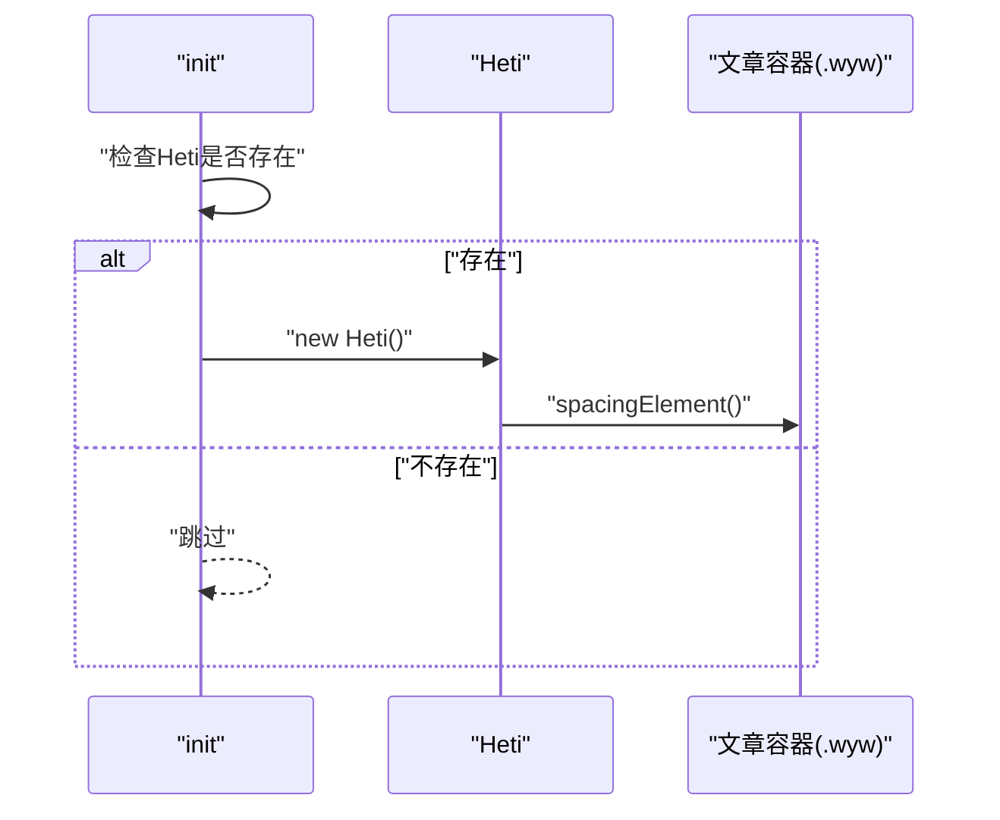
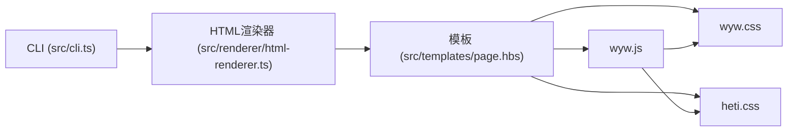

# JavaScript交互扩展

<cite>
**本文引用的文件**
- [bin/wyw.js](file://bin/wyw.js)
- [src/assets/wyw.js](file://src/assets/wyw.js)
- [src/assets/wyw.css](file://src/assets/wyw.css)
- [src/assets/heti.css](file://src/assets/heti.css)
- [src/renderer/html-renderer.ts](file://src/renderer/html-renderer.ts)
- [src/templates/page.hbs](file://src/templates/page.hbs)
- [src/cli.ts](file://src/cli.ts)
- [package.json](file://package.json)
- [README.md](file://README.md)
</cite>

## 目录
1. [简介](#简介)
2. [项目结构](#项目结构)
3. [核心组件](#核心组件)
4. [架构总览](#架构总览)
5. [详细组件分析](#详细组件分析)
6. [依赖关系分析](#依赖关系分析)
7. [性能考量](#性能考量)
8. [故障排查指南](#故障排查指南)
9. [结论](#结论)
10. [附录](#附录)

## 简介
本文件面向文言文编译器的JavaScript交互扩展，聚焦 wyw.js 的功能实现与交互设计，涵盖工具栏控制、注音显示切换、译文折叠展开、事件监听机制与DOM操作策略、用户偏好持久化、与CSS样式的协作与动态切换、键盘快捷键与无障碍访问支持，以及扩展新交互功能的开发指南与最佳实践，并说明与第三方库（如赫蹏）的兼容性处理。

## 项目结构
该仓库采用“编译器 + 模板 + 静态资源”的分层组织：
- CLI 层：负责命令行解析、文件编译与资源复制
- 渲染层：将AST转换为HTML，注入工具栏与注音/注释节点
- 模板层：Handlebars 模板拼接最终HTML
- 静态资源层：wyw.css、heti.css、wyw.js 等

图表来源
- [src/cli.ts:116-164](file://src/cli.ts#L116-L164)
- [src/renderer/html-renderer.ts:20-44](file://src/renderer/html-renderer.ts#L20-L44)
- [src/templates/page.hbs:1-17](file://src/templates/page.hbs#L1-L17)
- [src/assets/wyw.css:1-657](file://src/assets/wyw.css#L1-L657)
- [src/assets/heti.css:1-180](file://src/assets/heti.css#L1-L180)
- [src/assets/wyw.js:1-204](file://src/assets/wyw.js#L1-L204)

章节来源
- [README.md:110-125](file://README.md#L110-L125)
- [src/cli.ts:116-164](file://src/cli.ts#L116-L164)
- [src/renderer/html-renderer.ts:20-44](file://src/renderer/html-renderer.ts#L20-L44)
- [src/templates/page.hbs:1-17](file://src/templates/page.hbs#L1-L17)

## 核心组件
- wyw.js：浏览器端交互脚本，负责初始化、事件绑定、状态持久化、动态样式切换与无障碍属性更新
- wyw.css：文言文排版与主题、字号、工具栏、注释tooltip、译文折叠等样式
- heti.css：赫蹏字体与间距增强的基础样式
- HTML渲染器：在模板中注入工具栏、注音、注释节点
- CLI：编译流程、资源复制、内联或分离模式

章节来源
- [src/assets/wyw.js:1-204](file://src/assets/wyw.js#L1-L204)
- [src/assets/wyw.css:1-657](file://src/assets/wyw.css#L1-L657)
- [src/assets/heti.css:1-180](file://src/assets/heti.css#L1-L180)
- [src/renderer/html-renderer.ts:72-78](file://src/renderer/html-renderer.ts#L72-L78)
- [src/cli.ts:138-147](file://src/cli.ts#L138-L147)

## 架构总览
wyw.js 作为浏览器端初始化脚本，在 DOMContentLoaded 后执行初始化，绑定各类交互事件，同时与CSS变量、data-theme、类名切换协同工作，实现主题、字号、译文显示状态的动态控制。

图表来源
- [src/assets/wyw.js:5-18](file://src/assets/wyw.js#L5-L18)
- [src/assets/wyw.js:21-45](file://src/assets/wyw.js#L21-L45)
- [src/assets/wyw.js:48-57](file://src/assets/wyw.js#L48-L57)
- [src/assets/wyw.js:62-97](file://src/assets/wyw.js#L62-L97)
- [src/assets/wyw.js:100-127](file://src/assets/wyw.js#L100-L127)
- [src/assets/wyw.js:129-178](file://src/assets/wyw.js#L129-L178)
- [src/assets/wyw.js:181-202](file://src/assets/wyw.js#L181-L202)

## 详细组件分析

### 初始化与偏好恢复
- DOMContentLoaded 触发后，查找文章容器并恢复用户偏好：译文显示状态、字号档位、主题模式
- 译文显示状态通过类名切换与按钮的 aria-pressed 属性同步
- 字号与主题分别写入类名与 data-theme 属性，并更新按钮文本与title
- 使用 localStorage 存储用户选择，确保刷新后状态一致

图表来源
- [src/assets/wyw.js:5-18](file://src/assets/wyw.js#L5-L18)
- [src/assets/wyw.js:21-45](file://src/assets/wyw.js#L21-L45)

章节来源
- [src/assets/wyw.js:5-18](file://src/assets/wyw.js#L5-L18)
- [src/assets/wyw.js:21-45](file://src/assets/wyw.js#L21-L45)

### 译文显示切换
- 工具栏按钮点击时，切换文章容器上的隐藏类名，并同步按钮的 aria-pressed
- 状态持久化到 localStorage，下次进入页面自动恢复
- CSS 通过隐藏类名控制译文的最大高度、透明度与边框颜色，配合过渡动画实现平滑折叠/展开

图表来源
- [src/assets/wyw.js:48-57](file://src/assets/wyw.js#L48-L57)
- [src/assets/wyw.css:212-221](file://src/assets/wyw.css#L212-L221)

章节来源
- [src/assets/wyw.js:48-57](file://src/assets/wyw.js#L48-L57)
- [src/assets/wyw.css:194-221](file://src/assets/wyw.css#L194-L221)

### 字号切换
- 支持“标准/中号/大号”三档循环切换
- 通过移除/添加类名切换字号变量，同时更新按钮文本与title
- 响应式媒体查询在窄屏下也相应调整字号变量

图表来源
- [src/assets/wyw.js:62-97](file://src/assets/wyw.js#L62-L97)
- [src/assets/wyw.css:70-83](file://src/assets/wyw.css#L70-L83)
- [src/assets/wyw.css:462-533](file://src/assets/wyw.css#L462-L533)

章节来源
- [src/assets/wyw.js:62-97](file://src/assets/wyw.js#L62-L97)
- [src/assets/wyw.css:70-83](file://src/assets/wyw.css#L70-L83)
- [src/assets/wyw.css:462-533](file://src/assets/wyw.css#L462-L533)

### 主题切换
- 支持“自动/浅色/深色”三档循环切换
- 通过设置 documentElement 的 data-theme 属性驱动CSS变量切换
- 按钮文本与title根据主题动态更新；同时尊重系统 prefers-color-scheme

图表来源
- [src/assets/wyw.js:100-127](file://src/assets/wyw.js#L100-L127)
- [src/assets/wyw.css:43-68](file://src/assets/wyw.css#L43-L68)
- [src/assets/wyw.css:535-554](file://src/assets/wyw.css#L535-L554)

章节来源
- [src/assets/wyw.js:100-127](file://src/assets/wyw.js#L100-L127)
- [src/assets/wyw.css:43-68](file://src/assets/wyw.css#L43-L68)
- [src/assets/wyw.css:535-554](file://src/assets/wyw.css#L535-L554)

### Tooltip边界检测与定位
- 为注释元素（类名 wyw-annotate）在 mouseenter/focusin 时进行边界检测
- 依据元素中心与视口宽度估算tooltip宽度，决定左对齐或右对齐，避免溢出
- 通过 data-tooltip-align 属性动态设置定位，CSS中对应不同对齐规则

图表来源
- [src/assets/wyw.js:129-178](file://src/assets/wyw.js#L129-L178)
- [src/assets/wyw.css:302-312](file://src/assets/wyw.css#L302-L312)

章节来源
- [src/assets/wyw.js:129-178](file://src/assets/wyw.js#L129-L178)
- [src/assets/wyw.css:240-312](file://src/assets/wyw.css#L240-L312)

### 键盘快捷键支持
- 在全局 document 上监听 keydown
- 忽略输入框中的快捷键触发
- T/t：切换译文；D/d：切换主题；F/f：切换字号
- 通过查询对应按钮并触发 click 实现快捷键与UI的一致行为

图表来源
- [src/assets/wyw.js:181-202](file://src/assets/wyw.js#L181-L202)

章节来源
- [src/assets/wyw.js:181-202](file://src/assets/wyw.js#L181-L202)

### 与赫蹏(heti)的协作
- 若存在 Heti 全局对象，则尝试初始化 Heti 并对文章容器执行 spacingElement
- 采用 try/catch 静默失败，保证页面在未加载Heti时仍可正常显示
- 赫蹏提供字体与中西文间距增强的基础样式，与 wyw.css 协同工作

图表来源
- [src/assets/wyw.js:169-178](file://src/assets/wyw.js#L169-L178)
- [src/assets/heti.css:1-180](file://src/assets/heti.css#L1-180)

章节来源
- [src/assets/wyw.js:169-178](file://src/assets/wyw.js#L169-L178)
- [src/assets/heti.css:1-180](file://src/assets/heti.css#L1-L180)

### 无障碍访问（a11y）
- 译文按钮使用 aria-pressed 属性表达当前“显示/隐藏”状态
- 工具栏按钮具备 title 属性与语义化的文本，便于屏幕阅读器识别
- Tooltip 通过伪元素实现，不引入额外交互元素，避免破坏焦点顺序
- 建议：为工具栏按钮添加 role="toolbar" 与 aria-label，进一步提升可访问性

章节来源
- [src/assets/wyw.js:26-28](file://src/assets/wyw.js#L26-L28)
- [src/assets/wyw.css:415-461](file://src/assets/wyw.css#L415-L461)
- [src/renderer/html-renderer.ts:72-78](file://src/renderer/html-renderer.ts#L72-L78)

### 与CSS样式的协作与动态切换
- 主题：通过 data-theme 属性驱动CSS变量切换，实现自动/浅色/深色三档
- 字号：通过添加 wyw--font-md / wyw--font-lg 类名，改变CSS变量以调整字号与行高
- 译文：通过 wyw--hide-translation 类名控制译文折叠动画与可见性
- Tooltip：通过 data-tooltip-align 属性控制对齐，避免溢出
- 响应式：媒体查询在窄屏下调整字号变量与工具栏尺寸

章节来源
- [src/assets/wyw.css:43-68](file://src/assets/wyw.css#L43-L68)
- [src/assets/wyw.css:70-83](file://src/assets/wyw.css#L70-L83)
- [src/assets/wyw.css:212-221](file://src/assets/wyw.css#L212-L221)
- [src/assets/wyw.css:302-312](file://src/assets/wyw.css#L302-L312)
- [src/assets/wyw.css:462-533](file://src/assets/wyw.css#L462-L533)

### 事件监听机制与DOM操作策略
- 事件委托与直接绑定结合：工具栏按钮直接绑定 click；注释元素在容器上绑定 mouseenter/focusin；全局键盘事件绑定在 document
- DOM操作最小化：仅在需要时修改类名、属性与文本；避免频繁重排
- 无障碍属性同步：按钮状态与 aria-pressed 保持一致
- 性能优化：Tooltip边界检测基于估算宽度，避免多次测量；Heti初始化失败静默处理

章节来源
- [src/assets/wyw.js:48-57](file://src/assets/wyw.js#L48-L57)
- [src/assets/wyw.js:62-97](file://src/assets/wyw.js#L62-L97)
- [src/assets/wyw.js:100-127](file://src/assets/wyw.js#L100-L127)
- [src/assets/wyw.js:129-178](file://src/assets/wyw.js#L129-L178)
- [src/assets/wyw.js:181-202](file://src/assets/wyw.js#L181-L202)

### 用户交互状态管理
- 本地存储：localStorage 保存译文显示状态、字号档位、主题模式
- 初始化恢复：页面加载时优先从 localStorage 恢复状态
- 状态一致性：UI交互与本地存储双向同步，确保刷新后状态一致

章节来源
- [src/assets/wyw.js:23-28](file://src/assets/wyw.js#L23-L28)
- [src/assets/wyw.js:31-37](file://src/assets/wyw.js#L31-L37)
- [src/assets/wyw.js:40-44](file://src/assets/wyw.js#L40-L44)

### 与第三方库的兼容性处理
- 赫蹏：通过条件判断与 try/catch 确保在未加载时不会影响页面渲染
- 命令行工具：CLI 自动复制 heti-addon.min.js 到输出目录，保证运行时可用
- 版本与安装：通过 postinstall 脚本复制 heti UMD 资源，避免手动维护

章节来源
- [src/assets/wyw.js:169-178](file://src/assets/wyw.js#L169-L178)
- [src/cli.ts:138-147](file://src/cli.ts#L138-L147)
- [package.json:18-21](file://package.json#L18-L21)

## 依赖关系分析
- CLI 依赖渲染器与模板，模板中注入CSS/JS标签
- 渲染器在HTML中插入工具栏与注音/注释节点
- wyw.js 依赖 wyw.css 与 heti.css 的样式与变量
- CLI 在非内联模式下复制静态资源到输出目录

图表来源
- [src/cli.ts:116-164](file://src/cli.ts#L116-L164)
- [src/renderer/html-renderer.ts:20-44](file://src/renderer/html-renderer.ts#L20-L44)
- [src/templates/page.hbs:1-17](file://src/templates/page.hbs#L1-L17)
- [src/assets/wyw.css:1-657](file://src/assets/wyw.css#L1-L657)
- [src/assets/heti.css:1-180](file://src/assets/heti.css#L1-L180)
- [src/assets/wyw.js:1-204](file://src/assets/wyw.js#L1-L204)

章节来源
- [src/cli.ts:116-164](file://src/cli.ts#L116-L164)
- [src/renderer/html-renderer.ts:20-44](file://src/renderer/html-renderer.ts#L20-L44)
- [src/templates/page.hbs:1-17](file://src/templates/page.hbs#L1-L17)

## 性能考量
- 事件绑定：尽量使用一次性绑定与事件委托，减少重复绑定
- DOM操作：批量修改类名，避免逐项操作；Tooltip估算宽度，减少布局抖动
- 样式切换：通过CSS变量与类名切换，避免内联样式带来的重绘
- 资源加载：非内联模式下分离CSS/JS，利于缓存与并行下载
- 动画：译文折叠使用过渡属性，避免强制同步布局

## 故障排查指南
- 工具栏按钮无效
  - 检查文章容器是否存在且包含工具栏结构
  - 确认 wyw.js 是否正确加载
- 译文切换无效
  - 检查 localStorage 中的译文状态键值
  - 确认按钮的 aria-pressed 属性是否同步
- 主题切换异常
  - 检查 documentElement 的 data-theme 属性是否被其他脚本覆盖
  - 确认 CSS 变量是否正确生效
- Tooltip 溢出或不对齐
  - 检查 data-tooltip-align 属性是否正确设置
  - 确认注释元素的 data-note 属性是否为空
- 键盘快捷键不响应
  - 检查当前焦点是否在输入框
  - 确认按键是否为 T/D/F 或其大写形式
- 与赫蹏冲突
  - 确认 Heti 是否正确加载
  - 检查 heti-addon.min.js 是否存在于输出目录

章节来源
- [src/assets/wyw.js:48-57](file://src/assets/wyw.js#L48-L57)
- [src/assets/wyw.js:100-127](file://src/assets/wyw.js#L100-L127)
- [src/assets/wyw.js:129-178](file://src/assets/wyw.js#L129-L178)
- [src/assets/wyw.js:181-202](file://src/assets/wyw.js#L181-L202)
- [src/cli.ts:138-147](file://src/cli.ts#L138-L147)

## 结论
wyw.js 通过简洁的初始化与事件绑定，实现了译文显示、字号与主题切换、注音tooltip定位、键盘快捷键与无障碍属性同步等功能。它与 wyw.css、heti.css 协同工作，借助CSS变量与类名切换实现动态样式，同时通过 localStorage 保障用户偏好的持久化。整体架构清晰、扩展性强，适合在此基础上继续完善交互体验与可访问性。

## 附录

### 开发指南与最佳实践
- 新增交互功能建议遵循以下流程：
  - 在 HTML 模板中添加必要的结构与类名
  - 在 wyw.js 中新增绑定函数，使用事件委托与最小DOM操作
  - 在 wyw.css 中补充或复用现有样式，避免内联样式
  - 使用 localStorage 持久化状态，确保初始化时恢复
  - 为按钮添加 aria-* 属性与 title，提升可访问性
  - 为快捷键提供明确的键盘映射，避免与浏览器默认快捷键冲突
- 兼容性建议：
  - 对第三方库（如 Heti）采用条件加载与静默失败
  - 在 CLI 中统一复制静态资源，避免运行时缺失
  - 使用媒体查询适配移动端，避免布局溢出

章节来源
- [src/renderer/html-renderer.ts:72-78](file://src/renderer/html-renderer.ts#L72-L78)
- [src/assets/wyw.js:169-178](file://src/assets/wyw.js#L169-L178)
- [src/cli.ts:138-147](file://src/cli.ts#L138-L147)