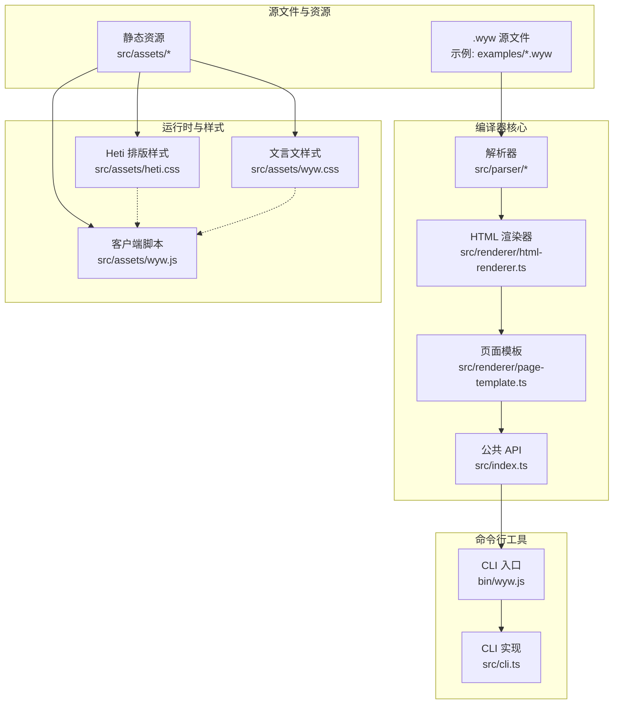
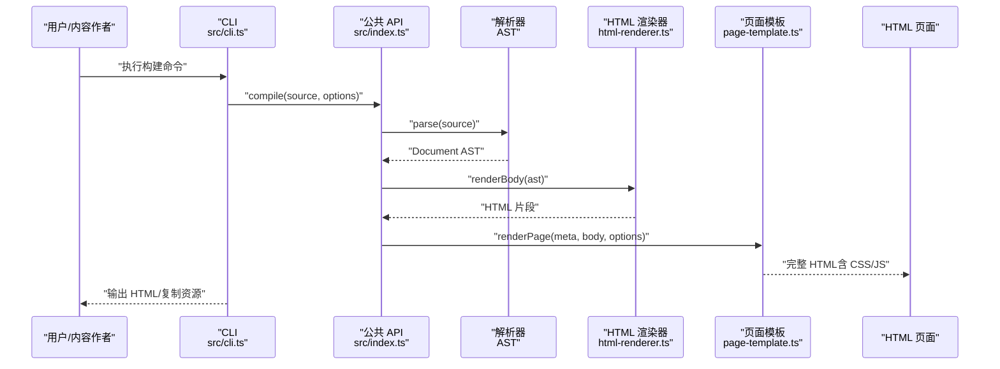
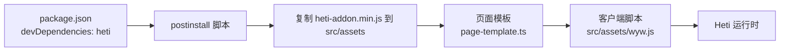

# 中文排版优化集成

<cite>
**本文引用的文件**
- [src/assets/heti.css](file://src/assets/heti.css)
- [src/assets/wyw.css](file://src/assets/wyw.css)
- [src/assets/wyw.js](file://src/assets/wyw.js)
- [src/renderer/page-template.ts](file://src/renderer/page-template.ts)
- [src/renderer/html-renderer.ts](file://src/renderer/html-renderer.ts)
- [src/index.ts](file://src/index.ts)
- [src/cli.ts](file://src/cli.ts)
- [package.json](file://package.json)
- [README.md](file://README.md)
- [examples/刘禹锡_陋室铭.wyw](file://examples/刘禹锡_陋室铭.wyw)
- [examples/范仲淹_岳阳楼记.wyw](file://examples/范仲淹_岳阳楼记.wyw)
- [test/compile.test.ts](file://test/compile.test.ts)
</cite>

## 目录
1. [引言](#引言)
2. [项目结构](#项目结构)
3. [核心组件](#核心组件)
4. [架构总览](#架构总览)
5. [详细组件分析](#详细组件分析)
6. [依赖关系分析](#依赖关系分析)
7. [性能考虑](#性能考虑)
8. [故障排查指南](#故障排查指南)
9. [结论](#结论)
10. [附录](#附录)

## 引言
本指南面向需要在文言文编译器中集成中文排版优化的开发者与内容创作者，重点说明赫蹏（heti）库的集成方式、配置选项与中文排版优化技术，并提供针对诗词、散文、注释等不同内容类型的排版方案，以及与现有 CSS 样式的协同机制、性能优化建议与常见问题解决方案。读者无需深入掌握底层实现，即可通过本文完成高质量的中文排版集成与定制。

## 项目结构
文言文编译器采用模块化设计，核心由解析器、渲染器与页面模板组成，静态资源（CSS/JS）与客户端脚本负责运行期排版增强与用户交互。CLI 提供构建与开发流程支持。



图表来源
- [src/index.ts:17-28](file://src/index.ts#L17-L28)
- [src/renderer/page-template.ts:25-68](file://src/renderer/page-template.ts#L25-L68)
- [src/renderer/html-renderer.ts:20-44](file://src/renderer/html-renderer.ts#L20-L44)
- [src/assets/heti.css:1-180](file://src/assets/heti.css#L1-L180)
- [src/assets/wyw.css:1-657](file://src/assets/wyw.css#L1-L657)
- [src/assets/wyw.js:1-204](file://src/assets/wyw.js#L1-L204)
- [src/cli.ts:116-164](file://src/cli.ts#L116-L164)

章节来源
- [README.md:110-126](file://README.md#L110-L126)
- [src/index.ts:17-28](file://src/index.ts#L17-L28)
- [src/renderer/page-template.ts:25-68](file://src/renderer/page-template.ts#L25-L68)
- [src/renderer/html-renderer.ts:20-44](file://src/renderer/html-renderer.ts#L20-L44)
- [src/assets/heti.css:1-180](file://src/assets/heti.css#L1-L180)
- [src/assets/wyw.css:1-657](file://src/assets/wyw.css#L1-L657)
- [src/assets/wyw.js:1-204](file://src/assets/wyw.js#L1-L204)
- [src/cli.ts:116-164](file://src/cli.ts#L116-L164)

## 核心组件
- 解析器：将 .wyw 源文本解析为 AST，支持标题、段落、注音、注释、译文、诗词块、分隔线等节点类型。
- HTML 渲染器：遍历 AST，生成 HTML 片段，处理注音（ruby）、注释（span.wyw-annotate）与诗词块的特殊布局。
- 页面模板：生成完整 HTML 页面骨架，注入 CSS/JS，支持内联与外链两种模式，并根据主题与译文可见性动态设置类名。
- 客户端脚本：初始化排版增强（Heti），管理用户偏好（主题、字号、译文显隐）、工具栏与键盘快捷键、Tooltip 边界检测。
- CLI：提供构建、监听、初始化模板、校验等功能，控制输出与资源复制策略。

章节来源
- [src/renderer/html-renderer.ts:80-186](file://src/renderer/html-renderer.ts#L80-L186)
- [src/renderer/page-template.ts:25-68](file://src/renderer/page-template.ts#L25-L68)
- [src/assets/wyw.js:7-18](file://src/assets/wyw.js#L7-L18)
- [src/cli.ts:28-56](file://src/cli.ts#L28-L56)

## 架构总览
下图展示了从 .wyw 源文件到最终 HTML 的端到端流程，以及赫蹏排版增强在运行时的介入点。



图表来源
- [src/cli.ts:116-164](file://src/cli.ts#L116-L164)
- [src/index.ts:17-28](file://src/index.ts#L17-L28)
- [src/renderer/html-renderer.ts:20-44](file://src/renderer/html-renderer.ts#L20-L44)
- [src/renderer/page-template.ts:25-68](file://src/renderer/page-template.ts#L25-L68)

## 详细组件分析

### 赫蹏（Heti）排版增强集成
- 集成位置：页面模板在内联或外链模式下加载 heti.css 与 heti-addon.min.js；客户端脚本在 DOM 就绪后调用 Heti 初始化，对文章内容进行标点挤压与中西文间距优化。
- 关键行为：
  - 加载顺序：先加载 heti.css，再加载 heti-addon.min.js，最后加载 wyw.js。
  - 运行时机：DOMContentLoaded 后执行初始化，包裹在 try/catch 中，确保失败不影响页面显示。
  - 作用范围：基于 .wyw 作用域内的选择器，避免与外部样式冲突。
- 配置要点：
  - 内联模式：将 heti.css 与 heti-addon.min.js 内嵌到 HTML，减少请求次数。
  - 外链模式：通过 link/script 引入，便于缓存与复用。
  - 与现有 CSS 协同：heti.css 仅影响 .wyw 作用域内的元素，不会污染外部样式。

```mermaid
sequenceDiagram
participant Doc as "HTML 文档"
participant Tpl as "页面模板<br/>page-template.ts"
participant JS as "客户端脚本<br/>src/assets/wyw.js"
participant Heti as "Heti 运行时"
Doc->>Tpl : "生成 HTML含 CSS/JS 引用"
Doc->>JS : "DOMContentLoaded 事件"
JS->>Heti : "new Heti(); spacingElement(article)"
Heti-->>JS : "完成标点挤压与间距优化"
```

图表来源
- [src/renderer/page-template.ts:43-57](file://src/renderer/page-template.ts#L43-L57)
- [src/assets/wyw.js:169-178](file://src/assets/wyw.js#L169-L178)
- [src/assets/heti.css:131-179](file://src/assets/heti.css#L131-L179)

章节来源
- [src/renderer/page-template.ts:43-57](file://src/renderer/page-template.ts#L43-L57)
- [src/assets/wyw.js:169-178](file://src/assets/wyw.js#L169-L178)
- [src/assets/heti.css:131-179](file://src/assets/heti.css#L131-L179)

### 文本排版优化技术
- 字符间距：通过 CSS 变量控制全局字母间距，兼顾中文阅读舒适度与现代感。
- 行高调整：提供紧凑/宽松行高档位，注音模式下自动增大行高以避免 ruby 重叠。
- 断行规则：启用断词换行，配合中文标点与英文混排的间距处理，提升可读性。
- 诗词排版：中心对齐、独立标题区、诗句段落的分隔线与边距，营造古典美感。
- 注释与注音：注释通过 hover 指示器与 tooltip 弹层呈现，注音使用 ruby，避免遮挡与拥挤。

章节来源
- [src/assets/wyw.css:6-41](file://src/assets/wyw.css#L6-L41)
- [src/assets/wyw.css:119-122](file://src/assets/wyw.css#L119-L122)
- [src/assets/wyw.css:338-391](file://src/assets/wyw.css#L338-L391)
- [src/assets/wyw.css:223-239](file://src/assets/wyw.css#L223-L239)
- [src/assets/wyw.css:240-300](file://src/assets/wyw.css#L240-L300)

### 不同内容类型的排版配置方案
- 诗词
  - 使用围栏块与标题层级，配合诗词专用样式（居中、标题、元信息、诗句段落）。
  - 建议：在诗词块中启用较大的行高与适中的字符间距，突出节奏感。
- 散文
  - 使用段落组与译文对照，首行缩进与段间距协调统一。
  - 建议：根据内容密度选择紧凑或宽松行高，注释较多时适当增大行高。
- 注释
  - 使用 wyw-annotate 类与 data-note 属性，结合 tooltip 定位逻辑，确保在窄屏与边缘位置仍可完整显示。
  - 建议：为复杂注释提供简洁摘要，必要时拆分为多段说明。

章节来源
- [src/renderer/html-renderer.ts:125-186](file://src/renderer/html-renderer.ts#L125-L186)
- [src/assets/wyw.css:338-391](file://src/assets/wyw.css#L338-L391)
- [src/assets/wyw.css:240-300](file://src/assets/wyw.css#L240-L300)
- [src/assets/wyw.js:150-167](file://src/assets/wyw.js#L150-L167)

### 与现有 CSS 样式的协同机制
- 作用域隔离：Heti 与文言文样式均限定在 .wyw 作用域内，避免污染外部页面。
- 优先级策略：Heti 的基础排版增强与文言文样式通过 CSS 变量与类名叠加，形成清晰的优先级链路。
- 主题与字号：通过 data-theme 与 .wyw--font-* 类控制主题与字号，不影响排版增强的运行时行为。
- 注音与注释：ruby 与 wyw-annotate 与 Heti 的 spacing/adjacent 工具类协同，避免视觉粘连与间距异常。

章节来源
- [src/assets/heti.css:167-179](file://src/assets/heti.css#L167-L179)
- [src/assets/wyw.css:105-117](file://src/assets/wyw.css#L105-L117)
- [src/assets/wyw.css:44-68](file://src/assets/wyw.css#L44-L68)
- [src/assets/wyw.css:71-83](file://src/assets/wyw.css#L71-L83)

### 配置选项与使用方法
- CLI 选项
  - 输出目录：-o/--output
  - 内联资源：--inline
  - 监听模式：-w/--watch
  - 默认主题：--theme auto/light/dark
  - 译文可见性：--show-translation/--no-show-translation
- API 选项
  - inline：是否内联 CSS/JS
  - assetsPath：外链资源路径前缀
  - theme：默认主题
  - showTranslation：默认是否显示译文
- 资源复制策略：非内联模式下，CLI 会将 heti.css、wyw.css、heti-addon.min.js、wyw.js 与 favicon.png 复制到输出目录。

章节来源
- [README.md:50-60](file://README.md#L50-L60)
- [src/index.ts:7-12](file://src/index.ts#L7-L12)
- [src/cli.ts:20-26](file://src/cli.ts#L20-L26)
- [src/cli.ts:138-153](file://src/cli.ts#L138-L153)

### 运行时交互与增强
- 用户偏好：localStorage 记录译文显隐、字号与主题，页面加载时恢复。
- 工具栏：提供“译文/字号/主题”三键，支持键盘快捷键（T/D/F）。
- Tooltip 边界检测：根据元素中心与视口宽度动态设置 data-tooltip-align，避免溢出。
- Heti 初始化：在 DOMContentLoaded 后尝试初始化 Heti，失败静默，保证页面可用性。

章节来源
- [src/assets/wyw.js:21-45](file://src/assets/wyw.js#L21-L45)
- [src/assets/wyw.js:48-75](file://src/assets/wyw.js#L48-L75)
- [src/assets/wyw.js:99-127](file://src/assets/wyw.js#L99-L127)
- [src/assets/wyw.js:150-167](file://src/assets/wyw.js#L150-L167)
- [src/assets/wyw.js:169-178](file://src/assets/wyw.js#L169-L178)

### 自定义排版规则开发指南
- 新增 CSS 规则
  - 保持作用域在 .wyw 或其子类，避免全局污染。
  - 使用 CSS 变量统一管理字号、行高、间距与颜色，便于主题切换。
- 扩展排版增强
  - 若需额外的运行时处理，可在客户端脚本中扩展初始化逻辑，注意与现有 Heti 行为兼容。
- 样式调试
  - 使用浏览器开发者工具检查元素类名与计算样式，确认变量覆盖与选择器优先级。
- 性能与兼容
  - 控制选择器复杂度，避免深层嵌套与过度重绘。
  - 在移动端验证断行与 Tooltip 定位效果。

章节来源
- [src/assets/wyw.css:6-41](file://src/assets/wyw.css#L6-L41)
- [src/assets/wyw.css:105-117](file://src/assets/wyw.css#L105-L117)
- [src/assets/wyw.js:169-178](file://src/assets/wyw.js#L169-L178)

## 依赖关系分析
- 构建期依赖：Heti 作为开发依赖提供排版增强能力，构建脚本在安装时将 heti-addon.min.js 复制到 src/assets。
- 运行时依赖：页面模板根据内联/外链选项决定资源加载方式；客户端脚本依赖 Heti 运行时。
- CLI 与 API：CLI 调用公共 API，API 再委托解析器与渲染器，最终由页面模板生成 HTML。



图表来源
- [package.json:19](file://package.json#L19)
- [src/renderer/page-template.ts:48-53](file://src/renderer/page-template.ts#L48-L53)
- [src/assets/wyw.js:169-178](file://src/assets/wyw.js#L169-L178)

章节来源
- [package.json:19](file://package.json#L19)
- [src/renderer/page-template.ts:48-53](file://src/renderer/page-template.ts#L48-L53)
- [src/assets/wyw.js:169-178](file://src/assets/wyw.js#L169-L178)

## 性能考虑
- 资源加载
  - 内联模式：减少网络请求，适合单页或离线场景；体积增大，首次加载时间略增。
  - 外链模式：利于缓存复用，适合多页面共享；首次加载可能受网络影响。
- 渲染性能
  - 控制注音与注释数量，避免过多 ruby 与 tooltip 导致重绘。
  - 合理使用 CSS 变量，减少重复计算与回流。
- 主题与字号
  - 使用类名切换而非逐元素修改样式，降低样式计算成本。
- 移动端优化
  - 响应式断点与字号调整已在样式中内置，建议避免在移动端引入额外复杂布局。

## 故障排查指南
- 页面未显示排版增强
  - 检查是否正确加载 heti.css 与 heti-addon.min.js。
  - 确认客户端脚本在 DOMContentLoaded 后执行，且未被拦截。
  - 若存在异常，脚本会静默失败，不影响页面显示。
- 注音/注释显示异常
  - 确认注音与注释语法正确，渲染器会将其转换为 ruby 与 wyw-annotate。
  - 检查 CSS 变量与类名是否被外部样式覆盖。
- Tooltip 溢出或定位不当
  - 检查元素中心与视口宽度计算逻辑，必要时缩短注释长度或调整布局。
- 主题切换无效
  - 确认 data-theme 属性与类名切换逻辑一致，检查 localStorage 是否被禁用。
- 译文显隐不符合预期
  - 检查 CLI 选项与页面类名 wyw--hide-translation 的设置。

章节来源
- [src/assets/wyw.js:169-178](file://src/assets/wyw.js#L169-L178)
- [src/renderer/html-renderer.ts:195-233](file://src/renderer/html-renderer.ts#L195-L233)
- [src/assets/wyw.css:240-300](file://src/assets/wyw.css#L240-L300)
- [src/assets/wyw.js:150-167](file://src/assets/wyw.js#L150-L167)
- [src/cli.ts:138-153](file://src/cli.ts#L138-L153)

## 结论
通过将赫蹏（Heti）排版增强与文言文样式体系有机结合，文言文编译器能够在不破坏现有样式的前提下，显著提升中文文本的可读性与美观度。借助清晰的配置选项与运行时交互机制，用户可针对不同内容类型（诗词、散文、注释）灵活调整排版参数，并在性能与体验之间取得平衡。建议在实际项目中遵循作用域隔离、变量驱动与渐进增强的原则，持续优化排版体验。

## 附录
- 示例文件
  - 陋室铭：展示注音、注释、译文与引用块的综合应用。
  - 岳阳楼记：展示较长篇幅散文与注音、注释的密集使用场景。
- 测试用例
  - 验证注音、注释、译文、内联资源与页面结构的正确性。

章节来源
- [examples/刘禹锡_陋室铭.wyw:1-22](file://examples/刘禹锡_陋室铭.wyw#L1-L22)
- [examples/范仲淹_岳阳楼记.wyw:1-31](file://examples/范仲淹_岳阳楼记.wyw#L1-L31)
- [test/compile.test.ts:14-94](file://test/compile.test.ts#L14-L94)
- [test/compile.test.ts:96-155](file://test/compile.test.ts#L96-L155)
- [test/compile.test.ts:157-209](file://test/compile.test.ts#L157-L209)