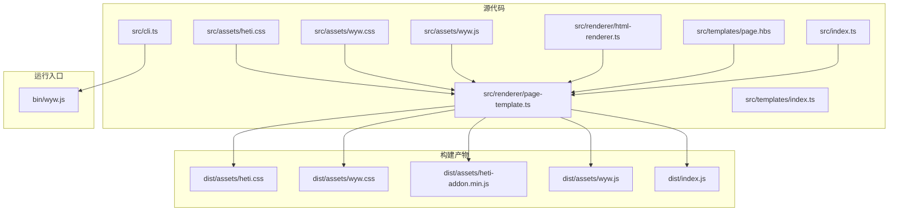
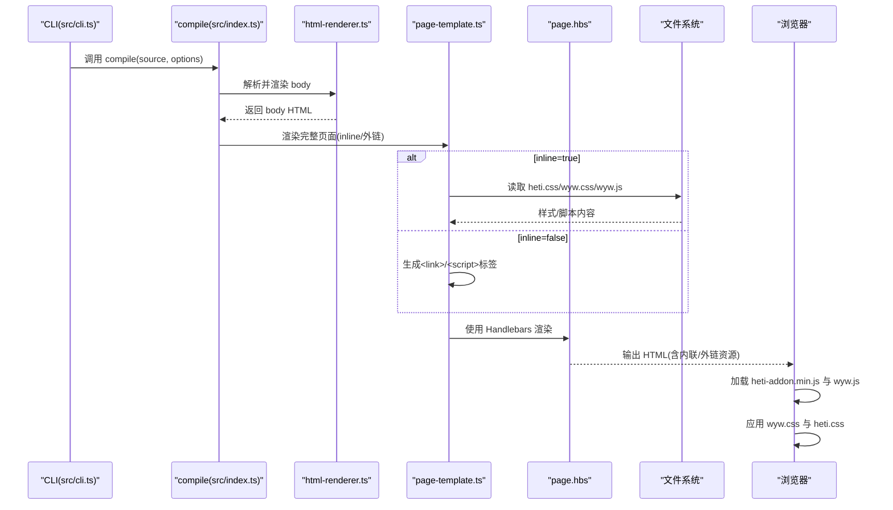
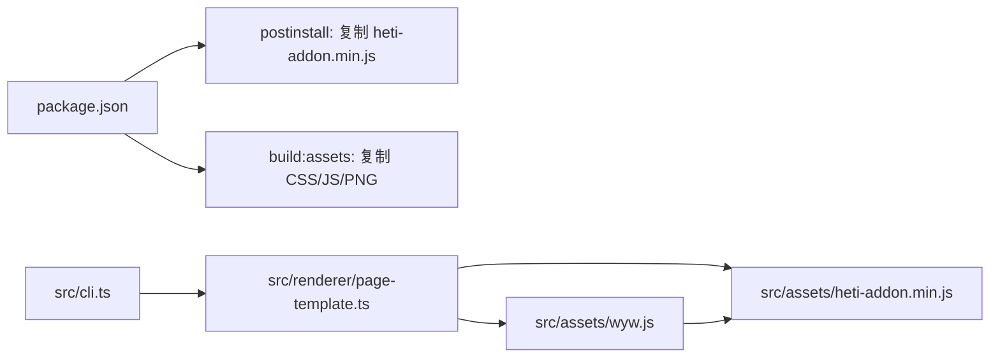
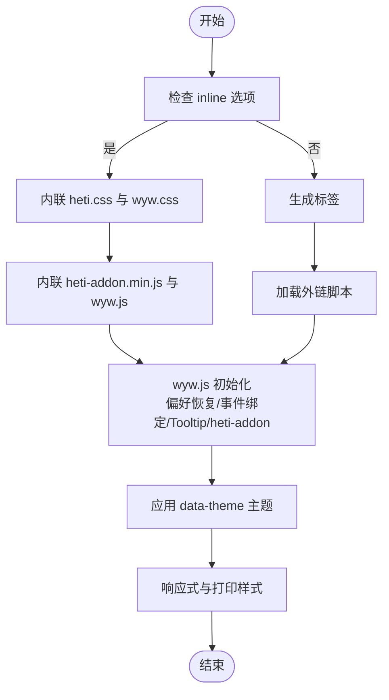

# 静态资源管理

<cite>
**本文引用的文件列表**
- [src/assets/wyw.css](file://src/assets/wyw.css)
- [src/assets/heti.css](file://src/assets/heti.css)
- [src/assets/wyw.js](file://src/assets/wyw.js)
- [src/renderer/page-template.ts](file://src/renderer/page-template.ts)
- [src/renderer/html-renderer.ts](file://src/renderer/html-renderer.ts)
- [src/templates/page.hbs](file://src/templates/page.hbs)
- [src/cli.ts](file://src/cli.ts)
- [src/index.ts](file://src/index.ts)
- [package.json](file://package.json)
- [bin/wyw.js](file://bin/wyw.js)
- [src/templates/index.ts](file://src/templates/index.ts)
</cite>

## 目录
1. [引言](#引言)
2. [项目结构](#项目结构)
3. [核心组件](#核心组件)
4. [架构总览](#架构总览)
5. [详细组件分析](#详细组件分析)
6. [依赖关系分析](#依赖关系分析)
7. [性能考量](#性能考量)
8. [故障排查指南](#故障排查指南)
9. [结论](#结论)
10. [附录](#附录)

## 引言
本指南面向文言文编译器的静态资源管理，聚焦以下目标：
- CSS 样式文件的组织结构与作用范围
- 中文排版优化库 heti 的集成与配置
- 自定义样式的开发流程与最佳实践
- JavaScript 资源的加载机制与扩展方式
- 样式调试工具与性能优化技巧
- 响应式设计与浏览器兼容性处理方案

## 项目结构
静态资源位于 src/assets 目录，包括：
- 样式：heti.css（中文排版增强）、wyw.css（文言文主题样式）
- 脚本：wyw.js（客户端交互）
- 模板：page.hbs（HTML 页面骨架）

构建与分发通过 package.json 的脚本完成，CLI 通过 bin/wyw.js 调用 dist/cli.js，最终由 src/index.ts 暴露的 compile API 驱动解析、渲染与页面组装。

图表来源
- [src/assets/heti.css](file://src/assets/heti.css)
- [src/assets/wyw.css](file://src/assets/wyw.css)
- [src/assets/wyw.js](file://src/assets/wyw.js)
- [src/renderer/page-template.ts](file://src/renderer/page-template.ts)
- [src/renderer/html-renderer.ts](file://src/renderer/html-renderer.ts)
- [src/templates/page.hbs](file://src/templates/page.hbs)
- [src/cli.ts](file://src/cli.ts)
- [src/index.ts](file://src/index.ts)
- [bin/wyw.js](file://bin/wyw.js)

章节来源
- [src/assets/wyw.css](file://src/assets/wyw.css)
- [src/assets/heti.css](file://src/assets/heti.css)
- [src/assets/wyw.js](file://src/assets/wyw.js)
- [src/renderer/page-template.ts](file://src/renderer/page-template.ts)
- [src/renderer/html-renderer.ts](file://src/renderer/html-renderer.ts)
- [src/templates/page.hbs](file://src/templates/page.hbs)
- [src/cli.ts](file://src/cli.ts)
- [src/index.ts](file://src/index.ts)
- [package.json](file://package.json)
- [bin/wyw.js](file://bin/wyw.js)

## 核心组件
- 样式体系
  - heti.css：提供中文字体族定义与中文排版增强（如标点挤压、中西文间距），作用于 wyw 作用域内，避免与现有样式冲突。
  - wyw.css：文言文主题样式，包含变量、深浅色主题、字体大小档位、全局排版、注音、注释、译文、诗歌、工具栏、导航、打印样式等。
- 脚本体系
  - wyw.js：DOMContentLoaded 初始化，偏好恢复（localStorage）、译文开关、字号切换、主题切换、Tooltip 边界检测、heti-addon 初始化、键盘快捷键。
- 页面模板与渲染
  - page-template.ts：根据 inline 选项决定内联或外链 CSS/JS，并注入到 page.hbs 模板。
  - html-renderer.ts：将 AST 渲染为 HTML body 内容，包含工具栏、正文、诗词块、注音、注释等。
  - page.hbs：HTML 页面骨架，注入标题、主题、文章类名、内联/外链资源标签。
- 构建与分发
  - package.json：postinstall 自动复制 heti-addon.min.js；build:assets 复制 CSS/JS/PNG 至 dist/assets；bin 映射 wyw -> bin/wyw.js。
  - bin/wyw.js：CLI 入口，调用 dist/cli.js。
  - src/cli.ts：实现 build/init/validate 子命令，非内联模式时复制静态资源到输出目录。

章节来源
- [src/assets/heti.css](file://src/assets/heti.css)
- [src/assets/wyw.css](file://src/assets/wyw.css)
- [src/assets/wyw.js](file://src/assets/wyw.js)
- [src/renderer/page-template.ts](file://src/renderer/page-template.ts)
- [src/renderer/html-renderer.ts](file://src/renderer/html-renderer.ts)
- [src/templates/page.hbs](file://src/templates/page.hbs)
- [src/cli.ts](file://src/cli.ts)
- [package.json](file://package.json)
- [bin/wyw.js](file://bin/wyw.js)

## 架构总览
静态资源在编译期与运行期的交互路径如下：

图表来源
- [src/cli.ts](file://src/cli.ts)
- [src/index.ts](file://src/index.ts)
- [src/renderer/html-renderer.ts](file://src/renderer/html-renderer.ts)
- [src/renderer/page-template.ts](file://src/renderer/page-template.ts)
- [src/templates/page.hbs](file://src/templates/page.hbs)
- [package.json](file://package.json)
- [bin/wyw.js](file://bin/wyw.js)

## 详细组件分析

### CSS 样式组织与作用范围
- 变量与主题
  - 使用 CSS 自定义属性集中管理字号、行高、间距、最大宽度、缩进、字体族与颜色。
  - 支持浅色/深色主题与系统偏好联动，通过 data-theme 属性控制。
- 作用域与命名
  - 样式以 wyw 作用域为主，配合工具类（如 wyw--font-md、wyw--font-lg、wyw--hide-translation）进行状态切换。
  - heti.css 仅在 wyw 选择器范围内生效，避免与第三方样式冲突。
- 结构化模块
  - 全局 reset、容器、文档头部、正文、标题、段落组、译文、注音、注释、诗歌、引用、分隔线、工具栏、导航、打印样式等模块化组织。
- 响应式与打印
  - 移动端断点与字号适配；窄屏下 tooltip 超出视口的处理；打印模式隐藏工具栏、强制显示译文、禁用 tooltip。

章节来源
- [src/assets/wyw.css](file://src/assets/wyw.css)
- [src/assets/heti.css](file://src/assets/heti.css)

### 中文排版优化库 heti 的集成与配置
- 字体族定义
  - heti.css 定义 Heti Song/Kai/Hei 字体族，优先使用系统本地字体，确保跨平台一致的中文字体体验。
- 排版增强
  - 提供 heti-spacing 与 heti-adjacent 工具类，配合 heti-addon 进行中西文间距与标点挤压处理。
- 集成方式
  - page-template.ts 在 inline 模式下直接内联 heti.css；否则通过 <link> 引入。
  - wyw.js 在存在 Heti 全局对象时初始化 heti-addon，对文章内容执行 spacingElement。
- 配置建议
  - 若需自定义字体族，可在 wyw.css 中替换 --wyw-font-* 变量，保持与 heti 字体族一致的语义映射。
  - 如需关闭标点挤压，可移除或禁用 heti-addon 初始化逻辑。

章节来源
- [src/assets/heti.css](file://src/assets/heti.css)
- [src/renderer/page-template.ts](file://src/renderer/page-template.ts)
- [src/assets/wyw.js](file://src/assets/wyw.js)

### 自定义样式的开发流程与最佳实践
- 开发流程
  - 在 src/assets/wyw.css 中新增或修改样式，遵循 wyw 作用域与工具类命名规范。
  - 如需引入新的字体，先在 heti.css 中补充 @font-face 定义，再在 wyw.css 中通过变量引用。
  - 使用 CSS 自定义属性统一管理可配置项，便于主题与字号切换。
- 最佳实践
  - 保持样式模块化，按功能拆分规则，避免全局污染。
  - 使用 data-theme 与媒体查询实现主题与响应式适配。
  - 通过工具类切换状态（如 wyw--hide-translation），减少复杂选择器。
  - 为交互元素提供可访问性属性（aria-pressed、title）。
- 扩展建议
  - 新增样式前先评估是否可通过现有工具类组合实现。
  - 如需引入第三方样式，建议将其封装为独立模块并在 wyw 作用域内隔离。

章节来源
- [src/assets/wyw.css](file://src/assets/wyw.css)
- [src/assets/heti.css](file://src/assets/heti.css)

### JavaScript 资源的加载机制与扩展方式
- 加载机制
  - 非内联模式：page-template.ts 生成 <script src="..."> 标签，分别加载 heti-addon.min.js 与 wyw.js。
  - 内联模式：page-template.ts 读取文件内容并注入到 <script> 标签中。
  - CLI 在非内联模式时复制静态资源到输出目录，确保外链资源可用。
- 初始化与交互
  - wyw.js 在 DOMContentLoaded 后初始化：偏好恢复、事件绑定、Tooltip 边界检测、heti-addon 初始化、键盘快捷键。
  - 支持 localStorage 记忆用户偏好（译文显隐、字号、主题）。
- 扩展方式
  - 新增功能：在 wyw.js 中添加事件监听与 DOM 操作，注意与现有工具类协作。
  - 与 heti 集成：在 wyw.js 中调用 Heti 实例方法，确保存在性检查与异常捕获。
  - 通过 data-tooltip-align 等属性与 CSS 协作，实现动态布局。

章节来源
- [src/renderer/page-template.ts](file://src/renderer/page-template.ts)
- [src/assets/wyw.js](file://src/assets/wyw.js)
- [src/cli.ts](file://src/cli.ts)

### 样式调试工具与性能优化技巧
- 调试工具
  - 浏览器开发者工具：检查 wyw 作用域内的类名与变量值，定位主题与字号问题。
  - CSS 变量面板：观察 :root 与 [data-theme] 下的变量覆盖情况。
  - 响应式断点：利用设备模拟器验证移动端与窄屏表现。
- 性能优化
  - 内联策略：在单页场景或网络环境受限时启用 --inline，减少请求数。
  - 外链策略：多页复用场景建议外链，结合缓存与压缩提升加载速度。
  - 资源最小化：确保 heti-addon.min.js 与 wyw.js 已压缩。
  - 按需加载：仅在需要时初始化 heti-addon，避免不必要的计算。

章节来源
- [src/renderer/page-template.ts](file://src/renderer/page-template.ts)
- [src/assets/wyw.js](file://src/assets/wyw.js)

### 响应式设计与浏览器兼容性处理
- 响应式设计
  - 移动端断点：在不同屏幕宽度下调整字号、内边距与按钮尺寸，保证可读性与可用性。
  - 窄屏 tooltip：当 Tooltip 超出视口时，通过 data-tooltip-align 属性切换左右对齐。
  - 打印样式：隐藏工具栏、强制显示译文、禁用 tooltip，提升打印质量。
- 浏览器兼容性
  - CSS 变量：在支持 CSS 变量的浏览器中生效，不支持时可提供降级方案（当前未见显式降级）。
  - Flexbox 与 Grid：工具栏与导航采用 Flex 布局，确保在主流浏览器中的稳定表现。
  - 字体回退：heti.css 通过 local() 与 fallback 字体链路，提升跨平台一致性。

章节来源
- [src/assets/wyw.css](file://src/assets/wyw.css)
- [src/assets/heti.css](file://src/assets/heti.css)

## 依赖关系分析
- 构建与分发
  - postinstall：自动复制 heti-addon.min.js 到 src/assets，供构建时使用。
  - build:assets：复制 CSS/JS/PNG 到 dist/assets，供运行时使用。
  - bin：将 wyw 命令映射到 bin/wyw.js。
- 运行时依赖
  - page-template.ts 依赖 src/assets 下的样式与脚本文件。
  - wyw.js 依赖 Heti 全局对象（来自 heti-addon.min.js）。
  - CLI 在非内联模式时复制静态资源到输出目录。

图表来源
- [package.json](file://package.json)
- [src/cli.ts](file://src/cli.ts)
- [src/renderer/page-template.ts](file://src/renderer/page-template.ts)
- [src/assets/wyw.js](file://src/assets/wyw.js)

章节来源
- [package.json](file://package.json)
- [src/cli.ts](file://src/cli.ts)
- [src/renderer/page-template.ts](file://src/renderer/page-template.ts)

## 性能考量
- 资源加载策略
  - 单页或内联：--inline 减少请求数，适合静态站点或首屏性能优先场景。
  - 多页复用：外链资源利于缓存与并行下载，适合大型站点。
- 资源体积
  - 确保 wyw.js 与 heti-addon.min.js 已压缩，避免不必要的注释与空白。
  - 样式按需引入，避免引入未使用的模块。
- 交互性能
  - Tooltip 边界检测使用估算宽度，避免频繁测量导致的布局抖动。
  - 主题切换与字号切换通过类名切换，避免重排重绘。

## 故障排查指南
- 样式不生效
  - 检查是否处于 wyw 作用域内，确认类名拼写与工具类组合正确。
  - 确认 data-theme 设置与主题偏好是否一致。
- 字体显示异常
  - 检查 heti.css 中 @font-face 是否被正确加载，确认本地字体是否存在。
- 译文/注释不可见
  - 确认 wyw--hide-translation 类是否被意外添加。
  - 检查 localStorage 中偏好设置是否覆盖了默认行为。
- Tooltip 超出视口
  - 确认 data-tooltip-align 属性是否被正确设置，必要时调整样式或触发重新定位。
- 资源 404
  - 非内联模式下，确认输出目录包含 heti.css、wyw.css、heti-addon.min.js、wyw.js。
  - 检查 assetsPath 与实际路径是否一致。

章节来源
- [src/assets/wyw.css](file://src/assets/wyw.css)
- [src/assets/wyw.js](file://src/assets/wyw.js)
- [src/renderer/page-template.ts](file://src/renderer/page-template.ts)
- [src/cli.ts](file://src/cli.ts)

## 结论
本指南梳理了文言文编译器静态资源的组织方式与运行机制，明确了 heti 集成、样式作用域、JavaScript 加载与扩展、调试与性能优化、响应式与兼容性处理等关键点。遵循本文的最佳实践，可在保证可读性与可维护性的前提下，高效地扩展与优化文言文页面的排版与交互体验。

## 附录
- 关键流程图：样式与脚本的加载与初始化

图表来源
- [src/renderer/page-template.ts](file://src/renderer/page-template.ts)
- [src/assets/wyw.js](file://src/assets/wyw.js)
- [src/assets/wyw.css](file://src/assets/wyw.css)