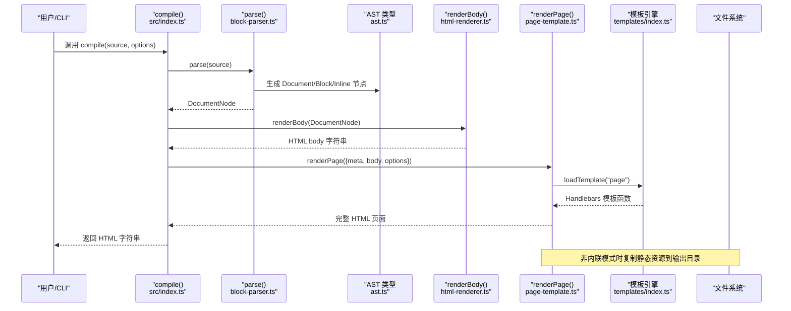
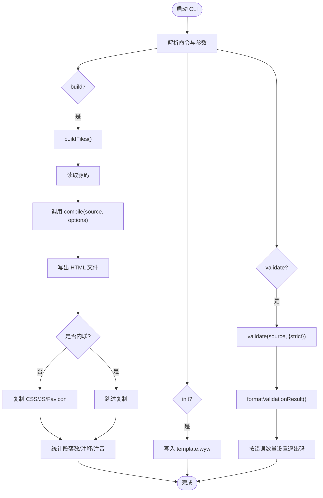
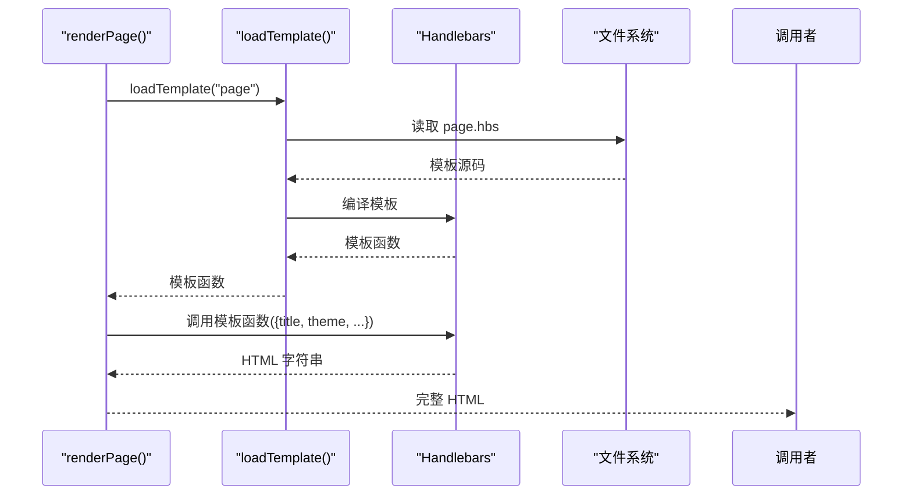
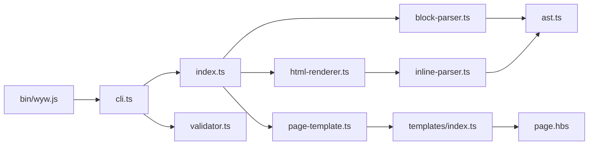

# 核心模块架构

<cite>
**本文引用的文件**
- [src/index.ts](file://src/index.ts)
- [src/cli.ts](file://src/cli.ts)
- [src/parser/ast.ts](file://src/parser/ast.ts)
- [src/parser/block-parser.ts](file://src/parser/block-parser.ts)
- [src/parser/inline-parser.ts](file://src/parser/inline-parser.ts)
- [src/renderer/html-renderer.ts](file://src/renderer/html-renderer.ts)
- [src/renderer/page-template.ts](file://src/renderer/page-template.ts)
- [src/templates/index.ts](file://src/templates/index.ts)
- [src/templates/page.hbs](file://src/templates/page.hbs)
- [src/validator.ts](file://src/validator.ts)
- [bin/wyw.js](file://bin/wyw.js)
- [package.json](file://package.json)
- [README.md](file://README.md)
</cite>

## 目录
1. [引言](#引言)
2. [项目结构](#项目结构)
3. [核心组件](#核心组件)
4. [架构总览](#架构总览)
5. [详细组件分析](#详细组件分析)
6. [依赖关系分析](#依赖关系分析)
7. [性能考量](#性能考量)
8. [故障排查指南](#故障排查指南)
9. [结论](#结论)
10. [附录](#附录)

## 引言
本技术文档聚焦文言文编译器的核心模块，系统阐述编译器入口 API 设计、CLI 命令行接口、AST 类型系统、渲染器与页面模板机制，以及从源码到 HTML 输出的完整处理链路。文档旨在帮助开发者与使用者理解编译器的内部工作原理与扩展点，便于二次开发与问题诊断。

## 项目结构
编译器采用“入口 API + 解析器 + 渲染器 + 模板 + CLI”的分层架构，核心文件分布如下：
- 入口与公共 API：src/index.ts
- 解析器：src/parser/ast.ts、src/parser/block-parser.ts、src/parser/inline-parser.ts
- 渲染器：src/renderer/html-renderer.ts、src/renderer/page-template.ts
- 模板系统：src/templates/index.ts、src/templates/page.hbs
- 校验器：src/validator.ts
- CLI：src/cli.ts、bin/wyw.js
- 构建与脚本：package.json、README.md

```mermaid
graph TB
subgraph "入口与公共 API"
IDX["src/index.ts<br/>compile() API"]
end
subgraph "解析器"
AST["src/parser/ast.ts<br/>AST 类型与工厂"]
BP["src/parser/block-parser.ts<br/>块级解析"]
IP["src/parser/inline-parser.ts<br/>内联解析"]
end
subgraph "渲染器"
HR["src/renderer/html-renderer.ts<br/>HTML body 渲染"]
PT["src/renderer/page-template.ts<br/>页面模板渲染"]
end
subgraph "模板系统"
TI["src/templates/index.ts<br/>模板加载器"]
PHB["src/templates/page.hbs<br/>页面模板"]
end
subgraph "CLI"
CLI["src/cli.ts<br/>命令行接口"]
BIN["bin/wyw.js<br/>CLI 入口"]
end
subgraph "工具与校验"
VAL["src/validator.ts<br/>格式校验"]
end
IDX --> BP
IDX --> HR
IDX --> PT
BP --> AST
IP --> AST
HR --> IP
PT --> TI
TI --> PHB
CLI --> IDX
CLI --> VAL
BIN --> CLI
```

图表来源
- [src/index.ts:1-57](file://src/index.ts#L1-L57)
- [src/parser/block-parser.ts:1-371](file://src/parser/block-parser.ts#L1-L371)
- [src/parser/inline-parser.ts:1-99](file://src/parser/inline-parser.ts#L1-L99)
- [src/renderer/html-renderer.ts:1-251](file://src/renderer/html-renderer.ts#L1-L251)
- [src/renderer/page-template.ts:1-87](file://src/renderer/page-template.ts#L1-L87)
- [src/templates/index.ts:1-34](file://src/templates/index.ts#L1-L34)
- [src/templates/page.hbs:1-17](file://src/templates/page.hbs#L1-L17)
- [src/cli.ts:1-182](file://src/cli.ts#L1-L182)
- [bin/wyw.js:1-7](file://bin/wyw.js#L1-L7)
- [src/validator.ts:1-838](file://src/validator.ts#L1-L838)

章节来源
- [README.md:110-125](file://README.md#L110-L125)
- [package.json:18-27](file://package.json#L18-L27)

## 核心组件
本节概述编译器三大核心模块：入口 API、解析器与渲染器。

- 入口 API（compile）：对外暴露 compile(source, options) 接口，串联解析与渲染，返回完整 HTML。
- 解析器：分为块级解析（block-parser）与内联解析（inline-parser），配合 AST 类型系统生成结构化文档树。
- 渲染器：先渲染 HTML body，再由页面模板包装为完整 HTML 页面，支持内联与外链资源、主题与译文控制。

章节来源
- [src/index.ts:7-28](file://src/index.ts#L7-L28)
- [src/parser/block-parser.ts:43-49](file://src/parser/block-parser.ts#L43-L49)
- [src/renderer/html-renderer.ts:20-44](file://src/renderer/html-renderer.ts#L20-L44)
- [src/renderer/page-template.ts:25-68](file://src/renderer/page-template.ts#L25-L68)

## 架构总览
编译流程从源码到 HTML 的端到端处理链路如下：



图表来源
- [src/index.ts:17-28](file://src/index.ts#L17-L28)
- [src/parser/block-parser.ts:43-49](file://src/parser/block-parser.ts#L43-L49)
- [src/renderer/html-renderer.ts:20-44](file://src/renderer/html-renderer.ts#L20-L44)
- [src/renderer/page-template.ts:25-68](file://src/renderer/page-template.ts#L25-L68)
- [src/templates/index.ts:18-30](file://src/templates/index.ts#L18-L30)

## 详细组件分析

### 入口 API：compile 函数
- 职责：接收 .wyw 源码与编译选项，完成解析、渲染与页面包装，返回完整 HTML。
- 参数：
  - source: 输入的 .wyw 源码字符串
  - options: 编译选项（inline、assetsPath、theme、showTranslation）
- 返回值：完整 HTML 字符串
- 关键步骤：
  1) parse(source) 生成 DocumentNode
  2) renderBody(doc) 生成 HTML body
  3) renderPage({...}) 包装为完整页面（内联或外链资源）

章节来源
- [src/index.ts:7-28](file://src/index.ts#L7-L28)

### CLI 模块：命令行接口
- 命令：
  - build：编译 .wyw 文件为 HTML，支持输出目录、内联资源、监听重编译、主题与译文控制
  - init：生成模板 .wyw 文件
  - validate：验证 .wyw 文件格式，支持严格模式
- 关键实现要点：
  - build：读取文件、调用 compile、写出 HTML、复制静态资源、统计信息
  - init：写入模板文件
  - validate：调用 validate/formatValidationResult，按错误/警告数量退出码



图表来源
- [src/cli.ts:28-182](file://src/cli.ts#L28-L182)

章节来源
- [src/cli.ts:28-182](file://src/cli.ts#L28-L182)
- [bin/wyw.js:1-7](file://bin/wyw.js#L1-L7)

### AST 类型系统
- 文档元信息：title、author、dynasty
- 内联节点（InlineNode）：文本、注音、注释、强调、注音+注释组合
- 块级节点（BlockNode）：文档根、标题、段落组、诗词块、引用、分隔线、校对日期
- 原始块节点（RawBlockNode）：groupParagraphs 之前的中间形态
- 工厂函数：createDocument、createHeading、createParagraph、createTranslation、createParagraphGroup、createPoetryBlock、createBlockquote、createSectionBreak、createProofreadDate、createText、createRuby、createAnnotate、createEmphasis、createRubyAnnotate

```mermaid
classDiagram
class DocumentMeta {
+string title
+string author
+string dynasty
}
class InlineNode {
<<interface>>
+string type
}
class TextNode {
+string type="text"
+string value
}
class RubyNode {
+string type="ruby"
+string base
+string annotation
}
class AnnotateNode {
+string type="annotate"
+string text
+string note
}
class EmphasisNode {
+string type="emphasis"
+InlineNode[] children
}
class RubyAnnotateNode {
+string type="ruby_annotate"
+RubyItem[] items
+string note
}
class RubyItem {
+string base
+string annotation
}
class BlockNode {
<<interface>>
+string type
}
class DocumentNode {
+string type="document"
+DocumentMeta meta
+BlockNode[] children
}
class HeadingNode {
+string type="heading"
+number level
+InlineNode[] children
}
class ParagraphNode {
+string type="paragraph"
+InlineNode[] children
}
class TranslationNode {
+string type="translation"
+InlineNode[] children
}
class ParagraphGroupNode {
+string type="paragraph_group"
+ParagraphNode|nil paragraph
+TranslationNode|nil translation
}
class PoetryBlockNode {
+string type="poetry_block"
+InlineNode[]|nil title
+string|nil meta
+PoetryLine[] lines
}
class BlockquoteNode {
+string type="blockquote"
+InlineNode[] children
}
class SectionBreakNode {
+string type="section_break"
}
class ProofreadDateNode {
+string type="proofread_date"
+string date
}
InlineNode <|.. TextNode
InlineNode <|.. RubyNode
InlineNode <|.. AnnotateNode
InlineNode <|.. EmphasisNode
InlineNode <|.. RubyAnnotateNode
BlockNode <|.. DocumentNode
BlockNode <|.. HeadingNode
BlockNode <|.. ParagraphGroupNode
BlockNode <|.. PoetryBlockNode
BlockNode <|.. BlockquoteNode
BlockNode <|.. SectionBreakNode
BlockNode <|.. ProofreadDateNode
```



图表来源
- [src/parser/ast.ts:5-218](file://src/parser/ast.ts#L5-L218)

章节来源
- [src/parser/ast.ts:5-218](file://src/parser/ast.ts#L5-L218)

### 渲染器：HTML 生成机制
- renderBody：遍历 DocumentNode，渲染 header、工具栏与正文，支持带标题诗词块的头部处理策略
- renderBlock：分派渲染 Heading、ParagraphGroup、PoetryBlock、Blockquote、SectionBreak、ProofreadDate
- renderInline：渲染 Text、Ruby、Annotate、RubyAnnotate、Emphasis，内置 HTML/属性转义
- renderPoetryBlock：将 lines 按子标题切分为段落，逐行渲染，支持换行
- renderToolbar：工具栏按钮（译文显隐、字号、主题）
- renderHeader：根据元信息渲染标题与作者/朝代

章节来源
- [src/renderer/html-renderer.ts:20-251](file://src/renderer/html-renderer.ts#L20-L251)

### 页面模板系统
- renderPage：根据 options 生成完整 HTML，支持内联/外链资源、主题与译文控制
- loadTemplate：模板加载器，缓存编译后的 Handlebars 模板
- page.hbs：页面模板，注入 title、theme、articleClasses、body、cssTag、jsTag



图表来源
- [src/renderer/page-template.ts:25-68](file://src/renderer/page-template.ts#L25-L68)
- [src/templates/index.ts:18-30](file://src/templates/index.ts#L18-L30)
- [src/templates/page.hbs:1-17](file://src/templates/page.hbs#L1-17)

章节来源
- [src/renderer/page-template.ts:13-68](file://src/renderer/page-template.ts#L13-L68)
- [src/templates/index.ts:18-34](file://src/templates/index.ts#L18-L34)
- [src/templates/page.hbs:1-17](file://src/templates/page.hbs#L1-17)

### 解析器：块级与内联
- 块级解析（block-parser）：基于有限状态机，识别标题、段落、译文、引用、围栏块、分隔线、校对日期等，生成 RawBlockNode，再合并为 ParagraphGroup
- 内联解析（inline-parser）：按优先级扫描，匹配注音+注释组合、注音、注释、强调，生成 InlineNode[]
- AST 类型与工厂：统一定义节点类型与构造函数，保证解析与渲染一致性

章节来源
- [src/parser/block-parser.ts:27-371](file://src/parser/block-parser.ts#L27-L371)
- [src/parser/inline-parser.ts:13-99](file://src/parser/inline-parser.ts#L13-L99)
- [src/parser/ast.ts:132-218](file://src/parser/ast.ts#L132-L218)

### 校验器：格式验证
- validate：执行多维校验（Frontmatter、括号平衡、注音/注释/注音+注释、围栏块、译文配对、解析器深度校验），返回 errors/warnings/stats
- formatValidationResult：格式化输出，包含文件路径、问题统计、按行号排序的错误/警告、统计信息

章节来源
- [src/validator.ts:758-793](file://src/validator.ts#L758-L793)

## 依赖关系分析
- 入口 API 依赖解析器与渲染器
- 解析器依赖 AST 类型与内联解析器
- 渲染器依赖内联解析器与模板系统
- CLI 依赖入口 API 与校验器
- 模板系统依赖 Handlebars



图表来源
- [src/index.ts:3-5](file://src/index.ts#L3-L5)
- [src/parser/block-parser.ts:4-24](file://src/parser/block-parser.ts#L4-L24)
- [src/renderer/html-renderer.ts:4-15](file://src/renderer/html-renderer.ts#L4-L15)
- [src/renderer/page-template.ts:4-8](file://src/renderer/page-template.ts#L4-L8)
- [src/templates/index.ts:4-7](file://src/templates/index.ts#L4-L7)
- [src/cli.ts:3-15](file://src/cli.ts#L3-L15)
- [bin/wyw.js:3](file://bin/wyw.js#L3)

章节来源
- [src/index.ts:3-5](file://src/index.ts#L3-L5)
- [src/parser/block-parser.ts:4-24](file://src/parser/block-parser.ts#L4-L24)
- [src/renderer/html-renderer.ts:4-15](file://src/renderer/html-renderer.ts#L4-L15)
- [src/renderer/page-template.ts:4-8](file://src/renderer/page-template.ts#L4-L8)
- [src/templates/index.ts:4-7](file://src/templates/index.ts#L4-L7)
- [src/cli.ts:3-15](file://src/cli.ts#L3-L15)
- [bin/wyw.js:3](file://bin/wyw.js#L3)

## 性能考量
- 解析阶段：块级解析采用单次线性扫描与有限状态机，时间复杂度 O(N)，空间复杂度 O(N)；内联解析按优先级扫描，整体仍为线性复杂度。
- 渲染阶段：HTML 字符串拼接与模板渲染，模板引擎编译后复用，减少重复编译成本。
- 资源处理：非内联模式下复制静态资源，建议在批量构建时复用缓存与并行处理。
- 校验阶段：解析器深度校验会触发一次完整 AST 解析，建议在 CI 中谨慎使用严格模式。

## 故障排查指南
- Frontmatter 未闭合：检查开头与结尾的分隔标记是否成对出现
- 括号/着重标记不成对：检查大括号、方括号、圆括号与星号是否成对出现
- 注音/注释/注音+注释格式错误：核对语法与内容完整性
- 围栏块未闭合：确认 ::: 起止标记数量一致且类型为 poetry
- 译文前缺少原文段落：确保 >> 译文行前存在有效原文
- 解析器校验失败：查看错误消息定位具体行号与问题

章节来源
- [src/validator.ts:116-179](file://src/validator.ts#L116-L179)
- [src/validator.ts:200-259](file://src/validator.ts#L200-L259)
- [src/validator.ts:300-436](file://src/validator.ts#L300-L436)
- [src/validator.ts:565-610](file://src/validator.ts#L565-L610)
- [src/validator.ts:634-675](file://src/validator.ts#L634-L675)
- [src/validator.ts:697-739](file://src/validator.ts#L697-L739)

## 结论
本编译器以清晰的分层架构实现了从 .wyw 源码到精美 HTML 页面的自动化转换。入口 API 简洁统一，解析器与渲染器职责明确，CLI 提供实用的构建与校验能力。AST 类型系统与模板机制保证了扩展性与一致性。建议在生产环境中结合校验器与 CLI 的 watch 模式，提升开发效率与质量。

## 附录
- CLI 常用命令与选项参考见 README
- 模板与资源文件位于 src/templates 与 src/assets

章节来源
- [README.md:35-77](file://README.md#L35-L77)
- [package.json:18-27](file://package.json#L18-L27)