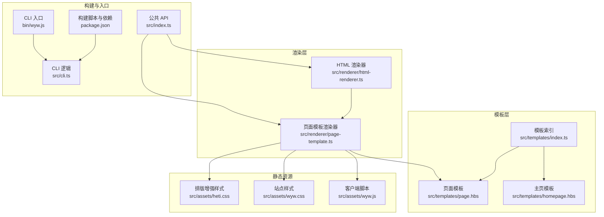
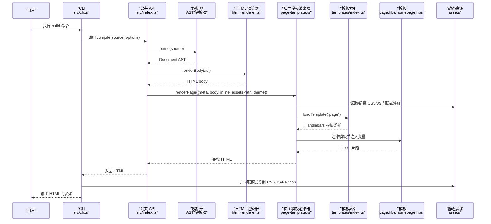
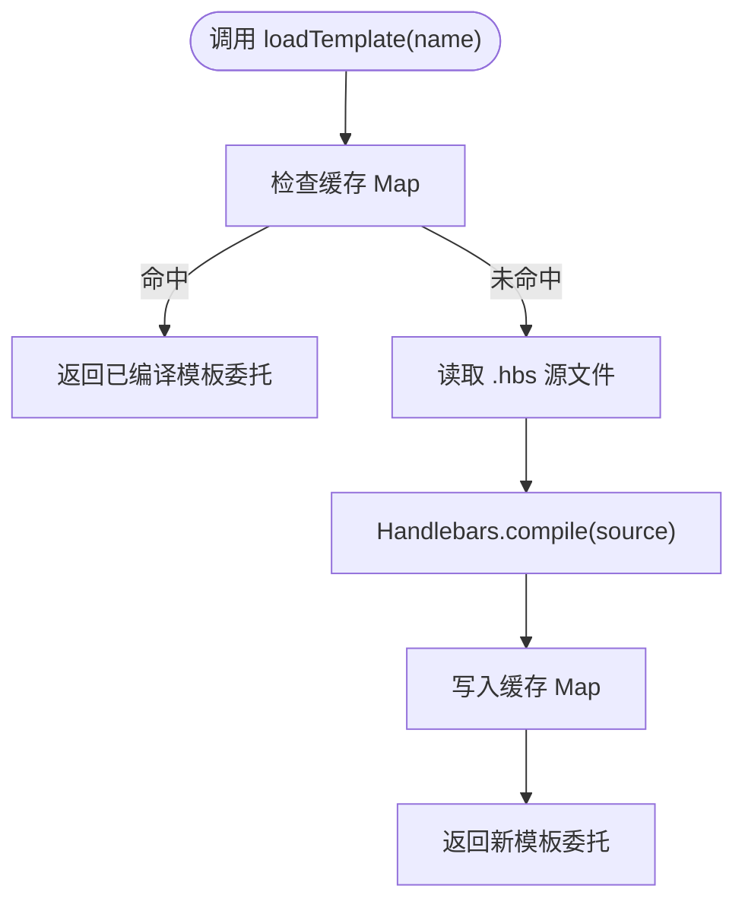
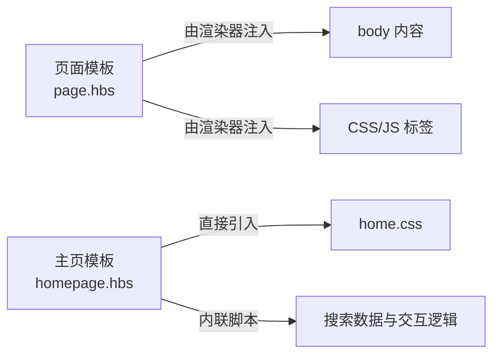
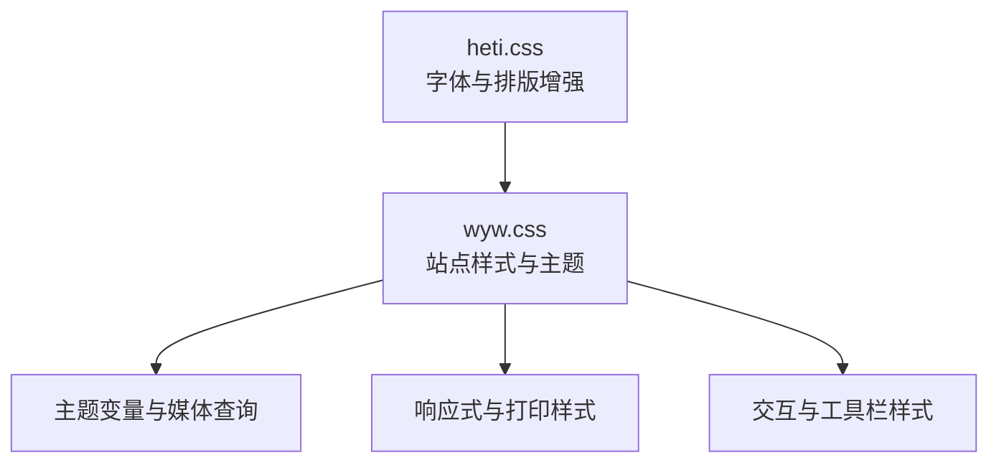
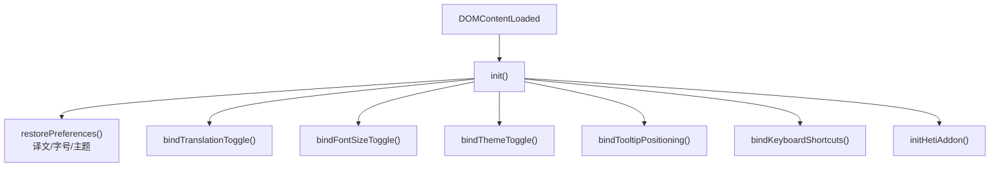
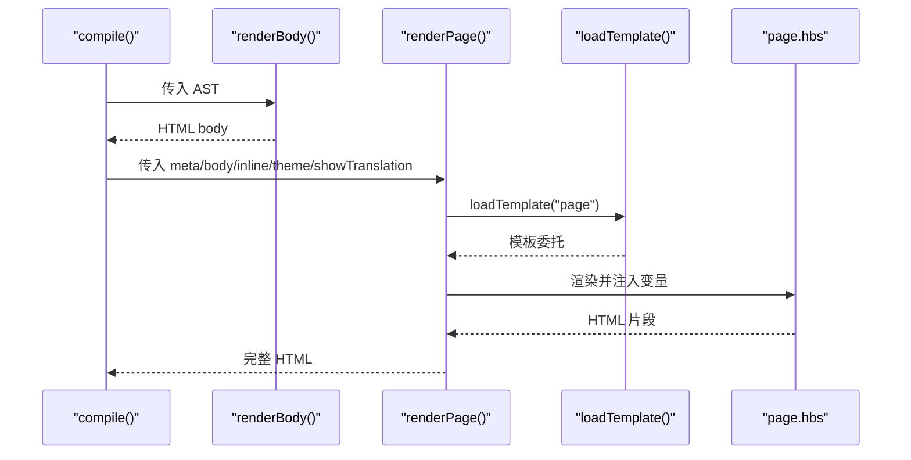
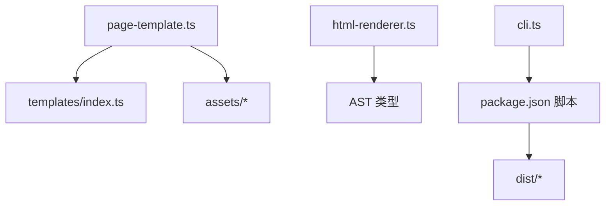

# 模板与静态资源

<cite>
**本文引用的文件**
- [src/templates/index.ts](file://src/templates/index.ts)
- [src/templates/page.hbs](file://src/templates/page.hbs)
- [src/templates/homepage.hbs](file://src/templates/homepage.hbs)
- [src/renderer/page-template.ts](file://src/renderer/page-template.ts)
- [src/renderer/html-renderer.ts](file://src/renderer/html-renderer.ts)
- [src/assets/wyw.css](file://src/assets/wyw.css)
- [src/assets/heti.css](file://src/assets/heti.css)
- [src/assets/wyw.js](file://src/assets/wyw.js)
- [src/index.ts](file://src/index.ts)
- [src/cli.ts](file://src/cli.ts)
- [package.json](file://package.json)
- [bin/wyw.js](file://bin/wyw.js)
- [README.md](file://README.md)
</cite>

## 目录
1. [简介](#简介)
2. [项目结构](#项目结构)
3. [核心组件](#核心组件)
4. [架构总览](#架构总览)
5. [详细组件分析](#详细组件分析)
6. [依赖关系分析](#依赖关系分析)
7. [性能考量](#性能考量)
8. [故障排查指南](#故障排查指南)
9. [结论](#结论)
10. [附录](#附录)

## 简介
本文件聚焦文言文编译器的“模板与静态资源”体系，系统阐述模板索引模块的模块化设计与动态加载机制；对比页面模板与主页模板在结构与适用场景上的差异；深入解析CSS样式系统的层次结构（基础样式、中文排版优化与响应式设计）；梳理JavaScript资源的模块化组织与功能实现；并提供自定义主题开发指南与静态资源打包、CDN部署策略建议。

## 项目结构
围绕模板与静态资源的关键目录与文件：
- 模板层：src/templates 下的 Handlebars 模板（page.hbs、homepage.hbs），以及模板索引模块 src/templates/index.ts
- 渲染层：src/renderer 下的页面模板渲染器 src/renderer/page-template.ts 与 HTML 渲染器 src/renderer/html-renderer.ts
- 静态资源：src/assets 下的 wyw.css、heti.css、wyw.js，以及 favicon.png
- 构建与分发：package.json 的构建脚本与资源拷贝策略；CLI 入口 bin/wyw.js 与命令行逻辑 src/cli.ts
- 入口与对外 API：src/index.ts 暴露 compile 等接口

图表来源
- [src/templates/index.ts:1-34](file://src/templates/index.ts#L1-L34)
- [src/templates/page.hbs:1-17](file://src/templates/page.hbs#L1-L17)
- [src/templates/homepage.hbs:1-202](file://src/templates/homepage.hbs#L1-L202)
- [src/renderer/page-template.ts:1-87](file://src/renderer/page-template.ts#L1-L87)
- [src/renderer/html-renderer.ts:1-51](file://src/renderer/html-renderer.ts#L1-L51)
- [src/assets/wyw.css:1-657](file://src/assets/wyw.css#L1-L657)
- [src/assets/heti.css:1-180](file://src/assets/heti.css#L1-L180)
- [src/assets/wyw.js:1-204](file://src/assets/wyw.js#L1-L204)
- [package.json:18-27](file://package.json#L18-L27)
- [bin/wyw.js:1-7](file://bin/wyw.js#L1-L7)
- [src/cli.ts:116-164](file://src/cli.ts#L116-L164)
- [src/index.ts:14-28](file://src/index.ts#L14-L28)

章节来源
- [README.md:110-125](file://README.md#L110-L125)
- [package.json:18-27](file://package.json#L18-L27)

## 核心组件
- 模板索引模块（src/templates/index.ts）
  - 通过 Node.js 文件系统读取 .hbs 模板，使用 Handlebars 编译并缓存模板委托，提供 loadTemplate(name) 与 Handlebars 实例导出，便于注册自定义 Helper
- 页面模板渲染器（src/renderer/page-template.ts）
  - 依据渲染选项决定内联或外链 CSS/JS；根据文档元数据生成标题、文章类名；调用模板索引加载 page.hbs 并注入变量
- HTML 渲染器（src/renderer/html-renderer.ts）
  - 将 AST 转换为 HTML body 内容，负责文档头部、工具栏、正文区块等结构化输出
- 静态资源
  - wyw.css：站点样式与主题变量、响应式与打印样式
  - heti.css：字体族声明与排版增强工具类
  - wyw.js：偏好恢复、字号/主题切换、Tooltip 边界检测、键盘快捷键、heti-addon 初始化
- CLI 与构建脚本
  - CLI 支持 build/init/validate 子命令；构建脚本在打包时复制 CSS/JS/Favicon 到 dist；postinstall 自动复制 heti-addon.min.js 到 assets

章节来源
- [src/templates/index.ts:15-33](file://src/templates/index.ts#L15-L33)
- [src/renderer/page-template.ts:13-68](file://src/renderer/page-template.ts#L13-L68)
- [src/renderer/html-renderer.ts:17-44](file://src/renderer/html-renderer.ts#L17-L44)
- [src/assets/wyw.css:1-657](file://src/assets/wyw.css#L1-L657)
- [src/assets/heti.css:1-180](file://src/assets/heti.css#L1-L180)
- [src/assets/wyw.js:1-204](file://src/assets/wyw.js#L1-L204)
- [src/cli.ts:28-56](file://src/cli.ts#L28-L56)
- [package.json:18-27](file://package.json#L18-L27)

## 架构总览
模板与静态资源的运行时与构建时交互如下：

图表来源
- [src/cli.ts:116-164](file://src/cli.ts#L116-L164)
- [src/index.ts:14-28](file://src/index.ts#L14-L28)
- [src/renderer/html-renderer.ts:17-44](file://src/renderer/html-renderer.ts#L17-L44)
- [src/renderer/page-template.ts:25-68](file://src/renderer/page-template.ts#L25-L68)
- [src/templates/index.ts:18-30](file://src/templates/index.ts#L18-L30)
- [src/templates/page.hbs:1-17](file://src/templates/page.hbs#L1-L17)

## 详细组件分析

### 模板索引模块（模块化与动态加载）
- 设计要点
  - 使用 Node.js 文件系统读取模板文件，Handlebars 编译为模板委托
  - 通过 Map 缓存模板，避免重复 I/O 与编译开销
  - 导出 Handlebars 实例，便于注册自定义 Helper
- 关键行为
  - loadTemplate(name)：按名称加载 .hbs，编译并缓存，返回模板委托
  - 模板目录常量 TEMPLATES_DIR 与当前模块目录绑定，确保相对路径稳定
- 适用场景
  - 页面模板与主页模板均可通过该索引按需加载
  - 可扩展为多模板共享与复用的基础设施

图表来源
- [src/templates/index.ts:18-30](file://src/templates/index.ts#L18-L30)

章节来源
- [src/templates/index.ts:15-33](file://src/templates/index.ts#L15-L33)

### 页面模板与主页模板的结构差异与适用场景
- 页面模板（page.hbs）
  - 结构：基础 HTML 结构，注入标题、主题、文章类名、body 内容、CSS/JS 标签
  - 适用场景：单篇文言文页面，需要统一的站点样式与交互
- 主页模板（homepage.hbs）
  - 结构：包含模式切换（词云/标签页）、搜索、导航与脚本内联
  - 适用场景：站点首页，集中展示作品集合与交互式浏览体验
- 关键差异
  - 页面模板由渲染器控制 CSS/JS 的内联或外链；主页模板直接在模板中引入 wyw.css 与 home.css，并内联搜索数据与交互脚本
  - 页面模板通过模板索引加载；主页模板作为独立模板存在，不依赖渲染器的模板索引

图表来源
- [src/templates/page.hbs:1-17](file://src/templates/page.hbs#L1-L17)
- [src/templates/homepage.hbs:8-11, 60-199:8-11](file://src/templates/homepage.hbs#L8-L11)
- [src/renderer/page-template.ts:41-57](file://src/renderer/page-template.ts#L41-L57)

章节来源
- [src/templates/page.hbs:1-17](file://src/templates/page.hbs#L1-L17)
- [src/templates/homepage.hbs:1-202](file://src/templates/homepage.hbs#L1-L202)
- [src/renderer/page-template.ts:25-68](file://src/renderer/page-template.ts#L25-L68)

### CSS 样式系统层次结构
- 基础样式（wyw.css）
  - CSS 变量：字号、行高、间距、最大宽度、字体族、颜色（浅色/深色/自动）
  - 全局与主题：根元素过渡、站点容器、文档头部、正文、标题、段落组、译文、Ruby 注音、Tooltip、专有名词、书名号、诗歌块、引用、分隔线、工具栏、导航、校对日期、前后文导航
  - 响应式：移动端断点下的字号、内边距、工具栏尺寸、窄屏 Tooltip 视口适配
  - 打印样式：隐藏工具栏、强制显示译文、禁用 Tooltip
- 中文排版优化（heti.css）
  - 字体族声明：Heti Song/Kai/Hei 的本地映射与权重
  - 工具类：中西文间距、标点挤压，配合运行时脚本使用
- 层级关系
  - heti.css 优先提供字体与基础排版增强
  - wyw.css 在其之上叠加站点特定样式、主题与交互细节

图表来源
- [src/assets/heti.css:1-180](file://src/assets/heti.css#L1-L180)
- [src/assets/wyw.css:1-657](file://src/assets/wyw.css#L1-L657)

章节来源
- [src/assets/heti.css:1-180](file://src/assets/heti.css#L1-L180)
- [src/assets/wyw.css:1-657](file://src/assets/wyw.css#L1-L657)

### JavaScript 资源的模块化组织与功能实现
- wyw.js
  - DOMContentLoaded 初始化：偏好恢复、译文切换、字号切换、主题切换、Tooltip 边界检测、键盘快捷键、heti-addon 初始化
  - 偏好存储：localStorage 持久化译文显示、字号、主题
  - 交互细节：字号三档循环切换、主题三态循环切换、Tooltip 基于视口边界自动对齐、键盘快捷键（T/D/F）
  - 运行时增强：初始化 Heti 实例，应用标点挤压与中西文间距
- 模块化组织
  - 即时函数封装，避免全局污染
  - 事件绑定集中在 init 函数内，职责清晰
  - 与 CSS 主题变量协同工作，实现无刷新主题切换

图表来源
- [src/assets/wyw.js:5-18](file://src/assets/wyw.js#L5-L18)
- [src/assets/wyw.js:21-45](file://src/assets/wyw.js#L21-L45)
- [src/assets/wyw.js:48-57](file://src/assets/wyw.js#L48-L57)
- [src/assets/wyw.js:59-97](file://src/assets/wyw.js#L59-L97)
- [src/assets/wyw.js:99-127](file://src/assets/wyw.js#L99-L127)
- [src/assets/wyw.js:129-167](file://src/assets/wyw.js#L129-L167)
- [src/assets/wyw.js:170-178](file://src/assets/wyw.js#L170-L178)
- [src/assets/wyw.js:181-202](file://src/assets/wyw.js#L181-L202)

章节来源
- [src/assets/wyw.js:1-204](file://src/assets/wyw.js#L1-L204)

### 页面模板渲染流程（代码级）
- 输入：Document AST、渲染选项（inline、assetsPath、theme、showTranslation）
- 处理：根据选项拼接 CSS/JS 标签；从模板索引加载 page.hbs；注入标题、主题、文章类名、body 与安全字符串标签
- 输出：完整 HTML

图表来源
- [src/index.ts:14-28](file://src/index.ts#L14-L28)
- [src/renderer/html-renderer.ts:17-44](file://src/renderer/html-renderer.ts#L17-L44)
- [src/renderer/page-template.ts:25-68](file://src/renderer/page-template.ts#L25-L68)
- [src/templates/index.ts:18-30](file://src/templates/index.ts#L18-L30)
- [src/templates/page.hbs:1-17](file://src/templates/page.hbs#L1-17)

章节来源
- [src/index.ts:14-28](file://src/index.ts#L14-L28)
- [src/renderer/page-template.ts:25-68](file://src/renderer/page-template.ts#L25-L68)

## 依赖关系分析
- 模块耦合
  - page-template.ts 依赖 templates/index.ts（模板索引）与 assets（CSS/JS）
  - html-renderer.ts 仅负责 AST 到 HTML 的转换，不直接处理资源链接
  - CLI 与构建脚本负责资源复制与发布
- 外部依赖
  - Handlebars 用于模板编译与渲染
  - heti 库提供字体与排版增强，构建时复制其 UMD 版本到 assets
- 潜在风险
  - 模板路径与资源路径需保持一致性，避免运行时 404
  - 内联与外链模式需与服务器部署策略一致

图表来源
- [src/renderer/page-template.ts:7-11](file://src/renderer/page-template.ts#L7-L11)
- [src/templates/index.ts:4-7](file://src/templates/index.ts#L4-L7)
- [src/cli.ts:138-153](file://src/cli.ts#L138-L153)
- [package.json:18-27](file://package.json#L18-L27)

章节来源
- [src/renderer/page-template.ts:1-87](file://src/renderer/page-template.ts#L1-L87)
- [src/cli.ts:116-164](file://src/cli.ts#L116-L164)
- [package.json:18-27](file://package.json#L18-L27)

## 性能考量
- 模板加载缓存
  - 模板索引使用 Map 缓存模板委托，减少重复 I/O 与编译成本
- 资源加载策略
  - 外链模式：减少 HTML 体积，利于浏览器缓存与 CDN 分发
  - 内联模式：减少请求数，适合单页或离线场景
- 建议
  - 生产环境优先外链，结合 CDN 与缓存头；内联仅用于特殊场景
  - 合理拆分 CSS/JS，避免单文件过大影响首屏

## 故障排查指南
- 模板未找到或渲染异常
  - 确认模板文件存在且路径正确；检查模板索引的模板目录常量
  - 参考：模板索引模块的读取与编译流程
- 资源 404
  - 外链模式下确认输出目录包含 CSS/JS/Favicon；CLI 构建脚本会复制资源
  - 参考：CLI 构建与资源复制逻辑
- 主题/字号/译文偏好未生效
  - 检查 localStorage 是否被清理；确认 wyw.js 初始化与事件绑定
  - 参考：wyw.js 的偏好恢复与事件绑定
- 运行时排版异常
  - 确认 heti-addon.min.js 已复制到 assets 并在非内联模式下可用
  - 参考：postinstall 脚本与构建脚本

章节来源
- [src/templates/index.ts:18-30](file://src/templates/index.ts#L18-L30)
- [src/cli.ts:138-153](file://src/cli.ts#L138-L153)
- [src/assets/wyw.js:21-45](file://src/assets/wyw.js#L21-L45)
- [package.json:19](file://package.json#L19)

## 结论
本系统通过模板索引模块实现模板的模块化与高效加载；页面模板与主页模板分别服务于单页与首页场景；CSS 样式体系以 heti.css 提供中文排版基础，以 wyw.css 实现站点风格与主题；JavaScript 资源以 wyw.js 提供交互能力并与样式变量协同。构建脚本与 CLI 保障了资源的打包与分发。遵循本文最佳实践，可实现稳定、可扩展的主题与资源管理。

## 附录

### 自定义主题开发指南（最佳实践）
- 样式覆盖
  - 通过 CSS 变量覆盖（如 --wyw-color-*、--wyw-font-size-*）实现主题定制
  - 在页面模板中保留 wyw.css 与 heti.css 的顺序，确保自定义样式能正确覆盖
- 模板修改
  - 新增模板时，通过模板索引模块按名称加载；保持与现有模板一致的数据注入方式
  - 若需内联资源，参考页面模板渲染器的内联策略
- 资源替换
  - 替换 wyw.js 时，确保事件绑定与运行时增强逻辑兼容
  - 替换 favicon.png 时，保持路径一致

章节来源
- [src/assets/wyw.css:6-68](file://src/assets/wyw.css#L6-L68)
- [src/renderer/page-template.ts:43-57](file://src/renderer/page-template.ts#L43-L57)
- [src/templates/index.ts:18-30](file://src/templates/index.ts#L18-L30)

### 静态资源打包策略与 CDN 部署方案
- 打包策略
  - 构建脚本复制 CSS/JS/Favicon 到 dist；生产环境建议启用压缩与版本号
  - postinstall 自动复制 heti-addon.min.js 到 assets，确保运行时可用
- CDN 部署
  - 将 dist 中的静态资源托管至 CDN，页面模板外链资源指向 CDN 地址
  - 保持 assetsPath 与 CDN 路径一致，避免相对路径问题
- 版本与缓存
  - 采用文件指纹命名或子目录版本策略，结合强缓存头提升性能

章节来源
- [package.json:19-21](file://package.json#L19-L21)
- [src/cli.ts:138-153](file://src/cli.ts#L138-L153)
- [src/renderer/page-template.ts:30-57](file://src/renderer/page-template.ts#L30-L57)