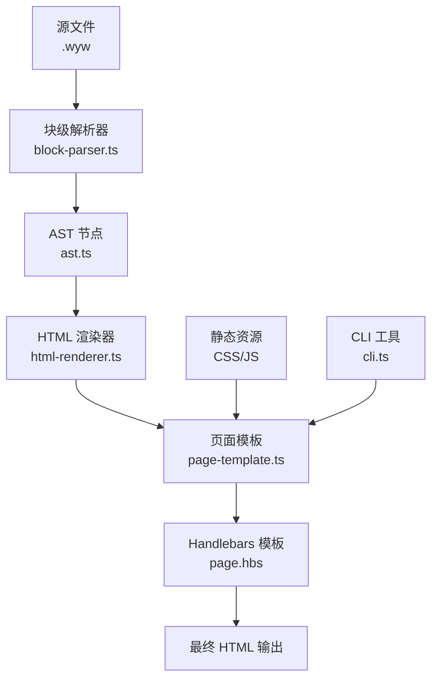
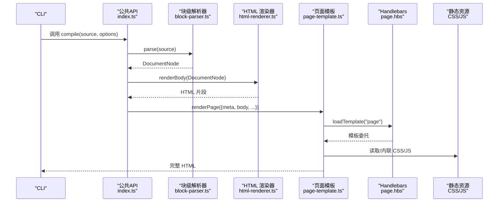
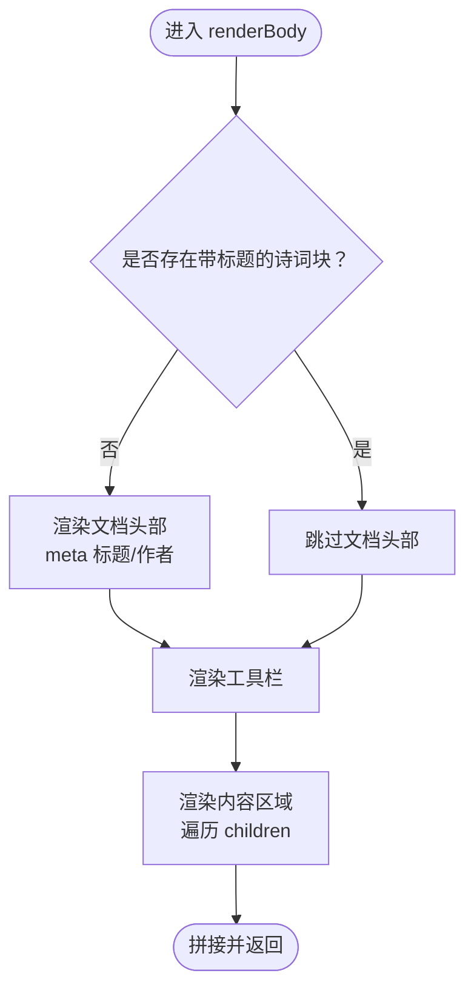
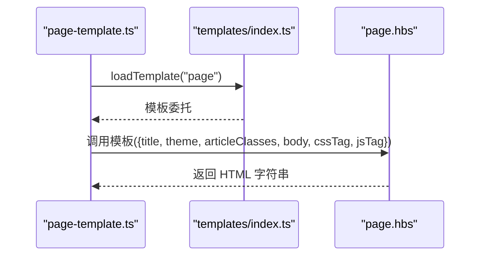
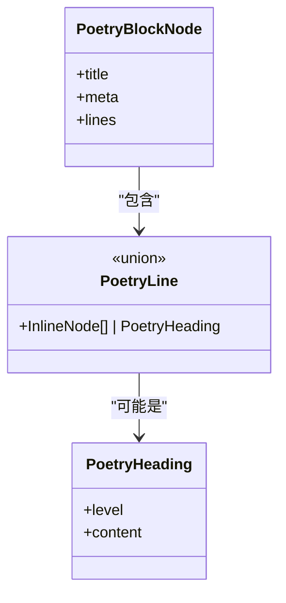
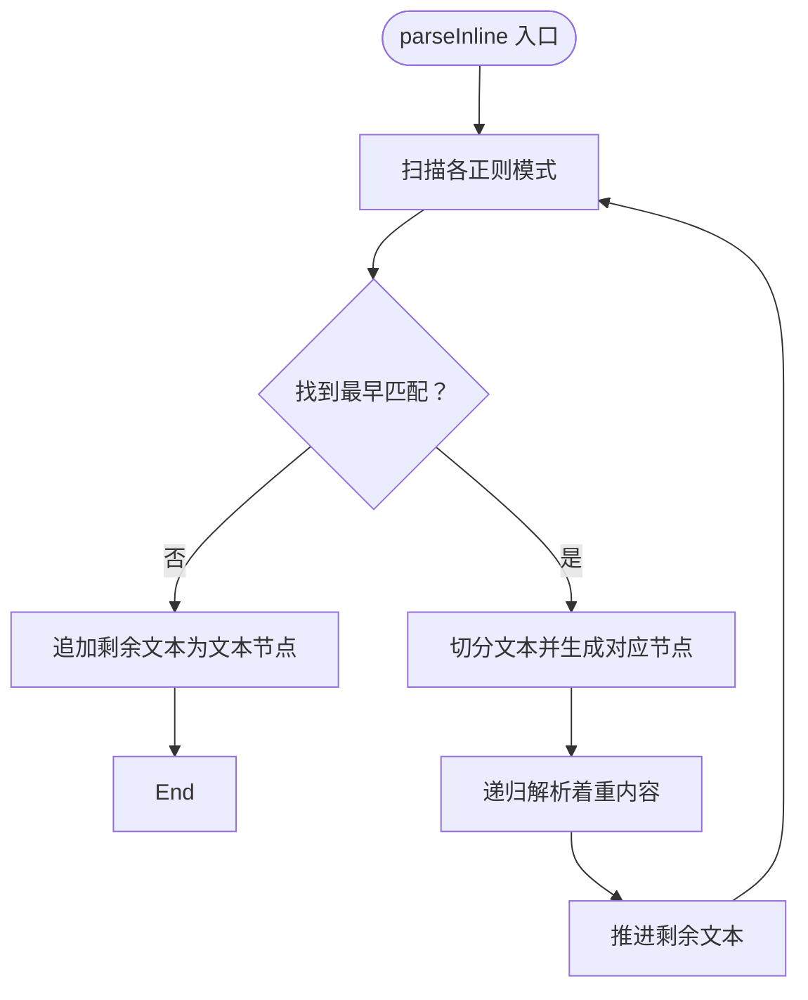
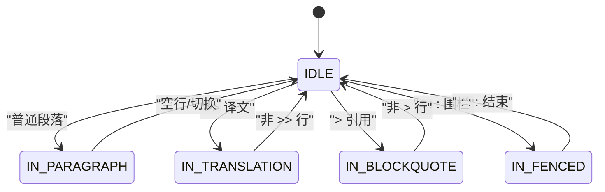
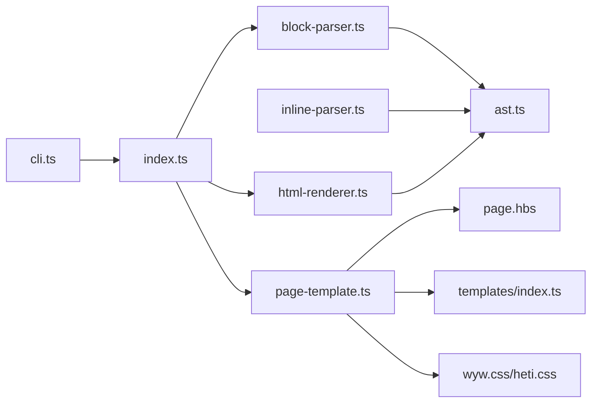

# 渲染器系统

<cite>
**本文引用的文件**
- [src/index.ts](file://src/index.ts)
- [src/cli.ts](file://src/cli.ts)
- [src/renderer/html-renderer.ts](file://src/renderer/html-renderer.ts)
- [src/renderer/page-template.ts](file://src/renderer/page-template.ts)
- [src/parser/block-parser.ts](file://src/parser/block-parser.ts)
- [src/parser/inline-parser.ts](file://src/parser/inline-parser.ts)
- [src/parser/ast.ts](file://src/parser/ast.ts)
- [src/templates/index.ts](file://src/templates/index.ts)
- [src/templates/page.hbs](file://src/templates/page.hbs)
- [src/templates/homepage.hbs](file://src/templates/homepage.hbs)
- [src/assets/wyw.css](file://src/assets/wyw.css)
- [src/assets/heti.css](file://src/assets/heti.css)
- [package.json](file://package.json)
- [examples/刘禹锡_陋室铭.wyw](file://examples/刘禹锡_陋室铭.wyw)
</cite>

## 目录
1. [简介](#简介)
2. [项目结构](#项目结构)
3. [核心组件](#核心组件)
4. [架构总览](#架构总览)
5. [详细组件分析](#详细组件分析)
6. [依赖关系分析](#依赖关系分析)
7. [性能考虑](#性能考虑)
8. [故障排查指南](#故障排查指南)
9. [结论](#结论)
10. [附录](#附录)

## 简介
本技术文档面向“文言文渲染器系统”，聚焦以下目标：
- 深入解释HTML渲染器的结构化渲染机制：文档头部、工具栏、内容区域的生成逻辑与控制流。
- 详解页面模板系统的设计原理：Handlebars模板的变量绑定、条件渲染与循环处理。
- 解释诗词块的特殊渲染逻辑与中文排版优化策略（含注音、注释、着重、分节等）。
- 描述内联样式的生成机制与CSS类名命名规范。
- 提供渲染性能优化技巧与缓存策略。
- 给出自定义渲染器的扩展接口与插件开发指南。

## 项目结构
系统采用“解析-渲染-模板”三层架构，配合静态资源与CLI工具，形成从源文件到HTML页面的完整流水线。

图表来源
- [src/index.ts:17-28](file://src/index.ts#L17-L28)
- [src/renderer/html-renderer.ts:20-44](file://src/renderer/html-renderer.ts#L20-L44)
- [src/renderer/page-template.ts:25-68](file://src/renderer/page-template.ts#L25-L68)
- [src/templates/page.hbs:1-17](file://src/templates/page.hbs#L1-L17)

章节来源
- [src/index.ts:17-28](file://src/index.ts#L17-L28)
- [src/cli.ts:116-164](file://src/cli.ts#L116-L164)

## 核心组件
- 解析层：将源文本解析为AST，支持块级结构（标题、段落、译文、围栏块、引用、分隔线、校对日期）与内联标记（注音、注释、着重）。
- 渲染层：将AST转换为HTML片段，负责文档头部、工具栏、内容区域的结构化输出。
- 模板层：通过Handlebars模板包装HTML片段，注入CSS/JS与页面元数据，生成完整HTML页面。
- 静态资源：提供中文排版增强（heti）与文言文专用样式（wyw.css）。
- CLI：提供构建、监听、初始化模板、校验等功能。

章节来源
- [src/parser/block-parser.ts:43-49](file://src/parser/block-parser.ts#L43-L49)
- [src/renderer/html-renderer.ts:20-44](file://src/renderer/html-renderer.ts#L20-L44)
- [src/renderer/page-template.ts:25-68](file://src/renderer/page-template.ts#L25-L68)
- [src/templates/index.ts:18-30](file://src/templates/index.ts#L18-L30)

## 架构总览
渲染器系统遵循“解析-渲染-模板”的清晰职责分离，解析器负责结构识别，渲染器负责HTML生成，模板负责页面包装与资源注入。

图表来源
- [src/index.ts:17-28](file://src/index.ts#L17-L28)
- [src/renderer/page-template.ts:25-68](file://src/renderer/page-template.ts#L25-L68)
- [src/templates/index.ts:18-30](file://src/templates/index.ts#L18-L30)
- [src/templates/page.hbs:1-17](file://src/templates/page.hbs#L1-L17)

## 详细组件分析

### HTML 渲染器（结构化渲染机制）
- 文档头部渲染规则：当文档不包含带标题的诗词块时，才渲染meta标题与作者信息；否则跳过文档头部，避免重复展示。
- 工具栏：固定在页面右下角，包含“译文开关”“字体大小”“主题切换”三键，支持无障碍属性。
- 内容区域：包裹在特定容器中，逐块渲染，支持标题、段落组、诗词块、引用、分隔线、校对日期。
- 诗词块渲染：支持标题、元信息、分节标题与诗句段落；诗句按行渲染，内部使用内联解析结果，必要时插入换行。
- 内联渲染：支持文本、注音（ruby）、注释（annotate）、注音+注释组合、着重（emphasis）等，均进行HTML转义以确保安全。

图表来源
- [src/renderer/html-renderer.ts:20-44](file://src/renderer/html-renderer.ts#L20-L44)
- [src/renderer/html-renderer.ts:46-70](file://src/renderer/html-renderer.ts#L46-L70)
- [src/renderer/html-renderer.ts:72-78](file://src/renderer/html-renderer.ts#L72-L78)
- [src/renderer/html-renderer.ts:80-97](file://src/renderer/html-renderer.ts#L80-L97)

章节来源
- [src/renderer/html-renderer.ts:20-186](file://src/renderer/html-renderer.ts#L20-L186)

### 页面模板系统（Handlebars）
- 模板加载与缓存：模板加载器对模板进行编译并缓存，避免重复I/O与编译开销。
- 页面包装：模板接收标题、主题、文章类名、HTML主体、CSS/JS标签等变量，使用安全字符串注入避免二次转义。
- 变量绑定与条件渲染：根据选项动态设置主题与译文可见性；根据是否内联选择资源注入方式。
- 循环处理：首页模板中使用循环渲染词云与标签页列表项。

图表来源
- [src/renderer/page-template.ts:25-68](file://src/renderer/page-template.ts#L25-L68)
- [src/templates/index.ts:18-30](file://src/templates/index.ts#L18-L30)
- [src/templates/page.hbs:1-17](file://src/templates/page.hbs#L1-L17)

章节来源
- [src/renderer/page-template.ts:25-87](file://src/renderer/page-template.ts#L25-L87)
- [src/templates/index.ts:18-34](file://src/templates/index.ts#L18-L34)
- [src/templates/page.hbs:1-17](file://src/templates/page.hbs#L1-L17)
- [src/templates/homepage.hbs:26-54](file://src/templates/homepage.hbs#L26-L54)

### 诗词块特殊渲染逻辑与中文排版优化
- 诗词块结构：支持标题、元信息、分节标题与诗句段落；诗句按行渲染，保留换行结构。
- 注音与注释：注音使用ruby元素，注释使用annotate类并携带data属性；两者可组合，内部逐字渲染ruby，外部统一封装。
- 中文排版增强：引入heti样式，提供中西文间距与标点挤压工具类；文言文样式强调行高、字距、缩进与字体族。
- 译文折叠：默认显示译文，可通过类名切换隐藏；注音模式下增大行高避免ruby重叠。

图表来源
- [src/parser/ast.ts:91-96](file://src/parser/ast.ts#L91-L96)
- [src/parser/ast.ts:83-87](file://src/parser/ast.ts#L83-L87)
- [src/renderer/html-renderer.ts:125-186](file://src/renderer/html-renderer.ts#L125-L186)

章节来源
- [src/renderer/html-renderer.ts:125-186](file://src/renderer/html-renderer.ts#L125-L186)
- [src/assets/heti.css:135-179](file://src/assets/heti.css#L135-L179)
- [src/assets/wyw.css:119-122](file://src/assets/wyw.css#L119-L122)

### 内联样式生成机制与CSS类名命名规范
- 类名规范：统一使用“wyw-”前缀，语义化命名；如“wyw-header”“wyw-content”“wyw-para-group”“wyw-translation”“wyw-poetry”“wyw-verse”“wyw-toolbar”“wyw-btn”等。
- 主题与状态：通过类名切换实现主题（light/dark/auto）与状态（隐藏译文、按钮激活）；data-theme属性驱动CSS变量切换。
- 中文排版：通过CSS变量统一管理字号、行高、字距、最大宽度、缩进等；注音模式下增大行高；窄屏下tooltip限制宽度。
- 打印样式：隐藏工具栏、强制显示译文、禁用tooltip。

章节来源
- [src/assets/wyw.css:105-117](file://src/assets/wyw.css#L105-L117)
- [src/assets/wyw.css:416-461](file://src/assets/wyw.css#L416-L461)
- [src/assets/wyw.css:535-554](file://src/assets/wyw.css#L535-L554)

### 内联解析与渲染（注音/注释/着重）
- 内联解析优先级：注音+注释组合 > 注音 > 注释 > 着重。解析器从左到右扫描，优先匹配最早出现的模式。
- 注音+注释组合：支持多字注音与单字注音混合，内部逐字渲染ruby，外部统一封装annotate。
- 着重：将内容作为内联节点递归解析，再包裹强调标签。

图表来源
- [src/parser/inline-parser.ts:62-98](file://src/parser/inline-parser.ts#L62-L98)
- [src/renderer/html-renderer.ts:195-233](file://src/renderer/html-renderer.ts#L195-L233)

章节来源
- [src/parser/inline-parser.ts:22-46](file://src/parser/inline-parser.ts#L22-L46)
- [src/renderer/html-renderer.ts:195-233](file://src/renderer/html-renderer.ts#L195-L233)

### 块级解析器（状态机）
- 状态机：IDLE、IN_PARAGRAPH、IN_TRANSLATION、IN_FENCED、IN_BLOCKQUOTE。
- 围栏块：默认类型为poetry，支持标题与元信息；内容行逐行内联解析，保留空行。
- 段落组：相邻的段落与译文合并为段落组，便于统一渲染。
- 特殊标记：主题分隔线、校对日期、标题、引用、译文等均有明确识别规则。

图表来源
- [src/parser/block-parser.ts:72-341](file://src/parser/block-parser.ts#L72-L341)

章节来源
- [src/parser/block-parser.ts:43-49](file://src/parser/block-parser.ts#L43-L49)
- [src/parser/block-parser.ts:72-341](file://src/parser/block-parser.ts#L72-L341)

### 示例与用法
- 示例文件展示了注音、注释、着重、围栏诗词块、译文与引用的典型用法。
- CLI命令支持构建、监听、初始化模板与校验，输出统计信息。

章节来源
- [examples/刘禹锡_陋室铭.wyw:1-22](file://examples/刘禹锡_陋室铭.wyw#L1-L22)
- [src/cli.ts:28-114](file://src/cli.ts#L28-L114)

## 依赖关系分析
- 模块耦合：解析器与渲染器通过AST解耦；渲染器与模板通过字符串接口解耦；模板与资源通过文件系统解耦。
- 外部依赖：Handlebars用于模板编译与渲染；commander用于CLI；heti提供中文排版增强。
- 潜在循环依赖：当前模块间无循环导入；模板加载器对模板进行缓存，避免重复编译。

图表来源
- [src/index.ts:3-32](file://src/index.ts#L3-L32)
- [src/renderer/page-template.ts:4-7](file://src/renderer/page-template.ts#L4-L7)
- [src/templates/index.ts:4-7](file://src/templates/index.ts#L4-L7)
- [package.json:45-54](file://package.json#L45-L54)

章节来源
- [src/index.ts:3-32](file://src/index.ts#L3-L32)
- [package.json:45-54](file://package.json#L45-L54)

## 性能考虑
- 模板缓存：模板加载器对已编译模板进行缓存，减少重复I/O与编译成本。
- 字符串拼接：渲染器使用数组拼接而非频繁字符串拼接，降低内存分配。
- 资源内联：在需要时将CSS/JS内联至HTML，减少HTTP请求数，适合单页场景。
- 事件与动画：译文折叠与tooltip使用CSS过渡，避免JavaScript动画抖动。
- 建议优化：
  - 对大型文档可考虑分块渲染与懒加载译文。
  - 在批量构建时复用同一模板实例，避免重复编译。
  - 对高频调用的渲染函数可引入轻量缓存（如按AST哈希缓存HTML片段）。

章节来源
- [src/templates/index.ts:18-30](file://src/templates/index.ts#L18-L30)
- [src/renderer/html-renderer.ts:20-44](file://src/renderer/html-renderer.ts#L20-L44)
- [src/renderer/page-template.ts:43-57](file://src/renderer/page-template.ts#L43-L57)

## 故障排查指南
- HTML转义问题：内联渲染对文本与属性均进行转义，若出现异常字符，请检查输入源是否包含未转义的HTML字符。
- 模板变量缺失：确认传入模板的数据对象包含必需字段（标题、主题、文章类名、body、CSS/JS标签）。
- 资源路径问题：非内联模式需确保输出目录存在并正确复制静态资源；内联模式无需外部资源。
- CLI构建失败：检查文件读写权限与输出目录；监听模式下修改文件后会自动重编译。
- 校验失败：使用校验命令查看格式问题，严格模式会将提示提升为错误。

章节来源
- [src/renderer/html-renderer.ts:237-250](file://src/renderer/html-renderer.ts#L237-L250)
- [src/renderer/page-template.ts:60-67](file://src/renderer/page-template.ts#L60-L67)
- [src/cli.ts:116-164](file://src/cli.ts#L116-L164)

## 结论
该渲染器系统以清晰的分层设计实现了从文言文源码到精美HTML页面的自动化渲染。其特性包括：
- 结构化渲染：文档头部、工具栏、内容区域的生成逻辑明确且可配置。
- 模板系统：Handlebars模板与缓存机制保证了可维护性与性能。
- 诗词块与中文排版：针对注音、注释、着重与分节的特殊处理，结合heti样式与wyw.css，提供优良的中文排版体验。
- 扩展性：通过公共API与CLI工具，易于集成到更大的工作流中。

## 附录

### 自定义渲染器扩展接口与插件开发指南
- 扩展点建议：
  - 新增块级节点：在AST中定义新节点类型，在渲染器中添加对应渲染函数，并在模板中补充样式。
  - 新增内联节点：在内联解析器中添加正则与创建函数，在渲染器中实现渲染逻辑。
  - 自定义模板：通过模板加载器注册自定义模板，或在模板中新增Helper以支持更复杂的条件与循环。
- 插件开发步骤：
  1. 在公共API中导出自定义渲染函数或中间件钩子。
  2. 在CLI中新增命令或选项以启用插件。
  3. 在模板中通过Helper或变量扩展页面内容。
  4. 在样式中新增类名以适配新功能。
- 注意事项：
  - 保持HTML转义与安全策略一致。
  - 通过缓存机制避免重复计算。
  - 提供向后兼容的默认行为与可配置选项。

章节来源
- [src/index.ts:17-28](file://src/index.ts#L17-L28)
- [src/renderer/html-renderer.ts:80-97](file://src/renderer/html-renderer.ts#L80-L97)
- [src/templates/index.ts:32-33](file://src/templates/index.ts#L32-L33)