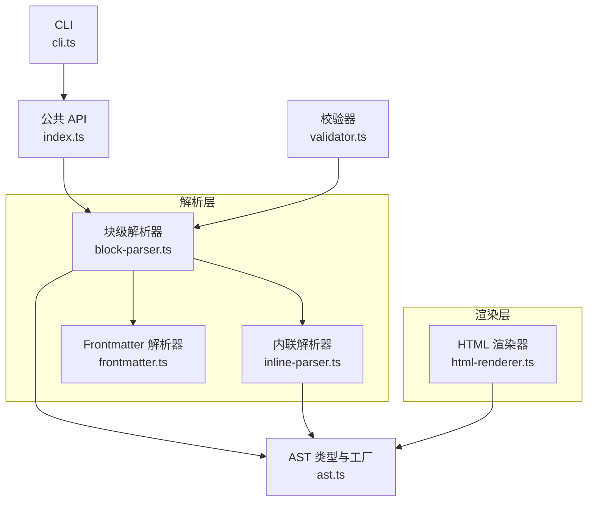
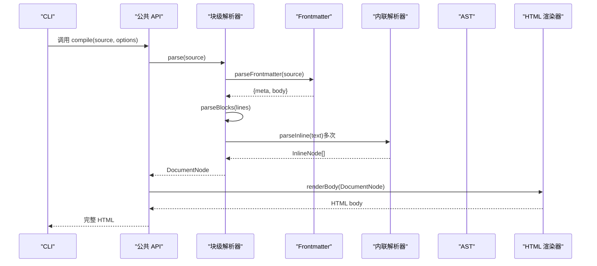
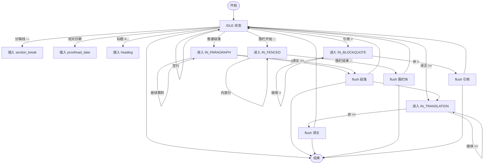
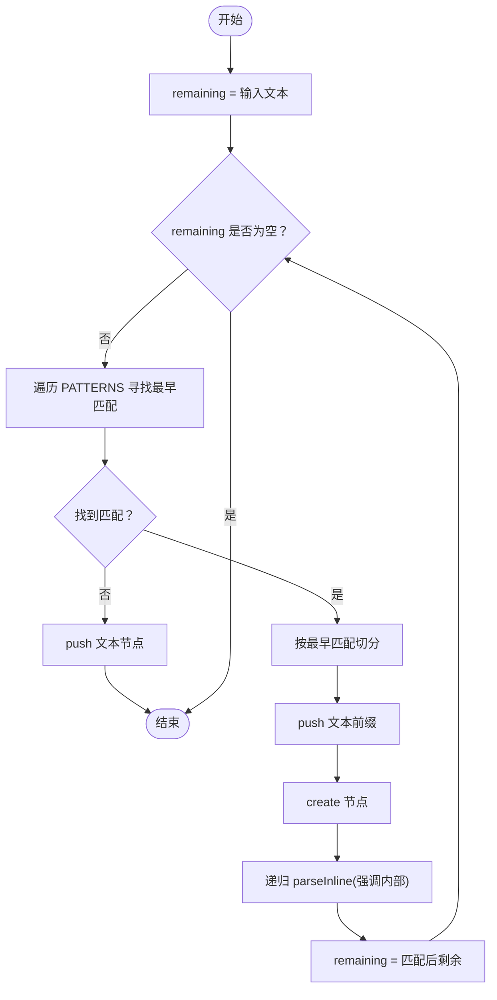
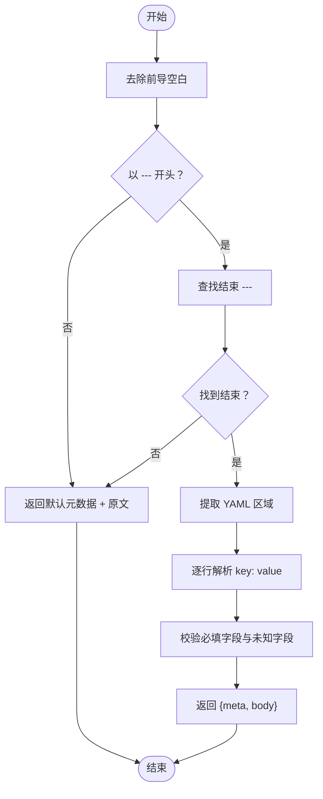
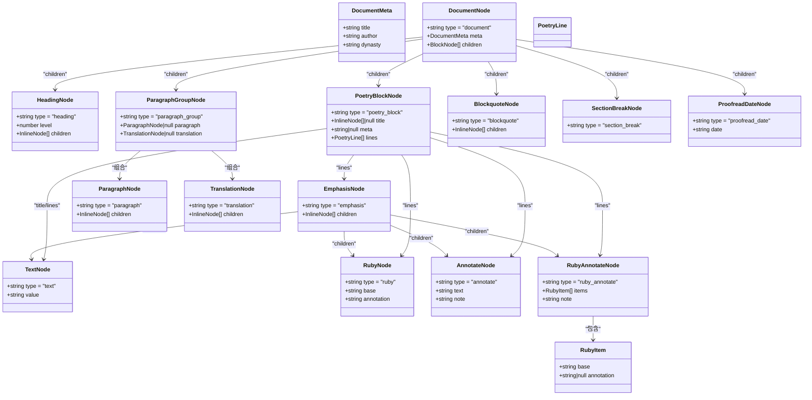
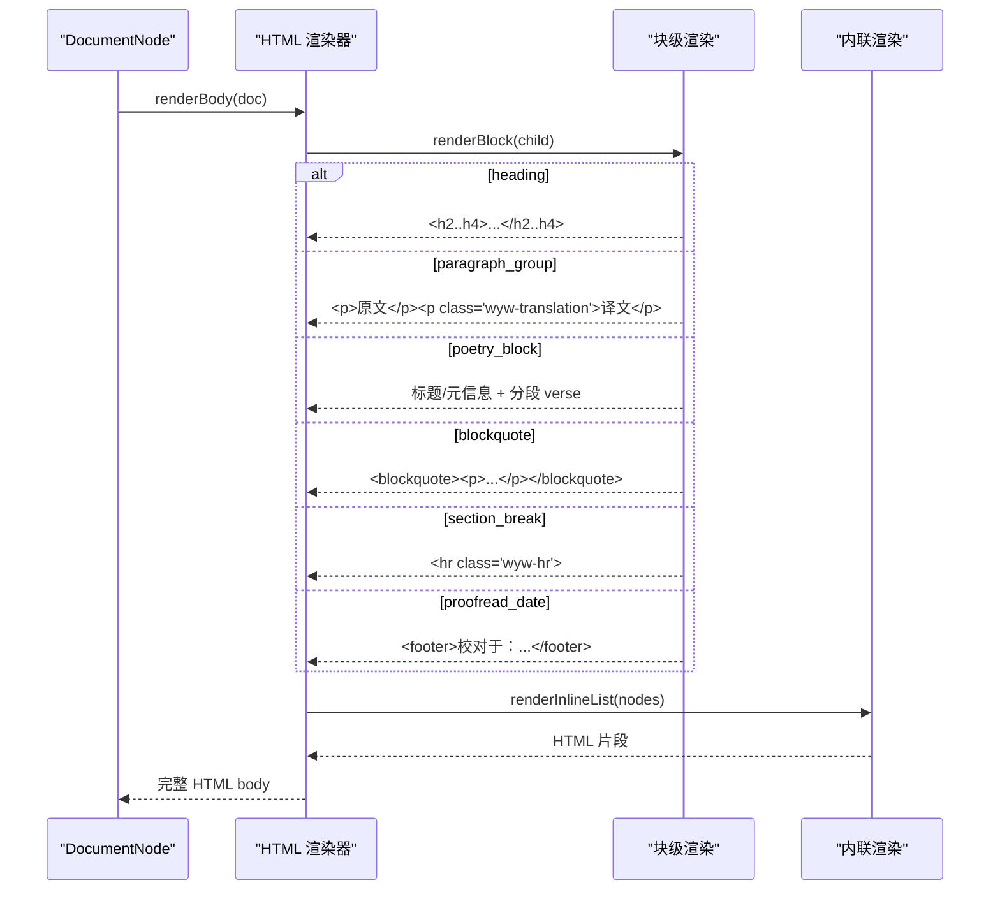
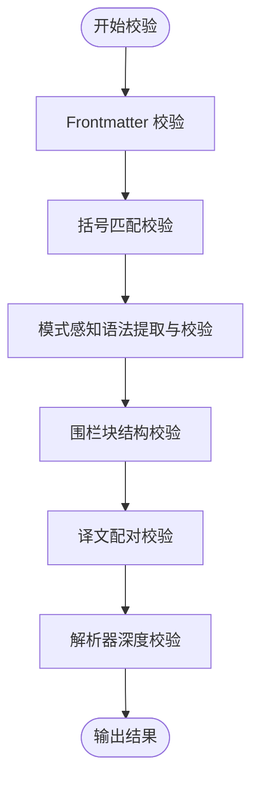
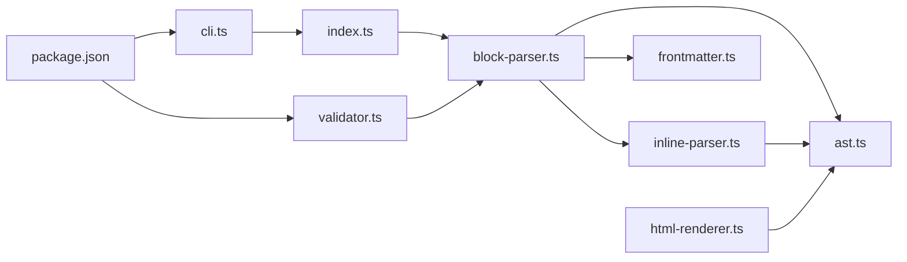

# 解析器系统

<cite>
**本文引用的文件**
- [src/parser/block-parser.ts](file://src/parser/block-parser.ts)
- [src/parser/inline-parser.ts](file://src/parser/inline-parser.ts)
- [src/parser/frontmatter.ts](file://src/parser/frontmatter.ts)
- [src/parser/ast.ts](file://src/parser/ast.ts)
- [src/renderer/html-renderer.ts](file://src/renderer/html-renderer.ts)
- [src/index.ts](file://src/index.ts)
- [src/cli.ts](file://src/cli.ts)
- [src/validator.ts](file://src/validator.ts)
- [test/parser.test.ts](file://test/parser.test.ts)
- [examples/郦道元_三峡.wyw](file://examples/郦道元_三峡.wyw)
- [package.json](file://package.json)
</cite>

## 目录
1. [简介](#简介)
2. [项目结构](#项目结构)
3. [核心组件](#核心组件)
4. [架构总览](#架构总览)
5. [详细组件分析](#详细组件分析)
6. [依赖分析](#依赖分析)
7. [性能考虑](#性能考虑)
8. [故障排查指南](#故障排查指南)
9. [结论](#结论)
10. [附录](#附录)

## 简介
本技术文档面向“文言文解析器系统”，聚焦以下关键能力：
- 块级解析器的有限状态机实现原理，包括状态转换逻辑、解析规则与错误处理机制
- 内联解析器的优先级匹配算法，详解注音(ruby)、注释(annotate)、强调(emphasis)等内联标记的解析过程
- Frontmatter 元数据解析的 YAML 处理机制与字段验证
- AST 抽象语法树的完整类型定义、节点继承关系、属性结构与序列化机制
- 解析器的性能优化策略与内存管理方案

## 项目结构
系统采用分层设计：解析层（块级/内联/Frontmatter）、AST 定义、渲染层（HTML）、CLI 与校验器。核心入口对外暴露编译 API，CLI 提供构建、初始化、校验等命令。

图表来源
- [src/parser/block-parser.ts:1-371](file://src/parser/block-parser.ts#L1-L371)
- [src/parser/inline-parser.ts:1-99](file://src/parser/inline-parser.ts#L1-L99)
- [src/parser/frontmatter.ts:1-57](file://src/parser/frontmatter.ts#L1-L57)
- [src/parser/ast.ts:1-218](file://src/parser/ast.ts#L1-L218)
- [src/renderer/html-renderer.ts:1-251](file://src/renderer/html-renderer.ts#L1-L251)
- [src/index.ts:1-57](file://src/index.ts#L1-L57)
- [src/cli.ts:1-182](file://src/cli.ts#L1-L182)
- [src/validator.ts:1-838](file://src/validator.ts#L1-L838)

章节来源
- [src/index.ts:1-57](file://src/index.ts#L1-L57)
- [src/cli.ts:1-182](file://src/cli.ts#L1-L182)
- [package.json:1-56](file://package.json#L1-L56)

## 核心组件
- 块级解析器：基于有限状态机，识别标题、段落、译文、引用、围栏块、分隔线、校对日期等块级结构，生成原始块节点，再聚合成段落组。
- 内联解析器：按优先级扫描文本，匹配注音、注释、强调等内联标记，支持注音+注释组合。
- Frontmatter 解析器：提取 --- 包裹的元数据，提供默认值与基本校验。
- AST：定义文档、块级、内联节点类型及工厂函数。
- HTML 渲染器：遍历 AST，生成 HTML 字符串，支持工具栏、诗词块分段渲染等。
- 校验器：多规则校验（Frontmatter、括号平衡、模式感知语法、围栏块、译文配对、解析器深度校验）。
- CLI：提供构建、初始化模板、校验命令，支持监听与资源复制。

章节来源
- [src/parser/block-parser.ts:43-49](file://src/parser/block-parser.ts#L43-L49)
- [src/parser/inline-parser.ts:62-98](file://src/parser/inline-parser.ts#L62-L98)
- [src/parser/frontmatter.ts:14-56](file://src/parser/frontmatter.ts#L14-L56)
- [src/parser/ast.ts:55-129](file://src/parser/ast.ts#L55-L129)
- [src/renderer/html-renderer.ts:20-44](file://src/renderer/html-renderer.ts#L20-L44)
- [src/validator.ts:17-779](file://src/validator.ts#L17-L779)
- [src/cli.ts:28-114](file://src/cli.ts#L28-L114)

## 架构总览
解析流程从源文件开始，先解析 Frontmatter，再逐行解析块级结构，随后将相邻段落与译文合并为段落组，最后由内联解析器对文本进行注音、注释、强调等标记解析。渲染阶段将 AST 转为 HTML。

图表来源
- [src/index.ts:17-28](file://src/index.ts#L17-L28)
- [src/parser/block-parser.ts:43-49](file://src/parser/block-parser.ts#L43-L49)
- [src/parser/frontmatter.ts:14-56](file://src/parser/frontmatter.ts#L14-L56)
- [src/parser/inline-parser.ts:62-98](file://src/parser/inline-parser.ts#L62-L98)
- [src/renderer/html-renderer.ts:20-44](file://src/renderer/html-renderer.ts#L20-L44)

## 详细组件分析

### 块级解析器：有限状态机实现
- 状态集合：IDLE、IN_PARAGRAPH、IN_TRANSLATION、IN_FENCED、IN_BLOCKQUOTE
- 关键职责：
  - 逐行扫描，依据当前状态与行内容决定处理分支
  - 使用缓冲区累积多行内容，遇到边界时 flush 生成节点
  - 文件末尾统一 flush 未处理内容
  - 将相邻 paragraph 与 translation 合并为 paragraph_group
- 状态转换逻辑要点：
  - IDLE：识别主题分隔线、校对日期、标题、围栏块开始、译文、引用、普通段落开始
  - IN_PARAGRAPH：空行结束段落；遇到译文行先 flush 再切换状态
  - IN_TRANSLATION：继续累积以 >> 开头的行；遇到非 >> 行 flush 并回到 IDLE
  - IN_FENCED：识别围栏结束标记、围栏内标题、围栏内元信息、内容行
  - IN_BLOCKQUOTE：累积以 > 开头的行（排除 >> 译文）
- 错误处理机制：
  - 未闭合的围栏块会在末尾 flush 时触发相应逻辑
  - 译文配对检查由校验器负责，块级解析器不直接抛错

图表来源
- [src/parser/block-parser.ts:72-341](file://src/parser/block-parser.ts#L72-L341)

章节来源
- [src/parser/block-parser.ts:27-38](file://src/parser/block-parser.ts#L27-L38)
- [src/parser/block-parser.ts:72-341](file://src/parser/block-parser.ts#L72-L341)
- [src/parser/block-parser.ts:346-370](file://src/parser/block-parser.ts#L346-L370)

### 内联解析器：优先级匹配算法
- 优先级顺序（从高到低）：
  1) 注音+注释组合：[{字|拼音}{字}...](释义)
  2) 注音：{字|拼音}
  3) 注释：[词](释义)
  4) 强调：*文本*
- 匹配策略：
  - 从左到右扫描，对每个位置寻找最早出现的匹配（按优先级）
  - 若无匹配则输出文本节点
  - 递归解析强调内部的内联标记
- 注音块解析：
  - 支持单字注音与多字注音组合，内部每字可带拼音或无拼音
  - 组合模式外层统一注释

图表来源
- [src/parser/inline-parser.ts:62-98](file://src/parser/inline-parser.ts#L62-L98)
- [src/parser/inline-parser.ts:22-46](file://src/parser/inline-parser.ts#L22-L46)
- [src/parser/inline-parser.ts:51-57](file://src/parser/inline-parser.ts#L51-L57)

章节来源
- [src/parser/inline-parser.ts:13-46](file://src/parser/inline-parser.ts#L13-L46)
- [src/parser/inline-parser.ts:51-57](file://src/parser/inline-parser.ts#L51-L57)
- [src/parser/inline-parser.ts:62-98](file://src/parser/inline-parser.ts#L62-L98)

### Frontmatter 元数据解析与字段验证
- 解析范围：以 --- 开头与结尾的区域
- 默认字段：title、author、dynasty
- 字段提取：按行解析 key: value，支持未知字段检测
- 错误处理：未闭合或开头不匹配时返回默认元数据与原文本

图表来源
- [src/parser/frontmatter.ts:14-56](file://src/parser/frontmatter.ts#L14-L56)

章节来源
- [src/parser/frontmatter.ts:6-9](file://src/parser/frontmatter.ts#L6-L9)
- [src/parser/frontmatter.ts:14-56](file://src/parser/frontmatter.ts#L14-L56)

### AST 抽象语法树：类型定义与工厂
- 文档元数据：title、author、dynasty
- 内联节点：
  - text：基础文本
  - ruby：单字注音
  - annotate：注释
  - emphasis：强调
  - ruby_annotate：注音+注释组合
- 块级节点：
  - document、heading、paragraph、translation、paragraph_group、poetry_block、blockquote、section_break、proofread_date
- 工厂函数：统一创建节点，保证类型安全与结构一致性

图表来源
- [src/parser/ast.ts:5-129](file://src/parser/ast.ts#L5-L129)
- [src/parser/ast.ts:132-218](file://src/parser/ast.ts#L132-L218)

章节来源
- [src/parser/ast.ts:5-129](file://src/parser/ast.ts#L5-L129)
- [src/parser/ast.ts:132-218](file://src/parser/ast.ts#L132-L218)

### HTML 渲染器：AST 到 HTML 的映射
- 文档头部渲染：当不存在带标题的诗词块时渲染标题与作者信息
- 工具栏：译文显示/隐藏、字体大小、主题切换按钮
- 块级节点渲染：
  - heading：h2/h3/h4 标签
  - paragraph_group：原文段落与译文段落
  - poetry_block：标题、元信息、分段 verse，heading 作为小节标题
  - blockquote：段落包裹
  - section_break：水平分割线
  - proofread_date：底部校对日期
- 内联节点渲染：
  - text：HTML 转义
  - ruby：ruby rt 结构
  - annotate：带 data-note 的 span
  - ruby_annotate：单字与多字的不同渲染策略
  - emphasis：em 包裹

图表来源
- [src/renderer/html-renderer.ts:20-44](file://src/renderer/html-renderer.ts#L20-L44)
- [src/renderer/html-renderer.ts:80-97](file://src/renderer/html-renderer.ts#L80-L97)
- [src/renderer/html-renderer.ts:125-186](file://src/renderer/html-renderer.ts#L125-L186)
- [src/renderer/html-renderer.ts:195-233](file://src/renderer/html-renderer.ts#L195-L233)

章节来源
- [src/renderer/html-renderer.ts:20-44](file://src/renderer/html-renderer.ts#L20-L44)
- [src/renderer/html-renderer.ts:125-186](file://src/renderer/html-renderer.ts#L125-L186)
- [src/renderer/html-renderer.ts:195-233](file://src/renderer/html-renderer.ts#L195-L233)

### 校验器：多规则校验与严格模式
- 规则 1：Frontmatter 完整性（必填字段、未知字段）
- 规则 2：括号匹配（栈式结构检测，含交叉嵌套、未闭合、* 成对性）
- 规则 3：模式感知语法（注音、注释、注音+注释组合）与优先级一致的提取与校验
- 规则 4：诗词围栏块结构（:::poetry 起止配对、元信息非空、类型支持）
- 规则 5：译文配对（>> 前必须有原文段落）
- 规则 6：解析器深度校验（AST 统计与异常捕获）
- 严格模式：将所有警告提升为错误

图表来源
- [src/validator.ts:116-179](file://src/validator.ts#L116-L179)
- [src/validator.ts:200-259](file://src/validator.ts#L200-L259)
- [src/validator.ts:462-548](file://src/validator.ts#L462-L548)
- [src/validator.ts:565-610](file://src/validator.ts#L565-L610)
- [src/validator.ts:634-675](file://src/validator.ts#L634-L675)
- [src/validator.ts:697-739](file://src/validator.ts#L697-L739)

章节来源
- [src/validator.ts:17-101](file://src/validator.ts#L17-L101)
- [src/validator.ts:116-179](file://src/validator.ts#L116-L179)
- [src/validator.ts:200-259](file://src/validator.ts#L200-L259)
- [src/validator.ts:462-548](file://src/validator.ts#L462-L548)
- [src/validator.ts:565-610](file://src/validator.ts#L565-L610)
- [src/validator.ts:634-675](file://src/validator.ts#L634-L675)
- [src/validator.ts:697-739](file://src/validator.ts#L697-L739)

## 依赖分析
- 模块耦合关系：
  - 块级解析器依赖内联解析器与 AST 工厂函数
  - HTML 渲染器依赖 AST 类型与内联解析器
  - 校验器依赖块级解析器以进行深度校验
  - CLI 依赖公共 API 与校验器
- 外部依赖：
  - commander：CLI 命令行框架
  - handlebars：模板渲染（页面模板）
  - heti：排版库（通过 postinstall 复制）

图表来源
- [src/cli.ts:3-15](file://src/cli.ts#L3-L15)
- [src/index.ts:3-6](file://src/index.ts#L3-L6)
- [package.json:45-54](file://package.json#L45-L54)

章节来源
- [src/cli.ts:3-15](file://src/cli.ts#L3-L15)
- [src/index.ts:3-6](file://src/index.ts#L3-L6)
- [package.json:45-54](file://package.json#L45-L54)

## 性能考虑
- 时间复杂度
  - 块级解析：O(N)，N 为行数；状态转移与缓冲区操作均为常数时间
  - 内联解析：O(M)，M 为文本长度；按优先级扫描，每次选择最早匹配，整体线性
  - Frontmatter 解析：O(K)，K 为 Frontmatter 行数
  - HTML 渲染：O(T)，T 为内联节点总数
  - 校验器：多轮扫描，总体 O(S)，S 为源码字符数
- 空间复杂度
  - AST 存储：与节点数量线性相关
  - 缓冲区：块级解析器使用数组累积行，最坏情况下与行数线性增长
  - 栈式括号检查：O(C)，C 为行内括号数量
- 优化建议
  - 避免重复创建对象：复用工厂函数与字符串
  - 使用惰性求值：仅在需要时解析内联标记
  - 批量输出：渲染器使用数组拼接，减少中间字符串拼接
  - 正则预编译：若未来扩展更多模式，可将正则保存在模块作用域
  - 内存管理：及时释放大对象引用，避免长时间持有大型 AST

[本节为通用性能讨论，无需特定文件来源]

## 故障排查指南
- Frontmatter 未闭合
  - 现象：返回默认元数据与原文本
  - 排查：确认首尾 --- 是否成对出现
  - 参考
    - [src/parser/frontmatter.ts:24-32](file://src/parser/frontmatter.ts#L24-L32)
- 注音/注释/强调语法错误
  - 现象：校验器报告括号交叉嵌套、未闭合、* 未成对
  - 排查：使用校验器 validate() 获取具体行列位置
  - 参考
    - [src/validator.ts:200-259](file://src/validator.ts#L200-L259)
- 注音+注释组合问题
  - 现象：组合内注音块为空、拼音含非法字符、释义为空
  - 排查：遵循单字注音规范，拼音使用 Unicode 声调符号
  - 参考
    - [src/validator.ts:381-436](file://src/validator.ts#L381-L436)
- 译文配对缺失
  - 现象：译文前缺少原文段落
  - 排查：确保 >> 前存在非空、非标记的文本行
  - 参考
    - [src/validator.ts:634-675](file://src/validator.ts#L634-L675)
- 围栏块未闭合
  - 现象：开始与结束数量不一致
  - 排查：检查 ::: 起止标记与类型支持
  - 参考
    - [src/validator.ts:565-610](file://src/validator.ts#L565-L610)
- 解析器深度校验失败
  - 现象：AST 解析异常
  - 排查：结合上述规则修正语法，或查看错误消息定位
  - 参考
    - [src/validator.ts:697-739](file://src/validator.ts#L697-L739)

章节来源
- [src/parser/frontmatter.ts:24-32](file://src/parser/frontmatter.ts#L24-L32)
- [src/validator.ts:200-259](file://src/validator.ts#L200-L259)
- [src/validator.ts:381-436](file://src/validator.ts#L381-L436)
- [src/validator.ts:634-675](file://src/validator.ts#L634-L675)
- [src/validator.ts:565-610](file://src/validator.ts#L565-L610)
- [src/validator.ts:697-739](file://src/validator.ts#L697-L739)

## 结论
本系统以清晰的分层架构实现了文言文标记语言的解析与渲染。块级解析器采用有限状态机，内联解析器采用优先级匹配，Frontmatter 提供基础元数据支持，AST 类型定义完备，HTML 渲染器与校验器形成闭环。通过 CLI 与校验器，用户可以高效地构建、校验与发布文言文内容。

[本节为总结性内容，无需特定文件来源]

## 附录
- 示例文件参考
  - [examples/郦道元_三峡.wyw:1-23](file://examples/郦道元_三峡.wyw#L1-L23)
- 测试覆盖
  - [test/parser.test.ts:1-283](file://test/parser.test.ts#L1-L283)
- 构建与脚本
  - [package.json:18-27](file://package.json#L18-L27)

章节来源
- [examples/郦道元_三峡.wyw:1-23](file://examples/郦道元_三峡.wyw#L1-L23)
- [test/parser.test.ts:1-283](file://test/parser.test.ts#L1-L283)
- [package.json:18-27](file://package.json#L18-L27)