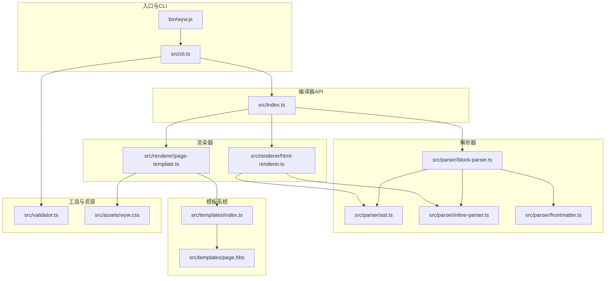
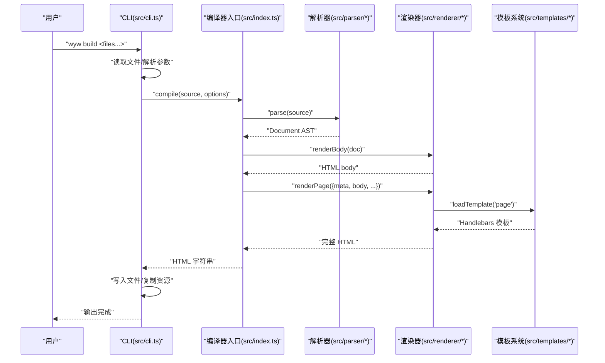
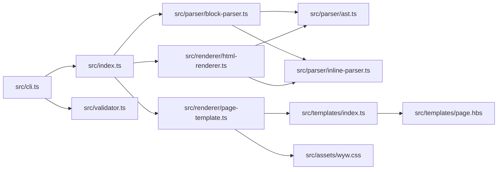

# 项目结构说明

<cite>
**本文档引用的文件**
- [src/index.ts](file://src/index.ts)
- [src/cli.ts](file://src/cli.ts)
- [src/parser/ast.ts](file://src/parser/ast.ts)
- [src/parser/block-parser.ts](file://src/parser/block-parser.ts)
- [src/parser/inline-parser.ts](file://src/parser/inline-parser.ts)
- [src/renderer/html-renderer.ts](file://src/renderer/html-renderer.ts)
- [src/renderer/page-template.ts](file://src/renderer/page-template.ts)
- [src/templates/index.ts](file://src/templates/index.ts)
- [src/templates/page.hbs](file://src/templates/page.hbs)
- [src/validator.ts](file://src/validator.ts)
- [src/assets/wyw.css](file://src/assets/wyw.css)
- [bin/wyw.js](file://bin/wyw.js)
- [package.json](file://package.json)
- [README.md](file://README.md)
</cite>

## 目录
1. [引言](#引言)
2. [项目结构](#项目结构)
3. [核心组件](#核心组件)
4. [架构总览](#架构总览)
5. [详细组件分析](#详细组件分析)
6. [依赖关系分析](#依赖关系分析)
7. [性能考虑](#性能考虑)
8. [故障排查指南](#故障排查指南)
9. [结论](#结论)
10. [附录](#附录)

## 引言
本项目是一个文言文标记语言编译器，目标是将 `.wyw` 源文件编译为排版精美的 HTML 页面，支持注音、注释、译文、诗词围栏等文言文阅读辅助功能。本文档面向开发者与维护者，系统梳理 src 目录下的模块职责、相互关系、数据流与接口设计原则，并提供新增模块的最佳实践与注意事项。

## 项目结构
项目采用“按职责分层”的模块化组织方式，核心目录与文件如下：
- bin/：命令行入口脚本，打包后作为可执行程序 wyw
- src/：源代码
  - assets/：静态资源（CSS、JS、图标）
  - parser/：解析器子系统（AST 定义、块级解析、内联解析、Frontmatter）
  - renderer/：渲染器子系统（HTML 渲染、页面模板）
  - templates/：Handlebars 模板加载器与模板文件
  - cli.ts：CLI 接口实现
  - index.ts：编译器公共 API 入口
  - validator.ts：格式验证器
- test/：测试用例
- examples/：示例 .wyw 文件
- docs/：文档与图片
- package.json：构建与依赖配置

图表来源
- [bin/wyw.js:1-7](file://bin/wyw.js#L1-L7)
- [src/cli.ts:1-182](file://src/cli.ts#L1-L182)
- [src/index.ts:1-57](file://src/index.ts#L1-L57)
- [src/parser/ast.ts:1-218](file://src/parser/ast.ts#L1-L218)
- [src/parser/block-parser.ts:1-371](file://src/parser/block-parser.ts#L1-L371)
- [src/parser/inline-parser.ts:1-99](file://src/parser/inline-parser.ts#L1-L99)
- [src/renderer/html-renderer.ts:1-251](file://src/renderer/html-renderer.ts#L1-L251)
- [src/renderer/page-template.ts:1-87](file://src/renderer/page-template.ts#L1-L87)
- [src/templates/index.ts:1-34](file://src/templates/index.ts#L1-L34)
- [src/templates/page.hbs:1-17](file://src/templates/page.hbs#L1-L17)
- [src/validator.ts:1-838](file://src/validator.ts#L1-L838)
- [src/assets/wyw.css:1-200](file://src/assets/wyw.css#L1-L200)

章节来源
- [README.md:110-125](file://README.md#L110-L125)
- [package.json:1-56](file://package.json#L1-L56)

## 核心组件
- 编译器入口（src/index.ts）：对外暴露 compile() 与 parse()/renderBody()/renderPage() 的导出，统一编译流程控制。
- CLI 接口（src/cli.ts）：命令行解析、文件读取、构建输出、监听与统计、调用编译器入口。
- 解析器（src/parser/）：AST 类型定义与工厂函数；块级解析（block-parser）；内联解析（inline-parser）；Frontmatter 解析。
- 渲染器（src/renderer/）：HTML 渲染（html-renderer）；页面模板（page-template）。
- 模板系统（src/templates/）：Handlebars 模板加载器与模板文件。
- 验证器（src/validator.ts）：格式验证与统计。
- 静态资源（src/assets/）：样式、脚本与图标。

章节来源
- [src/index.ts:1-57](file://src/index.ts#L1-L57)
- [src/cli.ts:1-182](file://src/cli.ts#L1-L182)
- [src/parser/ast.ts:1-218](file://src/parser/ast.ts#L1-L218)
- [src/parser/block-parser.ts:1-371](file://src/parser/block-parser.ts#L1-L371)
- [src/parser/inline-parser.ts:1-99](file://src/parser/inline-parser.ts#L1-L99)
- [src/renderer/html-renderer.ts:1-251](file://src/renderer/html-renderer.ts#L1-L251)
- [src/renderer/page-template.ts:1-87](file://src/renderer/page-template.ts#L1-L87)
- [src/templates/index.ts:1-34](file://src/templates/index.ts#L1-L34)
- [src/templates/page.hbs:1-17](file://src/templates/page.hbs#L1-L17)
- [src/validator.ts:1-838](file://src/validator.ts#L1-L838)
- [src/assets/wyw.css:1-200](file://src/assets/wyw.css#L1-L200)

## 架构总览
编译流程从 CLI 入手，调用编译器入口，依次完成解析与渲染，最后由模板系统生成完整 HTML 页面。验证器可独立运行，用于格式校验与统计。

图表来源
- [src/cli.ts:116-164](file://src/cli.ts#L116-L164)
- [src/index.ts:17-28](file://src/index.ts#L17-L28)
- [src/parser/block-parser.ts:43-49](file://src/parser/block-parser.ts#L43-L49)
- [src/renderer/html-renderer.ts:20-44](file://src/renderer/html-renderer.ts#L20-L44)
- [src/renderer/page-template.ts:25-68](file://src/renderer/page-template.ts#L25-L68)
- [src/templates/index.ts:18-30](file://src/templates/index.ts#L18-L30)

## 详细组件分析

### 编译器入口（src/index.ts）
- 职责
  - 统一编译入口：接收源文本与编译选项，串联解析与渲染。
  - 导出 API：parse、renderBody、renderPage 以及 AST 类型别名。
- 关键流程
  - parse(source)：调用块级解析器生成 Document AST。
  - renderBody(doc)：将 AST 渲染为 HTML body 片段。
  - renderPage(options)：包装完整 HTML 页面，注入 CSS/JS 与模板。
- 数据流
  - 输入：.wyw 源文本
  - 输出：HTML 字符串
- 接口设计原则
  - 选项驱动：inline、assetsPath、theme、showTranslation 控制渲染细节。
  - 明确的类型导出，便于上层使用。

章节来源
- [src/index.ts:7-28](file://src/index.ts#L7-L28)
- [src/index.ts:30-56](file://src/index.ts#L30-L56)

### CLI 接口（src/cli.ts）
- 职责
  - 命令定义与参数解析：build、init、validate。
  - 文件 I/O：读取、写入、复制资源、监听文件变化。
  - 统计信息：段落数、注释数、注音数。
- 关键流程
  - build 命令：读取文件 → 调用 compile → 写入 HTML → 复制静态资源。
  - validate 命令：读取文件 → 调用 validate → 格式化输出 → 退出码。
  - watch 模式：监听文件变更并自动重编译。
- 数据流
  - 输入：命令行参数、文件路径
  - 输出：控制台日志、HTML 文件、静态资源
- 接口设计原则
  - 命令清晰：子命令职责单一，参数明确。
  - 可扩展：通过 options 参数传递编译选项给编译器入口。

章节来源
- [src/cli.ts:28-114](file://src/cli.ts#L28-L114)
- [src/cli.ts:116-164](file://src/cli.ts#L116-L164)
- [src/cli.ts:166-182](file://src/cli.ts#L166-L182)

### 解析器子系统

#### AST 类型与工厂（src/parser/ast.ts）
- 职责
  - 定义 DocumentMeta、InlineNode、BlockNode、RawBlockNode 等类型。
  - 提供节点工厂函数，统一创建 AST 节点。
- 关键点
  - InlineNode：text、ruby、annotate、emphasis、ruby_annotate。
  - BlockNode：document、heading、paragraph_group、poetry_block、blockquote、section_break、proofread_date。
  - RawBlockNode：groupParagraphs 之前的中间节点类型集合。
- 设计原则
  - 类型明确、可扩展，便于渲染器与验证器使用。

章节来源
- [src/parser/ast.ts:5-118](file://src/parser/ast.ts#L5-L118)
- [src/parser/ast.ts:132-218](file://src/parser/ast.ts#L132-L218)

#### 块级解析（src/parser/block-parser.ts）
- 职责
  - 基于有限状态机解析文本行，生成原始块级节点（RawBlockNode）。
  - 将相邻 paragraph 与 translation 合并为 paragraph_group。
- 关键流程
  - parse(source)：解析 Frontmatter → parseBlocks → groupParagraphs → createDocument。
  - parseBlocks：IDLE/IN_PARAGRAPH/IN_TRANSLATION/IN_FENCED/IN_BLOCKQUOTE 状态机。
  - groupParagraphs：相邻段落与译文配对。
- 数据流
  - 输入：源文本（去除 Frontmatter 后）
  - 输出：RawBlockNode[] → BlockNode[]
- 设计原则
  - 状态机清晰、边界处理完善（空行、围栏块、译文、引用）。
  - 与内联解析配合，保证渲染一致性。

章节来源
- [src/parser/block-parser.ts:43-49](file://src/parser/block-parser.ts#L43-L49)
- [src/parser/block-parser.ts:72-341](file://src/parser/block-parser.ts#L72-L341)
- [src/parser/block-parser.ts:346-371](file://src/parser/block-parser.ts#L346-L371)

#### 内联解析（src/parser/inline-parser.ts）
- 职责
  - 从左到右扫描文本，按优先级匹配内联标记：ruby_annotate、ruby、annotate、emphasis。
- 关键流程
  - parseInline(text)：寻找最早匹配的正则，递归解析 emphasis 内容。
  - parseRubyBlocks：解析 ruby_annotate 内部的字块序列。
- 数据流
  - 输入：字符串片段
  - 输出：InlineNode[]（供渲染器使用）

章节来源
- [src/parser/inline-parser.ts:62-99](file://src/parser/inline-parser.ts#L62-L99)

#### Frontmatter 解析（src/parser/frontmatter.ts）
- 职责
  - 解析 YAML 风格的元数据区域，提取 title、author、dynasty 等字段。
- 设计原则
  - 与解析器入口 parse() 协作，确保元数据可用。

章节来源
- [src/parser/block-parser.ts:44-44](file://src/parser/block-parser.ts#L44-L44)

### 渲染器子系统

#### HTML 渲染（src/renderer/html-renderer.ts）
- 职责
  - 遍历 Document AST，生成 HTML body 片段。
  - 处理标题、段落组、诗词块、引用、分隔线、校对日期等。
- 关键流程
  - renderBody(doc)：决定是否渲染文档头部（当不存在带标题的诗词块时）。
  - renderBlock()：分派到具体渲染函数。
  - renderPoetryBlock()：按 heading 分段，verse 用 
 包裹。
  - renderInline()：处理 text、ruby、annotate、ruby_annotate、emphasis。
- 数据流
  - 输入：Document AST
  - 输出：HTML 字符串（body 片段）

章节来源
- [src/renderer/html-renderer.ts:20-44](file://src/renderer/html-renderer.ts#L20-L44)
- [src/renderer/html-renderer.ts:80-186](file://src/renderer/html-renderer.ts#L80-L186)
- [src/renderer/html-renderer.ts:195-233](file://src/renderer/html-renderer.ts#L195-L233)

#### 页面模板（src/renderer/page-template.ts）
- 职责
  - 生成完整 HTML 页面，包装 body 内容，注入 CSS/JS。
  - 支持内联与外链两种资源加载方式。
- 关键流程
  - renderPage(options)：根据 inline 选项读取资源或生成内联标签。
  - loadTemplate('page')：通过模板加载器加载 Handlebars 模板。
  - stripWywMarkup：从元数据中剥离标记，生成页面标题。
- 数据流
  - 输入：meta、body、inline、assetsPath、theme、showTranslation
  - 输出：HTML 字符串（完整页面）

章节来源
- [src/renderer/page-template.ts:25-68](file://src/renderer/page-template.ts#L25-L68)
- [src/renderer/page-template.ts:70-87](file://src/renderer/page-template.ts#L70-L87)

### 模板系统（src/templates/）
- 模板加载器（src/templates/index.ts）
  - 读取 .hbs 模板并缓存编译后的模板委托。
  - 暴露 Handlebars 实例，便于注册自定义 helper。
- 页面模板（src/templates/page.hbs）
  - 定义 HTML 结构，插入标题、CSS、body、JS。

章节来源
- [src/templates/index.ts:18-30](file://src/templates/index.ts#L18-L30)
- [src/templates/page.hbs:1-17](file://src/templates/page.hbs#L1-17)

### 验证器（src/validator.ts）
- 职责
  - 多维度格式校验：Frontmatter、括号匹配、内联语法、围栏块、译文配对、解析器深度校验。
  - 统计信息：段落组、诗词块、标题、注释、注音数量。
- 关键流程
  - validate(source, options)：顺序执行各规则，收集 errors/warnings/stats。
  - formatValidationResult(result)：格式化输出。
- 设计原则
  - strict 模式：将 warn 升级为 error，适合 CI/预提交。
  - 与解析器一致的优先级与匹配策略，确保校验与渲染一致。

章节来源
- [src/validator.ts:758-779](file://src/validator.ts#L758-L779)
- [src/validator.ts:794-838](file://src/validator.ts#L794-L838)

## 依赖关系分析

图表来源
- [src/cli.ts:13-15](file://src/cli.ts#L13-L15)
- [src/index.ts:3-5](file://src/index.ts#L3-L5)
- [src/parser/block-parser.ts:4-24](file://src/parser/block-parser.ts#L4-L24)
- [src/renderer/html-renderer.ts:4-15](file://src/renderer/html-renderer.ts#L4-L15)
- [src/renderer/page-template.ts:4-8](file://src/renderer/page-template.ts#L4-L8)
- [src/templates/index.ts:4-7](file://src/templates/index.ts#L4-L7)

章节来源
- [src/index.ts:3-5](file://src/index.ts#L3-L5)
- [src/cli.ts:13-15](file://src/cli.ts#L13-L15)

## 性能考虑
- 解析阶段
  - 块级解析采用状态机，时间复杂度 O(N)，空间复杂度 O(N)（N 为行数）。
  - 内联解析按优先级扫描，正则匹配次数受标记数量影响，建议避免过度嵌套。
- 渲染阶段
  - HTML 渲染为线性遍历，时间复杂度 O(M)，M 为节点总数。
  - 模板渲染使用 Handlebars，建议缓存模板以减少重复编译。
- I/O 与资源
  - CLI 复制静态资源时尽量批量操作，避免重复 I/O。
  - 内联模式会增加 HTML 体积，外链模式更利于缓存与增量更新。

## 故障排查指南
- 常见问题与定位
  - Frontmatter 未闭合：验证器会报告缺失结束标记；检查 `---` 是否成对。
  - 括号不匹配：验证器会报告多余闭括号、交叉嵌套或未闭合开括号；检查 `{}`、`[]`、`()`。
  - 注音/注释/注音+注释语法错误：验证器针对 ruby、annotate、ruby_annotate 分别校验，关注 base/pinyin/text/note 等字段。
  - 诗词围栏块未闭合：检查 `:::poetry` 起止配对与 `::` 元信息。
  - 译文配对：确认 `>>` 前存在原文段落。
  - 解析器深度校验失败：通常由前述问题导致；先修复错误再尝试编译。
- 建议步骤
  - 使用 validate 命令先行检查，修复 errors，再进行编译。
  - 在 CI 中启用 strict 模式，确保质量门槛。
  - 对大型文档分段编写与逐步验证，降低一次性校验成本。

章节来源
- [src/validator.ts:104-179](file://src/validator.ts#L104-L179)
- [src/validator.ts:182-259](file://src/validator.ts#L182-L259)
- [src/validator.ts:262-548](file://src/validator.ts#L262-L548)
- [src/validator.ts:551-610](file://src/validator.ts#L551-L610)
- [src/validator.ts:613-675](file://src/validator.ts#L613-L675)
- [src/validator.ts:678-739](file://src/validator.ts#L678-L739)

## 结论
本项目以清晰的模块划分与稳定的接口设计实现了从 .wyw 到 HTML 的完整编译链路。解析器与渲染器遵循一致的优先级与结构，验证器贯穿全流程保障质量。CLI 提供便捷的开发与生产工作流。后续新增模块应遵循现有接口风格与数据流约定，确保整体一致性与可维护性。

## 附录

### 模块间通信机制与接口设计原则
- 统一的数据结构：AST 类型在解析与渲染之间共享，保证类型安全与契约稳定。
- 选项驱动：编译器入口通过 options 控制渲染细节，CLI 通过命令行参数转换为 options。
- 模块边界：解析器负责结构化，渲染器负责表现，模板系统负责页面包装，职责清晰。
- 可扩展性：模板加载器与验证器均支持扩展（模板 helper、校验规则），便于功能增强。

### 新模块添加的最佳实践与注意事项
- 设计原则
  - 单一职责：新模块聚焦特定领域（如新的块类型、新的渲染目标）。
  - 明确接口：输入输出参数清晰，必要时提供类型定义与工厂函数。
  - 与现有模块协作：遵循 AST/选项/模板/资源的既有约定。
- 数据流
  - 解析阶段：若需要新的块/内联语法，优先在解析器中扩展 AST 与解析逻辑。
  - 渲染阶段：新增渲染函数，保持与现有渲染器一致的 HTML 结构与类名。
  - 模板阶段：通过模板加载器注册新模板或扩展现有模板。
- 资源与构建
  - 静态资源：放置于 assets 目录，CLI/模板系统按需加载。
  - 构建：遵循 package.json 的构建脚本，确保 dist 产物包含新模块与资源。
- 测试与验证
  - 为新模块编写单元测试与集成测试。
  - 使用验证器进行回归测试，确保语法与渲染一致性。