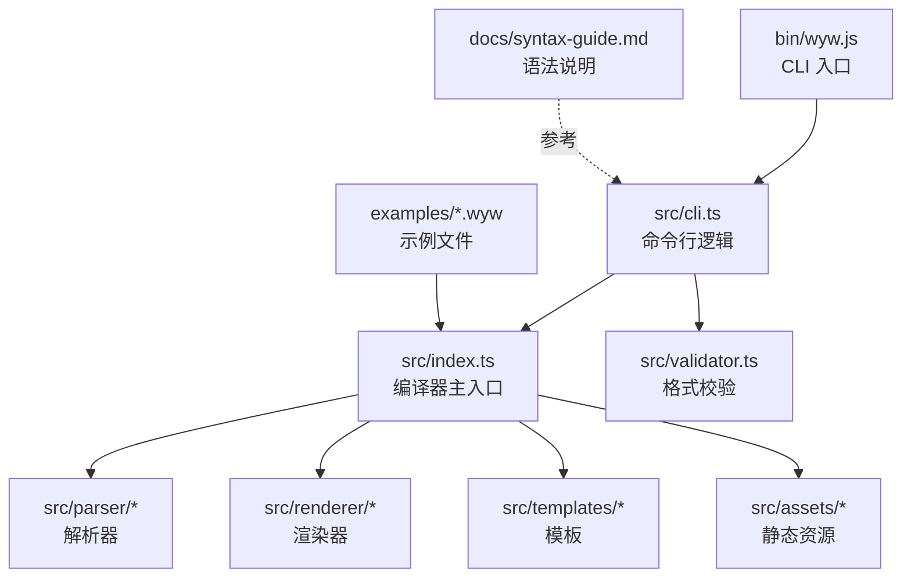
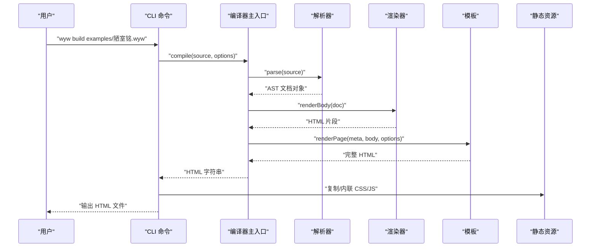
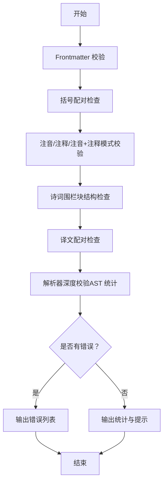
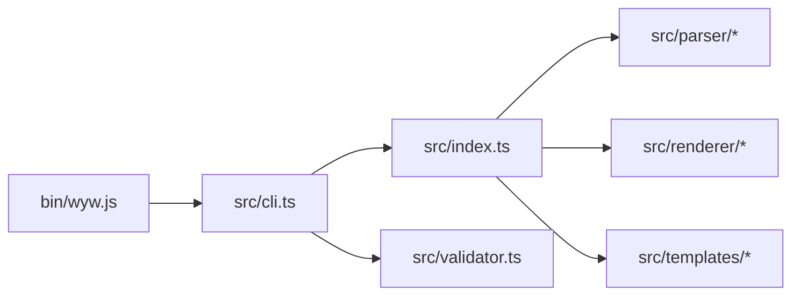

# 快速开始

<cite>
**本文引用的文件**
- [README.md](file://README.md)
- [package.json](file://package.json)
- [tsconfig.json](file://tsconfig.json)
- [bin/wyw.js](file://bin/wyw.js)
- [src/cli.ts](file://src/cli.ts)
- [src/index.ts](file://src/index.ts)
- [src/validator.ts](file://src/validator.ts)
- [docs/syntax-guide.md](file://docs/syntax-guide.md)
- [examples/刘禹锡_陋室铭.wyw](file://examples/刘禹锡_陋室铭.wyw)
</cite>

## 目录
1. [简介](#简介)
2. [项目结构](#项目结构)
3. [核心组件](#核心组件)
4. [架构总览](#架构总览)
5. [详细组件分析](#详细组件分析)
6. [依赖关系分析](#依赖关系分析)
7. [性能与可用性建议](#性能与可用性建议)
8. [故障排除指南](#故障排除指南)
9. [结语](#结语)
10. [附录](#附录)

## 简介
本指南面向文言文学习者与开发者，帮助你快速安装、配置并使用文言文标记语言编译器，从创建第一个 .wyw 文件开始，到编译生成精美的 HTML 页面，涵盖常用命令行选项与常见问题排查。编译器支持注音、注释、译文对照、诗词围栏、主题与字号切换等功能，适合教学、阅读与分享文言文作品。

## 项目结构
该仓库采用“CLI 入口 + TypeScript 源码 + 模板与静态资源”的组织方式，主要目录与职责如下：
- bin：命令行入口脚本，提供可执行命令
- src：TypeScript 源码，包含 CLI、编译器主入口、解析器、渲染器、模板与校验器
- docs：文档与语法说明
- examples：示例 .wyw 文件
- test：单元测试
- dist：构建产物（由 TypeScript 编译生成）

图表来源
- [bin/wyw.js:1-7](file://bin/wyw.js#L1-L7)
- [src/cli.ts:28-114](file://src/cli.ts#L28-L114)
- [src/index.ts:17-28](file://src/index.ts#L17-L28)

章节来源
- [README.md:110-125](file://README.md#L110-L125)

## 核心组件
- CLI 命令与选项
  - build：编译 .wyw 文件为 HTML，支持输出目录、内联资源、监听重编译、主题与译文显示控制等选项
  - init：生成模板 .wyw 文件
  - validate：校验 .wyw 文件格式
- 编译主入口
  - 接收源文本与编译选项，调用解析器与渲染器生成完整 HTML
- 校验器
  - 多维度校验：Frontmatter、括号配对、注音/注释/注音+注释模式、诗词围栏、译文配对、解析器深度校验
- 示例与语法参考
  - examples 下提供示例 .wyw 文件
  - docs/syntax-guide.md 提供完整语法说明

章节来源
- [src/cli.ts:28-114](file://src/cli.ts#L28-L114)
- [src/index.ts:17-28](file://src/index.ts#L17-L28)
- [src/validator.ts:742-762](file://src/validator.ts#L742-L762)
- [examples/刘禹锡_陋室铭.wyw:1-22](file://examples/刘禹锡_陋室铭.wyw#L1-L22)
- [docs/syntax-guide.md:1-250](file://docs/syntax-guide.md#L1-L250)

## 架构总览
下面的序列图展示了从命令行到最终 HTML 输出的完整流程。

图表来源
- [src/cli.ts:116-164](file://src/cli.ts#L116-L164)
- [src/index.ts:17-28](file://src/index.ts#L17-L28)

## 详细组件分析

### 安装与环境准备
- Node.js 版本要求
  - 项目使用 ES2022 语法与 NodeNext 模块系统，建议使用较新的 LTS 版本（如 18.x 或 20.x），以获得最佳兼容性
- 安装步骤
  - 全局安装（推荐）：npm install -g
  - 本地安装：npm install
  - 构建产物：npm run build
- 验证安装
  - 查看版本：wyw --version
  - 查看帮助：wyw --help
  - 使用 npx（无需全局安装）：npx wyw --help

章节来源
- [README.md:29-33](file://README.md#L29-L33)
- [README.md:35-48](file://README.md#L35-L48)
- [package.json:14-17](file://package.json#L14-L17)
- [tsconfig.json:2-15](file://tsconfig.json#L2-L15)

### 基本使用流程
- 创建第一个 .wyw 文件
  - 使用 init 命令生成模板：wyw init
  - 或参考 examples/陋室铭.wyw 的结构与语法
- 编译为 HTML
  - 单文件编译：wyw build examples/陋室铭.wyw
  - 指定输出目录：wyw build examples/*.wyw -o examples/dist/
  - 监听模式：wyw build examples/陋室铭.wyw -w
  - 内联资源：wyw build examples/陋室铭.wyw --inline
- 预览与分享
  - 在浏览器中打开生成的 HTML 文件
  - 可根据需要调整主题与字号

章节来源
- [README.md:80-88](file://README.md#L80-L88)
- [README.md:35-48](file://README.md#L35-L48)
- [examples/刘禹锡_陋室铭.wyw:1-22](file://examples/刘禹锡_陋室铭.wyw#L1-L22)

### 命令行选项详解
- build 子命令
  - -o, --output <dir>：指定输出目录
  - --inline：将 CSS/JS 内联到 HTML 中
  - -w, --watch：监听文件变化并自动重编译
  - --theme <mode>：默认主题（auto/light/dark）
  - --show-translation：默认显示译文（默认开启）
  - --no-show-translation：默认隐藏译文
- init 子命令
  - 生成 template.wyw 模板文件
- validate 子命令
  - 验证 .wyw 文件格式，支持 --strict 将提示升级为错误

章节来源
- [src/cli.ts:33-56](file://src/cli.ts#L33-L56)
- [src/cli.ts:58-89](file://src/cli.ts#L58-L89)
- [src/cli.ts:91-111](file://src/cli.ts#L91-L111)
- [README.md:50-60](file://README.md#L50-L60)

### 语法与示例参考
- Frontmatter：title、author、dynasty
- 标题、段落、译文（>>）、引用（>）、分隔线（---）、校对日期（--YYYY年M月D日--）
- 诗词围栏（::: poetry ... :::）
- 注音（{字|拼音}）、注释（[词](释义)）、注音+注释组合
- 着重（*文本*）

章节来源
- [docs/syntax-guide.md:15-121](file://docs/syntax-guide.md#L15-L121)
- [docs/syntax-guide.md:124-190](file://docs/syntax-guide.md#L124-L190)
- [docs/syntax-guide.md:193-221](file://docs/syntax-guide.md#L193-L221)

### 校验器工作流
校验器按顺序执行多项规则，若解析失败则返回错误。其流程如下：

图表来源
- [src/validator.ts:742-762](file://src/validator.ts#L742-L762)
- [src/validator.ts:116-179](file://src/validator.ts#L116-L179)
- [src/validator.ts:200-259](file://src/validator.ts#L200-L259)
- [src/validator.ts:462-548](file://src/validator.ts#L462-L548)
- [src/validator.ts:565-610](file://src/validator.ts#L565-L610)
- [src/validator.ts:634-675](file://src/validator.ts#L634-L675)
- [src/validator.ts:697-739](file://src/validator.ts#L697-L739)

## 依赖关系分析
- CLI 入口
  - bin/wyw.js 导入 dist/cli.js 并创建 CLI 程序
- CLI 与编译器
  - src/cli.ts 调用 src/index.ts 的 compile 方法
- 编译器与解析/渲染
  - src/index.ts 调用解析器与渲染器，结合模板生成 HTML
- 校验器
  - src/validator.ts 与解析器配合，提供格式校验能力

图表来源
- [bin/wyw.js:3-6](file://bin/wyw.js#L3-L6)
- [src/cli.ts:13-15](file://src/cli.ts#L13-L15)
- [src/index.ts:3-5](file://src/index.ts#L3-L5)

章节来源
- [bin/wyw.js:1-7](file://bin/wyw.js#L1-L7)
- [src/cli.ts:28-114](file://src/cli.ts#L28-L114)
- [src/index.ts:17-28](file://src/index.ts#L17-L28)

## 性能与可用性建议
- 资源内联
  - 使用 --inline 可减少请求次数，适合单页发布或离线场景
- 监听模式
  - 使用 -w 可在开发时实时预览修改效果
- 主题与字号
  - 通过 --theme 与字号按钮实现个性化阅读体验
- 输出目录
  - 使用 -o 指定输出目录，便于批量编译与部署

章节来源
- [README.md:50-60](file://README.md#L50-L60)
- [src/cli.ts:37-42](file://src/cli.ts#L37-L42)
- [src/assets/wyw.js:99-127](file://src/assets/wyw.js#L99-L127)

## 故障排除指南
- 安装相关
  - 若全局安装失败，请尝试使用 npm install -g 或检查权限
  - 若 npx 无法找到 wyw，请确认 PATH 或使用本地安装
- 命令行错误
  - 使用 --help 查看可用命令与选项
  - 使用 validate 子命令检查 .wyw 文件格式，必要时使用 --strict
- 常见问题
  - Frontmatter 未闭合：确保首尾均使用 --- 包裹
  - 注音/注释语法错误：检查 {字|拼音} 与 [文本](释义) 的配对
  - 诗词围栏块未闭合：确保 ::: 与 ::: 成对出现
  - 译文未与原文配对：确保每段译文（>>）紧随对应原文段落后
- 构建与输出
  - 使用 -o 指定输出目录，避免覆盖源文件
  - 使用 --inline 将资源内联，减少外部依赖

章节来源
- [src/cli.ts:91-111](file://src/cli.ts#L91-L111)
- [src/validator.ts:116-179](file://src/validator.ts#L116-L179)
- [src/validator.ts:200-259](file://src/validator.ts#L200-L259)
- [src/validator.ts:462-548](file://src/validator.ts#L462-L548)
- [src/validator.ts:565-610](file://src/validator.ts#L565-L610)
- [src/validator.ts:634-675](file://src/validator.ts#L634-L675)

## 结语
通过本快速开始指南，你可以完成安装、创建第一个 .wyw 文件并成功编译为 HTML 页面。建议先从 init 生成模板，再参考 examples 与 docs/syntax-guide.md 学习语法，最后使用 validate 与 --strict 保证质量。遇到问题时，优先使用 validate 与 --help 定位原因。

## 附录
- 常用命令速查
  - 初始化模板：wyw init
  - 编译单文件：wyw build examples/陋室铭.wyw
  - 批量编译：wyw build examples/*.wyw -o examples/dist/
  - 监听模式：wyw build examples/陋室铭.wyw -w
  - 校验文件：wyw validate examples/陋室铭.wyw
  - 校验文件（严格模式）：wyw validate examples/陋室铭.wyw --strict

章节来源
- [README.md:80-88](file://README.md#L80-L88)
- [README.md:35-48](file://README.md#L35-L48)
- [README.md:50-60](file://README.md#L50-L60)