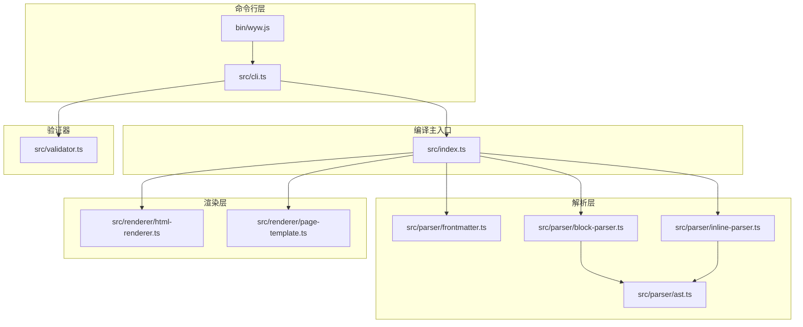
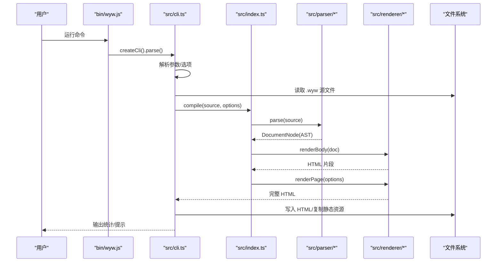
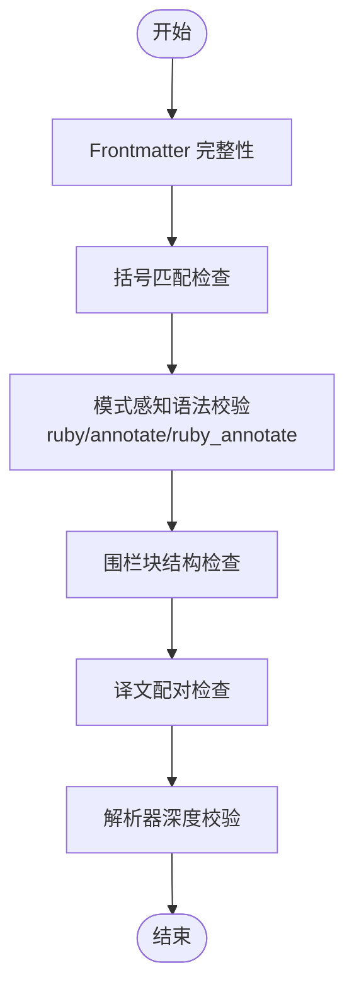
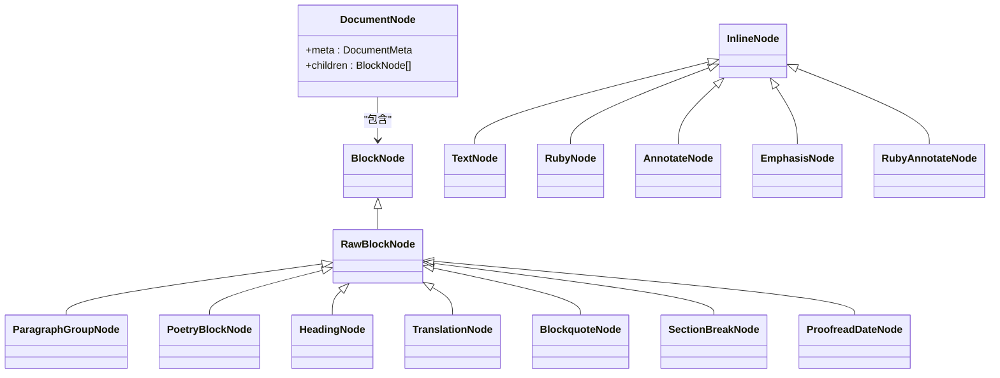
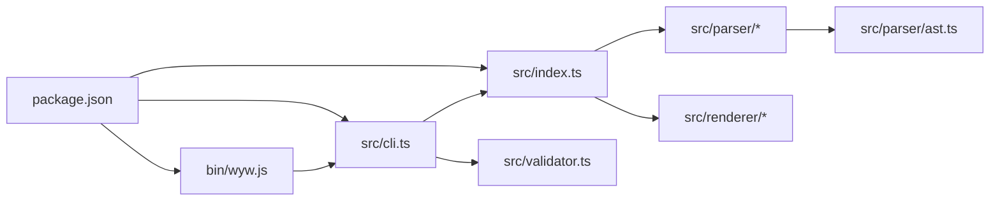

# 故障排除

<cite>
**本文引用的文件**
- [README.md](file://README.md)
- [package.json](file://package.json)
- [bin/wyw.js](file://bin/wyw.js)
- [src/index.ts](file://src/index.ts)
- [src/cli.ts](file://src/cli.ts)
- [src/validator.ts](file://src/validator.ts)
- [src/parser/ast.ts](file://src/parser/ast.ts)
- [src/parser/block-parser.ts](file://src/parser/block-parser.ts)
- [src/parser/inline-parser.ts](file://src/parser/inline-parser.ts)
- [src/parser/frontmatter.ts](file://src/parser/frontmatter.ts)
- [src/renderer/html-renderer.ts](file://src/renderer/html-renderer.ts)
- [src/renderer/page-template.ts](file://src/renderer/page-template.ts)
- [test/validator.test.ts](file://test/validator.test.ts)
- [test/parser.test.ts](file://test/parser.test.ts)
- [test/compile.test.ts](file://test/compile.test.ts)
- [examples/刘禹锡_陋室铭.wyw](file://examples/刘禹锡_陋室铭.wyw)
</cite>

## 目录
1. [简介](#简介)
2. [项目结构](#项目结构)
3. [核心组件](#核心组件)
4. [架构总览](#架构总览)
5. [详细组件分析](#详细组件分析)
6. [依赖关系分析](#依赖关系分析)
7. [性能考量](#性能考量)
8. [故障排除指南](#故障排除指南)
9. [结论](#结论)
10. [附录](#附录)

## 简介
本指南面向文言文编译器的使用者与维护者，聚焦“如何快速定位并解决编译过程中的常见问题”。内容覆盖语法错误、编译失败、输出异常、调试技巧、日志分析、验证器使用、性能排查与优化建议，并提供基于仓库实际测试与用户反馈的实用方案。

## 项目结构
该编译器采用模块化设计，CLI 负责命令行交互与文件系统操作，编译主入口负责解析与渲染，验证器提供多维度格式校验，解析器与渲染器分别承担 AST 构建与 HTML 输出。

图表来源
- [bin/wyw.js:1-7](file://bin/wyw.js#L1-L7)
- [src/cli.ts:1-182](file://src/cli.ts#L1-L182)
- [src/index.ts:1-57](file://src/index.ts#L1-L57)
- [src/parser/block-parser.ts:1-371](file://src/parser/block-parser.ts#L1-L371)
- [src/parser/inline-parser.ts](file://src/parser/inline-parser.ts)
- [src/parser/frontmatter.ts](file://src/parser/frontmatter.ts)
- [src/parser/ast.ts:1-218](file://src/parser/ast.ts#L1-L218)
- [src/renderer/html-renderer.ts](file://src/renderer/html-renderer.ts)
- [src/renderer/page-template.ts](file://src/renderer/page-template.ts)
- [src/validator.ts:1-838](file://src/validator.ts#L1-L838)

章节来源
- [README.md:110-125](file://README.md#L110-L125)
- [package.json:14-17](file://package.json#L14-L17)

## 核心组件
- 命令行入口与构建流程：CLI 提供 build/init/validate 子命令，支持监听、内联资源、主题与译文显示控制。
- 编译主入口：将源文本解析为 AST，再渲染为完整 HTML。
- 解析器：分块解析与内联解析，支持标题、段落、译文、围栏块、引用、分隔线、校对日期等。
- 验证器：多规则校验（Frontmatter、括号、注音/注释/组合、围栏块、译文配对、解析器深度校验）。
- 渲染器：HTML 渲染与页面模板组装，支持内联/外链资源。

章节来源
- [src/cli.ts:28-182](file://src/cli.ts#L28-L182)
- [src/index.ts:14-28](file://src/index.ts#L14-L28)
- [src/validator.ts:758-779](file://src/validator.ts#L758-L779)
- [src/parser/block-parser.ts:43-49](file://src/parser/block-parser.ts#L43-L49)

## 架构总览
编译流程从 CLI 开始，读取文件，调用编译主入口，解析器生成 AST，渲染器生成 HTML，最后写入文件或输出到 stdout。验证器贯穿开发与 CI 场景，提供严格/宽松两种模式。

图表来源
- [bin/wyw.js:1-7](file://bin/wyw.js#L1-L7)
- [src/cli.ts:116-164](file://src/cli.ts#L116-L164)
- [src/index.ts:17-28](file://src/index.ts#L17-L28)
- [src/parser/block-parser.ts:43-49](file://src/parser/block-parser.ts#L43-L49)
- [src/renderer/html-renderer.ts](file://src/renderer/html-renderer.ts)
- [src/renderer/page-template.ts](file://src/renderer/page-template.ts)

## 详细组件分析

### 验证器（Validator）与校验规则
验证器提供严格/宽松两种模式，按顺序执行多项规则，涵盖 Frontmatter、括号平衡、注音/注释/组合、围栏块、译文配对与解析器深度校验，并输出格式化结果。

图表来源
- [src/validator.ts:758-779](file://src/validator.ts#L758-L779)
- [src/validator.ts:116-179](file://src/validator.ts#L116-L179)
- [src/validator.ts:200-259](file://src/validator.ts#L200-L259)
- [src/validator.ts:462-548](file://src/validator.ts#L462-L548)
- [src/validator.ts:565-610](file://src/validator.ts#L565-L610)
- [src/validator.ts:634-675](file://src/validator.ts#L634-L675)
- [src/validator.ts:697-739](file://src/validator.ts#L697-L739)

章节来源
- [src/validator.ts:61-101](file://src/validator.ts#L61-L101)
- [src/validator.ts:758-779](file://src/validator.ts#L758-L779)
- [test/validator.test.ts:1-425](file://test/validator.test.ts#L1-L425)

### 解析器（Block/Inline/Frontmatter/AST）
- 块级解析器：基于有限状态机，识别标题、段落、译文、围栏块、引用、分隔线、校对日期等，生成原始块节点，再合并为段落组。
- 内联解析器：解析注音、注释、着重等内联标记，生成内联节点。
- Frontmatter 解析：提取元数据，支持缺失/未闭合场景。
- AST：定义文档、块、内联节点类型与工厂函数。

图表来源
- [src/parser/ast.ts:55-118](file://src/parser/ast.ts#L55-L118)
- [src/parser/ast.ts:132-218](file://src/parser/ast.ts#L132-L218)

章节来源
- [src/parser/block-parser.ts:72-371](file://src/parser/block-parser.ts#L72-L371)
- [src/parser/inline-parser.ts](file://src/parser/inline-parser.ts)
- [src/parser/frontmatter.ts](file://src/parser/frontmatter.ts)
- [src/parser/ast.ts:1-218](file://src/parser/ast.ts#L1-L218)

### 渲染器（HTML 渲染与页面模板）
- HTML 渲染器：将 AST 转换为 HTML 片段。
- 页面模板：整合元数据、主体内容与资源（内联/外链）生成完整 HTML。

章节来源
- [src/renderer/html-renderer.ts](file://src/renderer/html-renderer.ts)
- [src/renderer/page-template.ts](file://src/renderer/page-template.ts)

### CLI 与构建流程
- build：读取文件、编译、写入 HTML、复制静态资源、统计信息。
- init：生成模板文件。
- validate：读取文件、调用验证器、格式化输出并按错误数退出。

章节来源
- [src/cli.ts:28-182](file://src/cli.ts#L28-L182)
- [bin/wyw.js:1-7](file://bin/wyw.js#L1-L7)

## 依赖关系分析
- CLI 依赖编译主入口与验证器。
- 编译主入口依赖解析器与渲染器。
- 解析器依赖 AST 与内联解析器。
- package.json 定义了命令导出与脚本。

图表来源
- [bin/wyw.js:1-7](file://bin/wyw.js#L1-L7)
- [src/cli.ts:13-15](file://src/cli.ts#L13-L15)
- [src/index.ts:3-5](file://src/index.ts#L3-L5)
- [src/parser/block-parser.ts:4-24](file://src/parser/block-parser.ts#L4-L24)
- [package.json:14-17](file://package.json#L14-L17)

章节来源
- [package.json:14-17](file://package.json#L14-L17)

## 性能考量
- 解析器深度校验：验证器在最后阶段调用解析器生成 AST 并统计结构元素，若源文件过大或嵌套复杂，可能导致校验耗时增加。建议：
  - 控制围栏块与段落数量，避免超长连续文本。
  - 合理使用注释与注音，减少极长组合标记。
  - 在 CI 中使用严格模式时，尽量缩短源文件规模或拆分。
- 资源内联：内联 CSS/JS 会增大 HTML 体积，适合小文档；外链更利于缓存与加载，适合大型站点。
- 监听编译：watch 模式频繁读取与写入，建议在大型项目中谨慎使用，或限制监听文件范围。

[本节为通用性能建议，无需特定文件来源]

## 故障排除指南

### 一、语法错误与格式问题
- 常见症状
  - Frontmatter 未闭合、字段缺失或存在未知字段。
  - 括号不匹配（大括号、方括号、圆括号交叉嵌套或多余闭合）。
  - 注音/注释/注音+注释格式不规范（多字注音、拼音含数字、拼音含非法字符）。
  - 诗词围栏块未闭合或元信息为空。
  - 译文前缺少对应原文段落。
- 诊断步骤
  - 使用验证器命令进行格式检查：[命令用法参考:90-108](file://README.md#L90-L108)。
  - 使用严格模式（--strict）在 CI 中强制修复问题。
  - 查看格式化输出中的行号与问题描述，定位具体位置。
- 修复建议
  - 补齐 Frontmatter 三段线与必填字段，删除未知字段。
  - 修正括号嵌套顺序，确保成对闭合。
  - 将多字注音拆分为单字注音；拼音使用 Unicode 声调符号，避免数字与大括号。
  - 围栏块必须以 ":::" 结束；元信息行不可为空。
  - 保证每段译文前有对应的原文段落。
- 参考测试用例
  - Frontmatter 缺失/未闭合/未知字段：[测试用例:29-84](file://test/validator.test.ts#L29-L84)
  - 括号交叉/多余闭合/未闭合：[测试用例:87-130](file://test/validator.test.ts#L87-L130)
  - 注音格式（多字/数字/非法字符）：[测试用例:133-163](file://test/validator.test.ts#L133-L163)
  - 注释格式（空释义/误匹配）：[测试用例:166-190](file://test/validator.test.ts#L166-L190)
  - 注音+注释组合（多字/拼音数字/无有效块/释义为空）：[测试用例:193-242](file://test/validator.test.ts#L193-L242)
  - 围栏块未闭合/类型提示/元信息为空：[测试用例:245-292](file://test/validator.test.ts#L245-L292)
  - 译文配对（孤立译文）：[测试用例:295-320](file://test/validator.test.ts#L295-L320)

章节来源
- [src/validator.ts:116-179](file://src/validator.ts#L116-L179)
- [src/validator.ts:200-259](file://src/validator.ts#L200-L259)
- [src/validator.ts:462-548](file://src/validator.ts#L462-L548)
- [src/validator.ts:565-610](file://src/validator.ts#L565-L610)
- [src/validator.ts:634-675](file://src/validator.ts#L634-L675)
- [test/validator.test.ts:1-425](file://test/validator.test.ts#L1-L425)

### 二、编译失败与输出异常
- 常见症状
  - 编译时报错或输出不完整 HTML。
  - 生成的 HTML 缺少样式或脚本（非内联模式）。
  - 译文未正确渲染或注音/注释显示异常。
- 诊断步骤
  - 使用 CLI 的 build 子命令，观察统计信息与错误输出。
  - 检查输出目录是否存在，确认静态资源复制是否成功。
  - 对比示例文件，核对语法与结构是否一致。
- 修复建议
  - 确保 Frontmatter 正确闭合，避免解析器崩溃。
  - 非内联模式下，确认输出目录存在并具备写权限。
  - 检查注音/注释/组合标记的嵌套与闭合，避免解析歧义。
  - 使用示例文件作为基准进行对比：[示例文件:1-22](file://examples/刘禹锡_陋室铭.wyw#L1-L22)。
- 参考测试用例
  - 编译输出完整性与内联资源：[测试用例:24-94](file://test/compile.test.ts#L24-L94)
  - 诗词围栏块渲染与元信息：[测试用例:96-155](file://test/compile.test.ts#L96-L155)
  - 校对日期渲染：[测试用例:157-209](file://test/compile.test.ts#L157-L209)

章节来源
- [src/cli.ts:116-164](file://src/cli.ts#L116-L164)
- [src/index.ts:17-28](file://src/index.ts#L17-L28)
- [test/compile.test.ts:1-210](file://test/compile.test.ts#L1-L210)
- [examples/刘禹锡_陋室铭.wyw:1-22](file://examples/刘禹锡_陋室铭.wyw#L1-L22)

### 三、调试技巧与日志分析
- 使用验证器命令
  - 基本用法：[命令参考:90-108](file://README.md#L90-L108)
  - 严格模式：--strict 将提示升级为错误，便于 CI 强制约束。
  - 输出格式：格式化结果包含文件路径、错误/提示数量、按行号排序的问题列表与统计信息。
- CLI 统计信息
  - build 子命令会在成功编译后输出段落数、注释数、注音数，便于快速核对。
- 参考实现
  - 验证器与格式化输出：[实现:758-800](file://src/validator.ts#L758-800)
  - CLI 统计收集：[实现](file://src/cli.ts:166-182)

章节来源
- [src/validator.ts:794-800](file://src/validator.ts#L794-L800)
- [src/cli.ts:156-164](file://src/cli.ts#L156-L164)

### 四、使用验证器进行语法检查
- 命令行使用
  - 验证单个文件：[命令参考:90-108](file://README.md#L90-L108)
  - 严格模式：--strict
  - 退出码：存在错误时返回非零，便于自动化集成。
- 编程接口
  - validate(source, options)：返回包含 errors/warnings/stats 的结果。
  - formatValidationResult(result)：格式化输出。
- 参考测试
  - 验证器类行为与严格模式：[测试用例:9-26](file://test/validator.test.ts#L9-L26)
  - 格式化输出行为：[测试用例:361-412](file://test/validator.test.ts#L361-L412)

章节来源
- [src/cli.ts:91-112](file://src/cli.ts#L91-L112)
- [src/validator.ts:758-779](file://src/validator.ts#L758-L779)
- [src/validator.ts:794-800](file://src/validator.ts#L794-L800)
- [test/validator.test.ts:1-425](file://test/validator.test.ts#L1-L425)

### 五、性能问题排查与优化建议
- 排查要点
  - 验证器深度校验：若源文件过大，解析器校验耗时上升，建议拆分或简化结构。
  - 围栏块与段落数量：过多的 ::: poetry 块或超长连续文本会影响解析时间。
  - 注释与注音密度：大量注音+注释组合会增加解析复杂度。
- 优化建议
  - 在 CI 中使用严格模式，提前暴露问题，减少后期修复成本。
  - 对大型文档采用外链资源模式，降低 HTML 体积。
  - 使用 watch 模式时，限定监听文件范围，避免频繁 I/O。
- 参考实现
  - 深度校验与统计：[实现:697-739](file://src/validator.ts#L697-739)
  - CLI 资源复制与内联策略：[实现](file://src/cli.ts:138-153)

章节来源
- [src/validator.ts:697-739](file://src/validator.ts#L697-L739)
- [src/cli.ts:138-153](file://src/cli.ts#L138-L153)

### 六、常见问题速查表
- 问题类型：Frontmatter 未闭合
  - 症状：解析器崩溃或统计缺失
  - 修复：补齐三段线，确保闭合
  - 参考：[测试用例:49-55](file://test/validator.test.ts#L49-L55)
- 问题类型：括号交叉嵌套
  - 症状：报错提示交叉嵌套
  - 修复：调整嵌套顺序，确保成对闭合
  - 参考：[测试用例:103-109](file://test/validator.test.ts#L103-L109)
- 问题类型：注音多字
  - 症状：提示或多字在严格模式下报错
  - 修复：拆分为单字注音
  - 参考：[测试用例:134-142](file://test/validator.test.ts#L134-L142)
- 问题类型：注音拼音含数字
  - 症状：提示建议使用 Unicode 声调符号
  - 修复：改用带调符号的拼音
  - 参考：[测试用例:144-147](file://test/validator.test.ts#L144-L147)
- 问题类型：围栏块未闭合
  - 症状：报错提示未闭合
  - 修复：补全 ":::"
  - 参考：[测试用例:247-255](file://test/validator.test.ts#L247-L255)
- 问题类型：译文前缺原文
  - 症状：提示译文前缺少对应原文
  - 修复：在译文前添加原文段落
  - 参考：[测试用例:296-308](file://test/validator.test.ts#L296-L308)

章节来源
- [test/validator.test.ts:1-425](file://test/validator.test.ts#L1-L425)

## 结论
通过结合验证器的多规则校验、CLI 的统计输出与测试用例的参考，用户可以高效定位并修复文言文编译中的语法与结构问题。在大型项目中，建议配合严格模式与资源外链策略，以获得更好的稳定性与性能表现。

## 附录
- 命令行使用与选项参考：[README:35-77](file://README.md#L35-L77)
- 项目结构概览：[README:110-125](file://README.md#L110-L125)
- 示例文件：[示例:1-22](file://examples/刘禹锡_陋室铭.wyw#L1-L22)