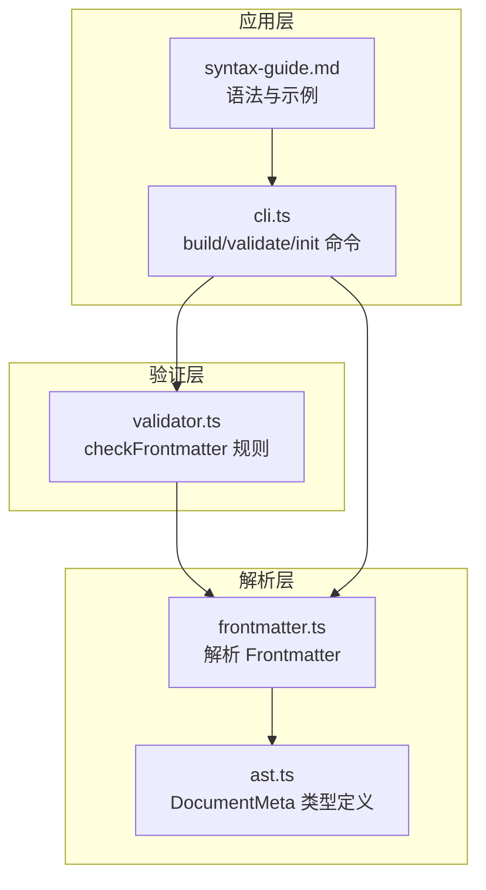
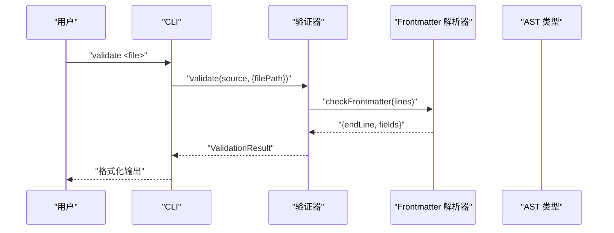
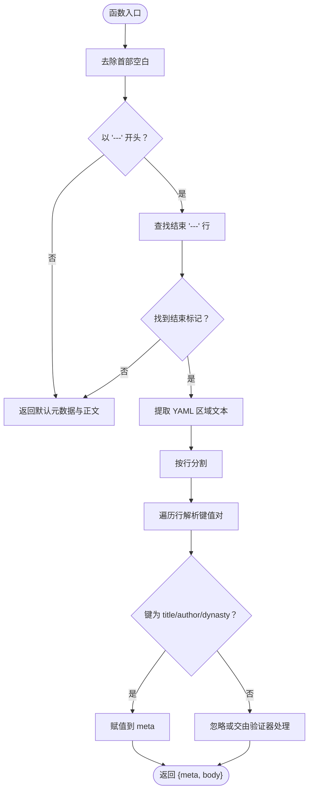
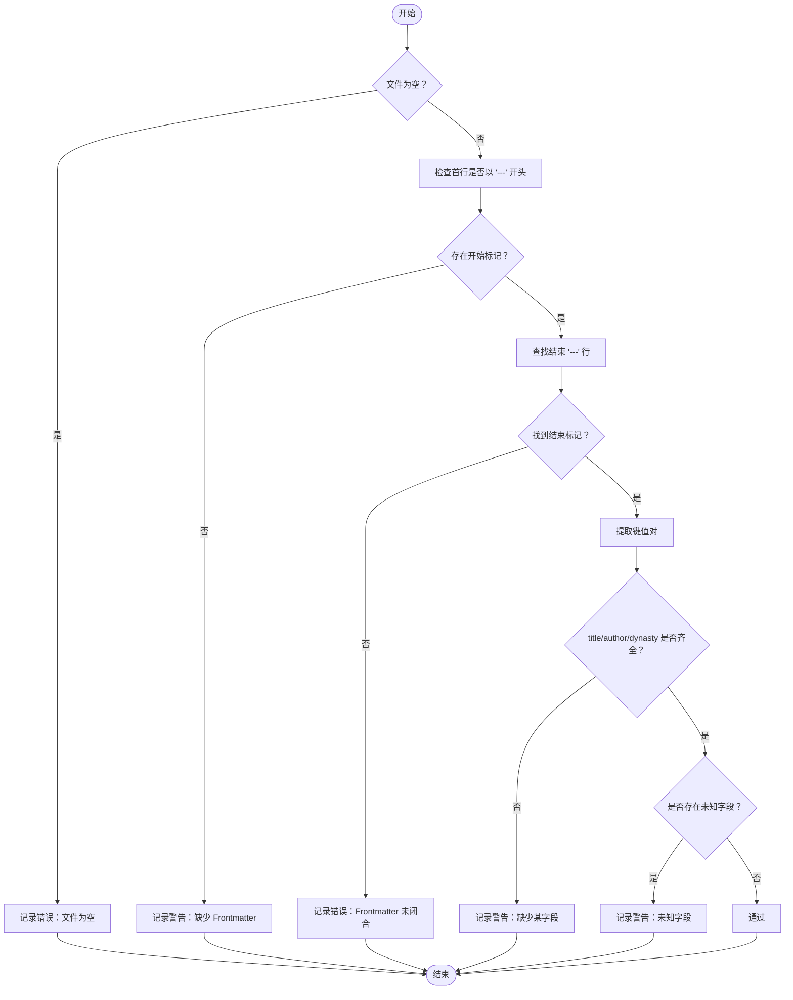
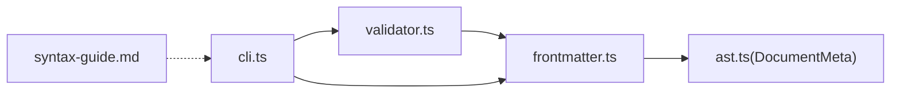

# Frontmatter 元数据

<cite>
**本文引用的文件**
- [src/parser/frontmatter.ts](file://src/parser/frontmatter.ts)
- [src/parser/ast.ts](file://src/parser/ast.ts)
- [src/validator.ts](file://src/validator.ts)
- [docs/syntax-guide.md](file://docs/syntax-guide.md)
- [README.md](file://README.md)
- [examples/刘禹锡_陋室铭.wyw](file://examples/刘禹锡_陋室铭.wyw)
- [examples/范仲淹_岳阳楼记.wyw](file://examples/范仲淹_岳阳楼记.wyw)
- [examples/郦道元_三峡.wyw](file://examples/郦道元_三峡.wyw)
- [test/demo/刘禹锡_陋室铭.wyw](file://test/demo/刘禹锡_陋室铭.wyw)
- [src/cli.ts](file://src/cli.ts)
</cite>

## 目录
1. [简介](#简介)
2. [项目结构](#项目结构)
3. [核心组件](#核心组件)
4. [架构总览](#架构总览)
5. [详细组件分析](#详细组件分析)
6. [依赖关系分析](#依赖关系分析)
7. [性能考量](#性能考量)
8. [故障排查指南](#故障排查指南)
9. [结论](#结论)
10. [附录](#附录)

## 简介
本节面向文言文标记语言的 Frontmatter 元数据系统，系统性阐述其基本概念、YAML 规范、必需字段、字段验证规则与最佳实践，并结合仓库中的示例文件与验证器实现，帮助用户准确配置文档元数据，避免常见错误。

## 项目结构
Frontmatter 元数据系统在本项目中由以下模块协同完成：
- 解析器：负责从源文件中提取 Frontmatter 的键值对，构建文档元数据对象
- AST 定义：定义 DocumentMeta 接口，作为元数据的数据结构
- 验证器：对 Frontmatter 的完整性、字段白名单、闭合性进行校验
- CLI：提供命令行工具，支持初始化模板、构建与验证
- 示例与文档：提供标准示例与语法指南，便于参考与学习

图表来源
- [src/parser/frontmatter.ts:1-57](file://src/parser/frontmatter.ts#L1-L57)
- [src/parser/ast.ts:5-9](file://src/parser/ast.ts#L5-L9)
- [src/validator.ts:116-179](file://src/validator.ts#L116-L179)
- [src/cli.ts:28-114](file://src/cli.ts#L28-L114)
- [docs/syntax-guide.md:1-250](file://docs/syntax-guide.md#L1-L250)

章节来源
- [src/parser/frontmatter.ts:1-57](file://src/parser/frontmatter.ts#L1-L57)
- [src/parser/ast.ts:5-9](file://src/parser/ast.ts#L5-L9)
- [src/validator.ts:116-179](file://src/validator.ts#L116-L179)
- [src/cli.ts:28-114](file://src/cli.ts#L28-L114)
- [docs/syntax-guide.md:1-250](file://docs/syntax-guide.md#L1-L250)

## 核心组件
- Frontmatter 解析器：从源文件中识别以 `---` 包裹的 YAML 区域，提取 title、author、dynasty 三个标准字段，其余字段忽略或在验证阶段提示
- AST 元数据类型：DocumentMeta 接口定义了元数据字段结构，供后续渲染与模板使用
- 验证器规则：对 Frontmatter 的存在性、闭合性、必需字段缺失、未知字段进行检查，并在严格模式下将提示升级为错误
- CLI 工具：提供 init、build、validate 等命令，便于生成模板、构建 HTML 与格式校验

章节来源
- [src/parser/frontmatter.ts:14-56](file://src/parser/frontmatter.ts#L14-L56)
- [src/parser/ast.ts:5-9](file://src/parser/ast.ts#L5-L9)
- [src/validator.ts:116-179](file://src/validator.ts#L116-L179)
- [src/cli.ts:58-114](file://src/cli.ts#L58-L114)

## 架构总览
Frontmatter 的处理流程如下：
- 源文件读入后，解析器首先判断是否存在以 `---` 开头的 Frontmatter
- 若存在，解析器提取 `---` 之间的键值对，填充 DocumentMeta
- 验证器随后对 Frontmatter 进行完整性与白名单检查
- CLI 可调用验证器输出格式化结果，或继续编译为 HTML

图表来源
- [src/cli.ts:92-111](file://src/cli.ts#L92-L111)
- [src/validator.ts:116-179](file://src/validator.ts#L116-L179)
- [src/parser/frontmatter.ts:14-56](file://src/parser/frontmatter.ts#L14-L56)

## 详细组件分析

### Frontmatter 解析器
- 输入：完整源码字符串
- 输出：包含 DocumentMeta 与正文的结构
- 关键行为：
  - 检查是否以 `---` 开头，否则将整个源码视为正文
  - 查找结束 `---`，若不存在则返回默认元数据与原正文
  - 提取 `---` 之间的行，按行解析键值对，仅保留 title、author、dynasty
  - 返回解析后的元数据与正文

图表来源
- [src/parser/frontmatter.ts:14-56](file://src/parser/frontmatter.ts#L14-L56)

章节来源
- [src/parser/frontmatter.ts:14-56](file://src/parser/frontmatter.ts#L14-L56)

### AST 元数据类型
- DocumentMeta 接口包含三个必需字段：title、author、dynasty
- 该类型在 AST 中用于承载文档元数据，供渲染与模板使用

章节来源
- [src/parser/ast.ts:5-9](file://src/parser/ast.ts#L5-L9)

### 验证器规则（Frontmatter 完整性）
- 必须存在以 `---` 开头的区域
- 必须存在闭合的结束 `---`
- 必须包含 title、author、dynasty 三个字段（缺失时给出提示）
- 仅允许白名单字段（未知字段给出提示）
- 支持严格模式：将提示全部升级为错误

图表来源
- [src/validator.ts:116-179](file://src/validator.ts#L116-L179)

章节来源
- [src/validator.ts:116-179](file://src/validator.ts#L116-L179)

### CLI 与模板
- init 命令生成包含标准 Frontmatter 的模板文件
- build 命令在编译前可调用验证器进行格式校验
- validate 命令直接输出格式化校验结果

章节来源
- [src/cli.ts:58-114](file://src/cli.ts#L58-L114)

### 标准字段与使用方法
- title：文章标题
- author：作者姓名
- dynasty：所属朝代
- 以上字段均采用 YAML 键值对形式，键与值之间以冒号分隔，键与冒号之间可有空格

章节来源
- [docs/syntax-guide.md:17-35](file://docs/syntax-guide.md#L17-L35)
- [src/validator.ts:171-176](file://src/validator.ts#L171-L176)

### 字段验证规则与最佳实践
- 必须字段：title、author、dynasty
- 闭合要求：开始与结束标记必须成对出现
- 字段白名单：仅允许 title、author、dynasty，其他字段视为未知
- 严格模式：在 CI 或严格环境下，将提示升级为错误
- 建议：在团队协作中统一使用严格模式，减少歧义

章节来源
- [src/validator.ts:116-179](file://src/validator.ts#L116-L179)

### 实际示例与参考
- 示例文件展示了标准的 Frontmatter 写法与正文内容组织
- 语法指南提供了字段说明与示例
- 测试文件覆盖了多种边界情况与错误场景

章节来源
- [examples/刘禹锡_陋室铭.wyw:1-22](file://examples/刘禹锡_陋室铭.wyw#L1-L22)
- [examples/范仲淹_岳阳楼记.wyw:1-31](file://examples/范仲淹_岳阳楼记.wyw#L1-L31)
- [examples/郦道元_三峡.wyw:1-23](file://examples/郦道元_三峡.wyw#L1-L23)
- [docs/syntax-guide.md:17-35](file://docs/syntax-guide.md#L17-L35)
- [test/demo/刘禹锡_陋室铭.wyw:1-32](file://test/demo/刘禹锡_陋室铭.wyw#L1-L32)

## 依赖关系分析
- frontmatter.ts 依赖 ast.ts 中的 DocumentMeta 类型
- validator.ts 在规则中调用 frontmatter.ts 的解析结果
- CLI 依赖 validator.ts 与 frontmatter.ts，用于构建与验证
- 文档与示例文件为用户提供参考与学习材料

图表来源
- [src/parser/frontmatter.ts:4-5](file://src/parser/frontmatter.ts#L4-L5)
- [src/parser/ast.ts:5-9](file://src/parser/ast.ts#L5-L9)
- [src/validator.ts:116-179](file://src/validator.ts#L116-L179)
- [src/cli.ts:28-114](file://src/cli.ts#L28-L114)
- [docs/syntax-guide.md:1-250](file://docs/syntax-guide.md#L1-L250)

章节来源
- [src/parser/frontmatter.ts:4-5](file://src/parser/frontmatter.ts#L4-L5)
- [src/parser/ast.ts:5-9](file://src/parser/ast.ts#L5-L9)
- [src/validator.ts:116-179](file://src/validator.ts#L116-L179)
- [src/cli.ts:28-114](file://src/cli.ts#L28-L114)
- [docs/syntax-guide.md:1-250](file://docs/syntax-guide.md#L1-L250)

## 性能考量
- Frontmatter 解析采用简单的行扫描与键值分割，时间复杂度为 O(n)，空间复杂度为 O(k)，k 为 Frontmatter 中键值对数量
- 验证器在规则层面按顺序执行，整体仍为线性扫描，适合中小型 .wyw 文件
- 对于大型项目，建议在 CI 中启用严格模式，提前发现潜在问题

## 故障排查指南
- 缺少 Frontmatter：验证器会给出“缺少 Frontmatter”的提示，建议补充标准字段
- Frontmatter 未闭合：验证器会报告“未闭合”的错误，检查结束标记是否正确
- 缺少必需字段：title、author、dynasty 任一缺失都会提示，补齐相应字段
- 未知字段：超出白名单的字段会被提示，建议删除或改用标准字段
- 空文件：验证器会报告“文件为空”的错误，确认文件内容是否正确
- 严格模式：在严格模式下，提示将升级为错误，便于在自动化流程中强制规范

章节来源
- [src/validator.ts:116-179](file://src/validator.ts#L116-L179)
- [test/validator.test.ts:28-84](file://test/validator.test.ts#L28-L84)

## 结论
Frontmatter 元数据系统在本项目中以简洁明确的方式实现了标准字段的提取与校验。通过解析器与验证器的配合，以及 CLI 的集成，用户可以高效地编写与维护带有元数据的文言文文档。遵循本文档提供的字段规范、验证规则与最佳实践，可显著降低配置错误率，提升文档质量与一致性。

## 附录

### 字段清单与示例路径
- title：示例文件路径参考 [examples/刘禹锡_陋室铭.wyw:2-2](file://examples/刘禹锡_陋室铭.wyw#L2-L2)
- author：示例文件路径参考 [examples/范仲淹_岳阳楼记.wyw:3-3](file://examples/范仲淹_岳阳楼记.wyw#L3-L3)
- dynasty：示例文件路径参考 [examples/郦道元_三峡.wyw:4-4](file://examples/郦道元_三峡.wyw#L4-L4)

章节来源
- [examples/刘禹锡_陋室铭.wyw:1-22](file://examples/刘禹锡_陋室铭.wyw#L1-L22)
- [examples/范仲淹_岳阳楼记.wyw:1-31](file://examples/范仲淹_岳阳楼记.wyw#L1-L31)
- [examples/郦道元_三峡.wyw:1-23](file://examples/郦道元_三峡.wyw#L1-L23)

### 完整示例文件路径
- 示例一：[examples/刘禹锡_陋室铭.wyw:1-22](file://examples/刘禹锡_陋室铭.wyw#L1-L22)
- 示例二：[examples/范仲淹_岳阳楼记.wyw:1-31](file://examples/范仲淹_岳阳楼记.wyw#L1-L31)
- 示例三：[examples/郦道元_三峡.wyw:1-23](file://examples/郦道元_三峡.wyw#L1-L23)
- 演示示例：[test/demo/刘禹锡_陋室铭.wyw:1-32](file://test/demo/刘禹锡_陋室铭.wyw#L1-L32)

章节来源
- [examples/刘禹锡_陋室铭.wyw:1-22](file://examples/刘禹锡_陋室铭.wyw#L1-L22)
- [examples/范仲淹_岳阳楼记.wyw:1-31](file://examples/范仲淹_岳阳楼记.wyw#L1-L31)
- [examples/郦道元_三峡.wyw:1-23](file://examples/郦道元_三峡.wyw#L1-L23)
- [test/demo/刘禹锡_陋室铭.wyw:1-32](file://test/demo/刘禹锡_陋室铭.wyw#L1-L32)

### 命令行参考
- 初始化模板：[src/cli.ts:58-89](file://src/cli.ts#L58-L89)
- 校验格式：[src/cli.ts:91-111](file://src/cli.ts#L91-L111)
- 构建 HTML：[src/cli.ts:116-164](file://src/cli.ts#L116-L164)

章节来源
- [src/cli.ts:58-164](file://src/cli.ts#L58-L164)