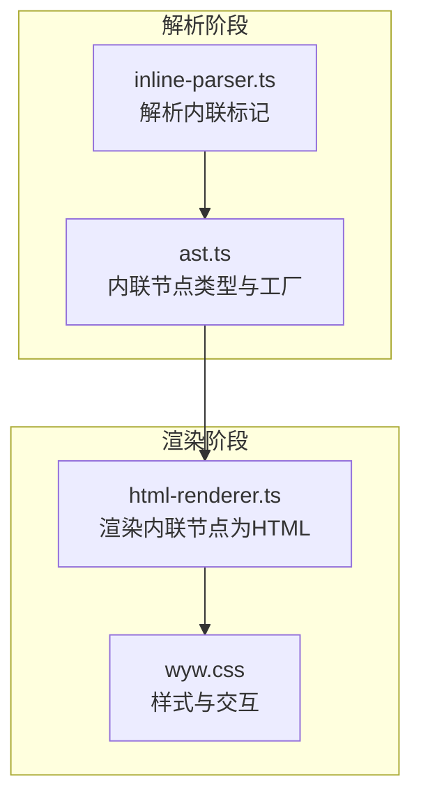
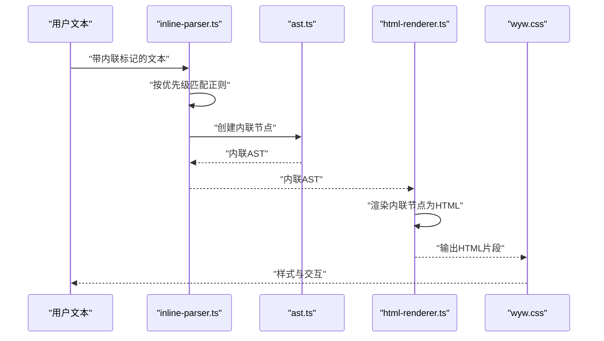
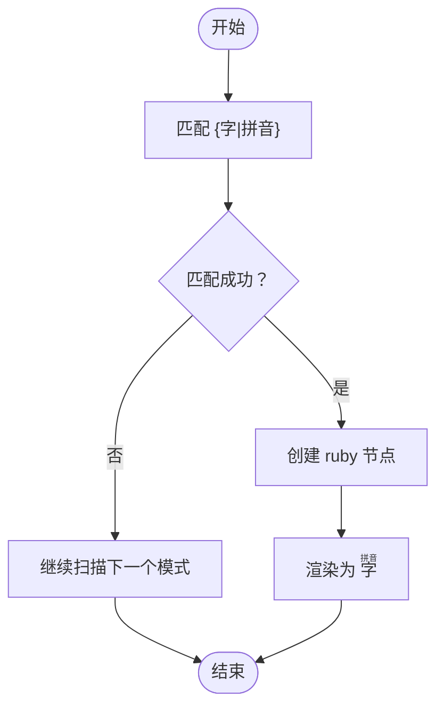
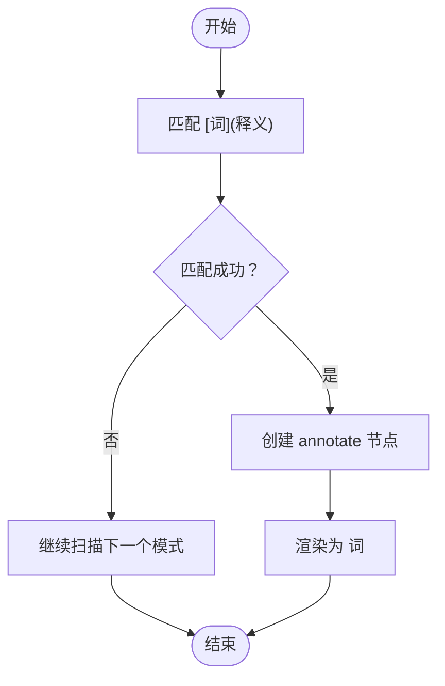
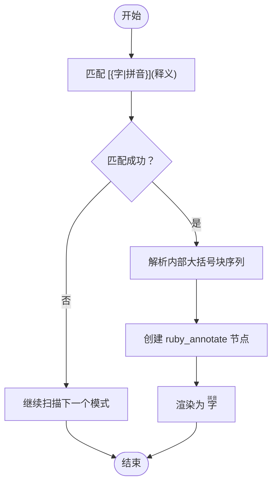
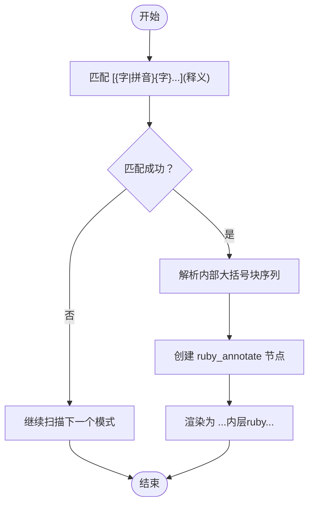
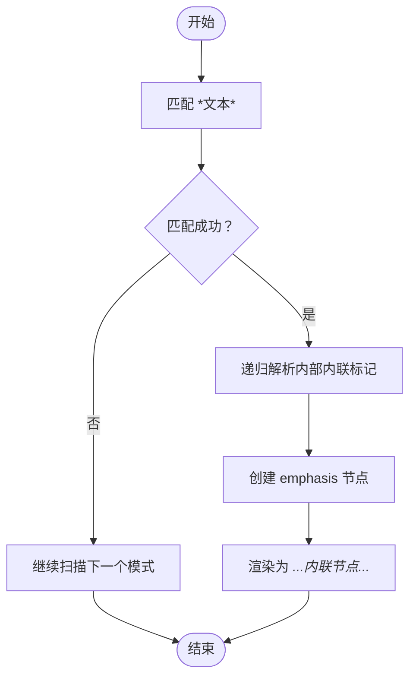
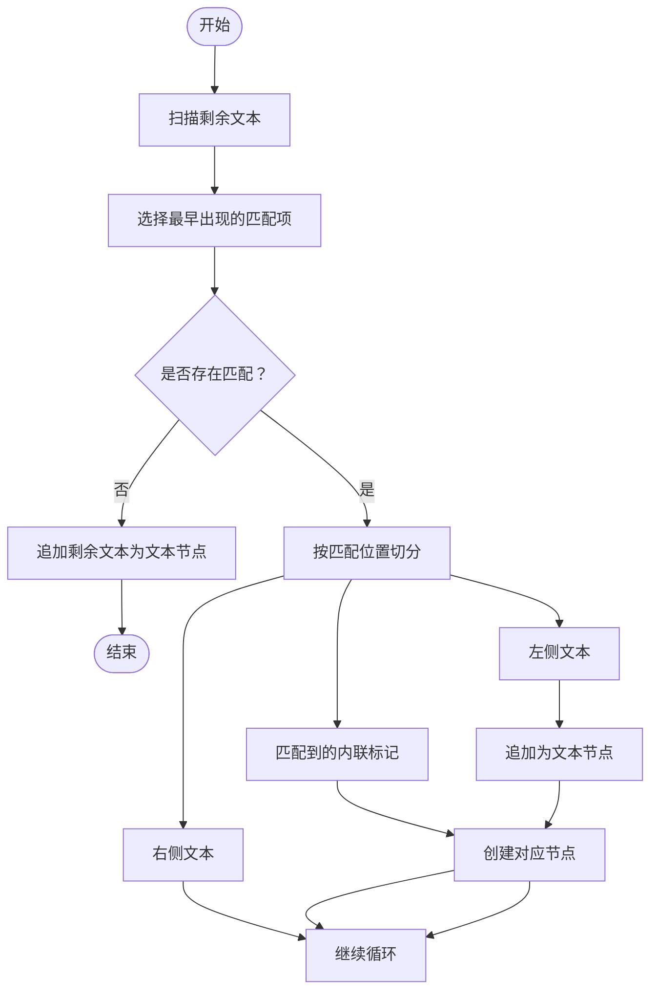
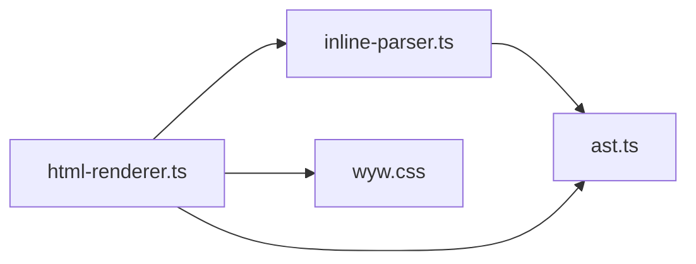

# 内联语法

<cite>
**本文引用的文件**
- [src/parser/inline-parser.ts](file://src/parser/inline-parser.ts)
- [src/parser/ast.ts](file://src/parser/ast.ts)
- [src/renderer/html-renderer.ts](file://src/renderer/html-renderer.ts)
- [docs/syntax-guide.md](file://docs/syntax-guide.md)
- [README.md](file://README.md)
- [src/assets/wyw.css](file://src/assets/wyw.css)
- [test/parser.test.ts](file://test/parser.test.ts)
- [test/compile.test.ts](file://test/compile.test.ts)
- [examples/刘禹锡_陋室铭.wyw](file://examples/刘禹锡_陋室铭.wyw)
- [test/demo/李清照_声声慢·寻寻觅觅.wyw](file://test/demo/李清照_声声慢·寻寻觅觅.wyw)
</cite>

## 目录
1. [引言](#引言)
2. [项目结构](#项目结构)
3. [核心组件](#核心组件)
4. [架构总览](#架构总览)
5. [详细组件分析](#详细组件分析)
6. [依赖关系分析](#依赖关系分析)
7. [性能考量](#性能考量)
8. [故障排查指南](#故障排查指南)
9. [结论](#结论)
10. [附录](#附录)

## 引言
本文件面向文言文标记语言（.wyw）的内联语法，系统性阐述注音、注释、注音+注释组合以及着重标记的语法规范、解析与渲染流程、优先级与嵌套规则、注音符号标准化与最佳实践，以及常见错误与调试技巧。目标读者既包括初学者，也涵盖希望深入掌握实现细节的开发者。

## 项目结构
内联语法由“解析器”和“渲染器”两部分协作完成：
- 解析器负责从文本中识别并构建内联 AST 节点
- 渲染器负责将内联 AST 节点转换为 HTML

图表来源
- [src/parser/inline-parser.ts:1-99](file://src/parser/inline-parser.ts#L1-L99)
- [src/parser/ast.ts:190-218](file://src/parser/ast.ts#L190-L218)
- [src/renderer/html-renderer.ts:195-233](file://src/renderer/html-renderer.ts#L195-L233)
- [src/assets/wyw.css:223-320](file://src/assets/wyw.css#L223-L320)

章节来源
- [src/parser/inline-parser.ts:1-99](file://src/parser/inline-parser.ts#L1-L99)
- [src/renderer/html-renderer.ts:195-233](file://src/renderer/html-renderer.ts#L195-L233)
- [src/assets/wyw.css:223-320](file://src/assets/wyw.css#L223-L320)

## 核心组件
- 内联解析器：按优先级顺序扫描文本，识别注音、注释、注音+注释组合、着重标记，并生成对应的内联 AST 节点。
- 内联 AST 类型：包含文本、注音（ruby）、注释（annotate）、着重（emphasis）、注音+注释组合（ruby_annotate）等节点类型。
- HTML 渲染器：将内联 AST 节点渲染为 HTML，注音使用 HTML 的 ruby/rp/rt 结构，注释使用带 data-note 的 span，着重使用 em 标签。
- 样式与交互：通过 CSS 控制注音样式、注释提示框、着重号等视觉呈现。

章节来源
- [src/parser/inline-parser.ts:21-46](file://src/parser/inline-parser.ts#L21-L46)
- [src/parser/ast.ts:13-51](file://src/parser/ast.ts#L13-L51)
- [src/renderer/html-renderer.ts:195-233](file://src/renderer/html-renderer.ts#L195-L233)
- [src/assets/wyw.css:223-320](file://src/assets/wyw.css#L223-L320)

## 架构总览
内联语法的端到端流程如下：
- 输入：一段包含内联标记的文本
- 解析：按优先级匹配正则，构造内联 AST
- 渲染：遍历内联 AST，输出 HTML 片段
- 样式：CSS 提供注音、注释提示、着重等样式

图表来源
- [src/parser/inline-parser.ts:62-98](file://src/parser/inline-parser.ts#L62-L98)
- [src/parser/ast.ts:190-218](file://src/parser/ast.ts#L190-L218)
- [src/renderer/html-renderer.ts:195-233](file://src/renderer/html-renderer.ts#L195-L233)
- [src/assets/wyw.css:223-320](file://src/assets/wyw.css#L223-L320)

## 详细组件分析

### 1) 注音（{字|拼音}）
- 语法：{字|拼音}
- 作用：为单个汉字添加拼音标注
- 解析行为：匹配形如 {字|拼音} 的模式，生成 ruby 节点
- 渲染行为：输出 HTML 的 ruby/rp/rt 结构，rp 用于无障碍括号，rt 显示拼音
- 样式要点：rt 使用较小字号与特定颜色，避免遮挡正文

图表来源
- [src/parser/inline-parser.ts:31-35](file://src/parser/inline-parser.ts#L31-L35)
- [src/renderer/html-renderer.ts:200-201](file://src/renderer/html-renderer.ts#L200-L201)
- [src/assets/wyw.css:228-234](file://src/assets/wyw.css#L228-L234)

章节来源
- [src/parser/inline-parser.ts:31-35](file://src/parser/inline-parser.ts#L31-L35)
- [src/renderer/html-renderer.ts:200-201](file://src/renderer/html-renderer.ts#L200-L201)
- [src/assets/wyw.css:228-234](file://src/assets/wyw.css#L228-L234)

### 2) 注释（[词](释义)）
- 语法：[词](释义)
- 作用：为词语添加注释，悬停显示释义
- 解析行为：匹配形如 [词](释义) 的模式，生成 annotate 节点
- 渲染行为：输出带 data-note 的 span，通过 CSS hover 显示提示框
- 样式要点：hover 时显示背景色与白色文字的提示框，支持左右对齐微调

图表来源
- [src/parser/inline-parser.ts:36-40](file://src/parser/inline-parser.ts#L36-L40)
- [src/renderer/html-renderer.ts:203-204](file://src/renderer/html-renderer.ts#L203-L204)
- [src/assets/wyw.css:240-300](file://src/assets/wyw.css#L240-L300)

章节来源
- [src/parser/inline-parser.ts:36-40](file://src/parser/inline-parser.ts#L36-L40)
- [src/renderer/html-renderer.ts:203-204](file://src/renderer/html-renderer.ts#L203-L204)
- [src/assets/wyw.css:240-300](file://src/assets/wyw.css#L240-L300)

### 3) 注音+注释组合（单字）
- 语法：[{字|拼音}](释义)
- 作用：对单字同时进行注音与注释
- 解析行为：匹配形如 [ {字|拼音} ](释义) 的模式，解析内部大括号块序列，生成 ruby_annotate 节点
- 渲染行为：单字场景下，外层 ruby，内层 annotate span，rt 显示拼音
- 样式要点：外层 ruby 与内层 annotate 组合，rt 与提示框共存

图表来源
- [src/parser/inline-parser.ts:22-30](file://src/parser/inline-parser.ts#L22-L30)
- [src/parser/inline-parser.ts:48-57](file://src/parser/inline-parser.ts#L48-L57)
- [src/renderer/html-renderer.ts:206-211](file://src/renderer/html-renderer.ts#L206-L211)

章节来源
- [src/parser/inline-parser.ts:22-30](file://src/parser/inline-parser.ts#L22-L30)
- [src/parser/inline-parser.ts:48-57](file://src/parser/inline-parser.ts#L48-L57)
- [src/renderer/html-renderer.ts:206-211](file://src/renderer/html-renderer.ts#L206-L211)

### 4) 注音+注释组合（整词）
- 语法：[{字|拼音}{字}...](释义)
- 作用：对多字词组进行注音+注释，词组整体可悬停查看注释
- 解析行为：匹配形如 [ {字|拼音}{字}... ](释义) 的模式，解析内部大括号块序列，生成 ruby_annotate 节点
- 渲染行为：多字场景下，内部每个字按需渲染 ruby，外层用 annotate span 包裹整个词组
- 样式要点：外层 ruby 包裹多个内层 ruby，rt 仅显示注音字的拼音，提示框显示整词注释

图表来源
- [src/parser/inline-parser.ts:22-30](file://src/parser/inline-parser.ts#L22-L30)
- [src/renderer/html-renderer.ts:212-225](file://src/renderer/html-renderer.ts#L212-L225)

章节来源
- [src/parser/inline-parser.ts:22-30](file://src/parser/inline-parser.ts#L22-L30)
- [src/renderer/html-renderer.ts:212-225](file://src/renderer/html-renderer.ts#L212-L225)

### 5) 着重（*文本*）
- 语法：*文本*
- 作用：强调文本，渲染为 em 标签
- 解析行为：匹配形如 *文本* 的模式，生成 emphasis 节点，并递归解析内部内联标记
- 渲染行为：输出 <em>标签，强调文本采用黑体与加粗
- 样式要点：强调文本使用黑体、加粗与特定字号，突出重点

图表来源
- [src/parser/inline-parser.ts:41-45](file://src/parser/inline-parser.ts#L41-L45)
- [src/renderer/html-renderer.ts:227-228](file://src/renderer/html-renderer.ts#L227-L228)
- [src/assets/wyw.css:314-319](file://src/assets/wyw.css#L314-L319)

章节来源
- [src/parser/inline-parser.ts:41-45](file://src/parser/inline-parser.ts#L41-L45)
- [src/renderer/html-renderer.ts:227-228](file://src/renderer/html-renderer.ts#L227-L228)
- [src/assets/wyw.css:314-319](file://src/assets/wyw.css#L314-L319)

### 6) 优先级与嵌套规则
- 优先级（从高到低）：注音+注释组合（整词）> 注音（单字）> 注释 > 着重
- 解析策略：每次从剩余文本中选择最早出现的匹配项，先处理该匹配，再继续扫描剩余部分
- 嵌套支持：着重标记内部可嵌套其他内联语法（如注音、注释），但不能跨边界
- 边界与转义：当前版本不支持转义，建议避免在文本中直接使用特殊字符

图表来源
- [src/parser/inline-parser.ts:62-98](file://src/parser/inline-parser.ts#L62-L98)

章节来源
- [src/parser/inline-parser.ts:21-46](file://src/parser/inline-parser.ts#L21-L46)
- [src/parser/inline-parser.ts:62-98](file://src/parser/inline-parser.ts#L62-L98)

### 7) 注音符号的标准化与最佳实践
- 注音格式：统一使用形如 {字|拼音} 的格式，拼音使用声母、韵母与声调的组合
- 注释格式：释义尽量简洁明确，避免歧义；整词注释覆盖全词含义
- 混合使用：单字注音+注释优先于整词注音+注释，便于读者聚焦单字读音
- 样式一致性：确保注音与注释的视觉层次清晰，避免相互遮挡
- 性能与可读性：合理拆分注音块，避免过长的整词注音+注释组合导致渲染复杂度上升

章节来源
- [docs/syntax-guide.md:126-190](file://docs/syntax-guide.md#L126-L190)
- [src/assets/wyw.css:228-234](file://src/assets/wyw.css#L228-L234)
- [src/assets/wyw.css:240-300](file://src/assets/wyw.css#L240-L300)

### 8) 实际示例与复杂文本标记
- 示例一：单字注音+注释
  - 语法：[{晓|xiǎo}](天刚亮的时候)
  - 效果：字上方显示拼音，同时可悬停查看注释
- 示例二：整词注音+注释（部分字注音）
  - 语法：[{箬|ruò}{笠}](用箬竹叶或竹篾编成的斗笠)
  - 效果：部分字显示拼音，整词显示注释
- 示例三：复杂多字注音+注释
  - 语法：[{邺|ye}{城}{戍|shù}](三个儿子在邺城服役。邺城：即相州，在今河南安阳)
  - 效果：多字注音与注释组合，注释包含补充说明
- 示例四：混合内联语法
  - 语法：{仙|xiān}[{晓|xiǎo}](天刚亮)*着重*
  - 效果：注音、注音+注释、着重标记共同出现

章节来源
- [docs/syntax-guide.md:146-181](file://docs/syntax-guide.md#L146-L181)
- [docs/syntax-guide.md:182-189](file://docs/syntax-guide.md#L182-L189)
- [examples/刘禹锡_陋室铭.wyw:1-22](file://examples/刘禹锡_陋室铭.wyw#L1-L22)
- [test/demo/李清照_声声慢·寻寻觅觅.wyw:1-21](file://test/demo/李清照_声声慢·寻寻觅觅.wyw#L1-L21)

## 依赖关系分析
内联语法的依赖关系如下：
- inline-parser.ts 依赖 ast.ts 的节点工厂函数
- html-renderer.ts 依赖 inline-parser.ts 与 ast.ts 的类型定义
- wyw.css 为内联节点提供样式与交互

图表来源
- [src/parser/inline-parser.ts:4-11](file://src/parser/inline-parser.ts#L4-L11)
- [src/renderer/html-renderer.ts:4-15](file://src/renderer/html-renderer.ts#L4-L15)
- [src/assets/wyw.css:223-320](file://src/assets/wyw.css#L223-L320)

章节来源
- [src/parser/inline-parser.ts:4-11](file://src/parser/inline-parser.ts#L4-L11)
- [src/renderer/html-renderer.ts:4-15](file://src/renderer/html-renderer.ts#L4-L15)
- [src/assets/wyw.css:223-320](file://src/assets/wyw.css#L223-L320)

## 性能考量
- 解析复杂度：解析器按优先级扫描，时间复杂度近似 O(n)，n 为文本长度
- 渲染复杂度：渲染器遍历内联节点，时间复杂度 O(m)，m 为内联节点数量
- 样式开销：注音与注释提示框使用 CSS hover，无额外 JavaScript 事件绑定
- 建议：避免在单个词组中过度嵌套注音+注释，保持注释简洁，减少 DOM 层级

## 故障排查指南
- 常见错误
  - 注音与注释未生效：检查是否使用正确的语法格式，确认未直接使用特殊字符
  - 注释提示框不显示：检查 data-note 是否正确渲染，确认 CSS 样式未被覆盖
  - 着重标记未嵌套其他内联语法：确认着重标记内部包含合法内联语法
- 调试技巧
  - 使用测试用例验证解析结果：参考测试文件中的断言与期望输出
  - 查看编译后的 HTML：确认 ruby、annotate、emphasis 标签是否正确生成
  - 检查样式：确认 CSS 中关于 ruby、annotate、em 的样式规则

章节来源
- [test/parser.test.ts:53-166](file://test/parser.test.ts#L53-L166)
- [test/compile.test.ts:14-94](file://test/compile.test.ts#L14-L94)
- [src/assets/wyw.css:223-320](file://src/assets/wyw.css#L223-L320)

## 结论
文言文标记语言的内联语法通过清晰的优先级与严格的解析策略，实现了注音、注释、注音+注释组合与着重标记的协同工作。配合 CSS 的样式与交互，能够为读者提供良好的阅读体验。遵循本文档的语法规范与最佳实践，可有效提升标记质量与渲染效果。

## 附录
- 语法速查表（节选）
  - 注音：{字|拼音}
  - 注释：[词](释义)
  - 注音+注释（单字）：[{字|拼音}](释义)
  - 注音+注释（整词）：[{字|拼音}{字}...](释义)
  - 着重：*文本*

章节来源
- [README.md:91-108](file://README.md#L91-L108)
- [docs/syntax-guide.md:224-241](file://docs/syntax-guide.md#L224-L241)