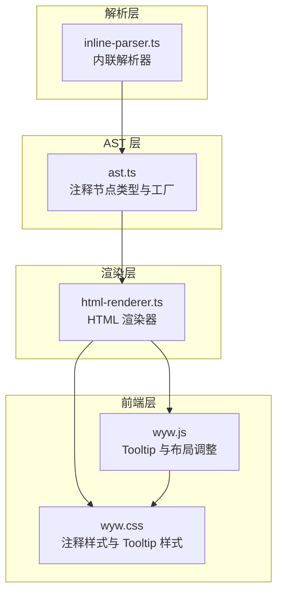
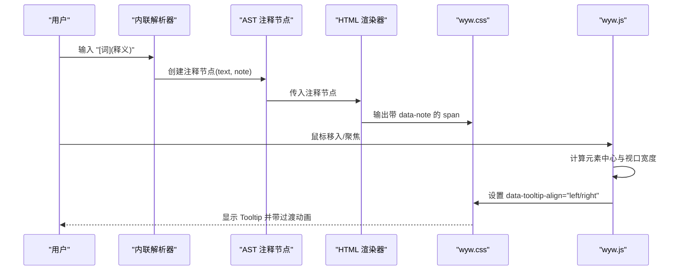
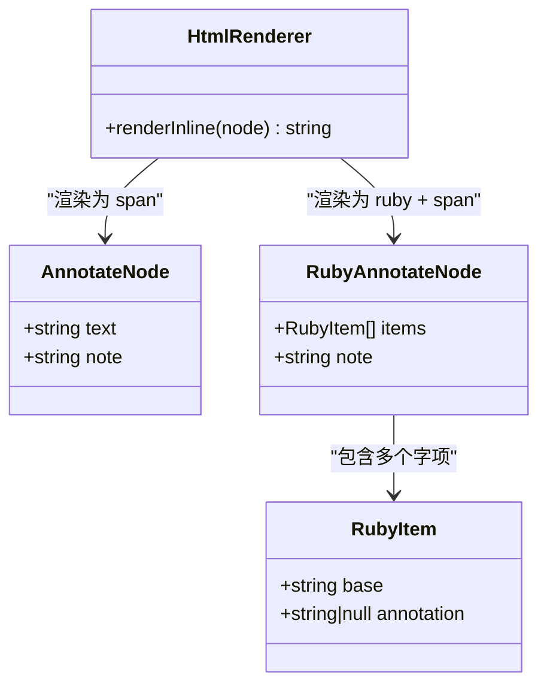
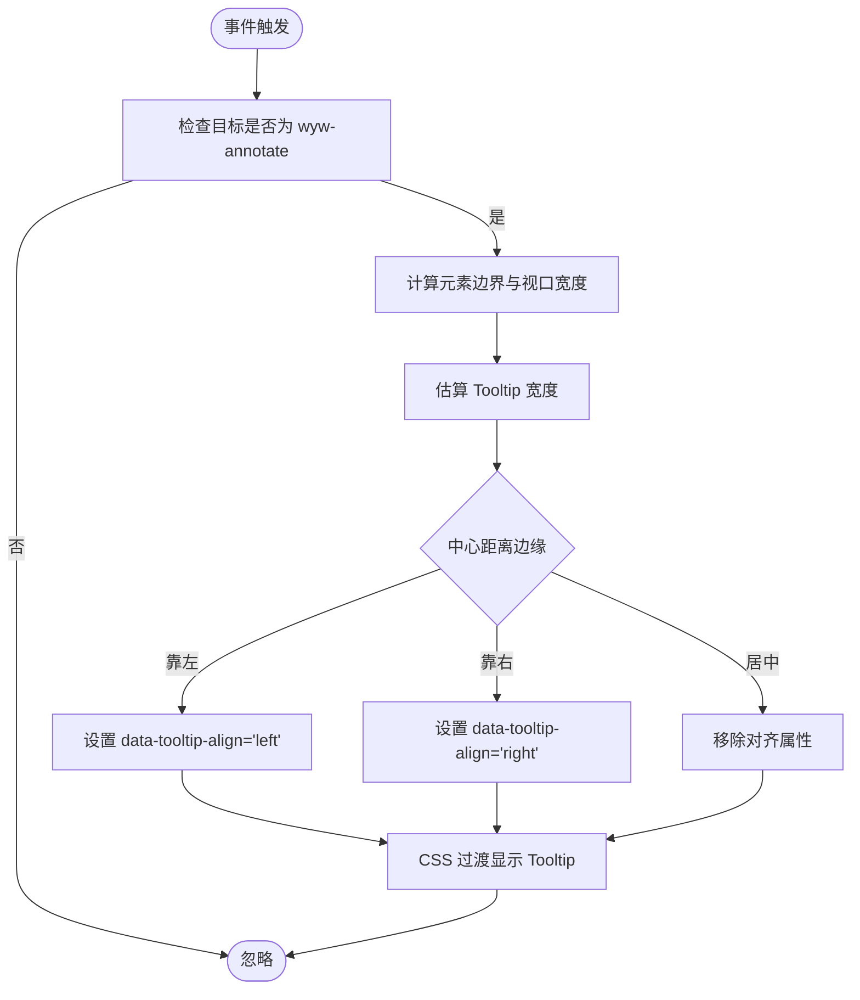
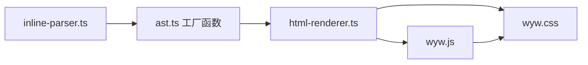

# 注释标记

<cite>
**本文引用的文件列表**
- [syntax-guide.md](file://docs/syntax-guide.md)
- [SKILL.md](file://skill/wyw-writer/SKILL.md)
- [examples.md](file://skill/wyw-writer/examples.md)
- [inline-parser.ts](file://src/parser/inline-parser.ts)
- [ast.ts](file://src/parser/ast.ts)
- [html-renderer.ts](file://src/renderer/html-renderer.ts)
- [wyw.js](file://src/assets/wyw.js)
- [wyw.css](file://src/assets/wyw.css)
- [刘禹锡_陋室铭.wyw](file://examples/刘禹锡_陋室铭.wyw)
- [范仲淹_岳阳楼记.wyw](file://examples/范仲淹_岳阳楼记.wyw)
- [demo_陋室铭.wyw](file://test/demo/刘禹锡_陋室铭.wyw)
</cite>

## 目录
1. [简介](#简介)
2. [项目结构](#项目结构)
3. [核心组件](#核心组件)
4. [架构总览](#架构总览)
5. [详细组件分析](#详细组件分析)
6. [依赖关系分析](#依赖关系分析)
7. [性能考量](#性能考量)
8. [故障排查指南](#故障排查指南)
9. [结论](#结论)
10. [附录](#附录)

## 简介
本文件围绕文言文标记语言中的“注释标记语法”进行系统化说明，重点覆盖以下方面：
- 语法规范：[词](释义) 的结构、匹配规则与优先级
- 使用方法：词语选择原则、释义内容编写规范
- HTML 渲染效果：鼠标悬停显示注释的技术实现与样式
- 实际示例：涵盖名词、动词、形容词等不同词性的注释方式
- 语义化与可访问性：标签语义、键盘可达性与屏幕阅读器友好性
- 质量评估与编写技巧：注释的准确性、一致性与可读性建议

## 项目结构
该仓库采用模块化设计，注释标记语法贯穿“解析—AST—渲染—前端交互”的完整链路：
- 解析层：内联语法解析器负责识别并构建注释节点
- AST 层：定义注释节点类型与工厂函数
- 渲染层：HTML 渲染器将注释节点输出为带 data 属性的元素
- 前端层：客户端脚本绑定事件，计算定位并呈现 Tooltip

图表来源
- [inline-parser.ts:22-46](file://src/parser/inline-parser.ts#L22-L46)
- [ast.ts:24-28](file://src/parser/ast.ts#L24-L28)
- [html-renderer.ts:203-204](file://src/renderer/html-renderer.ts#L203-L204)
- [wyw.js:129-167](file://src/assets/wyw.js#L129-L167)
- [wyw.css:240-313](file://src/assets/wyw.css#L240-L313)

章节来源
- [inline-parser.ts:1-99](file://src/parser/inline-parser.ts#L1-L99)
- [ast.ts:1-218](file://src/parser/ast.ts#L1-L218)
- [html-renderer.ts:1-251](file://src/renderer/html-renderer.ts#L1-L251)
- [wyw.js:1-204](file://src/assets/wyw.js#L1-L204)
- [wyw.css:1-657](file://src/assets/wyw.css#L1-L657)

## 核心组件
- 内联解析器：识别并优先匹配注释标记，生成注释节点
- 注释节点类型：包含注释文本与释义内容
- HTML 渲染器：输出带 data-note 的 span，并保留内联内容
- 前端脚本：监听鼠标进入/焦点事件，动态计算 Tooltip 对齐与可见性
- 样式系统：定义注释下划线指示器与 Tooltip 的外观与动画

章节来源
- [inline-parser.ts:36-40](file://src/parser/inline-parser.ts#L36-L40)
- [ast.ts:24-28](file://src/parser/ast.ts#L24-L28)
- [html-renderer.ts:203-204](file://src/renderer/html-renderer.ts#L203-L204)
- [wyw.js:129-167](file://src/assets/wyw.js#L129-L167)
- [wyw.css:240-313](file://src/assets/wyw.css#L240-L313)

## 架构总览
注释标记的端到端流程如下：
- 输入文本通过内联解析器识别注释标记，构造注释节点
- AST 节点传递给 HTML 渲染器，渲染为带 data-note 的 span
- 前端脚本监听事件，根据元素位置与视口宽度动态设置 data-tooltip-align
- CSS 通过伪元素与过渡动画实现 Tooltip 的出现/消失与左右对齐

图表来源
- [inline-parser.ts:36-40](file://src/parser/inline-parser.ts#L36-L40)
- [ast.ts:24-28](file://src/parser/ast.ts#L24-L28)
- [html-renderer.ts:203-204](file://src/renderer/html-renderer.ts#L203-L204)
- [wyw.js:129-167](file://src/assets/wyw.js#L129-L167)
- [wyw.css:266-313](file://src/assets/wyw.css#L266-L313)

## 详细组件分析

### 语法规范与匹配规则
- 语法形式：`[词](释义)`
- 匹配优先级：在内联解析器中，注释标记位于注音与强调之后，确保优先识别
- 释义内容：括号内的任意文本，用于解释词语含义
- 与注音组合：当同一字既需注音又需注释时，使用注释包裹注音语法

章节来源
- [inline-parser.ts:36-40](file://src/parser/inline-parser.ts#L36-L40)
- [inline-parser.ts:22-46](file://src/parser/inline-parser.ts#L22-L46)
- [syntax-guide.md:136-144](file://docs/syntax-guide.md#L136-L144)

### AST 节点与工厂函数
- 注释节点类型：包含 text 与 note 字段
- 工厂函数：createAnnotate 用于创建注释节点
- 与注音组合：当存在注音+注释组合时，使用独立的 RubyAnnotate 节点类型

图表来源
- [ast.ts:24-28](file://src/parser/ast.ts#L24-L28)
- [ast.ts:40-44](file://src/parser/ast.ts#L40-L44)
- [ast.ts:35-38](file://src/parser/ast.ts#L35-L38)
- [html-renderer.ts:203-225](file://src/renderer/html-renderer.ts#L203-L225)

章节来源
- [ast.ts:24-28](file://src/parser/ast.ts#L24-L28)
- [ast.ts:40-44](file://src/parser/ast.ts#L40-L44)
- [ast.ts:35-38](file://src/parser/ast.ts#L35-L38)
- [ast.ts:200-202](file://src/parser/ast.ts#L200-L202)
- [ast.ts:208-217](file://src/parser/ast.ts#L208-L217)

### HTML 渲染与数据属性
- 渲染策略：将注释节点渲染为 span，设置 class 与 data-note 属性
- 内联内容：注释节点内部仍可包含其他内联节点（如注音、强调），保持递归渲染
- 安全转义：对属性值进行 HTML 转义，防止注入

章节来源
- [html-renderer.ts:203-204](file://src/renderer/html-renderer.ts#L203-L204)
- [html-renderer.ts:195-233](file://src/renderer/html-renderer.ts#L195-L233)
- [html-renderer.ts:244-250](file://src/renderer/html-renderer.ts#L244-L250)

### 前端交互与 Tooltip 实现
- 事件绑定：监听鼠标进入与焦点事件，仅对带 wyw-annotate 类的元素生效
- 对齐逻辑：根据元素中心与视口宽度，动态设置 data-tooltip-align，避免溢出
- 动画与可见性：通过伪元素与过渡属性控制 Tooltip 的出现/消失与可见性

图表来源
- [wyw.js:129-167](file://src/assets/wyw.js#L129-L167)
- [wyw.css:266-313](file://src/assets/wyw.css#L266-L313)

章节来源
- [wyw.js:129-167](file://src/assets/wyw.js#L129-L167)
- [wyw.css:240-313](file://src/assets/wyw.css#L240-L313)

### 语义化与可访问性
- 语义化：注释元素为 span，具备 data-note 属性承载释义，便于无障碍工具读取
- 键盘可达性：支持 focusin 事件，使键盘用户也能触发 Tooltip
- 屏幕阅读器：data-note 作为 aria-label 的后备来源，提升可读性
- 视口适配：窄屏下 Tooltip 自适应最大宽度，避免溢出

章节来源
- [html-renderer.ts:203-204](file://src/renderer/html-renderer.ts#L203-L204)
- [wyw.js:142-147](file://src/assets/wyw.js#L142-L147)
- [wyw.css:529-533](file://src/assets/wyw.css#L529-L533)

### 使用方法与示例
- 词语选择原则：优先注释生僻词、典故、专有名词与文化负载词
- 释义内容规范：简洁准确、避免歧义；必要时给出出处或引文
- 示例来源：项目内置示例与写作范例展示了多种词性与场景下的注释实践

章节来源
- [syntax-guide.md:136-144](file://docs/syntax-guide.md#L136-L144)
- [examples/刘禹锡_陋室铭.wyw:8-20](file://examples/刘禹锡_陋室铭.wyw#L8-L20)
- [examples/范仲淹_岳阳楼记.wyw:9-25](file://examples/范仲淹_岳阳楼记.wyw#L9-L25)
- [test/demo/刘禹锡_陋室铭.wyw:16-27](file://test/demo/刘禹锡_陋室铭.wyw#L16-L27)
- [skill/wyw-writer/examples.md:18-32](file://skill/wyw-writer/examples.md#L18-L32)
- [skill/wyw-writer/examples.md:76-98](file://skill/wyw-writer/examples.md#L76-L98)

## 依赖关系分析
- 解析器依赖 AST 工厂函数创建注释节点
- 渲染器依赖 AST 节点类型与内联渲染函数
- 前端脚本依赖渲染器输出的 class 与 data 属性
- 样式系统依赖伪元素与 data 属性实现 Tooltip

图表来源
- [inline-parser.ts:4-11](file://src/parser/inline-parser.ts#L4-L11)
- [ast.ts:200-202](file://src/parser/ast.ts#L200-L202)
- [html-renderer.ts:4-15](file://src/renderer/html-renderer.ts#L4-L15)
- [wyw.js:129-167](file://src/assets/wyw.js#L129-L167)
- [wyw.css:240-313](file://src/assets/wyw.css#L240-L313)

章节来源
- [inline-parser.ts:1-99](file://src/parser/inline-parser.ts#L1-L99)
- [ast.ts:1-218](file://src/parser/ast.ts#L1-L218)
- [html-renderer.ts:1-251](file://src/renderer/html-renderer.ts#L1-L251)
- [wyw.js:1-204](file://src/assets/wyw.js#L1-L204)
- [wyw.css:1-657](file://src/assets/wyw.css#L1-L657)

## 性能考量
- 解析复杂度：内联解析器按顺序扫描并匹配，时间复杂度近似 O(n)，空间复杂度与节点数量线性相关
- 渲染复杂度：HTML 渲染器遍历 AST，注释节点渲染为轻量 span，开销较小
- 前端事件：Tooltip 计算基于 DOM 查询与视口尺寸，建议避免在大量注释元素上频繁触发事件
- 样式优化：Tooltip 使用伪元素与过渡动画，尽量减少重排与重绘

[本节为通用性能讨论，无需特定文件来源]

## 故障排查指南
- 注释未显示：确认渲染器输出的 class 与 data-note 是否正确；检查前端事件绑定是否生效
- Tooltip 溢出：检查 data-tooltip-align 的设置逻辑与视口宽度计算
- 释义为空：确认注释语法格式正确，括号内无多余空白或未闭合
- 与注音冲突：当同一字既有注音又有注释时，使用注释包裹注音语法，避免解析歧义

章节来源
- [html-renderer.ts:203-204](file://src/renderer/html-renderer.ts#L203-L204)
- [wyw.js:129-167](file://src/assets/wyw.js#L129-L167)
- [inline-parser.ts:22-46](file://src/parser/inline-parser.ts#L22-L46)

## 结论
注释标记语法通过清晰的语法、严谨的解析与渲染流程，以及完善的前端交互与样式系统，实现了文言文阅读中“可悬停查看释义”的体验。遵循本文提供的规范与最佳实践，可在保证可读性的同时，提升注释的质量与一致性。

[本节为总结性内容，无需特定文件来源]

## 附录

### 语法速查与示例路径
- 基础注释：[syntax-guide.md:136-144](file://docs/syntax-guide.md#L136-L144)
- 注音+注释（单字）：[syntax-guide.md:146-156](file://docs/syntax-guide.md#L146-L156)
- 注音+注释（整词）：[syntax-guide.md:158-174](file://docs/syntax-guide.md#L158-L174)
- 写作范例（含注释）：[skill/wyw-writer/examples.md:18-32](file://skill/wyw-writer/examples.md#L18-L32), [skill/wyw-writer/examples.md:76-98](file://skill/wyw-writer/examples.md#L76-L98)
- 示例文件（注释示例）：[examples/刘禹锡_陋室铭.wyw:8-20](file://examples/刘禹锡_陋室铭.wyw#L8-L20), [examples/范仲淹_岳阳楼记.wyw:9-25](file://examples/范仲淹_岳阳楼记.wyw#L9-L25), [test/demo/刘禹锡_陋室铭.wyw:16-27](file://test/demo/刘禹锡_陋室铭.wyw#L16-L27)

### 术语对照
- 注释标记：[词](释义)
- 注音标记：{字|拼音}
- 注音+注释组合：[{字|拼音}](释义) 或 [{字|拼音}{字}...](释义)
- 注释节点：AnnotateNode
- 注音+注释节点：RubyAnnotateNode

[本节为术语汇总，无需特定文件来源]