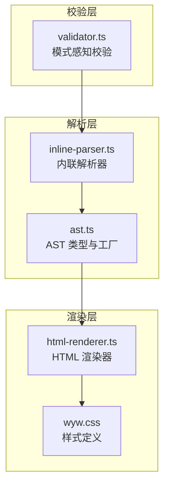
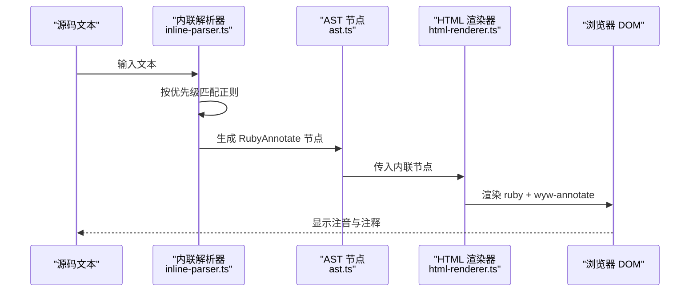
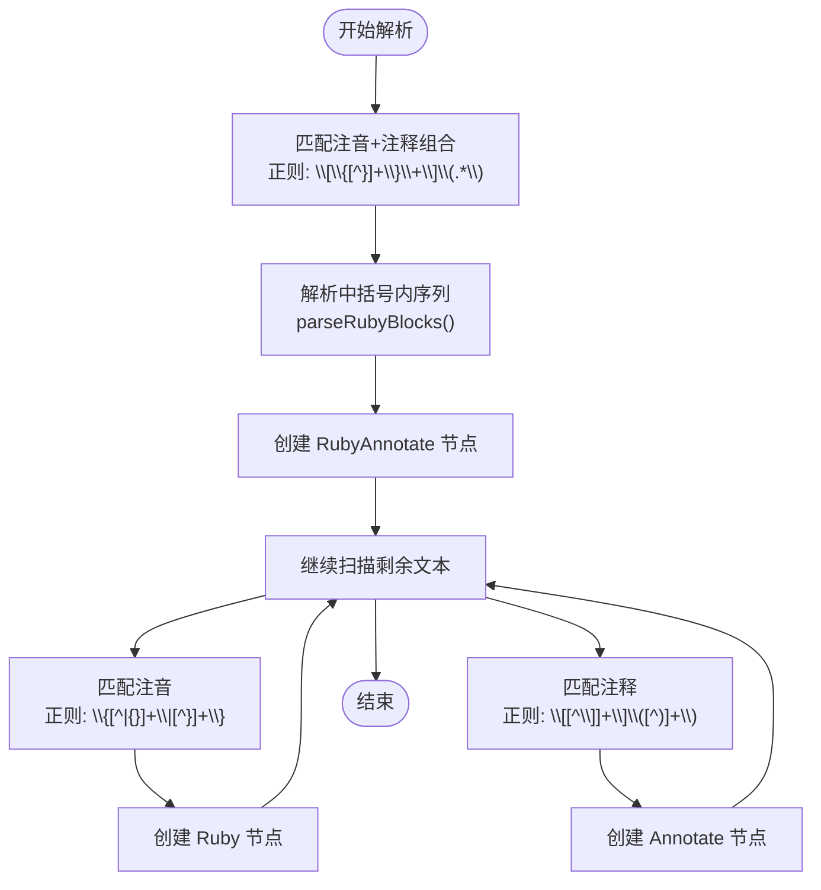
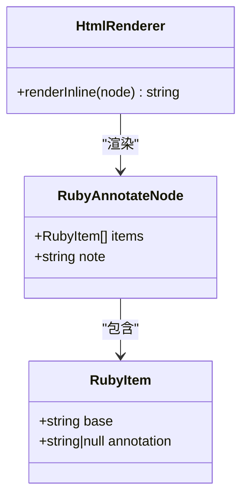
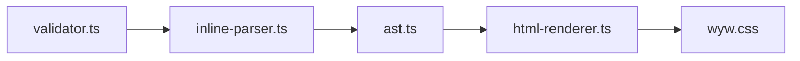

# 注音+注释组合（单字）

<cite>
**本文引用的文件列表**
- [README.md](file://README.md)
- [docs/syntax-guide.md](file://docs/syntax-guide.md)
- [src/parser/inline-parser.ts](file://src/parser/inline-parser.ts)
- [src/parser/ast.ts](file://src/parser/ast.ts)
- [src/renderer/html-renderer.ts](file://src/renderer/html-renderer.ts)
- [src/assets/wyw.css](file://src/assets/wyw.css)
- [src/validator.ts](file://src/validator.ts)
- [test/parser.test.ts](file://test/parser.test.ts)
- [examples/刘禹锡_陋室铭.wyw](file://examples/刘禹锡_陋室铭.wyw)
- [test/demo/刘禹锡_陋室铭.wyw](file://test/demo/刘禹锡_陋室铭.wyw)
</cite>

## 目录
1. [引言](#引言)
2. [项目结构](#项目结构)
3. [核心组件](#核心组件)
4. [架构总览](#架构总览)
5. [详细组件分析](#详细组件分析)
6. [依赖关系分析](#依赖关系分析)
7. [性能考量](#性能考量)
8. [故障排查指南](#故障排查指南)
9. [结论](#结论)
10. [附录](#附录)

## 引言
本文件面向“注音+注释组合（单字）”语法，系统阐述 `[{字|拼音}](释义)` 的复合标记规范，重点说明：
- 中括号与小括号的嵌套使用规则与语义边界
- 组合标记的双重效果：既提供注音又提供注释
- 语法优先级与渲染顺序的技术细节
- 与纯注音、纯注释的区别与使用时机
- 实际示例与典型应用场景

该语法在解析阶段被识别为“注音+注释组合（ruby_annotate）”，在渲染阶段通过 HTML 的 ruby 元素与自定义注释类共同实现双层效果。

## 项目结构
该项目采用模块化组织，围绕“解析器—AST—渲染器—样式—校验器”的链路工作。与本语法相关的模块包括：
- 解析器：负责内联语法的优先级匹配与节点生成
- AST：定义内联节点类型（含 ruby_annotate）
- 渲染器：将 AST 节点渲染为 HTML（ruby + 自定义注释样式）
- 样式：定义注音与注释的视觉呈现
- 校验器：按解析优先级顺序提取并验证语法

图表来源
- [src/parser/inline-parser.ts:1-99](file://src/parser/inline-parser.ts#L1-L99)
- [src/parser/ast.ts:1-218](file://src/parser/ast.ts#L1-L218)
- [src/renderer/html-renderer.ts:1-251](file://src/renderer/html-renderer.ts#L1-L251)
- [src/assets/wyw.css:1-657](file://src/assets/wyw.css#L1-L657)
- [src/validator.ts:261-503](file://src/validator.ts#L261-L503)

章节来源
- [README.md:110-130](file://README.md#L110-L130)
- [docs/syntax-guide.md:124-190](file://docs/syntax-guide.md#L124-L190)

## 核心组件
- 内联解析器（inline-parser.ts）
  - 按优先级顺序匹配三种内联语法：注音+注释组合、注音、注释、着重
  - 注音+注释组合的正则为 `/\[((?:\{[^}]+\})+)\]\(([^)]+)\)/`，先于纯注音与纯注释匹配
  - 将中括号内的多个大括号块解析为 RubyItem 列表，并生成 RubyAnnotate 节点
- AST（ast.ts）
  - 定义 RubyAnnotateNode：包含 items（RubyItem[]）与 note（注释文本）
  - RubyItem：包含 base（字面）、annotation（可空拼音）
- HTML 渲染器（html-renderer.ts）
  - 单字注音+注释：渲染为单个 ruby，内部字面使用 wyw-annotate 类与 data-note 属性
  - 多字注音+注释：内部每个字独立渲染 ruby，外层统一用 wyw-annotate 包裹
- 样式（wyw.css）
  - ruby rt 定义注音样式
  - .wyw-annotate 定义注释悬停下划线与 tooltip
- 校验器（validator.ts）
  - 按解析优先级顺序三遍扫描：ruby_annotate → ruby → annotate
  - 使用 consumed 区间避免重复匹配，保证与解析器一致的行为

章节来源
- [src/parser/inline-parser.ts:21-46](file://src/parser/inline-parser.ts#L21-L46)
- [src/parser/inline-parser.ts:48-57](file://src/parser/inline-parser.ts#L48-L57)
- [src/parser/ast.ts:35-51](file://src/parser/ast.ts#L35-L51)
- [src/renderer/html-renderer.ts:206-225](file://src/renderer/html-renderer.ts#L206-L225)
- [src/assets/wyw.css:223-300](file://src/assets/wyw.css#L223-L300)
- [src/validator.ts:261-503](file://src/validator.ts#L261-L503)

## 架构总览
下面的序列图展示了“注音+注释组合（单字）”从源码到渲染的关键流程，体现解析优先级与渲染顺序。

图表来源
- [src/parser/inline-parser.ts:62-98](file://src/parser/inline-parser.ts#L62-L98)
- [src/parser/ast.ts:208-217](file://src/parser/ast.ts#L208-L217)
- [src/renderer/html-renderer.ts:195-233](file://src/renderer/html-renderer.ts#L195-L233)

## 详细组件分析

### 语法定义与优先级
- 注音+注释组合（单字）
  - 语法：`[{字|拼音}](释义)`
  - 语义：对单个字同时提供注音与注释
  - 优先级：高于纯注音与纯注释
- 注音（单字）
  - 语法：`{字|拼音}`
  - 语义：仅提供注音
- 注释（整词）
  - 语法：`[词](释义)`
  - 语义：仅提供注释

解析优先级顺序（与校验器一致）：
1) 注音+注释组合（ruby_annotate）
2) 注音（ruby）
3) 注释（annotate）

章节来源
- [docs/syntax-guide.md:146-157](file://docs/syntax-guide.md#L146-L157)
- [docs/syntax-guide.md:158-181](file://docs/syntax-guide.md#L158-L181)
- [src/parser/inline-parser.ts:21-46](file://src/parser/inline-parser.ts#L21-L46)
- [src/validator.ts:261-503](file://src/validator.ts#L261-L503)

### 解析流程与 AST 生成
- 正则匹配
  - 注音+注释组合：捕获中括号内的“{字|拼音}...”序列与小括号内的注释文本
  - 中括号内序列通过 `parseRubyBlocks` 解析为 RubyItem[]
- AST 节点
  - RubyAnnotateNode：items（RubyItem[]）、note（注释文本）
  - RubyItem：base（字）、annotation（可空）

图表来源
- [src/parser/inline-parser.ts:21-46](file://src/parser/inline-parser.ts#L21-L46)
- [src/parser/inline-parser.ts:48-57](file://src/parser/inline-parser.ts#L48-L57)
- [src/parser/ast.ts:208-217](file://src/parser/ast.ts#L208-L217)

章节来源
- [src/parser/inline-parser.ts:21-57](file://src/parser/inline-parser.ts#L21-L57)
- [src/parser/ast.ts:35-51](file://src/parser/ast.ts#L35-L51)

### 渲染策略与视觉效果
- 单字注音+注释
  - 渲染为单个 ruby，内部字面使用 wyw-annotate 类与 data-note 属性，实现注音与注释的叠加
- 多字注音+注释
  - 内部每个字独立渲染 ruby，外层统一用 wyw-annotate 包裹，实现整词注释与内部注音的组合
- 样式要点
  - ruby rt：注音字体、字号、颜色
  - .wyw-annotate：悬停下划线与 tooltip 弹层

图表来源
- [src/parser/ast.ts:40-44](file://src/parser/ast.ts#L40-L44)
- [src/parser/ast.ts:35-38](file://src/parser/ast.ts#L35-L38)
- [src/renderer/html-renderer.ts:195-233](file://src/renderer/html-renderer.ts#L195-L233)

章节来源
- [src/renderer/html-renderer.ts:206-225](file://src/renderer/html-renderer.ts#L206-L225)
- [src/assets/wyw.css:223-300](file://src/assets/wyw.css#L223-L300)

### 语法优先级与渲染顺序的技术细节
- 优先级顺序
  - 注音+注释组合（最高）→ 注音 → 注释（最低）
- 区间消费机制
  - 校验器使用 consumed 区间标记已匹配范围，避免低优先级扫描重复匹配
- 解析器扫描策略
  - 从左到右扫描，选择最早出现的匹配模式，再递归处理剩余文本
- 渲染顺序
  - HTML 渲染器按 AST 节点顺序输出，ruby 与注释类叠加，形成注音+注释的最终呈现

章节来源
- [src/parser/inline-parser.ts:62-98](file://src/parser/inline-parser.ts#L62-L98)
- [src/validator.ts:462-503](file://src/validator.ts#L462-L503)

### 实际示例与应用场景
- 单字注音+注释（典型）
  - 示例：`[{晓|xiǎo}](天刚亮的时候)`
  - 场景：单字需要注音且需提供释义时
- 整词注音+注释（多字）
  - 示例：`[{箬|ruò}{笠}](用箬竹叶或竹篾编成的斗笠)`
  - 场景：多字词组中部分字需要注音
- 混合场景
  - 示例：`{仙|xiān}[{晓|xiǎo}](天刚亮)*着重*`
  - 场景：在同一句中同时存在注音、注释与强调

章节来源
- [docs/syntax-guide.md:146-181](file://docs/syntax-guide.md#L146-L181)
- [test/parser.test.ts:87-140](file://test/parser.test.ts#L87-L140)
- [examples/刘禹锡_陋室铭.wyw:7-22](file://examples/刘禹锡_陋室铭.wyw#L7-L22)
- [test/demo/刘禹锡_陋室铭.wyw:15-32](file://test/demo/刘禹锡_陋室铭.wyw#L15-L32)

## 依赖关系分析
- 解析器依赖 AST 工厂函数生成节点
- 渲染器依赖解析器产出的内联节点
- 样式依赖注释类与 ruby 元素的组合
- 校验器依赖解析器的优先级顺序，确保一致性

图表来源
- [src/parser/inline-parser.ts:1-11](file://src/parser/inline-parser.ts#L1-L11)
- [src/parser/ast.ts:190-218](file://src/parser/ast.ts#L190-L218)
- [src/renderer/html-renderer.ts:4-15](file://src/renderer/html-renderer.ts#L4-L15)
- [src/assets/wyw.css:1-657](file://src/assets/wyw.css#L1-L657)
- [src/validator.ts:261-503](file://src/validator.ts#L261-L503)

章节来源
- [src/parser/inline-parser.ts:1-11](file://src/parser/inline-parser.ts#L1-L11)
- [src/renderer/html-renderer.ts:4-15](file://src/renderer/html-renderer.ts#L4-L15)

## 性能考量
- 解析复杂度
  - 解析器按优先级顺序扫描，时间复杂度近似 O(n)，其中 n 为文本长度
  - 正则匹配与区间消费避免重复扫描，提升效率
- 渲染复杂度
  - 渲染器遍历 AST 节点，时间复杂度 O(m)，其中 m 为内联节点数量
- 样式影响
  - 注音模式下适当增加行高，避免 ruby 重叠，提升可读性
- 建议
  - 合理使用注音+注释组合，避免过度密集注解导致阅读负担
  - 在长文段落中，优先使用整词注释组合，减少单字注音数量

[本节为通用性能建议，无需特定文件引用]

## 故障排查指南
- 常见问题
  - 注释为空：校验器会警告“注释为空”
  - 标记未闭合：校验器报告缺失的闭合符号
  - 着重标记不成对：校验器提示“着重点标记不成对”
- 排查步骤
  - 检查注释文本是否为空
  - 检查中括号、小括号是否正确闭合
  - 检查星号（*）是否成对出现
  - 对照解析优先级，确认是否被更高优先级模式误匹配

章节来源
- [src/validator.ts:241-259](file://src/validator.ts#L241-L259)
- [src/validator.ts:432-436](file://src/validator.ts#L432-L436)

## 结论
“注音+注释组合（单字）”语法通过明确的嵌套规则与严格的优先级设计，实现了“既注音又注释”的双重效果。解析器、AST、渲染器与样式的协同工作，确保了从源码到页面的一致性与可读性。在实际使用中，应根据具体语境选择合适的注音粒度与注释范围，平衡学习辅助与阅读流畅性。

[本节为总结性内容，无需特定文件引用]

## 附录
- 语法速查
  - 注音：`{字|拼音}`
  - 注释：`[词](释义)`
  - 注音+注释（单字）：`[{字|拼音}](释义)`
  - 注音+注释（整词）：`[{字|拼音}{字}...](释义)`
- 相关示例文件
  - 示例文章：`examples/刘禹锡_陋室铭.wyw`
  - 演示文章：`test/demo/刘禹锡_陋室铭.wyw`

章节来源
- [docs/syntax-guide.md:224-241](file://docs/syntax-guide.md#L224-L241)
- [examples/刘禹锡_陋室铭.wyw:1-22](file://examples/刘禹锡_陋室铭.wyw#L1-L22)
- [test/demo/刘禹锡_陋室铭.wyw:1-32](file://test/demo/刘禹锡_陋室铭.wyw#L1-L32)