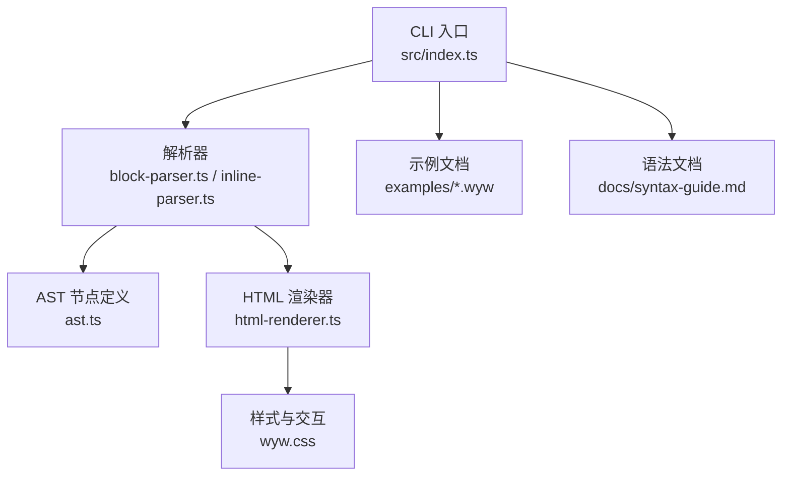
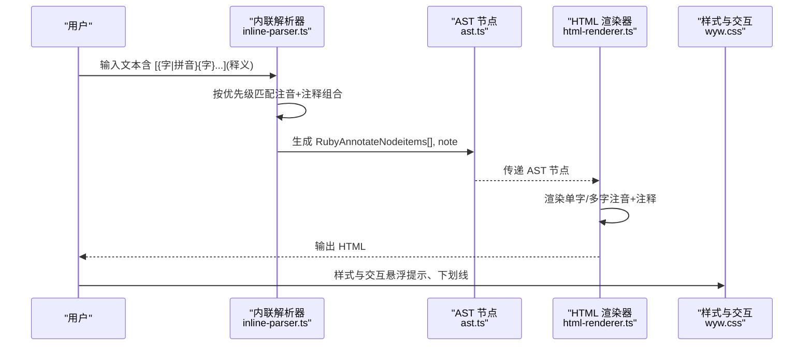
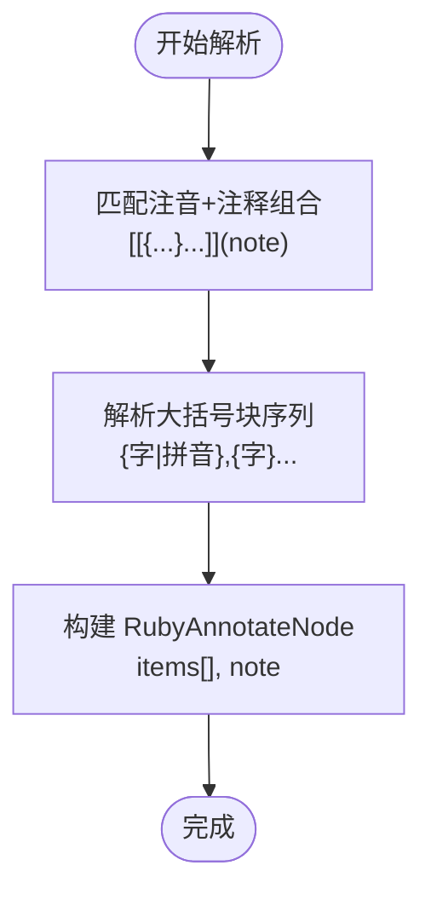
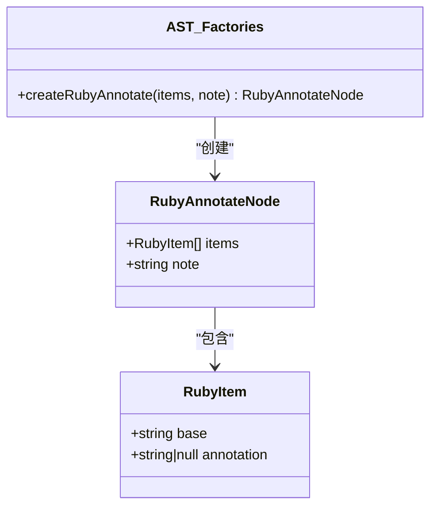
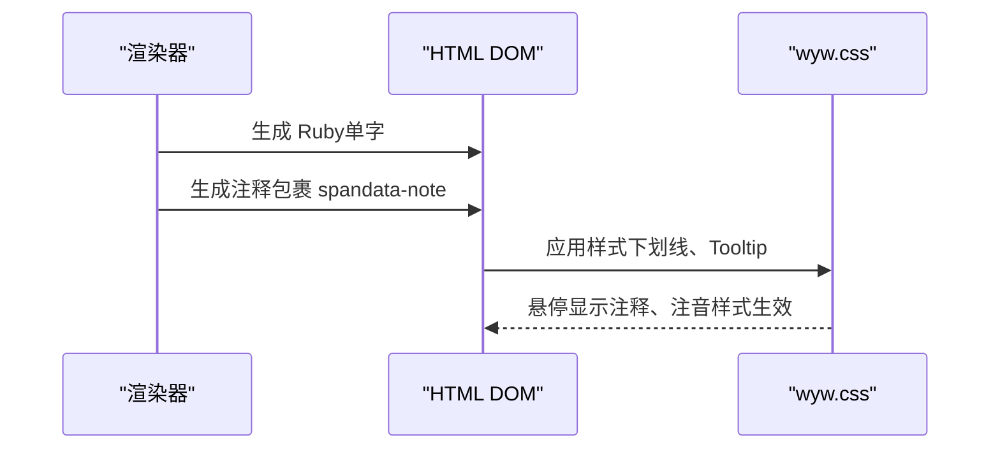
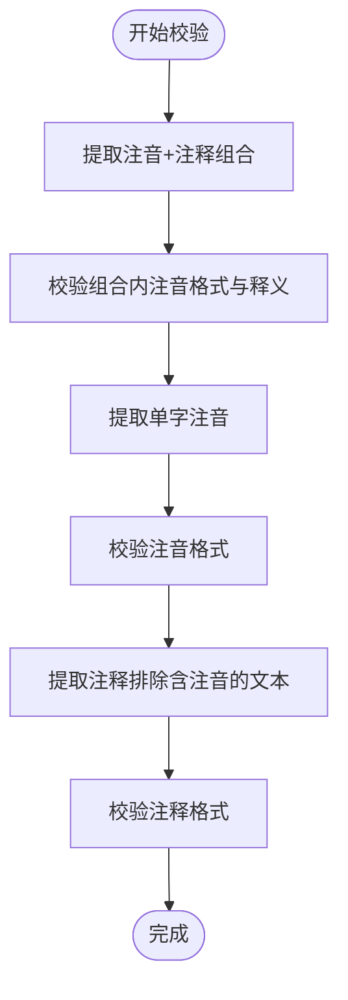
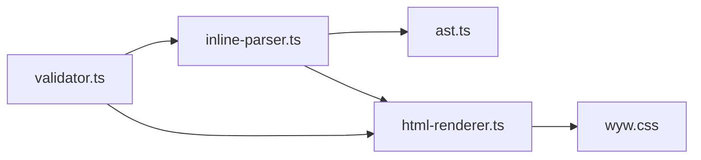

# 注音+注释组合（整词）

<cite>
**本文引用的文件**
- [README.md](file://README.md)
- [docs/syntax-guide.md](file://docs/syntax-guide.md)
- [src/index.ts](file://src/index.ts)
- [src/parser/inline-parser.ts](file://src/parser/inline-parser.ts)
- [src/parser/ast.ts](file://src/parser/ast.ts)
- [src/renderer/html-renderer.ts](file://src/renderer/html-renderer.ts)
- [src/validator.ts](file://src/validator.ts)
- [src/assets/wyw.css](file://src/assets/wyw.css)
- [examples/范仲淹_岳阳楼记.wyw](file://examples/范仲淹_岳阳楼记.wyw)
- [examples/刘禹锡_陋室铭.wyw](file://examples/刘禹锡_陋室铭.wyw)
- [examples/郦道元_三峡.wyw](file://examples/郦道元_三峡.wyw)
- [test/parser.test.ts](file://test/parser.test.ts)
- [test/validator.test.ts](file://test/validator.test.ts)
</cite>

## 目录
1. [简介](#简介)
2. [项目结构](#项目结构)
3. [核心组件](#核心组件)
4. [架构总览](#架构总览)
5. [详细组件分析](#详细组件分析)
6. [依赖关系分析](#依赖关系分析)
7. [性能考量](#性能考量)
8. [故障排查指南](#故障排查指南)
9. [结论](#结论)
10. [附录](#附录)

## 简介
本文件聚焦于文言文标记语言中的“注音+注释组合（整词）”语法，系统性阐述 `[{字|拼音}{字}...](释义)` 的复合标记规范，包括：
- 中括号内多个大括号块的组合规则
- 如何区分需要注音与不需要注音的字
- 解析与渲染机制
- 用户体验设计与交互细节
- 复杂词组标记的最佳实践与注意事项

该语法用于对多字词组进行整体注释，同时仅对其中特定字标注拼音，既保证阅读流畅性，又提供必要的语音与语义辅助。

## 项目结构
该项目采用模块化组织，核心流程为：CLI 入口 -> 解析器（块级/内联）-> 渲染器（HTML）-> 输出页面。注音+注释组合属于内联语法的一部分，位于解析器与渲染器之间，通过 AST 节点承载。

图表来源
- [src/index.ts:17-28](file://src/index.ts#L17-L28)
- [src/parser/inline-parser.ts:22-46](file://src/parser/inline-parser.ts#L22-L46)
- [src/renderer/html-renderer.ts:195-233](file://src/renderer/html-renderer.ts#L195-L233)

章节来源
- [README.md:110-125](file://README.md#L110-L125)
- [src/index.ts:17-28](file://src/index.ts#L17-L28)

## 核心组件
- 内联解析器：负责识别并解析内联标记，包括注音+注释组合、注音、注释、强调等。
- AST 节点：定义注音、注释、注音+注释组合等节点类型及其工厂函数。
- HTML 渲染器：将 AST 节点转换为 HTML，处理注音（Ruby）、注释（Tooltip）与整体注释包裹。
- 校验器：对注音+注释组合进行模式感知校验，确保语法正确与一致性。
- 样式与交互：通过 CSS 实现注音悬浮提示、注释下划线指示、工具栏与主题切换等。

章节来源
- [src/parser/inline-parser.ts:22-46](file://src/parser/inline-parser.ts#L22-L46)
- [src/parser/ast.ts:40-51](file://src/parser/ast.ts#L40-L51)
- [src/renderer/html-renderer.ts:195-233](file://src/renderer/html-renderer.ts#L195-L233)
- [src/validator.ts:266-268](file://src/validator.ts#L266-L268)

## 架构总览
注音+注释组合的处理链路如下：
- 输入文本经内联解析器按优先级匹配，识别注音+注释组合模式；
- 解析结果生成 AST 节点（RubyAnnotateNode），包含若干 RubyItem（每个字的基字与注音）与注释文本；
- 渲染器根据节点类型生成 HTML：单字注音+注释时，Ruby 内部包裹注释；多字注音+注释时，每个字单独渲染 Ruby，外层统一包裹注释；
- 样式层通过 CSS 实现注音悬浮提示与注释下划线指示，提升阅读体验。

图表来源
- [src/parser/inline-parser.ts:22-46](file://src/parser/inline-parser.ts#L22-L46)
- [src/parser/ast.ts:40-51](file://src/parser/ast.ts#L40-L51)
- [src/renderer/html-renderer.ts:195-233](file://src/renderer/html-renderer.ts#L195-L233)
- [src/assets/wyw.css:240-300](file://src/assets/wyw.css#L240-L300)

## 详细组件分析

### 语法规范与解析规则
- 语法形式：`[{字|拼音}{字}...](释义)`
  - 中括号内包含一个或多个大括号块，每个块代表一个字；
  - 需要注音的字使用 `{字|拼音}`，不需要注音的字使用 `{字}`；
  - 小括号内为整词的注释文本。
- 解析优先级：
  - 注音+注释组合优先于单字注音与注释；
  - 解析器按从左到右扫描，优先匹配最早出现的组合模式。
- 解析算法要点：
  - 使用正则提取中括号内的大括号块序列；
  - 对每个块解析出 base 与 annotation（可为空）；
  - 生成 RubyAnnotateNode，包含 items 与 note。

图表来源
- [src/parser/inline-parser.ts:22-46](file://src/parser/inline-parser.ts#L22-L46)
- [src/parser/inline-parser.ts:51-57](file://src/parser/inline-parser.ts#L51-L57)

章节来源
- [docs/syntax-guide.md:158-180](file://docs/syntax-guide.md#L158-L180)
- [src/parser/inline-parser.ts:22-46](file://src/parser/inline-parser.ts#L22-L46)
- [src/parser/inline-parser.ts:51-57](file://src/parser/inline-parser.ts#L51-L57)

### AST 节点与工厂函数
- RubyAnnotateNode：包含 items（RubyItem[]）与 note（注释文本）。
- RubyItem：包含 base（字）与 annotation（拼音，可为空）。
- 工厂函数：createRubyAnnotate(items, note) 用于生成注音+注释组合节点。

图表来源
- [src/parser/ast.ts:35-44](file://src/parser/ast.ts#L35-L44)
- [src/parser/ast.ts:208-217](file://src/parser/ast.ts#L208-L217)

章节来源
- [src/parser/ast.ts:35-44](file://src/parser/ast.ts#L35-L44)
- [src/parser/ast.ts:208-217](file://src/parser/ast.ts#L208-L217)

### 渲染机制与用户体验
- 单字注音+注释：渲染为单个 Ruby，内部包裹注释，注音显示在上方，悬停显示注释。
- 多字注音+注释：每个字分别渲染为 Ruby，外层统一包裹注释，整体作为可悬停的注释词组。
- 样式与交互：
  - 注释词组显示下划线指示器，悬停显示注释 Tooltip；
  - 注音使用 Ruby 标签，拼音字体较小并置于字上方；
  - 工具栏支持显示/隐藏译文、切换字体大小、切换主题。

图表来源
- [src/renderer/html-renderer.ts:206-225](file://src/renderer/html-renderer.ts#L206-L225)
- [src/assets/wyw.css:240-300](file://src/assets/wyw.css#L240-L300)

章节来源
- [src/renderer/html-renderer.ts:195-233](file://src/renderer/html-renderer.ts#L195-L233)
- [src/assets/wyw.css:240-300](file://src/assets/wyw.css#L240-L300)

### 校验规则与最佳实践
- 模式感知校验（优先级顺序）：
  1) 注音+注释组合（[{字|拼音}...](释义)）
  2) 单字注音（{字|拼音}）
  3) 注释（[文本](释义)）
- 关键校验点：
  - 组合内每个注音块的拼音格式（单字、合法字符、不含非法字符）；
  - 组合释义不能为空；
  - 若组合内无有效注音块，不视为普通注释，不应报“无有效注音块”；
  - 注释文本若包含注音内容，应跳过注释匹配，避免误报“词条为空”。

图表来源
- [src/validator.ts:266-268](file://src/validator.ts#L266-L268)
- [src/validator.ts:500-547](file://src/validator.ts#L500-L547)

章节来源
- [src/validator.ts:266-268](file://src/validator.ts#L266-L268)
- [src/validator.ts:500-547](file://src/validator.ts#L500-L547)

### 实际示例与复杂词组标记
- 示例来源文件展示了大量注音+注释组合的实际用法，包括：
  - 单字注音+注释：[{晓|xiǎo}](天刚亮的时候)
  - 多字注音+注释：[{箬|ruò}{笠}](用箬竹叶或竹篾编成的斗笠)
  - 复杂多字组合：[{邺|ye}{城}{戍|shù}](三个儿子在邺城服役。邺城：即相州，在今河南安阳)
- 测试用例覆盖了不同场景的解析与校验，确保语法正确性与渲染一致性。

章节来源
- [examples/范仲淹_岳阳楼记.wyw:17-25](file://examples/范仲淹_岳阳楼记.wyw#L17-L25)
- [examples/刘禹锡_陋室铭.wyw:8-16](file://examples/刘禹锡_陋室铭.wyw#L8-L16)
- [examples/郦道元_三峡.wyw:9-23](file://examples/郦道元_三峡.wyw#L9-L23)
- [test/parser.test.ts:87-146](file://test/parser.test.ts#L87-L146)
- [test/validator.test.ts:195-246](file://test/validator.test.ts#L195-L246)

## 依赖关系分析
- 内联解析器依赖 AST 节点工厂函数创建 RubyAnnotateNode；
- HTML 渲染器依赖内联解析器输出的 AST 节点；
- 校验器在解析前对源码进行模式感知校验，确保后续解析与渲染稳定；
- 样式层与渲染器配合，提供注释 Tooltip 与注音样式。

图表来源
- [src/parser/inline-parser.ts:22-46](file://src/parser/inline-parser.ts#L22-L46)
- [src/parser/ast.ts:208-217](file://src/parser/ast.ts#L208-L217)
- [src/renderer/html-renderer.ts:195-233](file://src/renderer/html-renderer.ts#L195-L233)
- [src/validator.ts:500-547](file://src/validator.ts#L500-L547)

章节来源
- [src/parser/inline-parser.ts:22-46](file://src/parser/inline-parser.ts#L22-L46)
- [src/renderer/html-renderer.ts:195-233](file://src/renderer/html-renderer.ts#L195-L233)
- [src/validator.ts:500-547](file://src/validator.ts#L500-L547)

## 性能考量
- 解析优先级与区间消费表：解析器按优先级扫描，避免重复匹配，提高效率；
- 渲染阶段按节点类型分支处理，Ruby 与注释的渲染路径清晰，减少不必要的 DOM 操作；
- 样式层通过 CSS 变量与过渡动画优化，降低重绘成本；
- 校验器采用多轮扫描与区间标记，确保校验准确性的同时控制时间复杂度。

## 故障排查指南
- 常见问题与定位：
  - 注音+注释组合未生效：检查中括号与大括号是否正确闭合，确认组合内至少包含一个注音块；
  - 注释为空：确认小括号内释义非空；
  - 注音格式错误：拼音应为单字，不含非法字符与多余空格；
  - 注释误匹配：若注释文本包含注音内容，应交由注音+注释组合处理，避免被识别为普通注释。
- 建议操作：
  - 使用严格模式（strict）进行校验，将提示升级为错误；
  - 参考示例文件与测试用例，核对语法与渲染效果；
  - 逐步简化复杂组合，定位具体问题所在。

章节来源
- [test/validator.test.ts:195-246](file://test/validator.test.ts#L195-L246)
- [src/validator.ts:500-547](file://src/validator.ts#L500-L547)

## 结论
注音+注释组合（整词）语法通过“中括号内多个大括号块 + 小括号注释”的方式，实现了对多字词组的整体注释与选择性注音。解析器、AST、渲染器与样式的协同工作，提供了良好的阅读体验与可维护性。遵循本文档的规范与最佳实践，可在复杂文言文中高效、准确地表达注音与注释需求。

## 附录
- 语法速查表（节选）：
  - `{字|拼音}`：注音
  - `[词](释义)`：注释
  - `[{字|拼音}](释义)`：注音+注释（单字）
  - `[{字|拼音}{字}...](释义)`：注音+注释（整词）

章节来源
- [docs/syntax-guide.md:224-241](file://docs/syntax-guide.md#L224-L241)