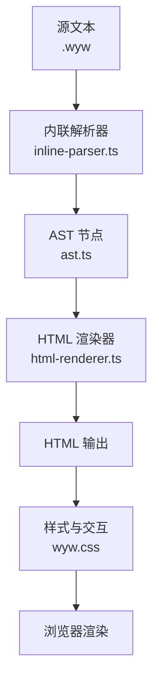
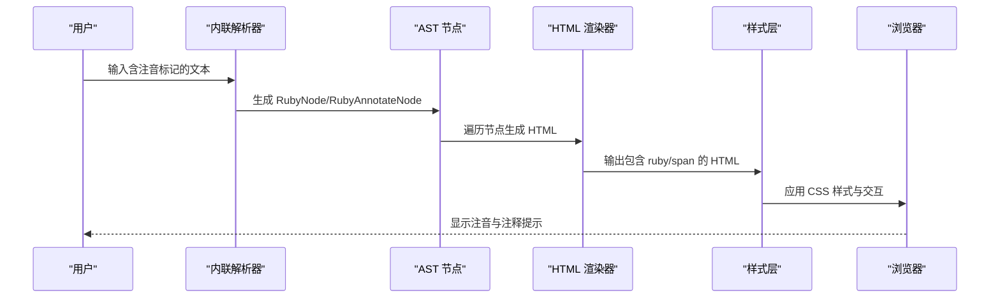
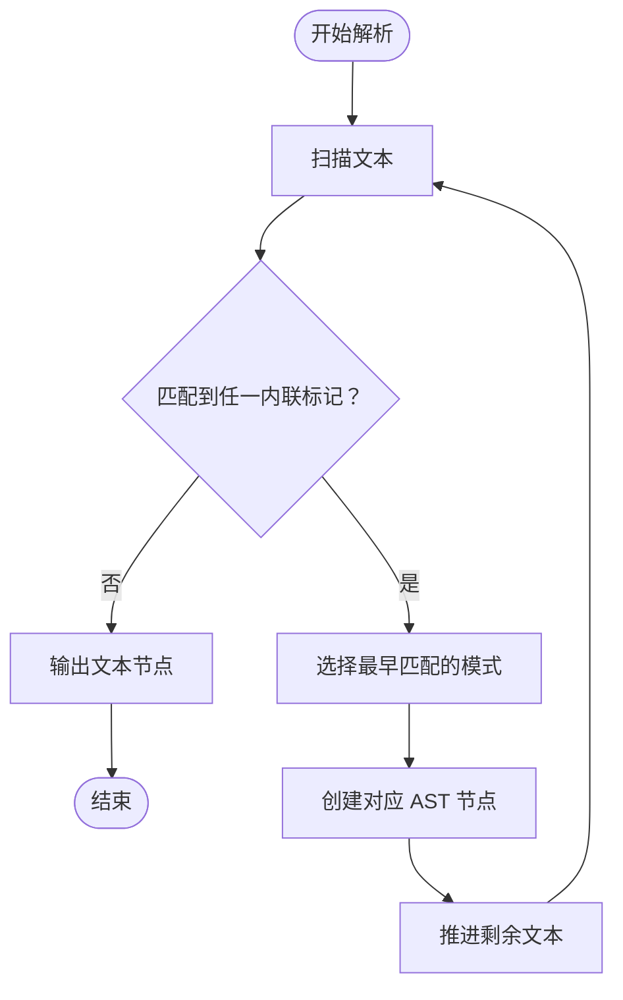
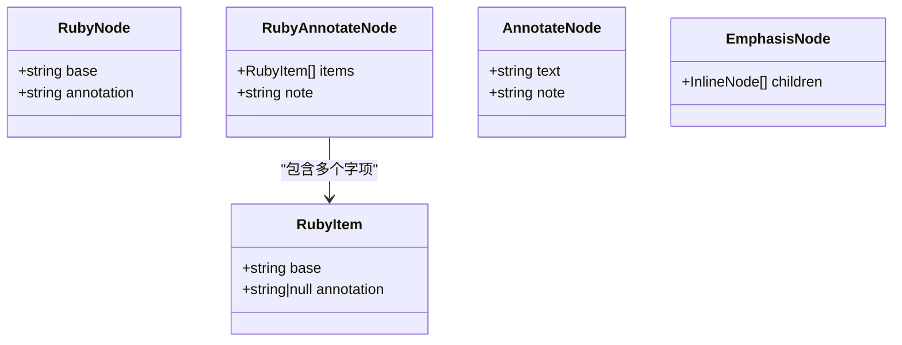
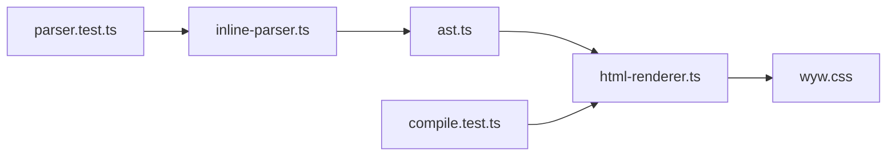

# 注音标记

<cite>
**本文引用的文件**
- [src/parser/inline-parser.ts](file://src/parser/inline-parser.ts)
- [src/renderer/html-renderer.ts](file://src/renderer/html-renderer.ts)
- [src/parser/ast.ts](file://src/parser/ast.ts)
- [src/assets/wyw.css](file://src/assets/wyw.css)
- [docs/syntax-guide.md](file://docs/syntax-guide.md)
- [examples/刘禹锡_陋室铭.wyw](file://examples/刘禹锡_陋室铭.wyw)
- [examples/范仲淹_岳阳楼记.wyw](file://examples/范仲淹_岳阳楼记.wyw)
- [examples/郦道元_三峡.wyw](file://examples/郦道元_三峡.wyw)
- [test/parser.test.ts](file://test/parser.test.ts)
- [test/compile.test.ts](file://test/compile.test.ts)
- [README.md](file://README.md)
</cite>

## 目录
1. [简介](#简介)
2. [项目结构](#项目结构)
3. [核心组件](#核心组件)
4. [架构总览](#架构总览)
5. [详细组件分析](#详细组件分析)
6. [依赖关系分析](#依赖关系分析)
7. [性能考量](#性能考量)
8. [故障排查指南](#故障排查指南)
9. [结论](#结论)
10. [附录](#附录)

## 简介
本节面向文言文注音标记语法“{字|拼音}”的规范与实现进行系统化说明，覆盖语法定义、解析流程、HTML 渲染机制、样式与交互行为，并给出与其它内联语法的组合规则、标准化建议与最佳实践。读者无需具备深厚前端背景即可理解与正确使用该语法。

## 项目结构
本项目采用分层架构：
- 解析层：负责将源文本解析为 AST（抽象语法树），内联语法解析器处理“{字|拼音}”等内联标记。
- 渲染层：将 AST 转换为 HTML 字符串，内联节点渲染为 HTML 的 ruby 标注与注释提示。
- 样式层：通过 CSS 控制注音的字体、尺寸、位置以及注释提示的显示与对齐。
- 示例与测试：提供真实文言文示例与单元测试，验证注音标记的解析与渲染。

图表来源
- [src/parser/inline-parser.ts:1-99](file://src/parser/inline-parser.ts#L1-L99)
- [src/parser/ast.ts:1-218](file://src/parser/ast.ts#L1-L218)
- [src/renderer/html-renderer.ts:1-251](file://src/renderer/html-renderer.ts#L1-L251)
- [src/assets/wyw.css:223-313](file://src/assets/wyw.css#L223-L313)

章节来源
- [README.md:110-126](file://README.md#L110-L126)

## 核心组件
- 内联解析器：识别并解析“{字|拼音}”、“[{字|拼音}](释义)”、“[词](释义)”、“*强调*”等内联标记，生成对应的 AST 节点。
- AST 节点：定义文本、注音、注释、强调、注音+注释组合等节点类型及其工厂函数。
- HTML 渲染器：将 AST 节点渲染为 HTML，注音节点渲染为 HTML 的 ruby 标签，注释节点渲染为带 data-note 的 span。
- 样式与交互：CSS 控制注音字体、字号、行高，以及注释提示的显示与定位。

章节来源
- [src/parser/inline-parser.ts:21-46](file://src/parser/inline-parser.ts#L21-L46)
- [src/parser/ast.ts:18-51](file://src/parser/ast.ts#L18-L51)
- [src/renderer/html-renderer.ts:195-233](file://src/renderer/html-renderer.ts#L195-L233)
- [src/assets/wyw.css:223-313](file://src/assets/wyw.css#L223-L313)

## 架构总览
注音标记的端到端流程如下：
- 输入：源文本中出现“{字|拼音}”或“[{字|拼音}](释义)”等标记。
- 解析：内联解析器按优先级匹配正则，生成 RubyNode 或 RubyAnnotateNode。
- 渲染：HTML 渲染器将 RubyNode 渲染为 ruby 标签，RubyAnnotateNode 渲染为带注释提示的 ruby 或 span。
- 样式：wyw.css 控制注音字体、字号、行高，以及注释提示的显示与定位。

图表来源
- [src/parser/inline-parser.ts:62-98](file://src/parser/inline-parser.ts#L62-L98)
- [src/renderer/html-renderer.ts:195-233](file://src/renderer/html-renderer.ts#L195-L233)
- [src/assets/wyw.css:223-313](file://src/assets/wyw.css#L223-L313)

## 详细组件分析

### 语法规范与解析规则
- 单字注音：使用“{字|拼音}”，解析器将其转换为 RubyNode，渲染为 HTML 的 ruby 标签。
- 注音+注释组合（单字）：使用“[{字|拼音}](释义)”，解析器生成 RubyAnnotateNode，内部为单字注音+注释。
- 注音+注释组合（整词）：使用“[{字|拼音}{字}...](释义)”，解析器生成 RubyAnnotateNode，内部 items 数组包含多个字项，部分字带注音。
- 优先级：解析器按固定顺序匹配正则，确保“注音+注释组合”优先于“注音”和“注释”，避免误判。
- 边界与转义：解析器对花括号与中括号内的嵌套做了处理，避免错误匹配。

图表来源
- [src/parser/inline-parser.ts:62-98](file://src/parser/inline-parser.ts#L62-L98)

章节来源
- [src/parser/inline-parser.ts:21-46](file://src/parser/inline-parser.ts#L21-L46)
- [src/parser/inline-parser.ts:51-57](file://src/parser/inline-parser.ts#L51-L57)
- [test/parser.test.ts:54-166](file://test/parser.test.ts#L54-L166)

### HTML 渲染与 Ruby 标注实现
- RubyNode 渲染：将 base 与 annotation 渲染为 HTML 的 ruby 标签，内部包含 rp 与 rt，便于屏幕阅读器与无障碍访问。
- RubyAnnotateNode 渲染：
  - 单字注音+注释：外层为 ruby，内部注音字带有 wyw-annotate 类与 data-note 属性，鼠标悬停显示注释。
  - 多字注音+注释：外层为 ruby，内部每个带注音的字渲染为 ruby，未注音字直接输出文本；外层 span 统一承载注释提示。
- 注释节点（AnnotateNode）：渲染为带 data-note 的 span，用于整词注释，不包含注音。

图表来源
- [src/parser/ast.ts:18-51](file://src/parser/ast.ts#L18-L51)

章节来源
- [src/renderer/html-renderer.ts:195-233](file://src/renderer/html-renderer.ts#L195-L233)
- [src/assets/wyw.css:223-313](file://src/assets/wyw.css#L223-L313)

### 样式与交互（Ruby 与注释提示）
- 注音样式：ruby rt 使用较小字号与特定字体族，保证与正文协调。
- 注释提示：.wyw-annotate 通过伪元素 ::before 显示 data-note 内容，悬停显示；支持左右对齐属性以适配窄屏。
- 行高与注音：当启用注音模式时，正文段落行高增加，避免注音与正文重叠。
- 无障碍：HTML 中包含 rp 标签，帮助读屏软件正确朗读注音。

章节来源
- [src/assets/wyw.css:223-313](file://src/assets/wyw.css#L223-L313)
- [src/renderer/html-renderer.ts:200-225](file://src/renderer/html-renderer.ts#L200-L225)

### 与其它内联语法的组合规则
- 注音与注释组合可与“*强调*”等内联语法混合使用，解析器按优先级匹配，最终渲染为嵌套的 HTML 结构。
- 相邻的注音+注释组合与普通注释不会相互干扰，分别渲染为不同的节点类型。
- 嵌套强调：强调标记支持内部嵌套其他内联语法，包括注音与注释。

章节来源
- [test/parser.test.ts:128-153](file://test/parser.test.ts#L128-L153)
- [docs/syntax-guide.md:124-190](file://docs/syntax-guide.md#L124-L190)

### 实际示例与用法
- 单字注音示例：在“陋室铭”“岳阳楼记”“三峡”等示例中广泛使用“{字|拼音}”。
- 注音+注释组合（单字）：如“[{晓|xiǎo}](天刚亮的时候)”。
- 注音+注释组合（整词）：如“[{穹|qióng}{庐}]”“[{邺|ye}{城}{戍|shù}]”。
- 与强调、注释混用：示例中可见“*强调*”与“[词](释义)”与注音标记共同出现。

章节来源
- [examples/刘禹锡_陋室铭.wyw:8-16](file://examples/刘禹锡_陋室铭.wyw#L8-L16)
- [examples/范仲淹_岳阳楼记.wyw:9-25](file://examples/范仲淹_岳阳楼记.wyw#L9-L25)
- [examples/郦道元_三峡.wyw:9-22](file://examples/郦道元_三峡.wyw#L9-L22)
- [test/parser.test.ts:87-126](file://test/parser.test.ts#L87-L126)

## 依赖关系分析
- 内联解析器依赖 AST 工厂函数创建节点。
- HTML 渲染器依赖内联解析器生成的 AST 节点。
- 样式层依赖 HTML 渲染器输出的结构（ruby、span、data-note）。
- 测试用例覆盖解析与渲染的关键路径，确保注音标记的正确性。

图表来源
- [src/parser/inline-parser.ts:4-11](file://src/parser/inline-parser.ts#L4-L11)
- [src/parser/ast.ts:190-217](file://src/parser/ast.ts#L190-L217)
- [src/renderer/html-renderer.ts:4-15](file://src/renderer/html-renderer.ts#L4-L15)
- [src/assets/wyw.css:223-313](file://src/assets/wyw.css#L223-L313)
- [test/parser.test.ts:4-6](file://test/parser.test.ts#L4-L6)
- [test/compile.test.ts:6](file://test/compile.test.ts#L6)

章节来源
- [src/parser/inline-parser.ts:1-99](file://src/parser/inline-parser.ts#L1-L99)
- [src/renderer/html-renderer.ts:1-251](file://src/renderer/html-renderer.ts#L1-L251)
- [src/parser/ast.ts:1-218](file://src/parser/ast.ts#L1-L218)

## 性能考量
- 解析阶段：内联解析器采用从左到右扫描与优先级匹配策略，时间复杂度近似 O(n)，其中 n 为文本长度。
- 渲染阶段：HTML 渲染器遍历 AST 节点，渲染开销与节点数量线性相关。
- 样式层：CSS 仅控制注音与注释提示，对性能影响可忽略。
- 建议：在大型文言文文档中，保持注音标记简洁明确，避免过度嵌套，有助于提升渲染效率与可读性。

## 故障排查指南
- 注音未生效
  - 检查是否使用了正确的“{字|拼音}”格式，避免在花括号内误用特殊字符。
  - 确认 HTML 渲染器已输出 ruby 标签。
- 注释提示不显示
  - 检查注释节点是否正确渲染为带 data-note 的 span。
  - 确认 wyw.css 中注释提示样式未被覆盖。
- 注音与注释组合异常
  - 确认“[{字|拼音}](释义)”格式正确，且中括号内仅包含字块与注音。
  - 避免在注音块中使用不允许的嵌套字符。
- 与强调标记混用问题
  - 确保强调标记内部可嵌套注音与注释，但注意不要破坏注音块的边界。

章节来源
- [src/renderer/html-renderer.ts:195-233](file://src/renderer/html-renderer.ts#L195-L233)
- [src/assets/wyw.css:240-313](file://src/assets/wyw.css#L240-L313)
- [test/parser.test.ts:128-153](file://test/parser.test.ts#L128-L153)

## 结论
“{字|拼音}”注音标记语法在本项目中通过清晰的解析与渲染流程实现了稳定的注音与注释能力。结合 CSS 的样式与交互设计，用户可在浏览器中获得良好的文言文阅读体验。遵循本文档的规范与最佳实践，可有效提升注音标记的准确性与一致性。

## 附录

### 语法速查与示例
- 单字注音：{字|拼音}
- 注释：[词](释义)
- 注音+注释（单字）：[{字|拼音}](释义)
- 注音+注释（整词）：[{字|拼音}{字}...](释义)
- 强调：*文本*

章节来源
- [docs/syntax-guide.md:224-241](file://docs/syntax-guide.md#L224-L241)
- [examples/范仲淹_岳阳楼记.wyw:9-25](file://examples/范仲淹_岳阳楼记.wyw#L9-L25)
- [examples/郦道元_三峡.wyw:9-22](file://examples/郦道元_三峡.wyw#L9-L22)