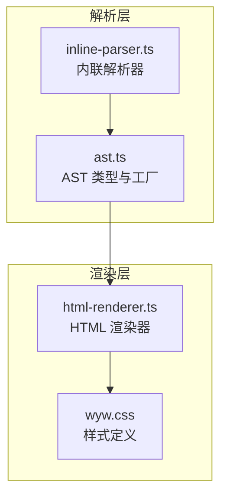
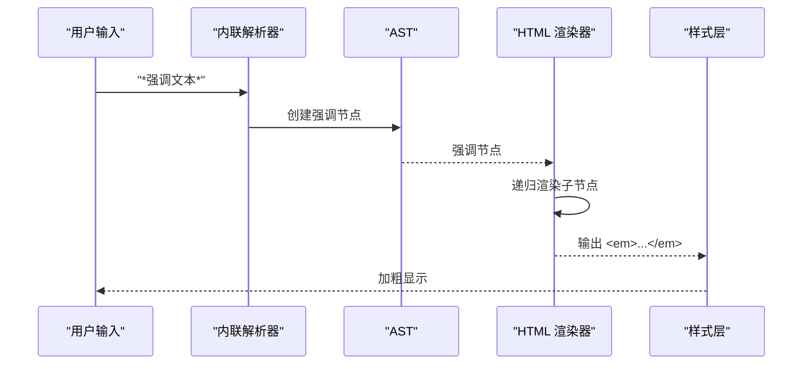
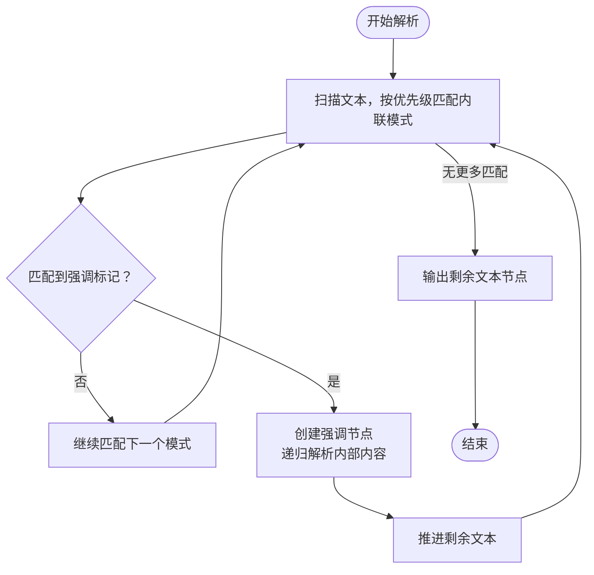
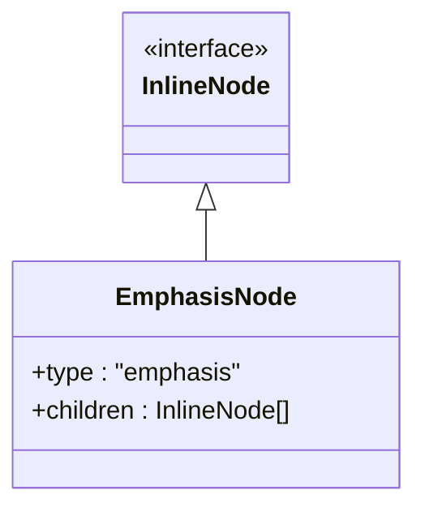
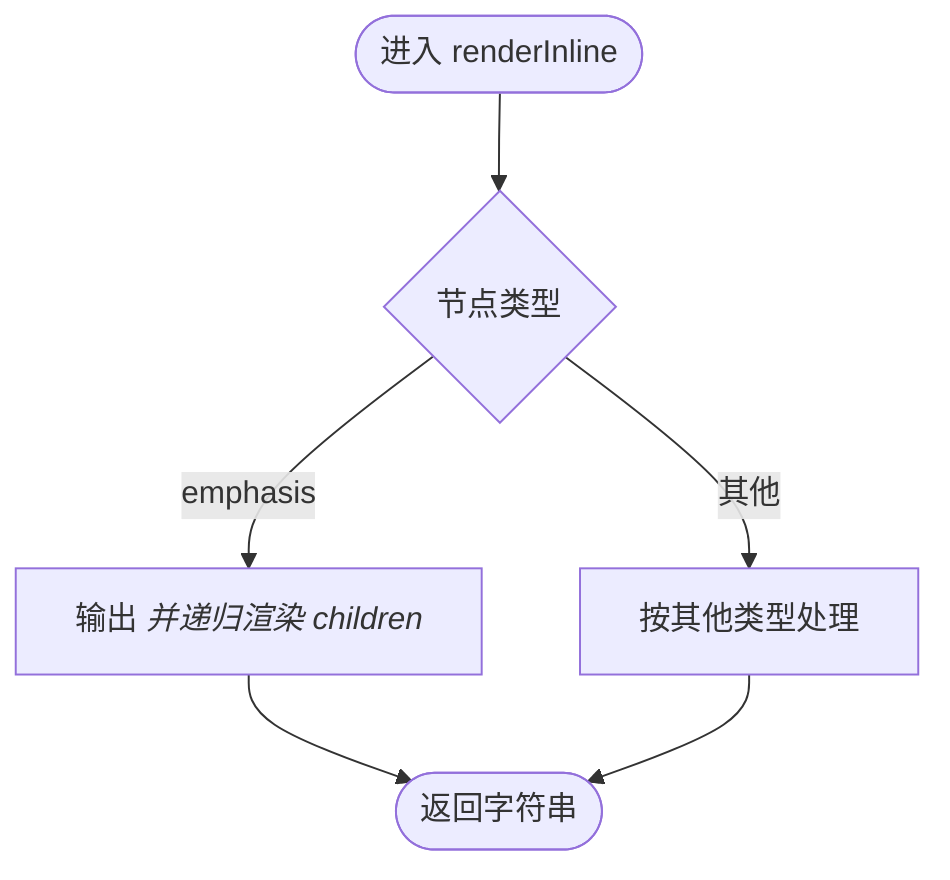
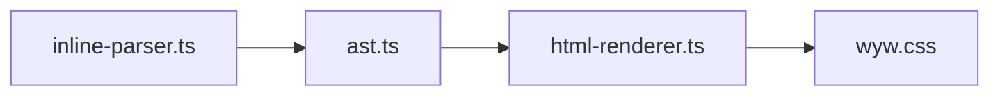

# 着重标记

<cite>
**本文引用的文件列表**
- [src/parser/inline-parser.ts](file://src/parser/inline-parser.ts)
- [src/renderer/html-renderer.ts](file://src/renderer/html-renderer.ts)
- [src/parser/ast.ts](file://src/parser/ast.ts)
- [src/assets/wyw.css](file://src/assets/wyw.css)
- [docs/syntax-guide.md](file://docs/syntax-guide.md)
- [test/parser.test.ts](file://test/parser.test.ts)
- [examples/刘禹锡_陋室铭.wyw](file://examples/刘禹锡_陋室铭.wyw)
- [test/demo/刘禹锡_陋室铭.wyw](file://test/demo/刘禹锡_陋室铭.wyw)
- [skill/wyw-writer/examples.md](file://skill/wyw-writer/examples.md)
</cite>

## 目录
1. [简介](#简介)
2. [项目结构](#项目结构)
3. [核心组件](#核心组件)
4. [架构总览](#架构总览)
5. [详细组件分析](#详细组件分析)
6. [依赖关系分析](#依赖关系分析)
7. [性能考量](#性能考量)
8. [故障排查指南](#故障排查指南)
9. [结论](#结论)
10. [附录](#附录)

## 简介
本节聚焦于文言文标记语言中的“着重标记”语法，即使用星号包围的文本片段（例如：*文本*），用于在文言文阅读中突出强调某些关键词汇或短语。该语法在解析阶段被识别为强调节点，并在渲染阶段通过 HTML 的 emphasis 元素进行呈现，通常表现为加粗显示，以增强语义重点与阅读节奏。

## 项目结构
着重标记的实现贯穿“解析—抽象语法树—渲染”的完整链路，涉及内联解析器、AST 类型定义、HTML 渲染器以及样式层的配合。

图表来源
- [src/parser/inline-parser.ts:1-99](file://src/parser/inline-parser.ts#L1-L99)
- [src/parser/ast.ts:1-218](file://src/parser/ast.ts#L1-L218)
- [src/renderer/html-renderer.ts:1-251](file://src/renderer/html-renderer.ts#L1-L251)
- [src/assets/wyw.css:314-319](file://src/assets/wyw.css#L314-L319)

章节来源
- [src/parser/inline-parser.ts:1-99](file://src/parser/inline-parser.ts#L1-L99)
- [src/renderer/html-renderer.ts:188-233](file://src/renderer/html-renderer.ts#L188-L233)
- [src/parser/ast.ts:30-33](file://src/parser/ast.ts#L30-L33)

## 核心组件
- 内联解析器：负责识别并构建强调节点，支持与注音、注释等内联语法的嵌套与混合。
- AST 类型与工厂：定义强调节点类型与构造函数，确保解析结果可被渲染器消费。
- HTML 渲染器：将强调节点渲染为 HTML emphasis 元素，并处理其子节点的递归渲染。
- 样式层：通过 CSS 将 emphasis 元素呈现为加粗文本，配合字体族与权重实现视觉强调。

章节来源
- [src/parser/inline-parser.ts:41-46](file://src/parser/inline-parser.ts#L41-L46)
- [src/parser/ast.ts:30-33](file://src/parser/ast.ts#L30-L33)
- [src/renderer/html-renderer.ts:227-228](file://src/renderer/html-renderer.ts#L227-L228)
- [src/assets/wyw.css:314-319](file://src/assets/wyw.css#L314-L319)

## 架构总览
着重标记的处理流程如下：输入文本经内联解析器识别星号包裹的强调片段，生成强调节点；随后渲染器遍历 AST，将强调节点转换为 HTML emphasis 标签；最终样式层将 emphasis 渲染为加粗文本。

图表来源
- [src/parser/inline-parser.ts:41-46](file://src/parser/inline-parser.ts#L41-L46)
- [src/renderer/html-renderer.ts:227-228](file://src/renderer/html-renderer.ts#L227-L228)
- [src/assets/wyw.css:314-319](file://src/assets/wyw.css#L314-L319)

## 详细组件分析

### 内联解析器中的着重标记
- 语法识别：着重标记采用正则表达式匹配“两侧星号且中间内容非空”的模式，确保不会误匹配孤立星号。
- 嵌套处理：强调节点的子节点同样通过内联解析器递归解析，因此强调内部可继续嵌套注音、注释等内联语法。
- 优先级：在内联解析器的优先级序列中，着重标记位于注音+注释组合、注音、注释之后，保证更复杂的组合先被识别，再在内部进行强调标记的解析。

图表来源
- [src/parser/inline-parser.ts:62-98](file://src/parser/inline-parser.ts#L62-L98)

章节来源
- [src/parser/inline-parser.ts:41-46](file://src/parser/inline-parser.ts#L41-L46)
- [src/parser/inline-parser.ts:62-98](file://src/parser/inline-parser.ts#L62-L98)

### AST 类型与工厂
- 强调节点类型：包含类型标识与子节点数组，便于渲染器统一处理。
- 工厂函数：提供创建强调节点的便捷接口，确保调用方无需关心内部结构细节。

图表来源
- [src/parser/ast.ts:30-33](file://src/parser/ast.ts#L30-L33)

章节来源
- [src/parser/ast.ts:30-33](file://src/parser/ast.ts#L30-L33)
- [src/parser/ast.ts:204-206](file://src/parser/ast.ts#L204-L206)

### HTML 渲染器中的强调渲染
- 节点类型分支：渲染器在处理内联节点时，遇到强调节点即输出 emphasis 标签，并递归渲染其子节点。
- 子节点处理：强调节点的 children 同样是内联节点数组，渲染器会逐一处理，从而支持嵌套语法。

图表来源
- [src/renderer/html-renderer.ts:195-233](file://src/renderer/html-renderer.ts#L195-L233)

章节来源
- [src/renderer/html-renderer.ts:227-228](file://src/renderer/html-renderer.ts#L227-L228)
- [src/renderer/html-renderer.ts:190-193](file://src/renderer/html-renderer.ts#L190-L193)

### 样式层的强调呈现
- CSS 规则：emphasis 元素被设置为正常字体风格、加粗权重，并指定特定字体族，确保在文言文阅读中具有清晰的视觉强调效果。
- 字体与排版：样式层整体遵循文言文阅读的排版需求，强调文本与正文保持一致的阅读节奏与间距。

章节来源
- [src/assets/wyw.css:314-319](file://src/assets/wyw.css#L314-L319)

### 语法规范与使用方法
- 基本语法：使用星号包围需要强调的文本，内容必须非空，两侧星号不参与渲染。
- 嵌套规则：强调标记内部可继续嵌套注音、注释等内联语法，解析器会先识别更复杂的组合，再在内部进行强调标记的解析。
- 与其他内联语法的兼容性：强调标记与注音、注释、注音+注释组合可自由混合使用，解析器按优先级顺序处理，最终渲染器统一输出 HTML。
- HTML 渲染效果：强调文本在浏览器中以 emphasis 元素呈现，默认表现为加粗显示，符合文言文阅读中的强调语义。

章节来源
- [src/parser/inline-parser.ts:41-46](file://src/parser/inline-parser.ts#L41-L46)
- [src/renderer/html-renderer.ts:227-228](file://src/renderer/html-renderer.ts#L227-L228)
- [docs/syntax-guide.md:182-189](file://docs/syntax-guide.md#L182-L189)

### 实际示例与应用场景
- 示例一：基础强调
  - 输入：*山不在高，有仙则名*。水不在深，有龙则灵。
  - 效果：强调句首短语，突出主题。
  - 参考：[examples/刘禹锡_陋室铭.wyw:7-8](file://examples/刘禹锡_陋室铭.wyw#L7-L8)
- 示例二：强调与注音、注释混合
  - 输入：*孔子*云：[何陋之有](有什么简陋的呢？语出《论语·子罕》)？
  - 效果：强调人物名称，同时提供注释说明。
  - 参考：[examples/刘禹锡_陋室铭.wyw:19](file://examples/刘禹锡_陋室铭.wyw#L19)
- 示例三：强调与注音+注释组合
  - 输入：*一男*附书至，*二男*新战死。
  - 效果：强调数量词，突出情感色彩。
  - 参考：[test/demo/刘禹锡_陋室铭.wyw:89](file://test/demo/刘禹锡_陋室铭.wyw#L89)
- 示例四：强调在诗词中的应用
  - 输入：*危急存亡*之秋
  - 效果：强调历史时刻，增强紧迫感。
  - 参考：[test/parser.test.ts:77-85](file://test/parser.test.ts#L77-L85)

章节来源
- [examples/刘禹锡_陋室铭.wyw:7-8](file://examples/刘禹锡_陋室铭.wyw#L7-L8)
- [examples/刘禹锡_陋室铭.wyw:19](file://examples/刘禹锡_陋室铭.wyw#L19)
- [test/demo/刘禹锡_陋室铭.wyw:89](file://test/demo/刘禹锡_陋室铭.wyw#L89)
- [test/parser.test.ts:77-85](file://test/parser.test.ts#L77-L85)

### 语境指导与效果评估
- 语境指导
  - 在文言文阅读中，着重标记适用于强调主题、人物、时间、地点等关键信息，帮助读者快速把握文本重点。
  - 当强调对象包含注音或注释时，建议将强调标记置于外层，以便在渲染后仍能保留注音与注释的交互功能。
- 效果评估
  - 视觉层面：强调文本以加粗形式呈现，与正文形成层次区分，提升阅读节奏感。
  - 语义层面：强调标记明确传达作者意图，有助于读者理解文本的语气与重点。
  - 兼容性：强调标记与注音、注释等内联语法协同工作，不影响注释提示与注音显示的可用性。

章节来源
- [src/assets/wyw.css:314-319](file://src/assets/wyw.css#L314-L319)
- [docs/syntax-guide.md:182-189](file://docs/syntax-guide.md#L182-L189)

## 依赖关系分析
着重标记的实现依赖于解析器、AST 与渲染器之间的协作，以及样式层对 emphasis 元素的定制化呈现。

图表来源
- [src/parser/inline-parser.ts:1-11](file://src/parser/inline-parser.ts#L1-L11)
- [src/parser/ast.ts:190-217](file://src/parser/ast.ts#L190-L217)
- [src/renderer/html-renderer.ts:4-15](file://src/renderer/html-renderer.ts#L4-L15)
- [src/assets/wyw.css:314-319](file://src/assets/wyw.css#L314-L319)

章节来源
- [src/parser/inline-parser.ts:1-11](file://src/parser/inline-parser.ts#L1-L11)
- [src/parser/ast.ts:190-217](file://src/parser/ast.ts#L190-L217)
- [src/renderer/html-renderer.ts:4-15](file://src/renderer/html-renderer.ts#L4-L15)

## 性能考量
- 解析效率：内联解析器采用从左到右扫描与优先级匹配策略，时间复杂度与输入长度线性相关，适合大规模文言文文本的快速解析。
- 渲染效率：渲染器对强调节点的处理为常数开销，递归渲染子节点的成本与子节点数量成正比，整体开销可控。
- 样式层：CSS 对 emphasis 的处理为轻量级样式计算，对页面渲染性能影响极小。

## 故障排查指南
- 症状：强调标记未生效
  - 排查要点：确认星号包裹的内容非空；检查是否存在与注音+注释组合的优先级冲突；验证渲染器是否正确输出 emphasis 标签。
  - 参考：[src/parser/inline-parser.ts:41-46](file://src/parser/inline-parser.ts#L41-L46), [src/renderer/html-renderer.ts:227-228](file://src/renderer/html-renderer.ts#L227-L228)
- 症状：强调内部的注音或注释未显示
  - 排查要点：确认强调标记位于外层，内部语法正确；检查注音与注释的正则是否被优先识别；验证渲染器对子节点的递归渲染逻辑。
  - 参考：[src/parser/inline-parser.ts:62-98](file://src/parser/inline-parser.ts#L62-L98), [src/renderer/html-renderer.ts:190-193](file://src/renderer/html-renderer.ts#L190-L193)
- 症状：强调文本未加粗
  - 排查要点：确认 CSS 中 emphasis 的样式规则是否生效；检查字体族与权重设置是否被覆盖。
  - 参考：[src/assets/wyw.css:314-319](file://src/assets/wyw.css#L314-L319)

章节来源
- [src/parser/inline-parser.ts:41-46](file://src/parser/inline-parser.ts#L41-L46)
- [src/renderer/html-renderer.ts:227-228](file://src/renderer/html-renderer.ts#L227-L228)
- [src/assets/wyw.css:314-319](file://src/assets/wyw.css#L314-L319)

## 结论
着重标记语法在文言文标记语言中承担着强调语义、提升阅读体验的重要角色。其实现基于清晰的解析—渲染—样式三层协作：内联解析器负责识别与构建强调节点，AST 提供统一的数据结构，HTML 渲染器将其转换为 emphasis 元素，样式层确保加粗呈现。该语法与注音、注释等内联语法高度兼容，可在复杂文本中灵活组合，满足文言文阅读的多样化需求。

## 附录
- 更多示例参考
  - 基础强调与注释混合：[examples/刘禹锡_陋室铭.wyw:19](file://examples/刘禹锡_陋室铭.wyw#L19)
  - 强调在诗词中的应用：[test/demo/刘禹锡_陋室铭.wyw:89](file://test/demo/刘禹锡_陋室铭.wyw#L89)
  - 语法速查与注意事项：[docs/syntax-guide.md:182-189](file://docs/syntax-guide.md#L182-L189)