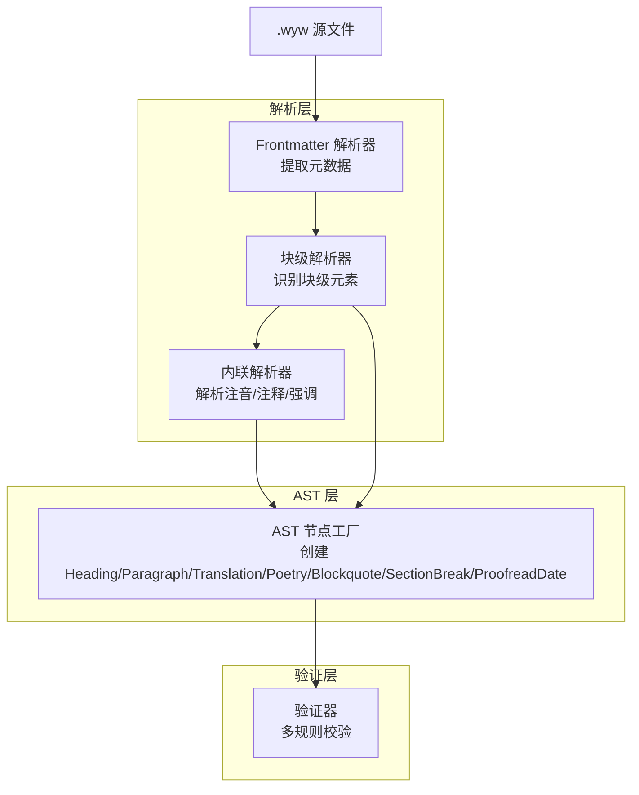
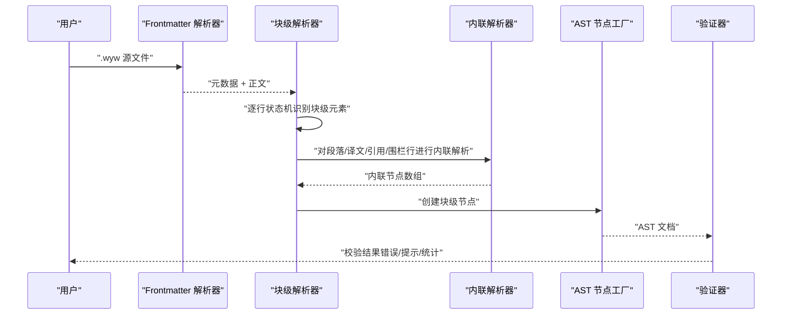
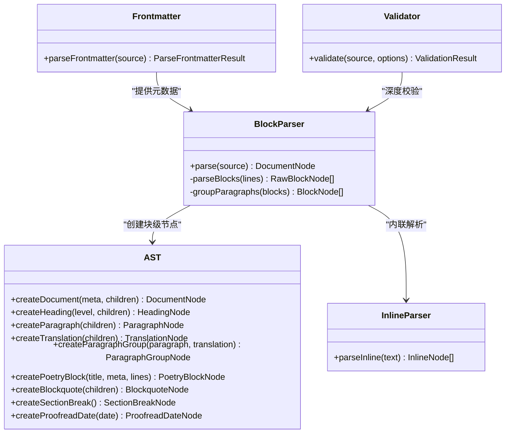
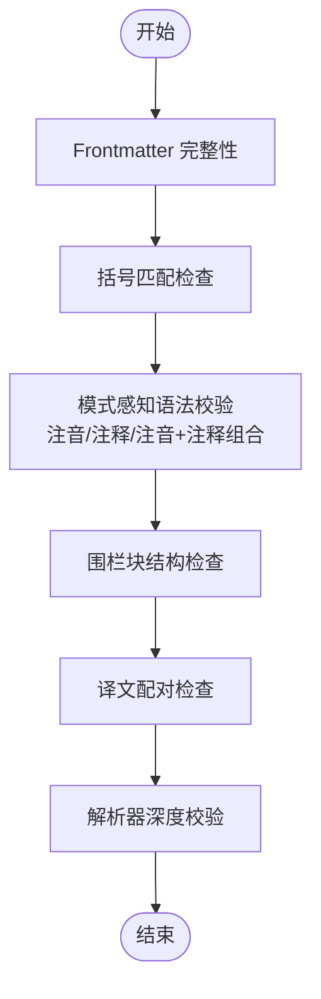

# 块级语法

<cite>
**本文引用的文件**
- [src/parser/block-parser.ts](file://src/parser/block-parser.ts)
- [src/parser/ast.ts](file://src/parser/ast.ts)
- [src/parser/frontmatter.ts](file://src/parser/frontmatter.ts)
- [src/parser/inline-parser.ts](file://src/parser/inline-parser.ts)
- [src/validator.ts](file://src/validator.ts)
- [docs/syntax-guide.md](file://docs/syntax-guide.md)
- [examples/范仲淹_岳阳楼记.wyw](file://examples/范仲淹_岳阳楼记.wyw)
- [examples/郦道元_三峡.wyw](file://examples/郦道元_三峡.wyw)
- [test/demo/李清照_声声慢·寻寻觅觅.wyw](file://test/demo/李清照_声声慢·寻寻觅觅.wyw)
- [test/parser.test.ts](file://test/parser.test.ts)
- [test/validator.test.ts](file://test/validator.test.ts)
</cite>

## 目录
1. [简介](#简介)
2. [项目结构](#项目结构)
3. [核心组件](#核心组件)
4. [架构总览](#架构总览)
5. [详细组件分析](#详细组件分析)
6. [依赖关系分析](#依赖关系分析)
7. [性能考量](#性能考量)
8. [故障排查指南](#故障排查指南)
9. [结论](#结论)
10. [附录](#附录)

## 简介
本文件系统性梳理文言文标记语言（.wyw）的“块级语法”。围绕标题、段落、译文、引用块、分隔线、校对日期、诗词围栏块等块级元素，给出定义、使用示例与实际效果说明，并解释它们之间的关系与嵌套规则。同时提供语法验证规则、常见错误与解决方案，帮助作者规范书写与高效排错。

## 项目结构
- 解析器分为三层：
  - 块级解析器：识别并组织块级元素（标题、段落、译文、引用、围栏、分隔线、校对日期）
  - 内联解析器：在块级元素内部解析注音、注释、强调等内联标记
  - AST 抽象语法树：统一描述文档结构
- 验证器：对 .wyw 文件进行多维度格式校验（Frontmatter、括号匹配、模式感知语法、围栏块、译文配对、解析器深度校验）

图表来源
- [src/parser/block-parser.ts:43-49](file://src/parser/block-parser.ts#L43-L49)
- [src/parser/inline-parser.ts:62-98](file://src/parser/inline-parser.ts#L62-L98)
- [src/parser/frontmatter.ts:14-56](file://src/parser/frontmatter.ts#L14-L56)
- [src/validator.ts:758-779](file://src/validator.ts#L758-L779)

章节来源
- [src/parser/block-parser.ts:43-49](file://src/parser/block-parser.ts#L43-L49)
- [src/parser/inline-parser.ts:62-98](file://src/parser/inline-parser.ts#L62-L98)
- [src/parser/frontmatter.ts:14-56](file://src/parser/frontmatter.ts#L14-L56)
- [src/validator.ts:758-779](file://src/validator.ts#L758-L779)

## 核心组件
- 块级解析器：基于有限状态机，逐行识别块级元素，维护缓冲区，遇到边界 flush 生成 AST 节点；支持段落组（原文+译文）自动合并。
- AST 节点：统一的块级节点类型（标题、段落、译文、段落组、诗词围栏块、引用块、分隔线、校对日期）。
- 验证器：多规则校验，包括 Frontmatter、括号匹配、注音/注释/注音+注释组合、围栏块、译文配对、解析器深度统计。

章节来源
- [src/parser/block-parser.ts:72-341](file://src/parser/block-parser.ts#L72-L341)
- [src/parser/ast.ts:55-128](file://src/parser/ast.ts#L55-L128)
- [src/validator.ts:104-779](file://src/validator.ts#L104-L779)

## 架构总览
块级语法的识别与处理流程如下：

图表来源
- [src/parser/block-parser.ts:43-49](file://src/parser/block-parser.ts#L43-L49)
- [src/parser/inline-parser.ts:62-98](file://src/parser/inline-parser.ts#L62-L98)
- [src/validator.ts:758-779](file://src/validator.ts#L758-L779)

## 详细组件分析

### 标题（#、##、###）
- 定义与规则
  - 支持 1-3 级标题，以 1-3 个“#”开头，后跟空白与标题内容。
  - 解析后作为 heading 节点，level 为“#”的数量。
- 语法要点
  - 标题行前后无需空行即可识别。
  - 标题内部支持内联语法（注音、注释、强调等）。
- 示例与效果
  - 示例见“语法速查表”与“完整示例”。
  - 效果：渲染为 h1/h2/h3 标题，内部注音/注释/强调生效。
- 嵌套与关系
  - 标题可与段落、译文、围栏块等并列，也可作为诗词围栏块的主标题使用。
- 验证规则
  - 无专门规则，但内联语法遵循注音/注释/强调规则。

章节来源
- [src/parser/block-parser.ts:176-183](file://src/parser/block-parser.ts#L176-L183)
- [src/parser/ast.ts:61-65](file://src/parser/ast.ts#L61-L65)
- [docs/syntax-guide.md:39-47](file://docs/syntax-guide.md#L39-L47)
- [test/parser.test.ts:215-222](file://test/parser.test.ts#L215-L222)

### 段落
- 定义与规则
  - 普通文本行自动识别为段落；段落之间用空行分隔。
  - 多行连续文本在块级解析阶段被合并为一个段落。
- 语法要点
  - 段落内容支持内联语法（注音、注释、强调）。
  - 译文块（>>）会与上方段落自动形成段落组。
- 示例与效果
  - 示例见“语法速查表”与“完整示例”。
  - 效果：渲染为段落，内联标记生效。
- 嵌套与关系
  - 段落可与标题、引用、围栏、分隔线等并列。
  - 译文与段落形成段落组，作为翻译单元。
- 验证规则
  - 无专门规则，但内联语法遵循注音/注释/强调规则。

章节来源
- [src/parser/block-parser.ts:211-238](file://src/parser/block-parser.ts#L211-L238)
- [src/parser/block-parser.ts:346-370](file://src/parser/block-parser.ts#L346-L370)
- [docs/syntax-guide.md:49-57](file://docs/syntax-guide.md#L49-L57)
- [test/parser.test.ts:190-213](file://test/parser.test.ts#L190-L213)

### 译文（>>）
- 定义与规则
  - 以“>>”开头的行表示现代汉语翻译，必须紧随在对应的文言文段落后。
  - 块级解析器会将“>>”行累积为 translation 节点，并与上方 paragraph 自动合并为 paragraph_group。
- 语法要点
  - 支持多行译文（每行均以“>>”开头）。
  - 译文前必须存在非空、非标记的文言文段落，否则校验器给出提示。
- 示例与效果
  - 示例见“语法速查表”与“完整示例”。
  - 效果：渲染为独立的译文块，与原文段落形成段落组。
- 嵌套与关系
  - 译文与段落形成段落组；可与标题、引用、围栏、分隔线等并列。
- 验证规则
  - 译文配对检查：译文前缺少对应段落时报提示。
  - 严格模式下，提示升级为错误。

章节来源
- [src/parser/block-parser.ts:195-201](file://src/parser/block-parser.ts#L195-L201)
- [src/parser/block-parser.ts:241-257](file://src/parser/block-parser.ts#L241-L257)
- [src/parser/block-parser.ts:346-370](file://src/parser/block-parser.ts#L346-L370)
- [src/validator.ts:613-675](file://src/validator.ts#L613-L675)
- [docs/syntax-guide.md:59-72](file://docs/syntax-guide.md#L59-L72)
- [test/validator.test.ts:294-320](file://test/validator.test.ts#L294-L320)

### 引用块（>）
- 定义与规则
  - 以“>”开头的行表示引用内容，排除“>>”译文行。
  - 块级解析器将连续的“>”行累积为 blockquote 节点。
- 语法要点
  - 引用块内部支持内联语法。
  - 与“>>”译文行区分，避免误判。
- 示例与效果
  - 示例见“语法速查表”。
  - 效果：渲染为引用块。
- 嵌套与关系
  - 可与标题、段落、译文、围栏、分隔线等并列。
- 验证规则
  - 无专门规则，但内联语法遵循注音/注释/强调规则。

章节来源
- [src/parser/block-parser.ts:203-209](file://src/parser/block-parser.ts#L203-L209)
- [src/parser/block-parser.ts:303-319](file://src/parser/block-parser.ts#L303-L319)
- [docs/syntax-guide.md:73-80](file://docs/syntax-guide.md#L73-L80)
- [test/parser.test.ts:231-235](file://test/parser.test.ts#L231-L235)

### 分隔线（---）
- 定义与规则
  - 三个或以上连续的“-”构成分隔线，用于章节或段落分隔。
- 语法要点
  - 行内任意位置均可，但通常单独一行。
- 示例与效果
  - 示例见“语法速查表”。
  - 效果：渲染为分隔线。
- 嵌套与关系
  - 可作为段落与译文之间的分隔符。
- 验证规则
  - 无专门规则。

章节来源
- [src/parser/block-parser.ts:160-164](file://src/parser/block-parser.ts#L160-L164)
- [docs/syntax-guide.md:81-87](file://docs/syntax-guide.md#L81-L87)
- [test/parser.test.ts:224-229](file://test/parser.test.ts#L224-L229)

### 校对日期（--YYYY年M月D日--）
- 定义与规则
  - 以“--YYYY 年 M 月 D 日--”形式标记校对日期，生成 proofread_date 节点。
- 语法要点
  - 日期格式固定，必须闭合。
- 示例与效果
  - 示例见“语法速查表”。
  - 效果：渲染为页脚或页脚样式元素。
- 嵌套与关系
  - 可作为文档末尾的页脚信息。
- 验证规则
  - 无专门规则。

章节来源
- [src/parser/block-parser.ts:166-174](file://src/parser/block-parser.ts#L166-L174)
- [src/parser/ast.ts:107-110](file://src/parser/ast.ts#L107-L110)
- [docs/syntax-guide.md:89-95](file://docs/syntax-guide.md#L89-L95)

### 诗词围栏块（::: poetry）
- 定义与规则
  - 使用“::: poetry”开始，以“:::”结束，包裹诗词内容。
  - 围栏内可包含：
    - 标题：以“#”开头的行作为主标题或子标题；
    - 元信息：以“::”开头的行（如作者/朝代信息）。
  - 围栏内每行独立进行内联解析，保留换行结构。
- 语法要点
  - 默认类型为“poetry”，其他类型在严格模式下给出提示。
  - 围栏块内部支持注音、注释、强调等内联语法。
  - 围栏块内部空行用于分隔诗句段落。
- 示例与效果
  - 示例见“语法速查表”与“完整示例”。
  - 效果：渲染为诗词围栏块，支持主标题与元信息。
- 嵌套与关系
  - 可与标题、段落、译文、引用、分隔线等并列。
- 验证规则
  - 围栏块结构检查：未闭合报错误；元信息为空报提示；类型非 poetry 给提示。
  - 严格模式下，提示升级为错误。

章节来源
- [src/parser/block-parser.ts:185-193](file://src/parser/block-parser.ts#L185-L193)
- [src/parser/block-parser.ts:259-301](file://src/parser/block-parser.ts#L259-L301)
- [src/parser/block-parser.ts:165-167](file://src/parser/block-parser.ts#L165-L167)
- [src/parser/ast.ts:91-96](file://src/parser/ast.ts#L91-L96)
- [src/validator.ts:550-610](file://src/validator.ts#L550-L610)
- [docs/syntax-guide.md:97-121](file://docs/syntax-guide.md#L97-L121)
- [test/parser.test.ts:237-253](file://test/parser.test.ts#L237-L253)
- [test/demo/李清照_声声慢·寻寻觅觅.wyw:7-21](file://test/demo/李清照_声声慢·寻寻觅觅.wyw#L7-L21)

### 块级元素关系与嵌套规则
- 关系与顺序
  - 块级元素按出现顺序排列，支持标题、段落、译文、引用、围栏、分隔线、校对日期等并列。
  - 段落与译文自动合并为段落组。
- 嵌套与优先级
  - 围栏块内部支持内联语法，但不包含其他块级元素（如标题、分隔线等）。
  - 引用块与译文块互斥：以“>”开头的行不参与“>>”译文配对。
- 复杂示例
  - “完整示例”展示了标题、段落、译文、引用、分隔线的组合使用。
  - “语法速查表”提供了快速对照。

章节来源
- [src/parser/block-parser.ts:346-370](file://src/parser/block-parser.ts#L346-L370)
- [docs/syntax-guide.md:193-221](file://docs/syntax-guide.md#L193-L221)
- [test/parser.test.ts:169-254](file://test/parser.test.ts#L169-L254)

### 复杂多段落示例与最佳实践
- 多段落示例
  - “范仲淹_岳阳楼记.wyw”展示了多段落与多译文的典型结构。
  - “郦道元_三峡.wyw”展示了自然景观描述与译文的配合。
- 最佳实践
  - 段落之间用空行分隔，避免被合并。
  - 译文必须紧随对应段落，否则校验器提示。
  - 围栏块内部空行用于分隔诗句段落，增强可读性。
  - 标题层级清晰，避免过度嵌套。

章节来源
- [examples/范仲淹_岳阳楼记.wyw:1-31](file://examples/范仲淹_岳阳楼记.wyw#L1-L31)
- [examples/郦道元_三峡.wyw:1-23](file://examples/郦道元_三峡.wyw#L1-L23)

## 依赖关系分析

图表来源
- [src/parser/block-parser.ts:43-49](file://src/parser/block-parser.ts#L43-L49)
- [src/parser/ast.ts:132-188](file://src/parser/ast.ts#L132-L188)
- [src/parser/inline-parser.ts:62-98](file://src/parser/inline-parser.ts#L62-L98)
- [src/parser/frontmatter.ts:14-56](file://src/parser/frontmatter.ts#L14-L56)
- [src/validator.ts:758-779](file://src/validator.ts#L758-L779)

章节来源
- [src/parser/block-parser.ts:43-49](file://src/parser/block-parser.ts#L43-L49)
- [src/parser/ast.ts:132-188](file://src/parser/ast.ts#L132-L188)
- [src/parser/inline-parser.ts:62-98](file://src/parser/inline-parser.ts#L62-L98)
- [src/parser/frontmatter.ts:14-56](file://src/parser/frontmatter.ts#L14-L56)
- [src/validator.ts:758-779](file://src/validator.ts#L758-L779)

## 性能考量
- 时间复杂度
  - 块级解析：O(N)，逐行扫描，状态机常数时间转移。
  - 内联解析：对每行文本进行优先级匹配，整体 O(M)，M 为内联标记数量。
  - 验证器：多轮扫描与一次 AST 遍历，整体 O(N)。
- 空间复杂度
  - 缓冲区与 AST 节点存储与输入规模线性相关。
- 优化建议
  - 合理使用空行分隔段落，减少不必要的 flush 操作。
  - 在围栏块中适当使用空行分隔诗句段落，提高可读性与渲染效率。

[本节为通用性能讨论，不直接分析具体文件]

## 故障排查指南
- Frontmatter 问题
  - 缺少或未闭合：校验器给出“Frontmatter 未闭合”或“缺少 Frontmatter”提示。
  - 缺少必填字段：给出“缺少 'title'/'author'/'dynasty'”提示。
  - 未知字段：给出“未知字段”提示。
- 括号与强调标记
  - 多余闭合括号、交叉嵌套、未闭合括号：报错误。
  - 着重标记“*”不成对：报提示。
- 注音/注释/注音+注释组合
  - 注音多字：普通模式提示，严格模式报错误。
  - 拼音含数字或非法字符：报提示或错误。
  - 注释释义为空：报提示。
  - 注音+注释组合内无有效注音块：报提示（普通注释不触发）。
- 围栏块
  - 未闭合：报错误；元信息为空：报提示；类型非 poetry：报提示。
- 译文配对
  - 译文前缺少段落：报提示；严格模式下升级为错误。
- 解析器深度校验
  - 解析失败：报错误；成功时返回统计信息（段落组、诗词块、标题、注释、注音数量）。

章节来源
- [src/validator.ts:104-779](file://src/validator.ts#L104-L779)
- [test/validator.test.ts:28-425](file://test/validator.test.ts#L28-L425)

## 结论
文言文标记语言的块级语法以简洁明确的标记为核心，结合内联语法实现注音、注释与现代译文的统一表达。通过块级解析器的状态机设计与 AST 节点抽象，实现了稳定的解析与渲染基础。验证器提供多维度校验，帮助作者及时发现并修正语法问题。遵循本文档的规则与最佳实践，可显著提升写作效率与文档质量。

[本节为总结性内容，不直接分析具体文件]

## 附录

### 语法验证流程图

图表来源
- [src/validator.ts:758-779](file://src/validator.ts#L758-L779)

### 语法速查表（节选）
- 块级语法
  - 标题：#、##、###（1-3级）
  - 段落：普通文本行，空行分隔
  - 译文：>> 翻译行，紧随段落
  - 引用：> 引用行
  - 分隔线：---（三个或以上连字符）
  - 校对日期：--YYYY年M月D日--
  - 围栏块：::: poetry（默认类型）
- 内联语法
  - 注音：{字|拼音}
  - 注释：[词](释义)
  - 注音+注释（单字）：[{字|拼音}](释义)
  - 注音+注释（整词）：[{字|拼音}{字}...](释义)
  - 强调：*文本*

章节来源
- [docs/syntax-guide.md:224-241](file://docs/syntax-guide.md#L224-L241)