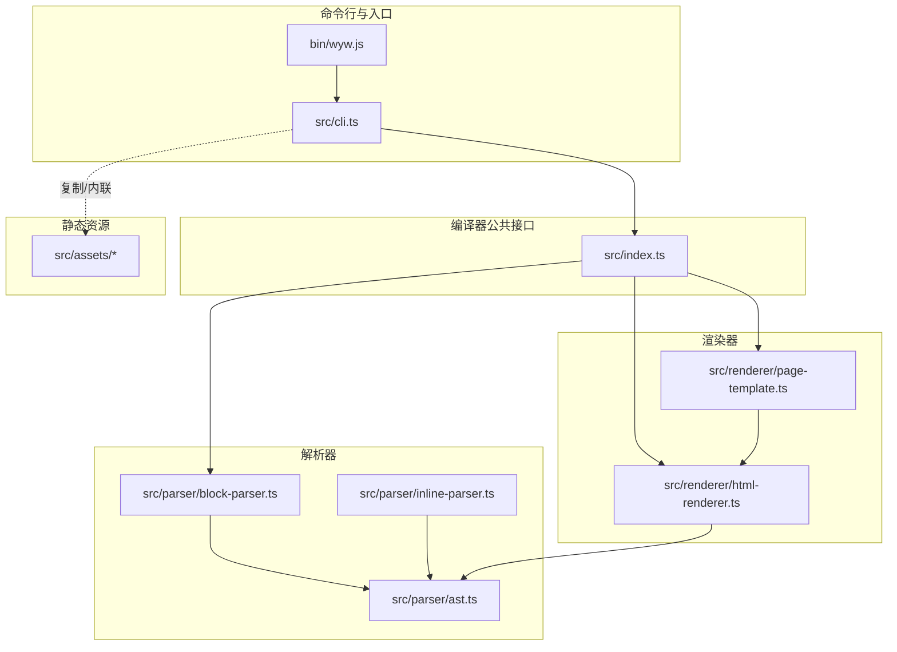
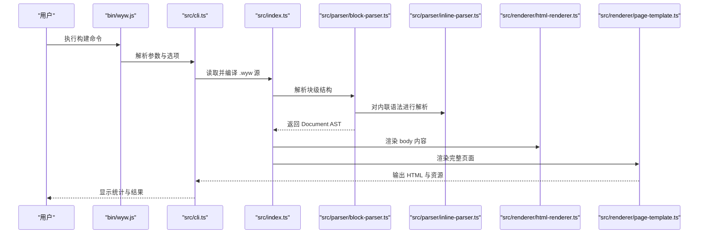
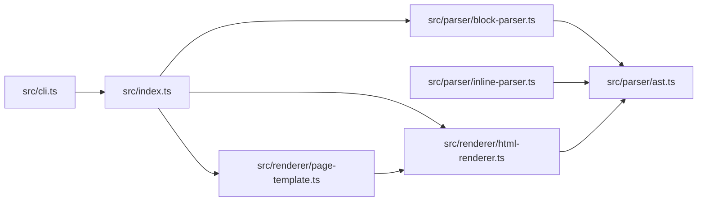

# 完整示例

<cite>
**本文引用的文件**   
- [README.md](file://README.md)
- [docs/syntax-guide.md](file://docs/syntax-guide.md)
- [src/index.ts](file://src/index.ts)
- [src/cli.ts](file://src/cli.ts)
- [src/parser/ast.ts](file://src/parser/ast.ts)
- [src/parser/block-parser.ts](file://src/parser/block-parser.ts)
- [src/parser/inline-parser.ts](file://src/parser/inline-parser.ts)
- [src/renderer/html-renderer.ts](file://src/renderer/html-renderer.ts)
- [src/renderer/page-template.ts](file://src/renderer/page-template.ts)
- [examples/刘禹锡_陋室铭.wyw](file://examples/刘禹锡_陋室铭.wyw)
- [examples/范仲淹_岳阳楼记.wyw](file://examples/范仲淹_岳阳楼记.wyw)
- [examples/郦道元_三峡.wyw](file://examples/郦道元_三峡.wyw)
- [test/demo/李清照_声声慢·寻寻觅觅.wyw](file://test/demo/李清照_声声慢·寻寻觅觅.wyw)
- [skill/wyw-writer/examples.md](file://skill/wyw-writer/examples.md)
- [package.json](file://package.json)
- [bin/wyw.js](file://bin/wyw.js)
</cite>

## 目录
1. [简介](#简介)
2. [项目结构](#项目结构)
3. [核心组件](#核心组件)
4. [架构总览](#架构总览)
5. [详细组件分析](#详细组件分析)
6. [依赖关系分析](#依赖关系分析)
7. [性能考虑](#性能考虑)
8. [故障排查指南](#故障排查指南)
9. [结论](#结论)
10. [附录](#附录)

## 简介
本示例文档面向希望创作专业文言文电子书的读者，提供来自真实文言文作品的完整 .wyw 示例文件，系统讲解语法元素的实际应用与组合方式。通过从简单到复杂的渐进式示例，帮助你掌握注音、注释、译文、诗词围栏、标题与引用等语法的最佳实践，并给出逐行解析与效果说明，便于理解复杂文档的组织方式与排版要点。

## 项目结构
该仓库采用“CLI + 解析器 + 渲染器”的分层设计，核心流程为：命令行接收 .wyw 源文件 → 解析为 AST → 渲染为 HTML 页面。示例文件位于 examples/ 与 test/demo/，语法规范与使用说明见 docs/syntax-guide.md。

图表来源
- [src/cli.ts:116-164](file://src/cli.ts#L116-L164)
- [src/index.ts:17-28](file://src/index.ts#L17-L28)
- [src/parser/block-parser.ts:43-49](file://src/parser/block-parser.ts#L43-L49)
- [src/renderer/html-renderer.ts:20-44](file://src/renderer/html-renderer.ts#L20-L44)
- [src/renderer/page-template.ts:25-68](file://src/renderer/page-template.ts#L25-L68)

章节来源
- [README.md:110-125](file://README.md#L110-L125)
- [package.json:18-27](file://package.json#L18-L27)

## 核心组件
- 编译入口与公共 API：compile 接收源文本与选项，依次完成解析与页面渲染。
- 命令行工具：支持 build/init/validate 子命令，具备监听与内联资源能力。
- 解析器：块级解析（block-parser）与内联解析（inline-parser），配合 AST 类型定义。
- 渲染器：HTML 渲染（html-renderer）与页面模板（page-template），负责输出完整 HTML。

章节来源
- [src/index.ts:17-28](file://src/index.ts#L17-L28)
- [src/cli.ts:28-56](file://src/cli.ts#L28-L56)
- [src/parser/ast.ts:5-118](file://src/parser/ast.ts#L5-L118)
- [src/parser/block-parser.ts:43-49](file://src/parser/block-parser.ts#L43-L49)
- [src/parser/inline-parser.ts:62-98](file://src/parser/inline-parser.ts#L62-L98)
- [src/renderer/html-renderer.ts:20-44](file://src/renderer/html-renderer.ts#L20-L44)
- [src/renderer/page-template.ts:25-68](file://src/renderer/page-template.ts#L25-L68)

## 架构总览
下面的序列图展示了从 .wyw 源文件到 HTML 输出的完整流程，涵盖 CLI、编译器、解析器与渲染器之间的交互。

图表来源
- [bin/wyw.js:1-7](file://bin/wyw.js#L1-L7)
- [src/cli.ts:116-164](file://src/cli.ts#L116-L164)
- [src/index.ts:17-28](file://src/index.ts#L17-L28)
- [src/parser/block-parser.ts:43-49](file://src/parser/block-parser.ts#L43-L49)
- [src/renderer/page-template.ts:25-68](file://src/renderer/page-template.ts#L25-L68)

## 详细组件分析

### 示例一：《陋室铭》（简单到中等复杂度）
- 适用场景：带逐段翻译的散文，适合入门学习注音、注释与译文的组合。
- 关键语法：
  - Frontmatter 元数据：title/author/dynasty
  - 标题：# 一级标题
  - 段落与译文：段落后紧接 >> 翻译
  - 注音：{字|拼音}
  - 注释：[词](释义)
  - 着重：*强调*
  - 引用：> 引用内容
- 组织方式：段落与译文一一对应，段落之间用空行分隔；引用块用于总结性评述。

逐行解析与效果说明（节选）
- 第 7 行：强调句首短语，突出“山不在高”的对比。
- 第 8 行：注音与注释组合，展示“[{斯|sī}{是}{陋|lòu}{室}]”的多字词组注音+注释。
- 第 9-10 行：对应段落的现代文翻译，体现“段—译”配对。
- 第 12-13 行：注音与注释组合，展示“[{苔|tái}{痕|hén}]”的双字注音+注释。
- 第 22 行：引用块，总结全文主旨。

章节来源
- [examples/刘禹锡_陋室铭.wyw:1-22](file://examples/刘禹锡_陋室铭.wyw#L1-L22)
- [docs/syntax-guide.md:193-221](file://docs/syntax-guide.md#L193-L221)

### 示例二：《岳阳楼记》（中等复杂度）
- 适用场景：长篇散文，展示多段落、多译文、分隔线与引用块的综合使用。
- 关键语法：
  - Frontmatter：title/author/dynasty/source/layout
  - 分隔线：--- 用于段落间分隔
  - 引用块：> 名言引用
  - 注音与注释：密集使用，覆盖多处生僻字与成语
- 组织方式：按季节与情感变化分段，每段后跟现代文翻译；文末附写作时间与出处。

逐行解析与效果说明（节选）
- 第 9-11 行：事件背景与人物介绍，注音与注释帮助理解“滕子京”“谪守”等。
- 第 13-15 行：洞庭湖景色描写，注音“{湯|shāng}湯”与成语“勝狀”“大觀”“備”等注释。
- 第 17-19 行：阴雨天气与迁客骚人的悲情，注音“{霪|yín}雨”“{號|háo}”等。
- 第 21-23 行：春和景明与迁客骚人的乐情，注音“{芷|zhǐ}{汀|tīng}”“{璧|bì}”等。
- 第 25-27 行：表达作者政治抱负，注音“{嗟|jiē}夫”“{微|wēi}斯人”等。
- 第 29-31 行：校对日期与落款，体现严谨的版本控制。

章节来源
- [examples/范仲淹_岳阳楼记.wyw:1-31](file://examples/范仲淹_岳阳楼记.wyw#L1-L31)
- [docs/syntax-guide.md:73-95](file://docs/syntax-guide.md#L73-L95)

### 示例三：《三峡》（中等复杂度）
- 适用场景：地理山水类散文，强调节奏与画面感。
- 关键语法：
  - Frontmatter：title/author/dynasty/source/layout
  - 注音与注释：覆盖“{襄|xiāng}陵”“{沿溯}”“{絕巘}”“{漱|shù}”等
  - 译文：逐句对照翻译，帮助理解文言节奏
- 组织方式：按季节与景物变化分段，每段后跟现代文翻译。

逐行解析与效果说明（节选）
- 第 9-11 行：三峡地貌与日照情况，注音“{隕|quē}处”“{嶂|zhàng}”“{曦|xī}”等。
- 第 13-15 行：夏水迅疾与行船速度，注音“{襄|xiāng}”“{奔|bēn}”等。
- 第 17-19 行：春冬之景与清幽之趣，注音“{湍|tuān}”“{巘|yǎn}”“{漱|shù}”等。
- 第 21-23 行：秋景肃杀与猿鸣回响，注音“{涧|jiàn}”“{裳|cháng}”等。

章节来源
- [examples/郦道元_三峡.wyw:1-23](file://examples/郦道元_三峡.wyw#L1-L23)
- [docs/syntax-guide.md:97-121](file://docs/syntax-guide.md#L97-L121)

### 示例四：《声声慢·寻寻觅觅》（诗词围栏块）
- 适用场景：宋词作品，展示围栏块的标题、元信息与内部注音注释。
- 关键语法：
  - 围栏块：::: poetry … :::，支持 # 标题与 :: 元信息
  - 注音与注释：密集使用，覆盖“{乍暖還寒}”“{將息}”“{雁過也}”“{憔悴損}”等
- 组织方式：每行独立，支持换行与空行分段；注释与注音提升阅读体验。

逐行解析与效果说明（节选）
- 第 7-21 行：围栏块包裹全词，标题与作者信息清晰；每行独立注音注释，便于理解词意与韵律。

章节来源
- [test/demo/李清照_声声慢·寻寻觅觅.wyw:1-21](file://test/demo/李清照_声声慢·寻寻觅觅.wyw#L1-L21)
- [docs/syntax-guide.md:97-121](file://docs/syntax-guide.md#L97-L121)

### 综合范例：写作范例集合
- 纯散文（带逐段翻译）：强调“段—译”配对与基础注音注释。
- 诗词围栏块：强调围栏块结构与内部注音注释。
- 内联语法密集使用：展示多字词组注音+注释与强调标记的组合。
- 完整古籍文章：展示分隔线与引用块的综合使用。

章节来源
- [skill/wyw-writer/examples.md:7-129](file://skill/wyw-writer/examples.md#L7-L129)

## 依赖关系分析
- CLI 依赖编译器公共 API，编译器再依赖解析器与渲染器。
- 解析器依赖 AST 类型定义，内联解析器与块级解析器相互协作。
- 渲染器依赖模板系统与静态资源，负责输出完整 HTML。

图表来源
- [src/cli.ts:13-15](file://src/cli.ts#L13-L15)
- [src/index.ts:3-5](file://src/index.ts#L3-L5)
- [src/parser/block-parser.ts:4-24](file://src/parser/block-parser.ts#L4-L24)
- [src/renderer/html-renderer.ts:4-15](file://src/renderer/html-renderer.ts#L4-L15)
- [src/renderer/page-template.ts:4-8](file://src/renderer/page-template.ts#L4-L8)

章节来源
- [src/cli.ts:116-164](file://src/cli.ts#L116-L164)
- [src/index.ts:17-28](file://src/index.ts#L17-L28)
- [src/parser/ast.ts:5-118](file://src/parser/ast.ts#L5-L118)

## 性能考虑
- 内联资源 vs 外链资源：使用 --inline 可减少 HTTP 请求，但增大 HTML 体积；默认模式复制静态资源文件，利于缓存与分发。
- 统计信息：CLI 提供段落数、注释数、注音数统计，便于评估文档规模与优化注释密度。
- 渲染策略：HTML 渲染器按块级节点顺序遍历，避免不必要的 DOM 操作；模板渲染仅在必要时加载资源。

章节来源
- [src/cli.ts:138-159](file://src/cli.ts#L138-L159)
- [src/renderer/page-template.ts:43-57](file://src/renderer/page-template.ts#L43-L57)

## 故障排查指南
- 校对日期格式：必须符合“--YYYY年M月D日--”，否则不会识别为校对日期节点。
- 分隔线与译文：块级解析器将“---”识别为分隔线，而非 Frontmatter；译文需以“>>”开头并与段落一一对应。
- 引用块：以“>”开头，但需排除“>>”译文行；否则状态机将误判。
- 围栏块：必须以“:::”开始与结束，内部标题使用“#”，元信息使用“::”。
- 注音与注释：注意“[{字|拼音}](释义)”与“[{字|拼音}{字}...](释义)”的区别，前者针对单字，后者针对多字词组。
- 着重标记：支持嵌套，但需确保“*”不成对出现导致解析异常。

章节来源
- [src/parser/block-parser.ts:160-341](file://src/parser/block-parser.ts#L160-L341)
- [src/parser/inline-parser.ts:22-46](file://src/parser/inline-parser.ts#L22-L46)
- [docs/syntax-guide.md:244-249](file://docs/syntax-guide.md#L244-L249)

## 结论
通过本示例文档，你可以系统掌握 .wyw 的语法与最佳实践，从简单散文到复杂诗词围栏块，逐步提升文言文电子书的可读性与专业度。建议在创作过程中遵循“段—译”配对原则、合理使用注音注释、善用围栏块与引用块，并结合 CLI 的监听与内联选项优化开发体验。

## 附录

### 命令行使用速查
- 构建单个文件：node bin/wyw.js build examples/陋室铭.wyw
- 指定输出目录：node bin/wyw.js build examples/*.wyw -o examples/dist/
- 监听模式：node bin/wyw.js build examples/*.wyw -w
- 内联资源：node bin/wyw.js build examples/*.wyw --inline
- 默认主题：node bin/wyw.js build examples/*.wyw --theme dark
- 默认隐藏译文：node bin/wyw.js build examples/*.wyw --no-show-translation

章节来源
- [README.md:35-77](file://README.md#L35-L77)
- [src/cli.ts:33-56](file://src/cli.ts#L33-L56)

### 语法速查表（节选）
- Frontmatter 分隔与分隔线：使用“---”
- 标题：#、##、###
- 译文：以“>>”开头
- 引用：以“>”开头
- 围栏块：::: poetry … :::
- 围栏元信息：:: 作者/朝代
- 注音：{字|拼音}
- 注释：[词](释义)
- 注音+注释（单字）：[{字|拼音}](释义)
- 注音+注释（整词）：[{字|拼音}{字}…](释义)
- 着重：*强调*

章节来源
- [docs/syntax-guide.md:224-241](file://docs/syntax-guide.md#L224-L241)