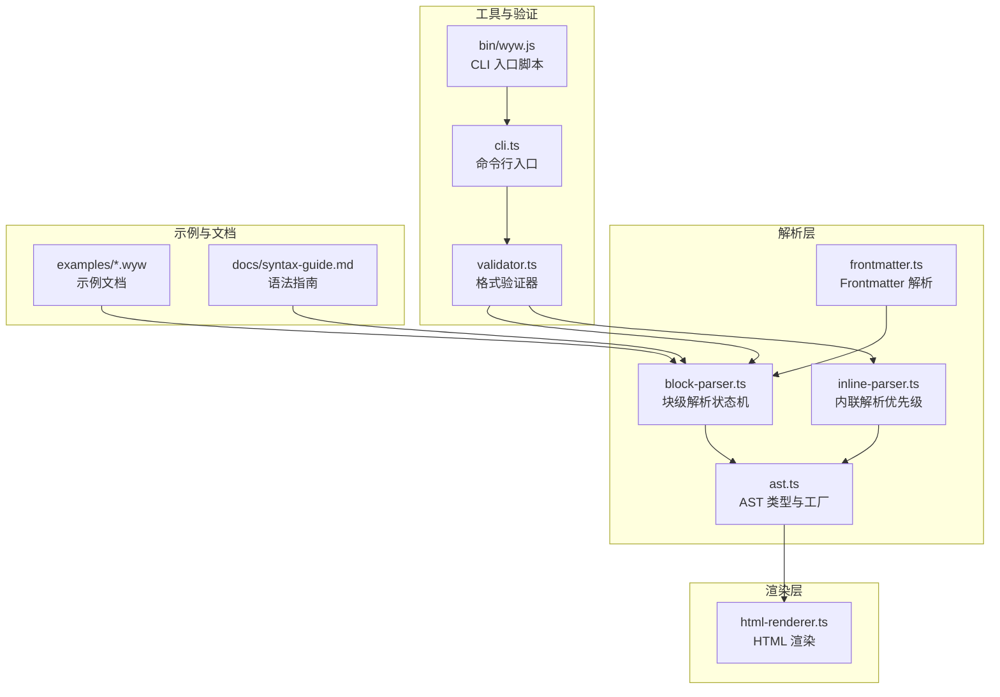
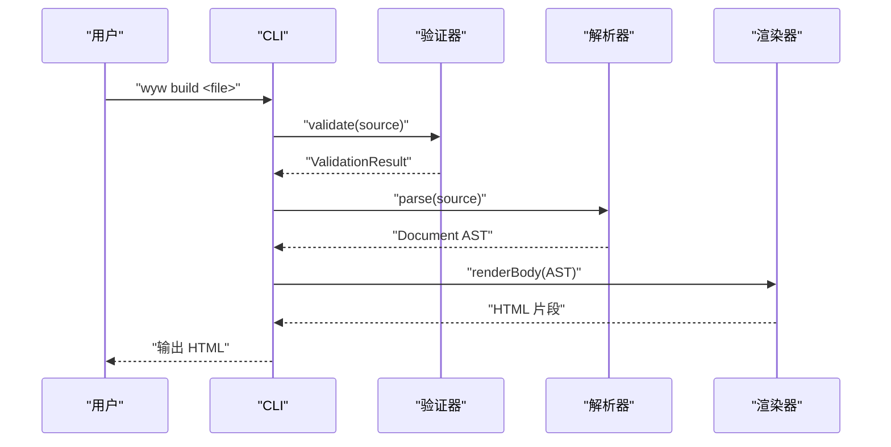
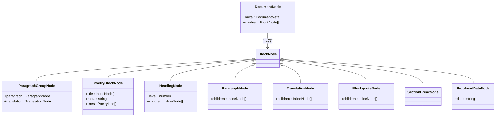

# 文言文标记语法

<cite>
**本文引用的文件**
- [README.md](file://README.md)
- [docs/syntax-guide.md](file://docs/syntax-guide.md)
- [src/parser/frontmatter.ts](file://src/parser/frontmatter.ts)
- [src/parser/block-parser.ts](file://src/parser/block-parser.ts)
- [src/parser/inline-parser.ts](file://src/parser/inline-parser.ts)
- [src/parser/ast.ts](file://src/parser/ast.ts)
- [src/renderer/html-renderer.ts](file://src/renderer/html-renderer.ts)
- [src/validator.ts](file://src/validator.ts)
- [src/cli.ts](file://src/cli.ts)
- [bin/wyw.js](file://bin/wyw.js)
- [examples/刘禹锡_陋室铭.wyw](file://examples/刘禹锡_陋室铭.wyw)
- [examples/范仲淹_岳阳楼记.wyw](file://examples/范仲淹_岳阳楼记.wyw)
- [examples/郦道元_三峡.wyw](file://examples/郦道元_三峡.wyw)
- [test/demo/李清照_声声慢·寻寻觅觅.wyw](file://test/demo/李清照_声声慢·寻寻觅觅.wyw)
- [test/demo/白居易_卖炭翁.wyw](file://test/demo/白居易_卖炭翁.wyw)
- [test/validator.test.ts](file://test/validator.test.ts)
</cite>

## 目录
1. [简介](#简介)
2. [项目结构](#项目结构)
3. [核心组件](#核心组件)
4. [架构总览](#架构总览)
5. [详细语法说明](#详细语法说明)
6. [依赖关系分析](#依赖关系分析)
7. [性能与可用性考量](#性能与可用性考量)
8. [故障排查指南](#故障排查指南)
9. [结论](#结论)
10. [附录](#附录)

## 简介
本文件为文言文标记语言（.wyw）的全面语法参考，面向两类读者：
- 语法学习者：系统讲解 Frontmatter、块级与内联语法、注音、注释、翻译、围栏块等，给出定义、示例与最佳实践
- 开发者与维护者：提供解析与渲染的实现依据、优先级规则、嵌套限制、验证规则与常见错误的解决方案

本项目支持将 .wyw 文件编译为排版精美的 HTML 页面，内置注音、注释、译文等阅读辅助功能，并提供 CLI 工具与验证器。

**章节来源**
- [README.md: 1-130:1-130](file://README.md#L1-L130)

## 项目结构
仓库采用模块化设计，核心分为解析、渲染、验证与 CLI 四大模块，配合示例与文档。

**图表来源**
- [src/parser/frontmatter.ts: 1-57:1-57](file://src/parser/frontmatter.ts#L1-L57)
- [src/parser/block-parser.ts: 1-371:1-371](file://src/parser/block-parser.ts#L1-L371)
- [src/parser/inline-parser.ts: 1-99:1-99](file://src/parser/inline-parser.ts#L1-L99)
- [src/parser/ast.ts: 1-218:1-218](file://src/parser/ast.ts#L1-L218)
- [src/renderer/html-renderer.ts: 1-251:1-251](file://src/renderer/html-renderer.ts#L1-L251)
- [src/validator.ts: 1-838:1-838](file://src/validator.ts#L1-L838)
- [src/cli.ts](file://src/cli.ts)
- [bin/wyw.js: 1-7:1-7](file://bin/wyw.js#L1-L7)
- [docs/syntax-guide.md: 1-250:1-250](file://docs/syntax-guide.md#L1-L250)

**章节来源**
- [README.md: 110-130:110-130](file://README.md#L110-L130)

## 核心组件
- 解析器
  - Frontmatter：提取元数据（title、author、dynasty）
  - 块级解析：标题、段落、译文、引用、围栏块、分隔线、校对日期
  - 内联解析：注音、注释、注音+注释组合、强调
- 渲染器：将 AST 渲染为 HTML，支持诗词围栏、译文、注释悬浮提示等
- 验证器：多维度格式校验（Frontmatter、括号平衡、注音/注释/组合语法、围栏块、译文配对、解析器深度校验）
- CLI：构建、监听、主题、翻译显示控制等

**章节来源**
- [src/parser/frontmatter.ts: 14-56:14-56](file://src/parser/frontmatter.ts#L14-L56)
- [src/parser/block-parser.ts: 43-49:43-49](file://src/parser/block-parser.ts#L43-L49)
- [src/parser/inline-parser.ts: 62-98:62-98](file://src/parser/inline-parser.ts#L62-L98)
- [src/renderer/html-renderer.ts: 20-44:20-44](file://src/renderer/html-renderer.ts#L20-L44)
- [src/validator.ts: 742-762:742-762](file://src/validator.ts#L742-L762)

## 架构总览
下面的序列图展示了从 .wyw 源文件到 HTML 输出的端到端流程。

**图表来源**
- [src/cli.ts](file://src/cli.ts)
- [src/validator.ts: 742-762:742-762](file://src/validator.ts#L742-L762)
- [src/parser/block-parser.ts: 43-49:43-49](file://src/parser/block-parser.ts#L43-L49)
- [src/renderer/html-renderer.ts: 20-44:20-44](file://src/renderer/html-renderer.ts#L20-L44)

## 详细语法说明

### 1) 文件结构与 Frontmatter
- 文件由两部分组成：Frontmatter（可选）与正文内容
- Frontmatter 使用 YAML 风格，以 `---` 包裹
- 支持字段：title、author、dynasty
- 验证规则：必填字段缺失会作为警告；未知字段会作为警告；Frontmatter 必须闭合

示例与最佳实践
- 建议始终包含 title、author、dynasty
- 若存在额外元数据，建议遵循白名单，避免拼写错误

**章节来源**
- [docs/syntax-guide.md: 7-35:7-35](file://docs/syntax-guide.md#L7-L35)
- [src/parser/frontmatter.ts: 14-56:14-56](file://src/parser/frontmatter.ts#L14-L56)
- [src/validator.ts: 116-179:116-179](file://src/validator.ts#L116-L179)

### 2) 块级语法

#### 2.1 标题
- 支持 1-3 级标题，使用 `#` 表示
- 渲染时正文标题从 h2 开始（h1 留给文档标题）

示例与最佳实践
- 标题层级不宜过深，建议不超过三级
- 标题内容支持内联语法（如注音、注释、强调）

**章节来源**
- [docs/syntax-guide.md: 39-47:39-47](file://docs/syntax-guide.md#L39-L47)
- [src/parser/block-parser.ts: 176-183:176-183](file://src/parser/block-parser.ts#L176-L183)
- [src/renderer/html-renderer.ts: 99-102:99-102](file://src/renderer/html-renderer.ts#L99-L102)

#### 2.2 段落
- 普通文本行构成段落，段落之间用空行分隔
- 解析器会将相邻的 paragraph 与 translation 自动合并为 paragraph_group

示例与最佳实践
- 段落之间务必留空行，否则会被合并
- 避免在段落中混用块级标记（如围栏块、引用块）

**章节来源**
- [docs/syntax-guide.md: 49-57:49-57](file://docs/syntax-guide.md#L49-L57)
- [src/parser/block-parser.ts: 346-370:346-370](file://src/parser/block-parser.ts#L346-L370)

#### 2.3 译文（现代文翻译）
- 使用 `>>` 标记译文，译文会与上方段落自动关联
- 支持多行译文（连续以 `>>` 开头）

示例与最佳实践
- 译文前必须有对应的原文段落，否则会作为提示
- 译文与原文一一对应，便于阅读对照

**章节来源**
- [docs/syntax-guide.md: 59-72:59-72](file://docs/syntax-guide.md#L59-L72)
- [src/parser/block-parser.ts: 195-201:195-201](file://src/parser/block-parser.ts#L195-L201)
- [src/validator.ts: 634-675:634-675](file://src/validator.ts#L634-L675)

#### 2.4 引用块
- 使用 `>` 标记引用内容，注意与 `>>` 译文区分

示例与最佳实践
- 引用块不参与译文配对检查
- 引用内容支持内联语法

**章节来源**
- [docs/syntax-guide.md: 73-79:73-79](file://docs/syntax-guide.md#L73-L79)
- [src/parser/block-parser.ts: 203-209:203-209](file://src/parser/block-parser.ts#L203-L209)

#### 2.5 分隔线
- 使用三个或以上连字符 `---` 表示分隔线

示例与最佳实践
- 适用于章节划分或段落过渡

**章节来源**
- [docs/syntax-guide.md: 81-87:81-87](file://docs/syntax-guide.md#L81-L87)
- [src/parser/block-parser.ts: 160-164:160-164](file://src/parser/block-parser.ts#L160-L164)

#### 2.6 校对日期
- 使用 `--YYYY年M月D日--` 标记校对日期，渲染为页脚

示例与最佳实践
- 格式固定，避免使用其他日期格式

**章节来源**
- [docs/syntax-guide.md: 89-95:89-95](file://docs/syntax-guide.md#L89-L95)
- [src/parser/block-parser.ts: 166-174:166-174](file://src/parser/block-parser.ts#L166-L174)

#### 2.7 诗词围栏块
- 使用 `:::` 包裹诗词内容，类型默认为 poetry
- 支持内部标题（`#`）、元信息行（`::` 后跟作者/朝代等）
- 围栏块内部支持所有内联语法，空行用于分隔诗句段落

示例与最佳实践
- 围栏块必须闭合，否则会报错
- 元信息行不能为空
- 仅支持 poetry 类型

**章节来源**
- [docs/syntax-guide.md: 97-121:97-121](file://docs/syntax-guide.md#L97-L121)
- [src/parser/block-parser.ts: 185-193:185-193](file://src/parser/block-parser.ts#L185-L193)
- [src/validator.ts: 565-610:565-610](file://src/validator.ts#L565-L610)

### 3) 内联语法

内联解析按优先级顺序匹配，确保与渲染端一致。

优先级（从高到低）
1. 注音+注释组合：`[{字|拼音}{字}...](释义)`
2. 注音：`{字|拼音}`
3. 注释：`[文本](释义)`
4. 强调：`*文本*`

解析策略
- 从左到右扫描，优先匹配最早出现的模式
- 使用 consumed 区间避免重复匹配
- 支持在强调内部嵌套其他内联语法

示例与最佳实践
- 注音与注释组合适合多字词组，其中部分字需要注音
- 注音拼音建议使用 Unicode 声调符号，避免数字
- 注释释义不能为空（建议性提示）

**章节来源**
- [src/parser/inline-parser.ts: 21-46:21-46](file://src/parser/inline-parser.ts#L21-L46)
- [src/parser/inline-parser.ts: 62-98:62-98](file://src/parser/inline-parser.ts#L62-L98)
- [src/validator.ts: 462-548:462-548](file://src/validator.ts#L462-L548)

#### 3.1 注音（Ruby 标注）
- 语法：`{字|拼音}`
- 效果：在字上方显示拼音

示例与最佳实践
- 建议单字分别标注，避免多字注音
- 拼音中禁止包含大括号与数字

**章节来源**
- [docs/syntax-guide.md: 126-134:126-134](file://docs/syntax-guide.md#L126-L134)
- [src/validator.ts: 310-347:310-347](file://src/validator.ts#L310-L347)

#### 3.2 注释
- 语法：`[词](释义)`
- 效果：词可悬停查看释义

示例与最佳实践
- 释义不能为空（建议性提示）
- 注释内容支持内联语法

**章节来源**
- [docs/syntax-guide.md: 136-144:136-144](file://docs/syntax-guide.md#L136-L144)
- [src/validator.ts: 356-369:356-369](file://src/validator.ts#L356-L369)

#### 3.3 注音+注释组合（单字）
- 语法：`[{字|拼音}](释义)`
- 效果：单字既有注音又有注释

示例与最佳实践
- 适用于单字需要注音与释义的情况

**章节来源**
- [docs/syntax-guide.md: 146-156:146-156](file://docs/syntax-guide.md#L146-L156)
- [src/validator.ts: 381-436:381-436](file://src/validator.ts#L381-L436)

#### 3.4 注音+注释组合（整词）
- 语法：`[{字|拼音}{字}...](释义)`
- 效果：整词共享注释，内部部分字带注音

示例与最佳实践
- 多字词组中仅对需要注音的字标注拼音
- 组合内不允许无拼音的字块

**章节来源**
- [docs/syntax-guide.md: 158-175:158-175](file://docs/syntax-guide.md#L158-L175)
- [src/validator.ts: 381-436:381-436](file://src/validator.ts#L381-L436)

#### 3.5 强调
- 语法：`*文本*`
- 效果：加粗强调

示例与最佳实践
- 支持嵌套，内部可包含注音、注释等

**章节来源**
- [docs/syntax-guide.md: 182-189:182-189](file://docs/syntax-guide.md#L182-L189)
- [src/validator.ts: 462-548:462-548](file://src/validator.ts#L462-L548)

### 4) 语法优先级与嵌套限制
- 内联优先级：注音+注释组合 > 注音 > 注释 > 强调
- 嵌套限制：
  - 注音与注释组合内部的每个字块必须合法
  - 强调支持内部嵌套其他内联语法
  - 围栏块内部支持所有内联语法，但必须闭合
  - 译文必须与原文段落配对

**章节来源**
- [src/parser/inline-parser.ts: 21-46:21-46](file://src/parser/inline-parser.ts#L21-L46)
- [src/validator.ts: 565-610:565-610](file://src/validator.ts#L565-L610)
- [src/validator.ts: 634-675:634-675](file://src/validator.ts#L634-L675)

### 5) 实际示例与最佳实践

示例文件
- [examples/刘禹锡_陋室铭.wyw](file://examples/刘禹锡_陋室铭.wyw)
- [examples/范仲淹_岳阳楼记.wyw](file://examples/范仲淹_岳阳楼记.wyw)
- [examples/郦道元_三峡.wyw](file://examples/郦道元_三峡.wyw)
- [test/demo/李清照_声声慢·寻寻觅觅.wyw](file://test/demo/李清照_声声慢·寻寻觅觅.wyw)
- [test/demo/白居易_卖炭翁.wyw](file://test/demo/白居易_卖炭翁.wyw)

最佳实践
- 使用空行分隔段落，避免段落合并
- 译文与原文一一对应，保证阅读体验
- 注音与注释组合用于多字词组，单字注音单独标注
- 围栏块内使用 `#` 定义标题，`::` 添加元信息
- 校对日期用于版本管理与发布追踪

**章节来源**
- [examples/刘禹锡_陋室铭.wyw: 1-22:1-22](file://examples/刘禹锡_陋室铭.wyw#L1-L22)
- [examples/范仲淹_岳阳楼记.wyw: 1-31:1-31](file://examples/范仲淹_岳阳楼记.wyw#L1-L31)
- [examples/郦道元_三峡.wyw: 1-23:1-23](file://examples/郦道元_三峡.wyw#L1-L23)
- [test/demo/李清照_声声慢·寻寻觅觅.wyw: 1-21:1-21](file://test/demo/李清照_声声慢·寻寻觅觅.wyw#L1-L21)
- [test/demo/白居易_卖炭翁.wyw: 1-23:1-23](file://test/demo/白居易_卖炭翁.wyw#L1-L23)

## 依赖关系分析

**图表来源**
- [src/parser/ast.ts: 55-118:55-118](file://src/parser/ast.ts#L55-L118)

**章节来源**
- [src/parser/ast.ts: 1-218:1-218](file://src/parser/ast.ts#L1-L218)

## 性能与可用性考量
- 解析器采用状态机与优先级扫描，时间复杂度与源码长度线性相关
- 验证器在多规则上并行工作，建议在 CI 中使用严格模式（--strict）以提升质量
- 渲染器对 AST 进行一次遍历，HTML 输出稳定可靠
- 建议在大型文档中合理使用围栏块与分隔线，提升可读性与可维护性

## 故障排查指南

### 验证器模块重构后的改进

**更新** 验证器模块经过重构，现在提供更精确的错误检测和更详细的错误报告机制

#### 新增的验证规则

1. **括号平衡检查**：使用栈式算法检测所有类型的括号匹配
   - 支持大括号 `{}`、方括号 `[]`、圆括号 `()` 的平衡性
   - 检测交叉嵌套、多余闭合括号、未闭合括号
   - 着重标记 `*` 的成对性检查

2. **注音格式验证**：
   - 单字注音的严格检查（strict 模式下多字注音报错）
   - 拼音格式验证（禁止数字、大括号等非法字符）
   - 注音组合内部每个字块的合法性检查

3. **注释格式验证**：
   - 注释词条不能为空（建议性提示）
   - 注释释义不能为空（建议性提示）
   - 避免将包含注音的文本误判为注释

4. **围栏块结构验证**：
   - `:::` 围栏块的起止配对检查
   - 围栏内元信息行的非空性检查
   - 围栏类型的有效性检查（仅支持 poetry）

5. **译文配对验证**：
   - 译文行前必须有对应的原文段落
   - 跳过 Frontmatter、围栏块、空行、标题、分隔线、普通引用块的影响

#### 改进的错误报告机制

**更新** 验证器现在提供更详细的错误报告，包括：

- **行号和列号**：精确指出错误位置
- **详细错误描述**：包含具体问题和修复建议
- **严格模式支持**：将所有警告升级为错误
- **统计信息**：提供解析和标注统计

#### 常见错误与解决方案

- **Frontmatter 未闭合**：检查 `---` 是否成对出现
- **注音拼音包含数字或大括号**：改为 Unicode 声调符号，避免使用大括号
- **注释释义为空**：补充释义内容
- **围栏块未闭合**：确保 `:::` 成对出现，且类型为 poetry
- **译文前无原文段落**：在 `>>` 前添加对应的原文段落
- **括号交叉嵌套或未闭合**：使用验证器检查，修正不匹配的括号
- **着重标记不成对**：确保 `*` 成对出现

#### 验证器输出格式

**更新** 验证器现在提供结构化的输出格式：

- **错误**：阻断性问题，必须修复
- **警告**：建议性问题，严格模式下升级为错误
- **统计**：段落组、诗词块、标题、注释、注音数量
- **格式化输出**：提供人类可读的错误报告

**章节来源**
- [src/validator.ts: 116-179:116-179](file://src/validator.ts#L116-L179)
- [src/validator.ts: 200-259:200-259](file://src/validator.ts#L200-L259)
- [src/validator.ts: 310-436:310-436](file://src/validator.ts#L310-L436)
- [src/validator.ts: 565-610:565-610](file://src/validator.ts#L565-L610)
- [src/validator.ts: 634-675:634-675](file://src/validator.ts#L634-L675)
- [src/validator.ts: 742-800:742-800](file://src/validator.ts#L742-L800)
- [src/validator.ts: 800-838:800-838](file://src/validator.ts#L800-L838)

## 结论
本语法参考系统梳理了 .wyw 的文件结构、块级与内联语法、注音与注释、译文与围栏块，并结合解析器与验证器的实现细节，提供了优先级规则、嵌套限制与常见错误的解决方案。验证器模块的重构带来了更精确的语法检查和更详细的错误报告，建议在写作时遵循示例与最佳实践，使用验证器保障格式质量，借助 CLI 工具高效生成 HTML。

## 附录

### A. CLI 使用与编译选项
- 基本命令：构建单个或多个文件，指定输出目录
- 编译选项：内联资源、监听模式、主题选择、默认显示/隐藏译文
- 初始化模板：快速生成包含完整语法示例的 template.wyw

**章节来源**
- [README.md: 35-88:35-88](file://README.md#L35-L88)
- [bin/wyw.js: 1-7:1-7](file://bin/wyw.js#L1-L7)
- [src/cli.ts](file://src/cli.ts)

### B. 语法速查表
- Frontmatter 分隔与分隔线、标题、译文、引用、分隔线、校对日期、围栏块、围栏元信息、注音、注释、注音+注释（单字/整词）、强调

**章节来源**
- [README.md: 91-108:91-108](file://README.md#L91-L108)
- [docs/syntax-guide.md: 224-241:224-241](file://docs/syntax-guide.md#L224-L241)

### C. 验证器详细规则说明

**更新** 以下是验证器模块重构后的新规则说明：

#### 规则 1：Frontmatter 完整性
- 文件非空检查
- `---` 标记的闭合性检查
- 必填字段（title、author、dynasty）检查
- 未知字段的白名单检查

#### 规则 2：括号平衡检查
- 使用栈式算法检测三类括号的配对
- 检测多余闭合括号、交叉嵌套、未闭合括号
- 着重标记 `*` 的成对性检查

#### 规则 3：模式感知语法校验
- 按优先级顺序提取注音、注释、注音+注释组合
- 每种模式的语义校验
- 使用 consumed 区间避免重复匹配

#### 规则 4：注音格式校验
- 单字注音的严格检查
- 拼音格式的合法性检查
- 多字注音的严格模式处理

#### 规则 5：注释格式校验
- 注释词条的非空性检查
- 注释释义的非空性检查
- 避免将包含注音的文本误判为注释

#### 规则 6：围栏块结构检查
- `:::` 围栏块的起止配对检查
- 围栏内元信息行的非空性检查
- 围栏类型的有效性检查

#### 规则 7：译文配对检查
- 译文行前必须有对应的原文段落
- 跳过各种标记行的影响
- 连续译文行的正确处理

#### 规则 8：解析器深度校验
- 使用 block-parser 进行完整 AST 解析
- 统计结构元素数量
- 源码级标注统计

**章节来源**
- [src/validator.ts: 103-838:103-838](file://src/validator.ts#L103-L838)