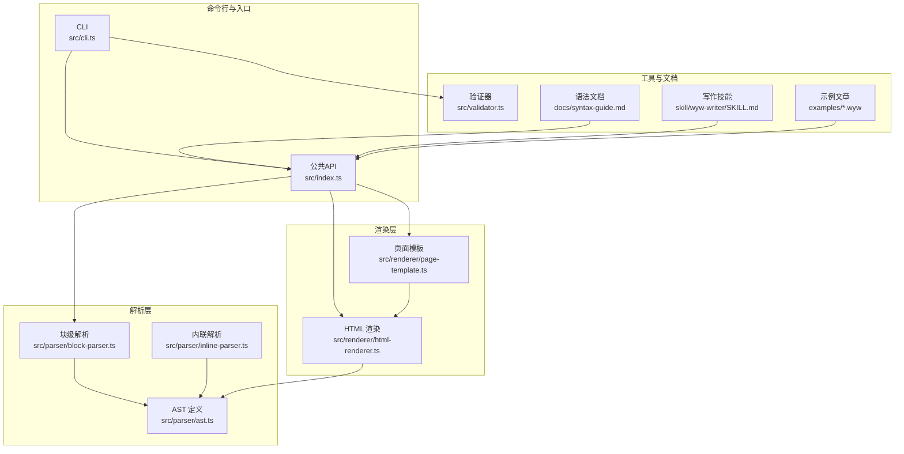
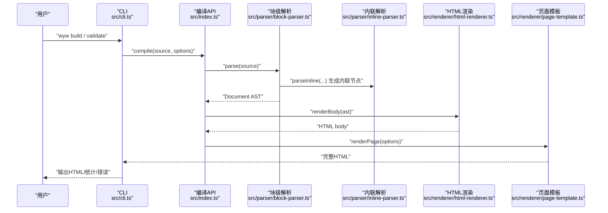
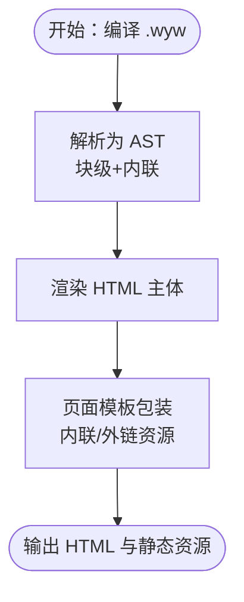
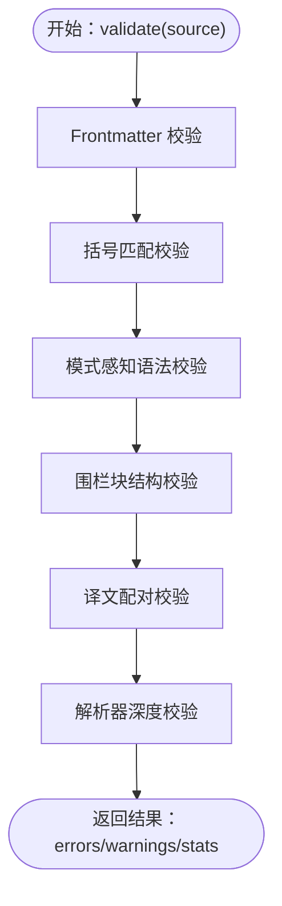
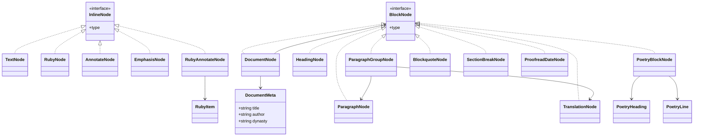
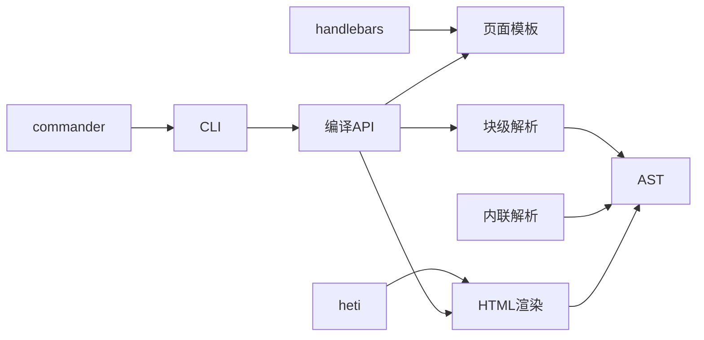

# 最佳实践

<cite>
**本文引用的文件**
- [README.md](file://README.md)
- [package.json](file://package.json)
- [src/index.ts](file://src/index.ts)
- [src/cli.ts](file://src/cli.ts)
- [src/validator.ts](file://src/validator.ts)
- [src/parser/ast.ts](file://src/parser/ast.ts)
- [src/parser/block-parser.ts](file://src/parser/block-parser.ts)
- [src/parser/inline-parser.ts](file://src/parser/inline-parser.ts)
- [src/renderer/html-renderer.ts](file://src/renderer/html-renderer.ts)
- [src/renderer/page-template.ts](file://src/renderer/page-template.ts)
- [docs/syntax-guide.md](file://docs/syntax-guide.md)
- [skill/wyw-writer/SKILL.md](file://skill/wyw-writer/SKILL.md)
- [examples/刘禹锡_陋室铭.wyw](file://examples/刘禹锡_陋室铭.wyw)
- [test/validator.test.ts](file://test/validator.test.ts)
</cite>

## 目录
1. [引言](#引言)
2. [项目结构](#项目结构)
3. [核心组件](#核心组件)
4. [架构总览](#架构总览)
5. [组件详解](#组件详解)
6. [依赖关系分析](#依赖关系分析)
7. [性能考量](#性能考量)
8. [故障排查指南](#故障排查指南)
9. [结论](#结论)
10. [附录](#附录)

## 引言
本指南面向文言文标记语言（.wyw）的创作者与维护者，系统总结语法使用、文档组织、命名与结构设计、性能优化、文件体积控制、团队协作与版本策略、可访问性与跨平台兼容、质量保证与自动化检查，以及专业文言文电子书制作流程与标准。目标是帮助团队高效产出高质量、可维护、可扩展的文言文电子书。

## 项目结构
该项目采用“模块化分层 + 命令行工具 + 验证器 + 模板渲染”的架构，核心模块包括：
- 入口与CLI：命令行参数解析、构建与监听、初始化模板、调用编译器与验证器
- 编译器：对外暴露编译API，串联解析与渲染
- 解析器：AST定义、块级解析、内联解析、Frontmatter解析
- 渲染器：HTML主体渲染、页面模板包装、内联转义与安全处理
- 验证器：多维格式校验（Frontmatter、括号、注音/注释/组合、围栏块、译文配对、解析器深度校验）
- 示例与文档：语法参考、示例文章、技能说明

图表来源
- [src/cli.ts:1-182](file://src/cli.ts#L1-L182)
- [src/index.ts:1-57](file://src/index.ts#L1-L57)
- [src/parser/ast.ts:1-218](file://src/parser/ast.ts#L1-L218)
- [src/parser/block-parser.ts:1-200](file://src/parser/block-parser.ts#L1-L200)
- [src/parser/inline-parser.ts:1-99](file://src/parser/inline-parser.ts#L1-L99)
- [src/renderer/html-renderer.ts:1-251](file://src/renderer/html-renderer.ts#L1-L251)
- [src/renderer/page-template.ts:1-87](file://src/renderer/page-template.ts#L1-L87)
- [src/validator.ts:1-838](file://src/validator.ts#L1-L838)
- [docs/syntax-guide.md:1-250](file://docs/syntax-guide.md#L1-L250)
- [skill/wyw-writer/SKILL.md:1-153](file://skill/wyw-writer/SKILL.md#L1-L153)
- [examples/刘禹锡_陋室铭.wyw:1-22](file://examples/刘禹锡_陋室铭.wyw#L1-L22)

章节来源
- [README.md:110-125](file://README.md#L110-L125)
- [package.json:18-33](file://package.json#L18-L33)

## 核心组件
- 公共编译API：提供编译选项（内联、主题、译文显隐）、统一编译流程
- CLI：构建、监听、初始化模板、格式验证
- 解析器：块级状态机、内联优先级匹配、Frontmatter抽取
- 渲染器：HTML主体与页面模板，内联转义与安全处理
- 验证器：多规则校验、严格模式、统计输出
- 文档与示例：语法参考、写作技能、示例文章

章节来源
- [src/index.ts:7-28](file://src/index.ts#L7-L28)
- [src/cli.ts:28-114](file://src/cli.ts#L28-L114)
- [src/parser/block-parser.ts:43-49](file://src/parser/block-parser.ts#L43-L49)
- [src/parser/inline-parser.ts:62-98](file://src/parser/inline-parser.ts#L62-L98)
- [src/renderer/html-renderer.ts:20-44](file://src/renderer/html-renderer.ts#L20-L44)
- [src/renderer/page-template.ts:25-68](file://src/renderer/page-template.ts#L25-L68)
- [src/validator.ts:758-779](file://src/validator.ts#L758-L779)

## 架构总览
编译流程自上而下：CLI接收参数，调用编译API；编译API先解析为AST，再渲染HTML主体，最后由页面模板包装完整HTML；同时CLI可调用验证器进行格式校验。

图表来源
- [src/cli.ts:116-164](file://src/cli.ts#L116-L164)
- [src/index.ts:17-28](file://src/index.ts#L17-L28)
- [src/parser/block-parser.ts:43-49](file://src/parser/block-parser.ts#L43-L49)
- [src/parser/inline-parser.ts:62-98](file://src/parser/inline-parser.ts#L62-L98)
- [src/renderer/html-renderer.ts:20-44](file://src/renderer/html-renderer.ts#L20-L44)
- [src/renderer/page-template.ts:25-68](file://src/renderer/page-template.ts#L25-L68)

## 组件详解

### 语法与文档组织最佳实践
- 使用Frontmatter定义元数据（标题、作者、朝代），确保每篇作品具备必要信息
- 正文段落与译文一一对应，段落之间以空行分隔，译文以“>>”标记
- 诗词使用围栏块“::: poetry”，内部支持标题与元信息行“::”
- 注音与注释遵循优先级：注音+注释组合 > 单字注音 > 注释 > 着重
- 避免在文本中直接使用特殊字符作为字面量，减少转义与歧义

章节来源
- [docs/syntax-guide.md:15-121](file://docs/syntax-guide.md#L15-L121)
- [docs/syntax-guide.md:124-190](file://docs/syntax-guide.md#L124-L190)
- [docs/syntax-guide.md:193-221](file://docs/syntax-guide.md#L193-L221)
- [skill/wyw-writer/SKILL.md:59-113](file://skill/wyw-writer/SKILL.md#L59-L113)

### 命名约定与结构设计
- 文件命名：使用“作者_篇名.wyw”，清晰表达作者与篇目
- 目录结构：示例与文档分离，便于维护与发布
- 模块职责：解析、渲染、验证、CLI各司其职，降低耦合
- 输出产物：HTML与静态资源（CSS/JS/Favicon）分离或内联，按需选择

章节来源
- [README.md:110-125](file://README.md#L110-L125)
- [src/cli.ts:138-153](file://src/cli.ts#L138-L153)
- [src/renderer/page-template.ts:43-57](file://src/renderer/page-template.ts#L43-L57)

### 编译与渲染流程
- 编译API负责：解析、渲染主体、页面包装、主题与译文显隐控制
- HTML渲染器：按块级节点类型渲染，内联节点按优先级渲染，注意转义
- 页面模板：支持内联与外链两种资源加载方式，动态生成标题与样式类

图表来源
- [src/index.ts:17-28](file://src/index.ts#L17-L28)
- [src/renderer/html-renderer.ts:20-44](file://src/renderer/html-renderer.ts#L20-L44)
- [src/renderer/page-template.ts:25-68](file://src/renderer/page-template.ts#L25-L68)

章节来源
- [src/index.ts:17-28](file://src/index.ts#L17-L28)
- [src/renderer/html-renderer.ts:20-44](file://src/renderer/html-renderer.ts#L20-L44)
- [src/renderer/page-template.ts:25-68](file://src/renderer/page-template.ts#L25-L68)

### 验证器与质量保证
- 多规则覆盖：Frontmatter完整性、括号匹配、注音/注释/组合格式、围栏块结构、译文配对、解析器深度校验
- 严格模式：将提示升级为错误，适合CI与预提交钩子
- 统计输出：段落数、诗词块数、标题数、注释数、注音数，辅助体量控制

图表来源
- [src/validator.ts:758-779](file://src/validator.ts#L758-L779)
- [src/validator.ts:116-179](file://src/validator.ts#L116-L179)
- [src/validator.ts:200-259](file://src/validator.ts#L200-L259)
- [src/validator.ts:462-548](file://src/validator.ts#L462-L548)
- [src/validator.ts:565-610](file://src/validator.ts#L565-L610)
- [src/validator.ts:634-675](file://src/validator.ts#L634-L675)
- [src/validator.ts:697-739](file://src/validator.ts#L697-L739)

章节来源
- [src/validator.ts:758-779](file://src/validator.ts#L758-L779)
- [test/validator.test.ts:9-26](file://test/validator.test.ts#L9-L26)
- [test/validator.test.ts:28-84](file://test/validator.test.ts#L28-L84)
- [test/validator.test.ts:86-131](file://test/validator.test.ts#L86-L131)
- [test/validator.test.ts:133-165](file://test/validator.test.ts#L133-L165)
- [test/validator.test.ts:167-193](file://test/validator.test.ts#L167-L193)

### CLI与工作流
- 构建：支持单文件/多文件、指定输出目录、内联资源、监听模式、主题与译文显隐
- 初始化：生成模板文件，包含基本语法示例
- 验证：格式校验并输出可读结果，支持严格模式

章节来源
- [src/cli.ts:28-114](file://src/cli.ts#L28-L114)
- [src/cli.ts:116-164](file://src/cli.ts#L116-L164)
- [README.md:35-77](file://README.md#L35-L77)

### 数据模型与节点关系

图表来源
- [src/parser/ast.ts:5-118](file://src/parser/ast.ts#L5-L118)
- [src/parser/ast.ts:132-218](file://src/parser/ast.ts#L132-L218)

章节来源
- [src/parser/ast.ts:1-218](file://src/parser/ast.ts#L1-L218)

### 解析器与渲染器细节
- 块级解析：基于状态机，识别标题、段落、译文、围栏块、引用、分隔线、校对日期
- 内联解析：按优先级匹配注音+注释组合、注音、注释、着重
- 渲染：HTML主体按节点类型输出，内联节点转义处理，页面模板支持内联与外链资源

章节来源
- [src/parser/block-parser.ts:72-200](file://src/parser/block-parser.ts#L72-L200)
- [src/parser/inline-parser.ts:21-46](file://src/parser/inline-parser.ts#L21-L46)
- [src/renderer/html-renderer.ts:80-186](file://src/renderer/html-renderer.ts#L80-L186)
- [src/renderer/page-template.ts:43-57](file://src/renderer/page-template.ts#L43-L57)

## 依赖关系分析
- 外部依赖：commander（CLI）、handlebars（模板）、heti（排版增强）
- 内部依赖：解析器依赖AST与内联解析；渲染器依赖解析器与模板；CLI依赖编译API与验证器
- 资源管理：静态资源复制与内联策略由CLI与页面模板共同决定

图表来源
- [package.json:45-54](file://package.json#L45-L54)
- [src/cli.ts:13-15](file://src/cli.ts#L13-L15)
- [src/renderer/page-template.ts:7-8](file://src/renderer/page-template.ts#L7-L8)

章节来源
- [package.json:45-54](file://package.json#L45-L54)
- [src/cli.ts:13-15](file://src/cli.ts#L13-L15)

## 性能考量
- 资源内联与外链：内联可减少HTTP请求但增大HTML体积，外链利于缓存与复用
- 解析与渲染复杂度：解析器为线性扫描，渲染器按节点遍历，整体O(n)；注意避免重复解析
- 统计与监控：CLI统计段落数、注释数、注音数，辅助体量控制与性能回归
- 字体与排版：借助排版库（heti）提升阅读体验，注意加载时机与回退方案

章节来源
- [src/cli.ts:166-181](file://src/cli.ts#L166-L181)
- [src/renderer/page-template.ts:43-57](file://src/renderer/page-template.ts#L43-L57)

## 故障排查指南
- Frontmatter缺失或未闭合：检查“---”包裹与字段齐全
- 括号未闭合或交叉嵌套：使用严格模式定位具体行列
- 注音/注释格式问题：拼音不含非法字符，注释释义非空
- 围栏块未闭合：确认“::: poetry”成对出现
- 译文未配对：确保段落与“>>”之间有空行分隔
- 验证器输出：结合严格模式与统计信息定位问题

章节来源
- [src/validator.ts:116-179](file://src/validator.ts#L116-L179)
- [src/validator.ts:200-259](file://src/validator.ts#L200-L259)
- [src/validator.ts:462-548](file://src/validator.ts#L462-L548)
- [src/validator.ts:565-610](file://src/validator.ts#L565-L610)
- [src/validator.ts:634-675](file://src/validator.ts#L634-L675)
- [test/validator.test.ts:28-84](file://test/validator.test.ts#L28-L84)
- [test/validator.test.ts:86-131](file://test/validator.test.ts#L86-L131)
- [test/validator.test.ts:133-165](file://test/validator.test.ts#L133-L165)
- [test/validator.test.ts:167-193](file://test/validator.test.ts#L167-L193)

## 结论
通过明确的语法规范、严谨的解析与渲染流程、完善的验证器与CLI工具，以及清晰的文档与示例，本项目为文言文电子书制作提供了可落地的最佳实践框架。建议团队在创作、评审、构建、发布全流程中坚持使用验证器与严格模式，持续优化体量与性能，并建立标准化的版本与协作流程。

## 附录

### 语法速查与注意事项
- Frontmatter：title/author/dynasty三要素
- 块级：标题、段落、译文、引用、分隔线、校对日期、诗词围栏
- 内联：注音、注释、注音+注释组合、着重
- 注意事项：空行分隔、译文配对、嵌套支持、避免直接使用特殊字符

章节来源
- [docs/syntax-guide.md:224-250](file://docs/syntax-guide.md#L224-L250)
- [skill/wyw-writer/SKILL.md:126-136](file://skill/wyw-writer/SKILL.md#L126-L136)

### 团队协作与版本控制建议
- 使用严格模式的验证器作为CI门槛，确保每次提交质量
- 建议在PR中强制运行验证器与测试，失败即阻断合并
- 版本发布前统一运行构建与示例编译，核对输出一致性
- 文档与示例同步更新，保持参考材料与实现一致

章节来源
- [README.md:35-77](file://README.md#L35-L77)
- [package.json:18-26](file://package.json#L18-L26)

### 可访问性与跨平台兼容
- 语义化标签：标题、段落、引用、诗词块均使用相应HTML结构
- 可读性：支持主题切换、字号调节、译文显隐控制
- 转义与安全：内联渲染时对HTML与属性进行转义，避免XSS风险

章节来源
- [src/renderer/html-renderer.ts:237-250](file://src/renderer/html-renderer.ts#L237-L250)
- [src/renderer/page-template.ts:81-86](file://src/renderer/page-template.ts#L81-L86)

### 质量保证与自动化检查
- 单元测试：覆盖验证器核心规则与边界条件
- CLI集成：构建与验证命令贯穿开发流程
- 统计与报告：CLI输出统计信息，便于体量控制与回归分析

章节来源
- [test/validator.test.ts:9-26](file://test/validator.test.ts#L9-L26)
- [test/validator.test.ts:28-84](file://test/validator.test.ts#L28-L84)
- [test/validator.test.ts:86-131](file://test/validator.test.ts#L86-L131)
- [test/validator.test.ts:133-165](file://test/validator.test.ts#L133-L165)
- [test/validator.test.ts:167-193](file://test/validator.test.ts#L167-L193)

### 专业文言文电子书制作流程与标准
- 规划阶段：确定篇目、作者、朝代与目标读者
- 内容创作：按语法规范撰写正文与译文，合理使用注音与注释
- 校对与验证：多次运行验证器，修正错误与提示
- 构建与发布：选择内联或外链资源，生成HTML与静态资源
- 归档与版本：记录校对日期与版本信息，便于追溯

章节来源
- [examples/刘禹锡_陋室铭.wyw:1-22](file://examples/刘禹锡_陋室铭.wyw#L1-L22)
- [docs/syntax-guide.md:193-221](file://docs/syntax-guide.md#L193-L221)
- [skill/wyw-writer/SKILL.md:50-56](file://skill/wyw-writer/SKILL.md#L50-L56)