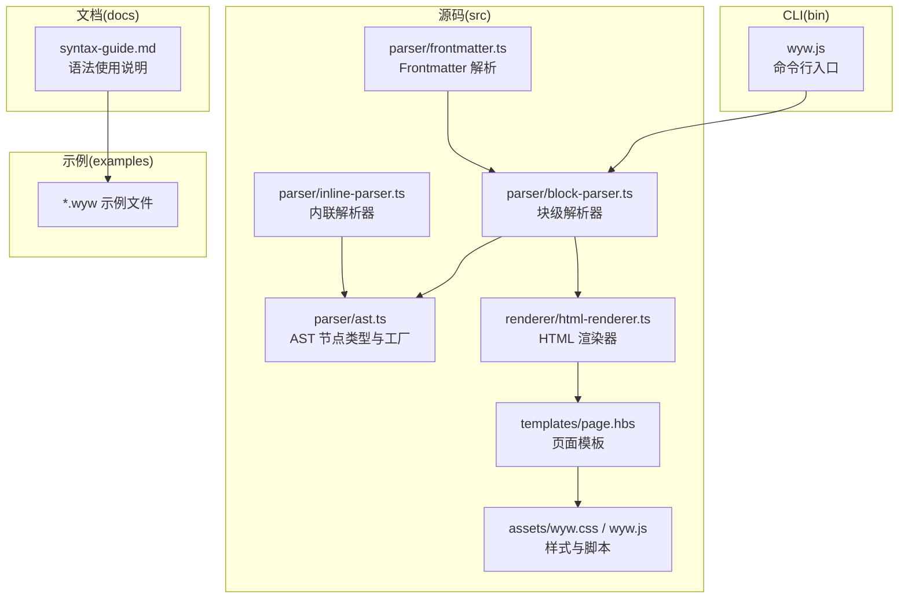
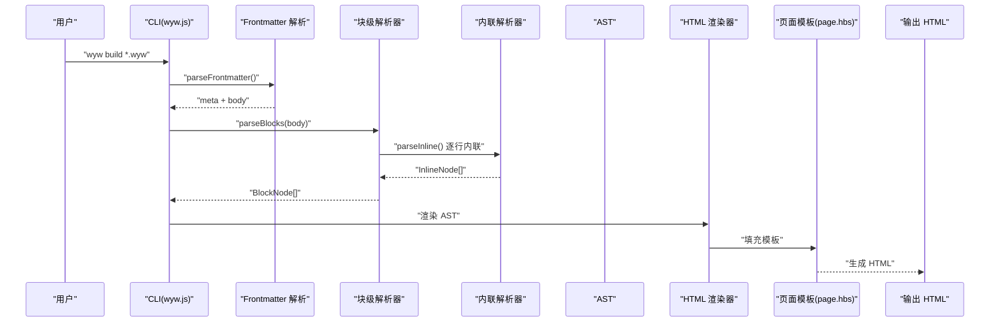
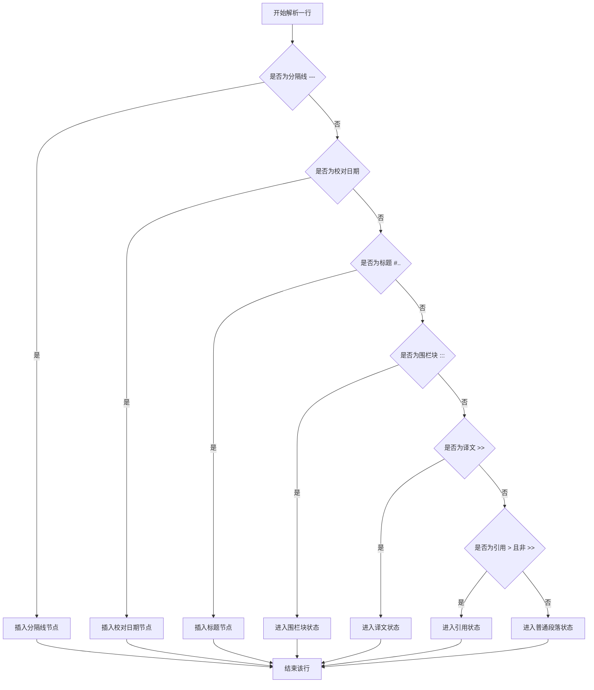
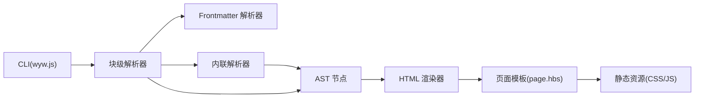

# 语法速查表

<cite>
**本文引用的文件**
- [README.md](file://README.md)
- [docs/syntax-guide.md](file://docs/syntax-guide.md)
- [src/parser/ast.ts](file://src/parser/ast.ts)
- [src/parser/block-parser.ts](file://src/parser/block-parser.ts)
- [src/parser/inline-parser.ts](file://src/parser/inline-parser.ts)
- [src/parser/frontmatter.ts](file://src/parser/frontmatter.ts)
- [examples/刘禹锡_陋室铭.wyw](file://examples/刘禹锡_陋室铭.wyw)
- [examples/范仲淹_岳阳楼记.wyw](file://examples/范仲淹_岳阳楼记.wyw)
- [examples/郦道元_三峡.wyw](file://examples/郦道元_三峡.wyw)
- [test/demo/李清照_声声慢·寻寻觅觅.wyw](file://test/demo/李清照_声声慢·寻寻觅觅.wyw)
- [test/demo/白居易_卖炭翁.wyw](file://test/demo/白居易_卖炭翁.wyw)
- [package.json](file://package.json)
</cite>

## 目录
1. [简介](#简介)
2. [项目结构](#项目结构)
3. [核心组件](#核心组件)
4. [架构总览](#架构总览)
5. [详细组件分析](#详细组件分析)
6. [依赖关系分析](#依赖关系分析)
7. [性能考量](#性能考量)
8. [故障排查指南](#故障排查指南)
9. [结论](#结论)
10. [附录](#附录)

## 简介
本速查表面向文言文标记语言（.wyw）的使用者，系统梳理并分类呈现所有支持的语法元素，包括块级语法、内联语法、Frontmatter 元数据、诗词围栏块、译文与引用块、分隔线与校对日期等。文档按功能分组，提供语法符号、用途说明与示例路径，帮助快速定位与应用。同时给出语法优先级与冲突处理的快速参考，便于在复杂文本中正确书写与排版。

## 项目结构
- 源码位于 src/，包含解析器、渲染器、模板与静态资源。
- 解析器分为块级解析器与内联解析器，负责将 .wyw 文本转换为 AST。
- 文档与示例位于 docs/ 与 examples/，提供语法说明与实际样例。
- CLI 通过 bin/wyw.js 提供命令行工具，支持构建、监听与模板初始化。

图表来源
- [src/parser/ast.ts:1-218](file://src/parser/ast.ts#L1-L218)
- [src/parser/block-parser.ts:1-371](file://src/parser/block-parser.ts#L1-L371)
- [src/parser/inline-parser.ts:1-99](file://src/parser/inline-parser.ts#L1-L99)
- [src/parser/frontmatter.ts:1-57](file://src/parser/frontmatter.ts#L1-L57)
- [docs/syntax-guide.md:1-250](file://docs/syntax-guide.md#L1-L250)
- [examples/刘禹锡_陋室铭.wyw:1-22](file://examples/刘禹锡_陋室铭.wyw#L1-L22)

章节来源
- [README.md:110-125](file://README.md#L110-L125)
- [package.json:14-17](file://package.json#L14-L17)

## 核心组件
- AST 节点类型：定义文档、标题、段落、译文、段落组、诗词围栏块、引用块、分隔线、校对日期以及内联节点（文本、注音、注释、强调、注音+注释组合）。
- 块级解析器：识别标题、段落、译文、引用、分隔线、校对日期、围栏块，并将相邻段落与译文合并为段落组。
- 内联解析器：按优先级匹配注音、注释、注音+注释组合与强调标记，支持嵌套。
- Frontmatter 解析器：提取 YAML 元数据（title、author、dynasty 等）。

章节来源
- [src/parser/ast.ts:11-118](file://src/parser/ast.ts#L11-L118)
- [src/parser/block-parser.ts:43-49](file://src/parser/block-parser.ts#L43-L49)
- [src/parser/inline-parser.ts:21-46](file://src/parser/inline-parser.ts#L21-L46)
- [src/parser/frontmatter.ts:14-56](file://src/parser/frontmatter.ts#L14-L56)

## 架构总览
下图展示从 .wyw 源文件到 HTML 输出的整体流程：Frontmatter 解析 → 块级解析 → 段落组合并 → 内联解析 → AST → 渲染器 → HTML 模板 → 输出。

图表来源
- [src/parser/frontmatter.ts:14-56](file://src/parser/frontmatter.ts#L14-L56)
- [src/parser/block-parser.ts:43-49](file://src/parser/block-parser.ts#L43-L49)
- [src/parser/inline-parser.ts:62-98](file://src/parser/inline-parser.ts#L62-L98)
- [src/renderer/html-renderer.ts](file://src/renderer/html-renderer.ts)
- [src/templates/page.hbs](file://src/templates/page.hbs)

## 详细组件分析

### 块级语法速查
- Frontmatter 分隔与元数据
  - 符号：`---`
  - 用途：文件头部的 YAML 元数据分隔符；也可作为分隔线使用
  - 示例路径：[docs/syntax-guide.md:19-25](file://docs/syntax-guide.md#L19-L25)
- 标题
  - 符号：`#`、`##`、`###`
  - 用途：1-3 级标题
  - 示例路径：[docs/syntax-guide.md:43-47](file://docs/syntax-guide.md#L43-L47)
- 段落
  - 用途：普通文本行自动识别为段落；段落间需空行分隔
  - 示例路径：[docs/syntax-guide.md:53-57](file://docs/syntax-guide.md#L53-L57)
- 译文
  - 符号：`>>`
  - 用途：现代文翻译；与上方段落自动关联；支持多行
  - 示例路径：[docs/syntax-guide.md:63-67](file://docs/syntax-guide.md#L63-L67)
- 引用块
  - 符号：`>`
  - 用途：引用内容；注意与 `>>` 译文区分
  - 示例路径：[docs/syntax-guide.md:77-79](file://docs/syntax-guide.md#L77-L79)
- 分隔线
  - 符号：`---`（三个及以上连字符）
  - 用途：分隔段落或章节
  - 示例路径：[docs/syntax-guide.md:85-87](file://docs/syntax-guide.md#L85-L87)
- 校对日期
  - 符号：`--YYYY年M月D日--`
  - 用途：生成页脚日期
  - 示例路径：[docs/syntax-guide.md:93-95](file://docs/syntax-guide.md#L93-L95)
- 诗词围栏块
  - 符号：`::: poetry` … `:::`
  - 用途：诗词排版；支持内部标题与元信息行
  - 示例路径：[docs/syntax-guide.md:101-112](file://docs/syntax-guide.md#L101-L112)

章节来源
- [src/parser/block-parser.ts:160-183](file://src/parser/block-parser.ts#L160-L183)
- [src/parser/block-parser.ts:185-193](file://src/parser/block-parser.ts#L185-L193)
- [src/parser/block-parser.ts:195-201](file://src/parser/block-parser.ts#L195-L201)
- [src/parser/block-parser.ts:203-209](file://src/parser/block-parser.ts#L203-L209)
- [src/parser/block-parser.ts:160-164](file://src/parser/block-parser.ts#L160-L164)
- [src/parser/block-parser.ts:166-174](file://src/parser/block-parser.ts#L166-L174)
- [src/parser/block-parser.ts:262-301](file://src/parser/block-parser.ts#L262-L301)

### 内联语法速查
- 注音（Ruby 标注）
  - 符号：`{字|拼音}`
  - 用途：为汉字添加拼音标注
  - 示例路径：[docs/syntax-guide.md:130-132](file://docs/syntax-guide.md#L130-L132)
- 注释
  - 符号：`[词](释义)`
  - 用途：为词语添加注释
  - 示例路径：[docs/syntax-guide.md:140-142](file://docs/syntax-guide.md#L140-L142)
- 注音+注释（单字）
  - 符号：`[{字|拼音}](释义)`
  - 用途：同一字既有注音又有注释
  - 示例路径：[docs/syntax-guide.md:150-152](file://docs/syntax-guide.md#L150-L152)
- 注音+注释（整词）
  - 符号：`[{字|拼音}{字}...](释义)`
  - 用途：多字词组中部分字注音
  - 示例路径：[docs/syntax-guide.md:162-164](file://docs/syntax-guide.md#L162-L164)
- 着重（强调）
  - 符号：`*文本*`
  - 用途：强调内容；支持嵌套
  - 示例路径：[docs/syntax-guide.md:186-188](file://docs/syntax-guide.md#L186-L188)

章节来源
- [src/parser/inline-parser.ts:22-46](file://src/parser/inline-parser.ts#L22-L46)
- [docs/syntax-guide.md:126-190](file://docs/syntax-guide.md#L126-L190)

### Frontmatter 元数据速查
- 支持字段：title、author、dynasty
- 位置：文件首部，以 `---` 包裹
- 示例路径：[docs/syntax-guide.md:19-25](file://docs/syntax-guide.md#L19-L25)

章节来源
- [src/parser/frontmatter.ts:14-56](file://src/parser/frontmatter.ts#L14-L56)
- [docs/syntax-guide.md:15-34](file://docs/syntax-guide.md#L15-L34)

### 语法优先级与冲突处理
- 块级解析优先级（IDLE 状态下按顺序判断）：
  1) 分隔线（`---` 三个及以上连字符）
  2) 校对日期（`--YYYY年M月D日--`）
  3) 标题（`#` 1-3 级）
  4) 围栏块开始（`:::`）
  5) 译文（`>>`）
  6) 引用（`>`，排除 `>>`）
  7) 普通段落
- 内联解析优先级（从左到右扫描，按优先级列表匹配）：
  1) 注音+注释组合（`[{字|拼音}{字}...](释义)`）
  2) 注音（`{字|拼音}`）
  3) 注释（`[词](释义)`）
  4) 着重（`*文本*`）
- 冲突处理要点：
  - `>` 与 `>>`：引用块以 `>` 开头，译文以 `>>` 开头；解析器会先识别 `>>`，再识别 `>`，避免误判。
  - 围栏块内部标题与元信息：以 `#` 与 `::` 开头的行在围栏块内有特殊含义，不会被当作普通段落。
  - 译文与段落：相邻的段落与译文会被合并为段落组，确保译文与原文的正确关联。
  - 着重标记：支持嵌套，内部可再次解析注音、注释等内联语法。

图表来源
- [src/parser/block-parser.ts:154-215](file://src/parser/block-parser.ts#L154-L215)
- [src/parser/block-parser.ts:243-257](file://src/parser/block-parser.ts#L243-L257)
- [src/parser/block-parser.ts:305-319](file://src/parser/block-parser.ts#L305-L319)
- [src/parser/block-parser.ts:262-301](file://src/parser/block-parser.ts#L262-L301)

章节来源
- [src/parser/block-parser.ts:151-321](file://src/parser/block-parser.ts#L151-L321)
- [src/parser/inline-parser.ts:62-98](file://src/parser/inline-parser.ts#L62-L98)

### 示例参考
- 《陋室铭》示例（含注音、注释、译文、引用）：[examples/刘禹锡_陋室铭.wyw:1-22](file://examples/刘禹锡_陋室铭.wyw#L1-L22)
- 《岳阳楼记》示例（含注音、注释、译文）：[examples/范仲淹_岳阳楼记.wyw:1-31](file://examples/范仲淹_岳阳楼记.wyw#L1-L31)
- 《三峡》示例（含注音、注释、译文）：[examples/郦道元_三峡.wyw:1-23](file://examples/郦道元_三峡.wyw#L1-L23)
- 《声声慢·寻寻觅觅》（诗词围栏块）：[test/demo/李清照_声声慢·寻寻觅觅.wyw:1-21](file://test/demo/李清照_声声慢·寻寻觅觅.wyw#L1-L21)
- 《卖炭翁》（诗词围栏块 + 校对日期）：[test/demo/白居易_卖炭翁.wyw:1-23](file://test/demo/白居易_卖炭翁.wyw#L1-L23)

章节来源
- [examples/刘禹锡_陋室铭.wyw:1-22](file://examples/刘禹锡_陋室铭.wyw#L1-L22)
- [examples/范仲淹_岳阳楼记.wyw:1-31](file://examples/范仲淹_岳阳楼记.wyw#L1-L31)
- [examples/郦道元_三峡.wyw:1-23](file://examples/郦道元_三峡.wyw#L1-L23)
- [test/demo/李清照_声声慢·寻寻觅觅.wyw:1-21](file://test/demo/李清照_声声慢·寻寻觅觅.wyw#L1-L21)
- [test/demo/白居易_卖炭翁.wyw:1-23](file://test/demo/白居易_卖炭翁.wyw#L1-L23)

## 依赖关系分析
- CLI 与解析器：CLI 调用块级解析器，块级解析器调用内联解析器与 Frontmatter 解析器。
- AST 作为中间表示：块级与内联解析器均产出 AST 节点，供渲染器消费。
- 模板与资源：渲染器使用 Handlebars 模板与静态资源（CSS/JS）输出最终 HTML。

图表来源
- [src/parser/block-parser.ts:43-49](file://src/parser/block-parser.ts#L43-L49)
- [src/parser/frontmatter.ts:14-56](file://src/parser/frontmatter.ts#L14-L56)
- [src/parser/inline-parser.ts:62-98](file://src/parser/inline-parser.ts#L62-L98)
- [src/renderer/html-renderer.ts](file://src/renderer/html-renderer.ts)
- [src/templates/page.hbs](file://src/templates/page.hbs)

章节来源
- [package.json:14-17](file://package.json#L14-L17)
- [src/parser/ast.ts:112-129](file://src/parser/ast.ts#L112-L129)

## 性能考量
- 块级解析采用有限状态机，时间复杂度近似 O(n)，空间复杂度与行数线性相关。
- 内联解析按优先级扫描，正则匹配次数与文本长度线性相关；建议避免在单行中过度嵌套复杂标记。
- Frontmatter 解析为简单键值提取，时间复杂度 O(m)，m 为元数据行数。

## 故障排查指南
- 译文未与段落关联
  - 检查段落与译文之间是否有空行；译文必须以 `>>` 开头并与上方段落相邻。
  - 参考：[src/parser/block-parser.ts:346-370](file://src/parser/block-parser.ts#L346-L370)
- 引用块误识别为译文
  - 确保引用以 `>` 开头且不以 `>>` 开头；解析器会优先识别 `>>`。
  - 参考：[src/parser/block-parser.ts:203-209](file://src/parser/block-parser.ts#L203-L209)
- 围栏块内部标题与元信息无效
  - 围栏块内标题应以 `#` 开头，元信息应以 `::` 开头；不要与围栏块起止标记混淆。
  - 参考：[src/parser/block-parser.ts:269-290](file://src/parser/block-parser.ts#L269-L290)
- 注音与注释嵌套异常
  - 着重标记支持嵌套；若出现意外行为，请检查嵌套层级与括号配对。
  - 参考：[src/parser/inline-parser.ts:42-45](file://src/parser/inline-parser.ts#L42-L45)
- Frontmatter 未生效
  - 确认 `---` 包裹的元数据格式正确，字段名称为 title、author、dynasty。
  - 参考：[src/parser/frontmatter.ts:14-56](file://src/parser/frontmatter.ts#L14-L56)

章节来源
- [src/parser/block-parser.ts:346-370](file://src/parser/block-parser.ts#L346-L370)
- [src/parser/block-parser.ts:203-209](file://src/parser/block-parser.ts#L203-L209)
- [src/parser/block-parser.ts:269-290](file://src/parser/block-parser.ts#L269-L290)
- [src/parser/inline-parser.ts:42-45](file://src/parser/inline-parser.ts#L42-L45)
- [src/parser/frontmatter.ts:14-56](file://src/parser/frontmatter.ts#L14-L56)

## 结论
本速查表系统性地整理了 .wyw 的块级与内联语法、Frontmatter 元数据、围栏块、译文与引用、分隔线与校对日期等全部要素，并给出优先级与冲突处理要点。配合示例路径与参考文件，用户可快速定位语法并高效完成文言文排版与注释工作。

## 附录
- 快速参考表（按功能分类）
  - 块级语法
    - Frontmatter 分隔与元数据：`---`
    - 标题：`#`、`##`、`###`
    - 译文：`>>`
    - 引用：`>`
    - 分隔线：`---`
    - 校对日期：`--YYYY年M月D日--`
    - 围栏块：`::: poetry` … `:::`
  - 内联语法
    - 注音：`{字|拼音}`
    - 注释：`[词](释义)`
    - 注音+注释（单字）：`[{字|拼音}](释义)`
    - 注音+注释（整词）：`[{字|拼音}{字}...](释义)`
    - 着重：`*文本*`
  - 语法优先级
    - 块级：分隔线 → 校对日期 → 标题 → 围栏块 → 译文 → 引用 → 段落
    - 内联：注音+注释组合 → 注音 → 注释 → 着重

章节来源
- [docs/syntax-guide.md:224-241](file://docs/syntax-guide.md#L224-L241)
- [src/parser/block-parser.ts:151-321](file://src/parser/block-parser.ts#L151-L321)
- [src/parser/inline-parser.ts:21-46](file://src/parser/inline-parser.ts#L21-L46)