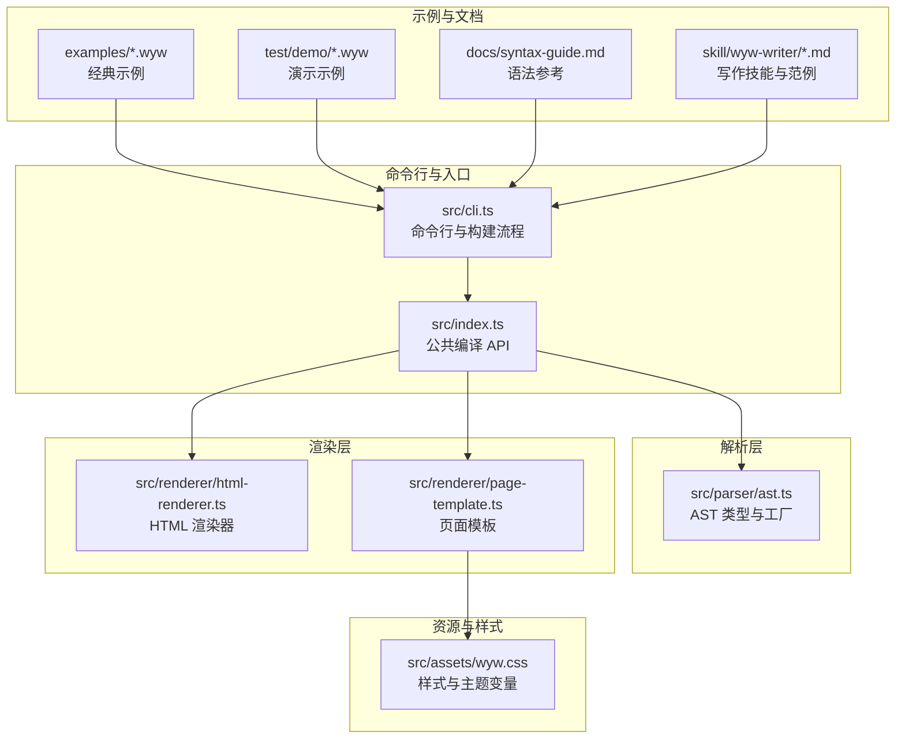
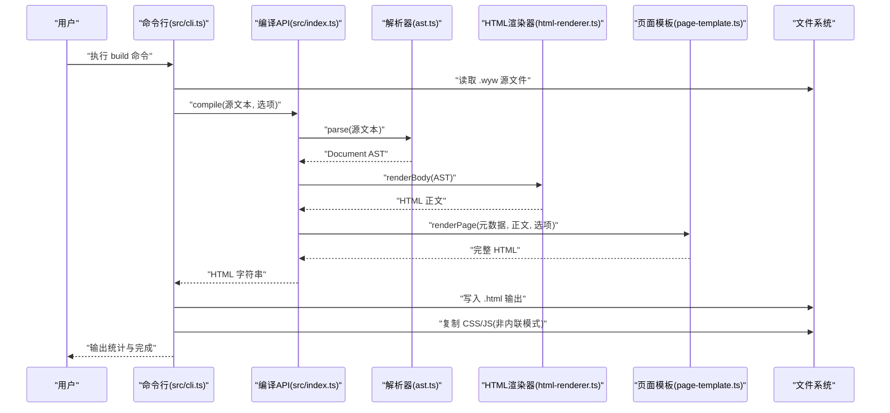
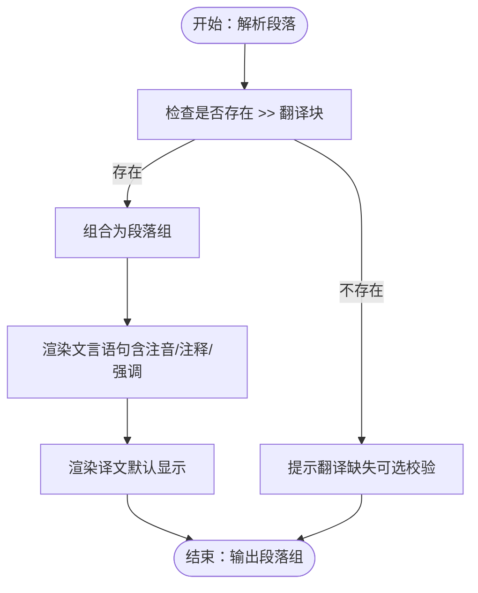
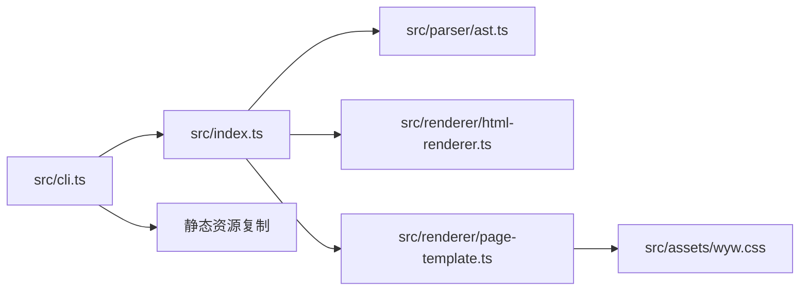

# 示例与展示

<cite>
**本文引用的文件**
- [README.md](file://README.md)
- [package.json](file://package.json)
- [src/index.ts](file://src/index.ts)
- [src/cli.ts](file://src/cli.ts)
- [src/parser/ast.ts](file://src/parser/ast.ts)
- [src/renderer/html-renderer.ts](file://src/renderer/html-renderer.ts)
- [src/renderer/page-template.ts](file://src/renderer/page-template.ts)
- [src/assets/wyw.css](file://src/assets/wyw.css)
- [docs/syntax-guide.md](file://docs/syntax-guide.md)
- [skill/wyw-writer/SKILL.md](file://skill/wyw-writer/SKILL.md)
- [skill/wyw-writer/examples.md](file://skill/wyw-writer/examples.md)
- [examples/刘禹锡_陋室铭.wyw](file://examples/刘禹锡_陋室铭.wyw)
- [examples/范仲淹_岳阳楼记.wyw](file://examples/范仲淹_岳阳楼记.wyw)
- [examples/郦道元_三峡.wyw](file://examples/郦道元_三峡.wyw)
- [test/demo/刘禹锡_陋室铭.wyw](file://test/demo/刘禹锡_陋室铭.wyw)
- [test/demo/李清照_声声慢·寻寻觅觅.wyw](file://test/demo/李清照_声声慢·寻寻觅觅.wyw)
- [test/demo/白居易_卖炭翁.wyw](file://test/demo/白居易_卖炭翁.wyw)
</cite>

## 目录
1. [简介](#简介)
2. [项目结构](#项目结构)
3. [核心组件](#核心组件)
4. [架构总览](#架构总览)
5. [详细组件分析](#详细组件分析)
6. [依赖关系分析](#依赖关系分析)
7. [性能考量](#性能考量)
8. [故障排查指南](#故障排查指南)
9. [结论](#结论)
10. [附录](#附录)

## 简介
本示例与展示文档面向希望创作与发布文言文内容的用户，系统性呈现文言文标记语言（.wyw）的示例与编译器的功能演示。通过多种文言文体裁（散文、论说文、诗词）与注音、注释、翻译等辅助功能的实际效果，帮助用户理解语法要点、掌握排版技巧，并获得创作灵感。编译器支持将 .wyw 源文件编译为排版精美的 HTML 页面，内置主题切换、字体缩放、围栏诗词块等特性，满足教学、阅读与传播需求。

## 项目结构
仓库采用按职责分层的组织方式：CLI 入口负责命令行交互与构建流程；解析器负责将 .wyw 文本解析为抽象语法树（AST）；渲染器负责将 AST 渲染为 HTML，并通过页面模板整合样式与脚本；示例与测试文件提供丰富的创作参考；文档与技能说明提供语法与写作指导。

图表来源
- [src/cli.ts:1-182](file://src/cli.ts#L1-L182)
- [src/index.ts:1-57](file://src/index.ts#L1-L57)
- [src/parser/ast.ts:1-218](file://src/parser/ast.ts#L1-L218)
- [src/renderer/html-renderer.ts:1-251](file://src/renderer/html-renderer.ts#L1-L251)
- [src/renderer/page-template.ts:1-87](file://src/renderer/page-template.ts#L1-L87)
- [src/assets/wyw.css:1-200](file://src/assets/wyw.css#L1-L200)
- [docs/syntax-guide.md:1-250](file://docs/syntax-guide.md#L1-L250)
- [skill/wyw-writer/SKILL.md:1-153](file://skill/wyw-writer/SKILL.md#L1-L153)
- [skill/wyw-writer/examples.md:1-129](file://skill/wyw-writer/examples.md#L1-L129)

章节来源
- [README.md:110-126](file://README.md#L110-L126)
- [package.json:18-27](file://package.json#L18-L27)

## 核心组件
- 编译入口与公共 API：提供 compile(source, options) 接口，串联解析、主体渲染与页面模板，返回完整 HTML。
- 命令行工具：支持 build/init/validate 子命令，批量编译、生成模板、格式校验；支持监听、内联资源、主题与译文显示控制。
- 解析器 AST：定义文档元数据、块级节点（标题、段落组、诗词块、引用、分隔线、校对日期）与内联节点（文本、注音、注释、强调、注音+注释组合），并提供工厂函数。
- HTML 渲染器：根据 AST 渲染正文内容，处理文档头部、工具栏、段落组、诗词块、引用、分隔线与校对日期；内联节点渲染注音、注释与强调。
- 页面模板：生成完整 HTML 页面，支持内联或外链 CSS/JS，注入主题与译文显示状态，剥离 .wyw 标记生成标题文本。
- 样式与主题：提供浅色/深色/自动主题，支持字体大小档位切换，适配注音模式下的行高调整。

章节来源
- [src/index.ts:7-28](file://src/index.ts#L7-L28)
- [src/cli.ts:28-114](file://src/cli.ts#L28-L114)
- [src/parser/ast.ts:5-218](file://src/parser/ast.ts#L5-L218)
- [src/renderer/html-renderer.ts:20-251](file://src/renderer/html-renderer.ts#L20-L251)
- [src/renderer/page-template.ts:25-87](file://src/renderer/page-template.ts#L25-L87)
- [src/assets/wyw.css:6-122](file://src/assets/wyw.css#L6-L122)

## 架构总览
下图展示从 .wyw 源文件到 HTML 的端到端流程：CLI 接收参数与文件列表，调用编译 API；编译 API 解析源文本为 AST，渲染正文与页面模板，最终输出 HTML；非内联模式下复制静态资源文件。

图表来源
- [src/cli.ts:116-164](file://src/cli.ts#L116-L164)
- [src/index.ts:17-28](file://src/index.ts#L17-L28)
- [src/renderer/html-renderer.ts:20-44](file://src/renderer/html-renderer.ts#L20-L44)
- [src/renderer/page-template.ts:25-68](file://src/renderer/page-template.ts#L25-L68)

## 详细组件分析

### 示例一：散文与逐段翻译（《陋室铭》）
- 体裁特征：按段落与现代文翻译一一对应，段落之间以空行分隔；使用强调标记突出重点词句。
- 注音与注释：单字注音与词语注释结合，复杂词汇采用注音+注释组合（多字词组内部分字注音）。
- 效果说明：译文默认显示，可通过工具栏切换；文档头部在无带标题诗词块时显示元数据。

图表来源
- [src/renderer/html-renderer.ts:104-119](file://src/renderer/html-renderer.ts#L104-L119)
- [src/renderer/page-template.ts:39-39](file://src/renderer/page-template.ts#L39-L39)

章节来源
- [examples/刘禹锡_陋室铭.wyw:1-22](file://examples/刘禹锡_陋室铭.wyw#L1-L22)
- [test/demo/刘禹锡_陋室铭.wyw:15-32](file://test/demo/刘禹锡_陋室铭.wyw#L15-L32)

### 示例二：论说文（《岳阳楼记》）
- 体裁特征：采用“胜状—阴雨—春和—抒怀—记日”的层次化结构；使用分隔线与引用块增强节奏与权威性。
- 注音与注释：高频使用注音与注释，配合强调标记突出关键词；校对日期置于文末。
- 效果说明：页面模板根据元数据生成标题；工具栏支持译文显示切换与主题切换。

章节来源
- [examples/范仲淹_岳阳楼记.wyw:1-31](file://examples/范仲淹_岳阳楼记.wyw#L1-L31)
- [src/renderer/page-template.ts:35-37](file://src/renderer/page-template.ts#L35-L37)
- [src/renderer/html-renderer.ts:72-78](file://src/renderer/html-renderer.ts#L72-L78)

### 示例三：山水游记（《三峡》）
- 体裁特征：以季节与天气变化为线索，描绘三峡水势与山景；使用分隔线与引用块强化层次。
- 注音与注释：多处出现复杂注音组合与词语注释，体现编译器对内联语法的递归解析能力。
- 效果说明：文档头部在存在带标题诗词块时不重复显示元数据，避免冗余。

章节来源
- [examples/郦道元_三峡.wyw:1-23](file://examples/郦道元_三峡.wyw#L1-L23)
- [src/renderer/html-renderer.ts:24-31](file://src/renderer/html-renderer.ts#L24-L31)

### 示例四：诗词围栏块（《声声慢·寻寻觅觅》）
- 体裁特征：使用围栏块包裹诗词，支持标题与元信息行；每行独立，便于分行排版。
- 注音与注释：单字注音与词语注释在诗词行内自由组合，渲染器按行输出并插入换行符。
- 效果说明：诗词块渲染时区分“诗句段落”与“小节标题”，分别用段落与标题标签输出。

章节来源
- [test/demo/李清照_声声慢·寻寻觅觅.wyw:7-21](file://test/demo/李清照_声声慢·寻寻觅觅.wyw#L7-L21)
- [src/renderer/html-renderer.ts:125-186](file://src/renderer/html-renderer.ts#L125-L186)

### 示例五：复杂内联语法（《卖炭翁》）
- 体裁特征：围栏块内嵌注音+注释组合（多字词组），展示编译器对复杂内联语法的解析与渲染。
- 注音与注释：多处出现“[{字|拼音}{字}...](释义)”形式，渲染器将注音与注释统一包裹。
- 效果说明：强调标记与注音/注释可混合使用，渲染器按优先级顺序处理内联节点。

章节来源
- [test/demo/白居易_卖炭翁.wyw:7-23](file://test/demo/白居易_卖炭翁.wyw#L7-L23)
- [src/renderer/html-renderer.ts:206-225](file://src/renderer/html-renderer.ts#L206-L225)

### 语法与写作参考
- 语法速查与完整示例：涵盖 Frontmatter、标题、段落、译文、引用、分隔线、校对日期、围栏块、注音、注释、注音+注释组合、强调等。
- 写作技能与范例：提供三种典型文档类型的完整 .wyw 写作示例，覆盖纯散文、诗词围栏块、内联语法密集使用与复杂结构组合。

章节来源
- [docs/syntax-guide.md:224-250](file://docs/syntax-guide.md#L224-L250)
- [skill/wyw-writer/examples.md:1-129](file://skill/wyw-writer/examples.md#L1-L129)
- [skill/wyw-writer/SKILL.md:57-153](file://skill/wyw-writer/SKILL.md#L57-L153)

## 依赖关系分析
- 组件耦合：CLI 仅依赖编译 API；编译 API 依赖解析器与渲染器；页面模板依赖渲染器输出与静态资源；样式通过页面模板注入。
- 外部依赖：Commander 提供命令行解析；Handlebars 提供模板引擎；Heti 提供排版增强（通过复制其 CSS/JS）。
- 资源复制：非内联模式下，CLI 会复制 CSS/JS 与图标到输出目录，确保 HTML 可独立运行。

图表来源
- [src/cli.ts:116-164](file://src/cli.ts#L116-L164)
- [src/index.ts:3-33](file://src/index.ts#L3-L33)
- [src/renderer/page-template.ts:43-57](file://src/renderer/page-template.ts#L43-L57)

章节来源
- [package.json:45-54](file://package.json#L45-L54)

## 性能考量
- 解析与渲染：解析阶段一次性扫描源文本生成 AST；渲染阶段遍历 AST 输出 HTML，时间复杂度与源文本长度线性相关。
- 资源内联：内联模式减少 HTTP 请求，提升首屏加载速度；非内联模式需复制静态资源，增加磁盘 IO。
- 主题与字体：主题切换与字体大小切换通过 CSS 变量实现，开销极低；注音模式增大行高以避免重叠，轻微影响布局计算。
- 批量编译：CLI 支持批量文件编译与监听模式，适合开发与演示场景。

## 故障排查指南
- 校验命令：使用 validate 子命令检查 Frontmatter、括号匹配、注音格式、围栏块结构与译文配对一致性。
- 常见问题：
  - Frontmatter 缺失或不完整：确保包含 title、author、dynasty。
  - 括号未闭合：确认所有 { }、[ ]、( ) 成对出现。
  - 注音格式错误：pinyin 不应包含特殊字符，避免破坏解析。
  - 译文未与段落配对：段落后应紧接 >> 译文，段落间以空行分隔。
  - 围栏块未闭合：确保 ::: 对应结束块。
- 统计输出：CLI 在编译完成后输出段落数、注释数与注音数，便于核对内容完整性。

章节来源
- [src/cli.ts:91-112](file://src/cli.ts#L91-L112)
- [src/cli.ts:166-182](file://src/cli.ts#L166-L182)
- [skill/wyw-writer/SKILL.md:126-136](file://skill/wyw-writer/SKILL.md#L126-L136)

## 结论
本示例与展示文档基于真实示例文件与编译器实现，系统展示了文言文标记语言在注音、注释、翻译与排版方面的综合能力。通过不同体裁与复杂语法组合的实例，用户可以直观了解编译器的渲染效果与使用方法，并据此开展高质量的文言文创作与发布工作。

## 附录
- 命令行使用与编译选项：支持输出目录、内联资源、监听模式、主题与译文显示控制。
- 模板生成：init 子命令可快速生成包含完整语法示例的模板文件。
- 示例文件位置：examples/ 与 test/demo/ 下均提供丰富示例，可直接编译体验。

章节来源
- [README.md:35-88](file://README.md#L35-L88)
- [src/cli.ts:58-89](file://src/cli.ts#L58-L89)