# 数据流与处理流程

<cite>
**本文档引用的文件**
- [src/index.ts](file://src/index.ts)
- [src/cli.ts](file://src/cli.ts)
- [src/parser/frontmatter.ts](file://src/parser/frontmatter.ts)
- [src/parser/block-parser.ts](file://src/parser/block-parser.ts)
- [src/parser/inline-parser.ts](file://src/parser/inline-parser.ts)
- [src/parser/ast.ts](file://src/parser/ast.ts)
- [src/renderer/html-renderer.ts](file://src/renderer/html-renderer.ts)
- [src/renderer/page-template.ts](file://src/renderer/page-template.ts)
- [src/templates/page.hbs](file://src/templates/page.hbs)
- [src/validator.ts](file://src/validator.ts)
- [examples/刘禹锡_陋室铭.wyw](file://examples/刘禹锡_陋室铭.wyw)
- [test/demo/李清照_声声慢·寻寻觅觅.wyw](file://test/demo/李清照_声声慢·寻寻觅觅.wyw)
- [package.json](file://package.json)
</cite>

## 目录
1. [简介](#简介)
2. [项目结构](#项目结构)
3. [核心组件](#核心组件)
4. [架构总览](#架构总览)
5. [详细组件分析](#详细组件分析)
6. [依赖关系分析](#依赖关系分析)
7. [性能考虑](#性能考虑)
8. [故障排除指南](#故障排除指南)
9. [结论](#结论)

## 简介

文言文编译器是一个专门用于处理古典文学作品的标记语言编译系统。该系统将 `.wyw` 格式的源文件编译为排版精美的 HTML 页面，支持注音标注、注释解释、译文对照、诗词围栏块等多种古典文学特有的排版需求。

本系统采用模块化设计，通过清晰的数据流管道实现从源文本到最终 HTML 页面的完整转换过程。每个处理阶段都有明确的输入输出格式和数据结构定义，确保了编译过程的可预测性和可维护性。

## 项目结构

文言文编译器采用分层架构设计，主要包含以下核心模块：

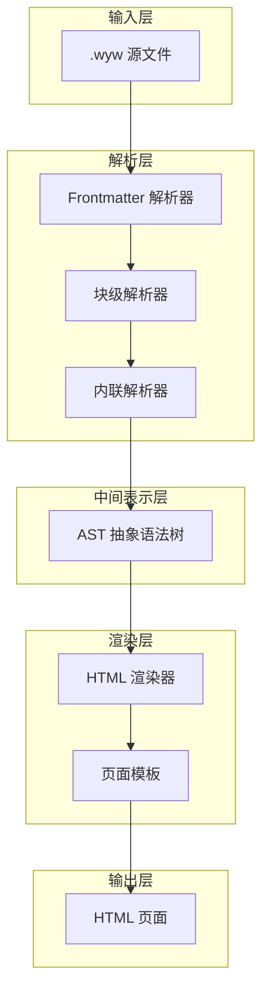

**图表来源**
- [src/index.ts:17-28](file://src/index.ts#L17-L28)
- [src/parser/block-parser.ts:43-49](file://src/parser/block-parser.ts#L43-L49)
- [src/parser/inline-parser.ts:62-98](file://src/parser/inline-parser.ts#L62-L98)

**章节来源**
- [src/index.ts:1-57](file://src/index.ts#L1-L57)
- [src/cli.ts:28-114](file://src/cli.ts#L28-L114)

## 核心组件

### 编译入口点

编译器的核心入口点位于 `src/index.ts`，提供了简洁的公共 API 接口：

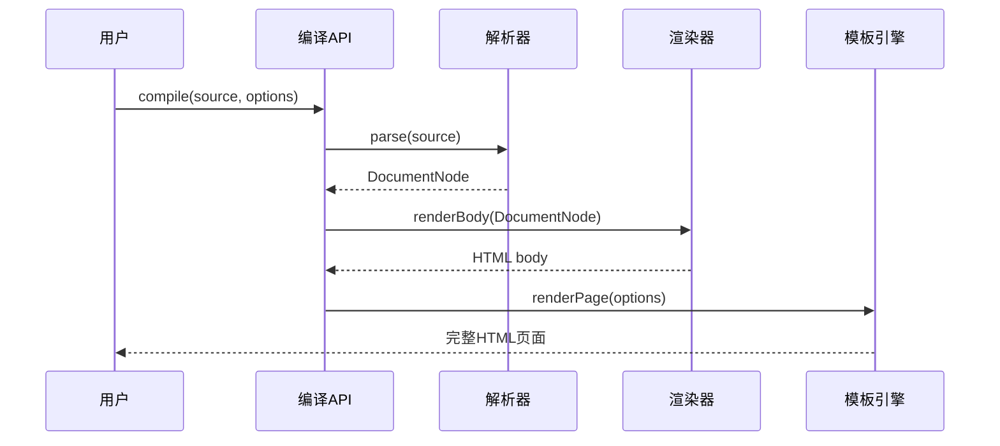

**图表来源**
- [src/index.ts:17-28](file://src/index.ts#L17-L28)
- [src/parser/block-parser.ts:43-49](file://src/parser/block-parser.ts#L43-L49)
- [src/renderer/html-renderer.ts:20-44](file://src/renderer/html-renderer.ts#L20-L44)
- [src/renderer/page-template.ts:25-68](file://src/renderer/page-template.ts#L25-L68)

### 命令行界面

CLI 模块提供了完整的命令行工具，支持批量编译、实时监听、模板初始化等功能：

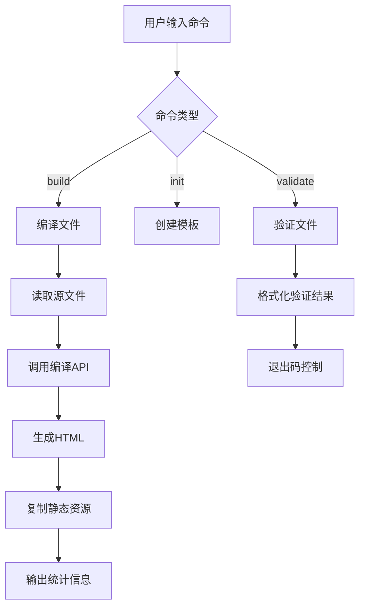

**图表来源**
- [src/cli.ts:28-114](file://src/cli.ts#L28-L114)
- [src/cli.ts:116-164](file://src/cli.ts#L116-L164)

**章节来源**
- [src/index.ts:7-28](file://src/index.ts#L7-L28)
- [src/cli.ts:20-164](file://src/cli.ts#L20-L164)

## 架构总览

文言文编译器采用经典的编译器设计模式，实现了从词法分析到语法分析再到代码生成的完整流程：

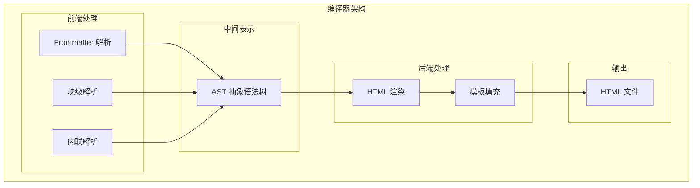

**图表来源**
- [src/parser/frontmatter.ts:14-56](file://src/parser/frontmatter.ts#L14-L56)
- [src/parser/block-parser.ts:43-49](file://src/parser/block-parser.ts#L43-L49)
- [src/parser/inline-parser.ts:62-98](file://src/parser/inline-parser.ts#L62-L98)
- [src/renderer/html-renderer.ts:20-44](file://src/renderer/html-renderer.ts#L20-L44)
- [src/renderer/page-template.ts:25-68](file://src/renderer/page-template.ts#L25-L68)

### 数据流概览

整个编译过程的数据流可以分为以下几个关键阶段：

1. **Frontmatter 解析阶段**：提取元数据信息
2. **块级解析阶段**：识别段落、标题、诗词等块级元素
3. **内联解析阶段**：处理注音、注释、强调等内联标记
4. **AST 构建阶段**：建立层次化的抽象语法树
5. **HTML 渲染阶段**：将 AST 转换为 HTML 结构
6. **模板填充阶段**：应用页面模板和样式

**章节来源**
- [src/parser/frontmatter.ts:14-56](file://src/parser/frontmatter.ts#L14-L56)
- [src/parser/block-parser.ts:72-341](file://src/parser/block-parser.ts#L72-L341)
- [src/parser/inline-parser.ts:62-98](file://src/parser/inline-parser.ts#L62-L98)
- [src/renderer/html-renderer.ts:20-251](file://src/renderer/html-renderer.ts#L20-L251)

## 详细组件分析

### Frontmatter 解析器

Frontmatter 解析器负责从源文件开头提取 YAML 格式的元数据信息：

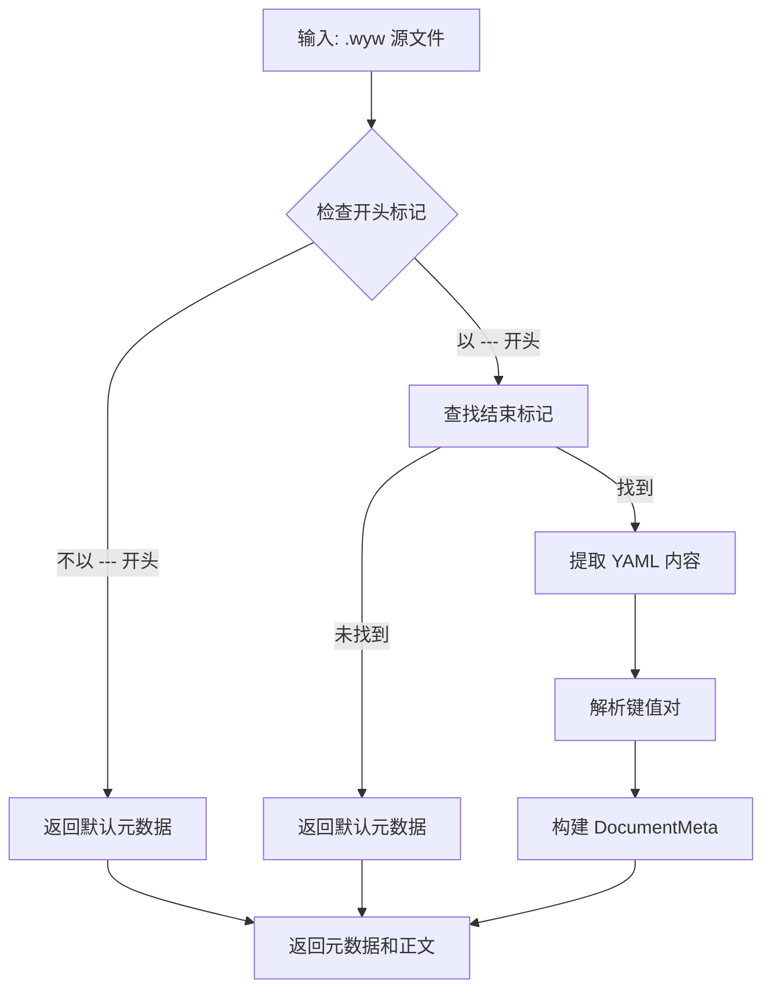

**图表来源**
- [src/parser/frontmatter.ts:14-56](file://src/parser/frontmatter.ts#L14-L56)

#### 输入输出格式

- **输入格式**：`.wyw` 源文件字符串
- **输出格式**：包含 `meta` 和 `body` 的对象
- **元数据字段**：`title`、`author`、`dynasty`

**章节来源**
- [src/parser/frontmatter.ts:6-56](file://src/parser/frontmatter.ts#L6-L56)

### 块级解析器

块级解析器使用有限状态机实现，能够识别各种块级元素：

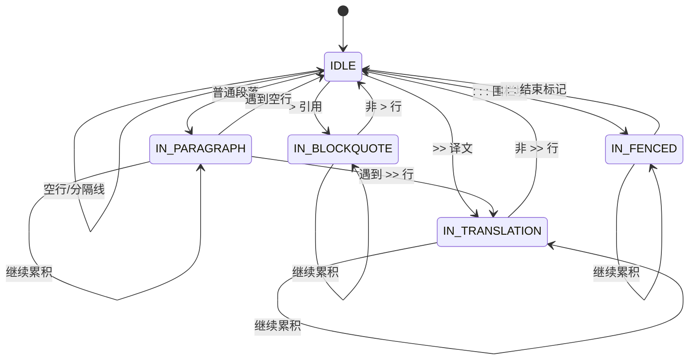

**图表来源**
- [src/parser/block-parser.ts:27-38](file://src/parser/block-parser.ts#L27-L38)
- [src/parser/block-parser.ts:151-321](file://src/parser/block-parser.ts#L151-L321)

#### 支持的块级元素

| 元素类型 | 语法示例 | 功能描述 |
|---------|---------|----------|
| 标题 | `# 标题` | 支持 1-3 级标题 |
| 段落 | `正文内容` | 普通文言文段落 |
| 译文 | `>> 翻译内容` | 现代汉语翻译 |
| 引用 | `> 引用内容` | 引用他人观点 |
| 围栏块 | `::: poetry` | 诗词等特殊格式 |
| 分隔线 | `---` | 文章分节 |

**章节来源**
- [src/parser/block-parser.ts:72-341](file://src/parser/block-parser.ts#L72-L341)

### 内联解析器

内联解析器采用优先级匹配策略，处理各种内联标记：

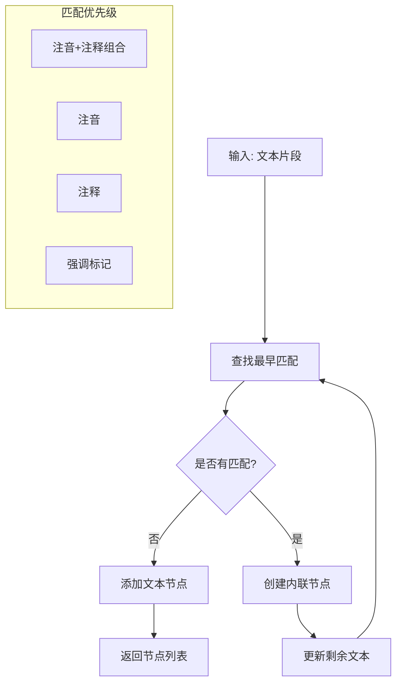

**图表来源**
- [src/parser/inline-parser.ts:62-98](file://src/parser/inline-parser.ts#L62-L98)

#### 内联标记处理

| 标记类型 | 语法示例 | 输出结构 | 功能描述 |
|---------|---------|---------|----------|
| 注音 | `{字|拼音}` | `RubyNode` | 单字注音标注 |
| 注释 | `[文本](释义)` | `AnnotateNode` | 词语解释 |
| 注音+注释 | `[字|拼音](释义)` | `RubyAnnotateNode` | 组合标注 |
| 强调 | `*重点*` | `EmphasisNode` | 文本强调 |

**章节来源**
- [src/parser/inline-parser.ts:13-46](file://src/parser/inline-parser.ts#L13-L46)
- [src/parser/inline-parser.ts:62-98](file://src/parser/inline-parser.ts#L62-L98)

### AST 抽象语法树

AST 定义了完整的数据结构层次：

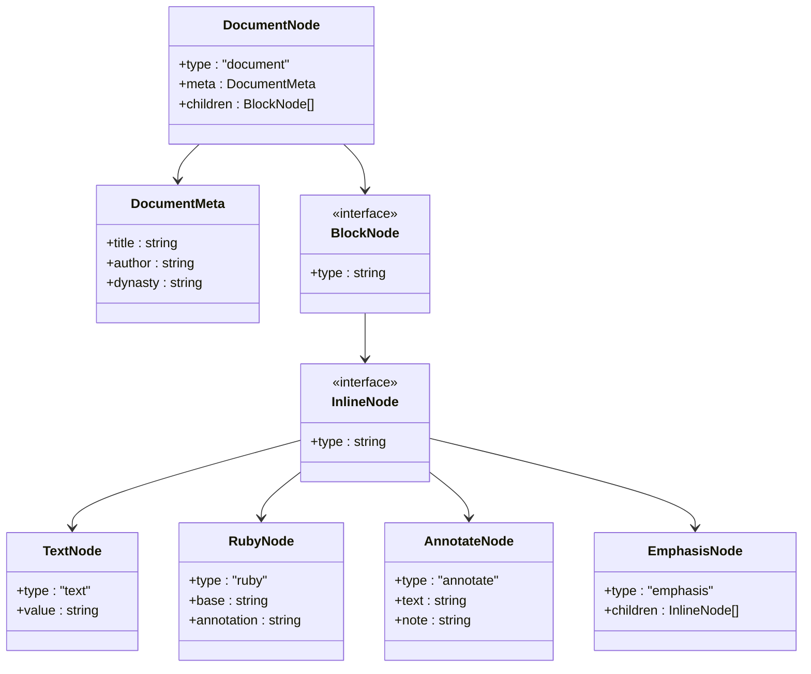

**图表来源**
- [src/parser/ast.ts:55-129](file://src/parser/ast.ts#L55-L129)
- [src/parser/ast.ts:132-218](file://src/parser/ast.ts#L132-L218)

**章节来源**
- [src/parser/ast.ts:3-218](file://src/parser/ast.ts#L3-L218)

### HTML 渲染器

HTML 渲染器将 AST 转换为最终的 HTML 结构：

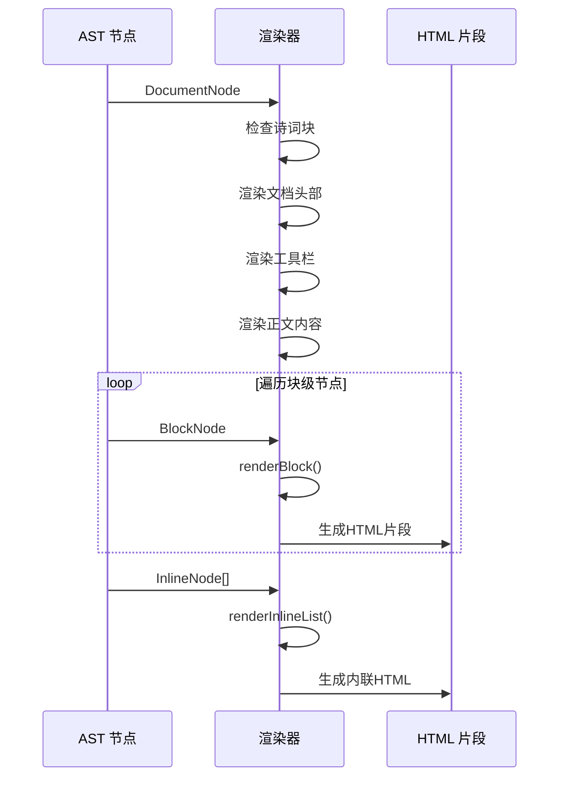

**图表来源**
- [src/renderer/html-renderer.ts:20-44](file://src/renderer/html-renderer.ts#L20-L44)
- [src/renderer/html-renderer.ts:80-97](file://src/renderer/html-renderer.ts#L80-L97)
- [src/renderer/html-renderer.ts:190-233](file://src/renderer/html-renderer.ts#L190-L233)

#### 渲染规则

| AST 节点类型 | HTML 输出 | 特殊处理 |
|-------------|-----------|----------|
| `heading` | `<h2>`-`<h4>` | 标题级别 +1 |
| `paragraph_group` | `
` | 原文+译文组合 |
| `poetry_block` | `
` | 诗词专用布局 |
| `blockquote` | `<blockquote>` | 引用块 |
| `translation` | `
` | 译文样式 |
| `ruby` | `<ruby>` | 注音标注 |
| `annotate` | `` | 注释提示 |

**章节来源**
- [src/renderer/html-renderer.ts:80-186](file://src/renderer/html-renderer.ts#L80-L186)
- [src/renderer/html-renderer.ts:195-233](file://src/renderer/html-renderer.ts#L195-L233)

### 页面模板

页面模板负责将渲染的 HTML 内容包装为完整的 HTML 页面：

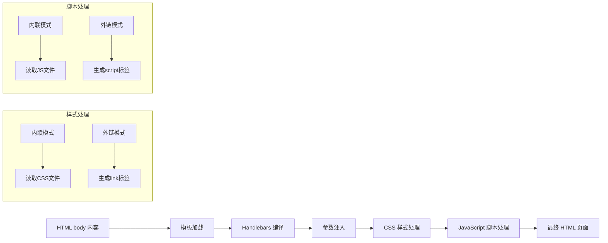

**图表来源**
- [src/renderer/page-template.ts:25-68](file://src/renderer/page-template.ts#L25-L68)
- [src/templates/page.hbs:1-17](file://src/templates/page.hbs#L1-L17)

**章节来源**
- [src/renderer/page-template.ts:13-68](file://src/renderer/page-template.ts#L13-L68)
- [src/templates/page.hbs:1-17](file://src/templates/page.hbs#L1-L17)

## 依赖关系分析

编译器各模块之间的依赖关系呈现清晰的层次结构：

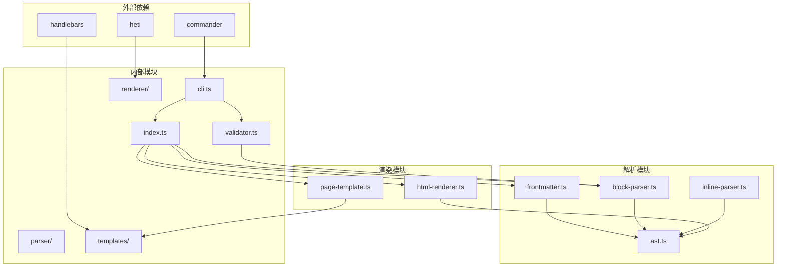

**图表来源**
- [package.json:45-54](file://package.json#L45-L54)
- [src/index.ts:3-5](file://src/index.ts#L3-L5)
- [src/cli.ts:3-15](file://src/cli.ts#L3-L15)

### 模块耦合度分析

| 模块 | 内聚性 | 耦合度 | 说明 |
|------|--------|--------|------|
| frontmatter.ts | 高 | 低 | 专注于元数据解析 |
| block-parser.ts | 高 | 中等 | 块级元素识别 |
| inline-parser.ts | 高 | 低 | 内联标记处理 |
| ast.ts | 高 | 低 | 数据结构定义 |
| html-renderer.ts | 高 | 中等 | HTML 生成逻辑 |
| page-template.ts | 中等 | 高 | 模板集成 |
| cli.ts | 中等 | 高 | 命令行接口 |

**章节来源**
- [package.json:45-54](file://package.json#L45-L54)
- [src/index.ts:3-5](file://src/index.ts#L3-L5)

## 性能考虑

### 时间复杂度分析

1. **Frontmatter 解析**：O(n) - 线性扫描文件开头
2. **块级解析**：O(n) - 单次线性扫描
3. **内联解析**：O(n*m) - n 为文本长度，m 为标记数量
4. **AST 构建**：O(n) - 线性构建树结构
5. **HTML 渲染**：O(n) - 线性遍历 AST

### 空间复杂度分析

- **内存使用**：O(n) - 主要由 AST 和中间结果占用
- **缓存机制**：模板编译结果缓存，避免重复编译
- **流式处理**：支持大文件的渐进式处理

### 优化策略

1. **模板缓存**：Handlebars 模板编译结果缓存
2. **增量编译**：CLI 模式下的文件变更监听
3. **内存管理**：及时释放中间结果，避免内存泄漏

## 故障排除指南

### 常见错误类型

| 错误类型 | 触发条件 | 解决方案 |
|---------|---------|----------|
| Frontmatter 缺失 | 文件未包含元数据 | 添加标准的 `---` 包裹的元数据 |
| 括号不匹配 | `{`、`[`、`(` 缺少闭合 | 检查语法，确保成对出现 |
| 注音格式错误 | `{字|拼音}` 格式不正确 | 确保拼音使用正确的声调符号 |
| 译文配对问题 | `>>` 译文前缺少原文 | 确保译文与原文段落正确对应 |
| 围栏块未闭合 | `:::` 缺少结束标记 | 检查围栏块的开始和结束标记 |

### 验证器功能

编译器内置了完整的验证系统，提供多层次的语法检查：

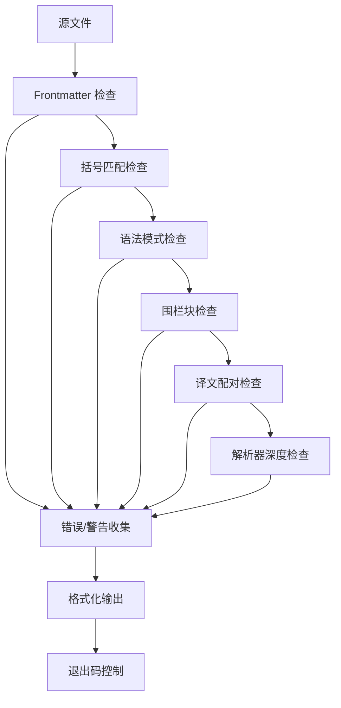

**图表来源**
- [src/validator.ts:758-779](file://src/validator.ts#L758-L779)

### 调试技巧

1. **逐步验证**：使用 `validate` 命令检查语法问题
2. **最小化重现**：创建最小化的测试文件定位问题
3. **日志分析**：查看编译过程中的详细输出信息
4. **模板检查**：确认模板文件和静态资源的完整性

**章节来源**
- [src/validator.ts:17-101](file://src/validator.ts#L17-L101)
- [src/validator.ts:758-779](file://src/validator.ts#L758-L779)

## 结论

文言文编译器通过精心设计的模块化架构，实现了从 `.wyw` 源文件到精美 HTML 页面的完整转换流程。系统具有以下特点：

1. **模块化设计**：清晰的职责分离，便于维护和扩展
2. **强类型支持**：完整的 TypeScript 类型定义，提高开发效率
3. **完善的验证**：多层次的语法检查，确保输出质量
4. **灵活的配置**：支持多种编译选项和主题设置
5. **良好的性能**：线性时间复杂度，适合大文件处理

该编译器为古典文学作品的数字化提供了可靠的解决方案，既保持了传统文学的特色，又充分利用了现代 Web 技术的优势。