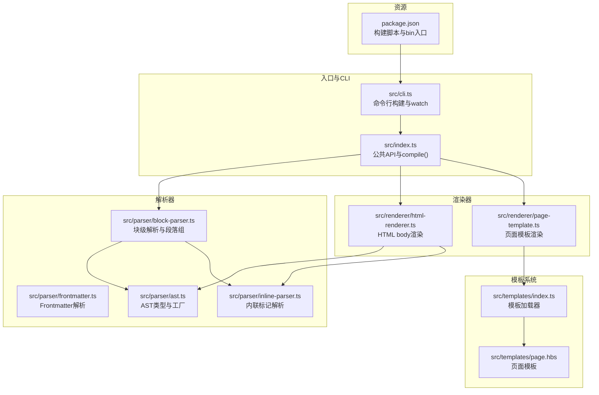
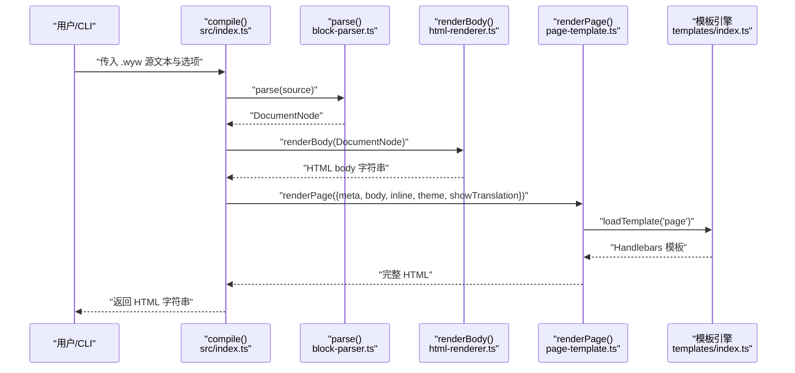
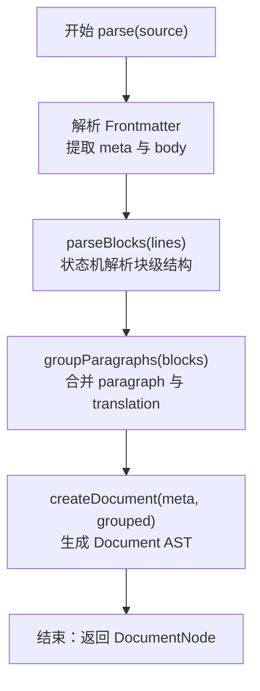
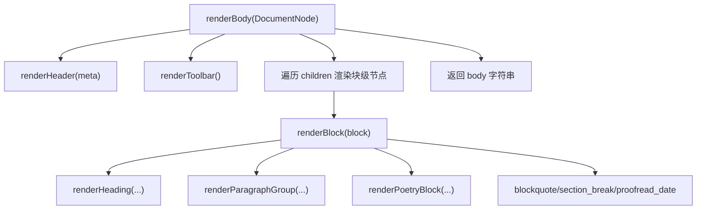
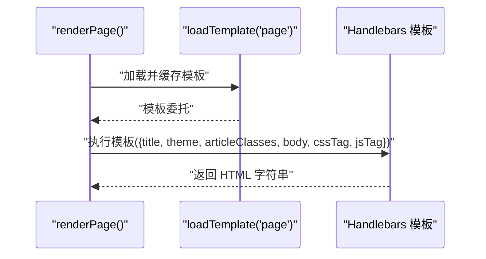
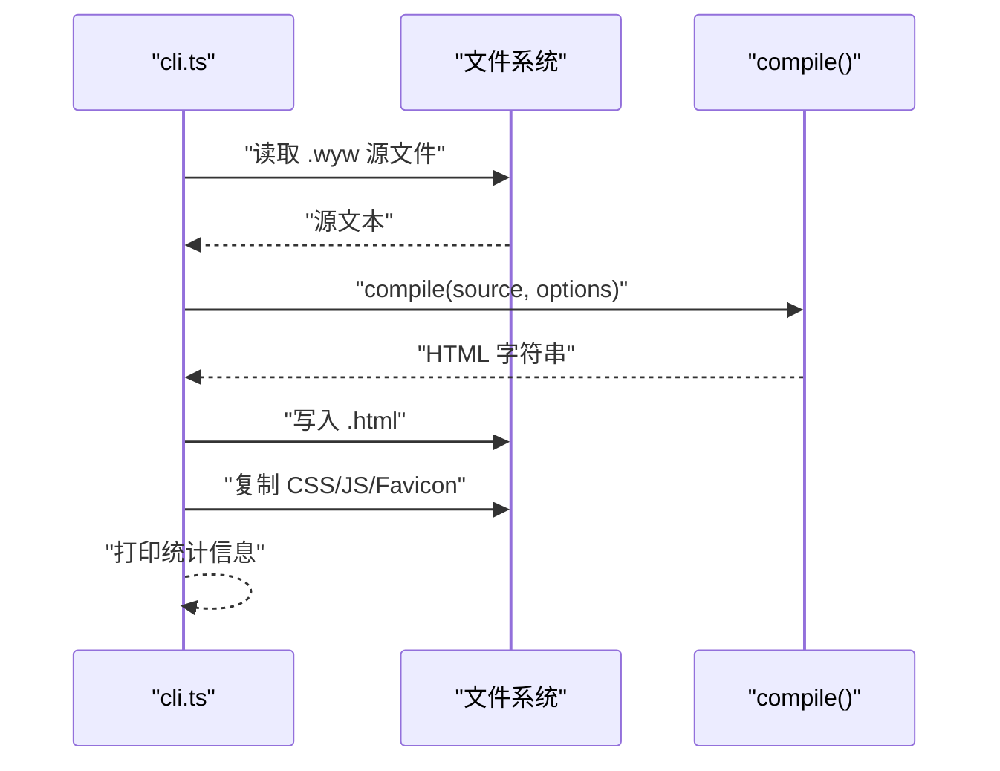
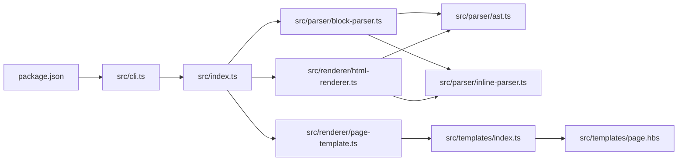

# 核心组件

<cite>
**本文引用的文件**
- [src/index.ts](file://src/index.ts)
- [src/cli.ts](file://src/cli.ts)
- [src/parser/ast.ts](file://src/parser/ast.ts)
- [src/parser/block-parser.ts](file://src/parser/block-parser.ts)
- [src/parser/inline-parser.ts](file://src/parser/inline-parser.ts)
- [src/parser/frontmatter.ts](file://src/parser/frontmatter.ts)
- [src/renderer/html-renderer.ts](file://src/renderer/html-renderer.ts)
- [src/renderer/page-template.ts](file://src/renderer/page-template.ts)
- [src/templates/index.ts](file://src/templates/index.ts)
- [src/templates/page.hbs](file://src/templates/page.hbs)
- [package.json](file://package.json)
- [README.md](file://README.md)
- [test/compile.test.ts](file://test/compile.test.ts)
- [examples/刘禹锡_陋室铭.wyw](file://examples/刘禹锡_陋室铭.wyw)
</cite>

## 目录
1. [引言](#引言)
2. [项目结构](#项目结构)
3. [核心组件](#核心组件)
4. [架构总览](#架构总览)
5. [详细组件分析](#详细组件分析)
6. [依赖分析](#依赖分析)
7. [性能考虑](#性能考虑)
8. [故障排查指南](#故障排查指南)
9. [结论](#结论)
10. [附录](#附录)

## 引言
本文件聚焦文言文编译器的核心组件，系统阐述解析器、渲染器与模板系统的协作机制，深入解析 compile() 主函数的调用流程（parse()、renderBody()、renderPage()），并说明组件间的数据传递与接口设计。通过图示与示例路径，帮助读者理解编译器的职责分离与模块化设计原则，并提供可操作的排错建议与优化方向。

## 项目结构
编译器采用“解析-渲染-模板”三层架构，配合 CLI 与模板引擎，形成从源文本到完整 HTML 的端到端流程。核心目录与文件如下：
- 入口与公共 API：src/index.ts
- 命令行工具：src/cli.ts
- 解析器：src/parser/ast.ts、src/parser/block-parser.ts、src/parser/inline-parser.ts、src/parser/frontmatter.ts
- 渲染器：src/renderer/html-renderer.ts、src/renderer/page-template.ts
- 模板系统：src/templates/index.ts、src/templates/page.hbs
- 构建与脚本：package.json
- 示例与测试：examples/*.wyw、test/compile.test.ts

图表来源
- [src/index.ts:17-28](file://src/index.ts#L17-L28)
- [src/cli.ts:116-164](file://src/cli.ts#L116-L164)
- [src/parser/block-parser.ts:43-49](file://src/parser/block-parser.ts#L43-L49)
- [src/renderer/html-renderer.ts:20-44](file://src/renderer/html-renderer.ts#L20-L44)
- [src/renderer/page-template.ts:25-68](file://src/renderer/page-template.ts#L25-L68)
- [src/templates/index.ts:18-30](file://src/templates/index.ts#L18-L30)
- [src/templates/page.hbs:1-17](file://src/templates/page.hbs#L1-17)
- [package.json:14-17](file://package.json#L14-L17)

章节来源
- [README.md:110-125](file://README.md#L110-L125)
- [package.json:14-17](file://package.json#L14-L17)

## 核心组件
- 解析器：负责将 .wyw 源文本解析为 AST（文档元数据、块级节点、内联节点）。包含 Frontmatter 解析、块级状态机解析、内联标记解析与段落组合并。
- 渲染器：将 AST 转换为 HTML 字符串，分别渲染文档头部、工具栏、正文与内联元素。
- 模板系统：使用 Handlebars 加载并编译模板，注入 CSS/JS、主题与文章类名，生成完整 HTML 页面。
- 公共 API：compile() 串联 parse()、renderBody()、renderPage()，作为对外统一入口。
- CLI：封装构建、监听、统计与资源复制逻辑，调用 compile() 生成 HTML 并输出静态资源。

章节来源
- [src/index.ts:7-28](file://src/index.ts#L7-L28)
- [src/cli.ts:116-164](file://src/cli.ts#L116-L164)
- [src/parser/block-parser.ts:43-49](file://src/parser/block-parser.ts#L43-L49)
- [src/renderer/html-renderer.ts:20-44](file://src/renderer/html-renderer.ts#L20-L44)
- [src/renderer/page-template.ts:25-68](file://src/renderer/page-template.ts#L25-L68)
- [src/templates/index.ts:18-30](file://src/templates/index.ts#L18-L30)

## 架构总览
编译流程由 compile() 驱动，三步走：
1) parse()：提取 Frontmatter，按行解析为原始块节点，再合并段落组，生成 Document AST。
2) renderBody()：根据 AST 渲染 HTML body 内容（含标题、工具栏、正文）。
3) renderPage()：加载模板，注入 CSS/JS、主题与文章类名，输出完整 HTML。

图表来源
- [src/index.ts:17-28](file://src/index.ts#L17-L28)
- [src/parser/block-parser.ts:43-49](file://src/parser/block-parser.ts#L43-L49)
- [src/renderer/html-renderer.ts:20-44](file://src/renderer/html-renderer.ts#L20-L44)
- [src/renderer/page-template.ts:25-68](file://src/renderer/page-template.ts#L25-L68)
- [src/templates/index.ts:18-30](file://src/templates/index.ts#L18-L30)

## 详细组件分析

### 解析器（Parser）
- Frontmatter 解析：从源文本中抽取元数据（title、author、dynasty），并返回剩余正文。
- 块级解析：基于有限状态机（IDLE、IN_PARAGRAPH、IN_TRANSLATION、IN_FENCED、IN_BLOCKQUOTE），逐行识别标题、段落、译文、围栏块（诗词）、引用、分隔线、校对日期等。
- 段落组合并：将相邻的 paragraph 与 translation 合并为 paragraph_group，保证译文与原文的配对关系。
- 内联解析：按优先级匹配注音、注释、注音+注释组合与着重标记，生成内联节点列表。

图表来源
- [src/parser/block-parser.ts:43-49](file://src/parser/block-parser.ts#L43-L49)
- [src/parser/frontmatter.ts:14-56](file://src/parser/frontmatter.ts#L14-L56)
- [src/parser/inline-parser.ts:62-98](file://src/parser/inline-parser.ts#L62-L98)

章节来源
- [src/parser/block-parser.ts:43-49](file://src/parser/block-parser.ts#L43-L49)
- [src/parser/frontmatter.ts:14-56](file://src/parser/frontmatter.ts#L14-L56)
- [src/parser/inline-parser.ts:62-98](file://src/parser/inline-parser.ts#L62-L98)
- [src/parser/ast.ts:55-188](file://src/parser/ast.ts#L55-L188)

### 渲染器（Renderer）
- renderBody()：根据 Document AST 渲染 HTML body。若文档不含带标题的诗词块，则渲染文档头部；始终渲染工具栏与正文容器；正文遍历块节点并调用对应渲染函数。
- 块级渲染：标题、段落组、诗词块、引用、分隔线、校对日期等均有专用渲染逻辑。
- 诗词块渲染：按 heading 分段，verse 段落用 
 包裹，内部换行保留；支持标题与元信息渲染。
- 内联渲染：文本、注音（ruby）、注释（annotate）、注音+注释组合、着重（emphasis）等，均转换为对应的 HTML 结构，并进行必要的 HTML 转义。

图表来源
- [src/renderer/html-renderer.ts:20-44](file://src/renderer/html-renderer.ts#L20-L44)
- [src/renderer/html-renderer.ts:80-186](file://src/renderer/html-renderer.ts#L80-L186)
- [src/renderer/html-renderer.ts:195-233](file://src/renderer/html-renderer.ts#L195-L233)

章节来源
- [src/renderer/html-renderer.ts:20-44](file://src/renderer/html-renderer.ts#L20-L44)
- [src/renderer/html-renderer.ts:80-186](file://src/renderer/html-renderer.ts#L80-L186)
- [src/renderer/html-renderer.ts:195-233](file://src/renderer/html-renderer.ts#L195-L233)

### 模板系统（Templates）
- 模板加载：loadTemplate(name) 读取 .hbs 文件并缓存编译后的模板委托，避免重复 IO 与编译开销。
- 页面模板：page.hbs 接收标题、主题、文章类名、body、CSS/JS 片段，输出完整 HTML。
- 资源注入：renderPage() 支持 inline 与外链两种模式，动态生成 <style>/<script> 或 <link>/<script> 标签；根据 showTranslation 控制文章类名，影响译文默认可见性。

图表来源
- [src/renderer/page-template.ts:25-68](file://src/renderer/page-template.ts#L25-L68)
- [src/templates/index.ts:18-30](file://src/templates/index.ts#L18-L30)
- [src/templates/page.hbs:1-17](file://src/templates/page.hbs#L1-17)

章节来源
- [src/renderer/page-template.ts:25-68](file://src/renderer/page-template.ts#L25-L68)
- [src/templates/index.ts:18-30](file://src/templates/index.ts#L18-L30)
- [src/templates/page.hbs:1-17](file://src/templates/page.hbs#L1-17)

### 公共 API 与 CLI 协作
- compile()：统一编译入口，串联 parse()、renderBody()、renderPage()，并处理选项（inline、assetsPath、theme、showTranslation）。
- CLI：读取文件、调用 compile()、输出 HTML、复制静态资源、统计信息；支持 watch 模式自动重编译。

图表来源
- [src/cli.ts:116-164](file://src/cli.ts#L116-L164)
- [src/index.ts:17-28](file://src/index.ts#L17-L28)

章节来源
- [src/cli.ts:116-164](file://src/cli.ts#L116-L164)
- [src/index.ts:17-28](file://src/index.ts#L17-L28)

## 依赖分析
- 模块耦合与内聚
  - index.ts 仅导出 parse、renderBody、renderPage 与类型，保持高层 API 简洁，内部依赖解析器与渲染器。
  - block-parser.ts 依赖 ast.ts 与 inline-parser.ts，负责块级状态机与段落组合并。
  - html-renderer.ts 依赖 ast.ts 与 inline-parser.ts，负责 HTML 输出与转义。
  - page-template.ts 依赖 templates/index.ts 与 assets，负责页面包装与资源注入。
  - cli.ts 依赖 index.ts 与 validator.ts，负责构建流程与文件 IO。
- 外部依赖
  - Handlebars 用于模板编译与渲染。
  - commander 用于 CLI 命令解析。
- 潜在循环依赖
  - 当前文件结构清晰，未发现循环导入；模板加载器通过缓存避免重复编译。

图表来源
- [src/index.ts:3-5](file://src/index.ts#L3-L5)
- [src/parser/block-parser.ts:4-24](file://src/parser/block-parser.ts#L4-L24)
- [src/renderer/html-renderer.ts:4-15](file://src/renderer/html-renderer.ts#L4-L15)
- [src/renderer/page-template.ts:4-8](file://src/renderer/page-template.ts#L4-L8)
- [src/templates/index.ts:4-7](file://src/templates/index.ts#L4-L7)
- [package.json:14-17](file://package.json#L14-L17)

章节来源
- [src/index.ts:3-5](file://src/index.ts#L3-L5)
- [src/parser/block-parser.ts:4-24](file://src/parser/block-parser.ts#L4-L24)
- [src/renderer/html-renderer.ts:4-15](file://src/renderer/html-renderer.ts#L4-L15)
- [src/renderer/page-template.ts:4-8](file://src/renderer/page-template.ts#L4-L8)
- [src/templates/index.ts:4-7](file://src/templates/index.ts#L4-L7)
- [package.json:14-17](file://package.json#L14-L17)

## 性能考虑
- 模板缓存：templates/index.ts 对模板进行缓存，避免重复读取与编译，提升多次构建性能。
- 内联资源：renderPage() 在 inline 模式下一次性读取 CSS/JS 并拼接，减少网络请求；外链模式下仅插入链接标签。
- 状态机解析：block-parser.ts 使用单次扫描与状态机，时间复杂度 O(n)，空间复杂度受缓冲区与 AST 影响。
- 内联解析优先级：inline-parser.ts 按优先级匹配，避免回溯，整体线性扫描。
- CLI 统计：collectStats() 通过正则快速统计段落数、注释数与注音数，适合预览与调试。

章节来源
- [src/templates/index.ts:18-30](file://src/templates/index.ts#L18-L30)
- [src/renderer/page-template.ts:43-57](file://src/renderer/page-template.ts#L43-L57)
- [src/parser/block-parser.ts:72-341](file://src/parser/block-parser.ts#L72-L341)
- [src/parser/inline-parser.ts:62-98](file://src/parser/inline-parser.ts#L62-L98)
- [src/cli.ts:166-181](file://src/cli.ts#L166-L181)

## 故障排查指南
- Frontmatter 缺失或格式错误
  - 现象：元数据未生效，标题/作者为空。
  - 排查：确认源文件以 "---" 开头与结尾，键值对格式正确。
  - 参考实现：frontmatter.ts 的解析逻辑与默认值处理。
- 注音/注释未渲染
  - 现象：缺少 <ruby> 或 data-note 属性。
  - 排查：检查内联标记语法是否符合规则；确认 inline-parser.ts 的正则匹配顺序。
- 译文未显示
  - 现象：译文被隐藏。
  - 排查：检查 compile() 选项 showTranslation；或页面类名中是否包含隐藏类。
- 围栏块（诗词）标题缺失
  - 现象：未渲染文档头部。
  - 排查：renderBody() 会在存在带标题的诗词块时不渲染文档头部，属预期行为。
- CLI 构建失败
  - 现象：无法读取文件或复制资源。
  - 排查：确认文件路径与权限；检查 assets 是否存在；watch 模式下注意文件变更频率。

章节来源
- [src/parser/frontmatter.ts:14-56](file://src/parser/frontmatter.ts#L14-L56)
- [src/parser/inline-parser.ts:22-46](file://src/parser/inline-parser.ts#L22-L46)
- [src/renderer/html-renderer.ts:20-44](file://src/renderer/html-renderer.ts#L20-L44)
- [src/renderer/page-template.ts:35-68](file://src/renderer/page-template.ts#L35-L68)
- [src/cli.ts:116-164](file://src/cli.ts#L116-L164)

## 结论
本编译器通过清晰的三层架构实现了从 .wyw 到 HTML 的完整转换：解析器负责结构化与语义提取，渲染器负责 HTML 生成与安全转义，模板系统负责页面包装与资源注入。compile() 作为统一入口，串联三者，CLI 则提供便捷的构建与开发体验。该设计遵循职责分离与模块化原则，具备良好的扩展性与可维护性。

## 附录
- 示例与测试参考
  - 示例文件：examples/刘禹锡_陋室铭.wyw
  - 测试用例：test/compile.test.ts
  - 构建脚本：package.json 的 scripts 字段

章节来源
- [examples/刘禹锡_陋室铭.wyw:1-22](file://examples/刘禹锡_陋室铭.wyw#L1-L22)
- [test/compile.test.ts:14-94](file://test/compile.test.ts#L14-L94)
- [package.json:18-26](file://package.json#L18-L26)