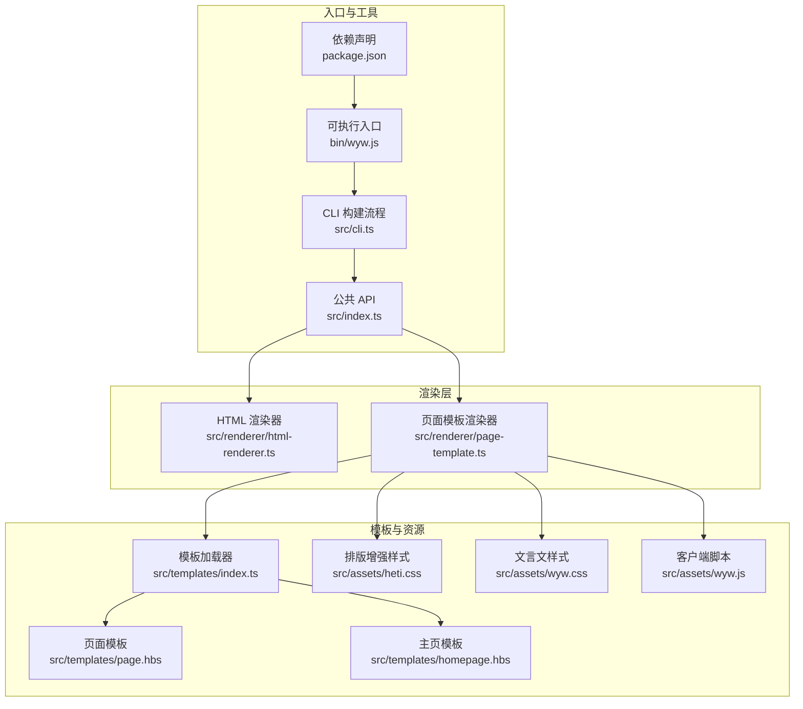
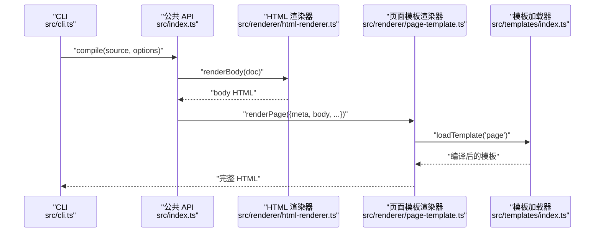
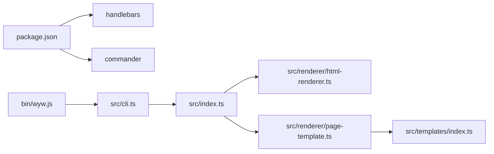

# 模板系统

<cite>
**本文引用的文件**
- [src/index.ts](file://src/index.ts)
- [src/cli.ts](file://src/cli.ts)
- [src/renderer/page-template.ts](file://src/renderer/page-template.ts)
- [src/renderer/html-renderer.ts](file://src/renderer/html-renderer.ts)
- [src/templates/index.ts](file://src/templates/index.ts)
- [src/templates/page.hbs](file://src/templates/page.hbs)
- [src/templates/homepage.hbs](file://src/templates/homepage.hbs)
- [src/assets/heti.css](file://src/assets/heti.css)
- [src/assets/wyw.css](file://src/assets/wyw.css)
- [src/assets/wyw.js](file://src/assets/wyw.js)
- [package.json](file://package.json)
- [bin/wyw.js](file://bin/wyw.js)
- [examples/范仲淹_岳阳楼记.wyw](file://examples/范仲淹_岳阳楼记.wyw)
- [test/demo/李清照_声声慢·寻寻觅觅.wyw](file://test/demo/李清照_声声慢·寻寻觅觅.wyw)
</cite>

## 目录
1. [简介](#简介)
2. [项目结构](#项目结构)
3. [核心组件](#核心组件)
4. [架构总览](#架构总览)
5. [详细组件分析](#详细组件分析)
6. [依赖关系分析](#依赖关系分析)
7. [性能考量](#性能考量)
8. [故障排查指南](#故障排查指南)
9. [结论](#结论)
10. [附录](#附录)

## 简介
本模板系统基于 Handlebars 模板引擎，结合自研的文言文解析与渲染管线，将 .wyw 源文件编译为语义清晰、排版优美的 HTML 页面。系统通过“页面模板”和“主页模板”两类模板满足不同场景需求，并提供内联与外链资源两种加载策略、主题与译文开关等运行时行为控制。模板系统具备良好的可扩展性，允许注册自定义 Handlebars Helper 并开发自定义模板。

## 项目结构
模板系统的关键目录与文件如下：
- 模板与模板加载器：src/templates/*.hbs 与 src/templates/index.ts
- 页面渲染：src/renderer/page-template.ts（组合 body 与页面骨架）、src/renderer/html-renderer.ts（将 AST 渲染为 HTML body）
- 资源与样式：src/assets/*.css、src/assets/*.js
- 入口与命令行：src/index.ts（公共 API）、src/cli.ts（CLI 构建流程）、bin/wyw.js（可执行入口）
- 依赖声明：package.json（含 handlebars、commander）

图表来源
- [src/index.ts:1-57](file://src/index.ts#L1-L57)
- [src/renderer/page-template.ts:1-87](file://src/renderer/page-template.ts#L1-L87)
- [src/renderer/html-renderer.ts:1-251](file://src/renderer/html-renderer.ts#L1-L251)
- [src/templates/index.ts:1-34](file://src/templates/index.ts#L1-L34)
- [src/templates/page.hbs:1-17](file://src/templates/page.hbs#L1-L17)
- [src/templates/homepage.hbs:1-202](file://src/templates/homepage.hbs#L1-L202)
- [src/assets/heti.css:1-180](file://src/assets/heti.css#L1-L180)
- [src/assets/wyw.css:1-657](file://src/assets/wyw.css#L1-L657)
- [src/assets/wyw.js:1-204](file://src/assets/wyw.js#L1-L204)
- [src/cli.ts:1-182](file://src/cli.ts#L1-L182)
- [bin/wyw.js:1-7](file://bin/wyw.js#L1-L7)
- [package.json:1-56](file://package.json#L1-L56)

章节来源
- [src/index.ts:1-57](file://src/index.ts#L1-L57)
- [src/cli.ts:1-182](file://src/cli.ts#L1-L182)
- [src/renderer/page-template.ts:1-87](file://src/renderer/page-template.ts#L1-L87)
- [src/renderer/html-renderer.ts:1-251](file://src/renderer/html-renderer.ts#L1-L251)
- [src/templates/index.ts:1-34](file://src/templates/index.ts#L1-L34)
- [src/templates/page.hbs:1-17](file://src/templates/page.hbs#L1-L17)
- [src/templates/homepage.hbs:1-202](file://src/templates/homepage.hbs#L1-L202)
- [src/assets/heti.css:1-180](file://src/assets/heti.css#L1-L180)
- [src/assets/wyw.css:1-657](file://src/assets/wyw.css#L1-L657)
- [src/assets/wyw.js:1-204](file://src/assets/wyw.js#L1-L204)
- [package.json:1-56](file://package.json#L1-L56)
- [bin/wyw.js:1-7](file://bin/wyw.js#L1-L7)

## 核心组件
- 公共 API（compile）：负责解析 .wyw 源文本、渲染 body、调用页面模板生成完整 HTML。
- HTML 渲染器：将 AST 转换为 HTML body 片段，处理标题、段落、诗词、引用、分隔线等。
- 页面模板渲染器：组装页面骨架、注入标题、主题、CSS/JS、body 内容等。
- 模板加载器：读取 .hbs 文件并缓存编译后的模板，导出 Handlebars 实例以便注册自定义 Helper。
- CLI：提供构建、初始化模板、校验等功能；支持内联资源与监听重编译。

章节来源
- [src/index.ts:7-33](file://src/index.ts#L7-L33)
- [src/renderer/html-renderer.ts:17-44](file://src/renderer/html-renderer.ts#L17-L44)
- [src/renderer/page-template.ts:22-68](file://src/renderer/page-template.ts#L22-L68)
- [src/templates/index.ts:15-33](file://src/templates/index.ts#L15-L33)
- [src/cli.ts:28-113](file://src/cli.ts#L28-L113)

## 架构总览
模板系统采用“解析 → 渲染 → 模板包装”的三层结构：
- 解析层：将 .wyw 源文本解析为 AST（由公共 API 调用）。
- 渲染层：HTML 渲染器生成 body；页面模板渲染器生成完整 HTML。
- 模板层：Handlebars 模板加载器加载并缓存模板，页面模板与主页模板分别用于单页与站点首页。

图表来源
- [src/cli.ts:116-164](file://src/cli.ts#L116-L164)
- [src/index.ts:17-28](file://src/index.ts#L17-L28)
- [src/renderer/html-renderer.ts:20-44](file://src/renderer/html-renderer.ts#L20-L44)
- [src/renderer/page-template.ts:25-68](file://src/renderer/page-template.ts#L25-L68)
- [src/templates/index.ts:18-30](file://src/templates/index.ts#L18-L30)

## 详细组件分析

### 模板加载与缓存（src/templates/index.ts）
- 功能要点
  - 读取模板目录下的 .hbs 文件并编译为模板委托。
  - 使用 Map 缓存已编译模板，避免重复 I/O 与编译开销。
  - 导出 Handlebars 实例，便于在应用中注册自定义 Helper。
- 关键实现路径
  - [模板加载与缓存:18-30](file://src/templates/index.ts#L18-L30)
  - [导出 Handlebars 实例:32-33](file://src/templates/index.ts#L32-L33)

章节来源
- [src/templates/index.ts:15-33](file://src/templates/index.ts#L15-L33)

### 页面模板（src/renderer/page-template.ts）
- 功能要点
  - 组装完整 HTML 页面骨架，注入标题、主题、CSS/JS、body 内容。
  - 支持内联与外链两种资源加载策略；根据 options.inline 控制。
  - 根据 showTranslation 生成文章类名，控制译文显示。
  - 对标题进行安全转义与标记剥离，确保显示效果与安全。
- 关键实现路径
  - [页面渲染选项与主体逻辑:25-68](file://src/renderer/page-template.ts#L25-L68)
  - [内联与外链资源选择:43-57](file://src/renderer/page-template.ts#L43-L57)
  - [标题与转义处理:70-86](file://src/renderer/page-template.ts#L70-L86)

章节来源
- [src/renderer/page-template.ts:13-68](file://src/renderer/page-template.ts#L13-L68)
- [src/renderer/page-template.ts:70-87](file://src/renderer/page-template.ts#L70-L87)

### 主页模板（src/templates/homepage.hbs）
- 设计要点
  - 用于站点首页，提供词云与标签页两种视图模式，内置搜索与切换逻辑。
  - 通过 Handlebars 循环渲染词云项与标签页内容，支持条件渲染（如 active 状态）。
  - 内嵌 JavaScript 初始化视图切换、标签页切换与搜索功能。
- 关键实现路径
  - [视图与标签页结构:19-54](file://src/templates/homepage.hbs#L19-L54)
  - [循环渲染与条件渲染:26-52](file://src/templates/homepage.hbs#L26-L52)
  - [内嵌脚本与搜索逻辑:60-199](file://src/templates/homepage.hbs#L60-L199)

章节来源
- [src/templates/homepage.hbs:1-202](file://src/templates/homepage.hbs#L1-L202)

### 页面模板（src/templates/page.hbs）
- 设计要点
  - 简洁的页面骨架，注入标题、主题、CSS/JS 与 body 内容。
  - 使用安全字符串插入 CSS/JS，避免二次转义。
- 关键实现路径
  - [页面骨架与变量注入:1-17](file://src/templates/page.hbs#L1-L17)

章节来源
- [src/templates/page.hbs:1-17](file://src/templates/page.hbs#L1-L17)

### HTML 渲染器（src/renderer/html-renderer.ts）
- 功能要点
  - 将 AST 的 Block/Inline 节点转换为 HTML。
  - 处理标题、段落组、诗词块、引用、分隔线、校对日期等。
  - 支持注音（ruby）、注释（annotate）、着重（emphasis）等富文本标记。
  - 自动剥离标题中的特殊标记，生成页面标题。
- 关键实现路径
  - [渲染入口与头部处理:20-44](file://src/renderer/html-renderer.ts#L20-L44)
  - [块级节点渲染分发:80-97](file://src/renderer/html-renderer.ts#L80-L97)
  - [诗词块渲染与分段:125-186](file://src/renderer/html-renderer.ts#L125-L186)
  - [内联节点渲染与转义:195-233](file://src/renderer/html-renderer.ts#L195-L233)

章节来源
- [src/renderer/html-renderer.ts:17-251](file://src/renderer/html-renderer.ts#L17-L251)

### 公共 API（src/index.ts）
- 功能要点
  - 暴露 compile 接口，串联解析、渲染与模板包装。
  - 导出 parse、renderBody、renderPage 类型，便于二次开发。
- 关键实现路径
  - [compile 函数:17-28](file://src/index.ts#L17-L28)
  - [类型导出:34-56](file://src/index.ts#L34-L56)

章节来源
- [src/index.ts:7-57](file://src/index.ts#L7-L57)

### CLI（src/cli.ts）
- 功能要点
  - 提供 build、init、validate 子命令。
  - 支持内联资源、监听文件变化、输出统计信息。
  - 构建时复制静态资源到输出目录（非内联模式）。
- 关键实现路径
  - [命令定义与动作:28-113](file://src/cli.ts#L28-L113)
  - [构建流程与资源复制:116-164](file://src/cli.ts#L116-L164)

章节来源
- [src/cli.ts:1-182](file://src/cli.ts#L1-L182)

### 可扩展性与自定义模板
- 注册自定义 Handlebars Helper
  - 通过导出的 Handlebars 实例在应用启动时注册自定义 Helper，以扩展模板能力。
  - 参考：[导出 Handlebars 实例:32-33](file://src/templates/index.ts#L32-L33)
- 开发自定义模板
  - 在 src/templates 目录新增 .hbs 文件，使用 loadTemplate 加载并缓存。
  - 参考：[模板加载与缓存:18-30](file://src/templates/index.ts#L18-L30)
- 模板变量绑定与条件渲染
  - 页面模板与主页模板均使用 Handlebars 语法进行变量绑定与条件/循环渲染。
  - 参考：[页面模板变量注入:60-67](file://src/renderer/page-template.ts#L60-L67)、[主页模板循环与条件:26-52](file://src/templates/homepage.hbs#L26-L52)

章节来源
- [src/templates/index.ts:18-33](file://src/templates/index.ts#L18-L33)
- [src/renderer/page-template.ts:60-67](file://src/renderer/page-template.ts#L60-L67)
- [src/templates/homepage.hbs:26-52](file://src/templates/homepage.hbs#L26-L52)

### 模板变量绑定、条件渲染与循环处理
- 页面模板（page.hbs）
  - 变量绑定：title、theme、articleClasses、body、cssTag、jsTag。
  - 安全字符串：cssTag、jsTag 使用安全字符串避免二次转义。
  - 参考：[变量注入与安全字符串:60-67](file://src/renderer/page-template.ts#L60-L67)、[页面模板:1-17](file://src/templates/page.hbs#L1-L17)
- 主页模板（homepage.hbs）
  - 循环渲染：使用 {{#each}} 渲染词云项与标签页内容。
  - 条件渲染：根据 active 状态切换标签页与视图。
  - 参考：[循环与条件:26-52](file://src/templates/homepage.hbs#L26-L52)

章节来源
- [src/renderer/page-template.ts:60-67](file://src/renderer/page-template.ts#L60-L67)
- [src/templates/page.hbs:1-17](file://src/templates/page.hbs#L1-L17)
- [src/templates/homepage.hbs:26-52](file://src/templates/homepage.hbs#L26-L52)

### 页面模板与主页模板的设计差异与适用场景
- 页面模板（page.hbs）
  - 适用于单篇文言文页面，强调内容展示与交互。
  - 提供主题切换、译文显示控制、字体大小调节等运行时行为。
  - 适用场景：文章详情页、独立文稿展示。
- 主页模板（homepage.hbs）
  - 适用于站点首页，提供多种视图模式与搜索功能。
  - 适用场景：文言文作品集合展示、站点导航页。
- 关键实现路径
  - [页面模板骨架:1-17](file://src/templates/page.hbs#L1-L17)
  - [主页模板骨架与交互:1-202](file://src/templates/homepage.hbs#L1-L202)

章节来源
- [src/templates/page.hbs:1-17](file://src/templates/page.hbs#L1-L17)
- [src/templates/homepage.hbs:1-202](file://src/templates/homepage.hbs#L1-L202)

### 模板系统与资源加载
- 内联模式
  - 将 CSS/JS 读取为字符串直接注入到 HTML 中，减少网络请求。
  - 参考：[内联资源处理:43-57](file://src/renderer/page-template.ts#L43-L57)
- 外链模式
  - 生成 link/script 标签指向外部资源，需复制静态资源到输出目录。
  - 参考：[外链资源处理:54-57](file://src/renderer/page-template.ts#L54-L57)、[资源复制:138-153](file://src/cli.ts#L138-L153)

章节来源
- [src/renderer/page-template.ts:43-57](file://src/renderer/page-template.ts#L43-L57)
- [src/cli.ts:138-153](file://src/cli.ts#L138-L153)

### 示例与最佳实践
- 示例文件
  - [范仲淹_岳阳楼记.wyw:1-31](file://examples/范仲淹_岳阳楼记.wyw#L1-L31)：演示标题、作者、译文、注音与注释标记。
  - [李清照_声声慢·寻寻觅觅.wyw:1-21](file://test/demo/李清照_声声慢·寻寻觅觅.wyw#L1-L21)：演示诗词块标记。
- 最佳实践
  - 使用内联模式快速预览与打包，外链模式用于生产环境以提升缓存效率。
  - 在模板中尽量使用安全字符串插入动态内容，避免 XSS。
  - 通过 CLI 的 watch 选项提高开发效率。
  - 参考：[CLI 构建与监听:43-56](file://src/cli.ts#L43-L56)、[内联与外链资源:43-57](file://src/renderer/page-template.ts#L43-L57)

章节来源
- [examples/范仲淹_岳阳楼记.wyw:1-31](file://examples/范仲淹_岳阳楼记.wyw#L1-L31)
- [test/demo/李清照_声声慢·寻寻觅觅.wyw:1-21](file://test/demo/李清照_声声慢·寻寻觅觅.wyw#L1-L21)
- [src/cli.ts:43-56](file://src/cli.ts#L43-L56)
- [src/renderer/page-template.ts:43-57](file://src/renderer/page-template.ts#L43-L57)

## 依赖关系分析
- 模块耦合
  - 公共 API 仅依赖解析与渲染模块，保持低耦合。
  - 页面模板渲染器依赖模板加载器与资源文件。
  - CLI 依赖公共 API 与模板加载器。
- 外部依赖
  - handlebars：模板引擎。
  - commander：CLI 命令行框架。
- 关键实现路径
  - [依赖声明:45-54](file://package.json#L45-L54)
  - [模板加载器导入 Handlebars](file://src/templates/index.ts#L7)
  - [页面模板渲染器导入模板加载器](file://src/renderer/page-template.ts#L7)

图表来源
- [package.json:45-54](file://package.json#L45-L54)
- [src/templates/index.ts:7](file://src/templates/index.ts#L7)
- [src/renderer/page-template.ts:7](file://src/renderer/page-template.ts#L7)
- [src/index.ts:3-6](file://src/index.ts#L3-L6)
- [src/cli.ts:3-15](file://src/cli.ts#L3-L15)
- [bin/wyw.js:3](file://bin/wyw.js#L3)

章节来源
- [package.json:1-56](file://package.json#L1-L56)
- [src/templates/index.ts:7](file://src/templates/index.ts#L7)
- [src/renderer/page-template.ts:7](file://src/renderer/page-template.ts#L7)
- [src/index.ts:3-6](file://src/index.ts#L3-L6)
- [src/cli.ts:3-15](file://src/cli.ts#L3-L15)
- [bin/wyw.js:3](file://bin/wyw.js#L3)

## 性能考量
- 模板缓存
  - 模板加载器使用 Map 缓存已编译模板，避免重复 I/O 与编译。
  - 参考：[模板缓存:12-30](file://src/templates/index.ts#L12-L30)
- 资源加载策略
  - 内联模式减少请求数但增大 HTML 体积；外链模式利于缓存复用。
  - 参考：[内联与外链资源:43-57](file://src/renderer/page-template.ts#L43-L57)
- 渲染优化
  - HTML 渲染器按节点类型分发渲染，避免不必要的字符串拼接。
  - 参考：[块级节点分发:80-97](file://src/renderer/html-renderer.ts#L80-L97)

## 故障排查指南
- 模板未生效或变量为空
  - 检查模板加载器是否正确加载 .hbs 文件与缓存。
  - 参考：[模板加载与缓存:18-30](file://src/templates/index.ts#L18-L30)
- CSS/JS 未加载
  - 确认资源路径与复制逻辑；外链模式需复制静态资源。
  - 参考：[资源复制:138-153](file://src/cli.ts#L138-L153)
- XSS 或内容被转义
  - 使用安全字符串插入动态内容；避免二次转义。
  - 参考：[安全字符串注入:65-66](file://src/renderer/page-template.ts#L65-L66)
- 主题与译文状态异常
  - 检查本地存储与按钮状态同步逻辑。
  - 参考：[偏好恢复与切换:21-127](file://src/assets/wyw.js#L21-L127)

章节来源
- [src/templates/index.ts:18-30](file://src/templates/index.ts#L18-L30)
- [src/cli.ts:138-153](file://src/cli.ts#L138-L153)
- [src/renderer/page-template.ts:65-66](file://src/renderer/page-template.ts#L65-L66)
- [src/assets/wyw.js:21-127](file://src/assets/wyw.js#L21-L127)

## 结论
该模板系统以 Handlebars 为核心，结合自研解析与渲染管线，实现了从 .wyw 到 HTML 的完整编译流程。页面模板与主页模板分别覆盖单页与站点首页场景，配合内联/外链资源策略与运行时主题/译文控制，既保证了可访问性又兼顾了性能。系统通过模板缓存与 CLI 工具链提升了开发体验，并提供了扩展点以支持自定义模板与 Helper。

## 附录
- 可执行入口
  - [bin/wyw.js:1-7](file://bin/wyw.js#L1-L7)
- 示例与演示
  - [范仲淹_岳阳楼记.wyw:1-31](file://examples/范仲淹_岳阳楼记.wyw#L1-L31)
  - [李清照_声声慢·寻寻觅觅.wyw:1-21](file://test/demo/李清照_声声慢·寻寻觅觅.wyw#L1-L21)
- 样式与脚本
  - [src/assets/heti.css:1-180](file://src/assets/heti.css#L1-L180)
  - [src/assets/wyw.css:1-657](file://src/assets/wyw.css#L1-L657)
  - [src/assets/wyw.js:1-204](file://src/assets/wyw.js#L1-L204)