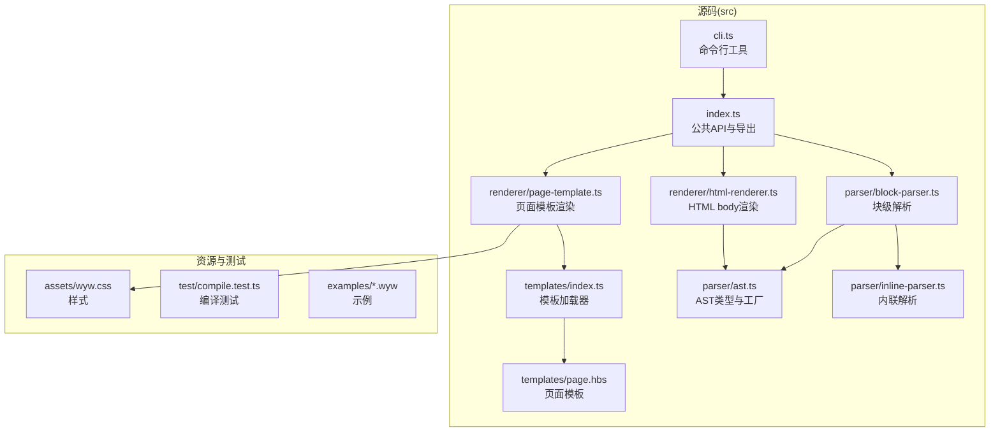
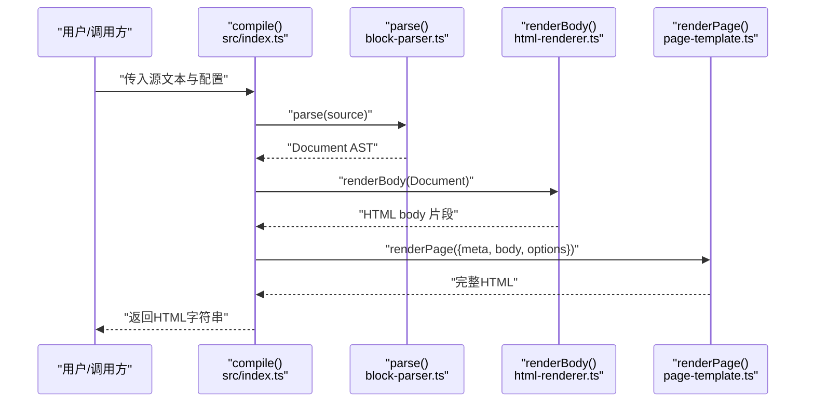
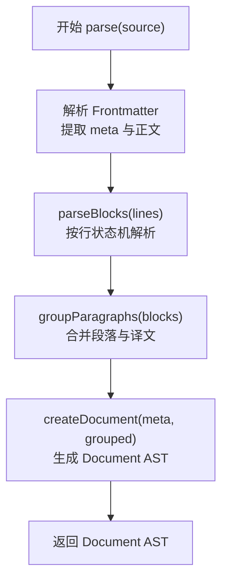
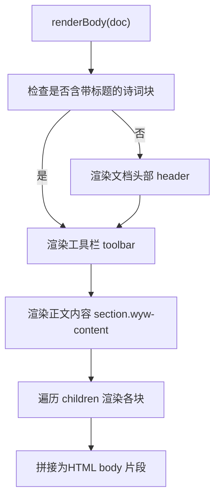
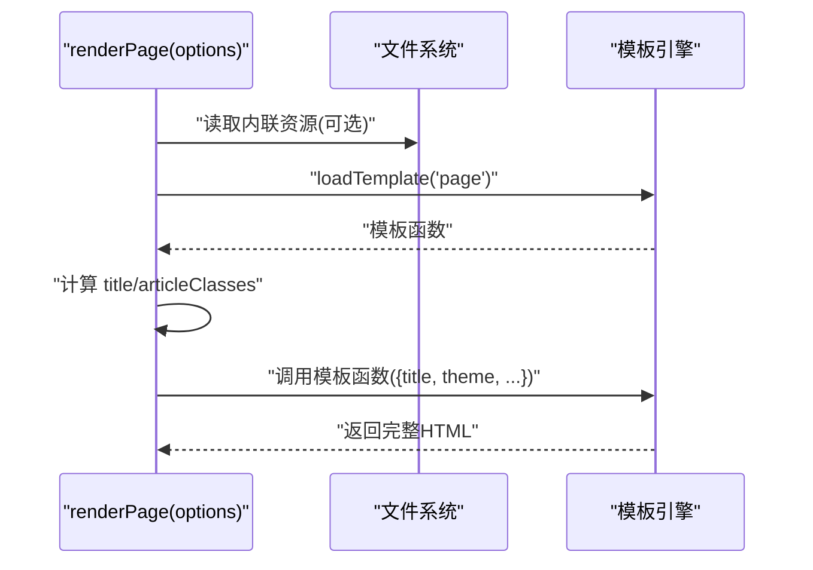
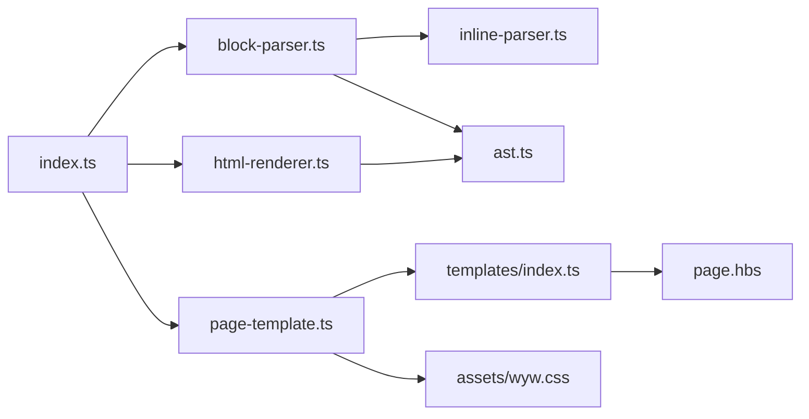

# 编译器API

<cite>
**本文引用的文件列表**
- [src/index.ts](file://src/index.ts)
- [src/parser/block-parser.ts](file://src/parser/block-parser.ts)
- [src/parser/inline-parser.ts](file://src/parser/inline-parser.ts)
- [src/parser/ast.ts](file://src/parser/ast.ts)
- [src/renderer/html-renderer.ts](file://src/renderer/html-renderer.ts)
- [src/renderer/page-template.ts](file://src/renderer/page-template.ts)
- [src/templates/index.ts](file://src/templates/index.ts)
- [src/templates/page.hbs](file://src/templates/page.hbs)
- [src/cli.ts](file://src/cli.ts)
- [src/assets/wyw.css](file://src/assets/wyw.css)
- [test/compile.test.ts](file://test/compile.test.ts)
- [examples/刘禹锡_陋室铭.wyw](file://examples/刘禹锡_陋室铭.wyw)
- [README.md](file://README.md)
- [package.json](file://package.json)
</cite>

## 目录
1. [简介](#简介)
2. [项目结构](#项目结构)
3. [核心组件](#核心组件)
4. [架构总览](#架构总览)
5. [详细组件分析](#详细组件分析)
6. [依赖关系分析](#依赖关系分析)
7. [性能考量](#性能考量)
8. [故障排查指南](#故障排查指南)
9. [结论](#结论)
10. [附录](#附录)

## 简介
本文件系统化梳理“文言文标记语言编译器”的API与实现，重点围绕编译器主入口 compile() 的完整调用流程展开，覆盖 parse()、renderBody()、renderPage() 三大关键步骤的技术实现；详解 CompileOptions 配置项的作用与默认值；说明编译器导出的公共接口、类型定义与返回值结构；提供基础编译、自定义配置、错误处理等常见使用示例；并分析编译器的扩展点与插件接口设计思路。

## 项目结构
编译器采用“解析-渲染-模板”三层架构，源码位于 src/ 目录，CLI 逻辑位于 src/cli.ts，模板与静态资源位于 src/templates/ 与 src/assets/，测试位于 test/，示例位于 examples/。

图表来源
- [src/index.ts:1-57](file://src/index.ts#L1-L57)
- [src/parser/block-parser.ts:1-371](file://src/parser/block-parser.ts#L1-L371)
- [src/parser/inline-parser.ts:1-99](file://src/parser/inline-parser.ts#L1-L99)
- [src/parser/ast.ts:1-218](file://src/parser/ast.ts#L1-L218)
- [src/renderer/html-renderer.ts:1-251](file://src/renderer/html-renderer.ts#L1-L251)
- [src/renderer/page-template.ts:1-87](file://src/renderer/page-template.ts#L1-L87)
- [src/templates/index.ts:1-34](file://src/templates/index.ts#L1-L34)
- [src/templates/page.hbs:1-17](file://src/templates/page.hbs#L1-L17)
- [src/cli.ts:1-182](file://src/cli.ts#L1-L182)
- [src/assets/wyw.css:1-657](file://src/assets/wyw.css#L1-L657)

章节来源
- [README.md:110-125](file://README.md#L110-L125)

## 核心组件
- 公共API入口：compile(source, options) 返回完整HTML字符串
- 解析层：parse(source) 产出 Document AST
- 渲染层：renderBody(doc) 产出HTML body片段；renderPage(options) 产出完整HTML页面
- 模板层：Handlebars模板加载与渲染
- CLI：命令行构建、监听、初始化、校验

章节来源
- [src/index.ts:7-28](file://src/index.ts#L7-L28)
- [src/renderer/page-template.ts:13-68](file://src/renderer/page-template.ts#L13-L68)
- [src/renderer/html-renderer.ts:20-44](file://src/renderer/html-renderer.ts#L20-L44)

## 架构总览
编译器遵循“解析-渲染-模板”的分层设计，compile() 作为统一入口协调三步流程，并通过 options 控制输出形态（内联资源、主题、译文可见性等）。

图表来源
- [src/index.ts:17-28](file://src/index.ts#L17-L28)
- [src/parser/block-parser.ts:43-49](file://src/parser/block-parser.ts#L43-L49)
- [src/renderer/html-renderer.ts:20-44](file://src/renderer/html-renderer.ts#L20-L44)
- [src/renderer/page-template.ts:25-68](file://src/renderer/page-template.ts#L25-L68)

## 详细组件分析

### compile() 主流程与配置项
- 输入：source（.wyw 源文本）、options（CompileOptions）
- 输出：完整HTML字符串
- 关键步骤：
  1) parse(source)：解析Frontmatter与正文，生成 Document AST
  2) renderBody(doc)：将AST转为HTML body片段
  3) renderPage({...})：包装body为完整HTML，注入CSS/JS与模板变量
- 配置项（CompileOptions）：
  - inline?: boolean，默认false，控制是否内联CSS/JS
  - assetsPath?: string，默认""，非内联模式下的资源相对路径
  - theme?: string，默认"auto"，主题模式（auto/light/dark）
  - showTranslation?: boolean，默认true，是否默认显示译文
- 返回值：string（完整HTML）

章节来源
- [src/index.ts:7-28](file://src/index.ts#L7-L28)
- [src/renderer/page-template.ts:13-33](file://src/renderer/page-template.ts#L13-L33)

### parse()：块级解析与AST生成
- 功能：解析Frontmatter，按行状态机解析块级结构，生成原始块节点，再合并为段落组
- 状态机：IDLE、IN_PARAGRAPH、IN_TRANSLATION、IN_FENCED、IN_BLOCKQUOTE
- 支持的块：
  - 标题（#）、段落、译文（>>）、引用（>）、围栏块（::: poetry...）、分隔线（---）、校对日期（--YYYY年M月D日--）
- 合并策略：相邻 paragraph 与 translation 合并为 paragraph_group
- 输出：Document AST（含 meta 与 children）

图表来源
- [src/parser/block-parser.ts:43-49](file://src/parser/block-parser.ts#L43-L49)
- [src/parser/block-parser.ts:72-341](file://src/parser/block-parser.ts#L72-L341)
- [src/parser/block-parser.ts:346-370](file://src/parser/block-parser.ts#L346-L370)

章节来源
- [src/parser/block-parser.ts:43-49](file://src/parser/block-parser.ts#L43-L49)
- [src/parser/block-parser.ts:72-341](file://src/parser/block-parser.ts#L72-L341)
- [src/parser/block-parser.ts:346-370](file://src/parser/block-parser.ts#L346-L370)

### renderBody()：HTML body 渲染
- 功能：将 Document AST 渲染为HTML body片段
- 特性：
  - 若文档不含带标题的诗词块，则渲染文档头部（标题/作者/朝代）
  - 渲染工具栏（译文开关、字号、主题切换）
  - 遍历块节点，按类型渲染为HTML
- 支持的块：
  - heading、paragraph_group、poetry_block、blockquote、section_break、proofread_date
- 内联渲染：使用 inline-parser 将内联标记（注音、注释、着重）转换为HTML

图表来源
- [src/renderer/html-renderer.ts:20-44](file://src/renderer/html-renderer.ts#L20-L44)
- [src/renderer/html-renderer.ts:80-186](file://src/renderer/html-renderer.ts#L80-L186)

章节来源
- [src/renderer/html-renderer.ts:20-44](file://src/renderer/html-renderer.ts#L20-L44)
- [src/renderer/html-renderer.ts:80-186](file://src/renderer/html-renderer.ts#L80-L186)

### renderPage()：页面模板渲染
- 功能：生成完整HTML页面，包装body，注入CSS/JS与模板变量
- 资源注入策略：
  - inline=true：读取本地CSS/JS内容，内联到HTML
  - inline=false：生成<link>/<script>标签，指向assetsPath
- 模板变量：
  - title：从meta剥离内联标记后生成
  - theme：auto/light/dark
  - articleClasses：根据是否显示译文动态附加类
  - body：renderBody() 生成的HTML片段
  - cssTag/jsTag：由模板安全输出
- 模板来源：src/templates/page.hbs

图表来源
- [src/renderer/page-template.ts:25-68](file://src/renderer/page-template.ts#L25-L68)
- [src/templates/index.ts:18-30](file://src/templates/index.ts#L18-L30)
- [src/templates/page.hbs:1-17](file://src/templates/page.hbs#L1-17)

章节来源
- [src/renderer/page-template.ts:25-68](file://src/renderer/page-template.ts#L25-L68)
- [src/templates/index.ts:18-30](file://src/templates/index.ts#L18-L30)
- [src/templates/page.hbs:1-17](file://src/templates/page.hbs#L1-17)

### 内联解析与AST类型
- 内联解析：inline-parser 以优先级正则匹配注音、注释、注音+注释组合、着重
- AST类型：DocumentMeta、DocumentNode、BlockNode、InlineNode及其工厂函数
- 作用：为渲染器提供结构化数据，确保HTML生成的准确性与一致性

章节来源
- [src/parser/inline-parser.ts:22-46](file://src/parser/inline-parser.ts#L22-L46)
- [src/parser/ast.ts:5-118](file://src/parser/ast.ts#L5-L118)

### CLI 与构建流程
- 命令：build、init、validate
- build：读取文件、调用 compile()、输出HTML、复制静态资源（非内联模式）
- watch：监听文件变化并自动重编译
- init：生成模板 .wyw 文件
- validate：格式校验并输出结果

章节来源
- [src/cli.ts:28-182](file://src/cli.ts#L28-L182)

## 依赖关系分析

图表来源
- [src/index.ts:3-5](file://src/index.ts#L3-L5)
- [src/parser/block-parser.ts:4-24](file://src/parser/block-parser.ts#L4-L24)
- [src/renderer/html-renderer.ts:4-15](file://src/renderer/html-renderer.ts#L4-L15)
- [src/renderer/page-template.ts:4-7](file://src/renderer/page-template.ts#L4-L7)
- [src/templates/index.ts:4-7](file://src/templates/index.ts#L4-L7)
- [src/templates/page.hbs:1-17](file://src/templates/page.hbs#L1-L17)
- [src/assets/wyw.css:1-657](file://src/assets/wyw.css#L1-L657)

章节来源
- [src/index.ts:3-5](file://src/index.ts#L3-L5)
- [src/parser/block-parser.ts:4-24](file://src/parser/block-parser.ts#L4-L24)
- [src/renderer/html-renderer.ts:4-15](file://src/renderer/html-renderer.ts#L4-L15)
- [src/renderer/page-template.ts:4-7](file://src/renderer/page-template.ts#L4-L7)
- [src/templates/index.ts:4-7](file://src/templates/index.ts#L4-L7)
- [src/templates/page.hbs:1-17](file://src/templates/page.hbs#L1-L17)
- [src/assets/wyw.css:1-657](file://src/assets/wyw.css#L1-L657)

## 性能考量
- 解析阶段：状态机线性扫描，时间复杂度 O(n)，空间开销取决于块与内联节点数量
- 渲染阶段：遍历AST，字符串拼接，整体 O(n)
- 模板阶段：模板编译缓存（templates/index.ts 使用Map缓存），避免重复编译
- 资源注入：内联模式会读取CSS/JS文件，建议在批量构建时考虑I/O成本
- 建议：
  - 大量文件构建时启用 watch 与增量输出
  - 静态站点场景优先使用内联模式减少HTTP请求
  - 在CI中预编译模板与资源，提升稳定性

[本节为通用性能讨论，无需特定文件来源]

## 故障排查指南
- 常见问题
  - 未安装依赖：确保执行 postinstall 或手动复制 heti-addon.min.js 至 src/assets
  - 模板未找到：确认 templates 目录与 .hbs 文件存在
  - 资源路径错误：非内联模式需确保 assetsPath 正确
  - Frontmatter 格式错误：检查 --- 分隔与字段格式
- 调试建议
  - 使用 CLI 的 validate 命令检查格式
  - 在测试中参考 compile.test.ts 断言，定位注音、注释、译文渲染问题
  - 逐步拆解 compile()：先 parse() 再 renderBody()，最后 renderPage()

章节来源
- [src/cli.ts:96-111](file://src/cli.ts#L96-L111)
- [test/compile.test.ts:14-94](file://test/compile.test.ts#L14-L94)

## 结论
本编译器以清晰的三层架构实现了从 .wyw 到精美HTML的自动化编译，compile() 作为统一入口串联解析、渲染与模板，配置项灵活控制输出形态。其模块化设计便于扩展与维护，适合构建文言文阅读辅助与教学资源站点。

[本节为总结性内容，无需特定文件来源]

## 附录

### API与类型定义概览
- 公共函数
  - compile(source: string, options?: CompileOptions): string
  - parse(source: string): DocumentNode
  - renderBody(doc: DocumentNode): string
  - renderPage(options: RenderPageOptions): string
- 类型定义
  - CompileOptions：inline?, assetsPath?, theme?, showTranslation?
  - RenderPageOptions：meta, body, inline?, assetsPath?, theme?, showTranslation?
  - DocumentMeta：title, author, dynasty
  - AST类型：DocumentNode、BlockNode、InlineNode 及其工厂函数
- 返回值
  - compile：完整HTML字符串
  - renderBody：HTML body片段
  - renderPage：完整HTML页面

章节来源
- [src/index.ts:7-33](file://src/index.ts#L7-L33)
- [src/renderer/page-template.ts:13-20](file://src/renderer/page-template.ts#L13-L20)
- [src/parser/ast.ts:5-118](file://src/parser/ast.ts#L5-L118)

### 使用示例（路径指引）
- 基础编译
  - 参考：[compile.test.ts:18-21](file://test/compile.test.ts#L18-L21)
- 自定义配置
  - inline、theme、showTranslation：参考 [src/cli.ts:122-126](file://src/cli.ts#L122-L126) 与 [src/index.ts:23-27](file://src/index.ts#L23-L27)
- 错误处理
  - CLI validate 命令：参考 [src/cli.ts:96-111](file://src/cli.ts#L96-L111)
- 示例文件
  - [examples/刘禹锡_陋室铭.wyw](file://examples/刘禹锡_陋室铭.wyw)

章节来源
- [test/compile.test.ts:18-21](file://test/compile.test.ts#L18-L21)
- [src/cli.ts:122-126](file://src/cli.ts#L122-L126)
- [src/index.ts:23-27](file://src/index.ts#L23-L27)
- [src/cli.ts:96-111](file://src/cli.ts#L96-L111)
- [examples/刘禹锡_陋室铭.wyw:1-22](file://examples/刘禹锡_陋室铭.wyw#L1-L22)

### 扩展点与插件接口设计
- 模板扩展：通过 templates/index.ts 的模板加载器与 Handlebars 实例，可注册自定义 helper 或替换模板
- 渲染扩展：renderBody() 与 renderPage() 为渲染扩展点，可在保持接口一致的前提下替换实现
- 解析扩展：block-parser 与 inline-parser 的正则优先级与工厂函数可按需扩展新语法
- 资源注入：renderPage() 的资源注入策略可扩展为CDN、版本化、压缩等

章节来源
- [src/templates/index.ts:18-33](file://src/templates/index.ts#L18-L33)
- [src/renderer/html-renderer.ts:20-44](file://src/renderer/html-renderer.ts#L20-L44)
- [src/renderer/page-template.ts:25-68](file://src/renderer/page-template.ts#L25-L68)
- [src/parser/block-parser.ts:22-46](file://src/parser/block-parser.ts#L22-L46)