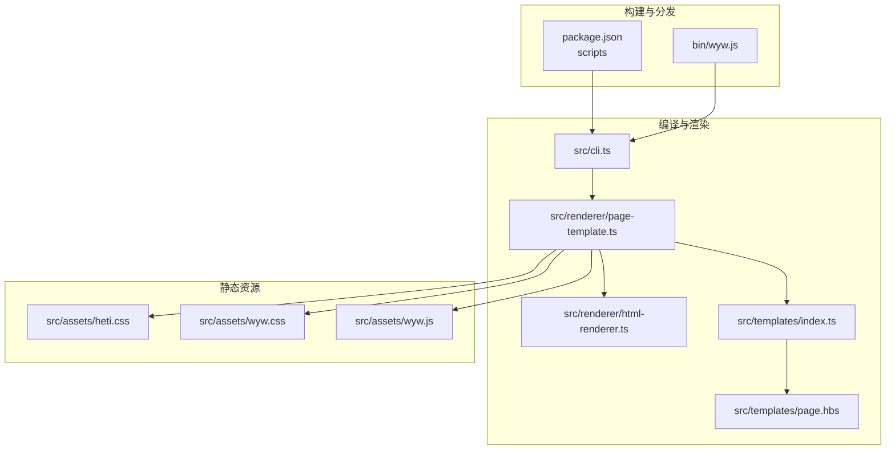
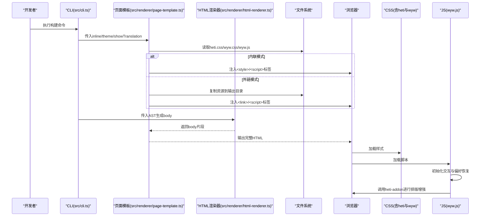
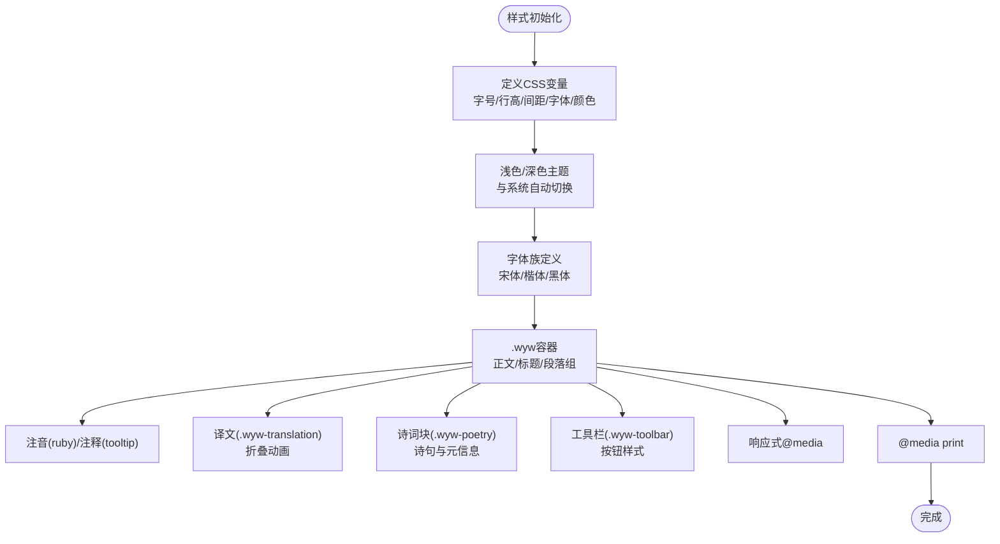
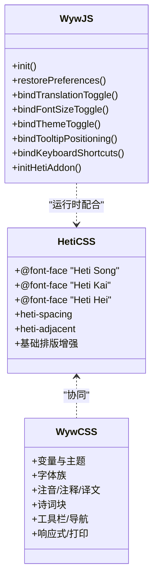
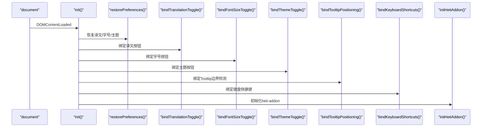
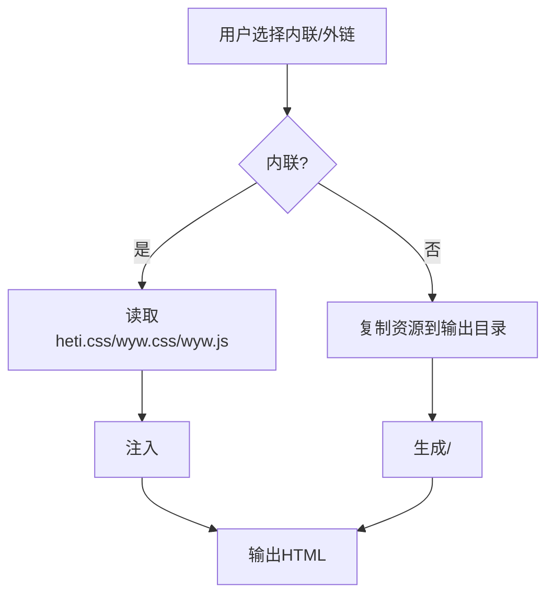
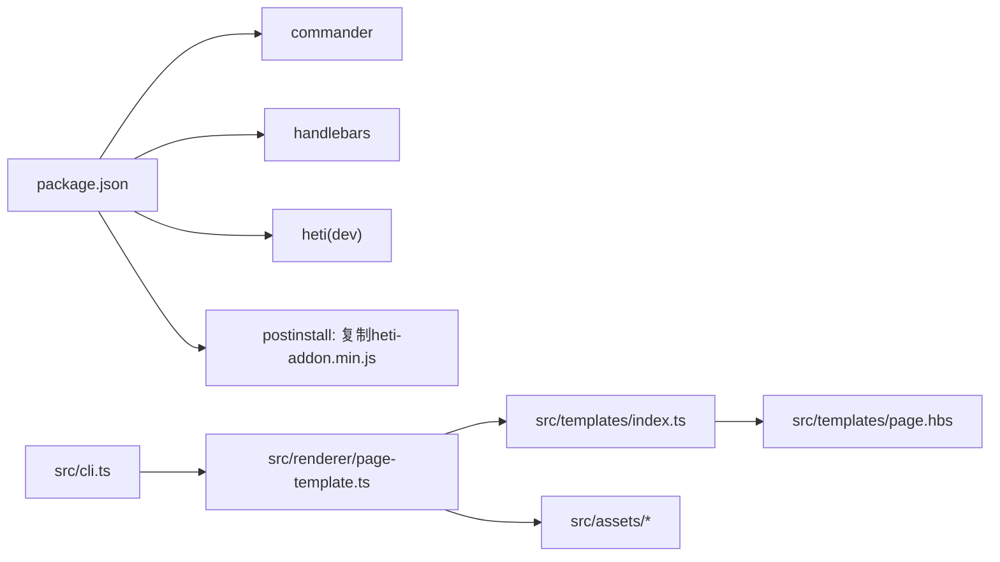

# 静态资源管理

<cite>
**本文引用的文件列表**
- [README.md](file://README.md)
- [package.json](file://package.json)
- [bin/wyw.js](file://bin/wyw.js)
- [src/cli.ts](file://src/cli.ts)
- [src/renderer/page-template.ts](file://src/renderer/page-template.ts)
- [src/renderer/html-renderer.ts](file://src/renderer/html-renderer.ts)
- [src/templates/page.hbs](file://src/templates/page.hbs)
- [src/templates/index.ts](file://src/templates/index.ts)
- [src/assets/wyw.css](file://src/assets/wyw.css)
- [src/assets/heti.css](file://src/assets/heti.css)
- [src/assets/wyw.js](file://src/assets/wyw.js)
- [examples/刘禹锡_陋室铭.wyw](file://examples/刘禹锡_陋室铭.wyw)
</cite>

## 目录
1. [引言](#引言)
2. [项目结构](#项目结构)
3. [核心组件](#核心组件)
4. [架构总览](#架构总览)
5. [详细组件分析](#详细组件分析)
6. [依赖关系分析](#依赖关系分析)
7. [性能考量](#性能考量)
8. [故障排查指南](#故障排查指南)
9. [结论](#结论)
10. [附录](#附录)

## 引言
本文件面向静态资源管理与前端交互，围绕文言文标记语言编译器的 CSS 样式组织、中文排版优化库（赫蹏，heti）的集成与配置、JavaScript 交互逻辑以及资源加载策略与性能优化进行系统化说明。文档同时提供自定义样式开发指南与主题切换实现方法，帮助开发者在保持良好中文排版体验的同时，灵活扩展与优化资源加载与交互行为。

## 项目结构
该仓库采用“模块化 + 模板渲染”的结构组织静态资源与前端逻辑：
- 构建与分发：通过 npm scripts 控制构建流程，复制或内联静态资源到 dist 输出目录。
- 渲染层：HTML 渲染器负责将 AST 转换为 HTML 片段；页面模板负责拼接完整 HTML 结构。
- 静态资源：CSS（含中文排版增强样式）与 JS（客户端交互脚本）位于 src/assets。
- 模板系统：Handlebars 模板用于注入 CSS/JS 标签与页面主体内容。
- CLI：命令行工具负责编译、复制资源、统计信息输出与监听模式。

图表来源
- [package.json:18-27](file://package.json#L18-L27)
- [bin/wyw.js:1-7](file://bin/wyw.js#L1-L7)
- [src/cli.ts:28-56](file://src/cli.ts#L28-L56)
- [src/renderer/page-template.ts:25-68](file://src/renderer/page-template.ts#L25-L68)
- [src/renderer/html-renderer.ts:20-44](file://src/renderer/html-renderer.ts#L20-L44)
- [src/templates/index.ts:18-30](file://src/templates/index.ts#L18-L30)
- [src/templates/page.hbs:1-17](file://src/templates/page.hbs#L1-L17)

章节来源
- [README.md:110-126](file://README.md#L110-L126)
- [package.json:18-27](file://package.json#L18-L27)
- [src/cli.ts:28-56](file://src/cli.ts#L28-L56)

## 核心组件
- CSS 样式体系
  - 中文排版增强样式（heti.css）：提供跨平台中文字体族定义与标点挤压、中西文间距等排版增强类。
  - 文言文专用样式（wyw.css）：定义变量、浅/深色主题、字体族、字号、行高、间距、注音、注释、译文、工具栏、响应式与打印样式等。
- JavaScript 交互脚本（wyw.js）
  - DOMContentLoaded 初始化、偏好恢复（localStorage）、译文开关、字号切换、主题切换、Tooltip 边界检测、键盘快捷键、heti-addon 初始化。
- 渲染与模板
  - HTML 渲染器：将 AST 节点渲染为 HTML 片段（标题、段落组、诗词块、引用、分隔线、校对日期等）。
  - 页面模板：根据 inline 选项决定内联或外链 CSS/JS，并注入到模板中。
- CLI 与资源复制
  - 支持内联与外链两种资源加载策略；非内联模式下复制 CSS/JS 与 favicon 到输出目录；支持监听模式自动重编译。

章节来源
- [src/assets/heti.css:1-180](file://src/assets/heti.css#L1-L180)
- [src/assets/wyw.css:1-657](file://src/assets/wyw.css#L1-L657)
- [src/assets/wyw.js:1-204](file://src/assets/wyw.js#L1-L204)
- [src/renderer/html-renderer.ts:20-44](file://src/renderer/html-renderer.ts#L20-L44)
- [src/renderer/page-template.ts:25-68](file://src/renderer/page-template.ts#L25-L68)
- [src/cli.ts:116-164](file://src/cli.ts#L116-L164)

## 架构总览
静态资源管理贯穿“编译期”与“运行期”两个阶段：
- 编译期：CLI 根据用户选项选择内联或外链资源；页面模板根据 theme 与 showTranslation 参数生成页面；HTML 渲染器生成正文内容。
- 运行期：浏览器加载 CSS/JS；wyw.js 初始化交互；heti-addon 根据内容动态调整标点与间距；本地存储持久化用户偏好。

图表来源
- [src/cli.ts:116-164](file://src/cli.ts#L116-L164)
- [src/renderer/page-template.ts:25-68](file://src/renderer/page-template.ts#L25-L68)
- [src/renderer/html-renderer.ts:20-44](file://src/renderer/html-renderer.ts#L20-L44)
- [src/templates/page.hbs:1-17](file://src/templates/page.hbs#L1-L17)

## 详细组件分析

### CSS 样式组织与中文排版优化
- 变量与主题
  - 使用 CSS 自定义属性集中管理字号、行高、间距、最大宽度、缩进、网格单位与字体族。
  - 定义浅色与深色主题变量，并支持基于系统配色方案的自动切换。
- 字体与排版
  - 为宋体、楷体、黑体分别提供多权重的字体族定义，确保跨平台一致的中文字体匹配。
  - 为注音（ruby）、注释（tooltip）、译文（.wyw-translation）提供独立样式与动画。
- 结构化样式
  - 文档头部、正文、标题、段落组、诗词块、引用、分隔线、工具栏、导航、校对日期等均具备独立类名与响应式适配。
- 打印样式
  - 隐藏工具栏、强制显示译文、禁用 tooltip，保证打印效果清晰。

图表来源
- [src/assets/wyw.css:6-68](file://src/assets/wyw.css#L6-L68)
- [src/assets/wyw.css:105-122](file://src/assets/wyw.css#L105-L122)
- [src/assets/wyw.css:224-326](file://src/assets/wyw.css#L224-L326)
- [src/assets/wyw.css:339-391](file://src/assets/wyw.css#L339-L391)
- [src/assets/wyw.css:416-498](file://src/assets/wyw.css#L416-L498)
- [src/assets/wyw.css:535-554](file://src/assets/wyw.css#L535-L554)

章节来源
- [src/assets/wyw.css:6-68](file://src/assets/wyw.css#L6-L68)
- [src/assets/wyw.css:105-122](file://src/assets/wyw.css#L105-L122)
- [src/assets/wyw.css:224-326](file://src/assets/wyw.css#L224-L326)
- [src/assets/wyw.css:339-391](file://src/assets/wyw.css#L339-L391)
- [src/assets/wyw.css:416-498](file://src/assets/wyw.css#L416-L498)
- [src/assets/wyw.css:535-554](file://src/assets/wyw.css#L535-L554)

### 中文排版优化库（heti）集成与配置
- 字体族定义
  - 提供 Heti Song/Kai/Hei 的多权重 @font-face，覆盖多种系统字体，确保在不同平台获得一致的中文字体呈现。
- 排版增强类
  - 提供 heti-spacing 与 heti-adjacent 类，配合运行时脚本实现中西文间距与标点挤压。
- 与 wyw 样式的协同
  - 将 heti 的增强类限定在 .wyw 作用域内，避免与现有样式冲突，同时保留基础排版增强（如连续标注元素间的微小间隔）。

图表来源
- [src/assets/heti.css:10-129](file://src/assets/heti.css#L10-L129)
- [src/assets/heti.css:135-179](file://src/assets/heti.css#L135-L179)
- [src/assets/wyw.css:6-68](file://src/assets/wyw.css#L6-L68)
- [src/assets/wyw.js:1-204](file://src/assets/wyw.js#L1-L204)

章节来源
- [src/assets/heti.css:10-129](file://src/assets/heti.css#L10-L129)
- [src/assets/heti.css:135-179](file://src/assets/heti.css#L135-L179)
- [src/assets/wyw.css:6-68](file://src/assets/wyw.css#L6-L68)
- [src/assets/wyw.js:169-178](file://src/assets/wyw.js#L169-L178)

### JavaScript 交互逻辑与用户偏好
- 初始化与事件绑定
  - DOMContentLoaded 后执行 init，依次恢复用户偏好、绑定译文/字号/主题切换、Tooltip 边界检测、键盘快捷键与 heti-addon 初始化。
- 偏好持久化
  - 译文显示状态、字号、主题均通过 localStorage 持久化，刷新页面后自动恢复。
- 交互细节
  - Tooltip 根据可视区边界动态设置对齐方向，避免溢出。
  - 键盘快捷键：T 切换译文、D 切换主题、F 切换字号。
  - heti-addon 在存在全局 Heti 对象时初始化，静默处理异常，不影响页面显示。

图表来源
- [src/assets/wyw.js:5-18](file://src/assets/wyw.js#L5-L18)
- [src/assets/wyw.js:21-45](file://src/assets/wyw.js#L21-L45)
- [src/assets/wyw.js:48-57](file://src/assets/wyw.js#L48-L57)
- [src/assets/wyw.js:62-87](file://src/assets/wyw.js#L62-L87)
- [src/assets/wyw.js:100-116](file://src/assets/wyw.js#L100-L116)
- [src/assets/wyw.js:129-148](file://src/assets/wyw.js#L129-L148)
- [src/assets/wyw.js:180-202](file://src/assets/wyw.js#L180-L202)
- [src/assets/wyw.js:169-178](file://src/assets/wyw.js#L169-L178)

章节来源
- [src/assets/wyw.js:5-18](file://src/assets/wyw.js#L5-L18)
- [src/assets/wyw.js:21-45](file://src/assets/wyw.js#L21-L45)
- [src/assets/wyw.js:48-57](file://src/assets/wyw.js#L48-L57)
- [src/assets/wyw.js:62-87](file://src/assets/wyw.js#L62-L87)
- [src/assets/wyw.js:100-116](file://src/assets/wyw.js#L100-L116)
- [src/assets/wyw.js:129-148](file://src/assets/wyw.js#L129-L148)
- [src/assets/wyw.js:180-202](file://src/assets/wyw.js#L180-L202)
- [src/assets/wyw.js:169-178](file://src/assets/wyw.js#L169-L178)

### 资源加载策略与性能优化
- 内联 vs 外链
  - 内联：将 CSS/JS 读入内存后直接注入到 HTML，减少网络请求，适合单页或静态站点。
  - 外链：复制资源到输出目录并通过 <link>/<script> 引入，利于缓存与并行下载。
- 构建脚本与复制策略
  - 非内联模式下，CLI 会复制 heti.css、wyw.css、heti-addon.min.js、wyw.js 与 favicon 到输出目录。
- 性能建议
  - 优先使用外链并启用浏览器缓存；对生产环境可考虑 CDN 与压缩。
  - 将 CSS/JS 按需拆分，避免一次性加载过多资源。
  - 使用 defer/async 或模块化打包工具进一步优化加载顺序。

图表来源
- [src/renderer/page-template.ts:43-57](file://src/renderer/page-template.ts#L43-L57)
- [src/cli.ts:138-147](file://src/cli.ts#L138-L147)

章节来源
- [src/renderer/page-template.ts:43-57](file://src/renderer/page-template.ts#L43-L57)
- [src/cli.ts:138-147](file://src/cli.ts#L138-L147)

### 自定义样式开发指南与主题切换实现
- 自定义样式开发
  - 建议在 wyw.css 基础上新增类名或变量，避免直接修改核心样式，便于升级与维护。
  - 使用 CSS 变量统一管理颜色、字号、行高等，便于主题切换与响应式适配。
  - 为新功能预留命名空间（如 .wyw-custom-*），并与现有类名（.wyw-*）保持一致的前缀风格。
- 主题切换实现
  - 通过 data-theme 属性控制主题（auto/light/dark），结合媒体查询与变量覆盖实现自动切换。
  - 交互层通过按钮循环切换主题，并将结果写入 localStorage，刷新后自动恢复。

章节来源
- [src/assets/wyw.css:44-68](file://src/assets/wyw.css#L44-L68)
- [src/assets/wyw.js:100-116](file://src/assets/wyw.js#L100-L116)
- [src/assets/wyw.js:118-127](file://src/assets/wyw.js#L118-L127)

## 依赖关系分析
- 构建与运行时依赖
  - package.json 中声明了 commander、handlebars 作为运行时依赖，heti 作为开发依赖，postinstall 脚本自动复制 heti-addon.min.js 到 src/assets。
- 模板与渲染
  - page-template.ts 依赖 templates/index.ts 加载 Handlebars 模板；page.hbs 作为最终输出模板，注入 CSS/JS 标签与文章主体。
- CLI 与资源复制
  - CLI 在构建过程中根据 inline 选项决定资源复制与注入策略。

图表来源
- [package.json:45-54](file://package.json#L45-L54)
- [package.json:19](file://package.json#L19)
- [src/cli.ts:138-147](file://src/cli.ts#L138-L147)
- [src/renderer/page-template.ts:59-67](file://src/renderer/page-template.ts#L59-L67)
- [src/templates/index.ts:18-30](file://src/templates/index.ts#L18-L30)
- [src/templates/page.hbs:1-17](file://src/templates/page.hbs#L1-17)

章节来源
- [package.json:45-54](file://package.json#L45-L54)
- [src/cli.ts:138-147](file://src/cli.ts#L138-L147)
- [src/renderer/page-template.ts:59-67](file://src/renderer/page-template.ts#L59-L67)
- [src/templates/index.ts:18-30](file://src/templates/index.ts#L18-L30)
- [src/templates/page.hbs:1-17](file://src/templates/page.hbs#L1-17)

## 性能考量
- 资源加载
  - 外链模式更利于缓存与并行下载；内联模式减少请求数但可能影响缓存复用。
- 样式体积
  - 仅保留必要的字体族与变量，避免冗余样式；将第三方增强样式与业务样式分离。
- 交互脚本
  - 使用事件委托与节流/防抖优化高频事件（如滚动、窗口尺寸变化）；对 Tooltip 的边界检测进行估算，避免过度计算。
- 构建优化
  - 使用构建工具进行压缩与 Tree Shaking；对模板进行缓存以减少重复编译开销。

## 故障排查指南
- 资源未加载
  - 检查 CLI 是否正确复制资源到输出目录；确认外链路径与 assetsPath 设置是否正确。
- 样式冲突
  - 确认自定义样式未覆盖 .wyw 作用域内的关键类；优先使用变量与组合类而非直接覆盖。
- 交互异常
  - 检查 wyw.js 是否在 DOMContentLoaded 后执行；确认按钮类名与事件绑定一致；验证 localStorage 权限。
- 排版问题
  - 确保 heti-addon.min.js 已正确复制并在页面中加载；检查 initHetiAddon 的调用时机与异常处理。

章节来源
- [src/cli.ts:138-147](file://src/cli.ts#L138-L147)
- [src/renderer/page-template.ts:43-57](file://src/renderer/page-template.ts#L43-L57)
- [src/assets/wyw.js:169-178](file://src/assets/wyw.js#L169-L178)

## 结论
本静态资源管理体系以 CSS 变量与主题系统为核心，结合中文排版优化库（heti）与轻量级交互脚本，实现了良好的文言文阅读体验与可扩展性。通过内联与外链两种资源加载策略，开发者可在不同场景下平衡首屏性能与缓存效率。建议在自定义样式开发中遵循命名规范与变量体系，并充分利用主题切换与键盘快捷键提升用户体验。

## 附录
- 示例文件
  - 示例 .wyw 文件展示了注音、注释、译文、诗词块等语法的实际应用，可用于验证样式与交互效果。
- 命令行使用
  - README 提供了安装、构建与开发命令的说明，包括内联选项、主题与译文默认行为等。

章节来源
- [examples/刘禹锡_陋室铭.wyw:1-22](file://examples/刘禹锡_陋室铭.wyw#L1-L22)
- [README.md:35-77](file://README.md#L35-L77)