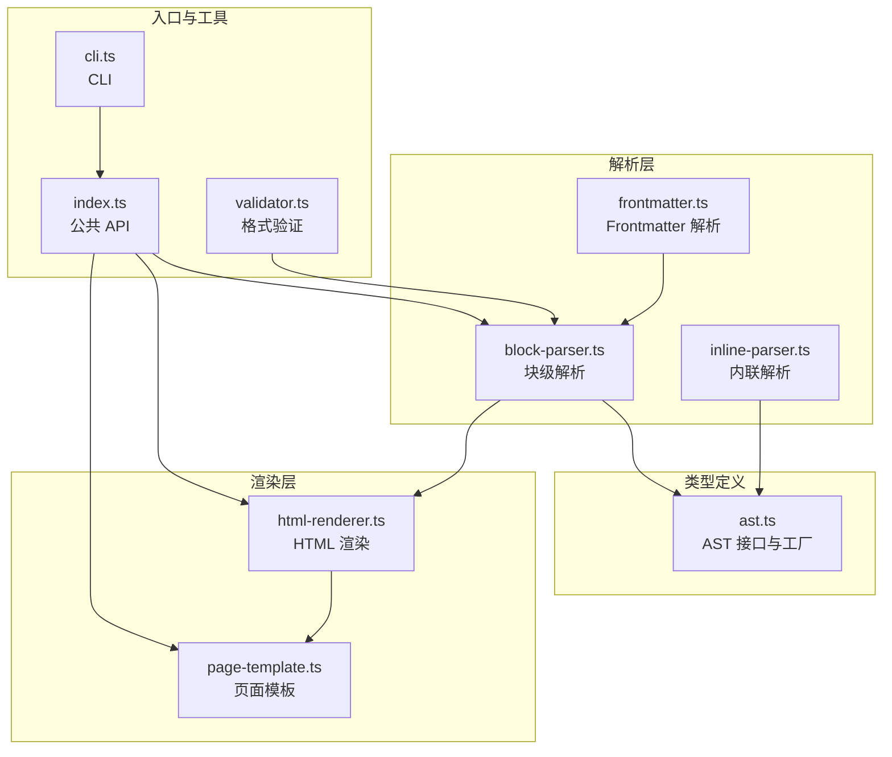
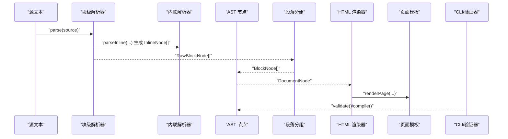
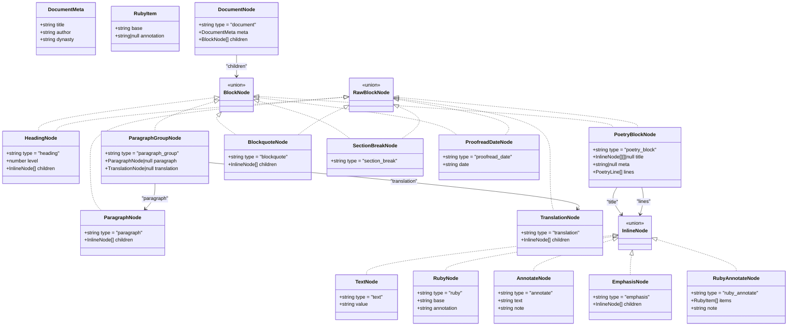
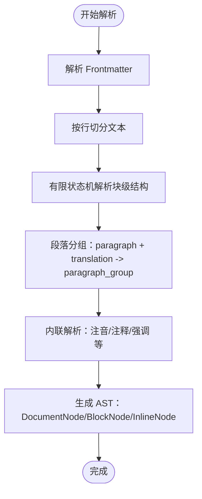
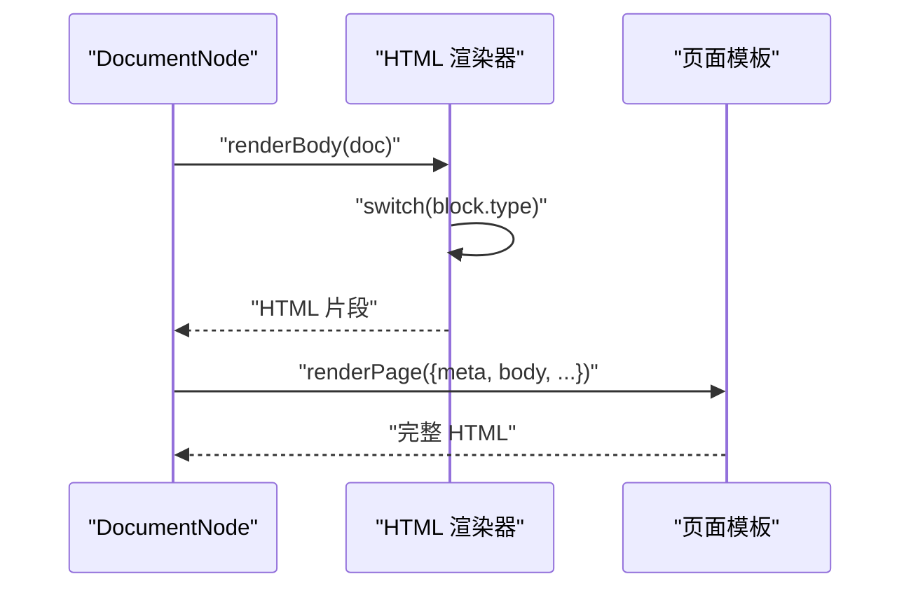
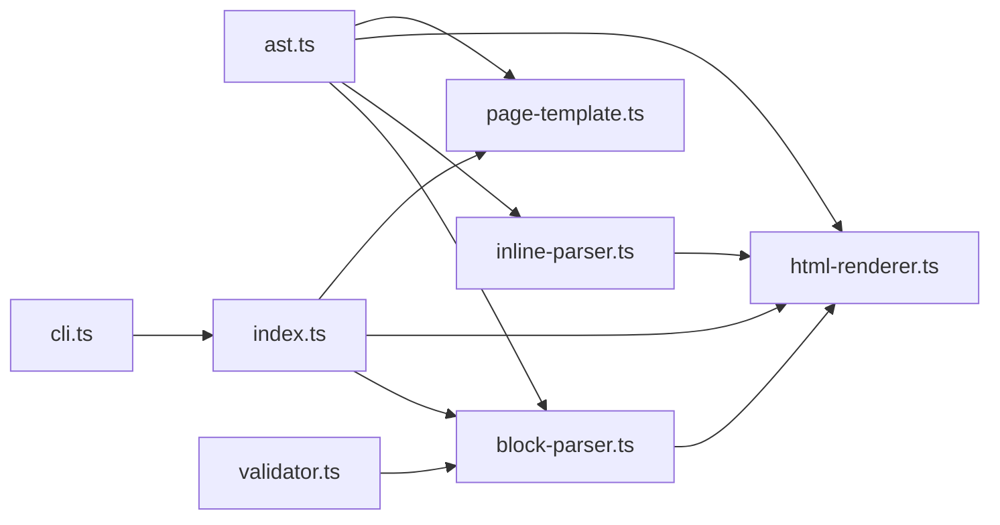

# 类型系统设计

<cite>
**本文档引用的文件**
- [ast.ts](file://src/parser/ast.ts)
- [block-parser.ts](file://src/parser/block-parser.ts)
- [inline-parser.ts](file://src/parser/inline-parser.ts)
- [html-renderer.ts](file://src/renderer/html-renderer.ts)
- [page-template.ts](file://src/renderer/page-template.ts)
- [index.ts](file://src/index.ts)
- [cli.ts](file://src/cli.ts)
- [validator.ts](file://src/validator.ts)
- [parser.test.ts](file://test/parser.test.ts)
- [package.json](file://package.json)
</cite>

## 目录
1. [简介](#简介)
2. [项目结构](#项目结构)
3. [核心组件](#核心组件)
4. [架构总览](#架构总览)
5. [详细组件分析](#详细组件分析)
6. [依赖分析](#依赖分析)
7. [性能考量](#性能考量)
8. [故障排查指南](#故障排查指南)
9. [结论](#结论)
10. [附录](#附录)

## 简介
本设计文档聚焦文言文编译器的类型系统，系统性阐述 AST 类型定义的设计理念、类型层次结构与接口设计，并深入分析 DocumentNode、BlockNode、InlineNode 等核心类型的继承关系与职责划分。文档还覆盖各类文言文元素（标题、段落、注音、注释、译文、诗词围栏块、分隔线、校对日期等）对应的类型定义与工厂函数，提供类型安全编程的最佳实践、类型推导技巧以及扩展与自定义节点类型的开发指南，帮助开发者在保证类型安全的前提下高效扩展编译器能力。

## 项目结构
编译器采用“解析-分组-渲染”的三层架构：
- 解析层：负责将源文本解析为 AST（DocumentNode、BlockNode、InlineNode）。
- 分组层：将相邻的原文段落与译文合并为段落组。
- 渲染层：将 AST 渲染为 HTML 页面。

图表来源
- [block-parser.ts:1-371](file://src/parser/block-parser.ts#L1-L371)
- [inline-parser.ts:1-99](file://src/parser/inline-parser.ts#L1-L99)
- [ast.ts:1-218](file://src/parser/ast.ts#L1-L218)
- [html-renderer.ts:1-251](file://src/renderer/html-renderer.ts#L1-L251)
- [page-template.ts:1-87](file://src/renderer/page-template.ts#L1-L87)
- [index.ts:1-57](file://src/index.ts#L1-L57)
- [cli.ts:1-182](file://src/cli.ts#L1-L182)
- [validator.ts:1-838](file://src/validator.ts#L1-L838)

章节来源
- [index.ts:1-57](file://src/index.ts#L1-L57)
- [package.json:1-56](file://package.json#L1-L56)

## 核心组件
本节概述类型系统的核心组成与职责：
- 文档元数据：DocumentMeta，承载标题、作者、朝代等元信息。
- 内联节点（InlineNode）：文本、注音、注释、强调、注音+注释组合等。
- 块级节点（BlockNode）：文档根、标题、段落组、诗词围栏块、引用块、分隔线、校对日期等。
- 原始块节点（RawBlockNode）：在分组前的块节点集合，便于解析阶段的灵活处理。
- 工厂函数：统一创建 AST 节点，保证类型安全与一致性。

章节来源
- [ast.ts:5-218](file://src/parser/ast.ts#L5-L218)

## 架构总览
类型系统贯穿解析与渲染两端，形成“强类型 AST → 强类型渲染”的闭环。解析器将源文本转换为 AST，渲染器根据 AST 类型分支进行 HTML 输出，CLI 与验证器通过公共 API 与类型系统协作。

图表来源
- [block-parser.ts:43-49](file://src/parser/block-parser.ts#L43-L49)
- [inline-parser.ts:62-98](file://src/parser/inline-parser.ts#L62-L98)
- [html-renderer.ts:20-44](file://src/renderer/html-renderer.ts#L20-L44)
- [page-template.ts:25-68](file://src/renderer/page-template.ts#L25-L68)
- [cli.ts:116-164](file://src/cli.ts#L116-L164)
- [validator.ts:758-779](file://src/validator.ts#L758-L779)

## 详细组件分析

### AST 类型层次与设计理念
- 设计目标
  - 明确的层级：DocumentNode 作为根容器，包含 BlockNode；BlockNode 内部可包含 InlineNode。
  - 语义清晰：每种节点类型对应一种文言文元素，便于解析与渲染。
  - 类型安全：通过联合类型与工厂函数，减少运行时错误。
- 关键设计原则
  - “type” 字段：每个节点带有唯一字符串字面量类型，用于类型守卫与模式匹配。
  - 工厂函数：集中创建节点，避免手写对象时的拼写错误与字段遗漏。
  - 可选字段：如 ParagraphGroupNode 的 paragraph/translation 可为 null，体现“可选配对”。

章节来源
- [ast.ts:55-118](file://src/parser/ast.ts#L55-L118)
- [ast.ts:132-217](file://src/parser/ast.ts#L132-L217)

#### 类图：核心类型与工厂

图表来源
- [ast.ts:5-218](file://src/parser/ast.ts#L5-L218)

### DocumentNode、BlockNode、InlineNode 接口设计与继承关系
- DocumentNode
  - 作为 AST 根节点，持有 DocumentMeta 与 BlockNode[]。
  - 由工厂函数 createDocument 创建，确保 type 字段与 children 结构一致。
- BlockNode
  - 块级节点的联合类型，涵盖标题、段落组、诗词围栏块、引用块、分隔线、校对日期等。
  - 通过类型守卫在渲染器中进行分支处理。
- InlineNode
  - 内联节点的联合类型，涵盖文本、注音、注释、强调、注音+注释组合等。
  - 由内联解析器按优先级生成，渲染器据此输出 HTML。

章节来源
- [ast.ts:55-118](file://src/parser/ast.ts#L55-L118)
- [ast.ts:46-51](file://src/parser/ast.ts#L46-L51)

### 文言文元素对应的类型定义
- 标题：HeadingNode，包含 level 与 InlineNode[] children。
- 段落：ParagraphNode，包含 InlineNode[] children。
- 译文：TranslationNode，包含 InlineNode[] children。
- 段落组：ParagraphGroupNode，可同时包含 paragraph 与 translation，体现原文与译文的一对一配对。
- 诗词围栏块：PoetryBlockNode，包含可选 title、可选 meta 与 PoetryLine[] lines。lines 支持 PoetryHeading 与 InlineNode[] 的混合。
- 引用块：BlockquoteNode，包含 InlineNode[] children。
- 分隔线：SectionBreakNode，用于主题分隔。
- 校对日期：ProofreadDateNode，包含日期字符串。
- 注音：RubyNode，包含 base 与 annotation。
- 注释：AnnotateNode，包含 text 与 note。
- 强调：EmphasisNode，包含 InlineNode[] children。
- 注音+注释组合：RubyAnnotateNode，包含 RubyItem[] items 与 note；RubyItem 支持 annotation 为 null 的纯文本组合。

章节来源
- [ast.ts:55-118](file://src/parser/ast.ts#L55-L118)
- [ast.ts:18-44](file://src/parser/ast.ts#L18-L44)
- [ast.ts:83-96](file://src/parser/ast.ts#L83-L96)

### 解析流程与类型推导
- 块级解析（block-parser）
  - 基于有限状态机，识别标题、段落、译文、引用、围栏块、分隔线、校对日期等。
  - 使用工厂函数创建节点，确保类型安全。
  - groupParagraphs 将相邻 paragraph 与 translation 合并为 ParagraphGroupNode。
- 内联解析（inline-parser）
  - 按优先级匹配注音+注释组合、注音、注释、强调等。
  - parseRubyBlocks 将内部块序列解析为 RubyItem[]。
  - parseInline 返回 InlineNode[]，供块级解析器使用。

图表来源
- [block-parser.ts:43-49](file://src/parser/block-parser.ts#L43-L49)
- [block-parser.ts:72-341](file://src/parser/block-parser.ts#L72-L341)
- [inline-parser.ts:62-98](file://src/parser/inline-parser.ts#L62-L98)

章节来源
- [block-parser.ts:43-371](file://src/parser/block-parser.ts#L43-L371)
- [inline-parser.ts:13-99](file://src/parser/inline-parser.ts#L13-L99)

### 渲染流程与类型分支
- 渲染器根据 BlockNode.type 进行分支渲染，如 heading、paragraph_group、poetry_block、blockquote、section_break、proofread_date。
- 内联节点渲染遵循 node.type 分支，如 text、ruby、annotate、ruby_annotate、emphasis。
- 页面模板根据 DocumentMeta 与渲染结果生成完整 HTML。

图表来源
- [html-renderer.ts:20-44](file://src/renderer/html-renderer.ts#L20-L44)
- [html-renderer.ts:80-97](file://src/renderer/html-renderer.ts#L80-L97)
- [html-renderer.ts:195-233](file://src/renderer/html-renderer.ts#L195-L233)
- [page-template.ts:25-68](file://src/renderer/page-template.ts#L25-L68)

章节来源
- [html-renderer.ts:1-251](file://src/renderer/html-renderer.ts#L1-L251)
- [page-template.ts:1-87](file://src/renderer/page-template.ts#L1-L87)

### 类型安全编程最佳实践
- 使用工厂函数创建节点，避免手写对象时的字段缺失或拼写错误。
- 利用“type”字段进行类型守卫，确保在 switch 或 if 分支中类型收敛。
- 对可选字段（如 ParagraphGroupNode 的 paragraph/translation）进行判空处理。
- 在渲染器中对未覆盖的类型分支返回空字符串或抛出明确错误，避免静默失败。
- 在解析器与渲染器之间传递的类型保持一致，避免跨模块类型不匹配。

章节来源
- [ast.ts:132-217](file://src/parser/ast.ts#L132-L217)
- [html-renderer.ts:94-96](file://src/renderer/html-renderer.ts#L94-L96)

### 类型推导技巧
- 利用联合类型的成员属性进行推导，例如在渲染器中对 InlineNode 的分支推导出具体类型。
- 在内联解析中，parseInline(fn) 的回调参数可递归解析子节点，实现嵌套内联结构的类型推导。
- 在解析器中，对 lines 的 PoetryLine[] 进行类型判断，区分 PoetryHeading 与 InlineNode[]。

章节来源
- [inline-parser.ts:62-98](file://src/parser/inline-parser.ts#L62-L98)
- [html-renderer.ts:121-124](file://src/renderer/html-renderer.ts#L121-L124)

### 类型扩展与自定义节点类型开发指南
- 新增节点类型步骤
  - 在 ast.ts 中定义新接口，包含唯一的 type 字面量与必要字段。
  - 在 BlockNode 或 InlineNode 联合类型中加入新类型。
  - 在工厂函数区域新增 createXxx 工厂函数，确保 type 与字段一致。
  - 在解析器中添加识别逻辑，使用工厂函数创建节点。
  - 在渲染器中添加渲染分支，处理新节点类型。
- 注意事项
  - 保持“type”字段的唯一性与稳定性，避免破坏现有类型守卫。
  - 对可选字段提供默认值或 null 处理，确保向后兼容。
  - 在验证器中补充相应规则，确保新语法的正确性与一致性。

章节来源
- [ast.ts:55-118](file://src/parser/ast.ts#L55-L118)
- [ast.ts:132-217](file://src/parser/ast.ts#L132-L217)
- [block-parser.ts:72-341](file://src/parser/block-parser.ts#L72-L341)
- [html-renderer.ts:80-97](file://src/renderer/html-renderer.ts#L80-L97)

## 依赖分析
- 模块耦合
  - 解析器依赖类型定义与内联解析器；渲染器依赖类型定义与内联解析器；CLI/验证器依赖公共 API 与解析器。
- 外部依赖
  - commander 用于 CLI；handlebars 用于模板渲染；heti 用于排版增强。
- 类型一致性
  - index.ts 导出公共类型，确保外部使用者与内部实现共享同一类型定义。

图表来源
- [ast.ts:1-218](file://src/parser/ast.ts#L1-L218)
- [block-parser.ts:1-371](file://src/parser/block-parser.ts#L1-L371)
- [inline-parser.ts:1-99](file://src/parser/inline-parser.ts#L1-L99)
- [html-renderer.ts:1-251](file://src/renderer/html-renderer.ts#L1-L251)
- [page-template.ts:1-87](file://src/renderer/page-template.ts#L1-L87)
- [index.ts:30-56](file://src/index.ts#L30-L56)
- [cli.ts:13-15](file://src/cli.ts#L13-L15)
- [validator.ts:17-17](file://src/validator.ts#L17-L17)

章节来源
- [index.ts:30-56](file://src/index.ts#L30-L56)
- [package.json:45-54](file://package.json#L45-L54)

## 性能考量
- 内联解析优先级：inline-parser 按优先级扫描，避免重复匹配与回溯，提高解析效率。
- 状态机解析：block-parser 使用有限状态机，线性扫描文本，时间复杂度 O(N)。
- 渲染分支：渲染器通过 switch 分支快速定位渲染逻辑，避免不必要的类型检查成本。
- 工厂函数：集中创建节点，减少对象构造开销与类型检查次数。

## 故障排查指南
- Frontmatter 缺失或未闭合：验证器会报告错误或警告，建议添加标准 Frontmatter 并确保闭合。
- 括号不匹配：checkBracketBalance 会定位多余闭合括号、交叉嵌套与未闭合开括号。
- 注音/注释/注音+注释语法错误：validateRubyPattern、validateAnnotatePattern、validateRubyAnnotatePattern 提供具体错误信息。
- 诗词围栏块未闭合：checkFencedBlocks 会报告开闭数量不一致与元信息为空等问题。
- 译文配对问题：checkTranslationPairing 会提示译文前缺少原文段落。
- 解析器深度校验：checkWithParser 会在解析失败时返回错误并统计结构元素数量。

章节来源
- [validator.ts:104-779](file://src/validator.ts#L104-L779)

## 结论
本类型系统通过明确的层级结构、严格的“type”字段与工厂函数，实现了从解析到渲染的强类型闭环。DocumentNode、BlockNode、InlineNode 的设计既满足文言文元素的表达需求，又兼顾类型安全与扩展性。借助工厂函数与类型守卫，开发者可以在保证类型安全的前提下高效扩展编译器能力，同时通过验证器与测试用例确保质量与一致性。

## 附录
- 示例文档：examples/郦道元_三峡.wyw 展示了注音、注释、译文与段落组的实际应用。
- 测试用例：test/parser.test.ts 覆盖了 Frontmatter、内联解析、块级解析与完整编译流程。

章节来源
- [parser.test.ts:1-283](file://test/parser.test.ts#L1-L283)
- [examples/郦道元_三峡.wyw:1-23](file://examples/郦道元_三峡.wyw#L1-L23)