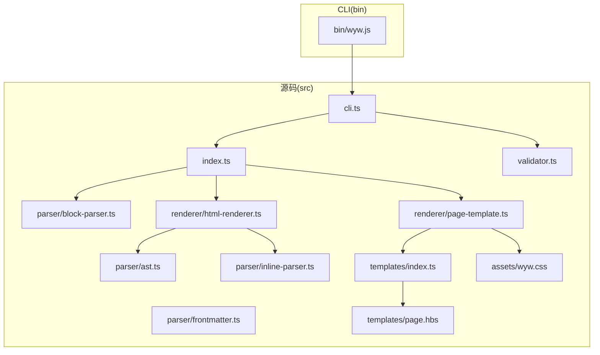
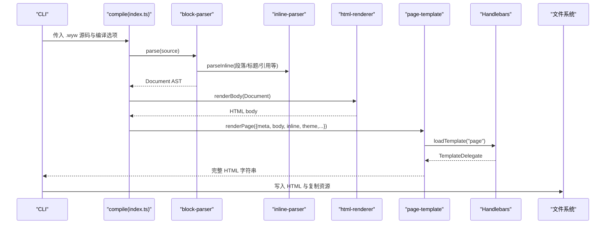
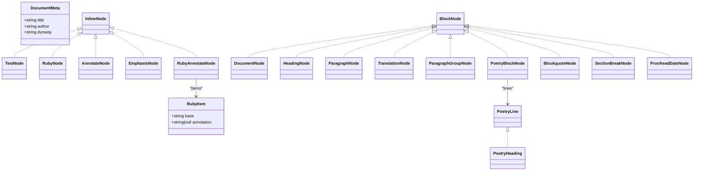
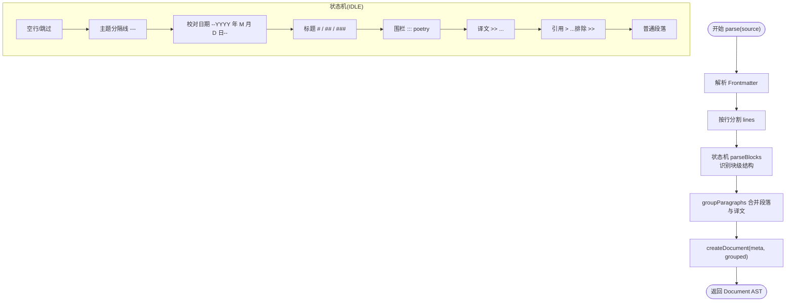
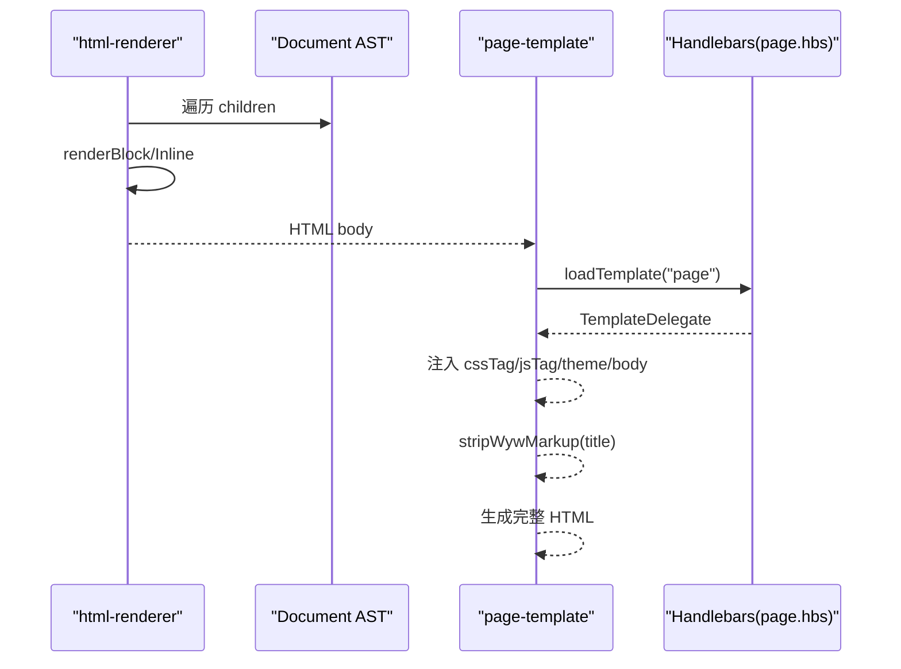
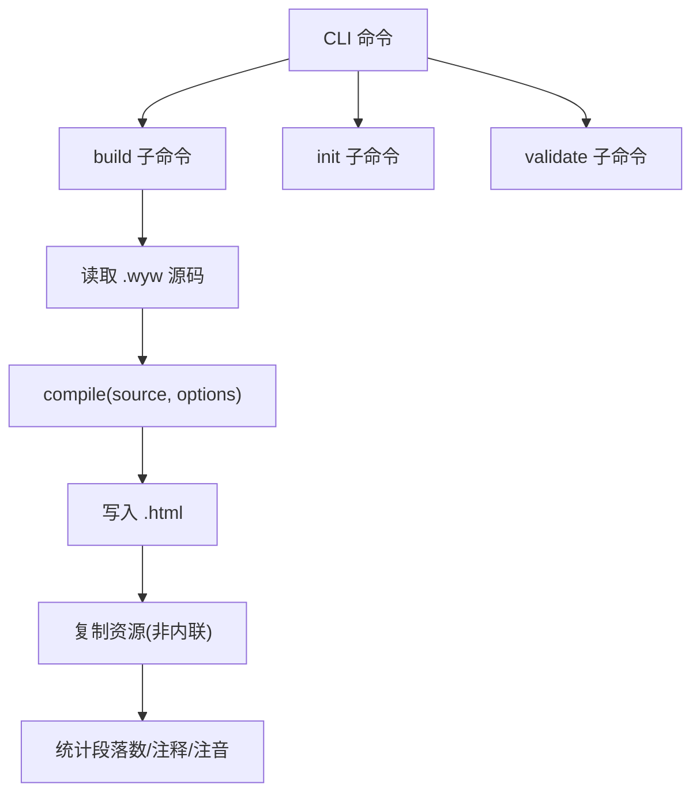
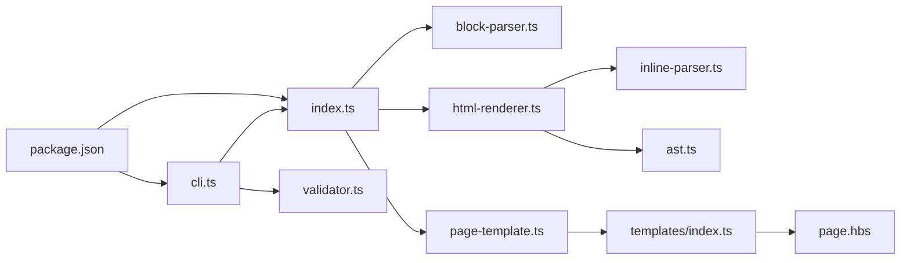

# 系统架构

<cite>
**本文引用的文件**
- [src/index.ts](file://src/index.ts)
- [src/cli.ts](file://src/cli.ts)
- [src/parser/ast.ts](file://src/parser/ast.ts)
- [src/parser/block-parser.ts](file://src/parser/block-parser.ts)
- [src/parser/inline-parser.ts](file://src/parser/inline-parser.ts)
- [src/parser/frontmatter.ts](file://src/parser/frontmatter.ts)
- [src/renderer/html-renderer.ts](file://src/renderer/html-renderer.ts)
- [src/renderer/page-template.ts](file://src/renderer/page-template.ts)
- [src/templates/index.ts](file://src/templates/index.ts)
- [src/templates/page.hbs](file://src/templates/page.hbs)
- [src/validator.ts](file://src/validator.ts)
- [src/assets/wyw.css](file://src/assets/wyw.css)
- [package.json](file://package.json)
- [README.md](file://README.md)
</cite>

## 目录
1. [引言](#引言)
2. [项目结构](#项目结构)
3. [核心组件](#核心组件)
4. [架构总览](#架构总览)
5. [详细组件分析](#详细组件分析)
6. [依赖关系分析](#依赖关系分析)
7. [性能考量](#性能考量)
8. [故障排查指南](#故障排查指南)
9. [结论](#结论)
10. [附录](#附录)

## 引言
本系统是一个“文言文标记语言”编译器，目标是将人类可读的 .wyw 源文件编译为排版精美、具备注音、注释、译文等辅助阅读能力的 HTML 页面。系统采用模块化架构，分为解析器、渲染器、模板系统与工具链四大部分，配合 CLI 与验证器，形成从源码到页面的完整流水线。

## 项目结构
- 根目录包含构建脚本、包配置与示例文件。
- 源码主要位于 src/ 下：
  - parser：负责词法/语法分析与 AST 构建（frontmatter、block、inline）。
  - renderer：负责将 AST 渲染为 HTML，并通过模板包装为完整页面。
  - templates：Handlebars 模板加载与缓存。
  - assets：样式与脚本资源。
  - cli.ts：命令行入口与构建流程。
  - index.ts：公共 API 暴露。
  - validator.ts：格式验证器。
- docs/ 与 examples/ 提供文档与示例。

**图表来源**
- [src/index.ts:1-57](file://src/index.ts#L1-L57)
- [src/cli.ts:1-182](file://src/cli.ts#L1-L182)
- [src/parser/ast.ts:1-218](file://src/parser/ast.ts#L1-L218)
- [src/parser/block-parser.ts:1-371](file://src/parser/block-parser.ts#L1-L371)
- [src/parser/inline-parser.ts:1-99](file://src/parser/inline-parser.ts#L1-L99)
- [src/parser/frontmatter.ts:1-57](file://src/parser/frontmatter.ts#L1-L57)
- [src/renderer/html-renderer.ts:1-251](file://src/renderer/html-renderer.ts#L1-L251)
- [src/renderer/page-template.ts:1-87](file://src/renderer/page-template.ts#L1-L87)
- [src/templates/index.ts:1-34](file://src/templates/index.ts#L1-L34)
- [src/templates/page.hbs:1-17](file://src/templates/page.hbs#L1-L17)
- [src/assets/wyw.css:1-200](file://src/assets/wyw.css#L1-L200)

**章节来源**
- [README.md:110-125](file://README.md#L110-L125)
- [package.json:1-56](file://package.json#L1-L56)

## 核心组件
- 公共 API（index.ts）：对外暴露 compile、parse、renderBody、renderPage 等方法，作为编译流程的统一入口。
- 解析器（parser）：
  - frontmatter：提取 YAML 风格元数据。
  - block-parser：基于有限状态机的块级解析，产出原始块节点。
  - inline-parser：基于优先级正则的内联解析，产出内联节点。
  - ast：定义 DocumentMeta、BlockNode、InlineNode 等类型与工厂函数。
- 渲染器（renderer）：
  - html-renderer：遍历 AST，生成 HTML body 片段。
  - page-template：加载 Handlebars 模板，注入 CSS/JS、主题与文章类名，生成完整 HTML。
- 模板系统（templates）：Handlebars 模板加载与缓存，提供模板实例以便注册自定义 helper。
- CLI（cli.ts）：命令行入口，支持 build、init、validate 子命令，驱动编译与资源复制。
- 验证器（validator.ts）：多规则校验器，覆盖 Frontmatter、括号匹配、注音/注释/注音+注释、围栏块、译文配对与解析器深度校验。
- 资源（assets）：样式与脚本，支持内联或外链模式。

**章节来源**
- [src/index.ts:7-33](file://src/index.ts#L7-L33)
- [src/parser/ast.ts:3-218](file://src/parser/ast.ts#L3-L218)
- [src/parser/block-parser.ts:43-49](file://src/parser/block-parser.ts#L43-L49)
- [src/parser/inline-parser.ts:62-98](file://src/parser/inline-parser.ts#L62-L98)
- [src/renderer/html-renderer.ts:20-44](file://src/renderer/html-renderer.ts#L20-L44)
- [src/renderer/page-template.ts:25-68](file://src/renderer/page-template.ts#L25-L68)
- [src/templates/index.ts:18-30](file://src/templates/index.ts#L18-L30)
- [src/cli.ts:28-114](file://src/cli.ts#L28-L114)
- [src/validator.ts:758-779](file://src/validator.ts#L758-L779)

## 架构总览
系统采用“解析-渲染-模板”的三层流水线：
- 输入：.wyw 源文件（含可选 Frontmatter）。
- 解析阶段：frontmatter 提取元数据；block-parser 基于状态机识别块级结构；inline-parser 按优先级解析内联标记。
- 渲染阶段：html-renderer 生成 body；page-template 通过 Handlebars 模板包装为完整页面。
- 输出：HTML 文件（可内联或外链资源）。

**图表来源**
- [src/index.ts:17-28](file://src/index.ts#L17-L28)
- [src/parser/block-parser.ts:43-49](file://src/parser/block-parser.ts#L43-L49)
- [src/renderer/html-renderer.ts:20-44](file://src/renderer/html-renderer.ts#L20-L44)
- [src/renderer/page-template.ts:25-68](file://src/renderer/page-template.ts#L25-L68)
- [src/templates/index.ts:18-30](file://src/templates/index.ts#L18-L30)
- [src/cli.ts:116-164](file://src/cli.ts#L116-L164)

## 详细组件分析

### AST 设计与作用
- 类型体系：
  - DocumentMeta：title、author、dynasty。
  - InlineNode：text、ruby、annotate、emphasis、ruby_annotate。
  - BlockNode：heading、paragraph_group、poetry_block、blockquote、section_break、proofread_date。
  - RawBlockNode：groupParagraphs 之前的中间节点集合。
- 工厂函数：为各类节点提供统一构造，保证类型安全与一致性。
- 作用：作为解析与渲染的共同数据契约，承载结构化语义，便于后续渲染与模板填充。

**图表来源**
- [src/parser/ast.ts:5-218](file://src/parser/ast.ts#L5-L218)

**章节来源**
- [src/parser/ast.ts:5-218](file://src/parser/ast.ts#L5-L218)

### 解析器：词法分析、语法分析与 AST 构建
- frontmatter：提取元数据，若缺失则返回默认值与原 body。
- block-parser：
  - 状态机：IDLE、IN_PARAGRAPH、IN_TRANSLATION、IN_FENCED、IN_BLOCKQUOTE。
  - 流程：逐行扫描，按状态与行前缀识别块级结构；使用缓冲区累积内容；flush 生成节点；最后统一 groupParagraphs 合并 paragraph 与 translation。
  - 围栏块：支持 :::<type> 与 :: 元信息，标题可嵌套子标题。
- inline-parser：
  - 优先级正则：ruby_annotate > ruby > annotate > emphasis。
  - 递归解析 emphasis 内容，确保嵌套正确。
- AST 构建：由工厂函数统一创建节点，保证类型安全。

**图表来源**
- [src/parser/block-parser.ts:43-49](file://src/parser/block-parser.ts#L43-L49)
- [src/parser/block-parser.ts:72-341](file://src/parser/block-parser.ts#L72-L341)
- [src/parser/frontmatter.ts:14-56](file://src/parser/frontmatter.ts#L14-L56)

**章节来源**
- [src/parser/frontmatter.ts:14-56](file://src/parser/frontmatter.ts#L14-L56)
- [src/parser/block-parser.ts:72-341](file://src/parser/block-parser.ts#L72-L341)
- [src/parser/inline-parser.ts:62-98](file://src/parser/inline-parser.ts#L62-L98)

### 渲染器：HTML 渲染与模板包装
- html-renderer：
  - renderBody：根据是否有带标题的诗词块决定是否渲染文档头部；渲染工具栏与正文；遍历 BlockNode，按类型渲染。
  - renderBlock：分派 heading、paragraph_group、poetry_block、blockquote、section_break、proofread_date。
  - renderInline：按类型渲染 text、ruby、annotate、ruby_annotate、emphasis；对属性与文本进行 HTML 转义。
- page-template：
  - 根据 inline 选项选择内联或外链资源；加载 Handlebars 模板 page.hbs；注入 title、theme、articleClasses、body、cssTag、jsTag。
  - stripWywMarkup：去除注音/注释/着重标记，生成页面标题。

**图表来源**
- [src/renderer/html-renderer.ts:20-251](file://src/renderer/html-renderer.ts#L20-L251)
- [src/renderer/page-template.ts:25-87](file://src/renderer/page-template.ts#L25-L87)
- [src/templates/page.hbs:1-17](file://src/templates/page.hbs#L1-L17)

**章节来源**
- [src/renderer/html-renderer.ts:20-251](file://src/renderer/html-renderer.ts#L20-L251)
- [src/renderer/page-template.ts:25-87](file://src/renderer/page-template.ts#L25-L87)
- [src/templates/page.hbs:1-17](file://src/templates/page.hbs#L1-L17)

### 模板系统与资源管理
- templates/index.ts：读取 .hbs 模板并缓存编译结果，导出 Handlebars 实例。
- page.hbs：定义 HTML 结构，占位注入 CSS/JS、主题与 body。
- assets：wyw.css、wyw.js、heti.css/heti-addon.min.js、favicon.png；CLI 在非内联模式下复制到输出目录。

**章节来源**
- [src/templates/index.ts:18-30](file://src/templates/index.ts#L18-L30)
- [src/templates/page.hbs:1-17](file://src/templates/page.hbs#L1-L17)
- [src/assets/wyw.css:1-200](file://src/assets/wyw.css#L1-L200)
- [src/cli.ts:138-153](file://src/cli.ts#L138-L153)

### CLI 与编译流程
- build 子命令：读取文件、调用 compile、写入 HTML、复制资源、统计信息。
- init 子命令：生成 template.wyw 示例。
- validate 子命令：调用 validate/formatValidationResult 输出校验结果。
- watch 模式：监听文件变化自动重编译。

**图表来源**
- [src/cli.ts:28-182](file://src/cli.ts#L28-L182)
- [src/index.ts:17-28](file://src/index.ts#L17-L28)

**章节来源**
- [src/cli.ts:28-182](file://src/cli.ts#L28-L182)
- [src/index.ts:17-28](file://src/index.ts#L17-L28)

### 验证器：多规则校验与统计
- 规则覆盖：
  - Frontmatter 完整性与字段校验。
  - 括号匹配（含着重标记 * 成对性）。
  - 注音/注释/注音+注释模式感知校验。
  - 围栏块结构（:::poetry 起止配对、元信息非空、类型支持）。
  - 译文配对（>> 前必须有原文段落）。
  - 解析器深度校验（统计段落组、诗词块、标题、注释、注音数量）。
- 严格模式：warn 升级为 error。

**章节来源**
- [src/validator.ts:758-779](file://src/validator.ts#L758-L779)

## 依赖关系分析
- 模块耦合：
  - index.ts 作为门面，依赖 parser 与 renderer。
  - renderer 依赖 parser 的 inline 解析与 AST 类型。
  - page-template 依赖 templates 与 assets。
  - cli.ts 依赖 index.ts 与 validator.ts。
- 外部依赖：
  - commander：命令行参数解析。
  - handlebars：模板引擎。
  - heti：字体排版与 JS 插件。
- 构建与发布：
  - package.json scripts 定义构建、测试、示例编译与发布流程。

**图表来源**
- [src/index.ts:3-5](file://src/index.ts#L3-L5)
- [src/renderer/html-renderer.ts:4-15](file://src/renderer/html-renderer.ts#L4-L15)
- [src/renderer/page-template.ts:7-8](file://src/renderer/page-template.ts#L7-L8)
- [src/cli.ts:3-15](file://src/cli.ts#L3-L15)
- [package.json:18-26](file://package.json#L18-L26)

**章节来源**
- [package.json:45-54](file://package.json#L45-L54)

## 性能考量
- 解析器复杂度：
  - block-parser：O(N) 行扫描，状态机常数时间转移，flush 时一次性 parseInline，整体线性。
  - inline-parser：按优先级正则扫描，最坏 O(K×M)，K 为模式数（常数），M 为文本长度，整体线性。
- 渲染器复杂度：
  - html-renderer：遍历 AST，按节点类型线性渲染，常数时间操作。
  - page-template：模板编译一次，运行时字符串拼接，线性。
- 资源策略：
  - 内联模式减少网络请求，适合静态站点；外链模式利于缓存与增量更新。
- 建议优化：
  - inline-parser 可引入更高效的优先队列或 DFA。
  - 模板缓存已内置，避免重复编译。
  - 大文件可考虑分块解析与懒渲染。

[本节为通用性能讨论，无需特定文件来源]

## 故障排查指南
- Frontmatter 未闭合：检查首尾 --- 是否成对。
- 括号/着重标记不成对：检查 {} 与 * 的配对。
- 注音/注释/注音+注释格式错误：参考 validator 的具体行号与列号提示。
- 围栏块未闭合：确认 ::: 起止配对且类型为 poetry。
- 译文前无原文：确保 >> 前存在非标记的原文段落。
- 解析器校验失败：查看错误堆栈，定位源码异常位置。

**章节来源**
- [src/validator.ts:116-179](file://src/validator.ts#L116-L179)
- [src/validator.ts:200-259](file://src/validator.ts#L200-L259)
- [src/validator.ts:300-436](file://src/validator.ts#L300-L436)
- [src/validator.ts:565-610](file://src/validator.ts#L565-L610)
- [src/validator.ts:634-675](file://src/validator.ts#L634-L675)
- [src/validator.ts:697-739](file://src/validator.ts#L697-L739)

## 结论
该编译器以清晰的模块划分与稳定的 AST 为核心，结合状态机与优先级解析，实现了从 .wyw 到 HTML 的高效转换。CLI 与验证器完善了开发体验与质量保障。通过模板与资源系统，系统兼顾了可定制性与可维护性。未来可在解析效率与模板扩展上进一步优化。

[本节为总结性内容，无需特定文件来源]

## 附录
- 技术选型与权衡：
  - TypeScript：强类型保障，便于维护与重构。
  - Handlebars：轻量模板引擎，易于扩展与缓存。
  - commander：命令行解析成熟稳定。
  - heti：专注中文排版，适配注音与诗词布局。
- 开发与发布：
  - 构建脚本自动复制资源与模板，发布前统一构建。
  - 示例与测试覆盖常见场景，便于回归验证。

**章节来源**
- [package.json:18-26](file://package.json#L18-L26)
- [README.md:29-77](file://README.md#L29-L77)