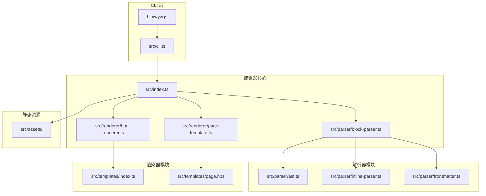
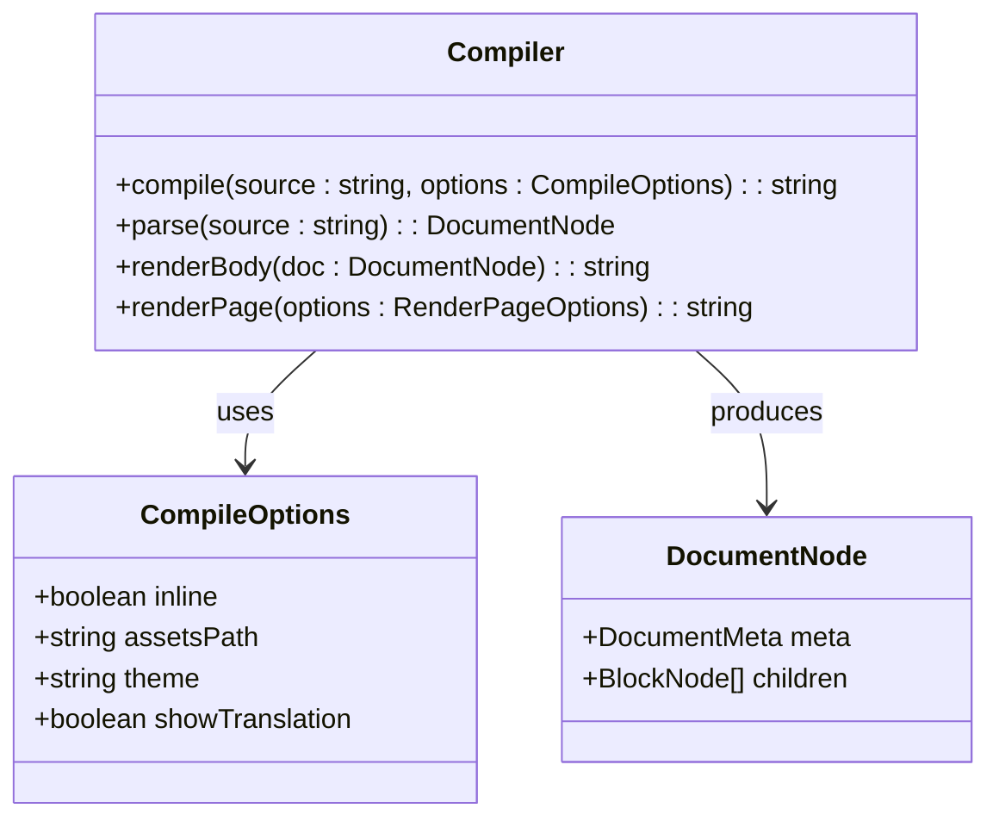
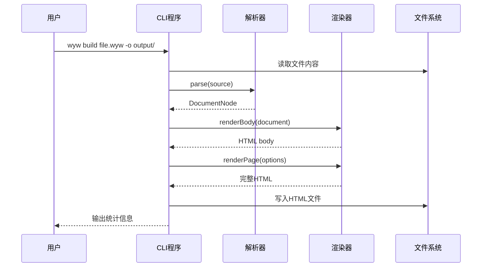
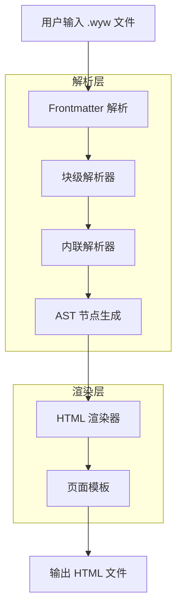
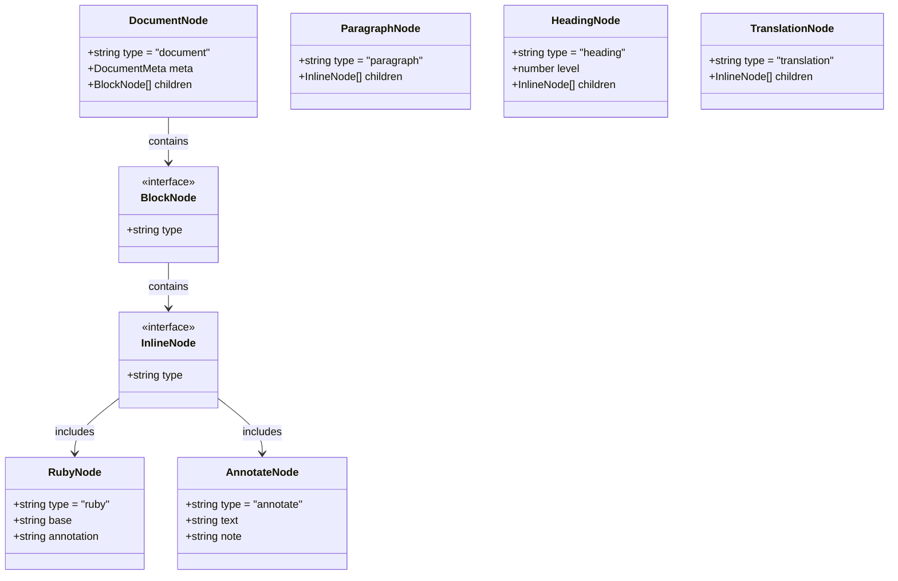
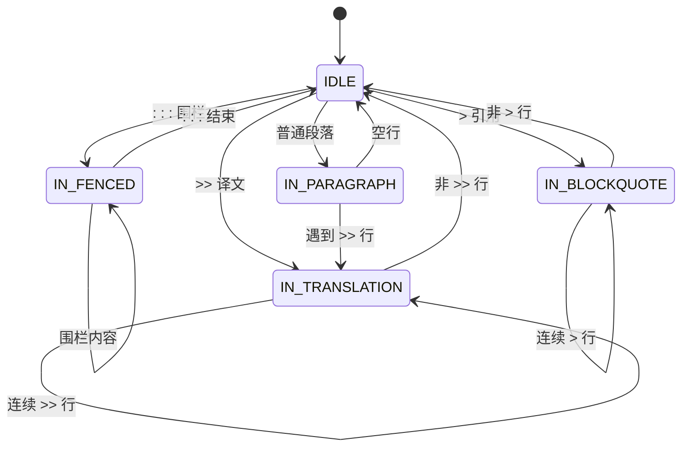
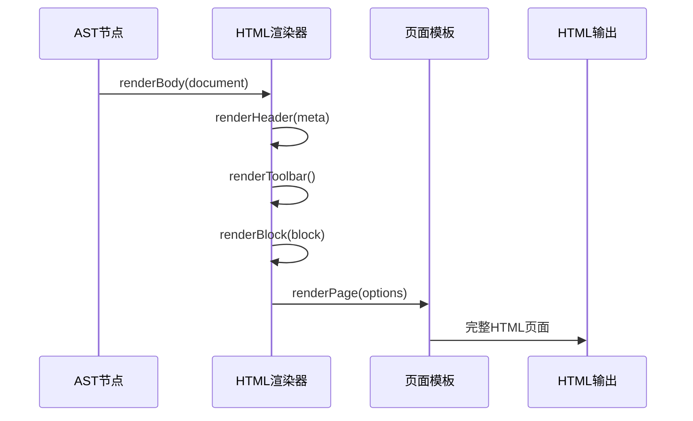

# 编译指南

<cite>
**本文档引用的文件**
- [README.md](file://README.md)
- [package.json](file://package.json)
- [tsconfig.json](file://tsconfig.json)
- [bin/wyw.js](file://bin/wyw.js)
- [src/index.ts](file://src/index.ts)
- [src/cli.ts](file://src/cli.ts)
- [src/parser/ast.ts](file://src/parser/ast.ts)
- [src/parser/block-parser.ts](file://src/parser/block-parser.ts)
- [src/parser/inline-parser.ts](file://src/parser/inline-parser.ts)
- [src/parser/frontmatter.ts](file://src/parser/frontmatter.ts)
- [src/renderer/html-renderer.ts](file://src/renderer/html-renderer.ts)
- [src/renderer/page-template.ts](file://src/renderer/page-template.ts)
- [src/templates/index.ts](file://src/templates/index.ts)
- [src/templates/page.hbs](file://src/templates/page.hbs)
- [src/validator.ts](file://src/validator.ts)
</cite>

## 目录
1. [简介](#简介)
2. [项目结构](#项目结构)
3. [核心组件](#核心组件)
4. [架构概览](#架构概览)
5. [详细组件分析](#详细组件分析)
6. [依赖关系分析](#依赖关系分析)
7. [性能考虑](#性能考虑)
8. [故障排除指南](#故障排除指南)
9. [结论](#结论)

## 简介

文言文标记语言编译器是一个专门用于将 `.wyw` 文件编译为精美排版 HTML 页面的工具。该项目支持注音标注、注释、译文等功能，为文言文阅读提供辅助功能。

主要功能特性包括：
- 注音标注：使用 Ruby 标注为汉字添加拼音
- 词语注释：悬停查看生词释义
- 现代文翻译：段落对照式译文展示
- 明暗主题：支持自动/浅色/深色主题切换
- 诗词围栏：专门的诗词排版支持
- 字体缩放：支持标准/中号/大号三种字号

## 项目结构

该项目采用模块化的 TypeScript 架构，主要分为以下几个核心模块：



**图表来源**
- [bin/wyw.js:1-7](file://bin/wyw.js#L1-L7)
- [src/cli.ts:1-182](file://src/cli.ts#L1-L182)
- [src/index.ts:1-57](file://src/index.ts#L1-L57)

**章节来源**
- [README.md:110-125](file://README.md#L110-L125)

## 核心组件

### 编译器主入口

编译器的核心入口提供了简洁的 API 接口，支持多种编译选项：



**图表来源**
- [src/index.ts:7-28](file://src/index.ts#L7-L28)
- [src/index.ts:56](file://src/index.ts#L56)

### 命令行界面

CLI 提供了丰富的命令行选项，支持批量编译、监听模式、主题设置等功能：



**图表来源**
- [src/cli.ts:116-164](file://src/cli.ts#L116-L164)

**章节来源**
- [src/index.ts:14-28](file://src/index.ts#L14-L28)
- [src/cli.ts:28-114](file://src/cli.ts#L28-L114)

## 架构概览

整个编译器采用分层架构设计，从底层的数据解析到上层的页面渲染形成了清晰的职责分离：



**图表来源**
- [src/parser/block-parser.ts:43-49](file://src/parser/block-parser.ts#L43-L49)
- [src/renderer/html-renderer.ts:20-44](file://src/renderer/html-renderer.ts#L20-L44)

## 详细组件分析

### AST 数据结构

编译器使用抽象语法树来表示 `.wyw` 文件的结构，支持多种节点类型：



**图表来源**
- [src/parser/ast.ts:55-118](file://src/parser/ast.ts#L55-L118)
- [src/parser/ast.ts:132-217](file://src/parser/ast.ts#L132-L217)

### 块级解析器

块级解析器实现了有限状态机来处理不同类型的块级元素：



**图表来源**
- [src/parser/block-parser.ts:27-38](file://src/parser/block-parser.ts#L27-L38)
- [src/parser/block-parser.ts:151-321](file://src/parser/block-parser.ts#L151-L321)

### 内联解析器

内联解析器按照优先级处理各种内联标记：

```mermaid
flowchart TD
A[输入文本] --> B{查找最早匹配}
B --> C[注音+注释组合<br/>[{字|拼音}{字}...](释义)]
B --> D[注音<br/>{字|拼音}]
B --> E[注释<br/>[文本](释义)]
B --> F[着重<br/>*文本*]
B --> G[无匹配]
C --> H[创建 RubyAnnotateNode]
D --> I[创建 RubyNode]
E --> J[创建 AnnotateNode]
F --> K[创建 EmphasisNode]
G --> L[创建TextNode]
H --> M[继续处理剩余文本]
I --> M
J --> M
K --> M
L --> N[完成解析]
M --> B
```

**图表来源**
- [src/parser/inline-parser.ts:22-46](file://src/parser/inline-parser.ts#L22-L46)
- [src/parser/inline-parser.ts:62-98](file://src/parser/inline-parser.ts#L62-L98)

### HTML 渲染器

HTML 渲染器负责将 AST 转换为最终的 HTML 输出：



**图表来源**
- [src/renderer/html-renderer.ts:20-44](file://src/renderer/html-renderer.ts#L20-L44)
- [src/renderer/page-template.ts:25-68](file://src/renderer/page-template.ts#L25-L68)

**章节来源**
- [src/parser/ast.ts:1-218](file://src/parser/ast.ts#L1-L218)
- [src/parser/block-parser.ts:1-371](file://src/parser/block-parser.ts#L1-L371)
- [src/parser/inline-parser.ts:1-99](file://src/parser/inline-parser.ts#L1-L99)
- [src/renderer/html-renderer.ts:1-251](file://src/renderer/html-renderer.ts#L1-L251)
- [src/renderer/page-template.ts:1-87](file://src/renderer/page-template.ts#L1-L87)

## 依赖关系分析

项目使用 TypeScript 和 Node.js 生态系统构建，主要依赖关系如下：

```mermaid
graph LR
subgraph "运行时依赖"
A[commander ^13.1.0] --> B[CLI命令解析]
C[handlebars ^4.7.9] --> D[模板引擎]
E[heti ^0.9.6] --> F[排版增强]
end
subgraph "开发依赖"
G[typescript ^6.0.3] --> H[TypeScript编译]
I[@types/node ^25.6.0] --> J[Node.js类型定义]
K[tsx ^4.21.0] --> L[测试运行]
end
subgraph "构建产物"
M[dist/] --> N[编译后的JavaScript]
O[bin/] --> P[可执行文件]
Q[assets/] --> R[静态资源]
end
```

**图表来源**
- [package.json:45-54](file://package.json#L45-L54)

**章节来源**
- [package.json:18-27](file://package.json#L18-L27)
- [tsconfig.json:2-15](file://tsconfig.json#L2-L15)

## 性能考虑

编译器在设计时考虑了以下性能优化：

1. **模板缓存**：Handlebars 模板编译结果会被缓存，避免重复编译
2. **增量编译**：CLI 支持监听模式，只重新编译发生变化的文件
3. **内存优化**：使用流式处理减少内存占用
4. **并行处理**：支持批量编译多个文件

## 故障排除指南

### 常见编译错误

1. **Frontmatter 未闭合**：检查 `---` 标记是否正确配对
2. **括号不匹配**：确保所有 `{}`、`[]`、`() `都正确闭合
3. **注音格式错误**：检查 `{字|拼音}` 格式是否正确
4. **围栏块未闭合**：确保 `:::poetry` 围栏正确配对

### 调试技巧

1. 使用 `validate` 命令检查文件格式
2. 启用 `--inline` 选项简化调试
3. 检查控制台输出的统计信息
4. 使用 `--watch` 模式实时查看编译结果

**章节来源**
- [src/cli.ts:91-112](file://src/cli.ts#L91-L112)
- [src/validator.ts:758-779](file://src/validator.ts#L758-L779)

## 结论

文言文标记语言编译器是一个结构清晰、功能完善的工具。其模块化的设计使得各个组件职责明确，易于维护和扩展。通过合理的架构设计和性能优化，该编译器能够高效地处理各种文言文格式，并生成美观的 HTML 页面。

项目的主要优势包括：
- 清晰的分层架构
- 完善的错误处理机制
- 灵活的配置选项
- 良好的扩展性