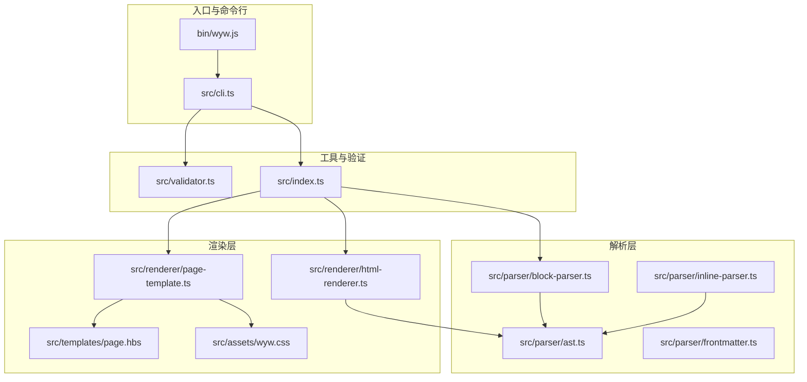
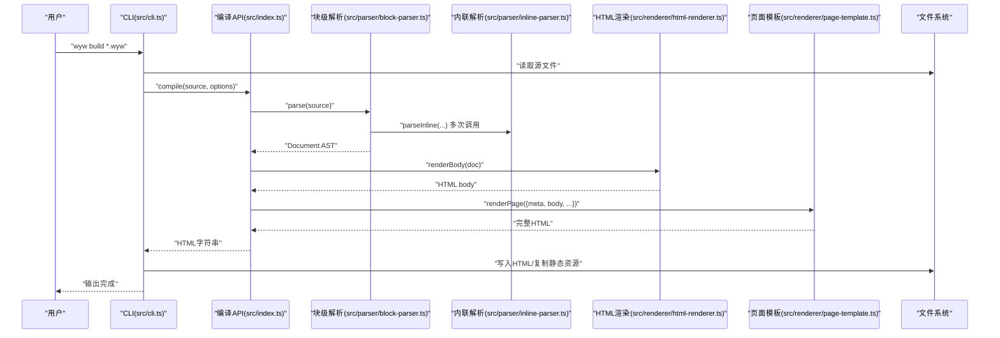
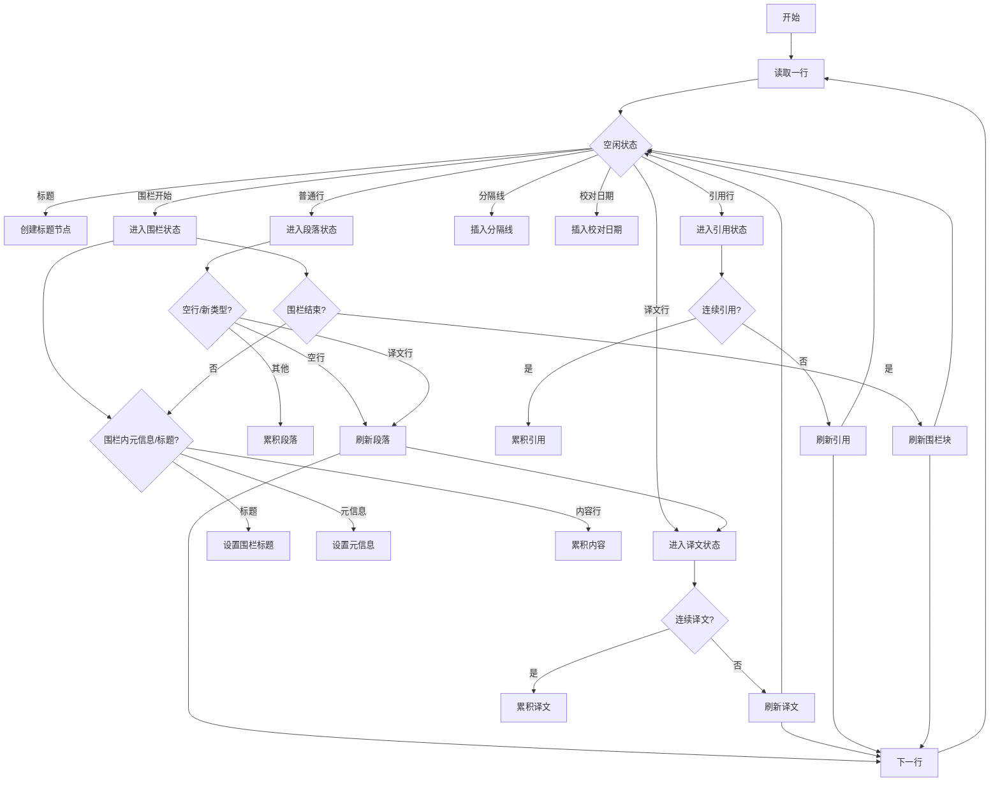
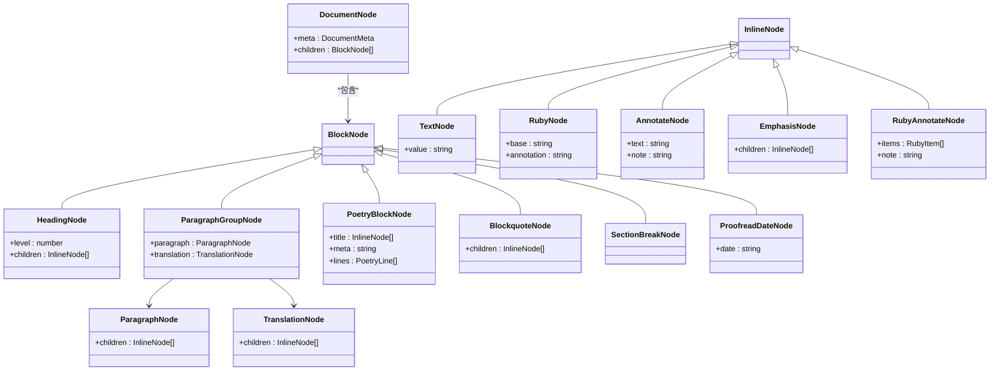
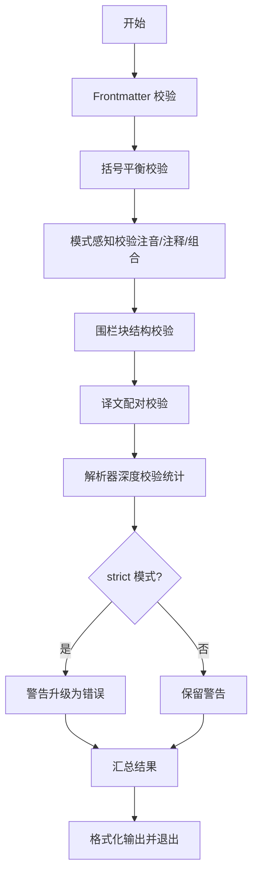
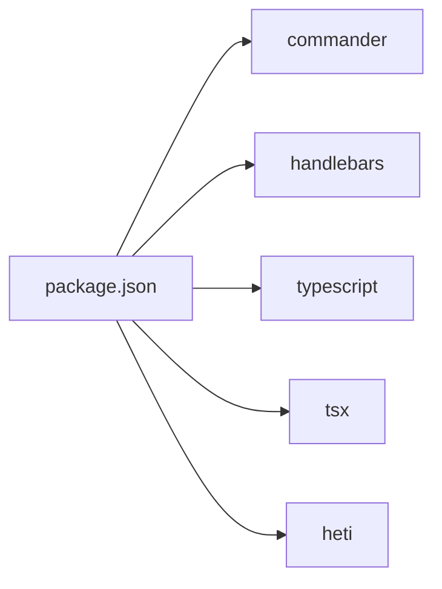

# 项目概述

<cite>
**本文档引用的文件**
- [README.md](file://README.md)
- [package.json](file://package.json)
- [src/index.ts](file://src/index.ts)
- [src/cli.ts](file://src/cli.ts)
- [src/parser/ast.ts](file://src/parser/ast.ts)
- [src/parser/block-parser.ts](file://src/parser/block-parser.ts)
- [src/parser/inline-parser.ts](file://src/parser/inline-parser.ts)
- [src/renderer/html-renderer.ts](file://src/renderer/html-renderer.ts)
- [src/renderer/page-template.ts](file://src/renderer/page-template.ts)
- [src/validator.ts](file://src/validator.ts)
- [src/templates/page.hbs](file://src/templates/page.hbs)
- [src/assets/wyw.css](file://src/assets/wyw.css)
- [bin/wyw.js](file://bin/wyw.js)
- [examples/范仲淹_岳阳楼记.wyw](file://examples/范仲淹_岳阳楼记.wyw)
- [test/parser.test.ts](file://test/parser.test.ts)
- [test/compile.test.ts](file://test/compile.test.ts)
- [docs/syntax-guide.md](file://docs/syntax-guide.md)
- [docs/compile-guide.md](file://docs/compile-guide.md)
</cite>

## 更新摘要
**所做更改**
- 更新项目名称从 "wenyanwen" 到 "wyw" 的完整迁移
- 更新版本信息从 0.1.0 到 0.1.5 的版本升级
- 增强项目成熟度描述，反映文档完善和工具链成熟
- 更新 CLI 命令和包管理器脚本中的项目名称
- 完善项目架构图和组件关系图

## 目录
1. [引言](#引言)
2. [项目结构](#项目结构)
3. [核心组件](#核心组件)
4. [架构总览](#架构总览)
5. [详细组件分析](#详细组件分析)
6. [依赖关系分析](#依赖关系分析)
7. [性能考量](#性能考量)
8. [故障排查指南](#故障排查指南)
9. [结论](#结论)
10. [附录](#附录)

## 引言
本项目是一个"文言文标记语言编译器"，其核心目标是将 `.wyw` 格式的文言文源文件编译为排版精美、交互友好的 HTML 页面。该编译器围绕"注音""注释""译文"三大阅读辅助能力展开，辅以诗词围栏、主题切换、字体缩放等特性，帮助读者更高效地理解与欣赏古典文献。

**项目名称变更**：项目已从 "wenyanwen" 正式更名为 "wyw"，体现了项目的专业化和品牌化发展。

**版本升级**：项目已升级至 0.1.5 版本，标志着项目进入稳定发展阶段，功能更加完善，文档更加健全。

**价值主张**
- 降低文言文学习门槛：通过注音、注释、译文三位一体的呈现，实现"无障碍阅读"
- 提升阅读体验：明暗主题、字体缩放、围栏诗词等设计，兼顾学术性与可读性
- 工具链闭环：内置 CLI、验证器、模板系统与静态资源，开箱即用

**适用场景**
- 教育领域：教师备课、学生自学、课堂演示
- 文化传播：个人文集发布、文化网站内容生产
- 文献整理：古籍数字化、注疏与校勘辅助

**与同类工具的区别**
- 专注"阅读辅助"的语法设计：以 `{字|拼音}`、`[词](释义)`、`>> 译文` 为核心，贴合中文语境
- 严格的解析与验证：双轨解析（块级/内联）+ 多维验证（括号平衡、注音规范、围栏结构、译文配对等）
- 可插拔的渲染与主题：基于 CSS 变量的主题系统，支持自动/浅色/深色切换

**章节来源**
- [README.md:1-130](file://README.md#L1-L130)
- [package.json:1-56](file://package.json#L1-L56)

## 项目结构
项目采用"模块化 + 分层架构"组织代码，核心分为四层：
- 入口与命令行层：CLI 解析参数、调度编译流程
- 解析层：将 `.wyw` 文本解析为 AST（块级/内联）
- 渲染层：将 AST 渲染为 HTML，并注入模板与静态资源
- 工具与验证层：格式验证、统计与辅助脚本

**图表来源**
- [bin/wyw.js:1-7](file://bin/wyw.js#L1-L7)
- [src/cli.ts:1-182](file://src/cli.ts#L1-L182)
- [src/index.ts:1-57](file://src/index.ts#L1-L57)
- [src/parser/ast.ts:1-218](file://src/parser/ast.ts#L1-L218)
- [src/parser/block-parser.ts:1-371](file://src/parser/block-parser.ts#L1-L371)
- [src/parser/inline-parser.ts:1-99](file://src/parser/inline-parser.ts#L1-L99)
- [src/renderer/html-renderer.ts:1-251](file://src/renderer/html-renderer.ts#L1-L251)
- [src/renderer/page-template.ts:1-87](file://src/renderer/page-template.ts#L1-L87)
- [src/templates/page.hbs:1-17](file://src/templates/page.hbs#L1-L17)
- [src/assets/wyw.css:1-200](file://src/assets/wyw.css#L1-L200)
- [src/validator.ts:1-804](file://src/validator.ts#L1-L804)

**章节来源**
- [README.md:110-129](file://README.md#L110-L129)
- [package.json:1-56](file://package.json#L1-L56)

## 核心组件
- 编译入口与公共 API
  - 提供统一编译函数，串联解析与渲染，并支持内联/外链资源、主题与译文可见性等选项
  - 导出类型定义，便于上层工具集成

- 命令行工具
  - 支持构建、初始化模板、验证格式等子命令
  - 支持监听模式、主题与译文默认行为配置

- 解析器
  - AST 定义覆盖文档元信息、块级节点（标题、段落、译文、围栏、引用、分隔线、校对日期）与内联节点（文本、注音、注释、强调、注音+注释组合）
  - 块级解析器采用有限状态机，按行识别并累积内容，再进行段落与译文配对
  - 内联解析器按优先级扫描，支持注音+注释组合、注音、注释、强调等

- 渲染器
  - HTML 渲染器将 AST 转为 HTML 片段，包含工具栏、正文与诗词围栏等
  - 页面模板负责包裹完整 HTML，支持内联/外链资源与主题注入

- 验证器
  - 多维度校验：Frontmatter、括号平衡、注音/注释/注音+注释模式、围栏块结构、译文配对、解析器深度校验
  - 支持严格模式，将提示升级为错误

**章节来源**
- [src/index.ts:1-57](file://src/index.ts#L1-L57)
- [src/cli.ts:1-182](file://src/cli.ts#L1-L182)
- [src/parser/ast.ts:1-218](file://src/parser/ast.ts#L1-L218)
- [src/parser/block-parser.ts:1-371](file://src/parser/block-parser.ts#L1-L371)
- [src/parser/inline-parser.ts:1-99](file://src/parser/inline-parser.ts#L1-L99)
- [src/renderer/html-renderer.ts:1-251](file://src/renderer/html-renderer.ts#L1-L251)
- [src/renderer/page-template.ts:1-87](file://src/renderer/page-template.ts#L1-L87)
- [src/validator.ts:1-804](file://src/validator.ts#L1-L804)

## 架构总览
编译流程自底向上分为"解析—渲染—模板"三层，CLI 作为编排入口，验证器贯穿开发与质量控制阶段。

**图表来源**
- [src/cli.ts:116-164](file://src/cli.ts#L116-L164)
- [src/index.ts:17-28](file://src/index.ts#L17-L28)
- [src/parser/block-parser.ts:43-49](file://src/parser/block-parser.ts#L43-L49)
- [src/renderer/html-renderer.ts:20-44](file://src/renderer/html-renderer.ts#L20-L44)
- [src/renderer/page-template.ts:25-68](file://src/renderer/page-template.ts#L25-L68)

## 详细组件分析

### 解析器：AST 与解析流程
- AST 设计
  - 文档元信息（标题、作者、朝代）
  - 块级节点：标题、段落、译文、段落组、围栏块（诗词）、引用、分隔线、校对日期
  - 内联节点：文本、注音、注释、强调、注音+注释组合（支持多字）

- 块级解析（有限状态机）
  - 状态：空闲、段落、译文、围栏、引用
  - 行级识别：标题、译文、引用、分隔线、校对日期、围栏块起止
  - 段落与译文配对：相邻 paragraph 与 translation 自动合并为 paragraph_group

- 内联解析（优先级扫描）
  - 优先级：注音+注释组合 > 注音 > 注释 > 强调
  - 注音+注释组合：内部可含多个 {字|拼音}，共享同一释义

**图表来源**
- [src/parser/block-parser.ts:72-341](file://src/parser/block-parser.ts#L72-L341)

**章节来源**
- [src/parser/ast.ts:1-218](file://src/parser/ast.ts#L1-L218)
- [src/parser/block-parser.ts:1-371](file://src/parser/block-parser.ts#L1-L371)
- [src/parser/inline-parser.ts:1-99](file://src/parser/inline-parser.ts#L1-L99)

### 渲染器：HTML 与模板
- HTML 渲染
  - 文档头部：当不存在带标题的诗词围栏时才渲染标题/作者/朝代
  - 工具栏：译文显隐、字体大小、主题切换
  - 正文：段落组（原文+译文）、标题、引用、分隔线、校对日期、诗词围栏（含小节标题与分行）

- 页面模板
  - Handlebars 模板，注入标题、主题、文章类名、内联/外链 CSS/JS
  - 支持将 CSS/JS 内联到 HTML，便于离线使用

**图表来源**
- [src/parser/ast.ts:55-118](file://src/parser/ast.ts#L55-L118)
- [src/parser/ast.ts:132-217](file://src/parser/ast.ts#L132-L217)

**章节来源**
- [src/renderer/html-renderer.ts:1-251](file://src/renderer/html-renderer.ts#L1-L251)
- [src/renderer/page-template.ts:1-87](file://src/renderer/page-template.ts#L1-L87)
- [src/templates/page.hbs:1-17](file://src/templates/page.hbs#L1-L17)

### 验证器：多维校验与严格模式
- 校验维度
  - Frontmatter：完整性、必填字段、未知字段
  - 括号平衡：大括号、方括号、圆括号与星号成对性
  - 模式感知：注音、注释、注音+注释组合的语义校验
  - 围栏块：起止配对、元信息非空、类型支持
  - 译文配对：译文前必须有原文段落
  - 解析器深度校验：统计段落数、诗词块数、标题数、注释数、注音数

- 输出与退出码
  - 格式化输出错误/提示
  - 有错误时退出码非零，便于 CI 集成

**图表来源**
- [src/validator.ts:742-762](file://src/validator.ts#L742-L762)

**章节来源**
- [src/validator.ts:1-804](file://src/validator.ts#L1-L804)

### CLI：命令与工作流
- 子命令
  - build：编译单/多文件，支持输出目录、内联资源、监听模式、主题与译文默认行为
  - init：生成模板文件
  - validate：格式验证，支持严格模式

- 统计与复制
  - 统计段落数、注释数、注音数
  - 非内联模式时复制 CSS/JS/Favicon 到输出目录

**章节来源**
- [src/cli.ts:28-114](file://src/cli.ts#L28-L114)
- [src/cli.ts:116-182](file://src/cli.ts#L116-L182)

## 依赖关系分析
- 运行时依赖
  - commander：命令行参数解析
  - handlebars：页面模板引擎

- 开发依赖
  - typescript、tsx：类型系统与测试执行
  - heti：排版基础样式库（通过复制其产物到 assets）

- 构建与脚本
  - postinstall：复制 heti-addon 到 assets
  - build：TypeScript 编译、复制模板与静态资源
  - test：使用 tsx 执行测试
  - build:examples：一键编译示例

**图表来源**
- [package.json:44-54](file://package.json#L44-L54)

**章节来源**
- [package.json:1-56](file://package.json#L1-L56)

## 性能考量
- 解析效率
  - 块级解析为 O(N) 行扫描，状态切换与缓冲区累积，整体线性
  - 内联解析按优先级扫描，最坏 O(K×M)（K 为行数，M 为模式数量），但实际命中率高，常数较小

- 渲染效率
  - HTML 渲染为线性遍历 AST，字符串拼接为主，内存占用与输出大小线性相关
  - 主题切换与字体缩放由 CSS 变量驱动，无需重排

- 资源加载
  - 内联模式减少 HTTP 请求，适合离线/静态部署
  - 外链模式减小 HTML 体积，利于 CDN 加速

- 建议
  - 大批量编译时优先使用外链资源，减少内存峰值
  - 严格模式仅在 CI/预提交时启用，避免本地开发阻塞

## 故障排查指南
- 常见问题与定位
  - Frontmatter 未闭合：检查首尾 `---`
  - 注音/注释语法错误：核对 `{字|拼音}`、`[词](释义)`、`[{...}](释义)` 的嵌套与成对
  - 围栏块未闭合：确保 `::: poetry` 成对出现
  - 译文前无原文：确认 `>>` 前存在非标记段落
  - 括号交叉/多余闭合：使用验证器输出的行列信息定位

- 建议流程
  - 使用 `wyw validate` 获取详细错误/提示
  - 逐步缩小范围：先注释可疑段落，再恢复
  - 使用严格模式加速定位

**章节来源**
- [src/validator.ts:104-179](file://src/validator.ts#L104-L179)
- [src/validator.ts:182-259](file://src/validator.ts#L182-L259)
- [src/validator.ts:262-548](file://src/validator.ts#L262-L548)
- [src/validator.ts:551-610](file://src/validator.ts#L551-L610)
- [src/validator.ts:613-675](file://src/validator.ts#L613-L675)
- [src/validator.ts:678-739](file://src/validator.ts#L678-L739)

## 结论
本项目以"注音—注释—译文"为核心，结合严谨的解析与验证机制，提供了从源码到精美 HTML 的完整工具链。其模块化设计与可插拔渲染体系，既满足教学与文化传播的广泛需求，也为后续扩展（如多语言支持、交互增强）预留空间。随着项目名称正式更改为 "wyw" 并升级至 0.1.5 版本，项目展现出更高的专业性和成熟度，建议在团队协作中配合严格模式与自动化测试，持续保障内容质量与一致性。

## 附录
- 示例文件
  - 示例展示了注音、注释、译文、围栏诗词等语法的实际应用

- 测试用例
  - 覆盖解析、编译、渲染与示例文件的端到端验证

**章节来源**
- [examples/范仲淹_岳阳楼记.wyw:1-31](file://examples/范仲淹_岳阳楼记.wyw#L1-L31)
- [test/parser.test.ts:1-283](file://test/parser.test.ts#L1-L283)
- [test/compile.test.ts:1-210](file://test/compile.test.ts#L1-L210)